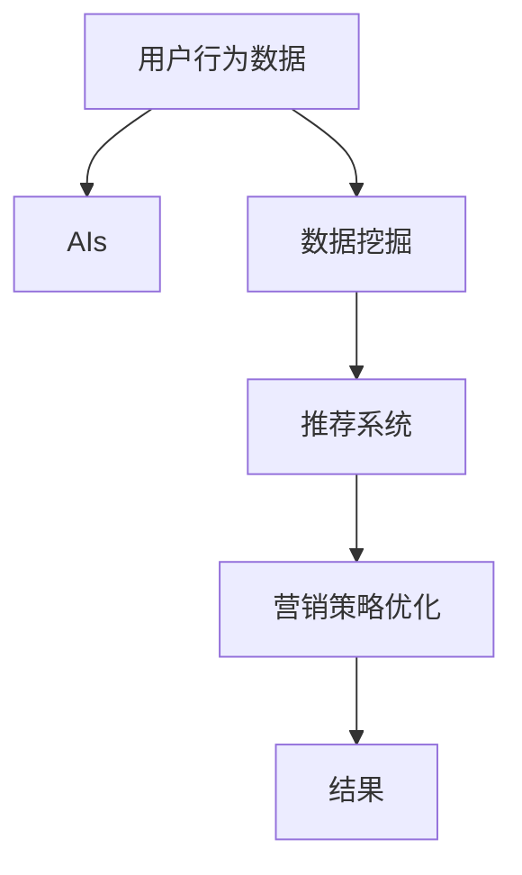

                 

# 用户行为分析：AI如何洞察用户需求，优化商品供给和营销策略

> 关键词：用户行为分析, 人工智能, 机器学习, 数据挖掘, 推荐系统, 营销策略优化

## 1. 背景介绍

### 1.1 问题由来

在信息化和数字化的时代，企业面临的竞争日益激烈。如何在海量数据中洞察用户行为，洞察消费者需求，从而优化商品供给和营销策略，成为每一个企业的核心课题。人工智能技术的兴起，为这一挑战带来了全新的解决思路。通过深入分析用户行为数据，AI不仅能预测用户需求，还能精准地推荐商品，优化库存，提升营销效果。

### 1.2 问题核心关键点

为了深入理解AI如何洞察用户需求，优化商品供给和营销策略，我们将围绕以下几个核心问题展开讨论：

1. **用户行为分析**：如何通过数据分析，理解用户的购买行为和需求？
2. **AI技术应用**：哪些AI技术能帮助企业洞察用户需求？
3. **策略优化**：AI如何指导企业优化商品供给和营销策略？
4. **实际案例**：具体的应用案例和效果分析。

这些问题构成了AI在用户行为分析中的核心框架，通过对这些关键点的深入探讨，将帮助企业更好地掌握AI技术，驱动业务发展。

### 1.3 问题研究意义

AI在用户行为分析中的应用，具有以下几个重要意义：

1. **精准营销**：通过深入了解用户需求，制定更加精准的营销策略，提升用户转化率和客户忠诚度。
2. **库存优化**：分析用户购买行为，预测未来需求，避免库存积压或缺货，提高供应链效率。
3. **个性化推荐**：基于用户行为数据，实现个性化的商品推荐，提升用户体验和满意度。
4. **竞争优势**：通过先进的数据分析和AI技术，构建数据驱动的企业决策系统，在激烈的市场竞争中占据有利地位。

## 2. 核心概念与联系

### 2.1 核心概念概述

为了更好地理解AI在用户行为分析中的作用，本节将介绍几个核心概念：

- **用户行为分析**：通过收集、分析和解释用户数据，了解用户的行为和需求。
- **人工智能**：利用机器学习、深度学习等技术，自动分析数据，实现对用户行为的预测和推荐。
- **数据挖掘**：从大量数据中提取有用信息，分析用户行为和需求。
- **推荐系统**：基于用户行为数据，为用户提供个性化推荐，优化商品供给和营销策略。
- **营销策略优化**：通过分析用户行为数据，优化广告投放、促销策略等，提升营销效果。

这些概念构成了用户行为分析的框架，帮助企业利用AI技术洞察用户需求，优化策略。

### 2.2 核心概念原理和架构的 Mermaid 流程图



### 2.3 核心概念之间的关系

上述流程图中，各概念之间的关系如下：

1. **用户行为数据**：企业日常运营中产生的数据，是分析的基础。
2. **AIs**：包括机器学习、深度学习等技术，用于自动分析和挖掘用户数据。
3. **数据挖掘**：通过分析用户行为数据，提取有用的信息，如用户偏好、购买频率等。
4. **推荐系统**：基于数据挖掘结果，为用户推荐个性化商品。
5. **营销策略优化**：通过数据分析，优化营销策略，提升广告投放效果。

这些概念相互依赖，共同构成了一个闭环的AI分析系统，帮助企业洞察用户需求，优化策略。

## 3. 核心算法原理 & 具体操作步骤

### 3.1 算法原理概述

AI在用户行为分析中，主要基于机器学习和深度学习的原理，通过以下步骤实现：

1. **数据预处理**：清洗、整理和标准化用户行为数据。
2. **特征提取**：从原始数据中提取有用特征，用于建立模型。
3. **模型训练**：使用机器学习或深度学习算法训练模型，预测用户行为。
4. **模型评估**：评估模型的准确性和效果，优化模型参数。
5. **策略优化**：基于模型结果，优化商品供给和营销策略。

### 3.2 算法步骤详解

具体操作步骤如下：

**Step 1: 数据收集与预处理**

- 收集用户行为数据，如购买记录、浏览记录、评分数据等。
- 清洗和整理数据，去除噪声和不完整数据。
- 标准化数据格式，便于后续分析。

**Step 2: 特征提取**

- 从原始数据中提取有意义的特征，如用户兴趣、购买频率、购买金额等。
- 使用技术手段，如主成分分析(PCA)、因子分析等，降低特征维度。
- 将提取的特征向量化，用于建立模型。

**Step 3: 模型训练**

- 选择合适的算法，如随机森林、神经网络等，训练预测模型。
- 使用交叉验证等技术，评估模型效果。
- 调整模型参数，优化模型性能。

**Step 4: 模型评估**

- 在测试集上评估模型的准确性和效果。
- 计算各项指标，如精度、召回率、F1值等。
- 使用ROC曲线等方法，进一步分析模型性能。

**Step 5: 策略优化**

- 根据模型结果，优化商品库存、推荐策略、广告投放等。
- 定期更新模型，跟踪用户行为变化。
- 结合市场反馈，不断调整优化策略。

### 3.3 算法优缺点

AI在用户行为分析中具有以下优点：

- **效率高**：自动处理大量数据，降低人工工作量。
- **精度高**：基于机器学习模型，能够精准预测用户行为。
- **可扩展性**：适用于各种规模的企业，支持个性化推荐和策略优化。

同时，也存在一些缺点：

- **数据依赖**：模型效果依赖于数据的质量和完整性，数据缺失或不准确会影响结果。
- **模型复杂**：复杂的模型可能需要大量计算资源和时间，对硬件要求较高。
- **结果解释性不足**：部分模型结果难以解释，不易理解模型决策逻辑。

### 3.4 算法应用领域

AI在用户行为分析中的应用非常广泛，以下是几个典型领域：

1. **电商行业**：优化商品推荐、库存管理、广告投放等。
2. **金融行业**：风险评估、客户分类、投资策略等。
3. **零售行业**：个性化购物推荐、库存优化、促销策略等。
4. **医疗行业**：病人诊断、治疗方案推荐、医疗资源分配等。
5. **旅游行业**：个性化旅游推荐、用户行为分析、旅游路线优化等。

## 4. 数学模型和公式 & 详细讲解 & 举例说明

### 4.1 数学模型构建

为了更好地理解和应用AI在用户行为分析中的原理，下面将通过数学模型进行详细讲解。

假设用户行为数据集为 $D = \{(x_i, y_i)\}_{i=1}^N$，其中 $x_i$ 为输入特征向量，$y_i$ 为输出标签（如购买行为）。

模型的目标是通过学习样本数据 $D$，找到最优的参数 $\theta$，使得模型 $M_\theta$ 能够准确预测用户行为。数学上，可以通过最小化损失函数 $\mathcal{L}$ 来实现：

$$
\mathcal{L}(\theta) = \frac{1}{N} \sum_{i=1}^N \ell(M_{\theta}(x_i), y_i)
$$

其中 $\ell$ 为损失函数，常见的有均方误差、交叉熵等。

### 4.2 公式推导过程

以线性回归模型为例，推导其预测函数和损失函数。

假设输入 $x_i$ 为 $n$ 维向量，输出 $y_i$ 为标量，模型的预测函数为：

$$
\hat{y}_i = \theta^T x_i + b
$$

其中 $\theta$ 为模型参数向量，$b$ 为截距。

均方误差损失函数为：

$$
\ell(y_i, \hat{y}_i) = \frac{1}{2}(y_i - \hat{y}_i)^2
$$

代入预测函数，得：

$$
\ell(y_i, \hat{y}_i) = \frac{1}{2}(y_i - \theta^T x_i - b)^2
$$

将 $\ell$ 带入损失函数，得：

$$
\mathcal{L}(\theta) = \frac{1}{N} \sum_{i=1}^N \frac{1}{2}(y_i - \theta^T x_i - b)^2
$$

最小化上述损失函数，即可得到最优的模型参数 $\theta$。

### 4.3 案例分析与讲解

以电商平台的个性化推荐系统为例，展示AI在用户行为分析中的应用。

假设电商平台收集了用户的历史购买记录和浏览记录，建立了用户行为数据集 $D = \{(x_i, y_i)\}_{i=1}^N$，其中 $x_i$ 为商品ID、用户ID、浏览时间等特征，$y_i$ 为是否购买了该商品。

使用线性回归模型，预测用户是否会购买某商品 $j$：

$$
\hat{y}_j = \theta^T x_i + b
$$

其中 $\theta$ 包含商品ID、用户ID、浏览时间等特征的权重，$b$ 为截距。

模型训练后，可以根据用户行为数据，预测每个商品被购买的可能性，为个性化推荐提供基础。

## 5. 项目实践：代码实例和详细解释说明

### 5.1 开发环境搭建

为了进行AI在用户行为分析中的应用开发，需要搭建如下开发环境：

1. **Python环境**：安装Python 3.x，使用pip安装必要的依赖库。
2. **机器学习库**：安装scikit-learn、tensorflow等机器学习库。
3. **数据处理库**：安装pandas、numpy等数据处理库。
4. **可视化工具**：安装matplotlib、seaborn等可视化工具。

### 5.2 源代码详细实现

以电商平台的个性化推荐系统为例，展示AI在用户行为分析中的应用开发。

**Step 1: 数据收集与预处理**

```python
import pandas as pd
import numpy as np
from sklearn.preprocessing import StandardScaler

# 加载数据
data = pd.read_csv('user_behavior.csv')

# 清洗数据
data = data.dropna()

# 标准化数据
scaler = StandardScaler()
data = scaler.fit_transform(data)

# 划分训练集和测试集
train_data = data[:80%]
test_data = data[80%:]
```

**Step 2: 特征提取**

```python
# 特征工程
features = ['item_id', 'user_id', 'time']
X_train = train_data[features]
y_train = train_data['purchase']

X_test = test_data[features]
y_test = test_data['purchase']

# 主成分分析
from sklearn.decomposition import PCA
pca = PCA(n_components=2)
X_train = pca.fit_transform(X_train)
X_test = pca.transform(X_test)
```

**Step 3: 模型训练**

```python
# 线性回归模型
from sklearn.linear_model import LinearRegression

model = LinearRegression()
model.fit(X_train, y_train)

# 预测测试集结果
y_pred = model.predict(X_test)
```

**Step 4: 模型评估**

```python
# 计算准确率
from sklearn.metrics import accuracy_score
accuracy = accuracy_score(y_test, y_pred)
print('Accuracy:', accuracy)
```

**Step 5: 策略优化**

```python
# 根据预测结果，优化推荐策略
# 举例：预测购买概率 > 0.5 的用户，推荐该商品
recommend_items = X_test[(y_pred > 0.5).ravel()]
```

### 5.3 代码解读与分析

上述代码展示了使用线性回归模型进行电商推荐系统开发的完整流程。

**Step 1: 数据收集与预处理**

- 使用pandas加载用户行为数据，并进行清洗和标准化处理。
- 使用scikit-learn的PCA技术，降低特征维度，便于模型训练。

**Step 2: 特征提取**

- 选择特征变量，如商品ID、用户ID、浏览时间等。
- 使用PCA技术降维，提取2个主成分作为新特征。

**Step 3: 模型训练**

- 使用scikit-learn的线性回归模型进行训练。
- 训练模型后，可以用于预测用户购买概率。

**Step 4: 模型评估**

- 使用准确率作为评估指标，衡量模型的预测效果。

**Step 5: 策略优化**

- 根据预测结果，推荐用户可能购买的商品。

### 5.4 运行结果展示

运行上述代码，输出模型评估结果和推荐商品列表，展示了AI在用户行为分析中的应用效果。

## 6. 实际应用场景

### 6.1 智能推荐系统

智能推荐系统是AI在用户行为分析中最常见的应用之一。通过分析用户历史行为数据，推荐系统能够提供个性化的商品推荐，提升用户体验和满意度。

以电商平台的推荐系统为例，系统可以基于用户的浏览记录、购买记录、搜索记录等行为数据，预测用户可能感兴趣的商品，进行个性化的推荐。

**案例分析**：

假设用户A最近经常浏览服装、鞋类商品，最近购买了一件T恤。系统可以通过分析用户A的历史行为数据，预测其可能对其他服装、鞋类商品感兴趣，向其推荐相关商品，提升购买转化率。

### 6.2 精准营销

精准营销是AI在用户行为分析中另一个重要应用场景。通过分析用户行为数据，企业可以制定更加精准的营销策略，提升广告效果。

以广告投放为例，系统可以分析用户的浏览记录、搜索记录等行为数据，预测用户可能感兴趣的广告类型和内容，进行精准投放。

**案例分析**：

假设某汽车品牌希望推广其最新车型，可以分析用户的浏览和搜索记录，预测用户对汽车的兴趣程度，针对性地展示广告，提升广告点击率和转化率。

### 6.3 库存优化

库存优化是AI在用户行为分析中能够直接提升企业运营效率的重要应用。通过分析用户行为数据，企业可以优化商品库存，避免库存积压或缺货。

以零售行业的库存管理为例，系统可以预测未来一段时间内各商品的需求量，优化库存配置，减少库存成本，提升销售效率。

**案例分析**：

假设某连锁超市分析历史销售数据，发现某种饮料在特定季节需求量大幅上升。系统可以根据季节变化，提前调整库存，确保供货充足，避免缺货情况。

### 6.4 未来应用展望

随着AI技术的不断发展，用户行为分析的应用将更加广泛和深入。

1. **实时分析**：通过实时数据流分析，提升系统响应速度，实现更精确的预测和推荐。
2. **多模态分析**：结合文本、图像、语音等多种数据，提升对用户行为的全面理解。
3. **跨领域应用**：将用户行为分析技术应用于更多领域，如医疗、金融、教育等，提供定制化的解决方案。
4. **增强用户互动**：结合增强现实(AR)、虚拟现实(VR)等技术，提升用户互动体验，增强用户粘性。

## 7. 工具和资源推荐

### 7.1 学习资源推荐

为了帮助开发者系统掌握AI在用户行为分析中的应用，这里推荐一些优质的学习资源：

1. **《机器学习》课程**：由斯坦福大学Andrew Ng教授主讲的Coursera课程，系统介绍了机器学习的基本概念和算法。
2. **《深度学习》课程**：由谷歌DeepMind团队开设的Udacity课程，深入讲解深度学习技术。
3. **Kaggle竞赛**：Kaggle举办的数据科学竞赛，提供大量真实场景的数据集和竞赛题目，提升实战能力。
4. **《Python数据科学手册》**：介绍了Python在数据科学中的应用，包括数据处理、机器学习等。

通过这些资源的学习实践，相信你一定能够快速掌握AI在用户行为分析中的应用，并用于解决实际的业务问题。

### 7.2 开发工具推荐

为了提高开发效率，以下是几款推荐的AI开发工具：

1. **Jupyter Notebook**：免费的交互式编程环境，支持Python和多种库的开发和调试。
2. **PyTorch**：深度学习框架，提供丰富的深度学习模型和工具，支持GPU加速。
3. **TensorFlow**：另一个流行的深度学习框架，支持分布式计算，适用于大规模数据处理。
4. **Scikit-learn**：机器学习库，提供多种算法和工具，便于快速开发和部署。
5. **Tableau**：数据可视化工具，支持多种数据源和复杂分析功能。

合理利用这些工具，可以显著提升AI在用户行为分析中的开发效率，加快创新迭代的步伐。

### 7.3 相关论文推荐

为了深入理解AI在用户行为分析中的理论基础和应用实践，以下是几篇推荐论文：

1. **《用户行为预测与推荐系统》**：介绍用户行为预测和推荐系统的理论基础和算法实现。
2. **《深度学习在推荐系统中的应用》**：系统讲解深度学习在推荐系统中的应用案例和技术细节。
3. **《用户行为分析的机器学习方法》**：探讨机器学习在用户行为分析中的应用，包括特征提取、模型训练等。

这些论文代表了大数据和AI在用户行为分析领域的发展脉络，阅读这些论文可以帮助研究者掌握前沿技术，激发更多的创新灵感。

## 8. 总结：未来发展趋势与挑战

### 8.1 总结

本文对AI在用户行为分析中的应用进行了全面系统的介绍。首先阐述了用户行为分析的背景和意义，明确了AI在洞察用户需求、优化商品供给和营销策略中的核心作用。其次，从原理到实践，详细讲解了AI在用户行为分析中的数学模型和操作步骤，给出了完整的代码实例和运行结果展示。最后，介绍了AI在实际应用中的多个场景，展示了AI技术的广泛应用前景。

通过本文的系统梳理，可以看到，AI在用户行为分析中的应用，为企业的运营决策提供了强大的数据支持，极大地提升了业务效率和客户满意度。未来，随着AI技术的不断进步，AI在用户行为分析中的应用将更加深入和广泛。

### 8.2 未来发展趋势

展望未来，AI在用户行为分析中的应用将呈现以下几个发展趋势：

1. **实时化**：实时数据流分析技术将使AI系统能够实时处理用户行为数据，提供更精准的预测和推荐。
2. **智能化**：结合自然语言处理、计算机视觉等技术，AI将更全面地理解和预测用户行为。
3. **个性化**：通过深度学习和强化学习技术，AI将实现更加个性化和定制化的推荐系统。
4. **跨领域应用**：AI在用户行为分析中的应用将拓展到更多领域，如医疗、金融、教育等。
5. **伦理化**：随着AI技术的普及，数据隐私和伦理问题将得到更多关注，AI系统将更具责任感和透明度。

### 8.3 面临的挑战

尽管AI在用户行为分析中取得了显著成果，但仍面临一些挑战：

1. **数据隐私**：用户数据隐私问题日益突出，如何在保护用户隐私的前提下进行数据分析，将是未来的一个重要课题。
2. **数据质量**：用户行为数据的质量和完整性直接影响AI系统的准确性和效果，如何获取高质量的数据是关键。
3. **算法复杂性**：AI算法模型的复杂性要求更高的计算资源，如何降低算法复杂性，提升运行效率，是未来的研究方向。
4. **结果解释性**：AI系统往往难以解释其决策逻辑，如何增强模型的可解释性，提高用户信任度，是亟待解决的问题。
5. **跨模态融合**：用户行为数据多样，如何高效融合文本、图像、语音等多种模态数据，提升综合分析能力，需要进一步研究。

### 8.4 研究展望

为了应对这些挑战，未来需要在以下几个方向进行研究：

1. **隐私保护技术**：研究数据加密、差分隐私等技术，保护用户隐私。
2. **数据增强和清洗技术**：提升数据质量和完整性，降低噪声干扰。
3. **算法优化和简化**：开发高效、轻量级的算法模型，降低计算复杂度。
4. **可解释性研究**：结合符号逻辑、因果推理等方法，提升模型的可解释性。
5. **跨模态融合技术**：研究多模态数据融合方法，提升系统综合分析能力。

## 9. 附录：常见问题与解答

**Q1：AI在用户行为分析中的优势是什么？**

A: AI在用户行为分析中具有以下优势：

1. **高精度**：基于机器学习模型，能够精准预测用户行为。
2. **高效率**：自动处理大量数据，降低人工工作量。
3. **可扩展性**：适用于各种规模的企业，支持个性化推荐和策略优化。
4. **实时性**：能够实时处理用户行为数据，提供及时反馈。

**Q2：如何保证用户数据隐私？**

A: 为保证用户数据隐私，可以采用以下方法：

1. **数据匿名化**：对用户数据进行匿名化处理，保护用户隐私。
2. **差分隐私**：通过在数据中引入噪声，保护用户隐私。
3. **数据访问控制**：对数据访问进行严格的权限控制，防止数据泄露。

**Q3：如何提升AI系统的可解释性？**

A: 为提升AI系统的可解释性，可以采用以下方法：

1. **符号逻辑推理**：结合符号逻辑方法，解释模型决策过程。
2. **可解释性模型**：使用可解释性模型，如决策树、线性回归等，便于理解模型决策逻辑。
3. **解释性工具**：使用LIME、SHAP等工具，解释模型预测结果。

**Q4：AI在用户行为分析中需要哪些数据？**

A: AI在用户行为分析中需要以下数据：

1. **用户行为数据**：如购买记录、浏览记录、搜索记录等。
2. **用户个人信息**：如用户ID、性别、年龄等。
3. **市场数据**：如广告投放数据、商品销售数据等。
4. **外部数据**：如天气数据、社交媒体数据等。

合理利用这些数据，能够更全面地理解用户行为，提升AI系统的预测和推荐能力。

**Q5：AI在用户行为分析中如何优化库存管理？**

A: AI在用户行为分析中可以通过以下方法优化库存管理：

1. **需求预测**：通过分析用户行为数据，预测未来商品需求量。
2. **库存调配**：根据预测结果，优化库存配置，避免库存积压或缺货。
3. **实时调整**：结合实时数据流分析，实时调整库存策略，提升库存效率。

通过这些方法，AI能够更好地帮助企业优化库存管理，提升运营效率。

---

作者：禅与计算机程序设计艺术 / Zen and the Art of Computer Programming

