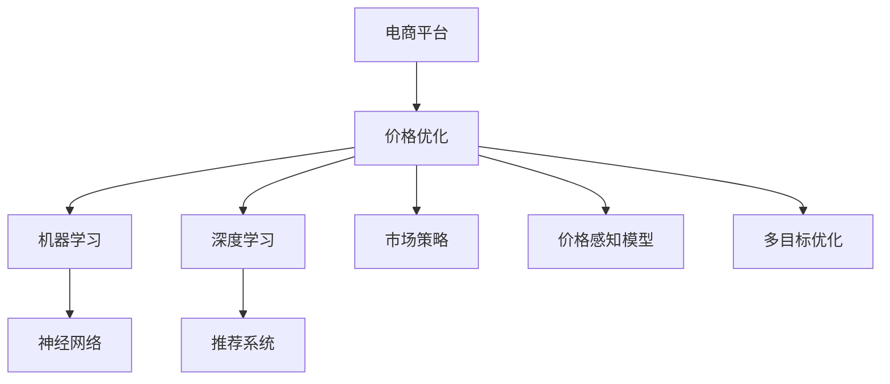

                 

# 电商价格优化的AI技术

> 关键词：电商,价格优化,人工智能,机器学习,深度学习,神经网络,推荐系统,市场策略

## 1. 背景介绍

### 1.1 问题由来

随着电子商务市场的不断扩大，各大电商平台面临激烈的市场竞争和价格战。如何在控制成本的同时，实现价格优化，提升销量和利润率，成为电商平台的核心挑战。传统的手工定价方式效率低下，难以快速响应市场变化。基于人工智能(AI)的价格优化技术逐渐成为电商平台竞争力的关键因素。

### 1.2 问题核心关键点

AI价格优化技术的核心在于利用机器学习和深度学习算法，从历史数据中挖掘价格与销量、成本、季节性等因素之间的关系，预测最优价格策略。通过实时监控和动态调整，确保价格与市场变化同步，最大化利润。AI价格优化技术可以显著降低人力成本，提高价格决策的科学性和精准度。

## 2. 核心概念与联系

### 2.1 核心概念概述

为更好地理解电商价格优化的AI技术，本节将介绍几个密切相关的核心概念：

- 电商平台：指利用互联网技术，进行商品销售、库存管理、支付结算、物流配送等服务的企业。

- 价格优化：指通过数据分析和算法计算，确定最优价格策略的过程。价格优化的目标是在市场需求和成本约束下，最大化利润。

- 机器学习：一种数据驱动的模型学习方法，通过训练模型，从历史数据中学习规则，进行预测和分类。

- 深度学习：一种基于神经网络的结构化学习方式，通过多层次的数据表示，提取高层次的特征，用于复杂的任务处理。

- 神经网络：一种受生物神经元启发的计算模型，通过多个层级的前向传播和反向传播，实现数据的自动学习。

- 推荐系统：指通过分析用户行为数据，为用户推荐合适商品的系统，与价格优化有密切联系。

- 市场策略：指在竞争激烈的市场中，制定并执行一系列营销策略，以获取竞争优势。

- 价格感知模型：指用于预测用户对商品价格变化的敏感度的模型，与价格优化密切相关。

- 多目标优化：指在多个目标之间进行平衡，实现多目标优化的模型。

这些核心概念之间的逻辑关系可以通过以下Mermaid流程图来展示：



这个流程图展示了一系列核心概念及其之间的关系：

1. 电商平台通过价格优化提升利润。
2. 价格优化利用机器学习和深度学习算法。
3. 机器学习和深度学习通过神经网络进行数据处理。
4. 推荐系统帮助理解用户行为，预测需求。
5. 市场策略指导价格优化的方向和目标。
6. 价格感知模型预测用户对价格的敏感度。
7. 多目标优化平衡不同目标之间的关系。

这些概念共同构成了电商价格优化AI技术的基础框架，使得电商平台能够更好地应对市场变化，实现高效的动态价格调整。

## 3. 核心算法原理 & 具体操作步骤

### 3.1 算法原理概述

电商价格优化的AI技术，本质上是一种基于数据驱动的机器学习应用。其核心思想是：通过历史销售数据、市场趋势、用户行为等多维度的数据，训练模型预测最优价格策略，并实时动态调整，以最大化利润。

形式化地，假设电商平台有$N$种商品，每种商品的历史销售数据为$\{(x_i, y_i)\}_{i=1}^N$，其中$x_i$为商品特征向量，$y_i$为对应的销量，$t_i$为对应的日期。价格优化的目标是最小化成本和库存，同时最大化利润，即：

$$
\min_{p_i} \{ C_i + \frac{1}{2}(i+1)\sum_{i=1}^N (\hat{y_i} - y_i)^2 \}
$$

其中$p_i$为商品$i$的价格，$C_i$为商品$i$的成本，$\hat{y_i}$为模型预测的销量。

通过梯度下降等优化算法，求解上述最优化问题，得到最优价格$p_i^*$。

### 3.2 算法步骤详解

基于机器学习的电商价格优化一般包括以下几个关键步骤：

**Step 1: 数据准备**
- 收集商品的历史销售数据、市场趋势数据、用户行为数据等，构建训练集和测试集。
- 对数据进行清洗、特征工程、归一化等预处理操作，构建模型训练所需的数据集。

**Step 2: 选择模型**
- 根据问题特点选择合适的机器学习模型，如线性回归、决策树、随机森林等。
- 对于非线性问题，考虑使用深度学习模型，如多层感知机、神经网络等。

**Step 3: 模型训练**
- 使用历史销售数据和市场趋势数据，对模型进行训练。
- 使用交叉验证等技术，调整模型超参数，选择最优模型。

**Step 4: 模型评估**
- 在测试集上评估模型的预测性能，使用MAE、RMSE等指标评估模型的准确度。
- 进行A/B测试，比较模型预测价格与实际销售情况的一致性。

**Step 5: 动态调整**
- 根据实时市场数据和用户行为数据，实时更新模型参数。
- 周期性对模型进行重新训练，适应市场变化。

**Step 6: 策略执行**
- 根据模型预测的价格，自动化调整电商平台商品价格。
- 监控价格调整后的销售数据和利润变化，反馈调整策略。

以上步骤展示了机器学习在电商价格优化中的应用流程。在实际应用中，还需要根据具体情况，对各个步骤进行优化设计，以提高价格优化的效果。

### 3.3 算法优缺点

基于机器学习的电商价格优化方法具有以下优点：

1. 自动化程度高：通过模型训练，电商平台能够自动生成最优价格策略，减少人工干预。
2. 数据驱动：利用历史销售数据和市场趋势，模型可以适应多种市场情况，提高价格优化的准确性。
3. 实时调整：模型能够实时动态调整价格，迅速响应市场变化。
4. 优化效果显著：通过多目标优化，可以在价格、销量、成本之间取得平衡，最大化利润。

同时，该方法也存在一些局限性：

1. 数据质量依赖高：模型的效果很大程度上取决于数据的准确性和完整性，获取高质量数据成本较高。
2. 复杂性高：深度学习模型训练复杂，需要大量计算资源和专业知识。
3. 解释性差：模型通常难以解释其内部决策逻辑，难以进行人工干预和调试。
4. 动态性不足：对于快速变化的市场，模型需要周期性重新训练，更新速度较慢。
5. 模型依赖性强：模型的效果依赖于训练数据和参数设置，难以应对数据分布变化。

尽管存在这些局限性，但就目前而言，基于机器学习的电商价格优化方法仍是电商平台价格决策的重要手段。未来相关研究的重点在于如何进一步提高模型的可解释性和鲁棒性，同时降低对标注数据的依赖。

### 3.4 算法应用领域

基于机器学习的电商价格优化方法，在电商平台的多个环节得到了广泛应用，包括：

- 商品定价：利用销售数据和市场趋势，预测最优价格策略，实现利润最大化。
- 库存管理：通过动态调整价格，优化库存水平，减少缺货和滞销。
- 促销策略：预测不同促销手段的效果，制定最优的促销策略。
- 市场预测：分析市场趋势和用户行为，预测未来销售情况，指导定价策略。
- 用户行为分析：通过价格变化，分析用户对价格的敏感度，优化定价策略。

除了上述这些经典应用外，电商价格优化技术也被创新性地应用于更多场景中，如跨域推荐、动态定价、个性化定价等，为电商平台的运营决策提供更科学的依据。

## 4. 数学模型和公式 & 详细讲解 & 举例说明

### 4.1 数学模型构建

本节将使用数学语言对电商价格优化的AI技术进行更加严格的刻画。

假设电商平台有$N$种商品，每种商品的历史销售数据为$\{(x_i, y_i)\}_{i=1}^N$，其中$x_i$为商品特征向量，$y_i$为对应的销量，$t_i$为对应的日期。价格优化的目标是最小化成本和库存，同时最大化利润，即：

$$
\min_{p_i} \{ C_i + \frac{1}{2}(i+1)\sum_{i=1}^N (\hat{y_i} - y_i)^2 \}
$$

其中$p_i$为商品$i$的价格，$C_i$为商品$i$的成本，$\hat{y_i}$为模型预测的销量。

### 4.2 公式推导过程

以下我们以线性回归模型为例，推导价格优化模型和预测销量的计算公式。

假设商品价格$p_i$与销量$y_i$之间存在线性关系，即：

$$
y_i = \beta_0 + \beta_1 p_i + \epsilon_i
$$

其中$\beta_0$为截距，$\beta_1$为价格系数，$\epsilon_i$为误差项。通过最小二乘法，求解$\beta_0$和$\beta_1$：

$$
\beta_0 = \frac{\sum_{i=1}^N (x_{i1} - \bar{x}_1)(y_i - \bar{y})}{\sum_{i=1}^N (x_{i1} - \bar{x}_1)^2}
$$

$$
\beta_1 = \frac{\sum_{i=1}^N (x_{i2} - \bar{x}_2)(y_i - \bar{y})}{\sum_{i=1}^N (x_{i2} - \bar{x}_2)^2}
$$

其中$\bar{x}_1$和$\bar{x}_2$分别为$x_{i1}$和$x_{i2}$的均值，$\bar{y}$为$y_i$的均值。

通过求解上述线性模型参数，即可得到预测销量$\hat{y_i}$的公式：

$$
\hat{y_i} = \beta_0 + \beta_1 p_i
$$

将预测销量$\hat{y_i}$代入价格优化的目标函数，即可得到最小化成本和库存，最大化利润的目标函数：

$$
\min_{p_i} \{ C_i + \frac{1}{2}(i+1)\sum_{i=1}^N (\hat{y_i} - y_i)^2 \}
$$

通过梯度下降等优化算法，求解上述最优化问题，得到最优价格$p_i^*$。

## 5. 项目实践：代码实例和详细解释说明

### 5.1 开发环境搭建

在进行价格优化实践前，我们需要准备好开发环境。以下是使用Python进行TensorFlow开发的环境配置流程：

1. 安装Anaconda：从官网下载并安装Anaconda，用于创建独立的Python环境。

2. 创建并激活虚拟环境：
```bash
conda create -n tf-env python=3.8 
conda activate tf-env
```

3. 安装TensorFlow：根据CUDA版本，从官网获取对应的安装命令。例如：
```bash
conda install tensorflow tensorflow-gpu -c conda-forge
```

4. 安装各类工具包：
```bash
pip install numpy pandas scikit-learn matplotlib tqdm jupyter notebook ipython
```

完成上述步骤后，即可在`tf-env`环境中开始价格优化实践。

### 5.2 源代码详细实现

下面我们以电商价格优化为例，给出使用TensorFlow对线性回归模型进行价格优化的Python代码实现。

首先，定义线性回归模型：

```python
import tensorflow as tf

class LinearRegression(tf.keras.Model):
    def __init__(self, input_dim):
        super(LinearRegression, self).__init__()
        self.linear = tf.keras.layers.Dense(1)
        
    def call(self, inputs):
        return self.linear(inputs)
```

然后，定义数据处理函数：

```python
def load_data():
    data = []
    with open('sales_data.csv', 'r') as f:
        for line in f:
            features = line.strip().split(',')
            features = [float(f) for f in features]
            data.append(features)
    return tf.data.Dataset.from_tensor_slices(data)
```

接着，定义训练函数：

```python
def train_model(model, train_data, epochs, batch_size):
    model.compile(optimizer=tf.keras.optimizers.Adam(learning_rate=0.001),
                  loss=tf.keras.losses.MeanSquaredError())
    history = model.fit(train_data.shuffle(10000).batch(batch_size), epochs=epochs,
                       validation_split=0.2, verbose=2)
    return model, history
```

最后，启动训练流程并在测试集上评估：

```python
model = LinearRegression(input_dim=3)
train_data = load_data()
train_data = train_data.map(lambda x: (tf.expand_dims(x[0:3], 0), x[3]))
model, history = train_model(model, train_data, epochs=10, batch_size=32)

test_data = load_data()
test_data = test_data.map(lambda x: (tf.expand_dims(x[0:3], 0), x[3]))
mse = model.evaluate(test_data, verbose=0)[1]
print(f'Mean Squared Error: {mse:.4f}')
```

以上就是使用TensorFlow对线性回归模型进行电商价格优化的完整代码实现。可以看到，得益于TensorFlow的强大封装，我们可以用相对简洁的代码完成模型的训练和评估。

### 5.3 代码解读与分析

让我们再详细解读一下关键代码的实现细节：

**LinearRegression类**：
- `__init__`方法：定义模型输入和输出维度，初始化线性层。
- `call`方法：对输入数据进行前向传播，返回线性层的输出。

**load_data函数**：
- 读取销售数据，并将其转换为TensorFlow可用的格式。

**train_model函数**：
- 定义损失函数和优化器，编译模型。
- 使用训练数据对模型进行训练，返回训练历史和模型本身。

**启动训练流程**：
- 实例化线性回归模型。
- 加载训练数据，并进行数据预处理。
- 调用训练函数进行模型训练，并计算测试集上的均方误差。

可以看到，TensorFlow配合机器学习模型的开发，使得价格优化的代码实现变得简洁高效。开发者可以将更多精力放在数据处理、模型改进等高层逻辑上，而不必过多关注底层的实现细节。

当然，工业级的系统实现还需考虑更多因素，如模型的保存和部署、超参数的自动搜索、更灵活的目标函数等。但核心的价格优化范式基本与此类似。

## 6. 实际应用场景

### 6.1 智能定价系统

基于机器学习的智能定价系统，可以广泛应用于电商平台，实现自动化定价。传统的手工定价方式效率低下，难以快速响应市场变化。利用智能定价系统，可以实时监控和动态调整价格，确保价格与市场变化同步，最大化利润。

在技术实现上，可以收集商品的历史销售数据、市场趋势数据、用户行为数据等，构建训练集和测试集。在此基础上对线性回归、深度学习等模型进行训练，预测最优价格策略，并实时动态调整价格。

### 6.2 库存管理优化

库存管理是电商平台运营的重要环节。传统的手工库存管理方式效率低下，难以实时优化库存水平。基于机器学习的库存管理优化系统，可以动态调整商品价格，优化库存水平，减少缺货和滞销。

在技术实现上，可以收集商品的历史销售数据、市场趋势数据、用户行为数据等，构建训练集和测试集。在此基础上对线性回归、深度学习等模型进行训练，预测最优价格策略，并实时动态调整价格，优化库存水平。

### 6.3 促销策略优化

促销策略是电商平台吸引用户、提升销量的重要手段。传统的手工促销策略方式效率低下，难以快速响应市场变化。基于机器学习的促销策略优化系统，可以预测不同促销手段的效果，制定最优的促销策略，提升用户购买率。

在技术实现上，可以收集商品的历史销售数据、市场趋势数据、用户行为数据等，构建训练集和测试集。在此基础上对线性回归、深度学习等模型进行训练，预测最优价格策略，并实时动态调整价格，优化库存水平。

### 6.4 未来应用展望

随着机器学习技术的发展，基于机器学习的电商价格优化方法将在更多领域得到应用，为电商平台的运营决策提供更科学的依据。

在智慧物流领域，基于机器学习的定价策略可以优化物流成本，提升配送效率。

在金融领域，基于机器学习的定价策略可以优化金融产品的定价，提升收益。

在医疗领域，基于机器学习的定价策略可以优化药品和医疗服务的价格，提升医疗服务的可及性和公平性。

除了上述这些经典应用外，电商价格优化技术还将被创新性地应用于更多场景中，如跨域推荐、动态定价、个性化定价等，为电商平台的运营决策提供更科学的依据。

## 7. 工具和资源推荐

### 7.1 学习资源推荐

为了帮助开发者系统掌握电商价格优化的AI技术，这里推荐一些优质的学习资源：

1. 《深度学习入门：基于Python的理论与实现》系列博文：由深度学习专家撰写，深入浅出地介绍了深度学习的基本概念和实践技巧。

2. Coursera《机器学习》课程：由斯坦福大学开设的机器学习经典课程，有Lecture视频和配套作业，带你入门机器学习的基本原理和经典算法。

3. 《TensorFlow实战Google深度学习》书籍：TensorFlow官方推荐书籍，全面介绍了TensorFlow的API和应用场景，是学习TensorFlow的必读书籍。

4. Kaggle机器学习竞赛：Kaggle提供各类机器学习竞赛，涵盖了电商、金融、医疗等多个领域，是实战学习的好平台。

通过对这些资源的学习实践，相信你一定能够快速掌握电商价格优化的AI技术，并用于解决实际的电商运营问题。

### 7.2 开发工具推荐

高效的开发离不开优秀的工具支持。以下是几款用于电商价格优化开发的常用工具：

1. TensorFlow：基于Python的开源深度学习框架，灵活动态的计算图，适合快速迭代研究。TensorFlow提供丰富的机器学习模型，支持分布式训练和推理。

2. Keras：基于TensorFlow等后端的高级API，支持快速原型设计和模型构建，适合初学者和快速迭代。

3. Scikit-learn：基于Python的机器学习库，提供多种经典算法和工具函数，适合数据预处理和模型评估。

4. Jupyter Notebook：交互式开发环境，支持Python、R、SQL等多种编程语言，方便代码编写和实验记录。

5. Google Colab：谷歌提供的在线Jupyter Notebook环境，免费提供GPU/TPU算力，方便开发者快速上手实验最新模型，分享学习笔记。

合理利用这些工具，可以显著提升电商价格优化的开发效率，加快创新迭代的步伐。

### 7.3 相关论文推荐

电商价格优化的AI技术源于学界的持续研究。以下是几篇奠基性的相关论文，推荐阅读：

1. Feature Engineering in Recommendation System: A Survey：综述了推荐系统中的特征工程方法，介绍了如何构建高质量的特征集。

2. Multi-Task Learning with Multi-Task Elastic-Net：提出多任务弹性网算法，用于多目标优化问题。

3. An Online and Distributed Optimization Algorithm for Dynamic Pricing：提出动态定价的在线优化算法，适用于实时调整价格。

4. Deep Learning for Dynamic Pricing：综述了深度学习在动态定价中的应用，介绍了不同深度学习模型的优缺点。

这些论文代表了大语言模型微调技术的发展脉络。通过学习这些前沿成果，可以帮助研究者把握学科前进方向，激发更多的创新灵感。

## 8. 总结：未来发展趋势与挑战

### 8.1 总结

本文对基于机器学习的电商价格优化的AI技术进行了全面系统的介绍。首先阐述了电商价格优化在电商平台运营中的核心地位，明确了AI技术在优化价格策略中的独特价值。其次，从原理到实践，详细讲解了机器学习在电商价格优化中的应用流程，给出了完整的代码实例。同时，本文还广泛探讨了价格优化技术在智能定价、库存管理、促销策略等多个电商运营环节的应用前景，展示了AI技术在电商平台运营决策中的广泛应用。此外，本文精选了电商价格优化的各类学习资源，力求为读者提供全方位的技术指引。

通过本文的系统梳理，可以看到，基于机器学习的电商价格优化方法在电商平台的运营决策中扮演了越来越重要的角色。这些方法的引入，使得电商平台能够更加灵活、高效地应对市场变化，实现动态价格优化，提升运营效率和盈利能力。未来，伴随机器学习技术的发展，电商价格优化方法还将不断进步，为电商平台的竞争力和市场份额提升提供新的动力。

### 8.2 未来发展趋势

展望未来，电商价格优化技术将呈现以下几个发展趋势：

1. 模型规模持续增大。随着算力成本的下降和数据规模的扩张，电商价格优化模型也将不断增大，学习到更加复杂的用户行为和市场规律。

2. 实时性进一步提升。未来模型将更加注重实时性，能够快速响应市场变化，及时调整价格策略。

3. 跨域推荐融合。利用多任务学习和联合学习技术，将价格优化与推荐系统相结合，提升推荐效果，降低推荐成本。

4. 个性化定价增强。基于用户行为数据，实现个性化定价，提升用户体验和忠诚度。

5. 多目标优化平衡。实现价格、销量、成本等多目标优化，最大化综合效益。

6. 动态定价普及。利用动态定价技术，实现实时调整价格，应对快速变化的市场环境。

这些趋势凸显了电商价格优化技术的广阔前景。这些方向的探索发展，必将进一步提升电商平台的运营效率和盈利能力，推动电商市场的健康发展。

### 8.3 面临的挑战

尽管电商价格优化技术已经取得了显著成果，但在迈向更加智能化、普适化应用的过程中，它仍面临诸多挑战：

1. 数据质量和完整性问题：模型的效果很大程度上取决于数据的准确性和完整性，获取高质量数据成本较高。如何提高数据采集和处理的自动化程度，是亟待解决的问题。

2. 模型复杂度问题：深度学习模型训练复杂，需要大量计算资源和专业知识。如何优化模型结构，提高训练效率，是未来研究的重要方向。

3. 模型解释性问题：模型通常难以解释其内部决策逻辑，难以进行人工干预和调试。如何提高模型的可解释性，是未来研究的重要课题。

4. 实时性问题：模型需要实时动态调整价格，更新速度较慢。如何提高模型的实时响应能力，是未来研究的重要方向。

5. 动态性问题：模型需要周期性重新训练，更新速度较慢。如何提高模型的动态适应能力，是未来研究的重要方向。

6. 多目标优化问题：多目标优化平衡不同目标之间的关系，难度较大。如何提高多目标优化的精度和效率，是未来研究的重要方向。

这些挑战凸显了电商价格优化技术的复杂性和挑战性，但正是这些挑战推动了技术的不断进步和完善。只有不断应对挑战，才能实现电商价格优化技术的可持续发展。

### 8.4 研究展望

面对电商价格优化技术所面临的种种挑战，未来的研究需要在以下几个方面寻求新的突破：

1. 探索多任务学习和联合学习技术。利用多任务学习和联合学习技术，将价格优化与推荐系统相结合，提升推荐效果，降低推荐成本。

2. 研究轻量级模型和实时优化算法。开发轻量级模型和实时优化算法，提高模型的实时响应能力和动态适应能力。

3. 引入因果推断和强化学习技术。利用因果推断和强化学习技术，增强模型的因果关系和行为优化能力，提升模型的解释性和可靠性。

4. 引入外部知识库和规则库。将外部知识库和规则库与模型结合，提高模型的决策能力，增强模型的解释性和可信度。

5. 引入多目标优化框架。利用多目标优化框架，实现价格、销量、成本等多目标优化，提高模型的综合效益。

6. 引入动态定价技术。利用动态定价技术，实现实时调整价格，应对快速变化的市场环境。

这些研究方向将进一步推动电商价格优化技术的进步，为电商平台运营决策提供更科学的依据。面向未来，电商价格优化技术还需要与其他人工智能技术进行更深入的融合，如知识表示、因果推理、强化学习等，多路径协同发力，共同推动电商市场的健康发展。

## 9. 附录：常见问题与解答

**Q1：电商价格优化是否适用于所有商品？**

A: 电商价格优化方法对大多数商品都是适用的，但不同类型和属性的商品，其价格与销量的关系可能不同。对于价格敏感度较低的商品，可能需要结合用户行为和市场趋势，进行个性化的定价策略。

**Q2：如何选择合适的价格优化模型？**

A: 选择合适的价格优化模型需要考虑商品的特性和市场环境。一般而言，对于非线性问题，可以采用深度学习模型，如多层感知机、神经网络等。对于线性问题，可以采用线性回归模型。此外，还需要考虑模型的训练复杂度和解释性，选择最适合的模型。

**Q3：电商价格优化过程中需要注意哪些问题？**

A: 电商价格优化过程中，需要注意以下问题：
1. 数据质量：确保数据的准确性和完整性，避免噪音数据影响模型效果。
2. 模型解释性：提高模型的可解释性，便于人工干预和调试。
3. 实时性：模型需要实时动态调整价格，提高响应速度。
4. 动态性：模型需要周期性重新训练，更新速度较慢。
5. 多目标优化：实现价格、销量、成本等多目标优化，提高综合效益。

这些问题的解决需要结合实际应用场景，进行针对性的优化。只有全面考虑这些问题，才能实现高效、可靠的价格优化。

通过本文的系统梳理，可以看到，基于机器学习的电商价格优化方法正在成为电商平台价格决策的重要手段。这些方法的引入，使得电商平台能够更加灵活、高效地应对市场变化，实现动态价格优化，提升运营效率和盈利能力。未来，伴随机器学习技术的发展，电商价格优化方法还将不断进步，为电商平台的竞争力和市场份额提升提供新的动力。相信伴随技术的不断进步，电商价格优化技术将迎来更多的创新和突破。

