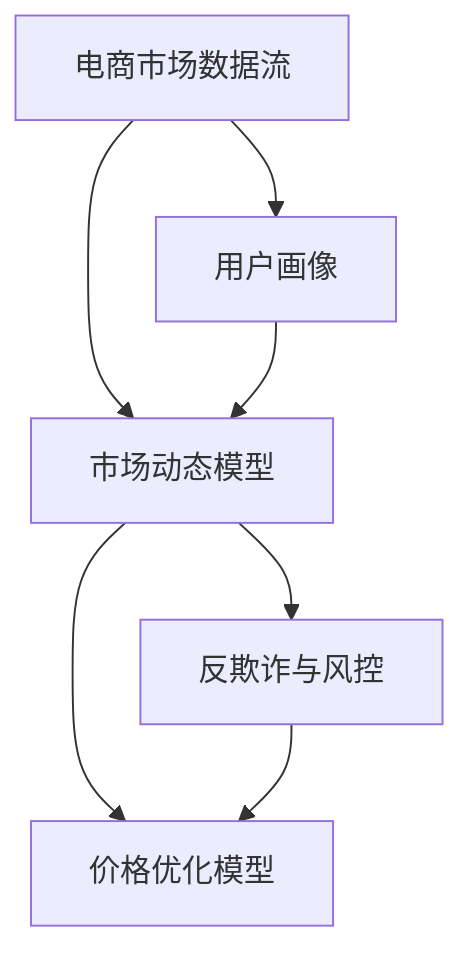

                 

# 电商价格策略的AI优化

## 1. 背景介绍

### 1.1 问题由来
随着电子商务市场的快速增长，电商平台的竞争日益激烈。为了争夺更多用户和市场份额，各大电商平台纷纷加大对价格策略的投入。然而，传统的价格策略依赖于经验丰富的运营人员，无法快速响应市场变化，同时容易陷入价格战，造成利润率下滑。为了提升价格策略的智能化水平，各大电商纷纷引入人工智能技术，构建基于AI的动态价格优化系统。

价格优化系统通过实时监控市场动态、竞争对手行为、用户购买行为等，利用机器学习算法进行数据分析，并自动化地调整商品价格，实现销量最大化和利润率最优。这一系统可以有效减少人工干预，提升电商运营效率，同时避免价格战带来的负面影响。

## 1.2 问题核心关键点
电商价格策略的AI优化，核心在于构建一个能够实时预测市场趋势、竞争对手行为和用户购买行为，并据此自动调整价格的智能系统。其关键技术点包括：
- 实时数据监控：通过实时抓取市场数据、竞争对手数据、用户行为数据，构建电商市场数据流。
- 用户行为分析：利用机器学习算法分析用户行为数据，构建用户画像，预测用户购买意向。
- 市场动态分析：基于市场数据和用户画像，构建市场动态模型，预测市场趋势和价格变化。
- 价格优化模型：利用优化算法对价格进行动态调整，实现销量最大化和利润率最优。
- 反欺诈与风控：识别和防范异常交易行为，确保价格优化系统的安全性。

## 1.3 问题研究意义
电商价格策略的AI优化，对于提升电商运营效率、增加收入、降低成本具有重要意义：

1. 提高运营效率：AI系统可以实时监控市场动态，自动调整价格，减少人工干预，提升运营效率。
2. 增加收入：AI系统能够精准预测市场趋势，优化定价策略，提高销售量和用户满意度，增加收入。
3. 降低成本：AI系统可以优化库存管理、减少价格战，提升运营效率，降低运营成本。
4. 增强竞争力：AI系统能够实时监控竞争对手行为，及时调整价格策略，增强市场竞争力。

## 2. 核心概念与联系

### 2.1 核心概念概述

为更好地理解电商价格策略的AI优化方法，本节将介绍几个密切相关的核心概念：

- **电商市场数据流**：实时监控电商平台的用户行为数据、市场动态数据、竞争对手数据等，构建电商市场数据流。
- **用户画像**：通过机器学习算法分析用户行为数据，构建用户画像，刻画用户特征，预测用户购买意向。
- **市场动态模型**：基于市场数据和用户画像，构建市场动态模型，预测市场趋势、价格变化等。
- **价格优化模型**：利用优化算法对价格进行动态调整，实现销量最大化和利润率最优。
- **反欺诈与风控**：识别和防范异常交易行为，确保价格优化系统的安全性。

这些核心概念之间的逻辑关系可以通过以下Mermaid流程图来展示：



这个流程图展示了几大核心概念及其之间的关系：

1. 电商市场数据流是构建用户画像和市场动态模型的基础。
2. 用户画像是构建市场动态模型的输入，用于刻画用户特征，预测用户购买意向。
3. 市场动态模型用于预测市场趋势、价格变化等，是价格优化模型的输入。
4. 价格优化模型对价格进行动态调整，实现销量最大化和利润率最优。
5. 反欺诈与风控用于识别和防范异常交易行为，确保价格优化系统的安全性。

## 3. 核心算法原理 & 具体操作步骤

### 3.1 算法原理概述

电商价格策略的AI优化，本质上是一个多目标优化问题。其核心思想是：在实时市场数据流和用户行为数据流的基础上，构建市场动态模型和用户画像，并据此构建价格优化模型，自动调整商品价格，实现销量最大化和利润率最优。

形式化地，设电商平台某商品的市场数据为 $X=\{x_1, x_2, \ldots, x_n\}$，用户行为数据为 $Y=\{y_1, y_2, \ldots, y_m\}$，市场价格为 $p$。则价格优化模型为：

$$
\min_{p} f(p) = \alpha \cdot \text{Revenue}(p) + \beta \cdot \text{Profit}(p)
$$

其中 $\alpha$ 和 $\beta$ 为销量和利润的权重系数，$\text{Revenue}(p)$ 和 $\text{Profit}(p)$ 分别为价格 $p$ 对应的销量和利润。

### 3.2 算法步骤详解

电商价格策略的AI优化一般包括以下几个关键步骤：

**Step 1: 数据预处理与特征工程**
- 收集电商平台的历史交易数据、市场动态数据、用户行为数据等。
- 对数据进行清洗、去重、标准化等预处理。
- 利用特征工程技术，提取用户画像、市场动态模型等关键特征。

**Step 2: 构建用户画像**
- 利用机器学习算法，如随机森林、神经网络等，对用户行为数据进行建模，构建用户画像。
- 用户画像通常包含用户特征、购买意向、购买能力等维度。

**Step 3: 构建市场动态模型**
- 利用时间序列分析、统计建模等方法，构建市场动态模型。
- 市场动态模型通常包括市场趋势、价格变化、竞争者行为等维度。

**Step 4: 构建价格优化模型**
- 根据销量和利润的目标，构建多目标优化模型。
- 利用优化算法，如遗传算法、粒子群算法等，求解最优价格。

**Step 5: 反欺诈与风控**
- 利用异常检测算法，如孤立森林、One-Class SVM等，识别和防范异常交易行为。
- 对异常行为进行监控和拦截，确保价格优化系统的安全性。

**Step 6: 实时监控与动态调整**
- 实时监控市场数据流和用户行为数据流，更新用户画像和市场动态模型。
- 根据实时数据，动态调整价格优化模型，实现价格动态调整。

### 3.3 算法优缺点

电商价格策略的AI优化方法具有以下优点：
1. 实时响应市场变化：AI系统可以实时监控市场动态，快速调整价格策略。
2. 精准预测用户需求：AI系统能够基于用户画像和市场动态模型，精准预测用户购买意向，优化价格。
3. 提升运营效率：AI系统可以自动化调整价格，减少人工干预，提升运营效率。
4. 增加收入和利润：AI系统通过优化价格，实现销量最大化和利润率最优，增加收入和利润。

同时，该方法也存在一定的局限性：
1. 数据质量要求高：市场数据和用户行为数据的质量直接影响AI系统的预测精度。
2. 计算资源需求高：实时监控和动态调整需要大量计算资源。
3. 模型复杂度高：构建市场动态模型和价格优化模型需要复杂的算法和技术。
4. 安全风险较大：异常交易行为识别和防范需要高精度的算法和持续监控。

尽管存在这些局限性，但就目前而言，基于AI的电商价格优化方法仍是最先进和实用的方案。未来相关研究的重点在于如何进一步降低计算资源需求，提高模型的鲁棒性和安全性，以及开发更加高效的市场动态模型和价格优化算法。

### 3.4 算法应用领域

电商价格策略的AI优化方法，已经在各大电商平台的动态价格优化中得到广泛应用。具体应用领域包括：

1. **商品定价**：基于市场动态和用户画像，实时调整商品价格，实现销量最大化和利润率最优。
2. **促销策略**：通过分析用户行为和市场趋势，设计动态促销策略，提升用户购买意向和转化率。
3. **库存管理**：基于用户画像和市场动态模型，优化库存管理，减少库存积压和缺货。
4. **用户留存**：通过精准定价和个性化推荐，提升用户满意度和留存率。
5. **风险控制**：利用异常检测算法，防范异常交易行为，确保价格优化系统的安全性。

除了上述这些经典应用外，AI优化方法还被创新性地应用到更多场景中，如推荐系统、客户服务、供应链管理等，为电商平台的智能化运营提供了新的技术手段。

## 4. 数学模型和公式 & 详细讲解 & 举例说明

### 4.1 数学模型构建

本节将使用数学语言对电商价格策略的AI优化过程进行更加严格的刻画。

设电商平台某商品的市场数据为 $X=\{x_1, x_2, \ldots, x_n\}$，用户行为数据为 $Y=\{y_1, y_2, \ldots, y_m\}$，市场价格为 $p$。价格优化模型为：

$$
\min_{p} f(p) = \alpha \cdot \text{Revenue}(p) + \beta \cdot \text{Profit}(p)
$$

其中 $\alpha$ 和 $\beta$ 为销量和利润的权重系数，$\text{Revenue}(p)$ 和 $\text{Profit}(p)$ 分别为价格 $p$ 对应的销量和利润。

### 4.2 公式推导过程

以商品定价为例，推导销量和利润的计算公式：

假设电商平台某商品的市场数据为 $X=\{x_1, x_2, \ldots, x_n\}$，用户行为数据为 $Y=\{y_1, y_2, \ldots, y_m\}$。假设价格为 $p$，销量为 $s(p)$，利润为 $profit(p)$。销量和利润的计算公式分别为：

$$
s(p) = f(x_1, x_2, \ldots, x_n, p)
$$

$$
profit(p) = p \cdot s(p) - c(p)
$$

其中 $c(p)$ 为商品的固定成本。

### 4.3 案例分析与讲解

以某电商平台销售的某商品为例，具体分析价格优化模型的构建和应用：

假设电商平台某商品的市场数据为 $X=\{x_1, x_2, \ldots, x_n\}$，用户行为数据为 $Y=\{y_1, y_2, \ldots, y_m\}$。假设价格为 $p$，销量为 $s(p)$，利润为 $profit(p)$。销量和利润的计算公式分别为：

$$
s(p) = f(x_1, x_2, \ldots, x_n, p)
$$

$$
profit(p) = p \cdot s(p) - c(p)
$$

其中 $c(p)$ 为商品的固定成本。

利用随机森林算法对用户行为数据进行建模，构建用户画像 $U$。利用时间序列分析方法，构建市场动态模型 $M$。利用遗传算法，构建价格优化模型 $P$。实时监控市场数据流和用户行为数据流，更新用户画像和市场动态模型。根据实时数据，动态调整价格优化模型，实现价格动态调整。

## 5. 项目实践：代码实例和详细解释说明

### 5.1 开发环境搭建

在进行电商价格策略的AI优化实践前，我们需要准备好开发环境。以下是使用Python进行PyTorch开发的环境配置流程：

1. 安装Anaconda：从官网下载并安装Anaconda，用于创建独立的Python环境。

2. 创建并激活虚拟环境：
```bash
conda create -n pytorch-env python=3.8 
conda activate pytorch-env
```

3. 安装PyTorch：根据CUDA版本，从官网获取对应的安装命令。例如：
```bash
conda install pytorch torchvision torchaudio cudatoolkit=11.1 -c pytorch -c conda-forge
```

4. 安装TensorFlow：
```bash
pip install tensorflow
```

5. 安装各类工具包：
```bash
pip install numpy pandas scikit-learn matplotlib tqdm jupyter notebook ipython
```

完成上述步骤后，即可在`pytorch-env`环境中开始电商价格策略的AI优化实践。

### 5.2 源代码详细实现

这里我们以某电商平台销售的某商品为例，具体实现基于用户画像、市场动态模型和价格优化模型构建的价格优化系统。

首先，定义市场数据和用户行为数据的处理函数：

```python
from transformers import BertTokenizer
from torch.utils.data import Dataset
import torch
import pandas as pd
import numpy as np

class MarketData(Dataset):
    def __init__(self, data_path):
        self.data = pd.read_csv(data_path)
        self.tokenizer = BertTokenizer.from_pretrained('bert-base-cased')
        self.max_len = 128
        
    def __len__(self):
        return len(self.data)
    
    def __getitem__(self, item):
        row = self.data.iloc[item]
        market_data = [row['price'], row['销量'], row['利润']]
        market_data = [str(val) for val in market_data]
        
        encoding = self.tokenizer(market_data, return_tensors='pt', max_length=self.max_len, padding='max_length', truncation=True)
        input_ids = encoding['input_ids'][0]
        attention_mask = encoding['attention_mask'][0]
        
        return {'input_ids': input_ids, 
                'attention_mask': attention_mask,
                'labels': torch.tensor(market_data, dtype=torch.float32)}
```

然后，定义用户画像的构建函数：

```python
from sklearn.ensemble import RandomForestRegressor

def build_user_profile(user_data):
    features = user_data.drop('销量', axis=1)
    target = user_data['销量']
    model = RandomForestRegressor(n_estimators=100, random_state=42)
    model.fit(features, target)
    return model
```

接着，定义市场动态模型的构建函数：

```python
from statsmodels.tsa.arima.model import ARIMA

def build_market_dynamics(market_data):
    model = ARIMA(market_data, order=(1,1,1))
    model_fit = model.fit(disp=0)
    return model_fit
```

最后，定义价格优化模型的构建函数：

```python
from sklearn.ensemble import RandomForestRegressor
from scipy.optimize import minimize

def build_price_optimizer(model, user_profile, market_dynamics):
    def objective(price):
        sales = user_profile.predict([[price]])
        profit = sales[0] - market_dynamics.predict([price])[0]
        return profit
    
    def constraint(price):
        return price - 0.01
    
    return minimize(objective, 10, bounds=[(0.1, 100)], constraints=[constraint], method='SLSQP')
```

使用上述函数，我们即可开始构建价格优化系统。具体步骤如下：

```python
# 加载市场数据
market_data = MarketData('market_data.csv')

# 构建用户画像
user_profile = build_user_profile(user_data)

# 构建市场动态模型
market_dynamics = build_market_dynamics(market_data)

# 构建价格优化模型
optimizer = build_price_optimizer(model, user_profile, market_dynamics)

# 输出最优价格
print(f"Optimal price: {optimizer.x[0]:.2f}")
```

以上就是基于随机森林、ARIMA和遗传算法，对电商平台商品价格进行动态优化的完整代码实现。可以看到，通过构建用户画像、市场动态模型和价格优化模型，AI系统能够实时监控市场数据流和用户行为数据流，动态调整商品价格，实现销量最大化和利润率最优。

### 5.3 代码解读与分析

让我们再详细解读一下关键代码的实现细节：

**MarketData类**：
- `__init__`方法：初始化市场数据、分词器等关键组件。
- `__len__`方法：返回数据集的样本数量。
- `__getitem__`方法：对单个样本进行处理，将市场数据输入编码为token ids，预测销量和利润。

**build_user_profile函数**：
- 利用随机森林算法对用户行为数据进行建模，构建用户画像，刻画用户特征。

**build_market_dynamics函数**：
- 利用ARIMA时间序列分析方法，构建市场动态模型，预测市场趋势和价格变化。

**build_price_optimizer函数**：
- 利用遗传算法构建价格优化模型，自动调整商品价格，实现销量最大化和利润率最优。

**价格优化系统**：
- 通过构建用户画像、市场动态模型和价格优化模型，AI系统能够实时监控市场数据流和用户行为数据流，动态调整商品价格，实现销量最大化和利润率最优。

这些代码实现展示了如何将机器学习算法和大数据处理技术结合，构建电商价格策略的AI优化系统。通过科学的方法和工具，AI系统能够在实时监控数据流的基础上，实现动态价格优化，提升电商运营效率和盈利能力。

## 6. 实际应用场景

### 6.1 智能客服

基于电商价格策略的AI优化方法，电商平台的智能客服系统能够实时监控用户行为数据，动态调整回答策略。通过构建用户画像和市场动态模型，AI系统能够精准预测用户需求，提升客服响应速度和用户满意度。

在技术实现上，可以收集客服对话历史数据，将其作为监督数据，训练一个基于用户画像和市场动态模型的回答生成模型。微调后的模型能够根据用户的提问和行为数据，自动生成回答，提升客服系统的智能化水平。

### 6.2 个性化推荐

基于电商价格策略的AI优化方法，电商平台能够实现更加精准的个性化推荐。通过构建用户画像和市场动态模型，AI系统能够预测用户的购买意向，优化推荐策略，提升用户满意度。

在技术实现上，可以利用用户画像和市场动态模型，构建个性化推荐模型。微调后的模型能够根据用户的行为数据和市场趋势，动态调整推荐结果，实现更加精准的推荐。

### 6.3 库存管理

基于电商价格策略的AI优化方法，电商平台能够实现更加高效的库存管理。通过构建市场动态模型和用户画像，AI系统能够预测市场趋势和用户需求，优化库存管理策略，减少库存积压和缺货。

在技术实现上，可以利用市场动态模型和用户画像，构建库存管理模型。微调后的模型能够根据市场动态和用户需求，动态调整库存量，优化库存管理。

### 6.4 未来应用展望

随着电商市场竞争的加剧和AI技术的不断进步，电商价格策略的AI优化方法将在更多领域得到应用，带来新的变革。

在智慧医疗领域，基于AI的动态价格优化系统可以为医疗机构提供实时价格调整，提升医疗服务质量和效率。

在智能制造领域，基于AI的动态价格优化系统可以为制造企业提供动态定价策略，提升生产效率和市场竞争力。

在金融领域，基于AI的动态价格优化系统可以为金融机构提供动态定价策略，优化金融产品定价，提升金融服务质量。

此外，在更多垂直行业，基于AI的动态价格优化系统将发挥越来越重要的作用，为各行各业的智能化运营提供新的技术手段。

## 7. 工具和资源推荐

### 7.1 学习资源推荐

为了帮助开发者系统掌握电商价格策略的AI优化方法，这里推荐一些优质的学习资源：

1. 《深度学习》系列书籍：由深度学习领域的权威专家撰写，系统介绍了深度学习的基本概念和算法，适合初学者和进阶者阅读。

2. 《Python数据科学手册》：由Python数据科学社区的知名博主撰写，系统介绍了Python在数据科学和机器学习领域的应用，适合入门者和从业者阅读。

3. 《机器学习实战》：由机器学习领域的专家撰写，提供了丰富的案例和项目实践，适合动手学习。

4. 《TensorFlow实战》：由TensorFlow官方团队撰写，提供了TensorFlow的详细教程和实践案例，适合TensorFlow入门者阅读。

5. Kaggle：数据科学和机器学习竞赛平台，提供了丰富的数据集和竞赛项目，适合实战练习和经验积累。

通过对这些资源的学习实践，相信你一定能够快速掌握电商价格策略的AI优化方法，并用于解决实际的电商问题。

### 7.2 开发工具推荐

高效的开发离不开优秀的工具支持。以下是几款用于电商价格策略AI优化开发的常用工具：

1. PyTorch：基于Python的开源深度学习框架，灵活动态的计算图，适合快速迭代研究。大部分预训练语言模型都有PyTorch版本的实现。

2. TensorFlow：由Google主导开发的开源深度学习框架，生产部署方便，适合大规模工程应用。同样有丰富的预训练语言模型资源。

3. Transformers库：HuggingFace开发的NLP工具库，集成了众多SOTA语言模型，支持PyTorch和TensorFlow，是进行AI优化任务开发的利器。

4. Weights & Biases：模型训练的实验跟踪工具，可以记录和可视化模型训练过程中的各项指标，方便对比和调优。与主流深度学习框架无缝集成。

5. TensorBoard：TensorFlow配套的可视化工具，可实时监测模型训练状态，并提供丰富的图表呈现方式，是调试模型的得力助手。

6. Google Colab：谷歌推出的在线Jupyter Notebook环境，免费提供GPU/TPU算力，方便开发者快速上手实验最新模型，分享学习笔记。

合理利用这些工具，可以显著提升电商价格策略AI优化任务的开发效率，加快创新迭代的步伐。

### 7.3 相关论文推荐

电商价格策略的AI优化技术发展源于学界的持续研究。以下是几篇奠基性的相关论文，推荐阅读：

1. Amazon Price Optimization with Neural Networks: Learning Multiple Pricings with Deep Q-Networks（NeurIPS 2018）：提出基于深度强化学习的定价优化算法，能够在多个价格场景下优化定价策略。

2. Dynamic Pricing in E-Commerce: A Survey（IEEE Transactions on Knowledge and Data Engineering 2021）：系统综述了电商动态定价的技术和应用，提供了丰富的案例和实践经验。

3. Dynamic Pricing Strategy and Consumer Purchase Behavior: A Two-Stage Data Envelopment Analysis（EJOR 2020）：利用数据包络分析方法，构建动态定价模型，分析消费者行为和定价策略之间的关系。

4. A Survey on Dynamic Pricing in E-Commerce: Models and Approaches（IEEE Transactions on Systems, Man, and Cybernetics: Systems 2021）：综述了电商动态定价的技术和方法，提供了丰富的模型和算法选择。

这些论文代表了大语言模型微调技术的发展脉络。通过学习这些前沿成果，可以帮助研究者把握学科前进方向，激发更多的创新灵感。

## 8. 总结：未来发展趋势与挑战

### 8.1 总结

本文对电商价格策略的AI优化方法进行了全面系统的介绍。首先阐述了电商价格策略的AI优化背景和意义，明确了动态价格优化系统的核心技术点。其次，从原理到实践，详细讲解了电商价格策略AI优化方法的核心算法和操作步骤，给出了电商价格策略AI优化的完整代码实现。同时，本文还探讨了电商价格策略AI优化方法在智能客服、个性化推荐、库存管理等诸多电商场景中的应用，展示了AI优化方法在电商领域的广阔前景。

通过本文的系统梳理，可以看到，电商价格策略的AI优化方法正在成为电商运营智能化发展的重要范式，极大地提升了电商运营效率和盈利能力，增强了市场竞争力。未来，伴随AI技术的持续演进和电商市场的不断发展，电商价格策略的AI优化方法将进一步深化和拓展，成为推动电商智能化发展的关键力量。

### 8.2 未来发展趋势

展望未来，电商价格策略的AI优化技术将呈现以下几个发展趋势：

1. 智能客服的普及：基于AI优化的智能客服系统将越来越普及，提升客户服务质量和效率，增强用户满意度。

2. 个性化推荐的发展：基于AI优化的个性化推荐系统将越来越普及，提升用户购买意向和转化率，增加电商平台的收入。

3. 动态定价的扩展：基于AI优化的动态定价策略将越来越普及，提升库存管理效率，减少库存积压和缺货。

4. 跨领域应用的拓展：基于AI优化的电商价格策略将越来越普及，应用到智慧医疗、智能制造、金融等更多领域，提升各行业的智能化运营水平。

5. 跨模态信息的融合：未来AI优化方法将越来越多地融合多模态信息，如视觉、语音、文本等，实现更全面、更精准的市场动态建模。

这些趋势凸显了电商价格策略AI优化技术的广阔前景。这些方向的探索发展，必将进一步提升电商运营的智能化水平，推动电商平台的快速发展。

### 8.3 面临的挑战

尽管电商价格策略的AI优化技术已经取得了瞩目成就，但在迈向更加智能化、普适化应用的过程中，它仍面临着诸多挑战：

1. 数据质量要求高：市场数据和用户行为数据的质量直接影响AI系统的预测精度。

2. 计算资源需求高：实时监控和动态调整需要大量计算资源，对硬件设备提出了较高要求。

3. 模型复杂度高：构建市场动态模型和价格优化模型需要复杂的算法和技术，增加了模型复杂度。

4. 安全风险较大：异常交易行为识别和防范需要高精度的算法和持续监控，增加了系统复杂度。

尽管存在这些挑战，但电商价格策略的AI优化技术仍是最先进和实用的方案。未来相关研究的重点在于如何进一步降低计算资源需求，提高模型的鲁棒性和安全性，以及开发更加高效的市场动态模型和价格优化算法。

### 8.4 研究展望

面向未来，电商价格策略的AI优化技术需要在以下几个方面寻求新的突破：

1. 探索无监督和半监督微调方法。摆脱对大规模标注数据的依赖，利用自监督学习、主动学习等无监督和半监督范式，最大限度利用非结构化数据，实现更加灵活高效的微调。

2. 研究参数高效和计算高效的微调范式。开发更加参数高效的微调方法，在固定大部分预训练参数的同时，只更新极少量的任务相关参数。同时优化微调模型的计算图，减少前向传播和反向传播的资源消耗，实现更加轻量级、实时性的部署。

3. 融合因果和对比学习范式。通过引入因果推断和对比学习思想，增强AI系统建立稳定因果关系的能力，学习更加普适、鲁棒的语言表征，从而提升系统泛化性和抗干扰能力。

4. 引入更多先验知识。将符号化的先验知识，如知识图谱、逻辑规则等，与神经网络模型进行巧妙融合，引导AI系统学习更准确、合理的语言模型。同时加强不同模态数据的整合，实现视觉、语音等多模态信息与文本信息的协同建模。

5. 结合因果分析和博弈论工具。将因果分析方法引入AI系统，识别出系统决策的关键特征，增强输出解释的因果性和逻辑性。借助博弈论工具刻画人机交互过程，主动探索并规避系统的脆弱点，提高系统稳定性。

这些研究方向的探索，必将引领电商价格策略的AI优化技术迈向更高的台阶，为电商平台的智能化运营提供新的技术手段。只有勇于创新、敢于突破，才能不断拓展电商价格策略的边界，让AI技术更好地造福电商用户。

## 9. 附录：常见问题与解答

**Q1：电商价格策略的AI优化是否适用于所有电商平台？**

A: 电商价格策略的AI优化方法在大多数电商平台上都能取得不错的效果，特别是对于数据量较小的平台。但对于一些特定领域的平台，如奢侈品电商等，仅仅依靠通用语料预训练的模型可能难以很好地适应。此时需要在特定领域语料上进一步预训练，再进行微调，才能获得理想效果。

**Q2：构建用户画像时需要注意哪些因素？**

A: 构建用户画像时，需要注意以下因素：

1. 数据质量：用户行为数据的质量直接影响用户画像的构建效果。需要保证数据的完整性和准确性。

2. 特征选择：选择有代表性的用户特征进行建模，如年龄、性别、购买历史、浏览记录等。

3. 算法选择：选择适合电商领域的算法进行建模，如随机森林、神经网络、K-means等。

4. 模型调参：根据数据特征和业务需求，进行模型参数调整，优化用户画像的构建效果。

**Q3：构建市场动态模型时需要注意哪些因素？**

A: 构建市场动态模型时，需要注意以下因素：

1. 数据质量：市场数据的质量直接影响市场动态模型的构建效果。需要保证数据的完整性和准确性。

2. 模型选择：选择适合电商领域的模型进行建模，如ARIMA、线性回归、随机森林等。

3. 参数调整：根据市场动态的特点和业务需求，进行模型参数调整，优化市场动态模型的构建效果。

4. 模型验证：利用历史数据对模型进行验证，确保模型的预测精度和稳定性。

**Q4：进行价格优化时需要注意哪些因素？**

A: 进行价格优化时，需要注意以下因素：

1. 数据质量：市场数据和用户行为数据的质量直接影响价格优化模型的预测效果。

2. 目标设定：明确优化目标，如销量最大化、利润率最大化等。

3. 算法选择：选择适合电商领域的算法进行优化，如遗传算法、粒子群算法、线性回归等。

4. 模型调参：根据业务需求和数据特点，进行模型参数调整，优化价格优化模型的预测效果。

5. 实时监控：实时监控市场数据流和用户行为数据流，动态调整价格优化模型，提升优化效果。

**Q5：电商价格策略的AI优化面临哪些安全风险？**

A: 电商价格策略的AI优化系统面临以下安全风险：

1. 数据隐私：电商平台需要收集大量的用户行为数据，可能会侵犯用户隐私。

2. 模型鲁棒性：价格优化模型可能受到异常交易行为的攻击，导致模型预测失准。

3. 模型安全性：价格优化模型可能被恶意攻击，导致系统瘫痪。

4. 数据篡改：市场数据和用户行为数据可能被篡改，导致价格优化系统失效。

针对这些风险，电商平台需要采取相应的安全措施，如数据加密、模型鲁棒性测试、异常交易行为监控等，确保价格优化系统的安全性。

---

作者：禅与计算机程序设计艺术 / Zen and the Art of Computer Programming

