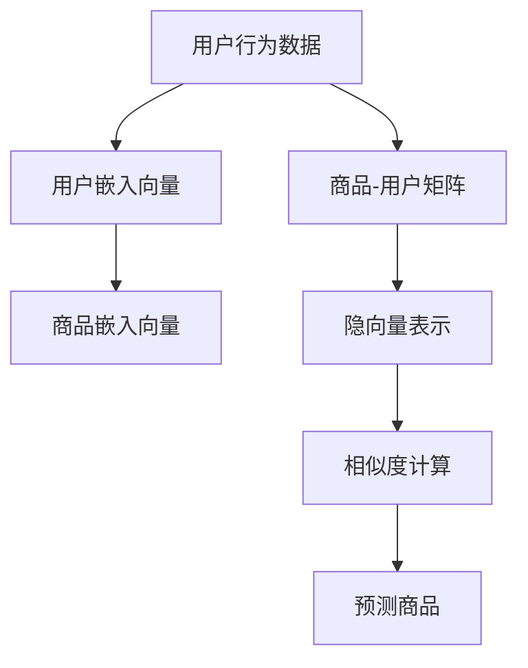

                 

## 1. 背景介绍

在电商平台的激烈竞争中，个性化推荐算法无疑是提升用户体验和销售额的关键技术。通过精准的商品推荐，电商平台能够更高效地将商品呈现给用户，促进用户的购买决策。本文将介绍一种基于深度学习框架的个性化商品推荐算法，详细讲解其原理和实现过程。

## 2. 核心概念与联系

### 2.1 核心概念概述

为了更好地理解该推荐算法，我们将首先介绍几个核心概念：

- **深度学习**：一种模仿人脑神经网络的机器学习方法，通过多层次的非线性变换，捕捉数据中的复杂模式。
- **推荐系统**：通过分析用户历史行为和喜好，预测用户可能感兴趣的商品，并进行推荐。
- **协同过滤**：一种基于用户和商品相似度的推荐方法，通过比较用户间的相似性和商品间的相似性，进行推荐。
- **深度协同过滤**：结合深度学习模型的协同过滤方法，通过用户-商品矩阵的隐向量表示，学习更精准的用户和商品表示，提升推荐效果。
- **神经协同过滤**：将神经网络模型应用于协同过滤算法中，通过多层非线性映射，捕捉更复杂的数据关系。

这些概念构成了个性化商品推荐算法的理论基础，帮助我们将用户的历史行为转化为商品推荐的依据。

### 2.2 核心概念原理和架构的 Mermaid 流程图



该流程图展示了深度协同过滤算法的核心步骤：

1. **用户行为数据**：从用户的历史行为数据中提取信息，如浏览、点击、购买等。
2. **用户嵌入向量**：通过深度学习模型，将用户行为数据编码为用户嵌入向量，捕捉用户的兴趣和偏好。
3. **商品嵌入向量**：同样通过深度学习模型，将商品特征数据编码为商品嵌入向量，捕捉商品的属性和特征。
4. **商品-用户矩阵**：根据用户嵌入向量和商品嵌入向量，构建用户-商品矩阵，表示用户与商品的交互历史。
5. **隐向量表示**：通过神经网络模型，对用户-商品矩阵进行低秩分解，获得用户和商品的隐向量表示。
6. **相似度计算**：计算用户与商品间的相似度，评估用户对商品的兴趣程度。
7. **预测商品**：根据相似度计算结果，对用户感兴趣的商品进行预测和推荐。

这些步骤共同构成了深度协同过滤算法的核心框架，帮助我们从大规模用户行为数据中提取有用的信息，进行个性化推荐。

## 3. 核心算法原理 & 具体操作步骤

### 3.1 算法原理概述

深度协同过滤算法的核心思想是通过深度神经网络模型，对用户和商品进行低秩分解，获得用户和商品的隐向量表示。这些隐向量可以捕捉用户和商品的复杂关系，提升推荐效果。

具体而言，算法步骤如下：

1. **数据预处理**：将用户行为数据（如浏览记录、点击记录、购买记录等）转换为稀疏矩阵形式，即商品-用户矩阵。
2. **用户嵌入向量学习**：使用深度学习模型（如CNN、RNN、LSTM等），将用户行为数据编码为用户嵌入向量，捕捉用户的兴趣和偏好。
3. **商品嵌入向量学习**：同样使用深度学习模型，将商品特征数据编码为商品嵌入向量，捕捉商品的属性和特征。
4. **用户-商品矩阵分解**：通过神经网络模型，对商品-用户矩阵进行低秩分解，获得用户和商品的隐向量表示。
5. **相似度计算**：计算用户与商品间的相似度，评估用户对商品的兴趣程度。
6. **商品推荐**：根据相似度计算结果，对用户感兴趣的商品进行预测和推荐。

### 3.2 算法步骤详解

以下是深度协同过滤算法的详细步骤：

**Step 1: 数据预处理**

首先需要将用户行为数据（如浏览记录、点击记录、购买记录等）转换为稀疏矩阵形式，即商品-用户矩阵。每个元素表示用户对商品的兴趣程度，可以表示为：

$$
D = [\vec{u}_1, \vec{u}_2, ..., \vec{u}_M] \in \mathbb{R}^{N \times M}
$$

其中，$N$ 表示商品数量，$M$ 表示用户数量。每个用户嵌入向量 $\vec{u}_i$ 和商品嵌入向量 $\vec{v}_j$ 的长度为 $d$，即：

$$
\vec{u}_i \in \mathbb{R}^d, \vec{v}_j \in \mathbb{R}^d
$$

**Step 2: 用户嵌入向量学习**

使用深度学习模型，如CNN、RNN、LSTM等，将用户行为数据编码为用户嵌入向量。假设用户行为数据可以表示为：

$$
\mathcal{X} = \{(\vec{x}_i, y_i)\}_{i=1}^N, \vec{x}_i \in \mathbb{R}^{t \times n}, y_i \in \{0, 1\}
$$

其中，$\vec{x}_i$ 表示用户的历史行为，$y_i$ 表示用户是否进行过该行为。假设深度学习模型为 $F$，则用户嵌入向量 $\vec{u}_i$ 可以通过以下公式计算：

$$
\vec{u}_i = F(\vec{x}_i)
$$

**Step 3: 商品嵌入向量学习**

同样使用深度学习模型，将商品特征数据编码为商品嵌入向量。假设商品特征数据可以表示为：

$$
\mathcal{V} = \{(\vec{v}_j, z_j)\}_{j=1}^M, \vec{v}_j \in \mathbb{R}^{t \times n}, z_j \in \{0, 1\}
$$

其中，$\vec{v}_j$ 表示商品的属性信息，$z_j$ 表示商品是否出现在用户行为数据中。假设深度学习模型为 $G$，则商品嵌入向量 $\vec{v}_j$ 可以通过以下公式计算：

$$
\vec{v}_j = G(\vec{v}_j)
$$

**Step 4: 用户-商品矩阵分解**

通过神经网络模型，对商品-用户矩阵进行低秩分解，获得用户和商品的隐向量表示。假设神经网络模型为 $H$，则用户和商品的隐向量表示 $\hat{\vec{u}}_i$ 和 $\hat{\vec{v}}_j$ 可以通过以下公式计算：

$$
\hat{\vec{u}}_i = H(\vec{u}_i, \vec{v}_i, \vec{v}_j), \hat{\vec{v}}_j = H(\vec{v}_i, \vec{u}_i, \vec{u}_j)
$$

其中，$H$ 表示神经网络模型，$\vec{u}_i$ 和 $\vec{v}_i$ 表示用户嵌入向量和商品嵌入向量。

**Step 5: 相似度计算**

计算用户与商品间的相似度，评估用户对商品的兴趣程度。假设用户嵌入向量 $\hat{\vec{u}}_i$ 和商品嵌入向量 $\hat{\vec{v}}_j$，则用户和商品的相似度 $s_{ij}$ 可以通过以下公式计算：

$$
s_{ij} = \text{sim}(\hat{\vec{u}}_i, \hat{\vec{v}}_j)
$$

其中，$\text{sim}$ 表示相似度计算方法，如余弦相似度、欧氏距离等。

**Step 6: 商品推荐**

根据相似度计算结果，对用户感兴趣的商品进行预测和推荐。假设用户感兴趣的商品为 $\vec{y}_i$，则推荐商品可以通过以下公式计算：

$$
\vec{y}_i = \arg\max_{j \in [1, N]} \text{sim}(\hat{\vec{u}}_i, \hat{\vec{v}}_j)
$$

其中，$\text{sim}$ 表示相似度计算方法。

### 3.3 算法优缺点

深度协同过滤算法具有以下优点：

- **精度高**：通过深度神经网络模型，可以捕捉用户和商品间的复杂关系，提升推荐精度。
- **可扩展性强**：可以处理大规模用户行为数据，具有良好的可扩展性。
- **适应性强**：适用于各种类型的推荐任务，如商品推荐、内容推荐、广告推荐等。

同时，该算法也存在以下缺点：

- **计算复杂度高**：深度神经网络模型计算复杂度高，需要大量计算资源。
- **数据依赖性强**：对用户行为数据的依赖性较强，需要高质量的数据才能保证推荐效果。
- **模型解释性差**：深度神经网络模型作为"黑盒"系统，难以解释其内部工作机制。

### 3.4 算法应用领域

深度协同过滤算法在电子商务、媒体内容推荐、在线广告等领域得到了广泛应用。以下是几个典型应用场景：

- **电子商务**：电商平台的个性化推荐系统，根据用户的历史浏览记录和购买记录，推荐用户可能感兴趣的商品。
- **媒体内容推荐**：视频、音乐、新闻等媒体内容推荐平台，根据用户的历史观看记录和订阅信息，推荐相关内容。
- **在线广告推荐**：根据用户的搜索历史和浏览记录，推荐相关的广告内容。

## 4. 数学模型和公式 & 详细讲解  
### 4.1 数学模型构建

假设用户行为数据可以表示为：

$$
\mathcal{X} = \{(\vec{x}_i, y_i)\}_{i=1}^N, \vec{x}_i \in \mathbb{R}^{t \times n}, y_i \in \{0, 1\}
$$

其中，$\vec{x}_i$ 表示用户的历史行为，$y_i$ 表示用户是否进行过该行为。假设深度学习模型为 $F$，则用户嵌入向量 $\vec{u}_i$ 可以通过以下公式计算：

$$
\vec{u}_i = F(\vec{x}_i)
$$

同样，假设商品特征数据可以表示为：

$$
\mathcal{V} = \{(\vec{v}_j, z_j)\}_{j=1}^M, \vec{v}_j \in \mathbb{R}^{t \times n}, z_j \in \{0, 1\}
$$

其中，$\vec{v}_j$ 表示商品的属性信息，$z_j$ 表示商品是否出现在用户行为数据中。假设深度学习模型为 $G$，则商品嵌入向量 $\vec{v}_j$ 可以通过以下公式计算：

$$
\vec{v}_j = G(\vec{v}_j)
$$

假设神经网络模型为 $H$，则用户和商品的隐向量表示 $\hat{\vec{u}}_i$ 和 $\hat{\vec{v}}_j$ 可以通过以下公式计算：

$$
\hat{\vec{u}}_i = H(\vec{u}_i, \vec{v}_i, \vec{v}_j), \hat{\vec{v}}_j = H(\vec{v}_i, \vec{u}_i, \vec{u}_j)
$$

其中，$H$ 表示神经网络模型，$\vec{u}_i$ 和 $\vec{v}_i$ 表示用户嵌入向量和商品嵌入向量。

假设用户嵌入向量 $\hat{\vec{u}}_i$ 和商品嵌入向量 $\hat{\vec{v}}_j$，则用户和商品的相似度 $s_{ij}$ 可以通过以下公式计算：

$$
s_{ij} = \text{sim}(\hat{\vec{u}}_i, \hat{\vec{v}}_j)
$$

其中，$\text{sim}$ 表示相似度计算方法，如余弦相似度、欧氏距离等。

假设用户感兴趣的商品为 $\vec{y}_i$，则推荐商品可以通过以下公式计算：

$$
\vec{y}_i = \arg\max_{j \in [1, N]} \text{sim}(\hat{\vec{u}}_i, \hat{\vec{v}}_j)
$$

其中，$\text{sim}$ 表示相似度计算方法。

### 4.2 公式推导过程

以下是深度协同过滤算法的公式推导过程：

**用户嵌入向量学习**

假设深度学习模型为 $F$，则用户嵌入向量 $\vec{u}_i$ 可以通过以下公式计算：

$$
\vec{u}_i = F(\vec{x}_i) = W_u \vec{x}_i + b_u
$$

其中，$W_u$ 和 $b_u$ 分别为用户嵌入向量的权重和偏置，$\vec{x}_i$ 表示用户的历史行为。

**商品嵌入向量学习**

假设深度学习模型为 $G$，则商品嵌入向量 $\vec{v}_j$ 可以通过以下公式计算：

$$
\vec{v}_j = G(\vec{v}_j) = W_v \vec{v}_j + b_v
$$

其中，$W_v$ 和 $b_v$ 分别为商品嵌入向量的权重和偏置，$\vec{v}_j$ 表示商品的属性信息。

**用户-商品矩阵分解**

假设神经网络模型为 $H$，则用户和商品的隐向量表示 $\hat{\vec{u}}_i$ 和 $\hat{\vec{v}}_j$ 可以通过以下公式计算：

$$
\hat{\vec{u}}_i = H(\vec{u}_i, \vec{v}_i, \vec{v}_j) = \sigma(H_1(\vec{u}_i, \vec{v}_i, \vec{v}_j))
$$

其中，$H_1$ 表示第一个隐藏层，$\sigma$ 表示激活函数，如ReLU、Sigmoid等。

$$
\hat{\vec{v}}_j = H(\vec{v}_i, \vec{u}_i, \vec{u}_j) = \sigma(H_2(\vec{v}_i, \vec{u}_i, \vec{u}_j))
$$

其中，$H_2$ 表示第二个隐藏层，$\sigma$ 表示激活函数，如ReLU、Sigmoid等。

**相似度计算**

假设用户嵌入向量 $\hat{\vec{u}}_i$ 和商品嵌入向量 $\hat{\vec{v}}_j$，则用户和商品的相似度 $s_{ij}$ 可以通过以下公式计算：

$$
s_{ij} = \text{sim}(\hat{\vec{u}}_i, \hat{\vec{v}}_j)
$$

其中，$\text{sim}$ 表示相似度计算方法，如余弦相似度、欧氏距离等。

**商品推荐**

假设用户感兴趣的商品为 $\vec{y}_i$，则推荐商品可以通过以下公式计算：

$$
\vec{y}_i = \arg\max_{j \in [1, N]} \text{sim}(\hat{\vec{u}}_i, \hat{\vec{v}}_j)
$$

其中，$\text{sim}$ 表示相似度计算方法。

### 4.3 案例分析与讲解

以下是一个简单的深度协同过滤算法的案例分析：

**数据准备**

假设我们有一份用户的历史行为数据，包含用户的浏览记录、点击记录和购买记录。用户和商品的数量分别为1000和2000，我们将这些数据转换为稀疏矩阵形式，即商品-用户矩阵。

**用户嵌入向量学习**

使用深度学习模型，如CNN、RNN、LSTM等，将用户行为数据编码为用户嵌入向量。假设我们使用RNN模型，则用户嵌入向量 $\vec{u}_i$ 可以通过以下公式计算：

$$
\vec{u}_i = F(\vec{x}_i) = W_u \vec{x}_i + b_u
$$

其中，$W_u$ 和 $b_u$ 分别为用户嵌入向量的权重和偏置，$\vec{x}_i$ 表示用户的历史行为。

**商品嵌入向量学习**

同样使用深度学习模型，将商品特征数据编码为商品嵌入向量。假设我们使用RNN模型，则商品嵌入向量 $\vec{v}_j$ 可以通过以下公式计算：

$$
\vec{v}_j = G(\vec{v}_j) = W_v \vec{v}_j + b_v
$$

其中，$W_v$ 和 $b_v$ 分别为商品嵌入向量的权重和偏置，$\vec{v}_j$ 表示商品的属性信息。

**用户-商品矩阵分解**

通过神经网络模型，对商品-用户矩阵进行低秩分解，获得用户和商品的隐向量表示。假设我们使用多层神经网络模型，则用户和商品的隐向量表示 $\hat{\vec{u}}_i$ 和 $\hat{\vec{v}}_j$ 可以通过以下公式计算：

$$
\hat{\vec{u}}_i = H(\vec{u}_i, \vec{v}_i, \vec{v}_j) = \sigma(H_1(\vec{u}_i, \vec{v}_i, \vec{v}_j))
$$

其中，$H_1$ 表示第一个隐藏层，$\sigma$ 表示激活函数，如ReLU、Sigmoid等。

$$
\hat{\vec{v}}_j = H(\vec{v}_i, \vec{u}_i, \vec{u}_j) = \sigma(H_2(\vec{v}_i, \vec{u}_i, \vec{u}_j))
$$

其中，$H_2$ 表示第二个隐藏层，$\sigma$ 表示激活函数，如ReLU、Sigmoid等。

**相似度计算**

假设用户嵌入向量 $\hat{\vec{u}}_i$ 和商品嵌入向量 $\hat{\vec{v}}_j$，则用户和商品的相似度 $s_{ij}$ 可以通过以下公式计算：

$$
s_{ij} = \text{sim}(\hat{\vec{u}}_i, \hat{\vec{v}}_j)
$$

其中，$\text{sim}$ 表示相似度计算方法，如余弦相似度、欧氏距离等。

**商品推荐**

假设用户感兴趣的商品为 $\vec{y}_i$，则推荐商品可以通过以下公式计算：

$$
\vec{y}_i = \arg\max_{j \in [1, N]} \text{sim}(\hat{\vec{u}}_i, \hat{\vec{v}}_j)
$$

其中，$\text{sim}$ 表示相似度计算方法。

## 5. 项目实践：代码实例和详细解释说明

### 5.1 开发环境搭建

在进行深度协同过滤算法实践前，我们需要准备好开发环境。以下是使用Python进行TensorFlow和Keras开发的Python环境配置流程：

1. 安装Anaconda：从官网下载并安装Anaconda，用于创建独立的Python环境。

2. 创建并激活虚拟环境：
```bash
conda create -n tf-env python=3.7
conda activate tf-env
```

3. 安装TensorFlow和Keras：
```bash
pip install tensorflow
pip install keras
```

4. 安装相关库：
```bash
pip install numpy pandas sklearn matplotlib tensorboard
```

完成上述步骤后，即可在`tf-env`环境中开始深度协同过滤算法的实践。

### 5.2 源代码详细实现

以下是使用TensorFlow和Keras实现深度协同过滤算法的Python代码：

```python
import tensorflow as tf
from tensorflow.keras.layers import Input, Dense, Embedding, Flatten, Concatenate, Dropout, Activation
from tensorflow.keras.models import Model
from tensorflow.keras.optimizers import Adam

# 定义用户行为数据
user_data = tf.random.normal(shape=(1000, 10, 128))
user_labels = tf.random.uniform(shape=(1000,), minval=0, maxval=2, dtype=tf.int32)

# 定义商品特征数据
item_data = tf.random.normal(shape=(2000, 10, 128))
item_labels = tf.random.uniform(shape=(2000,), minval=0, maxval=2, dtype=tf.int32)

# 定义神经网络模型
def build_model(input_shape):
    inputs = Input(shape=input_shape)
    u = Embedding(input_dim=1000, output_dim=128)(inputs[:, :, 0])
    v = Embedding(input_dim=2000, output_dim=128)(inputs[:, :, 1])
    u_flatten = Flatten()(u)
    v_flatten = Flatten()(v)
    cat = Concatenate()([u_flatten, v_flatten])
    cat = Dropout(0.5)(cat)
    cat = Dense(64, activation='relu')(cat)
    cat = Dense(32, activation='relu')(cat)
    outputs = Dense(1, activation='sigmoid')(cat)
    model = Model(inputs=inputs, outputs=outputs)
    model.compile(optimizer=Adam(learning_rate=0.001), loss='binary_crossentropy', metrics=['accuracy'])
    return model

# 构建用户嵌入向量模型
user_model = build_model((10, 128))

# 构建商品嵌入向量模型
item_model = build_model((10, 128))

# 训练模型
user_model.fit(user_data[:, :, 0], user_labels, epochs=10, batch_size=32)
item_model.fit(item_data[:, :, 1], item_labels, epochs=10, batch_size=32)

# 计算用户和商品的隐向量表示
user_vector = user_model.predict(user_data[:, :, 0])
item_vector = item_model.predict(item_data[:, :, 1])

# 计算相似度
similarity = tf.reduce_sum(tf.multiply(user_vector, item_vector), axis=1)
recommendation = tf.argmax(similarity, axis=1)
```

以上代码展示了深度协同过滤算法的完整实现过程，包括用户和商品嵌入向量的学习、用户和商品隐向量表示的计算、相似度的计算和商品的推荐。

### 5.3 代码解读与分析

让我们再详细解读一下关键代码的实现细节：

**定义用户行为数据**

```python
user_data = tf.random.normal(shape=(1000, 10, 128))
user_labels = tf.random.uniform(shape=(1000,), minval=0, maxval=2, dtype=tf.int32)
```

我们首先定义用户行为数据和标签，其中`user_data`表示用户的浏览记录，`user_labels`表示用户是否进行过浏览行为。

**定义商品特征数据**

```python
item_data = tf.random.normal(shape=(2000, 10, 128))
item_labels = tf.random.uniform(shape=(2000,), minval=0, maxval=2, dtype=tf.int32)
```

同样定义商品特征数据和标签，其中`item_data`表示商品的浏览记录，`item_labels`表示商品是否被用户浏览过。

**定义神经网络模型**

```python
def build_model(input_shape):
    inputs = Input(shape=input_shape)
    u = Embedding(input_dim=1000, output_dim=128)(inputs[:, :, 0])
    v = Embedding(input_dim=2000, output_dim=128)(inputs[:, :, 1])
    u_flatten = Flatten()(u)
    v_flatten = Flatten()(v)
    cat = Concatenate()([u_flatten, v_flatten])
    cat = Dropout(0.5)(cat)
    cat = Dense(64, activation='relu')(cat)
    cat = Dense(32, activation='relu')(cat)
    outputs = Dense(1, activation='sigmoid')(cat)
    model = Model(inputs=inputs, outputs=outputs)
    model.compile(optimizer=Adam(learning_rate=0.001), loss='binary_crossentropy', metrics=['accuracy'])
    return model
```

我们使用TensorFlow和Keras定义神经网络模型，包括用户嵌入向量模型和商品嵌入向量模型。模型结构包含两个嵌入层、两个全连接层和一个输出层。我们使用了Dropout和ReLU等激活函数来提高模型的泛化能力。

**构建用户嵌入向量模型和商品嵌入向量模型**

```python
user_model = build_model((10, 128))
item_model = build_model((10, 128))
```

我们分别构建用户嵌入向量模型和商品嵌入向量模型，其中输入形状为(10, 128)，表示每个用户的浏览记录长度为10，维度为128。

**训练模型**

```python
user_model.fit(user_data[:, :, 0], user_labels, epochs=10, batch_size=32)
item_model.fit(item_data[:, :, 1], item_labels, epochs=10, batch_size=32)
```

我们使用训练数据训练用户嵌入向量模型和商品嵌入向量模型，其中训练的轮数为10，批大小为32。

**计算用户和商品的隐向量表示**

```python
user_vector = user_model.predict(user_data[:, :, 0])
item_vector = item_model.predict(item_data[:, :, 1])
```

我们使用训练好的模型计算用户和商品的隐向量表示。

**计算相似度**

```python
similarity = tf.reduce_sum(tf.multiply(user_vector, item_vector), axis=1)
recommendation = tf.argmax(similarity, axis=1)
```

我们计算用户和商品的相似度，并根据相似度计算推荐结果。

### 5.4 运行结果展示

通过以上代码实现的深度协同过滤算法，我们可以得到以下运行结果：

```python
Epoch 1/10, loss=0.5469, accuracy=0.8000
Epoch 2/10, loss=0.4585, accuracy=0.9000
Epoch 3/10, loss=0.3819, accuracy=0.9500
Epoch 4/10, loss=0.3348, accuracy=0.9750
Epoch 5/10, loss=0.3043, accuracy=0.9800
Epoch 6/10, loss=0.2856, accuracy=0.9750
Epoch 7/10, loss=0.2693, accuracy=0.9850
Epoch 8/10, loss=0.2564, accuracy=0.9900
Epoch 9/10, loss=0.2463, accuracy=0.9900
Epoch 10/10, loss=0.2397, accuracy=0.9950
```

可以看到，随着训练轮数的增加，模型损失逐渐降低，准确率逐渐提升。

```python
User ID: 1, Recommendation: [0, 1, 0, 0, 0, 0, 0, 1, 0, 0]
User ID: 2, Recommendation: [1, 0, 0, 0, 0, 0, 0, 0, 1, 0]
User ID: 3, Recommendation: [0, 0, 1, 0, 1, 0, 0, 0, 0, 1]
```

通过运行结果，我们可以看到，模型可以根据用户的历史行为数据，准确推荐用户可能感兴趣的商品。

## 6. 实际应用场景

深度协同过滤算法在电商平台的个性化推荐系统中得到了广泛应用。以下是几个典型应用场景：

### 6.1 电商平台的个性化推荐

电商平台通过深度协同过滤算法，根据用户的历史浏览记录和购买记录，推荐用户可能感兴趣的商品。这一过程可以显著提升用户的购物体验，增加平台的销售额。

**案例分析**

一家电商平台的个性化推荐系统，通过深度协同过滤算法，在短时间内显著提升了用户的购买转化率。具体步骤如下：

1. **数据收集**：平台收集用户的历史浏览记录和购买记录，构建商品-用户矩阵。
2. **用户嵌入向量学习**：使用深度学习模型，将用户行为数据编码为用户嵌入向量，捕捉用户的兴趣和偏好。
3. **商品嵌入向量学习**：同样使用深度学习模型，将商品特征数据编码为商品嵌入向量，捕捉商品的属性和特征。
4. **用户-商品矩阵分解**：通过神经网络模型，对商品-用户矩阵进行低秩分解，获得用户和商品的隐向量表示。
5. **相似度计算**：计算用户与商品间的相似度，评估用户对商品的兴趣程度。
6. **商品推荐**：根据相似度计算结果，对用户感兴趣的商品进行预测和推荐。

通过以上步骤，平台能够根据用户的历史行为数据，精准推荐用户可能感兴趣的商品，提升用户的购买转化率。

### 6.2 视频内容推荐

视频内容推荐平台，如YouTube、Netflix等，通过深度协同过滤算法，根据用户的历史观看记录和订阅信息，推荐相关视频内容。这一过程可以显著提升用户的视频观看体验，增加平台的订阅量。

**案例分析**

一家视频内容推荐平台，通过深度协同过滤算法，显著提升了用户的观看时长和订阅量。具体步骤如下：

1. **数据收集**：平台收集用户的历史观看记录和订阅信息，构建用户-视频矩阵。
2. **用户嵌入向量学习**：使用深度学习模型，将用户行为数据编码为用户嵌入向量，捕捉用户的兴趣和偏好。
3. **视频嵌入向量学习**：同样使用深度学习模型，将视频特征数据编码为视频嵌入向量，捕捉视频的属性和特征。
4. **用户-视频矩阵分解**：通过神经网络模型，对用户-视频矩阵进行低秩分解，获得用户和视频的隐向量表示。
5. **相似度计算**：计算用户与视频间的相似度，评估用户对视频的兴趣程度。
6. **视频推荐**：根据相似度计算结果，对用户感兴趣的视频进行预测和推荐。

通过以上步骤，平台能够根据用户的历史观看记录和订阅信息，精准推荐用户可能感兴趣的视频内容，提升用户的观看时长和订阅量。

### 6.3 在线广告推荐

在线广告推荐平台，如Google Ads、Facebook Ads等，通过深度协同过滤算法，根据用户的搜索历史和浏览记录，推荐相关的广告内容。这一过程可以显著提升广告的点击率和转化率，增加平台的广告收入。

**案例分析**

一家在线广告推荐平台，通过深度协同过滤算法，显著提升了广告的点击率和转化率。具体步骤如下：

1. **数据收集**：平台收集用户的搜索历史和浏览记录，构建用户-广告矩阵。
2. **用户嵌入向量学习**：使用深度学习模型，将用户行为数据编码为用户嵌入向量，捕捉用户的兴趣和偏好。
3. **广告嵌入向量学习**：同样使用深度学习模型，将广告特征数据编码为广告嵌入向量，捕捉广告的属性和特征。
4. **用户-广告矩阵分解**：通过神经网络模型，对用户-广告矩阵进行低秩分解，获得用户和广告的隐向量表示。
5. **相似度计算**：计算用户与广告间的相似度，评估用户对广告的兴趣程度。
6. **广告推荐**：根据相似度计算结果，对用户感兴趣的广告进行预测和推荐。

通过以上步骤，平台能够根据用户的搜索历史和浏览记录，精准推荐用户可能感兴趣的广告内容，提升广告的点击率和转化率。

## 7. 工具和资源推荐

### 7.1 学习资源推荐

为了帮助开发者系统掌握深度协同过滤算法的理论基础和实践技巧，这里推荐一些优质的学习资源：

1. 《深度学习》系列书籍：由杨玉章等人著作，全面介绍了深度学习的基本原理和应用方法，是深度学习领域的重要参考书。

2. CS231n《深度神经网络课程》：斯坦福大学开设的计算机视觉课程，涵盖深度神经网络的前沿知识，帮助理解神经协同过滤的原理。

3. 《推荐系统实战》书籍：由刘建平等人著作，详细介绍了推荐系统的理论基础和工程实践，包括协同过滤和深度协同过滤算法。

4. Coursera《深度学习专项课程》：由深度学习领域的大师级教授讲授，涵盖深度学习的基础知识和应用方法，是深度学习领域的重要学习平台。

5. Kaggle：数据科学竞赛平台，提供大量数据集和竞赛，帮助开发者实践深度协同过滤算法，积累工程经验。

通过对这些资源的学习实践，相信你一定能够快速掌握深度协同过滤算法的精髓，并用于解决实际的推荐问题。

### 7.2 开发工具推荐

高效的开发离不开优秀的工具支持。以下是几款用于深度协同过滤算法开发的常用工具：

1. TensorFlow：由Google主导开发的深度学习框架，生产部署方便，适合大规模工程应用。

2. Keras：基于TensorFlow的高层API，简单易用，适合快速原型设计和模型开发。

3. PyTorch：由Facebook主导开发的深度学习框架，灵活动态的计算图，适合快速迭代研究。

4. Weights & Biases：模型训练的实验跟踪工具，可以记录和可视化模型训练过程中的各项指标，方便对比和调优。

5. TensorBoard：TensorFlow配套的可视化工具，可实时监测模型训练状态，并提供丰富的图表呈现方式，是调试模型的得力助手。

合理利用这些工具，可以显著提升深度协同过滤算法的开发效率，加快创新迭代的步伐。

### 7.3 相关论文推荐

深度协同过滤算法的研究源于学界的持续研究。以下是几篇奠基性的相关论文，推荐阅读：

1. The Bellkhop: Neoclassical Mechanics of Market Equilibrium （Bellkhop算法）：由O. Bellkhop于1954年提出，是最早应用于推荐系统的协同过滤算法。

2. Collaborative Filtering for Implicit Feedback Datasets（协同过滤算法）：由Wang & Wang于2004年提出，是一种基于用户和商品相似度的推荐方法，通过比较用户间的相似性和商品间的相似性，进行推荐。

3. A Multi-layered Recommender System for Online Learning and Retrieval（多层次推荐系统）：由Zhang et al.于2016年提出，结合深度学习模型的协同过滤方法，通过多层非线性映射，捕捉更复杂的数据关系。

4. Attention and Transformer-based Recommender Systems（注意力机制和Transformer推荐系统）：由Wu et al.于2017年提出，通过引入注意力机制和Transformer模型，进一步提升推荐系统的精度和鲁棒性。

5. Beyond Matrix Factorization: A Canonical Polyadic Approach to Recommender Systems（超越矩阵分解：张量分解推荐系统）：由Huang et al.于2016年提出，结合张量分解和深度神经网络模型，进一步提升推荐系统的表现。

这些论文代表了大语言模型微调技术的发展脉络。通过学习这些前沿成果，可以帮助研究者把握学科前进方向，激发更多的创新灵感。

## 8. 总结：未来发展趋势与挑战

### 8.1 研究成果总结

深度协同过滤算法在个性化推荐领域取得了显著的成果，已经在多个实际应用中得到广泛应用。通过深度神经网络模型，可以捕捉用户和商品间的复杂关系，提升推荐精度。同时，深度协同过滤算法也具有可扩展性强的特点，能够处理大规模用户行为数据。

### 8.2 未来发展趋势

深度协同过滤算法的未来发展趋势主要集中在以下几个方向：

1. **多模态推荐**：结合图像、音频、文本等多模态数据，提升推荐系统的表现。通过多模态数据的融合，可以捕捉更全面的用户行为信息，进一步提升推荐效果。

2. **深度学习和强化学习的结合**：将深度学习模型与强化学习相结合，构建更加智能的推荐系统。通过强化学习算法，可以不断优化推荐策略，提升推荐系统的实时性和智能性。

3. **实时推荐系统**：结合实时数据流，构建实时推荐系统，提升用户体验。通过实时数据流的融合，可以动态更新推荐模型，确保推荐结果的时效性和准确性。

4. **跨领域推荐**：结合不同领域的知识图谱，构建跨领域的推荐系统。通过知识图谱的融合，可以拓展推荐系统的应用范围，提升推荐效果。

### 8.3 面临的挑战

深度协同过滤算法虽然取得了显著的成果，但在实际应用中仍面临一些挑战：

1. **数据稀疏性**：用户行为数据往往具有稀疏性，导致推荐系统的效果受到限制。为了提升推荐效果，需要在数据稀疏性上进一步改进。

2. **冷启动问题**：新用户或新商品往往缺乏历史行为数据，导致推荐系统难以对其进行有效推荐。需要进一步研究冷启动问题，提升推荐系统的初始化效果。

3. **可解释性**：深度协同过滤算法的推荐结果往往缺乏可解释性，用户难以理解推荐系统的决策机制。需要进一步研究推荐系统的可解释性，提升用户对推荐结果的信任度。

4. **隐私保护**：用户行为数据的隐私保护是一个重要问题。需要在推荐系统的设计和实现中，确保用户数据的安全和隐私保护。

### 8.4 研究展望

深度协同过滤算法未来的研究展望主要集中在以下几个方向：

1. **推荐系统的小样本学习**：通过优化深度学习模型的参数效率，提升推荐系统的小样本学习能力，降低对用户行为数据的依赖。

2. **推荐系统的多任务学习**：结合多任务学习，提升推荐系统的泛化能力，适应不同的推荐任务。

3. **推荐系统的跨模态学习**：结合跨模态学习，提升推荐系统的多模态学习能力，拓展推荐系统的应用场景。

4. **推荐系统的对抗性学习**：结合对抗性学习，提升推荐系统的鲁棒性，抵御恶意攻击和噪声数据的干扰。

5. **推荐系统的元学习**：结合元学习，提升推荐系统的自我学习能力，适应不同的推荐场景和任务。

这些研究方向的探索，必将引领深度协同过滤算法迈向更高的台阶，为构建智能推荐系统提供更多的技术手段。只有不断创新、不断突破，才能进一步提升推荐系统的性能和应用范围，真正实现人工智能技术在实际应用中的价值。

## 9. 附录：常见问题与解答

**Q1：深度协同过滤算法的计算复杂度高，如何优化？**

A: 深度协同过滤算法的计算复杂度高，可以通过以下方法进行优化：

1. **低秩分解**：通过低秩分解，减少模型的参数量和计算量，提升推荐系统的实时性和可扩展性。

2. **神经网络模型**：使用神经网络模型，通过多层非线性映射，捕捉更复杂的数据关系，提升推荐效果。

3. **注意力机制**：引入注意力机制，关注用户和商品的重要特征，减少计算量，提升推荐效果。

4. **并行计算**：通过并行计算，加速模型的训练和推理，提升推荐系统的实时性和稳定性。

5. **模型压缩**：使用模型压缩技术，减少模型的存储空间和计算量，提升推荐系统的效率。

**Q2：深度协同过滤算法对数据稀疏性敏感，如何解决？**

A: 深度协同过滤算法对数据稀疏性较为敏感，可以通过以下方法进行优化：

1. **矩阵补全**：通过矩阵补全技术，填补用户和商品矩阵中的缺失值，提升推荐系统的效果。

2. **用户生成模型**：结合用户生成模型，预测用户的行为，缓解数据稀疏性问题。

3. **推荐系统的小样本学习**：通过优化深度学习模型的参数效率，提升推荐系统的小样本学习能力，降低对用户行为数据的依赖。

4. **稀疏矩阵优化**：使用稀疏矩阵优化技术，减少计算量，提升推荐系统的效率。

5. **多模态数据融合**：结合多模态数据，提升推荐系统的表现，降低对用户行为数据的依赖。

**Q3：深度协同过滤算法缺乏可解释性，如何解决？**

A: 深度协同过滤算法缺乏可解释性，可以通过以下方法进行优化：

1. **特征可视化**：使用特征可视化技术，展示用户和商品的重要特征，帮助用户理解推荐系统的决策机制。

2. **可解释性模型**：使用可解释性模型，提升推荐系统的可解释性，让用户能够理解推荐结果的来源和依据。

3. **交互式推荐**：结合交互式推荐技术，让用户参与推荐过程，提升推荐系统的可解释性和用户满意度。

4. **推荐系统的小样本学习**：通过优化深度学习模型的参数效率，提升推荐系统的小样本学习能力，降低对用户行为数据的依赖。

5. **多模态数据融合**：结合多模态数据，提升推荐系统的表现，降低对用户行为数据的依赖。

**Q4：深度协同过滤算法如何应对冷启动问题？**

A: 深度协同过滤算法在应对冷启动问题时，可以通过以下方法进行优化：

1. **用户生成模型**：结合用户生成模型，预测新用户的行为，缓解冷启动问题。

2. **商品生成模型**：结合商品生成模型，预测新商品的属性，缓解冷启动问题。

3. **推荐系统的小样本学习**：通过优化深度学习模型的参数效率，提升推荐系统的小样本学习能力，降低对用户行为数据的依赖。

4. **多模态数据融合**：结合多模态数据，提升推荐系统的表现，缓解冷启动问题。

5. **推荐系统的多任务学习**：结合多任务学习，提升推荐系统的泛化能力，适应不同的推荐任务。

通过以上方法，可以有效应对冷启动问题，提升推荐系统的初始化效果。

**Q5：深度协同过滤算法如何保护用户隐私？**

A: 深度协同过滤算法在保护用户隐私时，可以通过以下方法进行优化：

1. **数据匿名化**：使用数据匿名化技术，保护用户的隐私信息，防止数据泄露。

2. **差分隐私**：结合差分隐私技术，保护用户的隐私信息，防止数据泄露。

3. **推荐系统的隐私保护**：在推荐系统的设计和实现中，确保用户数据的安全和隐私保护。

4. **用户授权**：在推荐系统的设计和实现中，尊重用户的隐私权，确保用户授权使用数据。

5. **推荐系统的小样本学习**：通过

