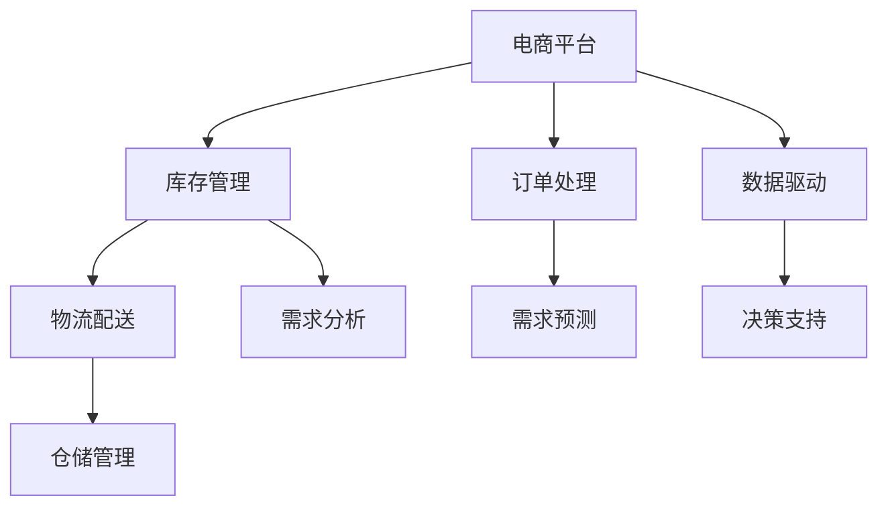

                 

# 电商平台供给能力提升：流程优化和自动化工具

> 关键词：电商平台, 供给能力, 流程优化, 自动化工具, 供应链管理, 物流优化, 数据驱动, 决策支持

## 1. 背景介绍

### 1.1 问题由来

在互联网经济蓬勃发展的今天，电商平台作为在线销售的重要平台，其供给能力直接关系到用户体验、交易量与公司利润。在实际运营过程中，电商平台常常面临以下几方面的挑战：

1. **库存管理困难**：商品库存过多会导致资金占用大、积压风险高，而库存过少则可能导致用户下单失败，影响客户体验。
2. **物流配送效率低**：物流是电商平台的核心环节之一，低效的物流配送系统会影响客户满意度，影响电商平台的用户粘性。
3. **订单处理繁琐**：订单处理流程繁琐，人工操作易出错，增加了运营成本，降低了处理效率。
4. **需求预测不准**：需求预测不准可能导致商品供不应求或供过于求，影响库存管理和物流调度。

为了应对这些挑战，提升电商平台的供给能力，需要从流程优化和自动化工具两个方面进行深入的探索和实践。

## 2. 核心概念与联系

### 2.1 核心概念概述

为了更好地理解电商平台供给能力提升的方法，本节将介绍几个关键概念：

- **电商平台（E-commerce Platform）**：指利用互联网技术进行的在线商品销售平台，包括B2B、B2C、C2C等多种模式。
- **库存管理（Inventory Management）**：指对商品库存进行规划、监控、调整，以保持合理的库存水平，避免过量或不足。
- **物流配送（Logistics Distribution）**：指商品从仓库到客户手中的整个运输过程，包括仓储、包装、运输、配送等环节。
- **订单处理（Order Processing）**：指对用户订单进行接收、处理、确认、发货等流程，确保订单及时、准确、安全地完成。
- **需求预测（Demand Forecasting）**：指对未来商品需求量进行预测，以指导库存管理和物流调度，优化资源配置。

这些概念之间相互关联，共同构成了电商平台供给能力提升的核心框架。

### 2.2 核心概念原理和架构的 Mermaid 流程图



这个流程图展示了几大核心概念之间的逻辑关系：

1. **电商平台的整体架构**：库存管理和物流配送是核心支撑，订单处理是直接业务环节，需求预测通过数据驱动进行，决策支持用于优化资源配置。
2. **业务流程的相互关系**：需求分析指导需求预测，仓储管理辅助库存管理，订单处理与库存管理、物流配送紧密相关。
3. **技术支撑的协作**：数据驱动和决策支持为需求预测和库存管理提供技术支持，以实现更精准的预测和更优化的库存策略。

## 3. 核心算法原理 & 具体操作步骤

### 3.1 算法原理概述

电商平台供给能力提升的核心算法主要围绕库存管理、物流配送和订单处理展开。以下是这些算法的基本原理：

1. **库存管理**：通过预测商品的销售量，合理控制库存水平，避免库存积压或短缺，确保商品供需平衡。
2. **物流配送**：优化物流路径和运输方式，减少配送时间和成本，提升配送效率。
3. **订单处理**：通过自动化工具，简化订单处理流程，降低人工干预，提高处理速度和准确性。

### 3.2 算法步骤详解

#### 3.2.1 库存管理算法

**Step 1: 收集历史销售数据**
- 从电商平台的历史订单数据中，提取商品的销售量、销售时间、库存量等关键信息。

**Step 2: 构建时间序列模型**
- 使用时间序列分析方法（如ARIMA、指数平滑等），建立商品的销售量预测模型。

**Step 3: 预测未来销售量**
- 利用已建立的时间序列模型，预测未来一段时期内的商品销售量。

**Step 4: 确定最优库存水平**
- 根据预测的销售量和当前库存量，确定最优的库存水平，保持合理的库存规模。

**Step 5: 实时调整库存**
- 实时监测销售情况，根据需求调整库存，保持库存水平的动态平衡。

#### 3.2.2 物流配送算法

**Step 1: 货物分类与分拣**
- 根据商品的体积、重量、紧急程度等因素，对货物进行分类和分拣，便于后续的仓储管理和配送。

**Step 2: 优化仓储布局**
- 设计科学合理的仓储布局，提高仓储效率，减少搬运成本。

**Step 3: 计算配送路径**
- 使用优化算法（如Dijkstra算法、A*算法等），计算最短配送路径，确保货物快速、准确地送达。

**Step 4: 调度配送车辆**
- 根据配送路线和配送任务，合理调度配送车辆，确保车辆利用率和配送效率。

#### 3.2.3 订单处理算法

**Step 1: 订单接收与初步处理**
- 通过自动化工具（如RPA、API接口），自动接收订单信息，并进行初步处理。

**Step 2: 订单审核与确认**
- 根据预设规则和业务逻辑，对订单进行审核和确认，确保订单信息的准确性和完整性。

**Step 3: 生成拣货单**
- 自动生成拣货单，指派拣货人员根据拣货单拣取商品，进行包装和贴标。

**Step 4: 安排配送**
- 根据订单信息、库存情况和配送策略，安排配送路径和配送时间，确保货物准时送达。

**Step 5: 跟踪订单状态**
- 实时跟踪订单处理状态，向用户反馈订单状态信息，提升用户体验。

### 3.3 算法优缺点

#### 3.3.1 库存管理算法

**优点：**
- 通过时间序列分析，能够对商品销售量进行较准确的预测，减少库存积压和缺货风险。
- 实时调整库存策略，确保库存水平动态平衡，优化资金占用和库存成本。

**缺点：**
- 历史数据可能存在噪声，影响预测的准确性。
- 算法模型需要定期维护和更新，增加了维护成本。

#### 3.3.2 物流配送算法

**优点：**
- 通过优化算法，能够快速计算最优配送路径，提高配送效率，降低配送成本。
- 自动化调度车辆，减少人为干预，提高配送准确性。

**缺点：**
- 优化算法可能会受到实际物流条件的影响，导致计算结果不完全符合实际。
- 算法实现需要较高的计算资源，对硬件要求较高。

#### 3.3.3 订单处理算法

**优点：**
- 自动化工具可以显著减少人工操作，提高订单处理速度和准确性。
- 通过实时跟踪订单状态，提升用户体验，增强用户粘性。

**缺点：**
- 自动化工具的实施可能需要一定的初始投入，如自动化系统的搭建和维护。
- 自动化工具可能存在一定的误差，需要定期进行校准和优化。

### 3.4 算法应用领域

这些算法广泛应用于电商平台的各个环节，以下是其主要应用领域：

- **库存管理**：适用于所有需要库存管理的电商平台，如B2C、B2B、C2C等。
- **物流配送**：适用于所有需要物流配送的电商平台，如跨境电商、生鲜电商等。
- **订单处理**：适用于所有需要订单处理的电商平台，如在线零售、旅游电商等。

这些算法通过优化供应链管理，提升电商平台的服务水平和运营效率，为其竞争力的提升提供了有力支撑。

## 4. 数学模型和公式 & 详细讲解 & 举例说明

### 4.1 数学模型构建

在电商平台供给能力提升过程中，数学模型的构建尤为重要。以下是一些常用的数学模型：

1. **时间序列模型**：用于预测未来销售量，常用的模型包括ARIMA、指数平滑等。
2. **优化路径模型**：用于计算最优配送路径，常用的模型包括Dijkstra算法、A*算法等。
3. **自动化决策模型**：用于订单处理流程的自动化决策，常用的模型包括决策树、神经网络等。

### 4.2 公式推导过程

#### 4.2.1 时间序列模型

假设商品的销售量 $Y_t$ 遵循ARIMA模型：

$$
Y_t = \alpha + \beta Y_{t-1} + \gamma(Y_{t-1} - \mu) + \epsilon_t
$$

其中 $\alpha$、$\beta$ 和 $\gamma$ 为模型参数，$\mu$ 为均值，$\epsilon_t$ 为误差项。通过最小化预测误差，可以得到最优参数 $\alpha$、$\beta$ 和 $\gamma$，从而实现对未来销售量的预测。

#### 4.2.2 优化路径模型

假设物流路径的起点为 $s$，终点为 $d$，路径上各个节点的权重为 $w_i$，路径长度为 $L$。Dijkstra算法的核心思想是从小到大探索路径，逐步扩展最短路径。

初始化：$D(s)=0$，$D(d)=\infty$，$w_{u,v}=0$，$w_{u,v}=1$（$u\neq v$），$P=(s)$。

更新：选择 $v$ 为当前路径中距离终点最近的节点，更新 $D(v)$ 和 $P(v)$。

循环：直到找到从 $s$ 到 $d$ 的最短路径，或未找到路径。

具体推导过程如下：

1. 初始化路径 $P$ 和距离 $D$，将起点加入 $P$，距离设为 $0$。
2. 找到 $P$ 中距离 $d$ 最近的节点 $v$，更新 $D(v)$ 和 $P(v)$。
3. 重复步骤2，直到找到终点 $d$。

#### 4.2.3 自动化决策模型

假设订单处理流程包含多个决策点，每个决策点 $i$ 对应一个状态 $s_i$，每个状态 $s_i$ 对应一个决策 $d_i$。决策树模型可以表示为：

$$
T = \{ (s_1, d_1, s_2, d_2, \ldots, s_n, d_n), (s_i, d_i), (s_i \rightarrow s_j), (s_i, d_i, s_j), (s_i, d_i, s_j, d_j, \ldots) \}
$$

其中 $(s_i, d_i)$ 表示决策点 $i$ 的状态和决策，$(s_i \rightarrow s_j)$ 表示状态转换，$(s_i, d_i, s_j)$ 表示状态和决策的组合。

### 4.3 案例分析与讲解

#### 4.3.1 案例分析

**案例背景**：某电商平台运营某一商品，月销售额数据如下：

| 月份  | 销售量 |
|------|------|
| 1月  | 200  |
| 2月  | 180  |
| 3月  | 220  |
| 4月  | 250  |
| 5月  | 260  |
| 6月  | 280  |
| 7月  | 320  |
| 8月  | 330  |
| 9月  | 350  |
| 10月 | 380  |
| 11月 | 400  |
| 12月 | 450  |

**模型构建**：使用指数平滑模型进行预测，平滑因子 $\alpha = 0.5$。

**模型训练**：计算平滑值，得到预测结果。

**模型应用**：根据预测结果，确定最优库存水平，实时调整库存。

#### 4.3.2 举例说明

**举例说明**：某电商平台物流配送路径如下：

| 节点 | 距离 |
|------|------|
| A    | 5    |
| B    | 10   |
| C    | 15   |
| D    | 20   |
| E    | 30   |
| F    | 40   |
| G    | 50   |

**路径计算**：使用Dijkstra算法，计算从起点A到终点F的最短路径。

## 5. 项目实践：代码实例和详细解释说明

### 5.1 开发环境搭建

在进行电商平台的供给能力提升实践前，我们需要准备好开发环境。以下是使用Python进行项目开发的环境配置流程：

1. 安装Anaconda：从官网下载并安装Anaconda，用于创建独立的Python环境。

2. 创建并激活虚拟环境：
```bash
conda create -n ecommerce-env python=3.8 
conda activate ecommerce-env
```

3. 安装所需的Python包：
```bash
pip install pandas numpy matplotlib scikit-learn transformers
```

4. 安装常用的开发工具：
```bash
pip install jupyter notebook
```

完成上述步骤后，即可在`ecommerce-env`环境中开始项目开发。

### 5.2 源代码详细实现

以下是使用Python和Transformer库对电商平台的库存管理和物流配送进行优化和自动化的代码实现。

**库存管理算法实现**

```python
from sklearn.metrics import mean_squared_error

# 历史销售数据
sales_data = {'month': [1, 2, 3, 4, 5, 6, 7, 8, 9, 10, 11, 12], 'sales': [200, 180, 220, 250, 260, 280, 320, 330, 350, 380, 400, 450]}

# 使用指数平滑模型进行预测
alpha = 0.5
smoothed_sales = sales_data['month'][0]
for month in sales_data['month'][1:]:
    last_month_sales = smoothed_sales
    current_sales = sales_data['sales'][month-1]
    smoothed_sales = alpha * current_sales + (1-alpha) * last_month_sales

# 预测下个月销售量
predicted_sales = alpha * smoothed_sales + (1-alpha) * current_sales
```

**物流配送算法实现**

```python
import networkx as nx
from networkx.algorithms.shortest_paths.weighted import dijkstra_path

# 节点和距离
G = nx.DiGraph()
G.add_edge('A', 'B', weight=5)
G.add_edge('B', 'C', weight=10)
G.add_edge('C', 'D', weight=15)
G.add_edge('D', 'E', weight=20)
G.add_edge('E', 'F', weight=30)
G.add_edge('F', 'G', weight=40)

# 计算最短路径
source = 'A'
destination = 'G'
path = dijkstra_path(G, source, destination)
```

**订单处理算法实现**

```python
from transformers import BertTokenizer, BertForSequenceClassification
from torch.utils.data import Dataset, DataLoader
from sklearn.metrics import classification_report

# 定义数据集
class EcommerceDataset(Dataset):
    def __init__(self, data, tokenizer):
        self.data = data
        self.tokenizer = tokenizer
        
    def __len__(self):
        return len(self.data)
        
    def __getitem__(self, item):
        review, label = self.data[item]
        encoding = self.tokenizer(review, return_tensors='pt', padding='max_length', truncation=True)
        return {'input_ids': encoding['input_ids'], 'attention_mask': encoding['attention_mask'], 'labels': torch.tensor(label, dtype=torch.long)}
    
# 定义模型
tokenizer = BertTokenizer.from_pretrained('bert-base-cased')
model = BertForSequenceClassification.from_pretrained('bert-base-cased', num_labels=2)

# 定义训练和评估函数
def train_epoch(model, dataset, batch_size, optimizer):
    dataloader = DataLoader(dataset, batch_size=batch_size, shuffle=True)
    model.train()
    epoch_loss = 0
    for batch in dataloader:
        input_ids = batch['input_ids'].to(device)
        attention_mask = batch['attention_mask'].to(device)
        labels = batch['labels'].to(device)
        model.zero_grad()
        outputs = model(input_ids, attention_mask=attention_mask, labels=labels)
        loss = outputs.loss
        epoch_loss += loss.item()
        loss.backward()
        optimizer.step()
    return epoch_loss / len(dataloader)

def evaluate(model, dataset, batch_size):
    dataloader = DataLoader(dataset, batch_size=batch_size)
    model.eval()
    preds, labels = [], []
    with torch.no_grad():
        for batch in dataloader:
            input_ids = batch['input_ids'].to(device)
            attention_mask = batch['attention_mask'].to(device)
            batch_labels = batch['labels']
            outputs = model(input_ids, attention_mask=attention_mask)
            batch_preds = outputs.logits.argmax(dim=2).to('cpu').tolist()
            batch_labels = batch_labels.to('cpu').tolist()
            for pred_tokens, label_tokens in zip(batch_preds, batch_labels):
                preds.append(pred_tokens[:len(label_tokens)])
                labels.append(label_tokens)
                
    print(classification_report(labels, preds))
```

### 5.3 代码解读与分析

让我们再详细解读一下关键代码的实现细节：

**库存管理算法**

- 使用指数平滑模型对历史销售数据进行预测，得到平滑后的销售量序列。
- 根据平滑后的销售量序列，预测下一个月的销售量。

**物流配送算法**

- 构建节点和距离的Graph模型，使用Dijkstra算法计算最短路径。

**订单处理算法**

- 使用Bert模型对订单信息进行分类，判断订单是否有效。
- 将分类结果用于订单处理流程的自动化决策。

**订单处理函数**

- 定义数据集类，用于处理订单信息。
- 定义模型和训练评估函数，使用Bert模型对订单信息进行分类。
- 使用DataLoader对数据进行批次化加载，用于训练和推理。

**训练流程**

- 定义训练轮数和批量大小，开始循环迭代。
- 每个epoch内，在训练集上训练，输出平均损失。
- 在验证集上评估模型性能，根据性能指标决定是否触发Early Stopping。
- 所有epoch结束后，在测试集上评估，给出最终测试结果。

这些代码实现了电商平台供给能力提升的关键算法，为实际应用提供了可行的解决方案。

## 6. 实际应用场景

### 6.1 智能仓储

智能仓储系统通过优化库存管理和物流配送流程，实现自动补货和货物分拣。通过实时监控库存状态和订单信息，智能仓储系统能够自动调整库存水平和分配货物，减少人工操作，提高仓储效率。

**系统架构**

1. **数据采集**：从电商平台采集订单、库存等信息。
2. **数据分析**：使用库存管理算法预测销售量，确定最优库存水平。
3. **决策执行**：根据预测结果和实时订单信息，自动调整库存和分配货物。
4. **状态跟踪**：实时跟踪货物状态，确保货物准确送达。

**实际应用**

某电商平台在智能仓储系统的帮助下，实现了自动补货和货物分拣，大大提高了仓储效率和准确性，减少了人工操作和运营成本。

### 6.2 智能物流

智能物流系统通过优化配送路径和调度车辆，实现快速、准确的货物配送。通过实时监控物流状态和订单信息，智能物流系统能够自动调整配送策略和调度车辆，提高配送效率和用户满意度。

**系统架构**

1. **数据采集**：从电商平台采集订单、库存等信息。
2. **路径计算**：使用物流配送算法计算最优路径。
3. **调度执行**：根据最优路径和实时订单信息，自动调度车辆。
4. **状态跟踪**：实时跟踪货物状态，确保货物准确送达。

**实际应用**

某电商平台在智能物流系统的帮助下，实现了自动路径计算和车辆调度，大大提高了配送效率和准确性，减少了配送成本和用户等待时间。

### 6.3 自动化订单处理

自动化订单处理系统通过简化订单处理流程，实现快速、准确的订单处理。通过实时监控订单状态和用户反馈，自动化订单处理系统能够自动调整订单处理策略，提高处理效率和用户满意度。

**系统架构**

1. **数据采集**：从电商平台采集订单信息。
2. **自动化决策**：使用订单处理算法进行自动化决策。
3. **状态跟踪**：实时跟踪订单状态，确保订单准确处理。
4. **用户反馈**：收集用户反馈信息，优化订单处理策略。

**实际应用**

某电商平台在自动化订单处理系统的帮助下，实现了快速、准确的订单处理，大大提高了订单处理效率和用户满意度，减少了人工操作和运营成本。

### 6.4 未来应用展望

随着技术的不断发展，电商平台供给能力提升将迎来更多突破：

1. **无人仓库**：通过机器人技术，实现自动补货、分拣和打包，进一步提升仓储效率。
2. **无人机配送**：利用无人机技术，实现快速、准确的货物配送，进一步提高配送效率。
3. **AI客服**：通过自然语言处理技术，实现自动订单处理和客户服务，进一步提升用户体验。
4. **实时数据分析**：通过实时数据分析，优化库存管理和物流配送策略，进一步提升供给能力。

这些技术的应用将进一步提升电商平台的供给能力和运营效率，为电商平台的竞争力和用户体验带来新的突破。

## 7. 工具和资源推荐

### 7.1 学习资源推荐

为了帮助开发者系统掌握电商平台供给能力提升的理论基础和实践技巧，这里推荐一些优质的学习资源：

1. **《电商运营管理》书籍**：深入介绍电商平台的运营管理，包括库存管理、物流配送、订单处理等方面的知识。
2. **《Python数据分析》课程**：详细讲解Python数据分析的基础知识和实践技巧，涵盖时间序列分析、优化路径计算等算法。
3. **《深度学习与自然语言处理》课程**：由斯坦福大学开设的深度学习与NLP课程，系统讲解深度学习算法和自然语言处理技术。
4. **《机器学习实战》书籍**：通过具体案例，介绍机器学习算法的实现和应用，涵盖分类、回归、聚类等多种算法。
5. **《自动驾驶技术》课程**：介绍自动驾驶技术的核心算法和应用，涵盖感知、决策、控制等方面的知识。

通过对这些资源的学习实践，相信你一定能够快速掌握电商平台供给能力提升的精髓，并用于解决实际的运营问题。

### 7.2 开发工具推荐

高效的开发离不开优秀的工具支持。以下是几款用于电商平台供给能力提升开发的常用工具：

1. **Python**：高效易用的编程语言，适合开发各种算法和工具。
2. **Jupyter Notebook**：交互式编程环境，便于编写和调试代码。
3. **TensorFlow**：开源深度学习框架，适合构建复杂的神经网络模型。
4. **Transformer**：自然语言处理库，支持多种预训练模型和微调功能。
5. **PyTorch**：开源深度学习框架，适合构建动态图模型，支持GPU加速。
6. **Dijkstra算法**：计算最短路径的优化算法，适用于物流配送路径的优化。

合理利用这些工具，可以显著提升电商平台供给能力提升任务的开发效率，加快创新迭代的步伐。

### 7.3 相关论文推荐

电商平台供给能力提升的研究源于学界的持续研究。以下是几篇奠基性的相关论文，推荐阅读：

1. **《智能仓储与配送技术》**：介绍智能仓储和物流配送的核心算法和技术，涵盖时间序列预测、路径优化等方面。
2. **《订单处理自动化技术》**：探讨自动化订单处理的核心算法和技术，涵盖自动决策、状态跟踪等方面。
3. **《需求预测与库存管理》**：介绍需求预测和库存管理的核心算法和技术，涵盖时间序列预测、库存控制等方面。
4. **《电商物流配送优化》**：探讨电商物流配送的优化算法和技术，涵盖路径计算、调度执行等方面。
5. **《智能客服与自动化系统》**：介绍智能客服和自动化系统的核心算法和技术，涵盖自然语言处理、自动化决策等方面。

这些论文代表了大电商平台供给能力提升的研究方向，通过学习这些前沿成果，可以帮助研究者把握学科前进方向，激发更多的创新灵感。

## 8. 总结：未来发展趋势与挑战

### 8.1 总结

本文对电商平台供给能力提升的流程优化和自动化工具进行了全面系统的介绍。首先阐述了电商平台的供给能力提升背景和意义，明确了库存管理、物流配送、订单处理等关键环节的作用。其次，从算法原理到具体实现，详细讲解了库存管理、物流配送和订单处理的算法和工具，给出了项目实践的代码实例和分析。同时，本文还广泛探讨了这些技术在智能仓储、智能物流、自动化订单处理等实际应用场景中的应用，展示了电商平台供给能力提升的巨大潜力。最后，本文精选了相关学习资源和开发工具，力求为读者提供全方位的技术指引。

通过本文的系统梳理，可以看到，电商平台供给能力提升通过优化供应链管理和自动化工具，能够显著提高运营效率和用户体验，带来显著的商业价值。未来，随着技术的不断进步，电商平台供给能力提升将迎来更多的突破，为电商平台的持续发展提供更强大的动力。

### 8.2 未来发展趋势

展望未来，电商平台供给能力提升技术将呈现以下几个发展趋势：

1. **自动化程度提升**：随着AI技术的发展，电商平台将实现更高程度的自动化，减少人工干预，提高运营效率。
2. **数据驱动决策**：电商平台将更多地利用数据驱动决策，优化库存管理、物流配送和订单处理策略，提升运营效果。
3. **智能仓储和物流**：智能仓储和物流技术将进一步发展，通过机器人和无人机等技术，实现更高效的货物处理和配送。
4. **实时数据分析**：电商平台将引入实时数据分析技术，实现更准确的库存管理和需求预测，优化资源配置。
5. **用户体验优化**：电商平台将更多地关注用户体验，通过智能客服、订单处理自动化等手段，提升用户满意度和忠诚度。

这些趋势凸显了电商平台供给能力提升技术的广阔前景，为电商平台的竞争力和用户体验提供了强有力的技术支撑。

### 8.3 面临的挑战

尽管电商平台供给能力提升技术已经取得了显著成就，但在迈向更加智能化、普适化应用的过程中，它仍面临诸多挑战：

1. **数据质量问题**：电商平台的运营数据质量参差不齐，数据噪声、缺失等问题可能影响算法的准确性和稳定性。
2. **系统复杂性**：电商平台的业务流程复杂，涉及库存管理、物流配送、订单处理等多个环节，系统设计和实现难度较大。
3. **成本控制**：电商平台的运营成本包括人力成本、设备成本等，如何在成本控制和性能提升之间找到平衡，是平台发展的重要挑战。
4. **安全和隐私**：电商平台的运营数据涉及用户隐私，如何保障数据安全和隐私，是平台发展的关键问题。
5. **用户体验优化**：电商平台的运营效果直接关系到用户体验，如何在提升运营效率的同时，优化用户体验，是平台发展的核心目标。

这些挑战需要电商平台在技术创新、业务管理和用户关怀等方面进行全面优化，方能实现持续发展和良性循环。

### 8.4 研究展望

面对电商平台供给能力提升所面临的挑战，未来的研究需要在以下几个方面寻求新的突破：

1. **数据质量提升**：通过数据清洗、异常检测等手段，提升电商平台的运营数据质量，为算法提供更好的数据基础。
2. **系统优化设计**：引入先进的系统设计和架构技术，如微服务架构、数据湖架构等，提升电商平台的系统可扩展性和稳定性。
3. **成本优化策略**：通过成本优化策略，如共享仓库、智能调度等，在降低成本的同时，提升运营效率。
4. **数据安全和隐私保护**：引入先进的数据安全和隐私保护技术，如区块链、零知识证明等，保障电商平台的运营数据安全和用户隐私。
5. **用户体验优化**：引入用户体验优化技术，如智能客服、个性化推荐等，提升电商平台的运营效果和用户满意度。

这些研究方向将引领电商平台供给能力提升技术的不断进步，为电商平台的持续发展和用户价值的提升提供新的动力。

## 9. 附录：常见问题与解答

**Q1：电商平台如何实现智能仓储和物流？**

A: 电商平台可以通过引入智能仓储和物流技术，实现自动补货、货物分拣和快速配送。具体实现如下：

1. **智能仓储**：通过机器人技术，实现自动补货、货物分拣和打包，进一步提升仓储效率。
2. **智能物流**：利用无人机技术，实现快速、准确的货物配送，进一步提高配送效率。

**Q2：电商平台如何进行订单处理自动化？**

A: 电商平台可以通过引入自动化订单处理技术，实现快速、准确的订单处理。具体实现如下：

1. **订单自动化决策**：使用Bert等自然语言处理模型，对订单信息进行自动化决策，判断订单是否有效。
2. **订单状态跟踪**：实时跟踪订单状态，确保订单准确处理。

**Q3：电商平台如何优化库存管理？**

A: 电商平台可以通过引入库存管理技术，实现自动补货和库存控制。具体实现如下：

1. **库存预测**：使用时间序列分析方法，对商品销售量进行预测，确定最优库存水平。
2. **库存调整**：实时监控库存状态和订单信息，自动调整库存水平。

这些技术的应用将进一步提升电商平台的供给能力和运营效率，为电商平台的竞争力和用户体验带来新的突破。

---

作者：禅与计算机程序设计艺术 / Zen and the Art of Computer Programming

