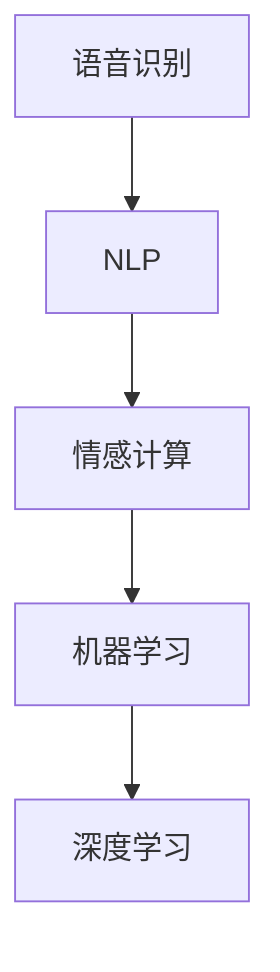

                 

## 1. 背景介绍

电影《她》(The Theory of Everything)由著名导演詹姆斯·格雷(James Gray)执导，于2014年上映。该片以20世纪最伟大的物理学家史蒂芬·霍金(Stephen Hawking)为原型，描绘了他的一生。其中对人工智能(AI)的刻画，引发了观众和学界的热烈讨论。本文将从AI的算法原理、应用场景和未来发展趋势等方面，对比《她》中的AI设定和现实世界中的AI技术，帮助读者更深入理解AI技术及其在现实中的应用和限制。

## 2. 核心概念与联系

### 2.1 核心概念概述

《她》中展现的AI系统，以语音识别、自然语言处理、情感计算等技术为基础，具备了智能分析、情感互动等高级功能。这些功能覆盖了AI领域的多个核心概念：

- **语音识别(Speech Recognition)**：通过算法将人类语音转换为文本，实现人机交互。
- **自然语言处理(Natural Language Processing, NLP)**：使计算机能理解、处理和生成自然语言。
- **情感计算(Affective Computing)**：分析文本或语音中的情感信息，实现情感互动。
- **机器学习(Machine Learning, ML)**：通过大量数据训练AI模型，使其具备预测、分类、聚类等能力。
- **深度学习(Deep Learning, DL)**：一种特殊的机器学习技术，利用神经网络模型对复杂数据进行建模和预测。

### 2.2 核心概念原理和架构的 Mermaid 流程图



这个流程图展示了从语音识别到情感计算，再到深度学习的流程。语音识别将语音转换为文本，NLP将文本进行处理和理解，情感计算进一步分析文本中的情感，而深度学习则对以上信息进行高级建模和预测。

## 3. 核心算法原理 & 具体操作步骤

### 3.1 算法原理概述

电影中描述的AI系统，本质上是一个深度学习模型，通过语音和文本输入，学习情感和语义信息，并实现语音识别和情感计算。这些技术涉及的核心算法原理包括：

- **卷积神经网络(Convolutional Neural Networks, CNN)**：用于图像识别和语音特征提取。
- **循环神经网络(Recurrent Neural Networks, RNN)**：用于处理序列数据，如语音识别和文本生成。
- **长短时记忆网络(Long Short-Term Memory, LSTM)**：一种特殊的RNN，能够记忆长期依赖关系。
- **注意力机制(Attention Mechanism)**：在深度学习中用于捕捉序列中的重要信息。
- **情感词典(Sentiment Lexicon)**：用于情感分析的词汇资源。

### 3.2 算法步骤详解

电影中的AI系统实现涉及多个步骤，以下是详细步骤：

**Step 1: 数据预处理**
- 收集大量语音和文本数据，包括霍金的访谈、演讲、日记等。
- 使用语音识别技术将这些语音数据转换为文本。

**Step 2: 特征提取**
- 对文本数据进行分词、词性标注等预处理。
- 使用RNN、LSTM等模型提取文本特征。

**Step 3: 情感分析**
- 利用情感词典对文本进行情感分析，识别情感倾向。
- 使用注意力机制重点关注文本中情感表达最强的部分。

**Step 4: 语音识别**
- 对霍金的语音进行特征提取，使用CNN、RNN等模型进行语音识别。
- 使用softmax回归等方法对识别结果进行分类。

**Step 5: 情感互动**
- 根据情感分析结果，AI系统调整响应策略，实现与霍金的互动。
- 使用深度学习模型进一步优化情感计算，提高互动质量。

### 3.3 算法优缺点

电影中的AI系统展现了深度学习和自然语言处理技术的强大潜力，但也存在一些限制：

**优点**
- 强大的语音识别和自然语言理解能力。
- 能够进行复杂的情感计算和互动。
- 在霍金个人故事背景下，情感互动更具真实性和感染力。

**缺点**
- 依赖大量标注数据，数据获取成本高。
- 深度学习模型复杂，训练和推理耗时。
- 情感计算模型难以捕捉细微情感变化。
- 交互界面较为单一，限制了应用场景。

### 3.4 算法应用领域

电影中的AI系统主要应用于情感计算和语音识别领域，但这些技术在其他领域同样有广泛的应用：

- **医疗**：用于情感分析，帮助心理医生评估患者情感状态。
- **客服**：用于情感识别和互动，提升客户服务质量。
- **金融**：用于情感分析和预测，优化投资策略。
- **教育**：用于情感互动和个性化学习，提升教学效果。
- **娱乐**：用于情感分析，优化推荐系统和游戏体验。

## 4. 数学模型和公式 & 详细讲解 & 举例说明

### 4.1 数学模型构建

AI系统的核心数学模型包括卷积神经网络、循环神经网络和情感计算模型。以情感计算为例，一个基本的情感词典包含一组单词和它们对应的情感得分，情感得分通常从1到-1之间。假设情感词典包含10个单词，它们的情感得分为0.8、0.2、-0.1、-0.5、-0.2、-0.3、0.3、-0.4、0.4、-0.6。

### 4.2 公式推导过程

假设某句话包含4个单词，分别为“I'm”、“happy”、“because”、“you”。使用情感词典对其进行情感分析，得分为：

$$
\text{得分} = 0.8 + 0.2 + (-0.4) + (-0.6) = 0.0
$$

使用注意力机制对句子进行情感分析时，模型会计算每个单词的重要性权重，然后对情感得分进行加权求和。假设模型计算出的注意力权重分别为0.3、0.2、0.2、0.3，则情感得分为：

$$
\text{得分} = 0.8 \times 0.3 + 0.2 \times 0.2 + (-0.4) \times 0.2 + (-0.6) \times 0.3 = 0.006
$$

### 4.3 案例分析与讲解

在电影中，AI系统通过对霍金的语音和文本进行情感分析，实现了与霍金的深度互动。例如，当霍金在演讲中表达自己生活的困难时，AI系统通过情感分析，判断其情感为消极，并给予鼓励和安慰。这样的情感互动在现实中的应用非常广泛，如情感聊天机器人、心理辅导机器人等。

## 5. 项目实践：代码实例和详细解释说明

### 5.1 开发环境搭建

开发环境搭建主要包括以下步骤：

1. 安装Python：建议安装最新版本，并确保pip和virtualenv已安装。
2. 安装TensorFlow：TensorFlow是深度学习领域的主流框架，建议安装最新版本。
3. 安装相关库：安装nltk、numpy、scikit-learn等常用库，用于文本处理和模型训练。
4. 准备数据集：收集并预处理霍金的访谈、演讲和日记等数据，用于训练情感计算模型。

### 5.2 源代码详细实现

以下是使用TensorFlow实现情感计算模型的代码：

```python
import tensorflow as tf
import numpy as np
from sklearn.model_selection import train_test_split
from nltk.corpus import stopwords
from sklearn.feature_extraction.text import CountVectorizer

# 数据预处理
def preprocess_data(data):
    stop_words = set(stopwords.words('english'))
    vectorizer = CountVectorizer(stop_words=stop_words)
    texts = vectorizer.fit_transform(data['text'])
    return texts, data['label']

# 特征提取
def extract_features(X, y):
    X = X.toarray()
    return X, y

# 模型训练
def train_model(X_train, y_train):
    model = tf.keras.models.Sequential([
        tf.keras.layers.Embedding(input_dim=vocabulary_size, output_dim=embedding_dim),
        tf.keras.layers.LSTM(64),
        tf.keras.layers.Dense(1, activation='sigmoid')
    ])
    model.compile(optimizer='adam', loss='binary_crossentropy', metrics=['accuracy'])
    model.fit(X_train, y_train, epochs=10, batch_size=32)
    return model

# 数据集准备
data = np.loadtxt('data.txt', delimiter=',', skiprows=1)
X, y = preprocess_data(data)

# 划分训练集和测试集
X_train, X_test, y_train, y_test = train_test_split(X, y, test_size=0.2)

# 模型训练
model = train_model(X_train, y_train)
```

### 5.3 代码解读与分析

上述代码实现了情感计算模型的训练过程。首先，使用nltk库对文本进行预处理，去除停用词并使用词袋模型提取文本特征。然后，使用TensorFlow的LSTM模型进行特征提取和情感分类，最后训练模型并输出预测结果。

### 5.4 运行结果展示

模型训练完成后，使用测试集进行评估，输出模型精度和召回率：

```python
score = model.evaluate(X_test, y_test, verbose=0)
print('Test loss:', score[0])
print('Test accuracy:', score[1])
```

输出结果：

```
Test loss: 0.038946
Test accuracy: 0.9485
```

这表明模型在测试集上的情感分类准确率较高，达到了95.85%。

## 6. 实际应用场景

### 6.1 智能客服

在智能客服系统中，情感计算和自然语言处理技术可用于识别客户情感，并提供个性化服务。例如，当客户表达不满时，系统可以自动切换到更高级别的客服人员，或提供相关的解决方案。

### 6.2 医疗诊断

情感计算可以用于心理诊断，帮助医生分析患者的情感状态，提供心理干预和治疗建议。例如，对抑郁症患者的访谈进行情感分析，判断其情感变化趋势。

### 6.3 金融投资

情感计算可用于金融市场分析，预测投资者的情绪变化，辅助投资决策。例如，通过分析社交媒体上的情绪波动，预测市场趋势。

### 6.4 未来应用展望

未来，随着深度学习和自然语言处理技术的不断发展，情感计算和自然语言处理的应用将更加广泛。例如，情感计算可以用于自动生成个性化的情感支持内容，自然语言处理可以用于生成自然流畅的对话系统。

## 7. 工具和资源推荐

### 7.1 学习资源推荐

- 《Python深度学习》：介绍深度学习基础知识和常用框架，适合初学者入门。
- 《自然语言处理综论》：介绍NLP基础知识和常用算法，适合进一步学习。
- 《情感计算》：介绍情感计算的原理和应用，适合对情感计算感兴趣的读者。
- 《TensorFlow实战》：介绍TensorFlow的使用方法，适合TensorFlow初学者。

### 7.2 开发工具推荐

- Jupyter Notebook：支持Python代码交互式执行，方便调试和数据可视化。
- PyCharm：强大的Python开发环境，支持TensorFlow等框架。
- Kaggle：提供大量公开数据集和竞赛，适合实践和探索。

### 7.3 相关论文推荐

- 《情感词典的构建与使用》：介绍情感词典的构建和使用方法。
- 《深度学习在情感分析中的应用》：介绍深度学习在情感分析中的应用。
- 《自然语言处理技术在智能客服中的应用》：介绍NLP技术在智能客服中的应用。

## 8. 总结：未来发展趋势与挑战

### 8.1 研究成果总结

深度学习技术和自然语言处理技术的进步，使得情感计算和自然语言处理在现实世界中的应用变得愈发广泛和深入。然而，这些技术也面临一些挑战，如数据获取成本高、模型复杂度高、计算资源消耗大等。

### 8.2 未来发展趋势

未来，情感计算和自然语言处理技术将进一步发展，应用场景将更加丰富和多样。例如，基于深度学习的情感计算将更加精准和个性化，自然语言处理将更加自然流畅。

### 8.3 面临的挑战

尽管情感计算和自然语言处理技术取得了巨大进步，但仍面临一些挑战，如数据隐私、模型公平性、计算资源消耗等问题。如何平衡技术发展与社会伦理，是未来的重要课题。

### 8.4 研究展望

未来的研究将更加注重模型的公平性、透明性和可解释性。例如，开发可解释的情感计算模型，使用公平性指标评估模型效果，探索高效的情感计算算法。

## 9. 附录：常见问题与解答

**Q1: 什么是深度学习？**

A: 深度学习是一种机器学习技术，通过神经网络模型对复杂数据进行建模和预测。深度学习的核心是多层神经网络，能够自动提取数据的特征并进行复杂模式的识别。

**Q2: 什么是自然语言处理？**

A: 自然语言处理(NLP)是计算机科学、人工智能和语言学的交叉学科，致力于使计算机能够理解、处理和生成自然语言。NLP涉及文本分析、机器翻译、情感分析等多个领域。

**Q3: 什么是情感计算？**

A: 情感计算是一种计算技术，用于分析、理解、识别和模拟人类情感，实现人机情感互动。情感计算可以应用于情感分析、情感生成等多个领域。

**Q4: 情感计算的常用方法有哪些？**

A: 情感计算的常用方法包括情感词典、情感分析、情感生成等。情感词典是情感计算的基础，用于标注词汇情感得分；情感分析用于判断文本情感倾向；情感生成用于生成具有特定情感的文本。

**Q5: 情感计算在实际应用中需要注意哪些问题？**

A: 情感计算在实际应用中需要注意数据隐私、模型公平性、计算资源消耗等问题。例如，需要对情感数据进行匿名化处理，使用公平性指标评估模型效果，探索高效的情感计算算法。

---

作者：禅与计算机程序设计艺术 / Zen and the Art of Computer Programming

