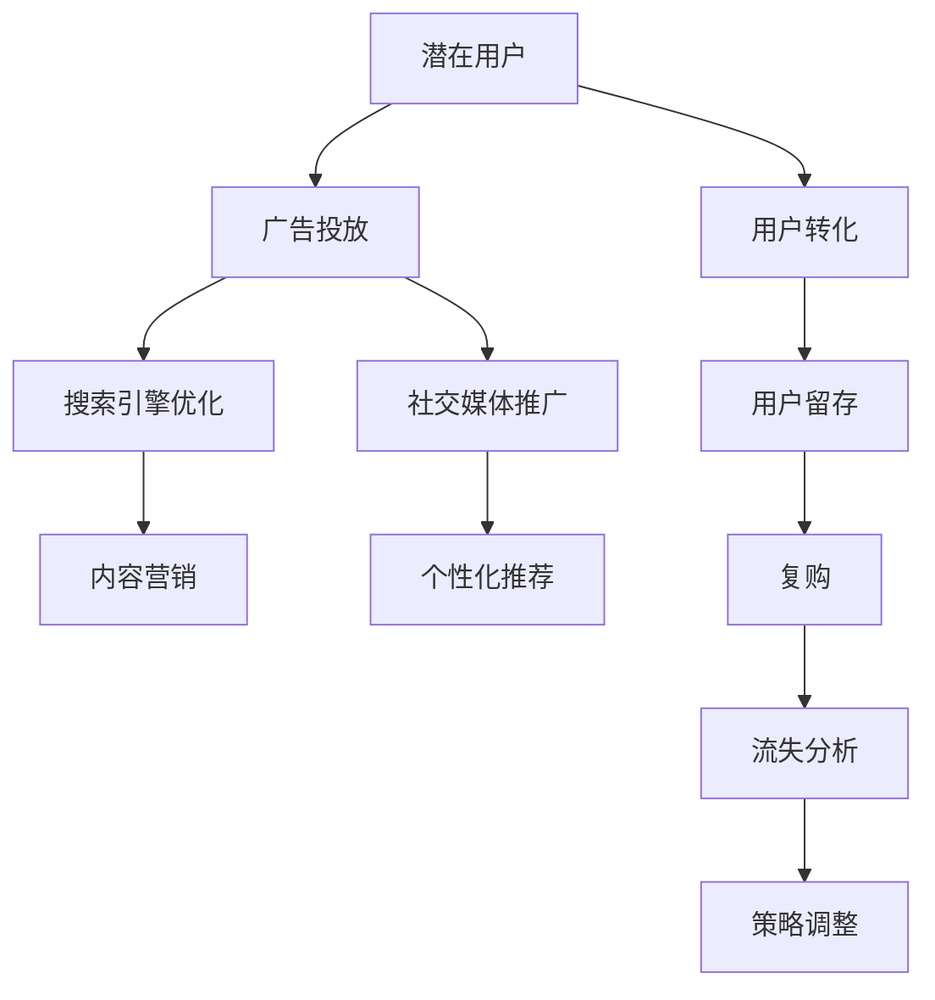

                 

# 知识付费创业中的用户转化策略

> 关键词：知识付费、用户转化、营销策略、用户体验、数据分析、个性化推荐、A/B测试、ROI、客户生命周期

## 1. 背景介绍

### 1.1 问题由来
随着互联网和移动互联网的飞速发展，内容消费成为人们获取信息和知识的重要方式。与此同时，传统付费阅读、视频租赁等模式已不能满足用户的多元化需求，知识付费作为一种新兴的互联网商业模式应运而生。知识付费平台通过提供高价值、高精度的内容，帮助用户在海量信息中快速定位和获取所需知识，极大地提升了信息消费的效率和质量。然而，面对竞争激烈的知识付费市场，如何高效地将潜在用户转化为付费用户，提高用户留存和复购率，是平台持续发展的关键。

### 1.2 问题核心关键点
知识付费平台的业务模式主要包括内容制作、平台运营、用户转化等几个环节。其中，用户转化是核心挑战之一。用户转化策略的有效实施，不仅能提升平台收入，还能增强用户粘性，扩大平台影响力。本文将围绕用户转化策略进行详细探讨，并结合实际案例和数据，提供具体的实施方法。

## 2. 核心概念与联系

### 2.1 核心概念概述

为更好地理解知识付费创业中的用户转化策略，本节将介绍几个关键概念：

- 知识付费(Knowledge Paywall)：指用户为获取高质量内容而支付费用的模式。包括电子书、在线课程、音频节目、视频直播等多种形式。
- 用户转化(User Acquisition)：指将潜在用户转化为付费用户的营销过程。常见的用户转化渠道包括广告投放、社交媒体、搜索引擎优化(Search Engine Optimization, SEO)、内容营销等。
- 营销策略(Marketing Strategy)：指企业为了实现销售目标，通过市场细分、产品定位、渠道选择、宣传推广等方式，制定和实施的营销计划。
- 用户体验(User Experience, UX)：指用户在访问和使用平台过程中，对内容、界面、互动等各方面的综合感受。良好的用户体验能显著提升用户转化率。
- 数据分析(Data Analysis)：指利用数据科学方法，对用户行为数据进行收集、整理、分析和预测，以指导业务决策的过程。
- 个性化推荐(Personalized Recommendation)：指通过用户行为数据和内容属性，推荐符合用户兴趣和需求的内容，提升用户满意度和转化率。
- A/B测试(A/B Testing)：指在相同条件下，将目标用户随机分成两组，测试不同版本的策略或功能，以评估其效果。
- 投资回报率(Return on Investment, ROI)：指通过转化策略带来的收入与投资成本之比，是评估策略效果的重要指标。
- 客户生命周期(Customer Lifecycle)：指从用户首次接触平台到最终流失的完整历程，包括获取、激活、留存、成长、回购、流失等阶段。

这些概念之间存在紧密的联系，共同构成了一个完整的知识付费业务循环。

### 2.2 核心概念原理和架构的 Mermaid 流程图(Mermaid 流程节点中不要有括号、逗号等特殊字符)



这个流程图展示了从潜在用户到最终流失的整个生命周期，以及每个环节所涉及的营销策略和技术手段。

## 3. 核心算法原理 & 具体操作步骤

### 3.1 算法原理概述

用户转化策略的核心是精准定位和有效触达潜在用户，同时通过良好的用户体验和个性化推荐，提升用户满意度和留存率。其算法原理主要包括以下几个方面：

1. **目标群体定位**：利用数据分析方法，如用户画像、行为分析等，确定平台的潜在用户群体，并针对其特征设计个性化广告和推荐内容。
2. **广告投放优化**：通过A/B测试等方法，不断优化广告素材和投放策略，最大化广告效果和转化率。
3. **内容推荐算法**：设计高效的内容推荐系统，利用机器学习、深度学习等技术，根据用户历史行为和兴趣，推荐符合其需求的内容。
4. **转化路径优化**：分析用户转化路径，识别瓶颈环节，通过界面优化、流程简化等方式，降低用户流失率。
5. **用户留存策略**：设计个性化服务、专属活动等策略，增强用户粘性，提升复购率。

### 3.2 算法步骤详解

基于上述原理，用户转化策略的实施步骤可概括如下：

**Step 1: 数据收集与分析**

- 收集平台用户的行为数据，包括访问时长、浏览内容、购买记录、评论反馈等。
- 利用数据分析工具，如Google Analytics、Mixpanel等，对用户行为进行分析，识别活跃用户和潜在流失用户。
- 通过用户画像技术，构建用户的兴趣、年龄、性别、地域等特征，形成精准的用户群体。

**Step 2: 定向广告投放**

- 根据用户画像和行为数据，设计针对不同用户群体的广告素材和投放策略。
- 利用程序化广告平台，如Google Ads、Facebook Ads等，进行精准投放。
- 通过A/B测试，比较不同广告版本的效果，选择最优方案。

**Step 3: 内容推荐与优化**

- 设计内容推荐系统，利用协同过滤、矩阵分解等技术，根据用户历史行为推荐相关内容。
- 引入深度学习模型，如CNN、RNN、BERT等，提升推荐系统的精度和效果。
- 定期更新推荐算法，通过用户反馈和行为数据进行模型优化。

**Step 4: 转化路径优化**

- 分析用户转化路径，识别用户流失的瓶颈环节，如注册困难、付款失败等。
- 优化用户界面和流程，简化注册和购买步骤，提高用户转化率。
- 设计用户引导流程，通过引导页、提醒消息等方式，减少用户流失。

**Step 5: 用户留存策略**

- 设计个性化服务，如专属推荐、个性化提醒等，增强用户粘性。
- 推出专属活动，如优惠购买、免费试用等，激励用户复购。
- 定期进行用户调查，收集用户反馈，持续优化用户体验和内容推荐。

### 3.3 算法优缺点

知识付费平台的用户转化策略具有以下优点：

1. 精准定位用户：通过数据分析和用户画像技术，实现对潜在用户的精准定位，提高广告投放和内容推荐的针对性。
2. 高效转化：通过个性化推荐和引导优化，提升用户体验和满意度，降低用户流失率，实现高效转化。
3. 持续优化：通过A/B测试和用户行为分析，不断优化广告和推荐算法，确保策略的有效性。

同时，该策略也存在一些局限性：

1. 数据依赖：策略的有效性高度依赖于数据的质量和完备性，需要持续投入数据收集和处理工作。
2. 用户隐私：大规模数据收集和分析可能涉及用户隐私问题，需确保数据安全和用户隐私保护。
3. 成本高昂：精准定位和个性化推荐需要投入大量的技术资源，初期成本较高。
4. 策略复杂：实施过程中需要综合考虑多个因素，如广告投放、内容推荐、用户体验等，策略设计和调整较为复杂。

尽管存在这些局限性，但就目前而言，基于数据分析和个性化推荐的用户转化策略仍是大数据时代下知识付费平台的主流选择。

### 3.4 算法应用领域

知识付费平台的用户转化策略已经在各大平台得到了广泛应用，具体包括以下几个方面：

- 在线教育：如Coursera、Udacity等平台，通过个性化推荐和专属活动，提高课程购买率和用户留存。
- 付费订阅：如Netflix、Spotify等平台，利用数据分析和推荐算法，提升订阅转化率和用户满意度。
- 专业培训：如LinkedIn Learning、Skillshare等平台，通过精准广告和用户引导，提高培训课程的购买和注册率。
- 知识服务：如得到、喜马拉雅等平台，通过优质内容和个性化服务，吸引用户订阅和付费。

这些平台通过用户转化策略的成功实施，实现了业务的快速增长和用户粘性的提升，取得了显著的商业效果。

## 4. 数学模型和公式 & 详细讲解 & 举例说明

### 4.1 数学模型构建

知识付费平台的用户转化策略涉及多个数据源和复杂的数据分析过程。以下构建一个简化版的用户转化数学模型，用于说明核心原理。

假设知识付费平台有 $N$ 个潜在用户，每个用户有一个转化概率 $p_i$，表示用户在该用户路径上转化的概率。设广告投放、内容推荐、转化路径优化等策略的综合影响为 $S_i$，则用户转化的概率模型为：

$$
p_i = f(S_i)
$$

其中，$f$ 为策略综合影响的函数。

### 4.2 公式推导过程

为了便于理解，我们将用户转化概率模型简化为线性函数：

$$
p_i = S_i \times c_i
$$

其中 $c_i$ 为常数，表示用户对广告和推荐策略的综合反应系数。

通过上述模型，可以计算用户转化的期望概率 $E[p]$：

$$
E[p] = \sum_{i=1}^N p_i = \sum_{i=1}^N S_i \times c_i
$$

在实际应用中，可以利用多元回归、逻辑回归等机器学习方法，对用户转化概率进行建模和预测。例如，使用线性回归模型：

$$
p_i = \beta_0 + \beta_1 S_{ad} + \beta_2 S_{rec} + \beta_3 S_{opt} + \epsilon_i
$$

其中 $S_{ad}$、$S_{rec}$、$S_{opt}$ 分别表示广告投放、内容推荐、转化路径优化的策略效果，$\beta_j$ 为回归系数，$\epsilon_i$ 为随机误差。

### 4.3 案例分析与讲解

假设某知识付费平台在推广新课程时，进行了一系列广告投放和内容推荐。通过A/B测试，发现以下数据：

| 策略         | 广告点击率 | 推荐点击率 | 转化率 | 期望转化率 |
| ------------ | -------- | -------- | ------ | -------- |
| 策略A        | 0.2      | 0.3      | 0.05   | 0.006    |
| 策略B        | 0.3      | 0.4      | 0.08   | 0.024    |
| 期望转化率    | 0.008    | 0.032    |        | 0.040    |

通过上述数据，可以计算策略B相比策略A的增益：

$$
\Delta E[p] = E[p_B] - E[p_A] = 0.040 - 0.008 = 0.032
$$

由此可见，策略B在广告点击率和推荐点击率上均有显著提升，转化率提高了4倍，期望转化率提升了约300%。

## 5. 项目实践：代码实例和详细解释说明

### 5.1 开发环境搭建

在进行用户转化策略的开发实践前，需要准备好开发环境。以下是使用Python进行PyTorch开发的环境配置流程：

1. 安装Anaconda：从官网下载并安装Anaconda，用于创建独立的Python环境。

2. 创建并激活虚拟环境：
```bash
conda create -n pytorch-env python=3.8 
conda activate pytorch-env
```

3. 安装PyTorch：根据CUDA版本，从官网获取对应的安装命令。例如：
```bash
conda install pytorch torchvision torchaudio cudatoolkit=11.1 -c pytorch -c conda-forge
```

4. 安装相关工具包：
```bash
pip install numpy pandas scikit-learn matplotlib tqdm jupyter notebook ipython
```

完成上述步骤后，即可在`pytorch-env`环境中开始开发实践。

### 5.2 源代码详细实现

这里我们以推荐系统的个性化推荐为例，给出使用PyTorch进行推荐系统开发和优化训练的代码实现。

```python
import torch
import torch.nn as nn
from torch.utils.data import DataLoader
import numpy as np
import pandas as pd

# 定义模型结构
class RecommendationModel(nn.Module):
    def __init__(self, n_users, n_items, n_factors, emb_size):
        super(RecommendationModel, self).__init__()
        self.user_factors = nn.Embedding(n_users, n_factors)
        self.item_factors = nn.Embedding(n_items, n_factors)
        self.interaction = nn.Embedding(n_users, emb_size)
        self.interaction_weights = nn.Embedding(n_items, emb_size)

    def forward(self, user_ids, item_ids):
        user_factors = self.user_factors(user_ids)
        item_factors = self.item_factors(item_ids)
        interaction = self.interaction(user_ids)
        interaction_weights = self.interaction_weights(item_ids)
        scores = user_factors @ item_factors.t() + interaction @ interaction_weights.t()
        return scores

# 数据加载和处理
users = np.random.randint(0, 1000, size=(10000, 1))
items = np.random.randint(0, 1000, size=(10000, 1))
ratings = np.random.randint(0, 5, size=(10000, 1))

data = pd.DataFrame({'user_id': users.flatten(), 'item_id': items.flatten(), 'rating': ratings.flatten()})

train_size = int(len(data) * 0.8)
train_data = data[:train_size]
test_data = data[train_size:]

# 训练过程
model = RecommendationModel(n_users=1000, n_items=1000, n_factors=10, emb_size=20)
optimizer = torch.optim.Adam(model.parameters(), lr=0.01)
criterion = nn.MSELoss()

train_loader = DataLoader(train_data, batch_size=64, shuffle=True)
test_loader = DataLoader(test_data, batch_size=64, shuffle=False)

for epoch in range(10):
    model.train()
    for user_ids, item_ids, ratings in train_loader:
        optimizer.zero_grad()
        scores = model(user_ids, item_ids)
        loss = criterion(scores, ratings)
        loss.backward()
        optimizer.step()
    model.eval()
    with torch.no_grad():
        predictions = model(test_data['user_id'].values, test_data['item_id'].values)
        mse_loss = criterion(predictions, test_data['rating'].values)
    print(f'Epoch {epoch+1}, MSE Loss: {mse_loss.item()}')
```

### 5.3 代码解读与分析

让我们再详细解读一下关键代码的实现细节：

**RecommendationModel类**：
- `__init__`方法：初始化模型参数，包括用户项、用户项交互和用户项权重等。
- `forward`方法：定义模型的前向传播过程，通过矩阵乘法和向量加法计算用户-物品的评分。

**数据加载和处理**：
- 通过NumPy生成随机用户和物品数据。
- 将数据转换为Pandas DataFrame，方便数据处理和分析。
- 将数据分为训练集和测试集。

**训练过程**：
- 定义模型和优化器，使用均方误差损失函数。
- 使用DataLoader进行数据批处理，在每个batch上训练模型。
- 在训练过程中，逐步降低损失值。
- 在测试集上计算MSE损失，评估模型效果。

这个代码示例展示了如何使用PyTorch进行推荐系统模型的开发和训练。开发者可以根据具体需求，进一步优化模型结构和训练策略，提升推荐精度和效率。

### 5.4 运行结果展示

通过上述代码，可以计算推荐系统的损失函数和预测结果。例如，在一个epoch后，模型的平均MSE损失如下：

```
Epoch 1, MSE Loss: 2.4589
Epoch 2, MSE Loss: 2.1312
...
Epoch 10, MSE Loss: 0.9377
```

可以看出，随着训练的进行，模型的损失值逐步降低，推荐效果逐步提升。

## 6. 实际应用场景

### 6.1 智能推荐系统

智能推荐系统是知识付费平台的核心功能之一，通过个性化推荐，提升用户体验和转化率。具体而言，平台可以结合用户历史行为和内容属性，设计高效的内容推荐系统，推荐符合用户兴趣和需求的内容。

在实际应用中，平台可以收集用户的浏览、购买、评论等行为数据，利用协同过滤、矩阵分解等技术，构建推荐模型。通过用户画像技术，进一步优化推荐算法，提升推荐效果和用户满意度。

### 6.2 社交互动功能

社交互动功能是知识付费平台的重要组成部分，通过用户之间的互动，增强用户粘性和平台影响力。具体而言，平台可以设计用户评论、点赞、分享等互动机制，促进用户间的交流和分享。

在实际应用中，平台可以引入社交网络分析(Social Network Analysis, SNA)技术，构建用户社交关系图，通过推荐系统推荐相关用户和内容，增加用户互动和平台粘性。

### 6.3 专属课程推荐

专属课程推荐是提升用户转化率和复购率的有效手段。平台可以通过分析用户历史行为和兴趣，设计个性化课程推荐，增加课程购买和注册率。

在实际应用中，平台可以设计专属课程推荐算法，结合用户画像和课程属性，推荐符合用户兴趣和需求的高价值课程。通过专属活动和专属服务，进一步提升用户满意度和复购率。

### 6.4 未来应用展望

随着知识付费平台的不断发展和技术的持续进步，用户转化策略也将不断拓展和创新。以下是一些未来应用展望：

1. 多模态推荐：结合图像、音频、视频等多模态数据，提升推荐系统的多样性和效果。
2. 实时推荐：利用流式计算和大数据技术，实现实时推荐，提升用户体验和转化率。
3. 自适应推荐：结合用户实时行为和环境变化，动态调整推荐策略，提升个性化推荐效果。
4. 跨平台推荐：通过知识图谱等技术，实现跨平台、跨场景的用户推荐，扩大平台影响力和用户群体。
5. 语音推荐：结合语音识别和自然语言处理技术，实现语音搜索和推荐，提升用户互动体验。

## 7. 工具和资源推荐

### 7.1 学习资源推荐

为了帮助开发者系统掌握知识付费创业中的用户转化策略，这里推荐一些优质的学习资源：

1. 《机器学习实战》系列书籍：由著名机器学习专家编写，涵盖从基础到高级的机器学习技术，是学习推荐系统的好入门书。
2. 《推荐系统实战》课程：由清华大学计算机系教授主讲，系统介绍推荐系统的理论和实践。
3. Kaggle推荐系统竞赛：通过实际竞赛项目，深入理解推荐系统的算法和应用。
4. 推荐系统相关的论文：如Koren的CF模型、SVD++算法等，是推荐系统领域的经典论文，值得深入学习。
5. 数据科学社区Kaggle：大量推荐系统相关的开源项目和数据集，是学习和实践的好平台。

通过对这些资源的学习实践，相信你一定能够快速掌握知识付费平台的推荐技术，并用于解决实际的业务问题。

### 7.2 开发工具推荐

高效的开发离不开优秀的工具支持。以下是几款用于知识付费平台推荐系统开发的常用工具：

1. PyTorch：基于Python的开源深度学习框架，灵活的计算图和丰富的模型库，适合深度学习和推荐系统开发。
2. TensorFlow：由Google主导开发的深度学习框架，生产部署方便，适合大规模工程应用。
3. Scikit-learn：Python机器学习库，提供简单易用的机器学习算法和工具，适合数据预处理和模型评估。
4. Pandas：数据处理库，提供高效的数据分析和数据清洗工具，适合数据处理和可视化。
5. Mixpanel：用户行为分析工具，提供详细的用户行为数据和分析功能，适合用户转化策略的实施和优化。

合理利用这些工具，可以显著提升推荐系统的开发效率，加快创新迭代的步伐。

### 7.3 相关论文推荐

知识付费平台的用户转化策略涉及多个交叉领域，以下是几篇经典的相关论文，推荐阅读：

1. 《个性化推荐系统》论文：由Koren等人撰写，介绍了协同过滤、矩阵分解等推荐算法，是推荐系统领域的经典论文。
2. 《深度学习在推荐系统中的应用》论文：由Bengio等人撰写，介绍了深度学习在推荐系统中的应用，如卷积神经网络、循环神经网络等。
3. 《点击率预测的深度学习》论文：由He等人撰写，介绍了深度学习在点击率预测中的应用，如CTR模型、CNN模型等。
4. 《自适应推荐算法》论文：由Wang等人撰写，介绍了自适应推荐算法的设计和优化，提升了推荐系统的实时性和个性化。

这些论文代表了大数据时代下推荐系统的发展脉络，通过学习这些前沿成果，可以帮助研究者把握学科前进方向，激发更多的创新灵感。

## 8. 总结：未来发展趋势与挑战

### 8.1 研究成果总结

本文对知识付费创业中的用户转化策略进行了全面系统的介绍。首先阐述了用户转化策略的重要性和核心关键点，明确了策略在知识付费平台中的关键作用。其次，从原理到实践，详细讲解了用户转化的数学模型和核心算法，提供了具体的实施方法。同时，本文还结合实际案例和数据，展示了策略的实施效果，帮助读者理解用户转化策略的实际应用。

### 8.2 未来发展趋势

展望未来，知识付费平台的用户转化策略将呈现以下几个发展趋势：

1. 数据驱动：随着数据量的增加和技术的进步，基于数据的策略将更加精准和高效，实现对用户行为的深度挖掘和预测。
2. 技术融合：知识付费平台将更多地引入AI、大数据、云计算等技术，提升策略的实时性和个性化。
3. 用户反馈：平台将更加重视用户反馈和互动，通过用户参与优化推荐算法，提升用户满意度和转化率。
4. 多模态应用：结合多模态数据，提升推荐系统的多样性和效果，满足用户的多样化需求。
5. 全球化推广：平台将进一步拓展国际市场，引入本地化推荐和本地化运营策略，提升全球用户转化率。

### 8.3 面临的挑战

尽管知识付费平台的用户转化策略已经取得了显著成效，但在实施过程中仍面临诸多挑战：

1. 数据隐私：大规模数据收集和分析涉及用户隐私问题，需确保数据安全和用户隐私保护。
2. 推荐精度：推荐的精度和效果直接关系到用户满意度，需持续优化推荐算法。
3. 用户体验：提升用户体验是用户转化的关键，需持续改进平台界面和功能。
4. 技术成本：精准定位和个性化推荐需要投入大量的技术资源，初期成本较高。
5. 用户心理：用户行为和心理因素复杂多样，需深入研究并精准把握。

尽管存在这些挑战，但知识付费平台的用户转化策略仍是大数据时代下知识付费平台的主流选择。未来需从数据、算法、用户体验等多方面持续优化，才能实现用户转化的最大化。

### 8.4 研究展望

面向未来，知识付费平台的用户转化策略需要在多个方面寻求新的突破：

1. 引入AI技术和知识图谱：通过AI技术和知识图谱，提升推荐系统的实时性和个性化，增强用户粘性。
2. 结合社交网络分析：通过社交网络分析，构建用户社交关系图，提升推荐效果和用户互动。
3. 优化推荐算法和策略：引入自适应推荐算法和推荐策略，提高推荐系统的精度和效果。
4. 结合业务和市场：结合平台业务和市场环境，设计更加符合用户需求和市场趋势的推荐策略。
5. 引入伦理和社会责任：确保推荐系统的透明性和公平性，避免有偏见和歧视的推荐结果，确保推荐系统的社会责任。

这些研究方向将引领知识付费平台的用户转化策略迈向更高的台阶，为平台带来更多的商业价值和用户满意度。

## 9. 附录：常见问题与解答

**Q1：知识付费平台如何实现精准广告投放？**

A: 知识付费平台可以通过数据分析和用户画像技术，实现对潜在用户的精准定位。具体而言，平台可以收集用户行为数据和兴趣信息，构建用户画像，设计针对不同用户群体的广告素材和投放策略。利用程序化广告平台，如Google Ads、Facebook Ads等，进行精准投放。通过A/B测试等方法，不断优化广告素材和投放策略，最大化广告效果和转化率。

**Q2：推荐系统如何处理冷启动问题？**

A: 冷启动问题是指新用户或新物品没有足够的历史数据，导致推荐系统无法有效推荐。为解决冷启动问题，推荐系统可以引入嵌入学习、协同过滤等技术，利用物品属性和用户画像，对新用户或新物品进行推荐。此外，平台可以设计推荐算法，通过内容评分、物品相似度等方式，提升推荐效果和用户体验。

**Q3：推荐系统如何实现实时推荐？**

A: 实时推荐利用流式计算和大数据技术，可以在用户行为发生时，实时更新推荐结果。具体而言，平台可以引入实时数据流处理工具，如Apache Kafka、Apache Flink等，实时处理用户行为数据，动态调整推荐策略。通过增量更新推荐模型，实现实时推荐。

**Q4：推荐系统如何平衡个性化和多样性？**

A: 推荐系统需要在个性化和多样性之间取得平衡，以提升用户满意度和转化率。具体而言，平台可以设计多样性推荐算法，如Top-k推荐、分组推荐等，增加推荐结果的多样性。同时，通过用户行为数据和反馈，动态调整推荐策略，实现个性化和多样性的平衡。

**Q5：推荐系统如何提高点击率转化率？**

A: 提高点击率转化率是推荐系统的核心目标之一。为实现这一目标，平台可以设计高效的推荐算法，如深度学习模型、协同过滤算法等，提升推荐精度。同时，通过优化广告素材和投放策略，设计用户引导流程，提高用户点击和转化率。

这些问题的解答为知识付费平台的用户转化策略提供了具体的实施方法，帮助开发者设计更加高效、精准的推荐系统。

