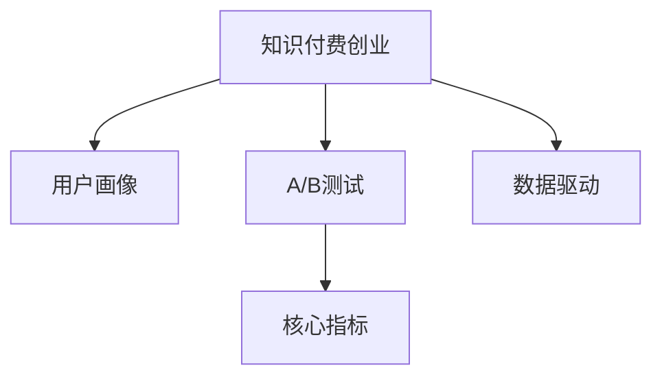

                 

# 知识付费创业的产品迭代方法论

## 1. 背景介绍

随着知识经济的兴起，知识付费成为越来越多人的选择。传统的知识传播方式，如书籍、博客、视频等，正在向结构化、系统化、个性化的知识服务转型。知识付费创业公司，如得到、新东方在线、Coursera等，正通过提供高质量的课程、文章、音频等内容，满足用户个性化学习和成长需求。然而，知识付费创业也面临市场竞争激烈、用户获取成本高、课程质量参差不齐等挑战。如何提升产品竞争力和用户粘性，成为知识付费创业公司亟需解决的问题。本文将以知识付费创业为案例，探讨基于数据驱动的产品迭代方法论，帮助创业公司快速优化产品，提升用户价值。

## 2. 核心概念与联系

### 2.1 核心概念概述

要深入理解知识付费创业的产品迭代方法论，需要掌握以下核心概念：

- **知识付费创业**：以提供高质量知识内容，帮助用户学习、提升能力为主要业务的创业模式。常见的产品形式包括在线课程、电子书、音频内容等。
- **用户画像**：通过数据分析，构建用户的基本属性、兴趣偏好、行为特征等，为产品设计和优化提供依据。
- **A/B测试**：通过对比测试两个或多个版本的产品，评估其效果，筛选最佳方案。广泛应用于产品迭代中。
- **核心指标**：用于评估产品效果的关键指标，如用户活跃度、留存率、转化率等。
- **数据驱动**：利用数据进行产品决策，避免主观偏见，提升产品效果。

这些概念之间的逻辑关系可以通过以下Mermaid流程图来展示：



这个流程图展示了知识付费创业的产品迭代过程，从用户画像的构建，到A/B测试的应用，再到核心指标的跟踪，最终实现数据驱动的产品决策。

## 3. 核心算法原理 & 具体操作步骤

### 3.1 算法原理概述

知识付费创业的产品迭代方法论，本质上是一种基于数据驱动的持续优化过程。其核心思想是通过数据分析，发现产品中的问题和改进空间，进而优化产品功能和用户体验。具体而言，包括以下几个步骤：

1. **构建用户画像**：通过收集用户的基本信息、行为数据、互动记录等，建立用户画像，挖掘用户的兴趣和需求。
2. **A/B测试**：对比测试不同版本的产品功能或界面，寻找最受欢迎和最有效的方法，验证产品改进的效果。
3. **跟踪核心指标**：根据业务目标，设定关键指标，持续跟踪其变化，评估产品的整体表现。
4. **数据驱动决策**：利用收集的数据，进行数据分析和模型构建，指导产品的迭代方向，实现数据驱动的产品优化。

### 3.2 算法步骤详解

#### 3.2.1 构建用户画像

构建用户画像的过程如下：

1. **数据收集**：收集用户在平台上的基本信息、行为数据（如浏览、购买、评价等）、互动记录（如评论、留言等）。
2. **数据清洗**：对数据进行去重、格式转换、缺失值处理等清洗操作，确保数据的准确性和完整性。
3. **特征工程**：选择和构建有意义的特征，如年龄、职业、学习频率、课程评价等，用于描述用户的基本属性和行为特征。
4. **数据可视化**：利用数据可视化工具（如Tableau、PowerBI等）展示用户画像，直观了解用户的分布和特征。

#### 3.2.2 A/B测试

A/B测试的步骤如下：

1. **确定测试目标**：明确测试的业务目标，如提升课程完成率、增加新用户注册量等。
2. **设计测试方案**：设计两个或多个版本的产品，确保每个版本只有一个变量不同，如课程首页布局、推荐算法等。
3. **分配用户样本**：将用户随机分配到不同的测试组，确保样本的随机性和代表性。
4. **实施测试**：同时发布不同版本的测试，收集用户反馈和行为数据。
5. **数据分析**：利用统计学方法（如t检验、卡方检验等）比较不同版本的效果，选择表现最好的方案。

#### 3.2.3 跟踪核心指标

核心指标的选择和跟踪，具体步骤如下：

1. **设定指标**：根据业务目标，设定关键指标，如用户活跃度（每日登录次数、页面访问量等）、留存率（首日留存率、七日留存率等）、转化率（课程购买率、付费会员率等）。
2. **数据采集**：使用数据采集工具（如Flurry Analytics、Mixpanel等）实时记录用户行为和事件。
3. **数据处理**：对采集到的数据进行清洗、统计和分析，生成可视化报表。
4. **持续跟踪**：定期分析核心指标的变化趋势，及时发现问题并进行优化。

#### 3.2.4 数据驱动决策

数据驱动决策的具体流程如下：

1. **数据收集**：通过用户行为数据、问卷调查等方式收集相关数据。
2. **数据清洗**：对收集的数据进行清洗和处理，确保数据的准确性和完整性。
3. **数据建模**：使用统计学或机器学习方法（如回归分析、聚类分析、分类算法等）构建模型，分析数据特征和关系。
4. **结果分析**：根据模型结果，分析用户行为和产品效果，发现问题和改进空间。
5. **决策制定**：基于数据分析结果，制定产品改进方案，进行优化和迭代。

### 3.3 算法优缺点

知识付费创业的产品迭代方法论具有以下优点：

1. **科学依据**：基于数据驱动的决策，避免主观偏见，提高决策的科学性和准确性。
2. **用户导向**：通过用户画像和行为分析，深入了解用户需求和行为，实现更精准的产品设计和优化。
3. **快速迭代**：通过A/B测试和核心指标跟踪，快速发现问题和改进方案，提升产品竞争力。
4. **可操作性强**：通过数据分析和建模，将复杂的问题分解为可执行的优化方案，提升操作性。

同时，该方法也存在一定的局限性：

1. **数据质量依赖**：数据的准确性和完整性直接影响分析结果，需要投入大量资源进行数据收集和清洗。
2. **数据隐私问题**：用户数据涉及隐私和安全问题，需要严格遵守数据保护法律法规。
3. **模型复杂度**：数据建模和分析需要一定的技术和计算资源，对团队技术能力要求较高。
4. **结果解释性差**：复杂模型往往难以解释其内部工作机制和决策逻辑，需要结合业务经验进行解释。

尽管存在这些局限性，但就目前而言，基于数据驱动的产品迭代方法论，仍是大规模知识付费创业的重要范式。未来相关研究的重点在于如何进一步降低数据获取和处理成本，提高模型的解释性和可操作性，同时兼顾数据隐私和用户权益。

### 3.4 算法应用领域

基于数据驱动的产品迭代方法论，广泛应用于知识付费创业的各个环节，如：

- **用户画像构建**：通过数据分析，挖掘用户的基本属性和行为特征，为课程推荐、个性化营销等提供依据。
- **课程设计优化**：利用用户评价和行为数据，优化课程内容和结构，提高课程质量和学习效果。
- **营销策略调整**：通过A/B测试，评估不同的营销策略和推广方案，选择最优方案进行推广。
- **用户体验提升**：利用用户反馈和行为数据，优化平台界面和功能，提升用户体验。

除了上述这些典型应用外，数据驱动的产品迭代方法论还广泛应用于内容推荐、广告投放、流量优化等环节，为知识付费创业提供全方位的支持。

## 4. 数学模型和公式 & 详细讲解 & 举例说明

### 4.1 数学模型构建

本节将使用数学语言对知识付费创业的数据驱动产品迭代方法论进行更加严格的刻画。

记知识付费创业的产品为 $P$，其中 $P$ 包含了课程、用户界面、推荐算法等各个组成部分。设用户为 $U$，用户画像为 $\text{UserProfile}_U$，行为数据为 $D_U$，核心指标为 $KPI_U$。假设产品迭代的最终目标是最大化用户价值 $V_U$。

则产品迭代的目标函数为：

$$
\max_{P} V_U = \mathcal{U}(\text{UserProfile}_U, P) + \mathcal{E}(D_U, P) + \mathcal{I}(KPI_U, P)
$$

其中 $\mathcal{U}(\text{UserProfile}_U, P)$ 为基于用户画像的产品效用函数，$\mathcal{E}(D_U, P)$ 为基于行为数据的产品效果函数，$\mathcal{I}(KPI_U, P)$ 为核心指标效果函数。

### 4.2 公式推导过程

为了更好地理解上述公式，我们以课程推荐系统为例，推导其中的数学模型和公式。

设课程推荐系统为 $S$，用户为 $U$，课程为 $C$，用户对课程的评分数据为 $R_U^C$。推荐算法 $A$ 的推荐结果为 $\hat{R}_U^C$。

则基于用户画像和行为数据，课程推荐系统的用户价值函数可以表示为：

$$
V_U = \sum_{C} R_U^C \cdot A(U, C) = \sum_{C} R_U^C \cdot \hat{R}_U^C
$$

其中 $\hat{R}_U^C$ 表示模型预测的用户对课程 $C$ 的评分，$A(U, C)$ 表示推荐算法对用户 $U$ 和课程 $C$ 的推荐得分。

进一步，基于用户画像和行为数据，推荐算法的推荐效果函数可以表示为：

$$
\mathcal{E}(D_U, S) = \frac{1}{N} \sum_{i=1}^N (R_U^C - \hat{R}_U^C)^2
$$

其中 $N$ 为样本总数，$R_U^C$ 为实际用户评分，$\hat{R}_U^C$ 为模型预测评分。

基于核心指标，推荐算法的推荐效果函数可以表示为：

$$
\mathcal{I}(KPI_U, S) = \frac{1}{N} \sum_{i=1}^N (KPI_U - KPI'_U)^2
$$

其中 $KPI'_U$ 为推荐算法在实际应用中，用户的核心指标值。

将上述函数代入目标函数，得：

$$
\max_{S} V_U = \mathcal{U}(\text{UserProfile}_U, S) + \mathcal{E}(D_U, S) + \mathcal{I}(KPI_U, S)
$$

这个公式展示了知识付费创业产品迭代的全过程，从用户画像和行为数据的建模，到推荐算法的优化，再到核心指标的跟踪，最终实现用户价值的最大化。

### 4.3 案例分析与讲解

以在线教育平台为例，展示基于用户画像和行为数据，课程推荐系统的优化过程：

1. **用户画像构建**：通过收集用户的年龄、职业、学习目标等信息，构建用户画像，挖掘用户的学习需求和行为特征。
2. **行为数据收集**：收集用户在平台上的浏览、点击、购买、评价等行为数据。
3. **特征工程**：选择和构建有意义的特征，如用户的历史课程评分、浏览时长、学习频率等。
4. **推荐算法设计**：设计基于协同过滤、深度学习等算法的推荐模型，预测用户对不同课程的评分。
5. **A/B测试**：对比不同推荐算法的效果，选择表现最好的方案进行推广。
6. **核心指标跟踪**：设定核心指标，如课程购买率、课程完成率、用户留存率等，持续跟踪其变化。
7. **数据驱动决策**：利用收集到的数据，进行数据分析和建模，发现推荐算法中的问题和改进空间，制定优化方案。

## 5. 项目实践：代码实例和详细解释说明

### 5.1 开发环境搭建

在进行产品迭代实践前，我们需要准备好开发环境。以下是使用Python进行Flask框架开发的环境配置流程：

1. 安装Python：从官网下载并安装Python，确保安装版本为3.6及以上。
2. 安装Flask：使用pip安装Flask库，确保库版本为1.1及以上。
3. 创建虚拟环境：使用virtualenv创建虚拟环境，避免依赖冲突。
4. 安装其他依赖库：如numpy、pandas、scikit-learn等。

完成上述步骤后，即可在虚拟环境中开始产品迭代实践。

### 5.2 源代码详细实现

这里我们以课程推荐系统为例，给出使用Flask框架对课程推荐系统进行产品迭代的PyTorch代码实现。

首先，定义推荐系统的数据处理函数：

```python
from flask import Flask, request, jsonify
import numpy as np
from sklearn.metrics import mean_squared_error

app = Flask(__name__)

def load_data():
    # 加载用户行为数据和课程评分数据
    user_data = pd.read_csv('user_data.csv')
    course_data = pd.read_csv('course_data.csv')
    return user_data, course_data

def preprocess_data(user_data, course_data):
    # 数据清洗和预处理
    # 省略具体代码实现
    return user_data, course_data

def train_model(user_data, course_data):
    # 特征工程和模型训练
    # 省略具体代码实现
    return model

def predict(user_data, course_data, model):
    # 使用模型进行课程推荐预测
    # 省略具体代码实现
    return predictions

def evaluate(model, user_data, course_data):
    # 模型评估和优化
    # 省略具体代码实现
    return mse
```

然后，定义推荐系统的API接口：

```python
@app.route('/recommend', methods=['POST'])
def recommend():
    user_id = request.json.get('user_id')
    data = request.json.get('data')
    user_data, course_data = load_data()
    user_data, course_data = preprocess_data(user_data, course_data)
    model = train_model(user_data, course_data)
    predictions = predict(user_data, course_data, model)
    mse = evaluate(model, user_data, course_data)
    return jsonify({'predictions': predictions, 'mse': mse})

if __name__ == '__main__':
    app.run(debug=True)
```

最后，启动Flask应用：

```bash
python app.py
```

以上就是使用Flask框架对课程推荐系统进行产品迭代的完整代码实现。可以看到，Flask框架提供了简单易用的接口设计，使得产品迭代的代码实现变得简洁高效。

### 5.3 代码解读与分析

让我们再详细解读一下关键代码的实现细节：

**load_data函数**：
- 加载用户行为数据和课程评分数据，保存为Pandas DataFrame格式。

**preprocess_data函数**：
- 数据清洗和预处理，包括缺失值处理、特征选择、数据标准化等，确保数据的质量和一致性。

**train_model函数**：
- 特征工程和模型训练，包括特征构建、模型选择、模型训练等，利用sklearn库实现。

**predict函数**：
- 使用模型进行课程推荐预测，包括模型输入、预测生成、输出处理等，利用Pandas库实现。

**evaluate函数**：
- 模型评估和优化，包括模型性能评估、模型调优等，利用sklearn库实现。

**recommend函数**：
- 定义推荐系统的API接口，接收用户ID和输入数据，调用其他函数完成数据加载、预处理、模型训练和预测，并返回预测结果和模型评估指标。

以上代码展示了知识付费创业产品迭代的基本流程，从数据加载到模型训练，再到API接口设计，每个环节都有详细的实现和解读。

## 6. 实际应用场景

### 6.1 在线教育平台

在线教育平台是知识付费创业的重要代表，其产品迭代主要聚焦于课程推荐、个性化学习路径、作业批改等方面。

在课程推荐方面，通过构建用户画像和行为数据，设计基于协同过滤、深度学习等算法的推荐模型，能够实现精准的课程推荐，提高用户的学习体验和课程完成率。同时，通过A/B测试和核心指标跟踪，不断优化推荐算法，提升推荐效果。

在个性化学习路径方面，通过收集和分析用户的学习行为数据，设计自适应学习路径，根据用户的学习进度和兴趣，动态调整课程推荐和学习内容，实现个性化的学习体验。

在作业批改方面，利用自然语言处理技术，开发智能批改系统，对学生的作业进行自动批改和反馈，提高批改效率和准确性。同时，通过收集和分析作业批改数据，不断优化批改算法，提升批改效果。

### 6.2 企业培训系统

企业培训系统是知识付费创业的另一重要方向，其产品迭代主要聚焦于课程开发、学习管理、考试评估等方面。

在课程开发方面，通过收集和分析企业员工的学习需求和行为数据，设计针对不同岗位和职能的培训课程，提高培训的针对性和有效性。同时，通过A/B测试和核心指标跟踪，不断优化课程设计和培训效果。

在学习管理方面，通过设计学习管理系统，实现对员工学习的记录和管理，包括课程进度、学习成果、学习反馈等。同时，通过数据分析和模型构建，对学习效果进行评估和优化，提升学习管理水平。

在考试评估方面，利用智能批改技术，对员工的学习成绩进行自动评估和分析，提供个性化的学习建议。同时，通过收集和分析考试数据，不断优化评估算法，提升评估效果。

### 6.3 内容创作平台

内容创作平台是知识付费创业的又一重要方向，其产品迭代主要聚焦于内容推荐、创作激励、版权保护等方面。

在内容推荐方面，通过构建用户画像和行为数据，设计基于协同过滤、深度学习等算法的推荐模型，实现内容的高效推荐，提升用户的内容消费体验。同时，通过A/B测试和核心指标跟踪，不断优化推荐算法，提升推荐效果。

在创作激励方面，通过设计内容创作激励机制，提高用户的创作积极性，促进高质量内容的生成。同时，通过数据分析和模型构建，对创作激励效果进行评估和优化，提升创作效果。

在版权保护方面，通过构建内容版权保护系统，对原创内容进行自动检测和保护，防止盗版和侵权行为。同时，通过数据分析和模型构建，对版权保护效果进行评估和优化，提升版权保护水平。

## 7. 工具和资源推荐

### 7.1 学习资源推荐

为了帮助开发者系统掌握知识付费创业的产品迭代方法论，这里推荐一些优质的学习资源：

1. Coursera《数据科学基础》课程：由斯坦福大学教授讲授，涵盖数据收集、清洗、分析、可视化等基础知识，是入门数据科学的好选择。
2. Kaggle数据科学竞赛：通过参与实际数据竞赛，提升数据分析和模型构建的能力，积累实战经验。
3. 《Python数据科学手册》书籍：详细介绍了Python在数据科学中的应用，包括数据处理、模型构建、数据可视化等。
4. Scikit-learn官方文档：介绍了常用的机器学习算法和工具，提供了丰富的样例代码和模型评估指标。
5. TensorFlow官方文档：介绍了TensorFlow框架的使用方法，提供了丰富的样例代码和模型构建技巧。

通过对这些资源的学习实践，相信你一定能够快速掌握知识付费创业的产品迭代方法论，并用于解决实际的产品优化问题。

### 7.2 开发工具推荐

高效的开发离不开优秀的工具支持。以下是几款用于知识付费创业产品迭代开发的常用工具：

1. Flask：轻量级Web框架，适合快速搭建API接口，支持多种数据库和缓存机制。
2. SQLAlchemy：Python ORM框架，支持多种数据库操作，方便数据管理和查询。
3. Pandas：数据分析库，支持数据清洗、预处理、统计分析等。
4. Scikit-learn：机器学习库，支持多种算法和模型构建。
5. TensorFlow：深度学习框架，支持多种模型训练和优化算法。

合理利用这些工具，可以显著提升知识付费创业产品迭代的开发效率，加快创新迭代的步伐。

### 7.3 相关论文推荐

知识付费创业的产品迭代方法论，受到学术界和工业界的广泛关注。以下是几篇奠基性的相关论文，推荐阅读：

1. "A Survey on Deep Learning in Educational Technologies"：综述了深度学习在教育技术中的应用，包括课程推荐、学习分析、智能批改等。
2. "A Framework for Personalized Learning Analytics"：提出了基于用户画像和行为数据的个性化学习分析框架，为知识付费创业提供了理论支持。
3. "Evaluation of Machine Learning Algorithms for Recommendation Systems"：综述了机器学习在推荐系统中的应用，包括协同过滤、深度学习等。
4. "A Study of User Engagement in an Online Education Platform"：研究了用户参与度的影响因素，为知识付费创业提供了用户行为分析的参考。
5. "Modeling Student Engagement and Learning Outcomes with Recommendation Systems"：提出了基于推荐系统的学习效果评估模型，为知识付费创业提供了评估指标和优化方法。

这些论文代表了大规模知识付费创业的产品迭代方法论的发展脉络。通过学习这些前沿成果，可以帮助研究者把握学科前进方向，激发更多的创新灵感。

## 8. 总结：未来发展趋势与挑战

### 8.1 总结

本文对知识付费创业的产品迭代方法论进行了全面系统的介绍。首先阐述了知识付费创业的背景和意义，明确了产品迭代在提升产品竞争力和用户粘性方面的独特价值。其次，从原理到实践，详细讲解了产品迭代的全过程，包括用户画像构建、A/B测试、核心指标跟踪、数据驱动决策等，给出了产品迭代任务开发的完整代码实例。同时，本文还广泛探讨了产品迭代方法论在在线教育、企业培训、内容创作等多个行业领域的应用前景，展示了产品迭代范式的巨大潜力。此外，本文精选了产品迭代技术的各类学习资源，力求为读者提供全方位的技术指引。

通过本文的系统梳理，可以看到，基于数据驱动的产品迭代方法论，正在成为知识付费创业的重要范式，极大地提升了产品的竞争力和用户价值。产品迭代需要开发者根据具体业务场景，不断迭代和优化产品、数据和算法，方能得到理想的效果。未来，伴随知识付费创业的不断发展，产品迭代方法论也将不断演进，为知识付费创业带来新的机遇和挑战。

### 8.2 未来发展趋势

展望未来，知识付费创业的产品迭代方法论将呈现以下几个发展趋势：

1. **智能推荐系统**：随着推荐算法和深度学习技术的发展，智能推荐系统将更加精准和高效，提升用户的学习和创作体验。
2. **个性化学习路径**：基于用户画像和行为数据，设计个性化的学习路径，实现因材施教，提升学习效果。
3. **智能批改系统**：利用自然语言处理和深度学习技术，开发智能批改系统，提高作业批改效率和准确性。
4. **学习效果评估**：通过数据驱动的模型构建和评估，实现对学习效果的全面评估和优化，提升学习管理水平。
5. **跨平台协作**：实现不同平台之间的数据互通和功能协作，提升知识付费创业的生态效应。

以上趋势凸显了知识付费创业产品迭代技术的广阔前景。这些方向的探索发展，必将进一步提升知识付费创业的产品效果和用户价值，为知识付费创业带来新的突破。

### 8.3 面临的挑战

尽管知识付费创业的产品迭代方法论已经取得了瞩目成就，但在迈向更加智能化、普适化应用的过程中，它仍面临诸多挑战：

1. **数据质量问题**：数据的准确性和完整性直接影响产品迭代的准确性，需要投入大量资源进行数据收集和清洗。
2. **隐私保护问题**：用户数据涉及隐私和安全问题，需要严格遵守数据保护法律法规。
3. **技术复杂性**：数据驱动的产品迭代需要较强的技术和计算资源，对团队技术能力要求较高。
4. **结果解释性**：复杂模型往往难以解释其内部工作机制和决策逻辑，需要结合业务经验进行解释。
5. **用户体验**：产品迭代需要兼顾用户体验，避免过度干预和数据滥用，确保用户满意。

尽管存在这些挑战，但就目前而言，基于数据驱动的产品迭代方法论，仍是大规模知识付费创业的重要范式。未来相关研究的重点在于如何进一步降低数据获取和处理成本，提高模型的解释性和可操作性，同时兼顾数据隐私和用户权益。

### 8.4 研究展望

面对知识付费创业产品迭代所面临的挑战，未来的研究需要在以下几个方面寻求新的突破：

1. **数据自动化收集**：通过自动化数据采集工具，提高数据收集效率和质量。
2. **数据保护技术**：开发数据加密、匿名化等保护技术，确保用户隐私安全。
3. **模型可解释性**：引入可解释性技术，如LIME、SHAP等，提升模型的解释性和用户信任。
4. **多模态融合**：结合文本、图像、音频等多种数据模态，实现更全面和准确的产品分析。
5. **智能交互系统**：开发智能交互系统，提升用户参与度和互动体验。
6. **跨平台协作**：实现不同平台之间的数据互通和功能协作，提升知识付费创业的生态效应。

这些研究方向的探索，必将引领知识付费创业产品迭代技术迈向更高的台阶，为知识付费创业带来新的突破。面向未来，知识付费创业需要从数据、技术、业务等多个维度协同发力，才能真正实现产品迭代的效果和价值。

## 9. 附录：常见问题与解答

**Q1：知识付费创业的产品迭代过程主要关注哪些关键点？**

A: 知识付费创业的产品迭代过程主要关注以下关键点：
1. **用户画像构建**：通过收集用户的基本信息、行为数据、互动记录等，构建用户画像，挖掘用户的基本属性和行为特征。
2. **数据质量控制**：数据的准确性和完整性直接影响产品迭代的准确性，需要投入大量资源进行数据收集和清洗。
3. **A/B测试**：通过对比测试不同版本的产品功能或界面，寻找最受欢迎和最有效的方法，验证产品改进的效果。
4. **核心指标跟踪**：设定关键指标，如用户活跃度、留存率、转化率等，持续跟踪其变化，评估产品的整体表现。
5. **数据驱动决策**：利用收集到的数据，进行数据分析和建模，指导产品的迭代方向，实现数据驱动的产品优化。

**Q2：如何在知识付费创业中构建高质量的用户画像？**

A: 在知识付费创业中构建高质量的用户画像，需要经过以下步骤：
1. **数据收集**：收集用户在平台上的基本信息、行为数据（如浏览、购买、评价等）、互动记录（如评论、留言等）。
2. **数据清洗**：对数据进行去重、格式转换、缺失值处理等清洗操作，确保数据的准确性和完整性。
3. **特征工程**：选择和构建有意义的特征，如年龄、职业、学习目标、课程评分等，用于描述用户的基本属性和行为特征。
4. **数据可视化**：利用数据可视化工具（如Tableau、PowerBI等）展示用户画像，直观了解用户的分布和特征。
5. **用户分群**：基于用户画像，将用户划分为不同的群体，便于有针对性地设计产品功能和服务。

**Q3：如何在知识付费创业中进行有效的A/B测试？**

A: 在知识付费创业中进行有效的A/B测试，需要经过以下步骤：
1. **确定测试目标**：明确测试的业务目标，如提升课程完成率、增加新用户注册量等。
2. **设计测试方案**：设计两个或多个版本的产品，确保每个版本只有一个变量不同，如课程首页布局、推荐算法等。
3. **分配用户样本**：将用户随机分配到不同的测试组，确保样本的随机性和代表性。
4. **实施测试**：同时发布不同版本的测试，收集用户反馈和行为数据。
5. **数据分析**：利用统计学方法（如t检验、卡方检验等）比较不同版本的效果，选择表现最好的方案。

**Q4：如何在知识付费创业中构建高效的产品推荐系统？**

A: 在知识付费创业中构建高效的产品推荐系统，需要经过以下步骤：
1. **用户画像构建**：通过收集用户的基本信息、行为数据、互动记录等，构建用户画像，挖掘用户的基本属性和行为特征。
2. **数据收集**：收集用户在平台上的课程评分、浏览、购买等行为数据。
3. **特征工程**：选择和构建有意义的特征，如用户的历史课程评分、浏览时长、学习频率等。
4. **模型设计**：设计基于协同过滤、深度学习等算法的推荐模型，预测用户对不同课程的评分。
5. **A/B测试**：对比不同推荐算法的效果，选择表现最好的方案进行推广。
6. **核心指标跟踪**：设定核心指标，如课程购买率、课程完成率、用户留存率等，持续跟踪其变化。
7. **数据驱动决策**：利用收集到的数据，进行数据分析和建模，发现推荐算法中的问题和改进空间，制定优化方案。

**Q5：如何在知识付费创业中进行数据驱动的产品优化？**

A: 在知识付费创业中进行数据驱动的产品优化，需要经过以下步骤：
1. **数据收集**：通过用户行为数据、问卷调查等方式收集相关数据。
2. **数据清洗**：对收集到的数据进行清洗和处理，确保数据的准确性和完整性。
3. **数据建模**：使用统计学或机器学习方法（如回归分析、聚类分析、分类算法等）构建模型，分析数据特征和关系。
4. **结果分析**：根据模型结果，分析用户行为和产品效果，发现问题和改进空间。
5. **决策制定**：基于数据分析结果，制定产品改进方案，进行优化和迭代。

---

作者：禅与计算机程序设计艺术 / Zen and the Art of Computer Programming

