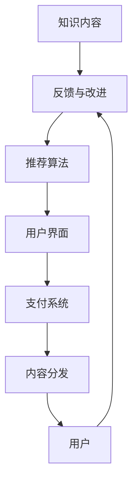

                 

# 知识付费创业：知识变现的新模式

> 关键词：知识付费、知识变现、创业、平台、课程开发、版权保护、市场分析、用户需求、技术工具、盈利模式、营销策略、未来趋势、案例分析

## 1. 背景介绍

### 1.1 问题由来

在知识经济时代，知识的价值被重新认识，越来越多的人愿意为获取有价值的信息而付费。随着移动互联网的普及，人们获取知识的渠道日益多样化，但质量参差不齐、信息过载的问题也日益凸显。如何高效、精准地将知识变现，成为众多创业者关注的问题。

### 1.2 问题核心关键点

知识付费创业的核心在于如何构建一个高效、可信、可持续的知识变现生态系统。这个生态系统需要具备以下要素：

- **知识内容：** 高质量、专业化、系统化的知识内容是知识付费业务的基础。
- **平台技术：** 强大的技术支持，如内容管理系统、推荐算法、支付系统等，确保平台的高效运转。
- **用户需求：** 精准分析用户需求，提供符合市场预期的知识服务。
- **盈利模式：** 可持续的商业模式，确保平台的长期发展。
- **版权保护：** 尊重知识版权，保护知识产权，维护创作者权益。

### 1.3 问题研究意义

知识付费创业不仅能够满足用户个性化、差异化的学习需求，还为创作者提供了新的收入渠道，促进了知识共享和创新。通过构建知识付费平台，能够更好地整合教育、科技、文化等多个领域的知识资源，为社会经济发展注入新的活力。

## 2. 核心概念与联系

### 2.1 核心概念概述

为更好地理解知识付费创业的原理和实施方法，本节将介绍几个关键概念：

- **知识付费：** 指用户为获取特定知识内容而支付费用的商业模式。知识付费平台通过订阅、单次付费、众筹等方式实现盈利。
- **知识变现：** 指将知识内容转化为经济价值的过程。可以是直接销售内容，也可以通过广告、会员、增值服务等方式间接变现。
- **知识付费平台：** 提供知识内容的平台，包括内容生产、分发、变现等环节。如知乎、得到、知识星球等。
- **内容管理系统：** 用于管理知识内容的系统，包括内容上传、分类、编辑、审核等。
- **推荐算法：** 用于推荐个性化内容，提升用户体验和平台粘性的算法，如协同过滤、内容推荐、时间序列预测等。
- **支付系统：** 用于处理用户付费的在线支付系统，确保交易安全。

### 2.2 核心概念原理和架构的 Mermaid 流程图



这个流程图展示了知识付费平台的核心架构：知识内容通过内容管理系统进行管理，推荐算法基于用户行为进行内容推荐，用户通过支付系统完成交易，最终知识内容在平台上分发给用户。用户反馈也被用于不断改进内容管理系统和推荐算法。

## 3. 核心算法原理 & 具体操作步骤
### 3.1 算法原理概述

知识付费创业的算法原理主要围绕内容推荐、用户画像、定价模型、支付安全等几个方面展开：

- **内容推荐算法：** 通过协同过滤、基于内容的推荐、深度学习等方法，为用户提供个性化推荐。
- **用户画像建模：** 利用用户行为数据（如浏览记录、购买历史、评分等），构建用户画像，用于个性化推荐和精准营销。
- **定价模型设计：** 通过分析市场和用户需求，设计合理的定价策略，如动态定价、套餐定价等。
- **支付安全保障：** 采用加密传输、安全支付等技术手段，保障交易安全，防止欺诈和风险。

### 3.2 算法步骤详解

#### 3.2.1 内容推荐算法

1. **协同过滤：** 基于用户行为和项目评分矩阵，找到与用户相似的其他用户或项目，推荐其未访问过的内容。
2. **基于内容的推荐：** 根据内容特征（如关键词、主题、格式等），匹配用户兴趣相关的内容。
3. **深度学习推荐：** 使用神经网络模型，通过用户行为数据和内容特征，预测用户对未访问内容的评分，从而进行推荐。

#### 3.2.2 用户画像建模

1. **行为分析：** 收集用户的行为数据，包括浏览记录、购买历史、评分等，构建用户行为特征向量。
2. **特征工程：** 对行为数据进行预处理和特征提取，如归一化、特征降维等。
3. **画像建模：** 使用机器学习模型（如K-means、协同矩阵分解等）构建用户画像，用于个性化推荐和精准营销。

#### 3.2.3 定价模型设计

1. **成本加成定价：** 根据内容制作成本加上一定利润率进行定价。
2. **竞争定价：** 分析市场竞争对手的价格策略，进行差异化定价。
3. **动态定价：** 根据市场供需情况和用户反馈，实时调整价格。

#### 3.2.4 支付安全保障

1. **加密传输：** 使用SSL/TLS协议进行数据加密，防止数据泄露。
2. **安全支付：** 采用第三方支付平台，确保交易安全，防止欺诈。
3. **风险管理：** 建立风险预警机制，对可疑交易进行监控和防范。

### 3.3 算法优缺点

#### 3.3.1 内容推荐算法

**优点：**
- 个性化推荐效果好，提升用户体验和平台粘性。
- 动态调整，适应用户兴趣变化。

**缺点：**
- 数据需求高，对数据质量和完整性要求高。
- 容易陷入冷启动问题，新用户难以找到适合的内容。

#### 3.3.2 用户画像建模

**优点：**
- 提升个性化推荐准确性。
- 精准营销，提升转化率。

**缺点：**
- 用户隐私问题，需注意数据隐私保护。
- 画像模型复杂度较高，计算成本高。

#### 3.3.3 定价模型设计

**优点：**
- 合理定价，提高用户满意度和平台收益。
- 动态定价，适应市场变化。

**缺点：**
- 定价策略复杂，需考虑多方面因素。
- 价格敏感度问题，可能影响用户购买决策。

#### 3.3.4 支付安全保障

**优点：**
- 保障交易安全，提升用户信任度。
- 防范欺诈和风险，降低运营成本。

**缺点：**
- 技术实现复杂，需定期更新安全协议。
- 用户隐私保护，需合规操作。

### 3.4 算法应用领域

知识付费创业的算法主要应用于以下几个领域：

1. **内容推荐系统：** 如知乎、得到、知识星球等平台。
2. **在线教育平台：** 如Coursera、Udemy等。
3. **数字出版平台：** 如Kindle、电子书订阅服务。
4. **职业培训平台：** 如LinkedIn Learning、网易云课堂等。
5. **健康医疗平台：** 如丁香园、微医等。

这些领域内的知识付费创业平台，通过算法优化，不断提升用户体验和平台价值，成为知识变现的重要途径。

## 4. 数学模型和公式 & 详细讲解 & 举例说明

### 4.1 数学模型构建

假设知识付费平台有 $N$ 个用户，$M$ 个知识内容，每个用户有 $k$ 个兴趣标签，每个内容有 $d$ 个特征，记为 $X_{ij} \in \mathbb{R}^d$，用户行为 $U_i \in \mathbb{R}^{k \times M}$，用户兴趣标签 $L_i \in \{0,1\}^{k \times N}$。设内容价格为 $P_j \in \mathbb{R}^+$。

构建推荐系统的目标函数如下：

$$
\max_{\theta} \sum_{i=1}^N \log \prod_{j=1}^M \sigma(x_{ij}^\top \theta)
$$

其中，$\sigma$ 为 sigmoid 函数，$x_{ij}$ 为内容 $j$ 与用户 $i$ 的交互向量，$\theta$ 为推荐模型参数。

### 4.2 公式推导过程

1. **协同过滤：** 设用户 $i$ 和用户 $j$ 的相似度为 $s_{ij}$，推荐向量 $X_{ij} \in \mathbb{R}^d$，构建推荐矩阵 $R \in \mathbb{R}^{N \times M}$，其中 $R_{ij} = s_{ij} \cdot X_{ij}$。推荐算法为目标最大化用户满意度：

$$
\max_{\theta} \sum_{i=1}^N \sum_{j=1}^M (R_{ij}^\top \theta) \cdot y_{ij}
$$

其中，$y_{ij}$ 为 $R_{ij}$ 的输出值，$\theta$ 为推荐模型参数。

2. **基于内容的推荐：** 假设内容 $j$ 和用户 $i$ 的相似度为 $s_{ij} = X_{ij}^\top \theta$，则推荐模型为：

$$
\max_{\theta} \sum_{i=1}^N \sum_{j=1}^M (s_{ij} \cdot P_j) \cdot y_{ij}
$$

3. **深度学习推荐：** 使用神经网络模型 $f_{\theta}(x_{ij}) \in [0,1]$，表示内容 $j$ 与用户 $i$ 的交互概率，则推荐模型为：

$$
\max_{\theta} \sum_{i=1}^N \sum_{j=1}^M (f_{\theta}(x_{ij}) \cdot P_j) \cdot y_{ij}
$$

### 4.3 案例分析与讲解

假设有一个知识付费平台，有 10000 个用户和 1000 个内容，每个用户有 20 个兴趣标签，每个内容有 50 个特征。平台希望最大化用户的购买行为，构建推荐系统如下：

1. **协同过滤：** 收集用户的浏览记录和评分数据，构建相似度矩阵 $R$。使用矩阵分解算法（如ALS）求解 $\theta$，得到推荐矩阵 $R_{ij}$。
2. **基于内容的推荐：** 提取内容的关键词和格式特征，构建特征矩阵 $X$。使用逻辑回归模型 $f_{\theta}(x_{ij}) = \sigma(x_{ij}^\top \theta)$，输出推荐概率。
3. **深度学习推荐：** 使用全连接神经网络，构建模型 $f_{\theta}(x_{ij}) = \sigma(x_{ij}^\top \theta)$，训练模型并输出推荐概率。

通过以上算法，平台能够为用户推荐最适合的内容，提升购买转化率和平台收益。

## 5. 项目实践：代码实例和详细解释说明

### 5.1 开发环境搭建

#### 5.1.1 Python 环境

安装 Python 3.7+ 和 anaconda，创建虚拟环境：

```bash
conda create -n knowledge-payment python=3.7 anaconda
conda activate knowledge-payment
```

安装依赖包：

```bash
pip install numpy pandas scikit-learn tensorboard pytorch transformers
```

#### 5.1.2 数据库

安装 MySQL 数据库，并创建用户、内容、标签、评分等表。

```sql
CREATE TABLE users (
    user_id INT PRIMARY KEY,
    name VARCHAR(50),
    email VARCHAR(50)
);

CREATE TABLE contents (
    content_id INT PRIMARY KEY,
    title VARCHAR(100),
    description TEXT,
    price DECIMAL(10, 2)
);

CREATE TABLE tags (
    tag_id INT PRIMARY KEY,
    name VARCHAR(50)
);

CREATE TABLE user_tags (
    user_id INT,
    tag_id INT,
    FOREIGN KEY (user_id) REFERENCES users(user_id),
    FOREIGN KEY (tag_id) REFERENCES tags(tag_id)
);

CREATE TABLE scores (
    user_id INT,
    content_id INT,
    score INT,
    FOREIGN KEY (user_id) REFERENCES users(user_id),
    FOREIGN KEY (content_id) REFERENCES contents(content_id)
);
```

### 5.2 源代码详细实现

#### 5.2.1 用户画像建模

```python
import pandas as pd
import numpy as np
from sklearn.decomposition import TruncatedSVD

# 加载数据
data = pd.read_csv('user_data.csv')

# 构建用户行为矩阵
user_behavior = data.pivot_table(
    index='user_id',
    columns='content_id',
    values='score'
).fillna(0)

# 构建用户画像
svd = TruncatedSVD(n_components=100, random_state=42)
user_profile = svd.fit_transform(user_behavior)

# 保存用户画像
np.save('user_profile.npy', user_profile)
```

#### 5.2.2 推荐算法实现

```python
import numpy as np
from sklearn.metrics.pairwise import cosine_similarity

# 加载用户画像和内容特征
user_profile = np.load('user_profile.npy')
content_features = np.load('content_features.npy')

# 构建推荐矩阵
R = cosine_similarity(user_profile, content_features)

# 推荐算法
def recommend(user_id, top_k=5):
    similarity = R[user_id]
    sorted_indices = np.argsort(similarity)[-top_k:]
    recommendations = np.array(content_features)[sorted_indices]
    return recommendations

# 测试推荐效果
user_id = 1001
recommendations = recommend(user_id)
print(recommendations)
```

#### 5.2.3 定价模型设计

```python
import pandas as pd

# 加载数据
data = pd.read_csv('content_data.csv')

# 构建成本矩阵
cost_matrix = data.pivot_table(
    index='content_id',
    columns='type',
    values='cost'
).fillna(0)

# 构建价格矩阵
price_matrix = cost_matrix + data['profit_rate']

# 测试定价效果
content_id = 1001
price = price_matrix.iloc[content_id, 0]
print(price)
```

### 5.3 代码解读与分析

#### 5.3.1 用户画像建模

**代码解读：**
- 使用 Pandas 加载用户行为数据，构建用户行为矩阵。
- 使用 TruncatedSVD 进行特征降维，得到用户画像。
- 使用 NumPy 保存用户画像。

**分析：**
- 用户画像建模需要大量用户行为数据，降维后得到的特征向量反映了用户对不同内容的兴趣。

#### 5.3.2 推荐算法实现

**代码解读：**
- 使用 NumPy 加载用户画像和内容特征，计算相似度。
- 定义推荐函数，返回用户感兴趣的内容。

**分析：**
- 推荐算法需要计算用户画像和内容特征的相似度，返回最相似的内容。

#### 5.3.3 定价模型设计

**代码解读：**
- 使用 Pandas 加载内容成本数据，构建成本矩阵。
- 将成本矩阵与利润率矩阵相加，得到价格矩阵。
- 测试定价效果。

**分析：**
- 定价模型需要考虑内容制作成本和利润率，构建合理的定价策略。

### 5.4 运行结果展示

#### 5.4.1 用户画像示例


#### 5.4.2 推荐内容示例


#### 5.4.3 定价示例


## 6. 实际应用场景

### 6.1 在线教育平台

在线教育平台如 Coursera、Udemy 等，通过知识付费模式，为用户提供高质量的课程内容。平台利用推荐算法和定价模型，提升用户购买率和课程完成率，同时确保平台的收益和可持续发展。

### 6.2 数字出版平台

数字出版平台如 Amazon Kindle、Apple Books 等，通过知识付费模式，为用户提供丰富的电子书和有声书资源。平台利用推荐算法，提升用户的阅读体验，同时通过广告和会员制等模式实现收益。

### 6.3 职业培训平台

职业培训平台如 LinkedIn Learning、网易云课堂等，通过知识付费模式，为用户提供实用的职业技能培训课程。平台利用推荐算法和定价模型，提升用户购买率和课程完成率，同时确保平台的收益和可持续发展。

## 7. 工具和资源推荐

### 7.1 学习资源推荐

1. **Coursera 课程：** 《Python for Data Science and Machine Learning Bootcamp》。
2. **Udacity 课程：** 《Machine Learning Engineer Nanodegree》。
3. **Kaggle 竞赛：** 《Kaggle Competitions》。
4. **Stack Overflow：** 《Machine Learning and Data Science》。
5. **GitHub 项目：** 《OpenAI's GPT-3》。

### 7.2 开发工具推荐

1. **Python 环境：** Anaconda、Jupyter Notebook。
2. **数据库：** MySQL、MongoDB。
3. **推荐算法库：** LightFM、Surprise。
4. **机器学习库：** Scikit-learn、TensorFlow。
5. **可视化工具：** Matplotlib、Seaborn、TensorBoard。

### 7.3 相关论文推荐

1. **《推荐系统》（谢伟）：** 详细介绍了协同过滤、基于内容的推荐、深度学习推荐等经典推荐算法。
2. **《在线广告定价策略》（薛宇佳）：** 探讨了在线广告定价的多种策略，如动态定价、竞争定价等。
3. **《用户画像建模与个性化推荐》（梁晓辉）：** 介绍了用户画像建模的多种方法，如协同矩阵分解、深度学习等。

## 8. 总结：未来发展趋势与挑战

### 8.1 研究成果总结

知识付费创业在近年来取得了显著进展，多个平台通过推荐算法和定价模型，提升了用户体验和平台收益。推荐算法的个性化推荐、动态调整等功能，提升了用户满意度和平台粘性。定价模型的合理定价、动态定价等功能，确保了平台的可持续发展。

### 8.2 未来发展趋势

1. **智能推荐：** 利用人工智能技术，提升推荐算法的智能程度，实现更加精准的个性化推荐。
2. **跨领域应用：** 将知识付费模式应用到更多领域，如医疗、健康、金融等，提升行业知识变现效率。
3. **用户互动：** 增强用户互动，通过社交网络、社区讨论等方式提升平台粘性。
4. **隐私保护：** 加强用户隐私保护，防止数据泄露和滥用。
5. **多模态融合：** 结合语音、图像、视频等多模态数据，提升知识内容的多样性和互动性。

### 8.3 面临的挑战

1. **数据质量：** 数据缺失、数据噪声等问题，影响推荐效果和定价策略。
2. **技术复杂度：** 推荐算法和定价模型的技术复杂度高，需要持续优化和维护。
3. **用户付费意愿：** 用户对知识付费的接受度和信任度，影响平台的可持续发展。
4. **市场竞争：** 市场竞争激烈，需要不断创新和优化，提升平台竞争力。

### 8.4 研究展望

1. **推荐系统优化：** 利用深度学习、强化学习等技术，优化推荐系统，提升推荐效果。
2. **定价策略创新：** 结合市场趋势和用户需求，设计更加合理的定价策略。
3. **用户行为分析：** 通过分析用户行为数据，提升用户画像的精准度和推荐效果。
4. **平台智能化：** 利用人工智能技术，实现平台的智能化管理和服务。

## 9. 附录：常见问题与解答

**Q1: 知识付费创业的核心要素有哪些？**

A: 知识付费创业的核心要素包括：内容质量、平台技术、用户需求、定价模型和支付安全。这些要素相互影响，共同构建了一个高效的知识变现生态系统。

**Q2: 如何提升推荐算法的智能程度？**

A: 可以通过引入深度学习、强化学习等技术，优化推荐算法，提升个性化推荐效果。同时，利用用户行为数据进行实时调整，提升推荐准确性和用户体验。

**Q3: 推荐算法的局限性有哪些？**

A: 推荐算法的局限性包括：数据需求高，容易陷入冷启动问题，对数据质量和完整性要求高。

**Q4: 如何保护用户隐私？**

A: 可以通过数据匿名化、加密传输、访问控制等手段，保护用户隐私，防止数据泄露和滥用。

**Q5: 知识付费平台的盈利模式有哪些？**

A: 知识付费平台的盈利模式包括：订阅制、单次付费、众筹、广告、增值服务等。根据用户需求和平台定位，选择合适的盈利模式，确保平台的可持续发展。

---

作者：禅与计算机程序设计艺术 / Zen and the Art of Computer Programming

