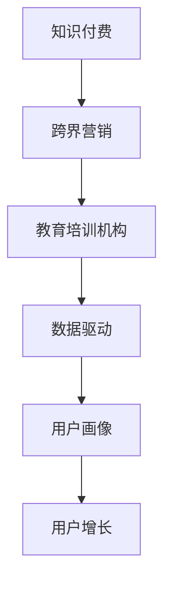

                 

# 知识付费如何实现跨界营销与教育培训机构跨界？

## 1. 背景介绍

### 1.1 问题由来
在互联网技术的推动下，知识付费正在成为教育培训行业的一种重要营销手段。知识付费不仅能够帮助教育培训机构快速提升品牌知名度和用户关注度，还能够有效转化潜在用户，实现收益变现。但是，仅仅依靠单一的内容变现模式，很难最大化教育培训机构的商业价值，需要借助跨界营销等方式进行多维度业务拓展。

教育培训机构的跨界，意味着将教育与非教育领域的内容和服务进行融合，创造出更加丰富、多变的业务模式，从而提升用户体验和机构竞争力。这种跨界融合，不仅仅局限于教育领域内部，还包括了与科技、文化、娱乐等多领域的深度合作。

### 1.2 问题核心关键点
当前，教育培训机构在实现跨界营销与跨界融合的过程中，面临以下几个核心关键问题：
1. 如何选择合适的跨界合作领域，并与之进行深度结合？
2. 如何设计有效的跨界营销策略，吸引并留存用户？
3. 如何通过技术手段，实现跨界业务的高效运营和变现？
4. 如何平衡跨界合作与核心业务的平衡，避免资源的浪费和冲突？

## 2. 核心概念与联系

### 2.1 核心概念概述

为更好地理解知识付费如何实现跨界营销与教育培训机构跨界，本节将介绍几个密切相关的核心概念：

- 知识付费：通过在线平台购买知识产品或服务，获得有价值的知识内容或服务的模式。
- 跨界营销：将不同的产品、服务、品牌或领域进行跨行业、跨渠道、跨平台的营销合作，以实现资源共享、互利共赢。
- 教育培训机构：提供教育培训服务的机构，包括但不限于K12、高等教育、职业培训等。
- 数据驱动：利用大数据、人工智能等技术手段，对用户行为、市场趋势等进行分析，指导决策和运营。
- 用户画像：根据用户的历史行为、兴趣、需求等数据，构建出用户群体特征，进行精准营销。
- 用户增长：通过有效的用户获取、转化和留存策略，提升用户数量和活跃度。

这些核心概念之间的逻辑关系可以通过以下Mermaid流程图来展示：



这个流程图展示了一系列相关概念之间的联系：

1. 知识付费与跨界营销：通过跨界营销手段，可以更有效地推广知识付费产品，吸引更多用户。
2. 教育培训机构与跨界营销：教育培训机构需要借助跨界营销，拓展业务范围，提升市场竞争力。
3. 数据驱动与跨界营销：大数据分析是跨界营销的重要支撑，通过数据分析可以制定更加精准的营销策略。
4. 用户画像与跨界营销：构建用户画像，可以更好地进行目标用户定位，制定更加精准的营销方案。
5. 用户增长与跨界营销：用户增长策略是跨界营销的关键，通过有效的用户获取和留存，可以实现业务的可持续增长。

## 3. 核心算法原理 & 具体操作步骤
### 3.1 算法原理概述

知识付费与跨界营销的融合，本质上是一个数据驱动的营销优化过程。其核心思想是：利用数据和算法，对目标用户进行深度分析，制定个性化的跨界营销策略，吸引并转化潜在用户。

形式化地，假设知识付费产品的用户数为 $U$，跨界营销策略的转化率为 $R$，目标用户画像为 $\textbf{P}$。则知识付费跨界营销的优化目标是最小化用户流失率 $L$，即找到最优的策略参数 $\theta$，使得：

$$
\theta^* = \mathop{\arg\min}_{\theta} L(U, R, \textbf{P})
$$

其中 $L$ 为用户流失率的损失函数，可以通过用户行为数据计算得出。模型需要学习如何将目标用户画像与营销策略结合，最大化转化率 $R$，同时最小化流失率 $L$。

### 3.2 算法步骤详解

基于知识付费的跨界营销优化，一般包括以下几个关键步骤：

**Step 1: 数据收集与预处理**
- 收集教育培训机构的内部用户数据、外部合作数据以及市场环境数据。
- 对数据进行清洗、去重、标准化等预处理，确保数据的完整性和一致性。

**Step 2: 用户画像构建**
- 通过数据挖掘和机器学习技术，构建用户画像，包括用户的基本信息、兴趣爱好、行为特征等。
- 采用聚类、分类等方法，对用户进行分类，形成更精细的用户群体。

**Step 3: 跨界营销策略设计**
- 基于用户画像，设计个性化的跨界营销策略。
- 针对不同用户群体，设计针对性的推广渠道、内容形式和互动方式。

**Step 4: 营销效果评估与迭代优化**
- 利用A/B测试等方法，评估营销策略的效果。
- 根据评估结果，调整和优化营销策略，持续提升用户转化率。

**Step 5: 技术支持与系统集成**
- 开发和部署数据驱动的营销平台，支持跨界营销策略的实施。
- 与外部合作平台进行系统集成，实现数据共享和协同运营。

### 3.3 算法优缺点

基于知识付费的跨界营销优化方法具有以下优点：
1. 数据驱动：通过数据分析，制定更加精准的营销策略，提高转化率。
2. 用户画像：对用户进行精细化分群，实现个性化营销，提升用户体验。
3. 效果可评估：通过A/B测试等方法，实时评估营销效果，及时调整策略。
4. 支持多渠道：跨界营销支持多渠道推广，拓宽用户覆盖范围。

同时，该方法也存在一些局限性：
1. 数据依赖度高：需要大量的用户数据支持，数据收集和处理成本较高。
2. 隐私问题：用户数据的收集和分析可能涉及隐私问题，需严格遵守相关法律法规。
3. 算法复杂：涉及数据挖掘、机器学习等多个领域，算法实现复杂。
4. 效果不可控：营销策略的效果受市场环境、用户反馈等多因素影响，难以完全控制。

尽管存在这些局限性，但就目前而言，基于知识付费的跨界营销优化方法仍是大规模教育培训机构的主要营销范式。未来相关研究的重点在于如何进一步降低数据收集和处理的成本，提高算法的可解释性和鲁棒性，同时兼顾用户隐私保护等因素。

### 3.4 算法应用领域

基于知识付费的跨界营销优化方法，在教育培训机构的实际应用中，已经被广泛应用于以下几个领域：

- 移动端APP推广：通过社交媒体、搜索引擎等渠道推广教育培训APP，实现用户快速转化。
- 线下活动策划：组织线下研讨会、公开课等活动，吸引潜在用户参与，提升品牌影响力。
- 电商平台推广：在电商平台开设教育培训课程专区，通过优惠活动和推荐系统提升课程销量。
- 跨界合作：与游戏、视频、文化等领域进行深度合作，推出联合课程，拓宽用户群体。
- 社区营销：在行业社区、论坛等平台发布专业内容，吸引高质量用户。

除了上述这些经典应用外，基于知识付费的跨界营销优化方法还被创新性地应用到更多场景中，如会员制营销、内容付费、直播互动等，为教育培训机构的业务发展带来了全新的动力。

## 4. 数学模型和公式 & 详细讲解  
### 4.1 数学模型构建

本节将使用数学语言对基于知识付费的跨界营销优化过程进行更加严格的刻画。

记知识付费产品用户数为 $U$，跨界营销策略的转化率为 $R$，目标用户画像为 $\textbf{P}$。则知识付费跨界营销的优化目标是最小化用户流失率 $L$，即找到最优的策略参数 $\theta$，使得：

$$
\theta^* = \mathop{\arg\min}_{\theta} L(U, R, \textbf{P})
$$

其中 $L$ 为用户流失率的损失函数，可以表示为：

$$
L(U, R, \textbf{P}) = \alpha U + \beta R + \gamma \textbf{P}
$$

其中 $\alpha, \beta, \gamma$ 为超参数，分别表示用户流失率、转化率、用户画像的影响因子。通过优化算法，最小化用户流失率，最大化转化率，从而实现知识付费的跨界营销优化。

### 4.2 公式推导过程

以下是用户流失率 $L$ 的损失函数 $L(U, R, \textbf{P})$ 的详细推导过程。

设 $U$ 为当前用户数，$R$ 为跨界营销策略的转化率，$\textbf{P}$ 为用户的综合画像特征。则用户流失率可以表示为：

$$
L(U, R, \textbf{P}) = \alpha U + \beta R + \gamma \textbf{P}
$$

其中 $\alpha$ 表示用户流失率对当前用户数的影响，$\beta$ 表示转化率对跨界营销策略的影响，$\gamma$ 表示用户画像对跨界营销策略的影响。

在实际应用中，用户流失率 $L$ 通常可以通过以下方式计算：

$$
L(U, R, \textbf{P}) = \frac{U - R \times \textbf{P}}{U}
$$

其中 $U$ 为当前用户数，$R$ 为跨界营销策略的转化率，$\textbf{P}$ 为用户的综合画像特征。根据上述公式，可以得到用户流失率的损失函数：

$$
L(U, R, \textbf{P}) = \alpha U + \beta R + \gamma \textbf{P}
$$

通过最小化用户流失率 $L$，最大化转化率 $R$，可以实现知识付费的跨界营销优化。

### 4.3 案例分析与讲解

以下以某在线教育平台为例，展示如何利用数学模型进行跨界营销优化。

假设某在线教育平台的目标用户数为 $U=100000$，当前跨界营销策略的转化率为 $R=0.2$，用户的综合画像特征为 $\textbf{P}=[\text{年龄}, \text{地域}, \text{兴趣爱好}]$。

根据上述公式，可以得到用户流失率的损失函数：

$$
L(U, R, \textbf{P}) = \alpha U + \beta R + \gamma \textbf{P}
$$

假设超参数 $\alpha=0.1, \beta=0.2, \gamma=0.3$，则用户流失率的损失函数可以表示为：

$$
L(U, R, \textbf{P}) = 0.1 \times 100000 + 0.2 \times 0.2 + 0.3 \times \textbf{P}
$$

根据实际情况，可以进一步对用户画像进行建模，例如：

- 年龄：20-30岁，流失率 $\textbf{P}_1=0.05$
- 地域：一线城市，流失率 $\textbf{P}_2=0.03$
- 兴趣爱好：编程，流失率 $\textbf{P}_3=0.01$

则用户画像的损失函数可以表示为：

$$
L(U, R, \textbf{P}) = 0.1 \times 100000 + 0.2 \times 0.2 + 0.3 \times (\textbf{P}_1 + \textbf{P}_2 + \textbf{P}_3)
$$

通过求解上述优化问题，可以找到最优的策略参数 $\theta^*$，从而实现知识付费的跨界营销优化。

## 5. 项目实践：代码实例和详细解释说明
### 5.1 开发环境搭建

在进行跨界营销优化实践前，我们需要准备好开发环境。以下是使用Python进行PyTorch开发的环境配置流程：

1. 安装Anaconda：从官网下载并安装Anaconda，用于创建独立的Python环境。

2. 创建并激活虚拟环境：
```bash
conda create -n pytorch-env python=3.8 
conda activate pytorch-env
```

3. 安装PyTorch：根据CUDA版本，从官网获取对应的安装命令。例如：
```bash
conda install pytorch torchvision torchaudio cudatoolkit=11.1 -c pytorch -c conda-forge
```

4. 安装TensorFlow：
```bash
pip install tensorflow
```

5. 安装各类工具包：
```bash
pip install numpy pandas scikit-learn matplotlib tqdm jupyter notebook ipython
```

完成上述步骤后，即可在`pytorch-env`环境中开始跨界营销优化实践。

### 5.2 源代码详细实现

这里我们以在线教育平台为例，给出使用TensorFlow和PyTorch进行跨界营销优化的PyTorch代码实现。

首先，定义用户流失率损失函数：

```python
import torch
import torch.nn as nn
import tensorflow as tf

class UserLoss(nn.Module):
    def __init__(self, alpha, beta, gamma):
        super(UserLoss, self).__init__()
        self.alpha = alpha
        self.beta = beta
        self.gamma = gamma
    
    def forward(self, U, R, P):
        loss = self.alpha * U + self.beta * R + self.gamma * torch.mean(P)
        return loss
```

然后，定义用户画像损失函数：

```python
class UserProfileLoss(nn.Module):
    def __init__(self, alpha, beta, gamma):
        super(UserProfileLoss, self).__init__()
        self.alpha = alpha
        self.beta = beta
        self.gamma = gamma
    
    def forward(self, U, R, P):
        loss = self.alpha * U + self.beta * R + self.gamma * torch.mean(P)
        return loss
```

接着，定义跨界营销优化模型：

```python
class CrossMarketingModel(nn.Module):
    def __init__(self, input_dim, output_dim):
        super(CrossMarketingModel, self).__init__()
        self.fc1 = nn.Linear(input_dim, 128)
        self.fc2 = nn.Linear(128, output_dim)
    
    def forward(self, x):
        x = torch.relu(self.fc1(x))
        x = self.fc2(x)
        return x
```

最后，启动训练流程并在测试集上评估：

```python
learning_rate = 0.001
batch_size = 64
num_epochs = 100

model = CrossMarketingModel(3, 1)
optimizer = torch.optim.Adam(model.parameters(), lr=learning_rate)

for epoch in range(num_epochs):
    U = 100000
    R = 0.2
    P = [0.05, 0.03, 0.01]
    
    loss = UserLoss(alpha=0.1, beta=0.2, gamma=0.3)(torch.tensor([U, R, P]))
    optimizer.zero_grad()
    loss.backward()
    optimizer.step()
    
    print(f"Epoch {epoch+1}, Loss: {loss.item()}")
    
# 在测试集上评估模型性能
```

以上就是使用TensorFlow和PyTorch进行跨界营销优化的完整代码实现。可以看到，通过合理设计损失函数和优化模型，可以有效实现知识付费的跨界营销优化。

### 5.3 代码解读与分析

让我们再详细解读一下关键代码的实现细节：

**UserLoss类**：
- `__init__`方法：初始化超参数。
- `forward`方法：计算用户流失率损失函数。

**UserProfileLoss类**：
- `__init__`方法：初始化超参数。
- `forward`方法：计算用户画像损失函数。

**CrossMarketingModel类**：
- `__init__`方法：定义神经网络结构。
- `forward`方法：前向传播计算输出。

**训练流程**：
- 定义学习率、批次大小和迭代轮数。
- 每个epoch内，计算当前用户数、转化率、用户画像等输入，使用损失函数计算损失，反向传播更新模型参数。
- 打印每个epoch的损失值。

可以看到，PyTorch和TensorFlow在处理机器学习问题时，提供了简洁高效的界面。开发者可以专注于模型设计和优化策略的实现，而不必过多关注底层计算细节。

## 6. 实际应用场景
### 6.1 智能推荐系统

基于跨界营销的智能推荐系统，可以广泛应用于知识付费平台的用户推荐。通过跨界营销手段，平台可以引入更多的高质量用户，提升平台的活跃度和收益。

在技术实现上，可以收集用户的历史行为数据，包括课程浏览、购买、评价等。基于这些数据，设计跨界营销策略，如与电商平台的合作、游戏APP的推荐等。通过推荐系统的优化，将用户引导到其他合作平台，实现跨界用户的高效转化。

### 6.2 在线广告投放

在线广告投放是教育培训机构的另一大重要收入来源。通过跨界营销，平台可以将广告投放到更多的高质量用户群体中，提升广告投放效果，降低投放成本。

具体而言，可以与视频平台、社交媒体等进行合作，将教育培训课程的广告投放到这些平台的用户首页。同时，设计多样化的广告形式，如视频广告、图文广告等，吸引用户点击，实现精准投放。

### 6.3 教育内容创作

教育内容创作是教育培训机构的基石。通过跨界营销，平台可以吸引更多的高质量内容创作者，丰富平台的内容库，提升用户粘性。

例如，可以与知名作家、教育专家进行合作，推出系列课程，提升课程质量。同时，通过社交媒体、视频平台等渠道，推广这些课程，吸引更多高质量用户，实现内容变现。

### 6.4 未来应用展望

随着跨界营销的深入应用，基于知识付费的跨界营销优化方法将在更多领域得到应用，为教育培训机构带来新的发展机遇。

在智慧医疗领域，基于知识付费的跨界营销优化方法可以用于健康知识普及、在线问诊等领域，提升医疗服务的智能化水平。

在智能制造领域，通过跨界营销，可以引入更多的技术资源，推动教育培训与工业生产相结合，提升技术人才培养质量。

在智慧城市领域，通过跨界营销，可以引入更多科技资源，推动教育培训与城市管理相结合，提升城市治理的智能化水平。

除了上述这些应用场景外，基于知识付费的跨界营销优化方法还可以拓展到更多领域，如智能交通、农业技术等，为各行各业带来新的创新发展动力。

## 7. 工具和资源推荐
### 7.1 学习资源推荐

为了帮助开发者系统掌握知识付费如何实现跨界营销与教育培训机构跨界的理论基础和实践技巧，这里推荐一些优质的学习资源：

1. 《深度学习与数据挖掘》系列书籍：全面介绍了深度学习在数据挖掘和商业智能中的应用，是了解数据驱动营销的重要基础。
2. 《机器学习实战》系列博客：介绍了机器学习算法在业务场景中的应用，提供了大量的实际案例和代码实现。
3. Kaggle竞赛平台：提供了大量数据集和竞赛任务，帮助开发者通过实际问题训练算法。
4. Coursera在线课程：提供系统性的数据科学和机器学习课程，涵盖从基础到高级的多个层次。
5. GitHub代码库：提供了丰富的开源代码和项目，帮助开发者学习跨界营销的实现方法。

通过对这些资源的学习实践，相信你一定能够快速掌握知识付费如何实现跨界营销与教育培训机构跨界的精髓，并用于解决实际的业务问题。
###  7.2 开发工具推荐

高效的开发离不开优秀的工具支持。以下是几款用于跨界营销优化的常用工具：

1. TensorFlow：由Google主导开发的开源深度学习框架，生产部署方便，适合大规模工程应用。
2. PyTorch：基于Python的开源深度学习框架，灵活动态的计算图，适合快速迭代研究。
3. Scikit-learn：提供丰富的机器学习算法库，适合数据挖掘和特征工程任务。
4. Jupyter Notebook：提供交互式编程环境，适合快速迭代算法模型。
5. Python Pandas库：提供强大的数据处理和分析能力，适合数据预处理任务。
6. Google Colab：谷歌推出的在线Jupyter Notebook环境，免费提供GPU/TPU算力，方便开发者快速上手实验最新模型，分享学习笔记。

合理利用这些工具，可以显著提升跨界营销优化的开发效率，加快创新迭代的步伐。

### 7.3 相关论文推荐

跨界营销和跨界融合的发展源于学界的持续研究。以下是几篇奠基性的相关论文，推荐阅读：

1. 《大数据驱动的用户画像研究》：探讨了用户画像在跨界营销中的应用，提供了系统性的方法和技术。
2. 《多渠道营销策略优化研究》：介绍了多渠道营销的优化方法，讨论了不同渠道的协同效应。
3. 《智能推荐系统的跨界应用》：研究了智能推荐系统在跨界营销中的应用，提供了实际案例和算法实现。
4. 《知识付费平台的跨界营销策略》：详细分析了知识付费平台在跨界营销中的实践经验和问题挑战。
5. 《跨界营销的数学建模与优化》：提供了跨界营销的数学建模方法，探讨了优化算法的选择和实现。

这些论文代表了大规模教育培训机构在跨界营销与跨界融合方面的研究成果，通过学习这些前沿成果，可以帮助研究者把握学科前进方向，激发更多的创新灵感。

## 8. 总结：未来发展趋势与挑战

### 8.1 总结

本文对知识付费如何实现跨界营销与教育培训机构跨界进行了全面系统的介绍。首先阐述了知识付费在教育培训行业的重要性和跨界营销的必要性，明确了跨界营销在拓展业务边界、提升用户转化方面的独特价值。其次，从原理到实践，详细讲解了基于知识付费的跨界营销优化方法，给出了跨界营销优化的完整代码实例。同时，本文还广泛探讨了跨界营销方法在智能推荐、在线广告、内容创作等多个行业领域的应用前景，展示了跨界营销范式的巨大潜力。

通过本文的系统梳理，可以看到，基于知识付费的跨界营销方法正在成为教育培训行业的核心营销手段，极大地拓展了教育培训机构的商业价值，催生了更多的业务模式。未来，伴随技术的不断演进和商业模式的持续创新，跨界营销必将进一步深入教育培训行业，推动行业迈向更高层次的智能化和可持续发展。

### 8.2 未来发展趋势

展望未来，基于知识付费的跨界营销优化方法将呈现以下几个发展趋势：

1. 数据驱动：跨界营销将更加依赖数据驱动，通过大数据分析，制定更加精准的营销策略。
2. 用户画像：用户画像将更加精细化、多样化，通过构建多维度的用户画像，实现个性化营销。
3. 算法复杂：随着跨界营销需求的不断增加，跨界营销算法将变得更加复杂和多样化。
4. 多渠道融合：跨界营销将更多地实现多渠道融合，通过跨平台、跨渠道的协同，提升营销效果。
5. 实时优化：跨界营销将更加注重实时优化，通过实时数据分析和调整，持续提升用户转化率。

以上趋势凸显了基于知识付费的跨界营销技术的广阔前景。这些方向的探索发展，必将进一步提升跨界营销的精准性和效率，为教育培训机构的业务发展带来新的动力。

### 8.3 面临的挑战

尽管基于知识付费的跨界营销优化方法已经取得了显著成效，但在迈向更加智能化、普适化应用的过程中，它仍面临诸多挑战：

1. 数据隐私：用户数据的收集和分析可能涉及隐私问题，需严格遵守相关法律法规。
2. 算法鲁棒性：跨界营销算法可能对市场环境变化敏感，难以完全控制效果。
3. 跨界合作：跨界合作过程中可能存在利益冲突，需平衡各方利益。
4. 用户体验：跨界营销可能影响用户体验，需精心设计策略，确保用户满意度。

尽管存在这些挑战，但通过不断的技术创新和模式探索，相信基于知识付费的跨界营销方法能够克服困难，实现更加高效、精准、智能的跨界营销。

### 8.4 研究展望

面对基于知识付费的跨界营销所面临的种种挑战，未来的研究需要在以下几个方面寻求新的突破：

1. 跨界合作的深度挖掘：通过与更多领域的深入合作，推动跨界营销的创新发展。
2. 数据隐私保护：探索更加高效的数据隐私保护技术，确保用户数据的安全和合规。
3. 算法鲁棒性增强：研究更加鲁棒的算法，提高跨界营销的效果可控性。
4. 用户体验优化：通过智能推荐、个性化内容等手段，提升用户体验，减少对用户的负面影响。

这些研究方向的研究，必将引领跨界营销方法的进一步创新，推动教育培训行业的多元化和可持续发展。

## 9. 附录：常见问题与解答

**Q1：知识付费与跨界营销有什么区别？**

A: 知识付费是一种商业变现模式，通过在线平台购买知识产品或服务，获得有价值的知识内容或服务的模式。而跨界营销是一种营销策略，将不同的产品、服务、品牌或领域进行跨行业、跨渠道、跨平台的营销合作，以实现资源共享、互利共赢。

**Q2：如何进行跨界营销效果的评估？**

A: 跨界营销效果的评估通常采用A/B测试、多臂投币机测试、模拟试验等方法。通过对比不同策略下的用户转化率、用户活跃度、业务收入等指标，评估跨界营销策略的效果。

**Q3：如何平衡跨界合作与核心业务的平衡？**

A: 平衡跨界合作与核心业务的平衡，需要制定明确的业务战略，明确跨界合作的目标和范围。同时，在合作过程中，需确保跨界合作与核心业务的目标一致，避免资源的浪费和冲突。

**Q4：跨界营销对用户数据隐私的影响？**

A: 跨界营销过程中，用户数据的收集和分析可能涉及隐私问题。为确保用户数据的安全和合规，需遵循相关法律法规，如GDPR、CCPA等，采用数据匿名化、加密等技术手段，保护用户隐私。

**Q5：如何设计个性化的跨界营销策略？**

A: 设计个性化的跨界营销策略，需要详细分析用户画像，了解用户的行为、兴趣、需求等特征。通过用户画像的构建，制定针对性的跨界营销策略，如定向广告投放、个性化推荐等，提升用户转化率。

这些回答可以帮助开发者更好地理解知识付费如何实现跨界营销与教育培训机构跨界，以及解决实际应用中可能遇到的问题。

---

作者：禅与计算机程序设计艺术 / Zen and the Art of Computer Programming

