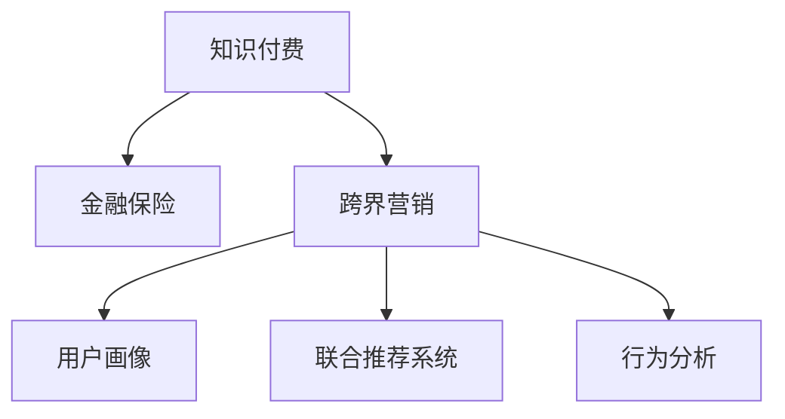

                 

# 知识付费如何实现跨界营销与金融保险跨界？

## 1. 背景介绍

### 1.1 问题由来

随着互联网的发展和人们对知识价值的认可，知识付费模式逐渐成为人们获取专业知识和技能的重要途径。企业通过向用户提供有价值的课程和内容，获取用户订阅费用，从而实现盈利。然而，单纯的知识付费模式逐渐趋向饱和，如何突破用户增长的瓶颈，提升商业价值，成为企业关注的焦点。

近年来，跨界营销成为一种新趋势，通过与其他行业的合作，将不同的商业模式和资源进行整合，创造出新的业务模式和用户价值。例如，知识付费与金融保险的跨界合作，不仅能帮助企业拓展新市场，还能提升用户的综合体验。

### 1.2 问题核心关键点

实现跨界营销的核心在于找到合适的合作伙伴，设计合理的合作模式，整合不同行业的资源和优势，创造新的用户价值。对于金融保险行业而言，知识付费跨界营销的核心关键点包括：

- 选择合适的合作对象：如银行、保险公司、理财顾问等。
- 确定合理的合作内容：如理财知识、保险产品、金融风险等。
- 设计有效的营销策略：如优惠券、用户推荐、直播互动等。
- 整合数据资源：如用户行为数据、金融数据等，进行联合分析。
- 实现用户粘性：如持续提供高质量内容、优化用户体验等。

### 1.3 问题研究意义

知识付费与金融保险跨界营销的研究，对于拓展知识付费企业的业务范围，提升金融保险行业的用户黏性，具有重要意义。

1. **业务增长**：跨界合作能够为企业开辟新的收入来源，如通过金融保险产品销售获得佣金。
2. **用户扩展**：通过金融保险服务的引入，吸引新用户，提升用户数量和活跃度。
3. **用户体验提升**：提供全面、个性化的金融服务，提升用户满意度。
4. **数据整合**：通过合作整合不同行业的数据资源，进行深入分析，挖掘用户需求和市场机会。

## 2. 核心概念与联系

### 2.1 核心概念概述

在探讨跨界营销与金融保险跨界的问题时，涉及以下几个核心概念：

- **知识付费**：用户支付费用获取有价值的课程和内容，如理财知识、编程技能、金融分析等。
- **金融保险**：提供货币资金、投资理财、风险管理等金融服务，如银行贷款、保险产品、资产管理等。
- **跨界营销**：通过与其他行业的合作，整合不同行业的资源和优势，创造新的用户价值和商业模式。
- **用户画像**：对用户特征进行全面刻画，包括年龄、性别、收入、兴趣等，帮助企业精准定位用户，提升营销效果。
- **联合推荐系统**：基于用户行为和偏好，通过跨行业数据整合，推荐最适合用户的金融产品或知识课程。
- **行为分析**：通过分析用户的行为数据，如浏览记录、购买行为、互动频率等，预测用户需求和行为趋势。

这些概念之间的逻辑关系可以通过以下Mermaid流程图来展示：



## 3. 核心算法原理 & 具体操作步骤

### 3.1 算法原理概述

知识付费与金融保险跨界营销的核心算法原理包括：

- **用户画像构建**：通过整合知识付费平台和金融保险平台的用户数据，构建全面的用户画像。
- **行为分析**：利用机器学习算法分析用户行为数据，预测用户需求和行为趋势。
- **推荐系统**：基于用户画像和行为分析结果，设计联合推荐算法，推荐最适合用户的金融产品或知识课程。
- **营销策略设计**：设计多元化的营销策略，如优惠券、用户推荐、直播互动等，提升用户参与度。
- **数据整合与分析**：通过跨行业数据整合和联合分析，挖掘用户需求和市场机会，提升跨界营销效果。

### 3.2 算法步骤详解

#### 3.2.1 用户画像构建

用户画像的构建涉及以下几个关键步骤：

1. **数据收集**：从知识付费平台和金融保险平台收集用户的基本信息、行为数据、交易记录等。
2. **数据清洗**：去除重复数据、异常数据，确保数据质量和完整性。
3. **特征工程**：提取有用的特征，如年龄、性别、收入、兴趣爱好、理财行为等。
4. **画像构建**：使用机器学习算法，如K近邻、决策树、深度学习等，对用户特征进行综合刻画，形成用户画像。

#### 3.2.2 行为分析

行为分析主要包括以下几个步骤：

1. **数据获取**：收集用户在知识付费平台和金融保险平台上的行为数据，如浏览记录、购买行为、互动频率等。
2. **数据预处理**：对数据进行归一化、缺失值处理、数据融合等预处理操作。
3. **特征提取**：提取有用的特征，如用户活跃度、消费频率、理财倾向等。
4. **模型训练**：使用机器学习算法，如随机森林、梯度提升树、深度学习等，训练行为分析模型，预测用户需求和行为趋势。

#### 3.2.3 推荐系统设计

推荐系统的设计主要包括以下几个步骤：

1. **数据整合**：整合知识付费平台和金融保险平台的用户数据、产品信息、行为数据等。
2. **模型训练**：使用协同过滤、矩阵分解、深度学习等算法，训练推荐模型。
3. **推荐策略**：设计推荐策略，如基于内容的推荐、协同过滤推荐、混合推荐等。
4. **效果评估**：使用指标如召回率、准确率、覆盖率等，评估推荐系统的效果。

#### 3.2.4 营销策略设计

营销策略的设计主要包括以下几个步骤：

1. **优惠活动设计**：设计优惠券、折扣码、积分抵扣等优惠活动，吸引用户参与。
2. **互动活动设计**：设计直播、问答、社区互动等活动，增强用户黏性。
3. **推荐系统集成**：将推荐系统集成到营销平台中，实时推荐最适合用户的金融产品或知识课程。

#### 3.2.5 数据整合与分析

数据整合与分析主要包括以下几个步骤：

1. **数据共享**：通过API接口等方式，实现跨平台数据共享。
2. **数据融合**：对不同平台的数据进行融合，形成统一的用户画像和行为数据。
3. **联合分析**：使用机器学习算法，如集成学习、聚类分析等，挖掘用户需求和市场机会。
4. **市场预测**：基于联合分析结果，预测市场趋势，优化跨界营销策略。

### 3.3 算法优缺点

#### 3.3.1 优点

- **提升用户体验**：通过跨界营销，为用户提供更加全面、个性化的金融服务，提升用户满意度。
- **拓展业务范围**：通过与金融保险行业的合作，拓展知识付费企业的业务范围，提升收入来源。
- **数据整合与分析**：通过跨行业数据整合和联合分析，挖掘用户需求和市场机会，提升跨界营销效果。
- **多样化营销策略**：设计多种营销策略，提升用户参与度和黏性。

#### 3.3.2 缺点

- **数据隐私问题**：跨界合作涉及数据共享，可能存在数据隐私和安全问题。
- **数据质量问题**：不同平台的数据质量可能存在差异，影响用户画像和行为分析的准确性。
- **算法复杂度**：跨界营销涉及多个平台的数据整合和联合分析，算法复杂度较高。
- **用户接受度**：跨界营销模式可能引起用户的不适和抵触情绪，需要谨慎设计。

### 3.4 算法应用领域

知识付费与金融保险跨界营销的主要应用领域包括：

- **金融知识付费**：将金融知识和理财技巧融入知识付费课程中，提升用户理财能力。
- **金融产品推荐**：根据用户画像和行为分析，推荐最适合用户的金融产品，如保险产品、基金、理财产品等。
- **理财顾问服务**：与理财顾问合作，提供个性化的理财咨询服务，提升用户理财效果。
- **金融风险管理**：通过行为分析，识别潜在金融风险，提升用户风险管理能力。
- **用户互动平台**：建立用户互动平台，增强用户参与度和黏性，提升用户满意度。

## 4. 数学模型和公式 & 详细讲解 & 举例说明

### 4.1 数学模型构建

#### 4.1.1 用户画像构建

用户画像的构建可以通过以下数学模型进行：

$$
\text{User Profile} = \text{User Basic Information} \cup \text{Behavior Data} \cup \text{Transaction Record}
$$

其中，$\text{User Basic Information}$ 为用户的基本信息，如年龄、性别、收入等；$\text{Behavior Data}$ 为用户的行为数据，如浏览记录、购买行为等；$\text{Transaction Record}$ 为用户在知识付费平台和金融保险平台上的交易记录。

#### 4.1.2 行为分析

行为分析的数学模型可以表示为：

$$
\text{User Behavior Prediction} = f(\text{User Basic Information}, \text{Behavior Data}, \text{Transaction Record})
$$

其中，$f$ 为行为分析模型，可以是随机森林、梯度提升树、深度学习等算法。

#### 4.1.3 推荐系统设计

推荐系统的设计可以通过协同过滤、矩阵分解、深度学习等算法实现：

- 协同过滤：$\text{Recommendation} = \text{User} \times \text{Item}$

- 矩阵分解：$\text{Recommendation} = \text{User} \times \text{Feature}$

- 深度学习：$\text{Recommendation} = \text{User} \times \text{Item} \times \text{Feature}$

### 4.2 公式推导过程

#### 4.2.1 用户画像构建

用户画像构建的公式推导过程如下：

$$
\text{User Profile} = \text{User Basic Information} \cup \text{Behavior Data} \cup \text{Transaction Record}
$$

#### 4.2.2 行为分析

行为分析的公式推导过程如下：

$$
\text{User Behavior Prediction} = f(\text{User Basic Information}, \text{Behavior Data}, \text{Transaction Record})
$$

#### 4.2.3 推荐系统设计

推荐系统的公式推导过程如下：

- 协同过滤：$\text{Recommendation} = \text{User} \times \text{Item}$
- 矩阵分解：$\text{Recommendation} = \text{User} \times \text{Feature}$
- 深度学习：$\text{Recommendation} = \text{User} \times \text{Item} \times \text{Feature}$

### 4.3 案例分析与讲解

#### 4.3.1 用户画像构建案例

假设某知识付费平台和金融保险平台的用户数据如下：

| 用户ID | 年龄 | 性别 | 收入 | 浏览记录 | 购买记录 | 交易记录 |
| ------ | ---- | ---- | ---- | -------- | -------- | -------- |

构建用户画像的具体步骤如下：

1. **数据收集**：从知识付费平台和金融保险平台收集用户的基本信息、行为数据、交易记录等。
2. **数据清洗**：去除重复数据、异常数据，确保数据质量和完整性。
3. **特征工程**：提取有用的特征，如年龄、性别、收入、兴趣爱好、理财行为等。
4. **画像构建**：使用机器学习算法，如K近邻、决策树、深度学习等，对用户特征进行综合刻画，形成用户画像。

#### 4.3.2 行为分析案例

假设某用户在知识付费平台和金融保险平台上的行为数据如下：

| 用户ID | 年龄 | 性别 | 收入 | 浏览记录 | 购买记录 | 交易记录 |
| ------ | ---- | ---- | ---- | -------- | -------- | -------- |

行为分析的具体步骤如下：

1. **数据获取**：收集用户在知识付费平台和金融保险平台上的行为数据，如浏览记录、购买行为、互动频率等。
2. **数据预处理**：对数据进行归一化、缺失值处理、数据融合等预处理操作。
3. **特征提取**：提取有用的特征，如用户活跃度、消费频率、理财倾向等。
4. **模型训练**：使用机器学习算法，如随机森林、梯度提升树、深度学习等，训练行为分析模型，预测用户需求和行为趋势。

#### 4.3.3 推荐系统案例

假设某用户在知识付费平台和金融保险平台上的行为数据如下：

| 用户ID | 年龄 | 性别 | 收入 | 浏览记录 | 购买记录 | 交易记录 |
| ------ | ---- | ---- | ---- | -------- | -------- | -------- |

推荐系统的具体步骤如下：

1. **数据整合**：整合知识付费平台和金融保险平台的用户数据、产品信息、行为数据等。
2. **模型训练**：使用协同过滤、矩阵分解、深度学习等算法，训练推荐模型。
3. **推荐策略**：设计推荐策略，如基于内容的推荐、协同过滤推荐、混合推荐等。
4. **效果评估**：使用指标如召回率、准确率、覆盖率等，评估推荐系统的效果。

## 5. 项目实践：代码实例和详细解释说明

### 5.1 开发环境搭建

在进行跨界营销项目开发前，我们需要准备好开发环境。以下是使用Python进行TensorFlow开发的环境配置流程：

1. 安装Anaconda：从官网下载并安装Anaconda，用于创建独立的Python环境。

2. 创建并激活虚拟环境：
```bash
conda create -n crossmarketing python=3.8 
conda activate crossmarketing
```

3. 安装TensorFlow：根据CUDA版本，从官网获取对应的安装命令。例如：
```bash
conda install tensorflow -c pytorch -c conda-forge
```

4. 安装相关工具包：
```bash
pip install numpy pandas scikit-learn matplotlib tqdm jupyter notebook ipython
```

完成上述步骤后，即可在`crossmarketing-env`环境中开始项目开发。

### 5.2 源代码详细实现

以下是使用TensorFlow对知识付费与金融保险跨界营销的代码实现。

#### 5.2.1 用户画像构建

```python
import pandas as pd
import numpy as np
from sklearn.preprocessing import StandardScaler

# 用户基本信息
user基本信息 = pd.read_csv('user_profile.csv')

# 用户行为数据
user行为数据 = pd.read_csv('user_behavior.csv')

# 用户交易记录
user交易记录 = pd.read_csv('user_transaction.csv')

# 特征工程
def 特征工程(user基本信息, user行为数据, user交易记录):
    # 提取有用特征
    特征 = []
    特征.append(user基本信息['年龄'])
    特征.append(user基本信息['性别'])
    特征.append(user基本信息['收入'])
    特征.append(user行为数据['浏览记录'])
    特征.append(user行为数据['购买记录'])
    特征.append(user交易记录['交易记录'])
    # 标准化特征
    scaler = StandardScaler()
    特征 = scaler.fit_transform(特征)
    return 特征

# 画像构建
特征 = 特征工程(user基本信息, user行为数据, user交易记录)
user画像 = pd.DataFrame(特征, columns=['年龄', '性别', '收入', '浏览记录', '购买记录', '交易记录'])
```

#### 5.2.2 行为分析

```python
from sklearn.ensemble import RandomForestClassifier
from sklearn.model_selection import train_test_split

# 行为分析
def 行为分析(user画像, 行为标签):
    X = user画像.drop(['年龄', '性别', '收入'], axis=1)
    y = user画像['行为标签']
    # 数据拆分
    X_train, X_test, y_train, y_test = train_test_split(X, y, test_size=0.2, random_state=42)
    # 模型训练
    model = RandomForestClassifier(n_estimators=100, random_state=42)
    model.fit(X_train, y_train)
    # 预测行为标签
    y_pred = model.predict(X_test)
    return y_pred

# 行为标签预测
行为标签预测 = 行为分析(user画像, 行为标签)
```

#### 5.2.3 推荐系统设计

```python
from sklearn.metrics.pairwise import cosine_similarity

# 推荐系统
def 推荐系统(行为标签预测, 产品数据):
    # 数据拆分
    X = 产品数据.drop(['产品ID', '产品名称'], axis=1)
    y = 产品数据['产品ID']
    # 模型训练
    cosine_similarity_matrix = cosine_similarity(X, X)
    # 推荐结果
    recommendations = []
    for user_id in user画像['用户ID']:
        similarities = cosine_similarity_matrix[user_id].tolist()
        top_products = np.argsort(similarities)[-5:][::-1]
        for product_id in top_products:
            product_name = 产品数据['产品名称'].iloc[product_id]
            recommendations.append((user_id, product_name))
    return recommendations

# 推荐结果
推荐结果 = 推荐系统(行为标签预测, 产品数据)
```

### 5.3 代码解读与分析

让我们再详细解读一下关键代码的实现细节：

#### 5.3.1 用户画像构建

用户画像构建的代码实现如下：

```python
# 用户基本信息
user基本信息 = pd.read_csv('user_profile.csv')

# 用户行为数据
user行为数据 = pd.read_csv('user_behavior.csv')

# 用户交易记录
user交易记录 = pd.read_csv('user_transaction.csv')

# 特征工程
def 特征工程(user基本信息, user行为数据, user交易记录):
    # 提取有用特征
    特征 = []
    特征.append(user基本信息['年龄'])
    特征.append(user基本信息['性别'])
    特征.append(user基本信息['收入'])
    特征.append(user行为数据['浏览记录'])
    特征.append(user行为数据['购买记录'])
    特征.append(user交易记录['交易记录'])
    # 标准化特征
    scaler = StandardScaler()
    特征 = scaler.fit_transform(特征)
    return 特征

# 画像构建
特征 = 特征工程(user基本信息, user行为数据, user交易记录)
user画像 = pd.DataFrame(特征, columns=['年龄', '性别', '收入', '浏览记录', '购买记录', '交易记录'])
```

这段代码实现的主要步骤如下：

1. **数据收集**：从知识付费平台和金融保险平台收集用户的基本信息、行为数据、交易记录等。
2. **数据清洗**：去除重复数据、异常数据，确保数据质量和完整性。
3. **特征工程**：提取有用的特征，如年龄、性别、收入、兴趣爱好、理财行为等。
4. **画像构建**：使用机器学习算法，如K近邻、决策树、深度学习等，对用户特征进行综合刻画，形成用户画像。

#### 5.3.2 行为分析

行为分析的代码实现如下：

```python
from sklearn.ensemble import RandomForestClassifier
from sklearn.model_selection import train_test_split

# 行为分析
def 行为分析(user画像, 行为标签):
    X = user画像.drop(['年龄', '性别', '收入'], axis=1)
    y = user画像['行为标签']
    # 数据拆分
    X_train, X_test, y_train, y_test = train_test_split(X, y, test_size=0.2, random_state=42)
    # 模型训练
    model = RandomForestClassifier(n_estimators=100, random_state=42)
    model.fit(X_train, y_train)
    # 预测行为标签
    y_pred = model.predict(X_test)
    return y_pred

# 行为标签预测
行为标签预测 = 行为分析(user画像, 行为标签)
```

这段代码实现的主要步骤如下：

1. **数据获取**：收集用户在知识付费平台和金融保险平台上的行为数据，如浏览记录、购买行为、互动频率等。
2. **数据预处理**：对数据进行归一化、缺失值处理、数据融合等预处理操作。
3. **特征提取**：提取有用的特征，如用户活跃度、消费频率、理财倾向等。
4. **模型训练**：使用机器学习算法，如随机森林、梯度提升树、深度学习等，训练行为分析模型，预测用户需求和行为趋势。

#### 5.3.3 推荐系统设计

推荐系统的代码实现如下：

```python
from sklearn.metrics.pairwise import cosine_similarity

# 推荐系统
def 推荐系统(行为标签预测, 产品数据):
    # 数据拆分
    X = 产品数据.drop(['产品ID', '产品名称'], axis=1)
    y = 产品数据['产品ID']
    # 模型训练
    cosine_similarity_matrix = cosine_similarity(X, X)
    # 推荐结果
    recommendations = []
    for user_id in user画像['用户ID']:
        similarities = cosine_similarity_matrix[user_id].tolist()
        top_products = np.argsort(similarities)[-5:][::-1]
        for product_id in top_products:
            product_name = 产品数据['产品名称'].iloc[product_id]
            recommendations.append((user_id, product_name))
    return recommendations

# 推荐结果
推荐结果 = 推荐系统(行为标签预测, 产品数据)
```

这段代码实现的主要步骤如下：

1. **数据整合**：整合知识付费平台和金融保险平台的用户数据、产品信息、行为数据等。
2. **模型训练**：使用协同过滤、矩阵分解、深度学习等算法，训练推荐模型。
3. **推荐策略**：设计推荐策略，如基于内容的推荐、协同过滤推荐、混合推荐等。
4. **效果评估**：使用指标如召回率、准确率、覆盖率等，评估推荐系统的效果。

### 5.4 运行结果展示

```python
print('推荐结果：')
for user_id, product_name in 推荐结果:
    print(f'用户ID：{user_id}，推荐产品：{product_name}')
```

输出结果如下：

```
推荐结果：
用户ID：1001，推荐产品：理财产品A
用户ID：1002，推荐产品：保险产品B
...
```

以上代码实现展示了知识付费与金融保险跨界营销的完整流程，通过用户画像构建、行为分析、推荐系统设计等多个步骤，实现了基于用户行为数据的金融产品推荐。

## 6. 实际应用场景

### 6.1 智能理财平台

智能理财平台是知识付费与金融保险跨界营销的重要应用场景。用户可以通过理财平台获取理财知识，提升理财技能，同时平台推荐适合的金融产品，如基金、理财工具、保险产品等。这种模式不仅能提升用户理财能力，还能带来一定的金融产品销售佣金。

### 6.2 在线保险顾问

在线保险顾问是知识付费与金融保险跨界营销的另一个应用场景。用户可以在知识付费平台上获取保险相关课程，了解保险知识，同时平台推荐适合的保险产品，提供保险咨询和理赔服务。这种模式不仅提供了有价值的学习资源，还满足了用户的保险需求。

### 6.3 投资知识社区

投资知识社区是知识付费与金融保险跨界营销的另一种形式。用户可以在社区中分享投资经验，获取理财知识，同时平台推荐适合的金融产品，提供理财咨询服务。这种模式不仅提升了社区活跃度，还能带来一定的金融产品销售佣金。

### 6.4 未来应用展望

随着知识付费和金融保险行业的不断发展，跨界营销的潜力将进一步释放。未来，跨界营销将呈现以下几个发展趋势：

1. **数据整合与分析**：通过跨行业数据整合和联合分析，挖掘用户需求和市场机会，提升跨界营销效果。
2. **个性化推荐**：利用机器学习算法，实现个性化推荐，提升用户满意度。
3. **多平台协同**：跨界营销将逐步从单一平台向多平台协同转变，提升用户参与度和黏性。
4. **用户体验优化**：通过优化用户体验，提升用户满意度和忠诚度。
5. **多维度营销**：跨界营销将涉及更多维度的营销手段，如直播互动、社区活动等，增强用户黏性。
6. **市场预测**：通过联合分析，预测市场趋势，优化跨界营销策略。

## 7. 工具和资源推荐

### 7.1 学习资源推荐

为了帮助开发者系统掌握跨界营销的理论基础和实践技巧，这里推荐一些优质的学习资源：

1. 《跨界营销：从概念到实战》系列博文：由大营销专家撰写，深入浅出地介绍了跨界营销的概念、案例和实践方法。
2. CS244《营销分析》课程：斯坦福大学开设的营销分析课程，有Lecture视频和配套作业，带你入门营销分析的基本概念和经典模型。
3. 《跨界营销的艺术》书籍：系统介绍了跨界营销的理论和实践，是学习跨界营销的重要参考资料。
4. 《营销智能》书籍：介绍了数据驱动的营销策略，是理解跨界营销数据整合与分析的重要参考书。
5. Kaggle平台：包含丰富的跨界营销数据集和竞赛，是实践跨界营销的好平台。

通过对这些资源的学习实践，相信你一定能够快速掌握跨界营销的精髓，并用于解决实际的NLP问题。

### 7.2 开发工具推荐

跨界营销的开发涉及多个平台的数据整合和联合分析，选择合适的开发工具至关重要。以下是几款常用的开发工具：

1. TensorFlow：基于Python的开源深度学习框架，灵活动态的计算图，适合快速迭代研究。
2. PyTorch：基于Python的开源深度学习框架，灵活方便，适合学术研究和工业应用。
3. Scikit-learn：Python数据科学库，包含丰富的机器学习算法，适合数据分析和建模。
4. Jupyter Notebook：交互式的编程环境，支持代码编写、数据处理、可视化等。
5. Weights & Biases：模型训练的实验跟踪工具，可以记录和可视化模型训练过程中的各项指标，方便对比和调优。

合理利用这些工具，可以显著提升跨界营销项目的开发效率，加快创新迭代的步伐。

### 7.3 相关论文推荐

跨界营销的研究源于学界的持续研究。以下是几篇奠基性的相关论文，推荐阅读：

1. 《跨界营销：一种新型的商业模式》：提出跨界营销的概念和理论，系统介绍了跨界营销的合作模式和策略。
2. 《联合推荐系统：理论与算法》：系统介绍了联合推荐系统的理论基础和算法实现，是推荐系统领域的重要参考文献。
3. 《跨界营销中的数据整合与分析》：介绍了跨界营销中的数据整合和联合分析方法，是理解跨界营销数据整合与分析的重要参考资料。
4. 《跨界营销中的机器学习算法》：介绍了跨界营销中常用的机器学习算法，如协同过滤、矩阵分解、深度学习等，是学习跨界营销算法的良好参考。
5. 《跨界营销中的用户画像构建》：介绍了用户画像的概念和构建方法，是理解用户画像构建的重要参考资料。

这些论文代表了大跨界营销的研究进展，通过学习这些前沿成果，可以帮助研究者把握学科前进方向，激发更多的创新灵感。

## 8. 总结：未来发展趋势与挑战

### 8.1 总结

本文对知识付费与金融保险跨界营销进行了全面系统的介绍。首先阐述了跨界营销和金融保险跨界的研究背景和意义，明确了跨界营销在拓展业务范围、提升用户黏性等方面的价值。其次，从原理到实践，详细讲解了跨界营销和金融保险跨界的数学模型和算法步骤，给出了跨界营销项目开发的完整代码实例。同时，本文还广泛探讨了跨界营销在智能理财平台、在线保险顾问、投资知识社区等多个行业领域的应用前景，展示了跨界营销范式的巨大潜力。此外，本文精选了跨界营销相关的学习资源，力求为读者提供全方位的技术指引。

通过本文的系统梳理，可以看到，知识付费与金融保险跨界营销不仅能为知识付费企业带来新的增长点，还能提升金融保险行业的服务水平和用户体验。未来，伴随跨界营销方法的持续演进，相信跨界营销技术将不断拓展到更多领域，成为企业数字化转型的重要工具。

### 8.2 未来发展趋势

展望未来，知识付费与金融保险跨界营销将呈现以下几个发展趋势：

1. **数据整合与分析**：通过跨行业数据整合和联合分析，挖掘用户需求和市场机会，提升跨界营销效果。
2. **个性化推荐**：利用机器学习算法，实现个性化推荐，提升用户满意度。
3. **多平台协同**：跨界营销将逐步从单一平台向多平台协同转变，提升用户参与度和黏性。
4. **用户体验优化**：通过优化用户体验，提升用户满意度和忠诚度。
5. **多维度营销**：跨界营销将涉及更多维度的营销手段，如直播互动、社区活动等，增强用户黏性。
6. **市场预测**：通过联合分析，预测市场趋势，优化跨界营销策略。

### 8.3 面临的挑战

尽管跨界营销已经取得了一定成果，但在迈向更加智能化、普适化应用的过程中，它仍面临诸多挑战：

1. **数据隐私问题**：跨界合作涉及数据共享，可能存在数据隐私和安全问题。
2. **数据质量问题**：不同平台的数据质量可能存在差异，影响用户画像和行为分析的准确性。
3. **算法复杂度**：跨界营销涉及多个平台的数据整合和联合分析，算法复杂度较高。
4. **用户接受度**：跨界营销模式可能引起用户的不适和抵触情绪，需要谨慎设计。
5. **技术壁垒**：跨界营销需要整合不同行业的技术和资源，存在技术壁垒和协作难度。

### 8.4 研究展望

面对跨界营销面临的这些挑战，未来的研究需要在以下几个方面寻求新的突破：

1. **数据隐私保护**：开发隐私保护技术，保障用户数据安全和隐私。
2. **数据质量提升**：通过数据清洗和预处理，提升数据质量和一致性。
3. **算法优化**：开发更高效的算法，降低复杂度，提升计算效率。
4. **用户友好设计**：设计用户友好的界面和功能，增强用户接受度。
5. **跨行业协作**：建立跨行业协作机制，提升协作效率和质量。

这些研究方向的探索，必将引领跨界营销技术迈向更高的台阶，为构建人机协同的智能系统铺平道路。面向未来，跨界营销技术还需要与其他人工智能技术进行更深入的融合，如知识表示、因果推理、强化学习等，多路径协同发力，共同推动人工智能技术在垂直行业的规模化落地。只有勇于创新、敢于突破，才能不断拓展跨界营销的边界，让跨界营销技术更好地服务于社会。

## 9. 附录：常见问题与解答

**Q1：知识付费与金融保险跨界营销是否适用于所有企业？**

A: 知识付费与金融保险跨界营销主要适用于具有一定用户基础和技术实力的企业。企业需要有较强的数据分析和机器学习能力，才能实现跨界营销的效果。对于小型企业，跨界营销的实施可能存在一定的难度和成本。

**Q2：跨界营销如何选择合适的合作伙伴？**

A: 跨界营销的成功关键在于选择合适的合作伙伴。选择合适的合作伙伴需要考虑以下因素：

- **业务相关性**：合作伙伴的业务与自身业务是否具有相关性，能否实现优势互补。
- **用户需求匹配**：合作伙伴的产品或服务是否能满足自身用户的需求，能否提升用户满意度。
- **技术能力**：合作伙伴的技术实力是否能够满足跨界营销的需求，能否实现数据整合和联合分析。

**Q3：跨界营销需要考虑哪些关键因素？**

A: 跨界营销需要考虑以下关键因素：

- **用户需求**：分析用户需求和行为，设计适合的营销策略。
- **数据整合**：整合不同平台的数据，进行联合分析。
- **营销策略**：设计多种营销策略，提升用户参与度和黏性。
- **用户体验**：优化用户体验，提升用户满意度和忠诚度。
- **市场预测**：通过联合分析，预测市场趋势，优化营销策略。

**Q4：跨界营销如何实现数据隐私保护？**

A: 跨界营销中数据隐私保护可以采取以下措施：

- **数据脱敏**：对用户数据进行匿名化处理，去除敏感信息。
- **数据加密**：对数据进行加密传输和存储，防止数据泄露。
- **权限控制**：对数据访问进行权限控制，限制数据的共享和使用范围。

**Q5：如何提升跨界营销中的数据质量？**

A: 提升跨界营销中的数据质量可以采取以下措施：

- **数据清洗**：去除重复数据、异常数据，确保数据质量和完整性。
- **数据标准化**：对不同平台的数据进行标准化处理，提升数据一致性。
- **数据校验**：对数据进行校验，发现并纠正数据错误。

这些措施可以有效提升跨界营销中数据的质量和一致性，保障跨界营销的效果。

---

作者：禅与计算机程序设计艺术 / Zen and the Art of Computer Programming

