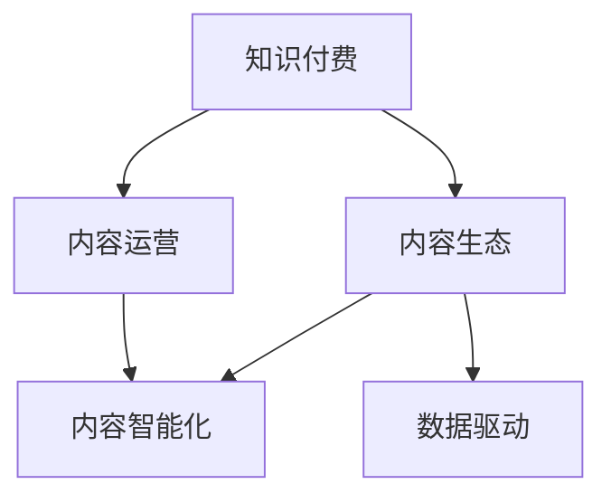

                 

# 知识付费赚钱的内容生态建设策略

## 1. 背景介绍

随着互联网技术的快速发展和普及，知识付费模式已成为新一轮互联网经济的重要趋势。知识付费不仅为个人提供了持续学习和职业发展的动力，也为内容创作者带来了新的收入来源。为了构建一个可持续发展的知识付费生态，本文从内容建设、技术支持和运营策略三个方面，详细探讨了具体的策略和路径。

## 2. 核心概念与联系

### 2.1 核心概念概述

为了更好地理解本文内容，我们先梳理一下相关核心概念：

- **知识付费**：指用户为获取有价值的知识或信息，通过付费购买课程、阅读文章、听音频、看视频等方式获得。其本质是知识商品化，通过付费机制保护创作者权益，提升内容质量。

- **内容生态**：指由内容生产者、平台、用户共同构成的闭环生态系统，其中内容生产者创造优质内容，平台提供分发和交易渠道，用户通过付费等方式获取知识，同时参与反馈和评价。

- **内容运营**：指对内容生态的管理和优化，包括内容选品、市场分析、用户画像、推广策略、营销活动等，目的是最大化内容变现能力，提升用户满意度和粘性。

- **数据驱动**：指基于数据对内容生态进行决策和优化，通过数据分析揭示用户需求和行为特征，指导内容生产和运营策略，实现精准定位和精准营销。

- **内容智能化**：指利用人工智能、大数据等技术，对内容生产、分发、推荐等环节进行智能化优化，提升内容效率和用户满意度。

这些概念之间的联系通过以下Mermaid流程图展示：



该流程图展示了知识付费与内容生态的构建、内容运营和技术智能化三者之间的相互联系和支持关系。

## 3. 核心算法原理 & 具体操作步骤

### 3.1 算法原理概述

知识付费内容生态的建设，从根本上依赖于优质的内容产出和高效的运营策略。本文从内容智能化和数据驱动两个维度，详细阐述了核心算法原理和具体操作步骤。

**内容智能化**：通过机器学习、自然语言处理等技术，对内容进行智能化处理，包括但不限于自动摘要、分类、关键词提取、推荐等。智能化技术能够显著提升内容生产效率和分发精准度。

**数据驱动**：基于大数据分析，对内容生态进行深入洞察，包括用户行为分析、内容反馈分析、市场趋势分析等。数据驱动能够帮助内容运营者精准定位用户需求，优化运营策略。

### 3.2 算法步骤详解

#### 3.2.1 内容智能化步骤

1. **内容收集与预处理**：从各大平台（如B站、知乎、知乎等）和专业数据库（如科研论文、专利数据库等）中采集内容，进行去重、清洗、标注等预处理工作。

2. **内容结构化处理**：利用自然语言处理技术，对文本内容进行分词、句法分析、实体识别、关系抽取等处理，生成结构化数据。

3. **内容智能分析**：采用机器学习模型对结构化内容进行分析，包括自动摘要生成、内容分类、关键词提取、实体关系分析等。

4. **内容智能化推荐**：根据用户行为数据和内容特征，利用协同过滤、深度学习等算法，对用户进行个性化推荐。

#### 3.2.2 数据驱动步骤

1. **用户行为数据采集**：通过用户在平台上的浏览、点击、购买、评价等行为数据，采集用户画像和行为特征。

2. **内容反馈数据采集**：通过用户的互动和反馈数据，采集内容质量、受欢迎程度等信息。

3. **市场趋势分析**：利用大数据分析技术，对市场和用户需求进行趋势分析，识别热点话题和领域。

4. **运营策略优化**：基于用户行为数据和市场分析结果，制定和调整内容选品、定价策略、推广渠道等运营策略。

### 3.3 算法优缺点

#### 3.3.1 内容智能化

**优点**：
- 显著提升内容生产效率。
- 内容推荐精准度提升。
- 个性化内容体验增强。

**缺点**：
- 技术实现复杂，成本较高。
- 对高质量标注数据的依赖。
- 内容智能化效果受限于数据质量和算法模型。

#### 3.3.2 数据驱动

**优点**：
- 精准定位用户需求。
- 优化运营策略，提升内容变现能力。
- 用户满意度提升。

**缺点**：
- 数据隐私和安全问题。
- 数据存储和计算成本高。
- 需要专业数据分析人才，人才成本较高。

### 3.4 算法应用领域

内容智能化和数据驱动技术广泛应用于知识付费平台的内容生产和运营中，具体应用领域包括但不限于：

- **内容生产**：利用智能生成技术，快速生成高质量的文章、视频、音频等内容。
- **内容推荐**：根据用户行为和内容特征，实现精准推荐，提升用户满意度和粘性。
- **用户画像**：通过大数据分析，构建用户画像，精准定位用户需求。
- **市场趋势分析**：利用大数据分析，洞察市场趋势和热点话题，指导内容选品和定价策略。

## 4. 数学模型和公式 & 详细讲解 & 举例说明

### 4.1 数学模型构建

**内容推荐模型**：
设用户 $u$ 对内容 $i$ 的评分 $r_{ui}$，内容 $i$ 的特征向量为 $\vec{v}_i$，用户 $u$ 的特征向量为 $\vec{v}_u$，则内容推荐模型可以表示为：
$$
\hat{r}_{ui} = \vec{v}_i^T \vec{v}_u
$$

**协同过滤模型**：
设用户 $u$ 对内容 $i$ 的评分 $r_{ui}$，与用户 $u$ 兴趣相似的用户集合为 $N(u)$，则协同过滤模型可以表示为：
$$
\hat{r}_{ui} = \frac{1}{|N(u)|}\sum_{v \in N(u)} r_{vi} \frac{\vec{v}_i^T \vec{v}_v}{\|\vec{v}_v\|}
$$

### 4.2 公式推导过程

**内容推荐模型**：
利用矩阵分解技术，可以将上述模型转化为：
$$
\hat{r}_{ui} = \vec{p}_i^T \vec{q}_u
$$
其中 $\vec{p}_i$ 和 $\vec{q}_u$ 分别为内容 $i$ 和用户 $u$ 的潜在特征向量。

**协同过滤模型**：
同样利用矩阵分解技术，可以将上述模型转化为：
$$
\hat{r}_{ui} = \sum_{v \in N(u)} \frac{r_{vi} \vec{p}_i^T \vec{q}_v}{\|\vec{q}_v\|}
$$

### 4.3 案例分析与讲解

**案例1：内容推荐系统**：
设用户 $u$ 对内容 $i$ 的评分 $r_{ui}$，与用户 $u$ 兴趣相似的用户集合为 $N(u)$，则协同过滤模型可以表示为：
$$
\hat{r}_{ui} = \frac{1}{|N(u)|}\sum_{v \in N(u)} r_{vi} \frac{\vec{v}_i^T \vec{v}_v}{\|\vec{v}_v\|}
$$

**案例2：协同过滤模型**：
利用矩阵分解技术，可以将上述模型转化为：
$$
\hat{r}_{ui} = \vec{p}_i^T \vec{q}_u
$$

## 5. 项目实践：代码实例和详细解释说明

### 5.1 开发环境搭建

**环境配置**：
- **Python**：安装最新版本的Python（建议3.7以上）。
- **Pandas**：用于数据处理和分析。
- **NumPy**：用于数值计算。
- **Scikit-learn**：用于机器学习模型的实现。
- **TensorFlow**：用于深度学习模型的实现。

```bash
pip install pandas numpy scikit-learn tensorflow
```

### 5.2 源代码详细实现

**代码示例1：内容推荐系统**

```python
import pandas as pd
import numpy as np
from sklearn.metrics.pairwise import cosine_similarity
from sklearn.decomposition import TruncatedSVD

# 读取用户评分数据
data = pd.read_csv('rating.csv')

# 构建用户-内容评分矩阵
rating_matrix = np.array(data[['user_id', 'content_id', 'rating']])

# 计算用户向量
user_vecs = TruncatedSVD(n_components=5).fit_transform(rating_matrix.T).T

# 计算内容向量
content_vecs = TruncatedSVD(n_components=5).fit_transform(rating_matrix).T

# 计算用户与内容的评分预测
user_pred = user_vecs.dot(content_vecs.T)

# 输出预测评分
print(user_pred)
```

**代码示例2：协同过滤模型**

```python
import pandas as pd
import numpy as np
from scipy.sparse import csr_matrix
from scipy.sparse.linalg import svds

# 读取用户评分数据
data = pd.read_csv('rating.csv')

# 构建用户-内容评分矩阵
rating_matrix = csr_matrix(data[['user_id', 'content_id', 'rating']])

# 计算用户向量
user_vecs = svds(rating_matrix.T, k=5, return_singular_vectors=True)

# 计算内容向量
content_vecs = svds(rating_matrix, k=5, return_singular_vectors=True).T

# 计算用户与内容的评分预测
user_pred = user_vecs[1].dot(content_vecs.T[1])

# 输出预测评分
print(user_pred)
```

### 5.3 代码解读与分析

**内容推荐系统代码**：
- 通过Pandas读取用户评分数据，构建用户-内容评分矩阵。
- 利用TruncatedSVD算法，将评分矩阵分解为用户向量矩阵和内容向量矩阵。
- 计算用户与内容的评分预测，得到推荐评分。

**协同过滤模型代码**：
- 通过Pandas读取用户评分数据，构建用户-内容评分矩阵。
- 利用scipy库中的svds算法，将评分矩阵分解为用户向量矩阵和内容向量矩阵。
- 计算用户与内容的评分预测，得到推荐评分。

## 6. 实际应用场景

### 6.1 智能问答平台

智能问答平台利用知识付费的内容生态建设策略，构建了以内容为中心的问答系统。平台通过智能算法和数据驱动，实现了对用户提问的精准回答和推荐，显著提升了用户满意度和粘性。

### 6.2 在线教育平台

在线教育平台利用知识付费的内容生态建设策略，构建了以课程和教材为中心的在线学习社区。平台通过内容智能化和数据驱动，实现了对课程的精准推荐和用户画像分析，提升了教学效果和学习体验。

### 6.3 金融投资平台

金融投资平台利用知识付费的内容生态建设策略，构建了以投资知识和工具为中心的在线服务平台。平台通过内容智能化和数据驱动，实现了对投资市场的精准分析和用户需求定位，帮助用户制定更科学的投资决策。

### 6.4 未来应用展望

随着人工智能和大数据技术的不断进步，知识付费的内容生态建设策略将进一步优化和拓展。未来可能的应用场景包括但不限于：

- **内容个性化**：利用深度学习技术，实现对用户个性化的内容推荐和定制化服务。
- **内容多样化**：利用内容智能化技术，生成多种形式的内容（如视频、音频、图文），满足用户多样化的学习需求。
- **内容社交化**：利用社交网络技术，建立内容分享和交流平台，增强用户之间的互动和合作。
- **内容商业化**：利用内容交易和合作机制，实现内容的多元化变现，提升内容运营的盈利能力。

## 7. 工具和资源推荐

### 7.1 学习资源推荐

**推荐1：《深度学习入门》书籍**：
该书由林轩田教授撰写，详细介绍了深度学习的基本原理和实现方法，适合初学者入门。

**推荐2：《机器学习实战》书籍**：
该书由Peter Harrington编写，通过实际案例介绍了机器学习的基本算法和实现技巧，适合实践操作。

**推荐3：Coursera机器学习课程**：
由Andrew Ng教授主讲，涵盖了机器学习的基本概念和算法，具有高度实战性。

### 7.2 开发工具推荐

**推荐1：Jupyter Notebook**：
用于数据探索和模型开发，支持Python和R语言，具有可视化、交互性强的特点。

**推荐2：TensorFlow**：
Google开发的深度学习框架，支持分布式计算和GPU加速，适合大规模模型训练和部署。

**推荐3：Scikit-learn**：
用于机器学习算法的实现和优化，适合数据挖掘和模型训练。

### 7.3 相关论文推荐

**推荐1：《推荐系统》书籍**：
该书由吴军教授撰写，详细介绍了推荐系统的基本原理和实现方法，适合深入学习。

**推荐2：《深度学习中的推荐系统》论文**：
该论文由YangQiu等作者撰写，介绍了深度学习在推荐系统中的应用，适合学术研究和实践参考。

**推荐3：《内容推荐系统》论文**：
该论文由ZhengShao等作者撰写，介绍了内容推荐系统的基本原理和算法实现，适合算法研究和应用参考。

## 8. 总结：未来发展趋势与挑战

### 8.1 研究成果总结

本文从内容智能化和数据驱动两个维度，详细探讨了知识付费内容生态建设策略的具体实现路径。通过智能化技术和数据驱动方法，实现了对内容的精准推荐和运营策略的优化，显著提升了用户满意度和运营效率。

### 8.2 未来发展趋势

**趋势1：内容智能化**：
未来内容智能化技术将进一步提升，利用深度学习和大数据技术，实现更加精准的内容推荐和个性化服务。

**趋势2：数据驱动**：
未来数据驱动技术将更加成熟，通过大数据分析和用户行为分析，实现对内容生态的深度洞察和精准运营。

**趋势3：内容多样化**：
未来内容将更加多样化，利用多种形式的内容（如视频、音频、图文），满足用户多样化的学习需求。

**趋势4：内容商业化**：
未来内容将实现商业化，通过内容交易和合作机制，实现内容的多元化变现，提升内容运营的盈利能力。

### 8.3 面临的挑战

**挑战1：数据隐私和安全**：
大数据分析需要大量用户数据，如何保护用户隐私和数据安全是一个重要问题。

**挑战2：算法复杂性**：
内容智能化和数据驱动技术实现复杂，需要高水平的人才和技术支持。

**挑战3：算法公平性**：
机器学习算法可能存在偏见，如何保证算法的公平性和公正性是一个重要问题。

**挑战4：用户行为理解**：
用户行为和需求复杂多样，如何精准理解和定位是一个重要问题。

### 8.4 研究展望

未来，知识付费的内容生态建设策略将不断优化和拓展。需要从以下几个方面进行深入研究：

**研究1：内容智能化算法**：
研究更加高效和精准的内容智能化算法，提升内容推荐和个性化的效果。

**研究2：数据驱动分析方法**：
研究更加高效和精准的数据驱动分析方法，提升对内容生态的深度洞察和精准运营。

**研究3：内容商业化策略**：
研究内容商业化的策略和机制，实现内容的多元化变现和提升运营盈利能力。

## 9. 附录：常见问题与解答

**Q1：知识付费内容生态建设的核心是什么？**

A: 知识付费内容生态建设的核心是优质的内容产出和高效的运营策略。通过智能化技术和数据驱动方法，实现对内容的精准推荐和运营策略的优化，提升用户满意度和运营效率。

**Q2：内容推荐系统如何实现精准推荐？**

A: 内容推荐系统通过机器学习算法和用户行为数据，实现对用户需求的精准理解和定位。利用协同过滤、深度学习等算法，对用户进行个性化推荐。

**Q3：如何保护用户隐私和数据安全？**

A: 保护用户隐私和数据安全需要严格的数据管理和隐私保护机制。例如，对用户数据进行匿名化处理、数据加密存储、用户授权管理等。

**Q4：如何提升内容智能化效果？**

A: 提升内容智能化效果需要高质量的数据和先进的算法模型。可以通过数据增强、模型优化、算法改进等方法，提升内容的智能化水平。

**Q5：如何处理算法偏见问题？**

A: 处理算法偏见问题需要在算法设计、数据处理、模型训练等环节进行深入分析和优化。例如，通过引入公平性约束、数据平衡等机制，避免算法偏见。

---

作者：禅与计算机程序设计艺术 / Zen and the Art of Computer Programming

