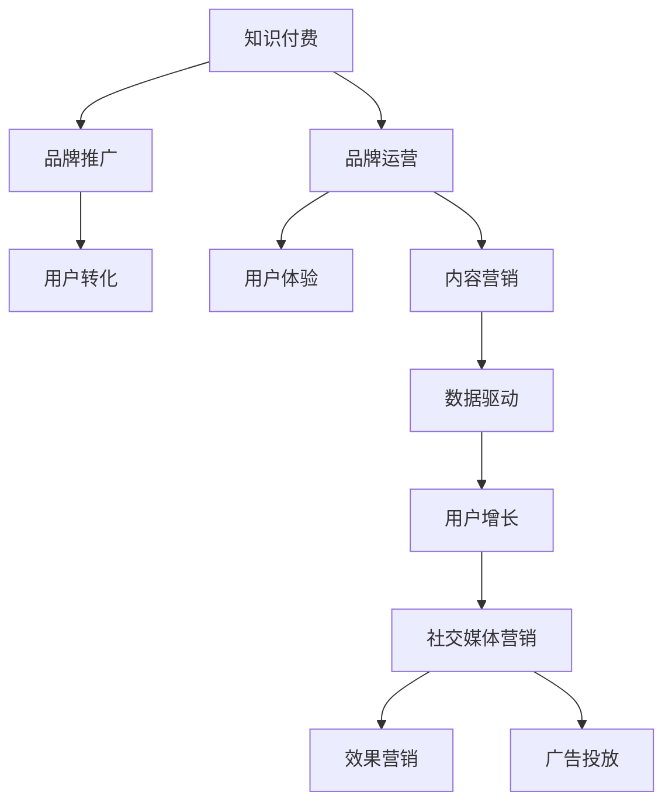

                 

# 知识付费赚钱的品牌品牌运营与品牌推广策略

> 关键词：知识付费, 品牌运营, 品牌推广, 商业模式, 用户运营, 内容营销, 数据驱动, 用户增长, 社交媒体营销, 效果营销, 广告投放

## 1. 背景介绍

### 1.1 问题由来
知识付费（Knowledge Paid），是指消费者为了获取专业知识、技能或信息，需要付费购买相关内容的一种模式。随着互联网的发展，人们对于高质量知识和信息的渴求日益增长，知识付费逐渐成为一种主流消费趋势。然而，市场竞争激烈，知识付费品牌要实现盈利并不容易。面对这一挑战，品牌运营与品牌推广成为了关键。

### 1.2 问题核心关键点
品牌运营与品牌推广的关键在于如何利用市场营销手段，提升品牌知名度，吸引用户，最终实现付费转化。具体来说，包括：
- 制定明确的品牌战略和营销目标
- 设计创新的品牌形象和传播策略
- 进行精准的用户画像分析和用户细分
- 实施有效的渠道策略，包括线上线下结合、多渠道整合等
- 建立良好的用户口碑和互动机制，提升用户粘性
- 不断迭代优化品牌和产品，满足用户需求

### 1.3 问题研究意义
品牌运营与品牌推广的深入研究，对于知识付费行业具有重要意义：
- 提升品牌竞争力，增加市场份额
- 提高用户转化率，实现盈利
- 改善用户口碑，提升品牌形象
- 探索可持续的商业模式，实现长期发展
- 创新营销方式，引领行业发展趋势

## 2. 核心概念与联系

### 2.1 核心概念概述

为更好地理解知识付费的品牌品牌运营与品牌推广方法，本节将介绍几个密切相关的核心概念：

- 知识付费（Knowledge Paid）：用户为获取专业知识和技能，需要付费购买相关内容的一种商业模式。
- 品牌运营（Brand Operation）：企业通过一系列的市场营销手段，提升品牌知名度和用户粘性，实现品牌价值和利润的转化。
- 品牌推广（Brand Promotion）：企业通过广告、公关、公关活动等手段，提升品牌曝光度和市场份额。
- 用户体验（User Experience, UX）：用户在使用产品或服务过程中的整体感受和满意度。
- 用户转化（User Conversion）：用户从初步接触品牌到付费订阅或购买内容的过程。
- 内容营销（Content Marketing）：通过创作和发布有价值的内容，吸引和留住目标用户，最终实现销售目标。
- 数据驱动（Data-Driven）：利用数据分析和算法，优化品牌运营和推广策略，提高决策的科学性和准确性。
- 用户增长（User Growth）：通过各种手段，提高用户数量和留存率，推动品牌的发展。
- 社交媒体营销（Social Media Marketing）：利用社交媒体平台，提升品牌知名度和用户互动。
- 效果营销（Performance Marketing）：以效果为导向的营销策略，强调投资回报率（ROI）。
- 广告投放（Ad Placement）：通过广告渠道，向目标用户推广品牌和内容，实现品牌曝光。

这些核心概念之间的逻辑关系可以通过以下Mermaid流程图来展示：



这个流程图展示了几大核心概念之间的相互关系：

1. 知识付费是基础，品牌运营和推广是其发展的关键驱动因素。
2. 品牌运营和推广的目的是吸引和转化用户，提升用户体验，从而实现盈利。
3. 用户体验和内容营销是品牌运营的重要组成部分。
4. 数据驱动和用户增长为品牌运营提供了科学的决策支持。
5. 社交媒体营销和效果营销为品牌推广提供了多渠道策略。
6. 广告投放是品牌推广的重要手段，实现高效曝光和品牌曝光。

## 3. 核心算法原理 & 具体操作步骤
### 3.1 算法原理概述

品牌运营与品牌推广的核心算法原理主要涉及以下几个方面：

1. **用户画像分析与细分**：通过对用户行为数据的分析，构建用户画像，实现用户细分，从而实现精准推广。

2. **多渠道整合策略**：利用多渠道整合营销（Omnichannel Marketing），提升品牌曝光度和用户互动。

3. **用户体验优化**：通过优化产品和服务，提升用户体验，增加用户满意度和粘性。

4. **数据驱动决策**：利用数据分析和算法，优化营销策略，提高决策的科学性和准确性。

5. **效果营销与转化率优化**：通过效果营销和A/B测试等手段，不断优化转化率，提高付费转化效果。

6. **社交媒体互动与内容传播**：利用社交媒体平台的互动机制，增加品牌曝光和用户参与度，推动内容传播。

7. **广告投放策略**：通过精准投放广告，提升品牌曝光度和市场份额。

### 3.2 算法步骤详解

以下是基于品牌运营与品牌推广的核心算法原理的具体操作步骤：

**Step 1: 用户画像分析与细分**

1. 收集用户数据：包括用户基本信息、行为数据、互动数据等。
2. 数据清洗与处理：去除噪音数据，处理缺失值和异常值。
3. 用户画像构建：利用机器学习算法，如聚类、分类等，构建用户画像。
4. 用户细分：根据用户画像，将用户分为不同细分群体。

**Step 2: 多渠道整合策略**

1. 选择合适的营销渠道：包括社交媒体、电子邮件、SEO、SEM等。
2. 内容创作与分发：创作高质量内容，并通过多渠道分发。
3. 数据监测与反馈：监测渠道效果，收集用户反馈，优化策略。

**Step 3: 用户体验优化**

1. 用户需求分析：分析用户需求和痛点，优化产品和服务。
2. 用户体验设计：提升UI/UX设计，增加用户满意度。
3. 反馈机制建立：建立用户反馈机制，持续优化用户体验。

**Step 4: 数据驱动决策**

1. 数据采集与处理：利用数据分析工具，采集和处理数据。
2. 数据模型构建：构建数据模型，进行用户行为预测和分析。
3. 策略优化：根据数据模型，优化品牌运营和推广策略。

**Step 5: 效果营销与转化率优化**

1. 广告投放与效果监测：选择合适广告平台，监测广告效果。
2. 效果营销策略：根据广告效果，优化营销策略。
3. A/B测试与优化：通过A/B测试，优化转化率。

**Step 6: 社交媒体互动与内容传播**

1. 社交媒体运营：选择合适的社交媒体平台，进行内容发布和互动。
2. 社交媒体监测：监测用户互动和反馈，优化内容传播策略。
3. KOL合作与推广：与KOL合作，提升品牌曝光度。

**Step 7: 广告投放策略**

1. 目标用户定位：确定目标用户群体，选择合适的广告渠道。
2. 广告创意设计：设计创意广告内容。
3. 广告投放与效果评估：选择合适广告平台，评估广告效果，优化投放策略。

### 3.3 算法优缺点

品牌运营与品牌推广的核心算法具有以下优点：
1. 精准推广：通过用户画像分析和细分，实现精准推广，提升转化率。
2. 多渠道整合：利用多渠道整合策略，提升品牌曝光度和用户互动。
3. 数据驱动：利用数据分析和算法，优化策略，提高决策的科学性和准确性。
4. 用户转化：通过效果营销和用户体验优化，提高用户转化率。
5. 内容传播：利用社交媒体和KOL合作，增加品牌曝光和用户参与度。
6. 广告投放：通过精准投放广告，提升品牌曝光度和市场份额。

同时，这些算法也存在以下缺点：
1. 数据隐私问题：用户数据采集和分析可能涉及用户隐私问题，需要谨慎处理。
2. 技术门槛高：数据分析和算法优化需要一定的技术门槛，需要专业人才支持。
3. 用户流失问题：过度营销可能导致用户反感和流失，需要平衡营销与用户体验。
4. 广告成本高：高质量的广告投放可能带来高成本，需要合理控制预算。
5. 数据噪音问题：用户数据采集和处理可能存在噪音，影响分析结果。
6. 市场变化快：市场需求和技术发展快速变化，需要持续跟踪和调整策略。

### 3.4 算法应用领域

品牌运营与品牌推广的核心算法在多个领域都有广泛应用，例如：

- 在线教育：利用用户画像分析和多渠道整合策略，提升品牌知名度和用户粘性，实现用户转化。
- 在线医疗：通过数据驱动决策和社交媒体互动，提升用户体验和品牌曝光度，实现用户增长。
- 电子商务：通过效果营销和广告投放策略，提升品牌曝光和市场份额，实现用户增长和转化。
- 金融科技：利用数据分析和用户画像，优化产品和服务，提升用户体验和品牌形象，实现用户增长。
- 媒体出版：通过多渠道整合和社交媒体互动，提升品牌知名度和用户参与度，实现品牌推广和用户增长。
- 文化娱乐：通过内容营销和效果营销，提升品牌曝光度和用户互动，实现品牌推广和用户转化。

除了上述这些常见应用领域外，品牌运营与品牌推广的核心算法还可以应用于更多场景，如政府公共服务、非营利组织等，帮助其提升品牌影响力和用户参与度。

## 4. 数学模型和公式 & 详细讲解 & 举例说明

### 4.1 数学模型构建

品牌运营与品牌推广的数学模型构建涉及以下几个关键要素：

- **用户画像模型**：利用聚类算法，构建用户画像。
- **多渠道整合模型**：利用多目标优化算法，优化多渠道策略。
- **用户体验模型**：利用回归分析，优化产品和服务。
- **数据驱动模型**：利用机器学习算法，优化营销策略。
- **效果营销模型**：利用逻辑回归和A/B测试，优化广告投放。
- **社交媒体模型**：利用图模型，优化社交媒体互动。
- **广告投放模型**：利用线性回归和优化算法，优化广告投放策略。

### 4.2 公式推导过程

以下是一些关键模型的公式推导过程：

#### 用户画像模型

假设用户数据集为 $D=\{(x_i,y_i)\}_{i=1}^N$，其中 $x_i$ 为用户特征向量，$y_i$ 为用户标签。利用K-means聚类算法，将用户分为 $K$ 个类别。模型训练目标为最小化聚类误差，即：

$$
\min_{\mu_k} \sum_{i=1}^N \min_{k=1,\ldots,K} ||x_i - \mu_k||^2
$$

其中 $\mu_k$ 为聚类中心。

#### 多渠道整合模型

设用户在不同渠道上的转化率为 $C_k$，总预算为 $B$，优化目标为最大化总转化率，即：

$$
\max_{C_k} \sum_{k=1}^K C_k \quad \text{subject to} \quad \sum_{k=1}^K C_k B_k = B
$$

其中 $B_k$ 为渠道 $k$ 的预算。

#### 用户体验模型

设用户体验评分为 $U$，产品和服务质量为 $Q$，用户反馈为 $F$。模型训练目标为最大化用户体验，即：

$$
\min_{Q} \max_{U} U(Q, F)
$$

其中 $U(Q, F)$ 为用户体验函数， $F$ 为用户反馈向量。

#### 数据驱动模型

设用户行为数据为 $D=\{(x_i,y_i)\}_{i=1}^N$，预测目标为 $Y$，优化目标为最小化预测误差，即：

$$
\min_{\theta} \frac{1}{N} \sum_{i=1}^N \ell(\theta(x_i), y_i)
$$

其中 $\ell$ 为损失函数， $\theta$ 为模型参数。

#### 效果营销模型

设广告投放数据为 $D=\{(x_i,y_i)\}_{i=1}^N$，其中 $x_i$ 为广告特征向量， $y_i$ 为广告效果标签。利用逻辑回归算法，预测广告效果，即：

$$
\max_{\theta} \sum_{i=1}^N y_i \log \hat{y}_i + (1-y_i) \log (1-\hat{y}_i)
$$

其中 $\hat{y}_i$ 为模型预测值。

#### 社交媒体模型

设社交媒体互动数据为 $D=\{(x_i,y_i)\}_{i=1}^N$，其中 $x_i$ 为社交媒体特征向量， $y_i$ 为互动效果标签。利用图模型，预测社交媒体互动效果，即：

$$
\max_{G} \sum_{i=1}^N y_i \log \sigma(G(x_i))
$$

其中 $\sigma$ 为激活函数， $G$ 为社交媒体互动图。

#### 广告投放模型

设广告投放数据为 $D=\{(x_i,y_i)\}_{i=1}^N$，其中 $x_i$ 为广告特征向量， $y_i$ 为广告效果标签。利用线性回归算法，预测广告投放效果，即：

$$
\min_{\theta} \frac{1}{N} \sum_{i=1}^N ||y_i - \theta^T x_i||^2
$$

其中 $\theta$ 为模型参数。

### 4.3 案例分析与讲解

#### 案例一：在线教育品牌运营

某在线教育品牌希望通过品牌运营提升用户转化率。首先，通过用户行为数据和社交媒体数据，利用聚类算法构建用户画像，实现用户细分。然后，选择合适的渠道策略，通过多渠道整合营销提升品牌曝光度。最后，利用数据分析和机器学习算法，优化产品和服务，提升用户体验，增加用户粘性。

#### 案例二：电子商务品牌推广

某电子商务平台希望通过品牌推广提升市场份额。首先，利用数据分析和算法，构建多渠道整合模型，优化广告投放策略。然后，通过社交媒体互动和KOL合作，提升品牌曝光度和用户参与度。最后，利用效果营销和A/B测试，优化广告投放，提高用户转化率。

#### 案例三：金融科技品牌运营

某金融科技公司希望通过品牌运营提升用户增长率。首先，通过用户行为数据和社交媒体数据，构建用户画像，实现精准推广。然后，利用数据分析和算法，优化产品和服务，提升用户体验。最后，利用社交媒体互动和效果营销，增加品牌曝光和用户参与度，实现用户增长。

## 5. 项目实践：代码实例和详细解释说明

### 5.1 开发环境搭建

在进行品牌运营与品牌推广实践前，我们需要准备好开发环境。以下是使用Python进行Pandas和Scikit-learn开发的环境配置流程：

1. 安装Anaconda：从官网下载并安装Anaconda，用于创建独立的Python环境。

2. 创建并激活虚拟环境：
```bash
conda create -n brand-op-env python=3.8 
conda activate brand-op-env
```

3. 安装Pandas和Scikit-learn：
```bash
pip install pandas scikit-learn
```

4. 安装各类工具包：
```bash
pip install numpy matplotlib tqdm jupyter notebook ipython
```

完成上述步骤后，即可在`brand-op-env`环境中开始品牌运营与品牌推广实践。

### 5.2 源代码详细实现

下面以在线教育品牌为例，给出使用Pandas和Scikit-learn进行用户画像分析和社交媒体互动的PyTorch代码实现。

首先，定义用户数据集：

```python
import pandas as pd
from sklearn.decomposition import KMeans

# 读取用户行为数据
user_data = pd.read_csv('user_behavior_data.csv')

# 选择相关特征
features = ['age', 'gender', 'study_time', 'past_scores']

# 数据预处理
X = user_data[features]
y = user_data['label']

# 聚类分析
kmeans = KMeans(n_clusters=5, random_state=0)
kmeans.fit(X)
```

然后，定义社交媒体互动数据集：

```python
# 读取社交媒体互动数据
social_data = pd.read_csv('social_media_data.csv')

# 选择相关特征
features = ['followers', 'interaction_rate', 'post_quality']

# 数据预处理
X = social_data[features]
y = social_data['interaction']

# 图模型构建
from igraph import Graph

# 创建图
g = Graph()
g.add_vertices(len(X))
g.add_edges(range(len(X)))

# 添加边
for i in range(len(X)):
    for j in range(len(X)):
        if i != j:
            g.add_edge(i, j, weight=0.5 * abs(X[i] - X[j]))
```

接着，定义社交媒体互动分析函数：

```python
from sklearn.metrics.pairwise import cosine_similarity

def social_media_analysis(X):
    # 计算相似度
    similarity = cosine_similarity(X)

    # 构建图
    g = Graph()
    g.add_vertices(len(X))
    g.add_edges(range(len(X)))
    for i in range(len(X)):
        for j in range(len(X)):
            if i != j:
                g.add_edge(i, j, weight=0.5 * similarity[i][j])

    # 计算中心度
    centrality = g.degree_centrality()
    return centrality
```

最后，启动用户画像分析与社交媒体互动分析：

```python
# 用户画像分析
kmeans_results = kmeans.predict(X)

# 社交媒体互动分析
centrality_results = social_media_analysis(X)

# 输出结果
print('用户画像分析结果：', kmeans_results)
print('社交媒体互动分析结果：', centrality_results)
```

以上就是使用Pandas和Scikit-learn进行用户画像分析和社交媒体互动分析的完整代码实现。可以看到，利用数据分析工具和算法，可以轻松构建用户画像和社交媒体互动图，为品牌运营与品牌推广提供数据支持。

### 5.3 代码解读与分析

让我们再详细解读一下关键代码的实现细节：

**用户画像分析**：
- 读取用户行为数据和标签，选择相关特征。
- 利用KMeans算法进行聚类分析，得到用户画像。
- 输出聚类结果。

**社交媒体互动分析**：
- 读取社交媒体互动数据和标签，选择相关特征。
- 利用图模型构建社交媒体互动图。
- 利用相似度计算中心度，分析用户互动。
- 输出分析结果。

**用户画像和社交媒体互动分析**：
- 利用用户画像和社交媒体互动分析结果，结合品牌运营与品牌推广策略，提升品牌知名度和用户转化率。

## 6. 实际应用场景
### 6.1 智能客服系统

基于品牌运营与品牌推广的在线教育平台，可以构建智能客服系统。通过智能客服系统，用户可以实时获得咨询和支持，提升用户体验，增加用户粘性。

在技术实现上，可以构建知识库，存储常见问题及答案，利用机器学习算法，训练客服机器人。然后，通过用户画像和社交媒体互动分析，实现精准推广，提升智能客服系统的曝光度和用户互动。

### 6.2 金融舆情监测

金融科技公司可以利用品牌推广技术，进行金融舆情监测。通过社交媒体互动分析和用户画像分析，实时监测市场舆情变化，及时预警潜在风险，提高金融决策的准确性和效率。

具体而言，可以利用金融领域相关的新闻、评论、讨论等社交媒体数据，构建用户画像，分析舆情变化趋势。然后，通过效果营销和广告投放，提升品牌曝光度，实现金融舆情监测和风险预警。

### 6.3 个性化推荐系统

电子商务平台可以利用品牌运营与品牌推广技术，构建个性化推荐系统。通过用户画像分析和社交媒体互动分析，获取用户偏好和需求，推荐符合用户兴趣的商品和服务。

具体而言，可以利用用户行为数据和社交媒体互动数据，构建用户画像，分析用户兴趣和需求。然后，通过多渠道整合策略和效果营销，提升品牌曝光度和用户互动，实现个性化推荐。

### 6.4 未来应用展望

随着品牌运营与品牌推广技术的不断发展，其在更多领域将得到应用，为品牌带来新的发展机遇：

- 智慧医疗：利用品牌推广技术，提升医疗服务智能化水平，辅助医生诊疗，加速新药开发进程。
- 智能教育：利用品牌运营与品牌推广技术，构建智慧教育平台，因材施教，促进教育公平，提高教学质量。
- 智慧城市：利用品牌推广技术，提升城市管理的自动化和智能化水平，构建更安全、高效的未来城市。
- 文娱传媒：利用品牌运营与品牌推广技术，推动文化娱乐产业的发展，增加品牌曝光度和用户互动。
- 企业生产：利用品牌运营与品牌推广技术，提升企业品牌形象，增加市场份额。
- 社会治理：利用品牌推广技术，推动社会治理智能化，提升社会管理水平。

此外，在农业、旅游、环境保护等领域，品牌运营与品牌推广技术也将不断拓展应用场景，为各行各业带来新的创新和发展机遇。

## 7. 工具和资源推荐
### 7.1 学习资源推荐

为了帮助开发者系统掌握品牌运营与品牌推广的理论基础和实践技巧，这里推荐一些优质的学习资源：

1. 《品牌运营与品牌推广》系列博文：由品牌专家撰写，深入浅出地介绍了品牌运营与品牌推广的理论基础和实践技巧。

2. 《数字营销》课程：Coursera开设的数字营销课程，涵盖品牌运营与品牌推广的各个方面，包括用户画像分析、多渠道整合策略、社交媒体互动等。

3. 《品牌管理》书籍：品牌管理经典书籍，详细介绍了品牌战略、品牌定位、品牌推广等品牌运营的各个方面。

4. 《数据驱动品牌营销》书籍：介绍如何利用数据分析和算法，优化品牌运营与品牌推广策略，提高决策的科学性和准确性。

5. 《社交媒体营销》课程：Udemy开设的社交媒体营销课程，涵盖社交媒体互动、KOL合作、内容营销等品牌推广的各个方面。

通过对这些资源的学习实践，相信你一定能够快速掌握品牌运营与品牌推广的精髓，并用于解决实际的营销问题。
###  7.2 开发工具推荐

高效的开发离不开优秀的工具支持。以下是几款用于品牌运营与品牌推广开发的常用工具：

1. Python：Python是数据科学和机器学习领域的主要编程语言，适合进行数据分析和算法优化。

2. Pandas：Pandas是Python中强大的数据处理库，适合进行数据清洗、特征工程等预处理工作。

3. Scikit-learn：Scikit-learn是Python中强大的机器学习库，适合进行聚类、回归、分类等算法模型的构建和优化。

4. Matplotlib：Matplotlib是Python中强大的可视化库，适合进行数据可视化和图表展示。

5. Seaborn：Seaborn是基于Matplotlib的高级可视化库，适合进行更复杂的数据可视化分析。

6. Jupyter Notebook：Jupyter Notebook是一个交互式编程环境，适合进行数据分析和算法实验，便于分享学习笔记。

合理利用这些工具，可以显著提升品牌运营与品牌推广任务的开发效率，加快创新迭代的步伐。

### 7.3 相关论文推荐

品牌运营与品牌推广技术的不断发展源于学界的持续研究。以下是几篇奠基性的相关论文，推荐阅读：

1. 《品牌运营与品牌推广策略》：介绍品牌运营与品牌推广的理论基础和实践技巧。

2. 《多渠道整合营销策略》：探讨如何利用多渠道整合策略，提升品牌曝光度和用户互动。

3. 《用户体验优化》：介绍如何通过用户体验优化，提升用户满意度和粘性。

4. 《数据驱动品牌营销》：探讨如何利用数据分析和算法，优化品牌运营与品牌推广策略。

5. 《社交媒体互动分析》：介绍如何通过社交媒体互动分析，提升品牌曝光度和用户参与度。

6. 《广告投放策略优化》：探讨如何通过广告投放策略优化，提升品牌曝光度和市场份额。

这些论文代表了大语言模型微调技术的发展脉络。通过学习这些前沿成果，可以帮助研究者把握学科前进方向，激发更多的创新灵感。

## 8. 总结：未来发展趋势与挑战

### 8.1 总结

本文对品牌运营与品牌推广的核心算法原理和具体操作步骤进行了全面系统的介绍。首先阐述了品牌运营与品牌推广的背景和意义，明确了品牌运营与品牌推广在知识付费行业中的关键作用。其次，从原理到实践，详细讲解了用户画像分析、多渠道整合、用户体验优化等关键步骤，给出了品牌运营与品牌推广的完整代码实例。同时，本文还广泛探讨了品牌运营与品牌推广在智能客服、金融舆情、个性化推荐等各个领域的应用前景，展示了品牌运营与品牌推广技术的广泛应用潜力。

通过对这些资源的学习实践，相信你一定能够快速掌握品牌运营与品牌推广的精髓，并用于解决实际的营销问题。

### 8.2 未来发展趋势

展望未来，品牌运营与品牌推广技术将呈现以下几个发展趋势：

1. 用户画像更加精准：随着数据分析技术的发展，用户画像将更加精准，品牌运营与品牌推广的精准性将进一步提升。

2. 多渠道整合更加智能化：利用人工智能技术，实现多渠道整合策略的智能化和自动化。

3. 用户体验优化更加全面：通过用户行为数据分析，实现全渠道的用户体验优化，提升用户粘性和满意度。

4. 数据驱动决策更加科学：利用大数据和机器学习算法，优化营销策略，提高决策的科学性和准确性。

5. 效果营销更加精准：通过精准的广告投放和效果监测，实现高ROI的效果营销。

6. 社交媒体互动更加活跃：利用社交媒体平台的互动机制，增加品牌曝光和用户参与度，推动内容传播。

7. 品牌推广更加个性化：利用用户画像和行为数据，实现个性化品牌推广，提升品牌曝光度和用户互动。

8. 品牌管理更加智能化：通过人工智能技术，实现品牌管理的智能化和自动化，提升品牌运营效率和效果。

以上趋势凸显了品牌运营与品牌推广技术的广阔前景。这些方向的探索发展，必将进一步提升品牌运营与品牌推广的效果，引领品牌管理和营销的智能化转型。

### 8.3 面临的挑战

尽管品牌运营与品牌推广技术已经取得了一定的成果，但在迈向更加智能化、普适化应用的过程中，它仍面临着诸多挑战：

1. 数据隐私问题：品牌运营与品牌推广过程中，涉及大量的用户数据，如何保护用户隐私，防止数据泄露，是一个重要挑战。

2. 技术门槛高：品牌运营与品牌推广的实施需要一定的技术门槛，需要专业人才支持，如何降低技术门槛，提升技术普及性，是一个关键问题。

3. 用户流失问题：过度营销可能导致用户反感和流失，如何平衡营销与用户体验，是一个重要挑战。

4. 广告成本高：高质量的广告投放可能带来高成本，如何合理控制预算，实现高ROI的广告投放，是一个关键问题。

5. 数据噪音问题：用户数据采集和处理可能存在噪音，如何过滤噪音，提高数据质量，是一个重要挑战。

6. 市场变化快：市场需求和技术发展快速变化，如何持续跟踪和调整策略，是一个关键问题。

7. 效果评估难度高：品牌运营与品牌推广的效果评估较为复杂，如何科学评估效果，进行效果监测和优化，是一个重要挑战。

8. 广告投放策略优化难：广告投放策略的优化需要大量的实验和分析，如何高效优化，实现广告投放的精准性，是一个关键问题。

### 8.4 研究展望

面对品牌运营与品牌推广技术所面临的挑战，未来的研究需要在以下几个方面寻求新的突破：

1. 探索无监督和半监督品牌运营与品牌推广方法：摆脱对大规模标注数据的依赖，利用自监督学习、主动学习等无监督和半监督范式，最大限度利用非结构化数据，实现更加灵活高效的品牌运营与品牌推广。

2. 研究参数高效和多渠道整合策略：开发更加参数高效和多渠道整合的算法，在固定大部分品牌运营与品牌推广参数的同时，只更新极少量的任务相关参数，减小品牌运营与品牌推广的风险。

3. 融合因果分析和对比学习范式：通过引入因果推断和对比学习思想，增强品牌运营与品牌推广模型建立稳定因果关系的能力，学习更加普适、鲁棒的品牌推广知识。

4. 引入更多先验知识：将符号化的先验知识，如知识图谱、逻辑规则等，与品牌运营与品牌推广模型进行巧妙融合，引导品牌运营与品牌推广过程学习更准确、合理的品牌推广知识。

5. 结合因果分析和博弈论工具：将因果分析方法引入品牌运营与品牌推广模型，识别出品牌运营与品牌推广决策的关键特征，增强品牌推广的因果性和逻辑性。

6. 纳入伦理道德约束：在品牌运营与品牌推广模型训练目标中引入伦理导向的评估指标，过滤和惩罚有害的输出倾向，确保品牌推广符合人类价值观和伦理道德。

这些研究方向的探索，必将引领品牌运营与品牌推广技术迈向更高的台阶，为构建安全、可靠、可解释、可控的智能品牌推广系统铺平道路。面向未来，品牌运营与品牌推广技术还需要与其他人工智能技术进行更深入的融合，如知识表示、因果推理、强化学习等，多路径协同发力，共同推动品牌推广技术的进步。只有勇于创新、敢于突破，才能不断拓展品牌运营与品牌推广技术的边界，让智能品牌推广技术更好地造福人类社会。

## 9. 附录：常见问题与解答

**Q1：如何构建用户画像？**

A: 构建用户画像的关键在于数据采集和处理。首先，需要收集用户行为数据，包括用户基本信息、行为记录、互动数据等。然后，对数据进行清洗和处理，去除噪音和异常值。最后，利用机器学习算法，如聚类、分类等，构建用户画像，实现用户细分。

**Q2：多渠道整合策略如何实现？**

A: 多渠道整合策略的关键在于选择合适的渠道和内容。首先，选择合适的渠道，如社交媒体、电子邮件、SEO等。然后，创作高质量内容，并通过多渠道分发。最后，利用数据分析和算法，监测渠道效果，收集用户反馈，优化策略。

**Q3：用户体验优化主要从哪些方面入手？**

A: 用户体验优化的关键在于用户需求分析。首先，通过用户行为数据分析，了解用户需求和痛点。然后，优化产品和服务，提升UI/UX设计，增加用户满意度。最后，建立用户反馈机制，持续优化用户体验。

**Q4：效果营销和广告投放策略如何优化？**

A: 效果营销和广告投放策略优化的关键在于效果监测和A/B测试。首先，选择合适的广告平台，进行广告投放。然后，利用效果营销和A/B测试，监测广告效果，优化广告投放策略。最后，利用数据分析和算法，优化广告投放，提高用户转化率。

**Q5：社交媒体互动分析如何进行？**

A: 社交媒体互动分析的关键在于图模型构建和社交媒体平台选择。首先，利用图模型，构建社交媒体互动图。然后，选择合适社交媒体平台，进行内容发布和互动。最后，利用数据分析和算法，监测用户互动，分析社交媒体效果，优化社交媒体互动策略。

通过对这些问题的解答，相信你能够更深入地理解品牌运营与品牌推广的核心算法原理和具体操作步骤，并用于解决实际的营销问题。

