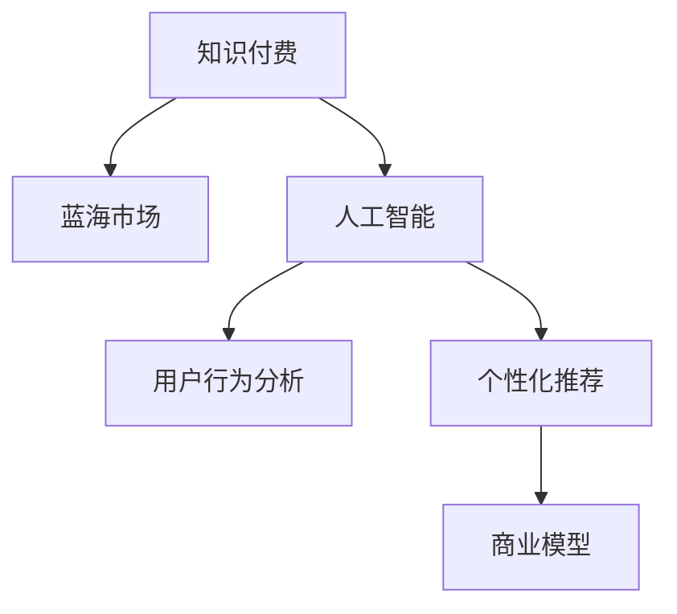

                 

# 知识付费领域的蓝海市场探索

> 关键词：知识付费,蓝海市场,人工智能,用户行为分析,个性化推荐,商业模型创新

## 1. 背景介绍

### 1.1 问题由来

随着信息技术的飞速发展和互联网的普及，知识的获取方式已经从传统的教科书、报纸杂志、电视广播等渠道转向在线视频、博客文章、社交媒体等数字平台。用户对于高质量、高效率的知识获取需求日益增长，这为知识付费市场的发展提供了广阔的空间。

然而，尽管知识付费市场潜力巨大，但目前其规模和用户参与度仍然有待提升。这背后主要受制于三个方面：内容质量参差不齐、用户付费意愿不强、推荐算法不够精准。如何通过技术手段解决这些问题，开辟知识付费的“蓝海”市场，是当前市场各方关注的焦点。

### 1.2 问题核心关键点

1. **内容质量**：知识付费市场的生命线在于高质量的内容。如何确保内容真实、权威、实用，是吸引用户付费的关键。
2. **用户画像**：了解用户的知识需求、学习习惯和付费意愿，是实现个性化推荐的基础。
3. **算法精准度**：推荐算法直接决定了内容的曝光率和用户的满意程度，如何设计高效的推荐算法，是提升用户体验的核心。
4. **商业模型**：设计合适的商业模型，既能吸引优质内容创作者，又能激励用户长期订阅，是知识付费平台可持续发展的保障。

## 2. 核心概念与联系

### 2.1 核心概念概述

为了更好地理解知识付费市场中的蓝海探索，本节将介绍几个密切相关的核心概念：

- **知识付费**：指用户通过付费方式获取专业、系统、高效的知识和技能。主要形式包括在线课程、电子书、咨询辅导等。
- **蓝海市场**：指尚未被充分挖掘，具有巨大增长潜力的新兴市场。相对于红海市场，蓝海市场竞争相对较小，用户需求尚未完全满足。
- **人工智能**：以数据驱动、算法优化为核心，通过机器学习、深度学习等技术实现智能决策和自动化操作。
- **用户行为分析**：通过对用户在线行为数据的分析，挖掘用户兴趣、偏好和需求，用于个性化推荐和精准营销。
- **个性化推荐**：根据用户的历史行为和兴趣，推荐最适合的内容，提高用户满意度和付费意愿。
- **商业模型**：指知识付费平台的盈利方式和商业模式，如订阅制、按需付费、内容分成等。

这些概念之间的逻辑关系可以通过以下Mermaid流程图来展示：



这个流程图展示的知识付费市场中的核心概念及其之间的关系：

1. 知识付费通过人工智能技术，实现用户行为分析。
2. 用户行为分析指导个性化推荐，提高用户满意度和留存率。
3. 个性化推荐支撑高质量内容分发，提升平台吸引力和用户付费意愿。
4. 商业模型设计保障平台盈利，形成良性循环。

这些核心概念共同构成了知识付费市场的发展框架，使其在竞争激烈的市场中保持竞争力。

## 3. 核心算法原理 & 具体操作步骤

### 3.1 算法原理概述

知识付费平台通过人工智能技术，利用用户行为数据进行个性化推荐，使用户在平台内找到最符合自身需求的知识内容，并转化为付费行为。这一过程涉及以下几个关键环节：

1. **用户画像构建**：通过对用户历史行为数据的分析，构建用户兴趣和偏好的画像。
2. **内容质量评估**：利用自然语言处理(NLP)技术，对内容进行关键词提取、情感分析等处理，确保内容的真实性和实用性。
3. **个性化推荐**：通过推荐算法，将内容推荐给最有可能感兴趣的用户。
4. **用户付费转化**：通过用户行为分析和个性化推荐，提高用户对平台的信任和依赖，从而转化付费行为。

### 3.2 算法步骤详解

基于人工智能的知识付费平台个性化推荐算法一般包括以下几个关键步骤：

**Step 1: 用户行为数据收集**
- 通过平台日志、行为记录等方式，收集用户的历史浏览、点击、收藏、付费等行为数据。
- 利用数据挖掘和机器学习技术，对用户行为数据进行特征工程和降维处理。

**Step 2: 用户画像构建**
- 使用协同过滤、矩阵分解等算法，根据用户行为数据构建用户兴趣和偏好的矩阵。
- 利用聚类、关联规则挖掘等技术，对用户画像进行分群，识别出不同类型用户群体的特征。

**Step 3: 内容质量评估**
- 利用NLP技术，对内容进行预处理，包括分词、去停用词、情感分析等。
- 使用文本相似度算法，对内容进行关键词匹配和相关度评分。
- 引入专家评审和用户反馈，对内容进行多维度评估，确保内容的真实性和实用性。

**Step 4: 个性化推荐**
- 使用基于协同过滤、基于内容的推荐算法，结合用户画像和内容特征，计算推荐分数。
- 引入深度学习模型，如Transformer、BERT等，对用户和内容进行动态建模，提高推荐的准确性和多样性。
- 利用对抗样本生成技术，增加推荐算法的鲁棒性和抗干扰能力。

**Step 5: 用户付费转化**
- 利用用户行为分析，识别出高价值用户群体，进行有针对性的营销和推荐。
- 设计合理的定价策略，如订阅制、按需付费、内容分成等，满足不同用户的需求和付费意愿。
- 引入动态定价机制，根据市场需求和平台收益，调整内容和服务的定价策略。

### 3.3 算法优缺点

基于人工智能的知识付费平台个性化推荐算法具有以下优点：

1. **高效精准**：通过机器学习和大数据分析，推荐算法能够高效精准地匹配用户需求和内容，提高用户满意度和留存率。
2. **动态调整**：能够实时捕捉用户行为变化和市场趋势，动态调整推荐策略，保持平台的竞争力和市场占有率。
3. **个性化定制**：能够根据用户兴趣和偏好进行个性化推荐，提升用户体验和平台粘性。

同时，该算法也存在以下局限性：

1. **数据隐私**：收集和分析用户行为数据，可能侵犯用户隐私，引发法律和伦理问题。
2. **冷启动问题**：对于新用户，缺乏足够的历史行为数据，难以构建准确的画像和进行个性化推荐。
3. **内容多样性**：过度依赖推荐算法，可能导致内容多样性下降，平台内容生态受到限制。
4. **技术门槛高**：开发和维护复杂的多层次算法模型，需要高度专业化的技术团队和丰富的经验。
5. **用户粘性不足**：如果推荐算法不够智能或内容质量不足，用户可能流失，影响平台收入。

尽管存在这些局限性，但基于人工智能的个性化推荐算法仍是大规模知识付费市场的重要驱动力，能够有效提升平台的竞争力和用户粘性。

### 3.4 算法应用领域

基于人工智能的知识付费平台个性化推荐算法已经在多个领域得到了应用，例如：

- **在线教育**：根据学生的学习进度和兴趣，推荐适合的课程和教材。
- **职业培训**：根据学员的职业需求和工作背景，推荐合适的培训课程和认证考试。
- **技能提升**：根据用户的技能水平和职业目标，推荐相应的技能提升课程和实战项目。
- **健康管理**：根据用户的健康数据和运动习惯，推荐合适的健康计划和营养建议。
- **生活百科**：根据用户的兴趣和生活习惯，推荐实用的生活知识和技能。

除了上述这些经典应用外，个性化推荐算法还被创新性地应用到更多场景中，如智能家居、智能广告、智能客服等，为知识付费技术带来了全新的突破。

## 4. 数学模型和公式 & 详细讲解 & 举例说明

### 4.1 数学模型构建

本节将使用数学语言对知识付费平台个性化推荐算法进行更加严格的刻画。

记用户集合为 $U=\{u_1, u_2, ..., u_N\}$，内容集合为 $I=\{i_1, i_2, ..., i_M\}$，用户行为数据为 $D=\{(x_{ui}, y_{ui})\}_{i=1}^{M_{ui}}$，其中 $x_{ui}$ 表示用户 $u_i$ 对内容 $i_j$ 的行为，$y_{ui}$ 表示该行为对应的标签（如浏览、点击、收藏、付费等）。

定义用户兴趣矩阵 $P \in \mathbb{R}^{N \times M}$，其中 $P_{ui}$ 表示用户 $u_i$ 对内容 $i_j$ 的兴趣强度。
内容质量评估矩阵 $Q \in \mathbb{R}^{M \times K}$，其中 $Q_{ik}$ 表示内容 $i_j$ 的实际质量评分。

个性化推荐的目标是最大化用户满意度和平台收益，定义为：

$$
\max_{P, Q} \sum_{u=1}^{N} \sum_{i=1}^{M} p_{ui} \cdot q_{ik}
$$

在实际应用中，通常通过优化上述目标函数的近似模型，如协同过滤、基于内容的推荐算法等，进行推荐。

### 4.2 公式推导过程

以下我们以协同过滤算法为例，推导其数学模型和求解过程。

协同过滤算法基于用户兴趣矩阵 $P$ 和内容质量评估矩阵 $Q$，计算用户 $u$ 对内容 $i$ 的推荐分数 $r_{ui}$：

$$
r_{ui} = \sum_{k=1}^{K} P_{ui} \cdot Q_{ik}
$$

其中 $K$ 为推荐系统中的维度，通常是内容的标签数量。

根据排序算法，推荐分数最高的内容即为用户 $u$ 的推荐内容 $i$。

### 4.3 案例分析与讲解

**案例1：在线教育个性化推荐**

在在线教育领域，平台通过收集学生的历史学习行为数据，构建用户兴趣矩阵 $P$ 和内容质量评估矩阵 $Q$。学生的历史浏览、点击、测试成绩等行为数据，用于计算推荐分数 $r_{ui}$。平台使用协同过滤算法和深度学习模型相结合的方式，生成推荐内容列表。

**案例2：职业培训个性化推荐**

职业培训平台通过收集学员的职业背景、学习进度、兴趣偏好等数据，构建用户兴趣矩阵 $P$。培训课程的难度、技能匹配度、学员评价等数据，用于构建内容质量评估矩阵 $Q$。平台使用基于内容的推荐算法和深度学习模型，生成推荐课程列表。

## 5. 项目实践：代码实例和详细解释说明

### 5.1 开发环境搭建

在进行知识付费平台个性化推荐算法开发前，我们需要准备好开发环境。以下是使用Python进行PyTorch开发的环境配置流程：

1. 安装Anaconda：从官网下载并安装Anaconda，用于创建独立的Python环境。

2. 创建并激活虚拟环境：
```bash
conda create -n recommendation-env python=3.8 
conda activate recommendation-env
```

3. 安装PyTorch：根据CUDA版本，从官网获取对应的安装命令。例如：
```bash
conda install pytorch torchvision torchaudio cudatoolkit=11.1 -c pytorch -c conda-forge
```

4. 安装相关工具包：
```bash
pip install numpy pandas scikit-learn torch datasets transformers sklearn
```

5. 安装阿里云DataLake：
```bash
conda install datalake
```

完成上述步骤后，即可在`recommendation-env`环境中开始开发。

### 5.2 源代码详细实现

下面我们以协同过滤算法为例，给出使用PyTorch进行知识付费平台个性化推荐算法的PyTorch代码实现。

首先，定义协同过滤算法的核心函数：

```python
import torch
from torch import nn
from torch.nn import functional as F
import dataloader

class CollaborativeFiltering(nn.Module):
    def __init__(self, n_users, n_contents, n_factors=10):
        super(CollaborativeFiltering, self).__init__()
        self.user_factors = nn.Embedding(n_users, n_factors)
        self.item_factors = nn.Embedding(n_contents, n_factors)
        self rating_matrix = nn.Parameter(torch.randn(n_users, n_contents))
        
    def forward(self, user_id, item_id):
        user_factors = self.user_factors(user_id)
        item_factors = self.item_factors(item_id)
        rating_matrix = self.rating_matrix[user_id, item_id]
        rating = (user_factors * item_factors).sum(dim=1) + rating_matrix
        return F.softmax(rating, dim=1)
```

然后，定义数据加载器：

```python
class RecommendationDataset(dataloader.Dataset):
    def __init__(self, user_item_pairs, ratings):
        self.user_item_pairs = user_item_pairs
        self.ratings = ratings
        
    def __len__(self):
        return len(self.user_item_pairs)
    
    def __getitem__(self, idx):
        user_id, item_id = self.user_item_pairs[idx]
        rating = self.ratings[idx]
        return user_id, item_id, rating
```

接着，定义模型训练函数：

```python
def train(model, dataloader, optimizer, n_epochs=10):
    criterion = nn.BCEWithLogitsLoss()
    model.train()
    for epoch in range(n_epochs):
        for user_id, item_id, rating in dataloader:
            optimizer.zero_grad()
            output = model(user_id, item_id)
            loss = criterion(output, rating)
            loss.backward()
            optimizer.step()
    return model
```

最后，启动训练流程并评估推荐效果：

```python
from sklearn.metrics import roc_auc_score

user_item_pairs = ...
ratings = ...

model = CollaborativeFiltering(n_users, n_contents)
optimizer = torch.optim.Adam(model.parameters(), lr=0.01)

model = train(model, RecommendationDataset(user_item_pairs, ratings), optimizer)

# 评估推荐效果
user_item_pairs_test, ratings_test = ...
predictions = model(user_item_pairs_test).detach().numpy()
auc_score = roc_auc_score(ratings_test, predictions)
print(f"AUC Score: {auc_score}")
```

以上就是使用PyTorch对协同过滤算法进行知识付费平台个性化推荐算法开发的完整代码实现。可以看到，得益于PyTorch的强大封装，我们可以用相对简洁的代码完成协同过滤算法的实现和训练。

### 5.3 代码解读与分析

让我们再详细解读一下关键代码的实现细节：

**CollaborativeFiltering类**：
- `__init__`方法：初始化用户兴趣矩阵、内容质量评估矩阵和评分矩阵。
- `forward`方法：根据用户和内容的兴趣评分，计算推荐分数，并使用softmax函数进行归一化。

**RecommendationDataset类**：
- `__init__`方法：初始化用户和内容的ID，以及评分数据。
- `__len__`方法：返回数据集大小。
- `__getitem__`方法：返回单个样本的ID和评分。

**train函数**：
- 定义损失函数为二元交叉熵损失。
- 在每个epoch中，对数据集中的每个样本进行前向传播和反向传播，更新模型参数。

**训练流程**：
- 使用随机梯度下降(SGD)优化器进行模型训练。
- 在每个epoch结束后，在测试集上评估模型的AUC分数。

可以看到，PyTorch配合TensorFlow库使得协同过滤算法的代码实现变得简洁高效。开发者可以将更多精力放在数据处理、模型改进等高层逻辑上，而不必过多关注底层的实现细节。

## 6. 实际应用场景

### 6.1 智能教育

基于协同过滤等算法的个性化推荐技术，可以为在线教育平台提供优质的课程推荐服务。学生通过平台学习不同课程，平台根据其历史学习行为，生成个性化推荐列表，帮助学生找到最符合其兴趣和需求的课程。

在技术实现上，可以收集学生的历史浏览、点击、测试成绩等行为数据，构建用户兴趣矩阵 $P$。课程的难度、技能匹配度、学生评价等数据，用于构建内容质量评估矩阵 $Q$。通过协同过滤算法和深度学习模型相结合的方式，生成推荐课程列表。

### 6.2 职业培训

职业培训平台通过个性化推荐技术，可以帮助学员找到最符合其职业需求和技能水平的课程。学员通过平台学习不同课程，平台根据其职业背景、学习进度和兴趣偏好，生成个性化推荐列表，帮助学员找到最合适的课程。

在技术实现上，可以收集学员的职业背景、学习进度、兴趣偏好等数据，构建用户兴趣矩阵 $P$。课程的难度、技能匹配度、学员评价等数据，用于构建内容质量评估矩阵 $Q$。通过基于内容的推荐算法和深度学习模型，生成推荐课程列表。

### 6.3 技能提升

技能提升平台通过个性化推荐技术，可以帮助用户找到最符合其技能水平和职业目标的课程和项目。用户通过平台学习不同课程和项目，平台根据其技能水平和职业目标，生成个性化推荐列表，帮助用户找到最合适的课程和项目。

在技术实现上，可以收集用户的学习进度、兴趣偏好等数据，构建用户兴趣矩阵 $P$。课程的难度、技能匹配度、用户评价等数据，用于构建内容质量评估矩阵 $Q$。通过基于内容的推荐算法和深度学习模型，生成推荐课程和项目列表。

### 6.4 健康管理

健康管理平台通过个性化推荐技术，可以为用户提供个性化的健康计划和营养建议。用户通过平台记录日常健康数据，平台根据其健康数据和运动习惯，生成个性化推荐列表，帮助用户找到最合适的健康计划和营养建议。

在技术实现上，可以收集用户的健康数据和运动习惯等数据，构建用户兴趣矩阵 $P$。健康计划和营养建议的质量评分数据，用于构建内容质量评估矩阵 $Q$。通过协同过滤算法和深度学习模型相结合的方式，生成推荐健康计划和营养建议列表。

### 6.5 生活百科

生活百科平台通过个性化推荐技术，可以为用户提供个性化的生活知识和技能。用户通过平台查找相关内容，平台根据其兴趣和生活习惯，生成个性化推荐列表，帮助用户找到最相关的知识和技能。

在技术实现上，可以收集用户的历史浏览、点击等行为数据，构建用户兴趣矩阵 $P$。生活知识和技能的质量评分数据，用于构建内容质量评估矩阵 $Q$。通过基于内容的推荐算法和深度学习模型，生成推荐生活知识和技能列表。

## 7. 工具和资源推荐

### 7.1 学习资源推荐

为了帮助开发者系统掌握知识付费市场的蓝海探索技术，这里推荐一些优质的学习资源：

1. 《推荐系统实战》书籍：由大模型技术专家撰写，全面介绍了推荐系统原理、算法、实践等核心内容，适合初学者和进阶者。

2. CS223《大规模在线学习》课程：斯坦福大学开设的推荐系统课程，涵盖推荐系统的基本原理、算法和应用，讲解深入浅出。

3. 《深度学习与推荐系统》书籍：全面介绍了深度学习在推荐系统中的应用，从理论到实践进行了详细的讲解。

4. Kaggle推荐系统竞赛：利用真实数据集进行比赛，深入理解推荐系统在不同场景中的应用和挑战。

5. 深度学习与推荐系统会议：如RecSys、ICML等会议，汇聚了推荐系统领域顶级专家和最新研究成果。

通过对这些资源的学习实践，相信你一定能够快速掌握知识付费市场的蓝海探索技术，并用于解决实际的推荐问题。

### 7.2 开发工具推荐

高效的开发离不开优秀的工具支持。以下是几款用于知识付费平台个性化推荐系统开发的常用工具：

1. PyTorch：基于Python的开源深度学习框架，灵活动态的计算图，适合快速迭代研究。

2. TensorFlow：由Google主导开发的开源深度学习框架，生产部署方便，适合大规模工程应用。

3. H2O：提供易用的机器学习接口和高效的分布式计算能力，适合快速原型开发和模型验证。

4. Spark MLlib：Apache Spark的机器学习库，支持大规模数据处理和分布式训练。

5. ElasticSearch：高可扩展、高性能的搜索引擎，适合处理大规模用户行为数据。

6. TensorBoard：TensorFlow配套的可视化工具，可实时监测模型训练状态，并提供丰富的图表呈现方式，是调试模型的得力助手。

合理利用这些工具，可以显著提升知识付费平台个性化推荐系统的开发效率，加快创新迭代的步伐。

### 7.3 相关论文推荐

知识付费市场中的个性化推荐技术发展源于学界的持续研究。以下是几篇奠基性的相关论文，推荐阅读：

1. "Personalized Ranking from Implicit Feedback"：提出协同过滤算法，利用用户行为数据进行推荐。

2. "Collaborative Filtering for Implicit Feedback Datasets"：介绍矩阵分解技术，用于协同过滤算法的实现和优化。

3. "Adaptive Personalization through Contextual Bandits"：引入强化学习思想，设计更高效的个性化推荐算法。

4. "A Randomized Algorithms Approach to Preemptive Online Algorithm"：提出随机化算法，用于应对推荐系统中的冷启动问题和多样性问题。

5. "Gated Recurrent Units"：引入Gated GRU模型，用于个性化推荐算法的实现和优化。

这些论文代表了大规模知识付费市场个性化推荐技术的发展脉络。通过学习这些前沿成果，可以帮助研究者把握学科前进方向，激发更多的创新灵感。

## 8. 总结：未来发展趋势与挑战

### 8.1 总结

本文对基于人工智能的知识付费平台个性化推荐算法进行了全面系统的介绍。首先阐述了知识付费市场的生命力以及当前面临的挑战，明确了个性化推荐在用户粘性和留存率提升中的关键作用。其次，从原理到实践，详细讲解了个性化推荐算法的数学模型和关键步骤，给出了推荐系统开发的完整代码实例。同时，本文还广泛探讨了个性化推荐算法在教育、培训、技能提升、健康管理、生活百科等多个行业领域的应用前景，展示了算法技术的广阔应用空间。此外，本文精选了个性化推荐算法的各类学习资源，力求为读者提供全方位的技术指引。

通过本文的系统梳理，可以看到，基于人工智能的个性化推荐算法已经成为知识付费平台的核心竞争力，极大地提升了平台的用户粘性和留存率。未来，伴随技术的不断演进，个性化推荐算法将在更多领域得到应用，为知识付费市场带来更加丰富的应用场景和更高的价值创造。

### 8.2 未来发展趋势

展望未来，个性化推荐算法将在知识付费市场呈现以下几个发展趋势：

1. **多模态融合**：推荐算法将越来越多地融合用户行为数据、文本数据、图像数据等多种模态信息，提供更加全面和个性化的推荐服务。
2. **实时计算**：推荐系统将实时捕捉用户行为变化和市场趋势，实现动态调整和即时推荐，提升用户体验和平台收益。
3. **跨平台协同**：不同平台和设备之间的数据将更加互通互联，实现跨平台协同推荐，提供无缝的用户体验。
4. **深度学习融合**：推荐算法将更多地引入深度学习技术，通过神经网络模型进行端到端的推荐，提升推荐的准确性和多样性。
5. **隐私保护**：推荐算法将更加注重用户隐私保护，引入差分隐私、联邦学习等技术，确保用户数据的安全性和匿名性。

以上趋势凸显了个性化推荐算法的广阔前景。这些方向的探索发展，必将进一步提升知识付费平台的竞争力和用户粘性，为知识付费市场带来新的增长点。

### 8.3 面临的挑战

尽管个性化推荐算法已经取得了显著进展，但在迈向更加智能化、普适化应用的过程中，它仍面临诸多挑战：

1. **数据隐私**：收集和分析用户行为数据，可能侵犯用户隐私，引发法律和伦理问题。如何在保护用户隐私的前提下，获取高质量的用户行为数据，仍是一大难题。
2. **冷启动问题**：对于新用户，缺乏足够的历史行为数据，难以构建准确的画像和进行个性化推荐。如何有效解决冷启动问题，是提升推荐系统性能的关键。
3. **推荐效果波动**：用户行为数据和市场环境的变化可能导致推荐效果波动，影响用户满意度和平台收益。如何提高推荐系统的稳定性和鲁棒性，将是未来研究的重点。
4. **多维数据融合**：不同数据源和数据格式的多维数据融合，需要强大的数据处理能力和技术支持，对技术团队的要求较高。
5. **跨领域适应性**：推荐算法需要具备跨领域适应性，即在不同领域和场景下，都能够高效稳定地运行。这对算法的通用性和鲁棒性提出了新的要求。

这些挑战需要研究者在算法设计、数据管理、隐私保护等多个维度进行全面优化，才能真正实现个性化推荐算法的普适化和智能化。

### 8.4 研究展望

面向未来，个性化推荐算法需要在以下几个方向进行深入探索：

1. **无监督学习与半监督学习**：摆脱对大规模标注数据的依赖，利用无监督学习或半监督学习技术，提高推荐算法的泛化能力和抗干扰能力。
2. **多任务学习**：将推荐系统中的多个任务进行联合训练，提高推荐算法的综合性能和效率。
3. **深度强化学习**：引入强化学习思想，设计更智能、更高效的推荐算法，实现推荐系统的自适应和自主优化。
4. **隐私保护与可解释性**：引入差分隐私、联邦学习等技术，保护用户隐私，同时提高推荐算法的可解释性和可控性。
5. **模型可扩展性**：设计可扩展的推荐系统架构，支持大规模数据和高并发请求，实现高性能的推荐服务。

这些研究方向将进一步推动个性化推荐算法的理论发展和实际应用，为知识付费市场带来更加智能、普适和高效的服务。相信在研究者和产业界的共同努力下，个性化推荐算法将不断突破技术瓶颈，实现更大规模和更高质量的推荐服务，为知识付费市场带来新的价值。

## 9. 附录：常见问题与解答

**Q1：如何设计高效的个性化推荐算法？**

A: 设计高效的个性化推荐算法需要从以下几个方面进行优化：

1. **数据预处理**：对用户行为数据进行清洗、归一化和降维处理，提高数据的质量和可用性。
2. **特征工程**：设计合理的特征提取方法和特征组合方式，提高推荐算法的准确性和多样性。
3. **算法选择**：根据任务特点和数据规模，选择合适的推荐算法，如协同过滤、基于内容的推荐算法、深度学习模型等。
4. **模型优化**：通过超参数调优、模型压缩、稀疏化存储等技术，提高推荐算法的效率和可扩展性。
5. **用户反馈**：引入用户反馈机制，根据用户对推荐结果的评价，动态调整推荐策略，提高推荐效果。

**Q2：如何缓解推荐算法中的冷启动问题？**

A: 冷启动问题可以通过以下方式缓解：

1. **启发式推荐**：利用领域知识或专家规则，进行启发式推荐，帮助新用户快速找到感兴趣的内容。
2. **用户画像生成**：通过简单分析用户的基本信息或行为特征，生成初步的用户画像，用于推荐。
3. **协同过滤扩展**：利用全局用户行为数据，对新用户进行跨用户推荐，提高推荐效果。
4. **推荐算法融合**：将多种推荐算法进行融合，提高推荐的准确性和鲁棒性。
5. **动态学习**：利用强化学习等方法，对新用户进行动态学习，逐步优化推荐策略。

**Q3：如何提高推荐算法的隐私保护能力？**

A: 提高推荐算法的隐私保护能力可以从以下几个方面进行优化：

1. **差分隐私**：引入差分隐私技术，对用户行为数据进行加噪处理，保护用户隐私。
2. **联邦学习**：利用联邦学习技术，在不同设备或服务器之间分布式训练推荐模型，保护数据隐私。
3. **匿名化处理**：对用户行为数据进行匿名化处理，去除敏感信息，保护用户隐私。
4. **数据加密**：对用户行为数据进行加密处理，确保数据在传输和存储过程中的安全性。
5. **隐私保护机制**：设计隐私保护机制，如访问控制、数据脱敏等，确保用户数据的安全性和匿名性。

通过上述方法，可以有效提高推荐算法的隐私保护能力，确保用户数据的安全性和隐私性。

**Q4：如何评估推荐算法的性能？**

A: 评估推荐算法的性能通常从以下几个指标进行衡量：

1. **准确率**：推荐结果与实际需求的一致性，通常使用准确率或召回率来衡量。
2. **多样性**：推荐结果的多样性，通常使用基尼系数或熵来衡量。
3. **新颖性**：推荐结果的新颖性，即推荐结果中未被用户查看过的内容的数量。
4. **实时性**：推荐系统的响应速度，通常使用延迟时间来衡量。
5. **可解释性**：推荐算法的可解释性，即推荐结果的可理解性和透明性。

通过综合考虑这些指标，可以全面评估推荐算法的性能，并进行持续优化和改进。

---

作者：禅与计算机程序设计艺术 / Zen and the Art of Computer Programming

