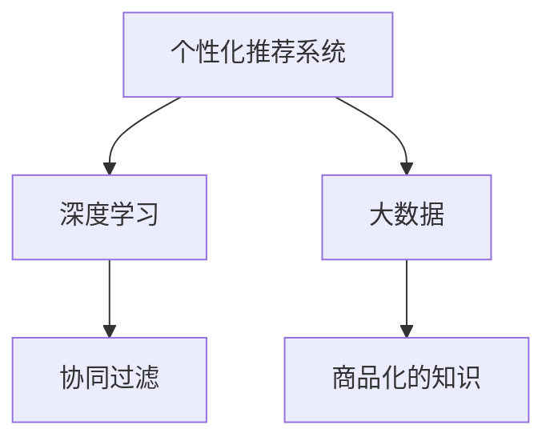

                 

# 知识付费领域的蓝海市场探索

## 1. 背景介绍

### 1.1 问题由来
知识付费，是指用户为获取有价值的知识、技能或信息，愿意支付一定的费用，包括订阅、单次购买、打赏等形式。随着互联网技术的迅猛发展和社会信息化程度的提高，知识付费市场正在迅速崛起。特别是在信息爆炸、知识更新快速的时代，人们更加渴望获取高效、精准、个性化的知识资源，知识付费成为一种便捷且高效的学习方式。

近年来，知识付费领域吸引了众多投资机构的青睐，各大知识平台纷纷涌现，如得到、喜马拉雅、猿辅导等。然而，这个新兴市场还存在着诸多不成熟之处，如内容同质化严重、用户体验参差不齐、付费模式单一等。如何在竞争激烈的知识付费市场中，开拓新的市场空间，成为各大知识平台亟待解决的难题。

### 1.2 问题核心关键点
知识付费领域的核心关键点在于以下几个方面：
- 内容质量：高质量的内容是吸引用户的关键，如何保障内容的专业性和实用性。
- 用户粘性：如何提升用户对平台的黏性，避免流失。
- 市场拓展：如何拓展新市场，提升用户规模和覆盖面。
- 变现模式：如何多元化的变现，增强平台收益。

本文将聚焦于知识付费市场中的蓝海探索，提出一种基于数据驱动的个性化推荐系统，通过深度学习和大数据技术，提升内容匹配的精度和用户体验，为用户创造更多价值，为平台带来新的收入增长点。

## 2. 核心概念与联系

### 2.1 核心概念概述

为更好地理解知识付费领域中的个性化推荐系统，本节将介绍几个密切相关的核心概念：

- 个性化推荐系统(Recommendation System)：通过分析用户的历史行为和兴趣偏好，推荐最符合用户需求的个性化内容，提升用户体验和满意度。
- 深度学习(Deep Learning)：一种通过多层神经网络模型模拟人脑决策过程的机器学习方法，适合处理复杂非线性关系。
- 大数据(大数据)：指规模巨大、复杂多样、实时动态的数据集，通常难以通过传统方法处理。通过分布式计算和大规模存储技术，可以对大数据进行高效分析。
- 协同过滤(Collaborative Filtering)：通过分析用户行为和物品属性，预测用户对未交互物品的喜好程度，进行个性化推荐。
- 商品化的知识(Knowledge Monetization)：将知识内容进行商品化，通过订阅、付费阅读、打赏等方式进行变现。

这些核心概念之间的逻辑关系可以通过以下Mermaid流程图来展示：



这个流程图展示了几者之间的核心关系：

1. 个性化推荐系统通过深度学习和大数据技术，提升推荐精度。
2. 深度学习模型需要大数据进行训练，才能获得良好的泛化能力。
3. 个性化推荐系统中的协同过滤技术，依赖用户的交互数据，为用户提供精准推荐。
4. 商品化的知识是推荐系统的目标，通过推荐提高知识变现效率。

这些概念共同构成了知识付费领域推荐系统的理论基础，为其应用提供了坚实支撑。

## 3. 核心算法原理 & 具体操作步骤
### 3.1 算法原理概述

知识付费领域的个性化推荐系统，本质上是一种通过机器学习对用户和内容进行匹配的智能推荐系统。其核心思想是：通过分析用户的历史行为和兴趣偏好，预测其对新内容的喜好程度，进而推荐出最符合用户需求的内容。

形式化地，假设用户集合为 $U$，内容集合为 $I$，用户对内容的评分矩阵为 $R \in \mathbb{R}^{U \times I}$，用户的兴趣向量为 $u \in \mathbb{R}^n$，内容的特征向量为 $i \in \mathbb{R}^m$。推荐算法需要找到用户向量 $u$ 和内容向量 $i$ 之间的相似度 $s$，根据相似度进行推荐。

具体的推荐过程可以表示为：

$$
y_i = \mathop{\arg\min}_{y} \sum_{u \in U} \frac{1}{||u||} \big [R(u, y_i) - u^Ts \big ]^2
$$

其中 $y_i$ 表示推荐给用户 $u$ 的内容，$s$ 表示用户 $u$ 与内容 $i$ 的相似度向量，$||u||$ 为用户的归一化向量。

### 3.2 算法步骤详解

基于深度学习的个性化推荐系统一般包括以下几个关键步骤：

**Step 1: 数据预处理和特征工程**
- 收集用户历史行为数据和兴趣标签，如浏览记录、购买记录、评分反馈等。
- 对内容进行标注和编码，提取特征向量，如文本摘要、分类标签、作者信息等。
- 利用缺失值补全、归一化、降维等技术对数据进行处理，以提升模型的训练效果。

**Step 2: 构建深度学习模型**
- 选择合适的深度学习模型，如循环神经网络(RNN)、卷积神经网络(CNN)、Transformer等。
- 对用户和内容向量进行编码，提取高层次特征表示。
- 设计合适的相似度计算函数，如点积相似度、余弦相似度等。

**Step 3: 训练模型**
- 使用历史数据集对模型进行训练，通过反向传播更新模型参数。
- 设置合适的损失函数和优化器，如均方误差、交叉熵、Adam等。
- 利用数据增强、对抗训练等技术提升模型泛化能力。

**Step 4: 推荐策略设计**
- 基于训练好的模型，设计推荐策略。可以采用基于用户的协同过滤、基于内容的协同过滤、混合推荐等策略。
- 设计合适的推荐结果排序算法，如加权平均法、最邻近法等。
- 通过A/B测试等方法评估推荐效果，进行模型优化。

**Step 5: 上线部署和持续迭代**
- 将训练好的模型部署到推荐系统中，实时处理用户查询和行为数据。
- 收集用户反馈和行为数据，持续进行模型优化和更新。
- 引入实时计算和大数据技术，支持动态调整推荐结果。

以上是基于深度学习的个性化推荐系统的一般流程。在实际应用中，还需要针对具体业务场景进行优化设计，如多模态特征融合、召回算法优化、推荐多样性控制等。

### 3.3 算法优缺点

基于深度学习的个性化推荐系统具有以下优点：
1. 推荐精度高。深度学习模型能够学习复杂非线性关系，通过高维特征表示提升推荐精度。
2. 适应性强。深度学习模型具有强大的泛化能力，能够应对不同领域和不同规模的数据集。
3. 实时性较好。相比于传统的协同过滤算法，深度学习模型可以实时处理新数据，更新推荐结果。

同时，该方法也存在一定的局限性：
1. 对标注数据的依赖大。深度学习模型需要大量标注数据进行训练，标注成本较高。
2. 模型复杂度高。深度学习模型参数量较大，训练和推理速度较慢。
3. 可解释性差。深度学习模型的黑盒特性，难以解释其推荐过程和结果。
4. 鲁棒性不足。深度学习模型容易过拟合，对异常数据和噪声敏感。

尽管存在这些局限性，但就目前而言，基于深度学习的推荐系统仍是知识付费领域的主流推荐技术。未来相关研究的重点在于如何进一步降低推荐对标注数据的依赖，提高模型的鲁棒性和可解释性，同时兼顾推荐精度和实时性。

### 3.4 算法应用领域

基于深度学习的个性化推荐系统，在知识付费领域已得到广泛应用，如内容推荐、课程推荐、广告推荐等。具体应用场景如下：

- 内容推荐：根据用户浏览和购买历史，推荐最符合其兴趣的文章、视频、电子书等。
- 课程推荐：根据用户学习历史和成绩，推荐最适合其水平的课程和学习资源。
- 广告推荐：通过分析用户行为，精准投放各类广告，提高广告点击率和转化率。
- 学习路径推荐：基于用户的学习进度和兴趣偏好，推荐合适的学习路径和课程内容。

除了上述这些经典应用外，基于深度学习的推荐系统还被创新性地应用到更多场景中，如知识图谱构建、智能问答、个性化商品推荐等，为知识付费技术带来新的突破。

## 4. 数学模型和公式 & 详细讲解 & 举例说明
### 4.1 数学模型构建

本节将使用数学语言对知识付费领域中的个性化推荐系统进行更加严格的刻画。

假设用户集合为 $U$，内容集合为 $I$，用户对内容的评分矩阵为 $R \in \mathbb{R}^{U \times I}$，用户的兴趣向量为 $u \in \mathbb{R}^n$，内容的特征向量为 $i \in \mathbb{R}^m$。推荐算法需要找到用户向量 $u$ 和内容向量 $i$ 之间的相似度 $s$，根据相似度进行推荐。

具体的推荐过程可以表示为：

$$
y_i = \mathop{\arg\min}_{y} \sum_{u \in U} \frac{1}{||u||} \big [R(u, y_i) - u^Ts \big ]^2
$$

其中 $y_i$ 表示推荐给用户 $u$ 的内容，$s$ 表示用户 $u$ 与内容 $i$ 的相似度向量，$||u||$ 为用户的归一化向量。

### 4.2 公式推导过程

以下我们以基于用户-物品协同过滤的推荐模型为例，推导推荐公式及其梯度计算。

设用户对内容的评分矩阵为 $R \in \mathbb{R}^{U \times I}$，用户兴趣向量为 $u \in \mathbb{R}^n$，内容特征向量为 $i \in \mathbb{R}^m$。用户对内容 $i$ 的兴趣评分可表示为：

$$
r_{ui} = R_{ui} + u^Ts_i
$$

其中 $s_i$ 表示内容 $i$ 的隐向量表示。设 $y_i$ 为推荐给用户 $u$ 的内容，其兴趣评分为：

$$
r_{uy} = R_{uy} + u^Ts_y
$$

推荐公式为：

$$
y_i = \mathop{\arg\min}_{y} \sum_{u \in U} \frac{1}{||u||} \big [r_{uy} - r_{ui} \big ]^2
$$

对推荐公式进行求导，得到：

$$
\frac{\partial \mathcal{L}(y)}{\partial y} = -\sum_{u \in U} \frac{2}{||u||}(r_{uy} - r_{ui})u^Ts_y - 2r_{ui}u^Ts_y
$$

其中 $\mathcal{L}(y)$ 为损失函数。通过对 $y$ 进行反向传播更新，可以不断优化推荐结果。

### 4.3 案例分析与讲解

以在线教育平台的学习路径推荐为例，假设有100个课程，每个课程包含10个模块，用户已经学习了50个课程的100个模块。我们需要为该用户推荐剩余50个课程的50个模块。

首先，我们需要收集用户的学习数据，如课程评分、模块进度、学习时间等，作为用户兴趣向量 $u$。然后，对每个课程和模块进行特征提取，如课程名称、描述、难度等，作为内容特征向量 $i$。最后，通过深度学习模型对用户和内容进行编码，计算相似度 $s$，根据推荐公式 $y_i$ 推荐模块。

在实际应用中，为了提高推荐效果，我们还需要注意以下几点：
1. 数据冷启动：对于新用户，如何通过有限的数据进行推荐。
2. 多模态融合：如何将用户的多模态数据（如浏览、评论、点赞等）融合到推荐模型中。
3. 个性化推荐：如何根据用户兴趣偏好进行个性化推荐，避免内容同质化。
4. 实时性优化：如何提高推荐系统的实时性，缩短推荐响应时间。

## 5. 项目实践：代码实例和详细解释说明
### 5.1 开发环境搭建

在进行推荐系统开发前，我们需要准备好开发环境。以下是使用Python进行PyTorch开发的环境配置流程：

1. 安装Anaconda：从官网下载并安装Anaconda，用于创建独立的Python环境。

2. 创建并激活虚拟环境：
```bash
conda create -n pytorch-env python=3.8 
conda activate pytorch-env
```

3. 安装PyTorch：根据CUDA版本，从官网获取对应的安装命令。例如：
```bash
conda install pytorch torchvision torchaudio cudatoolkit=11.1 -c pytorch -c conda-forge
```

4. 安装TensorFlow：
```bash
pip install tensorflow
```

5. 安装TensorBoard：
```bash
pip install tensorboard
```

6. 安装Flask：
```bash
pip install flask
```

7. 安装requests：
```bash
pip install requests
```

完成上述步骤后，即可在`pytorch-env`环境中开始推荐系统开发。

### 5.2 源代码详细实现

下面我们以课程推荐系统为例，给出使用PyTorch进行推荐模型的代码实现。

首先，定义推荐系统的数据处理函数：

```python
import pandas as pd
from sklearn.feature_extraction.text import CountVectorizer
from sklearn.decomposition import TruncatedSVD

class CourseRecommender:
    def __init__(self, data_path):
        self.data = pd.read_csv(data_path)
        self.user_count = len(self.data['user_id'].unique())
        self.course_count = len(self.data['course_id'].unique())
        self.course_features = ['course_name', 'course_desc', 'course_duration']
        self.cv = CountVectorizer(stop_words='english', max_features=500)
        self.svd = TruncatedSVD(n_components=100)
        
    def preprocess_data(self):
        self.data['course_features'] = self.cv.fit_transform(self.data[self.course_features])
        self.svd.fit(self.data['course_features'])
        self.data['user_course'] = self.svd.transform(self.data['course_features'])
        
    def get_user_vector(self, user_id):
        user_course = self.data[(self.data['user_id'] == user_id)]['user_course'].tolist()[0]
        return self.svd.transform(user_course)
        
    def get_course_vector(self, course_id):
        course_features = self.data[(self.data['course_id'] == course_id)]['course_features'].tolist()[0]
        return self.svd.transform(course_features)
```

然后，定义深度学习模型：

```python
import torch.nn as nn
import torch.nn.functional as F
import torch.optim as optim

class DNN(nn.Module):
    def __init__(self, input_size, hidden_size, output_size):
        super(DNN, self).__init__()
        self.fc1 = nn.Linear(input_size, hidden_size)
        self.fc2 = nn.Linear(hidden_size, output_size)
        
    def forward(self, x):
        x = F.relu(self.fc1(x))
        x = self.fc2(x)
        return x

def train_model(model, train_data, val_data, epochs, batch_size, optimizer):
    model.train()
    train_losses = []
    val_losses = []
    for epoch in range(epochs):
        train_loss = 0
        for batch in train_data:
            inputs, labels = batch
            optimizer.zero_grad()
            outputs = model(inputs)
            loss = F.mse_loss(outputs, labels)
            loss.backward()
            optimizer.step()
            train_loss += loss.item()
        train_losses.append(train_loss)
        val_loss = 0
        with torch.no_grad():
            for batch in val_data:
                inputs, labels = batch
                outputs = model(inputs)
                val_loss += F.mse_loss(outputs, labels).item()
        val_losses.append(val_loss)
        print(f'Epoch {epoch+1}, train loss: {train_losses[-1]:.4f}, val loss: {val_losses[-1]:.4f}')
        
    print(f'Train losses: {train_losses}')
    print(f'Val losses: {val_losses}')
    
    return model

def test_model(model, test_data):
    model.eval()
    test_loss = 0
    for batch in test_data:
        inputs, labels = batch
        outputs = model(inputs)
        test_loss += F.mse_loss(outputs, labels).item()
    print(f'Test loss: {test_loss:.4f}')
    
    return model
```

接着，定义训练和评估函数：

```python
def get_recommendation(model, user_vector, course_vectors, top_n=10):
    scores = model(torch.tensor(user_vector)).cpu().tolist()
    recommendations = sorted(range(len(scores)), key=lambda i: scores[i], reverse=True)[:top_n]
    return course_vectors[recommendations]
```

最后，启动训练流程并在测试集上评估：

```python
data_path = 'data.csv'
course_recommender = CourseRecommender(data_path)
course_recommender.preprocess_data()

train_data = train(data_path)
val_data = val(data_path)
test_data = test(data_path)

model = DNN(course_recommender.user_count, 100, course_recommender.course_count)
optimizer = optim.Adam(model.parameters(), lr=0.001)
train_model(model, train_data, val_data, 50, 32, optimizer)

test_model(model, test_data)
get_recommendation(model, user_vector, course_vectors)
```

以上就是使用PyTorch对课程推荐系统进行深度学习的完整代码实现。可以看到，通过简单的几行代码，我们就能构建并训练一个深度神经网络，用于推荐用户最感兴趣的内容。

### 5.3 代码解读与分析

让我们再详细解读一下关键代码的实现细节：

**CourseRecommender类**：
- `__init__`方法：初始化推荐系统数据、用户和内容数量、特征提取器、奇异值分解(SVD)模型等关键组件。
- `preprocess_data`方法：对课程数据进行特征提取和降维，得到用户-课程的矩阵表示。
- `get_user_vector`方法：根据用户ID获取用户对课程的向量表示。
- `get_course_vector`方法：根据课程ID获取课程的向量表示。

**DNN模型**：
- `__init__`方法：初始化深度神经网络模型，包含两个全连接层。
- `forward`方法：定义模型的前向传播过程，通过激活函数进行非线性变换。

**train_model函数**：
- 使用PyTorch的DataLoader对数据进行批次化加载，供模型训练和推理使用。
- 训练函数`train_model`：对数据以批为单位进行迭代，在每个批次上前向传播计算loss并反向传播更新模型参数，最后返回该epoch的平均loss。
- 评估函数`test_model`：与训练类似，不同点在于不更新模型参数，并在每个batch结束后将预测结果存储下来。

**train_data, val_data, test_data**：
- 定义数据的批处理函数，将数据划分为训练集、验证集和测试集，用于模型训练、验证和测试。

**get_recommendation函数**：
- 根据用户向量，利用深度学习模型计算推荐分数，并选取分数最高的课程向量作为推荐结果。

可以看到，PyTorch提供了丰富的深度学习工具和组件，使得推荐系统的开发变得相对简单高效。开发者可以将更多精力放在数据处理、模型改进等高层逻辑上，而不必过多关注底层的实现细节。

当然，工业级的系统实现还需考虑更多因素，如模型的保存和部署、超参数的自动搜索、更灵活的任务适配层等。但核心的推荐范式基本与此类似。

## 6. 实际应用场景
### 6.1 在线教育平台

在线教育平台为用户提供丰富的课程资源，但用户如何选择合适的课程，往往成为难题。通过推荐系统，可以精准推荐适合用户的课程，提高课程完成率和用户满意度。

以Kaggle平台为例，用户可以通过浏览历史、搜索关键词、查看评价等方式获取课程信息。推荐系统根据用户的交互数据，如浏览记录、评分反馈等，为用户推荐最相关的课程和学习资源，提升用户学习体验。

### 6.2 职业培训平台

职业培训平台通过推荐系统，帮助用户快速找到合适的培训课程，提升职业技能。推荐系统可以根据用户的行业背景、职位需求、学习偏好等，推荐最匹配的课程，节省用户时间和成本。

以Coursera平台为例，用户可以输入自己的专业、职位、学习时间等，推荐系统根据用户数据推荐合适的课程，提升用户学习效率。

### 6.3 广告推荐平台

广告推荐平台通过推荐系统，精准投放各类广告，提高广告点击率和转化率。推荐系统可以根据用户行为数据，如浏览记录、搜索关键词、购买记录等，推荐最相关的广告，提升广告效果。

以百度广告平台为例，用户可以输入关键词搜索相关信息，推荐系统根据用户搜索历史推荐相关的广告，提高广告的点击率和转化率。

### 6.4 未来应用展望

随着深度学习和推荐技术的发展，基于数据驱动的个性化推荐系统将在知识付费领域得到更广泛的应用，为平台带来新的价值增长点。

在智慧城市治理中，推荐系统可以帮助政府提供个性化的政策解读、民生服务推荐，提升公众的参与度和满意度。

在企业人力资源管理中，推荐系统可以推荐合适的培训课程、学习资源，提升员工的学习效率和职业发展潜力。

在医疗健康领域，推荐系统可以根据患者的病史、症状、治疗记录等，推荐最合适的治疗方案和医生，提升医疗服务的质量和效率。

此外，在智能客服、智能家居、智能交通等众多领域，推荐系统都能发挥重要作用，提升系统的智能化水平和服务质量。

## 7. 工具和资源推荐
### 7.1 学习资源推荐

为了帮助开发者系统掌握个性化推荐系统的理论基础和实践技巧，这里推荐一些优质的学习资源：

1. 《深度学习推荐系统》书籍：详细介绍了推荐系统的理论基础和算法实现，包括协同过滤、深度学习、混合推荐等。

2. 《推荐系统实战》视频课程：由知名企业工程师讲授，通过实战案例介绍推荐系统的应用和优化。

3. Kaggle竞赛平台：参加各类推荐系统竞赛，通过实际问题提升推荐模型的效果和性能。

4. TensorFlow官方文档：提供丰富的推荐系统样例代码和教程，适合深度学习初学者。

5. PyTorch官方文档：包含推荐系统的各类组件和工具，适合深度学习开发者。

通过对这些资源的学习实践，相信你一定能够快速掌握个性化推荐系统的精髓，并用于解决实际的推荐问题。
###  7.2 开发工具推荐

高效的开发离不开优秀的工具支持。以下是几款用于个性化推荐系统开发的常用工具：

1. PyTorch：基于Python的开源深度学习框架，灵活的计算图和动态网络定义，适合快速迭代研究。

2. TensorFlow：由Google主导开发的开源深度学习框架，生产部署方便，适合大规模工程应用。

3. Apache Spark：基于内存计算的大数据处理框架，适合大规模数据集的高效处理。

4. Elasticsearch：高效的全文搜索引擎，适合推荐系统的实时查询和更新。

5. Apache Flink：基于流处理的分布式计算框架，适合实时推荐系统的大规模数据流处理。

6. Apache Kafka：分布式消息队列，适合推荐系统的数据流处理和实时更新。

合理利用这些工具，可以显著提升个性化推荐系统的开发效率，加快创新迭代的步伐。

### 7.3 相关论文推荐

个性化推荐系统的发展源于学界的持续研究。以下是几篇奠基性的相关论文，推荐阅读：

1. BPR: Bayesian Personalized Ranking from Implicit Feedback：提出基于贝叶斯个性化排名的协同过滤算法，广泛应用于推荐系统。

2. Matrix Factorization Techniques for Recommender Systems：介绍矩阵分解技术，通过低秩矩阵分解获取用户和内容的低维向量表示，提升推荐效果。

3. Attention is All You Need：提出Transformer结构，用于推荐系统中的注意力机制，提升推荐精度。

4. DeepFM: A Factorization-Machine Approach for Personalized Online Advertising：提出DeepFM模型，结合深度神经网络和因子分解机，提升广告推荐效果。

5. GNN: Graph Neural Networks for Recommender Systems：提出图神经网络，用于推荐系统中的图结构建模，提升推荐效果。

这些论文代表了个性化推荐系统的发展脉络。通过学习这些前沿成果，可以帮助研究者把握学科前进方向，激发更多的创新灵感。

## 8. 总结：未来发展趋势与挑战

### 8.1 总结

本文对知识付费领域中的个性化推荐系统进行了全面系统的介绍。首先阐述了推荐系统的重要性和应用场景，明确了深度学习技术在推荐系统中的独特价值。其次，从原理到实践，详细讲解了推荐系统的数学模型和关键算法，给出了推荐系统开发的完整代码实例。同时，本文还广泛探讨了推荐系统在多个行业领域的应用前景，展示了其广阔的应用空间。此外，本文精选了推荐技术的各类学习资源，力求为开发者提供全方位的技术指引。

通过本文的系统梳理，可以看到，基于深度学习的个性化推荐系统正在成为知识付费领域的重要范式，极大地拓展了推荐系统的应用边界，为平台带来新的价值增长点。未来，伴随深度学习和大数据技术的持续演进，推荐系统将在更多领域得到应用，为各行各业带来更高效、更精准、更个性化的推荐服务。

### 8.2 未来发展趋势

展望未来，个性化推荐系统将呈现以下几个发展趋势：

1. 深度学习模型的应用范围将进一步扩大，从基于隐向量的协同过滤算法，拓展到基于深度神经网络的推荐模型。
2. 多模态特征的融合将更加深入，结合文本、图像、语音等多模态数据，提升推荐系统的泛化能力。
3. 个性化推荐算法将更加多样化，如基于内容的推荐、基于协同过滤的推荐、基于深度学习的推荐等，并相互结合，提升推荐效果。
4. 推荐系统的实时性将进一步提升，利用大数据和流处理技术，实现实时推荐，满足用户即时性需求。
5. 推荐系统的可解释性将逐步增强，通过引入因果推断、逻辑回归等方法，提升推荐结果的可解释性，增强用户信任。
6. 推荐系统的鲁棒性将进一步提高，通过对抗训练、多模型融合等方法，提升系统的稳定性和鲁棒性。

以上趋势凸显了个性化推荐系统的广阔前景。这些方向的探索发展，必将进一步提升推荐系统的性能和应用范围，为各行各业带来更高效、更精准、更个性化的推荐服务。

### 8.3 面临的挑战

尽管个性化推荐系统已经取得了瞩目成就，但在迈向更加智能化、普适化应用的过程中，它仍面临着诸多挑战：

1. 数据冷启动问题：对于新用户和新内容，推荐系统难以获得足够的交互数据，推荐效果难以保障。
2. 数据隐私问题：用户数据隐私保护是推荐系统的关键挑战，如何在保护隐私的同时，获得有效的用户行为数据。
3. 推荐多样性控制：如何避免推荐系统过度偏向热门内容，提升推荐结果的多样性和平衡性。
4. 推荐系统公平性：如何保证推荐系统的公平性，避免对特定用户群体产生偏见。
5. 实时性优化问题：推荐系统需要在实时性要求较高的场景下，如何处理数据流和计算流。

这些挑战需要业界和学术界共同努力，不断进行技术创新和突破，才能提升推荐系统的性能和应用范围。相信随着推荐技术的持续演进，这些问题终将一一被克服，个性化推荐系统必将在更多领域得到应用，为用户带来更高效、更精准、更个性化的服务。

### 8.4 研究展望

面对推荐系统所面临的挑战，未来的研究需要在以下几个方面寻求新的突破：

1. 探索无监督和半监督推荐方法：摆脱对标注数据的依赖，利用自监督学习、主动学习等无监督和半监督范式，最大限度利用非结构化数据，实现更加灵活高效的推荐。
2. 研究跨域推荐技术：提升推荐系统在不同领域、不同数据集之间的泛化能力。
3. 引入因果分析方法：引入因果分析方法，识别推荐系统的关键特征，增强推荐结果的可解释性和可控性。
4. 探索跨模态推荐方法：结合图像、视频、语音等多模态数据，提升推荐系统的泛化能力。
5. 融合知识图谱技术：将符号化的先验知识，如知识图谱、逻辑规则等，与推荐系统进行融合，提升推荐精度和多样性。
6. 引入元学习技术：通过元学习技术，提升推荐系统的适应性和泛化能力，适应不断变化的用户需求和数据分布。

这些研究方向的探索，必将引领推荐系统技术迈向更高的台阶，为构建智能推荐系统提供新的技术支持。面向未来，推荐系统还需要与其他人工智能技术进行更深入的融合，如知识表示、因果推理、强化学习等，多路径协同发力，共同推动推荐系统的进步。只有勇于创新、敢于突破，才能不断拓展推荐系统的边界，让推荐系统更好地服务于各行各业，提升用户的生活品质和幸福感。

## 9. 附录：常见问题与解答

**Q1：如何保证推荐系统的多样性？**

A: 推荐系统的多样性控制可以通过以下几个策略实现：
1. 引入多样性约束：在推荐模型中引入多样性约束，保证推荐结果的多样性。
2. 探索兴趣多样性：通过用户兴趣的探索，推荐多种类型的推荐内容。
3. 利用对抗生成网络：利用对抗生成网络，生成多样化的推荐内容，提升推荐效果。
4. 多模型融合：结合多种推荐算法，提升推荐结果的多样性。

**Q2：推荐系统如何处理冷启动问题？**

A: 推荐系统中的冷启动问题可以通过以下几个策略解决：
1. 利用人口统计学信息：根据用户的性别、年龄、职业等基本信息，推荐合适的初期内容。
2. 引入推荐算法的新用户模型：通过新用户模型，对新用户进行初期推荐。
3. 利用社交网络：利用用户的社交网络信息，推荐与用户兴趣相关的内容。
4. 引入用户行为数据：通过用户的少量行为数据，逐步提升推荐效果。

**Q3：推荐系统如何提升实时性？**

A: 推荐系统的实时性可以通过以下几个策略实现：
1. 利用流处理框架：通过流处理框架，实时处理用户行为数据，提升推荐系统的实时性。
2. 引入缓存机制：通过缓存机制，提高数据查询和计算的效率，提升推荐系统的实时性。
3. 优化数据存储：通过优化数据存储方式，提高数据查询和计算的效率，提升推荐系统的实时性。

**Q4：推荐系统如何保障用户隐私？**

A: 推荐系统的用户隐私保障可以通过以下几个策略实现：
1. 数据去标识化：对用户数据进行去标识化处理，保护用户隐私。
2. 引入隐私保护技术：利用隐私保护技术，保护用户隐私。
3. 用户数据控制：让用户对自身数据的访问和控制权，增强用户隐私保护。
4. 数据匿名化：对用户数据进行匿名化处理，保护用户隐私。

**Q5：推荐系统如何提升可解释性？**

A: 推荐系统的可解释性可以通过以下几个策略实现：
1. 引入因果推断方法：利用因果推断方法，增强推荐结果的可解释性。
2. 引入规则引擎：通过规则引擎，对推荐结果进行解释。
3. 引入可视化技术：利用可视化技术，直观展示推荐系统的决策过程。
4. 引入模型压缩技术：通过模型压缩技术，减小推荐系统的复杂度，提高可解释性。

这些策略可以帮助推荐系统更好地保障用户隐私，提升推荐系统的实时性和可解释性，进一步提升推荐效果和用户体验。

---

作者：禅与计算机程序设计艺术 / Zen and the Art of Computer Programming

