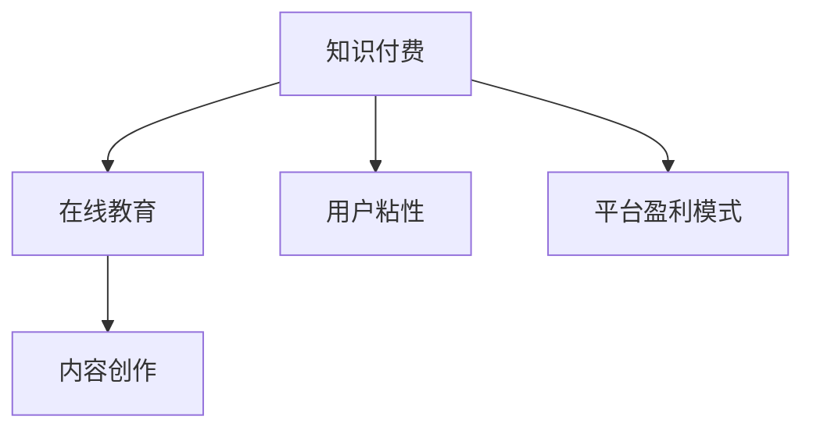
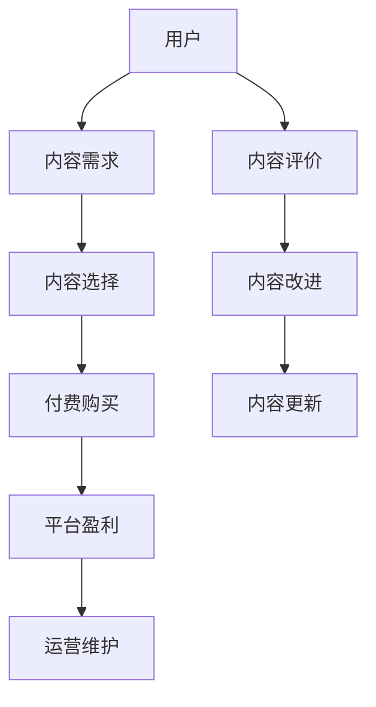

                 

# 知识经济时代下的知识付费创新商业模式运营

> 关键词：知识付费, 创新商业模式, 在线教育, 人工智能, 用户需求, 数据分析

## 1. 背景介绍

在知识经济时代，知识的价值越来越被重视。特别是在在线教育、企业培训等领域，高质量的知识内容需求旺盛，传统的免费模式难以满足市场需求，知识付费应运而生。然而，知识付费行业面临诸多挑战，如内容质量参差不齐、用户黏性不高、平台盈利模式单一等。本文将深入探讨知识付费的商业模式，分析其面临的挑战，并提出创新的运营策略，以期推动知识付费行业的健康发展。

## 2. 核心概念与联系

### 2.1 核心概念概述

知识付费商业模式是指通过在线平台提供优质知识内容，用户支付费用以获取特定信息或服务的商业运作方式。核心概念包括：

- 知识付费：以知识为主题的付费服务，形式包括在线课程、视频讲座、电子书等。
- 在线教育：基于互联网的教育模式，突破了时间和空间的限制。
- 内容创作：知识付费平台的核心竞争力，需要吸引优秀的知识创作者。
- 用户粘性：提升用户使用平台的频率和活跃度。
- 平台盈利模式：如订阅制、单次购买、课程定制等。

这些概念通过以下Mermaid流程图呈现它们之间的关系：



### 2.2 核心概念原理和架构的 Mermaid 流程图



## 3. 核心算法原理 & 具体操作步骤

### 3.1 算法原理概述

知识付费平台的运营依赖于一套复杂的算法和系统架构，旨在实现内容的精准推荐、用户行为的预测、平台的流量控制和盈利模式的优化。核心算法包括：

- 推荐系统：根据用户行为和偏好推荐个性化内容。
- 预测模型：预测用户未来行为，优化运营策略。
- 流量控制：通过算法调节平台流量，避免过载或资源浪费。
- 盈利模型：分析用户支付行为，优化定价策略。

### 3.2 算法步骤详解

1. **推荐系统设计**：
   - 数据收集：收集用户行为数据，如观看时长、评分、评论等。
   - 特征提取：提取用户和内容的关键特征，如兴趣标签、内容难度、评分等。
   - 算法选择：选择合适的推荐算法，如协同过滤、基于内容的推荐、矩阵分解等。
   - 模型训练：使用历史数据训练推荐模型，实现内容推荐。

2. **预测模型设计**：
   - 数据预处理：清洗和处理用户行为数据。
   - 特征工程：设计用户和内容的特征，如观看时间、购买频率等。
   - 模型选择：选择适合的预测模型，如线性回归、随机森林、梯度提升等。
   - 模型评估：使用交叉验证等方法评估模型性能，优化模型参数。

3. **流量控制优化**：
   - 数据收集：监控平台流量数据。
   - 流量分析：分析流量来源、波动原因等。
   - 策略调整：根据流量数据，调整推荐策略、广告投放等。
   - 效果评估：评估策略调整的效果，持续优化。

4. **盈利模型设计**：
   - 数据收集：收集用户支付数据。
   - 特征提取：提取影响用户支付的关键特征，如课程评分、购买历史等。
   - 模型选择：选择适合盈利模型的算法，如回归分析、决策树等。
   - 模型评估：评估盈利模型效果，优化定价策略。

### 3.3 算法优缺点

知识付费平台的推荐系统具有以下优点：
- 个性化推荐：通过算法精准推荐用户感兴趣的内容，提升用户粘性。
- 动态调整：实时分析用户行为，动态调整推荐策略，提升用户体验。
- 数据驱动：基于大数据分析，提供更科学的内容推荐方案。

但同时，推荐系统也存在以下缺点：
- 数据隐私：用户行为数据的收集和使用可能涉及隐私问题。
- 模型过拟合：推荐系统可能过度拟合，推荐内容过于同质化。
- 用户多样性：用户行为数据的多样性可能导致推荐算法的效果不均衡。

### 3.4 算法应用领域

知识付费平台的应用领域广泛，涵盖在线教育、企业培训、职业认证等多个领域。不同领域面临不同的运营挑战，需要针对性地优化推荐算法和盈利模型。例如：

- 在线教育：提升课程质量、个性化推荐、用户学习路径优化。
- 企业培训：课程内容定制、员工技能提升、企业内部知识共享。
- 职业认证：考试题库推荐、学习路径规划、学习进度跟踪。

## 4. 数学模型和公式 & 详细讲解 & 举例说明

### 4.1 数学模型构建

知识付费平台的推荐系统可以基于协同过滤、矩阵分解、深度学习等方法构建数学模型。以协同过滤为例，其基本数学模型如下：

设用户集合为 $U$，物品集合为 $I$，用户对物品的评分矩阵为 $R$。用户 $u$ 对物品 $i$ 的评分表示为 $R_{ui}$。协同过滤的推荐模型可以表示为：

$$
\hat{R}_{ui} = \sum_{i' \in I} \alpha_{iu} \alpha_{iu'} R_{iu'}
$$

其中，$\alpha_{iu}$ 和 $\alpha_{iu'}$ 分别是用户 $u$ 和物品 $i'$ 的隐向量。

### 4.2 公式推导过程

协同过滤的推荐公式可以通过矩阵分解推导得到。设用户和物品的隐向量分别为 $u$ 和 $v$，则：

$$
R_{ui} = u^T v_i
$$

对于用户 $u$，其对物品 $i$ 的评分可以表示为：

$$
\hat{R}_{ui} = u^T A_i v
$$

其中，$A_i$ 为物品 $i$ 的隐向量，$v$ 为物品向量空间中的单位向量。

### 4.3 案例分析与讲解

假设某知识付费平台有 $M$ 个用户和 $N$ 个课程，用户对课程的评分矩阵为 $R$。我们可以使用协同过滤算法，根据用户历史评分数据，推荐用户可能感兴趣的课程。具体步骤如下：

1. 计算用户和课程的隐向量 $u$ 和 $v_i$。
2. 对所有课程 $i$ 计算 $\hat{R}_{ui}$，即预测用户 $u$ 对课程 $i$ 的评分。
3. 根据预测评分排序，推荐评分最高的课程给用户。

## 5. 项目实践：代码实例和详细解释说明

### 5.1 开发环境搭建

1. 安装Python：
   ```
   sudo apt-get install python3 python3-pip
   ```

2. 安装必要的库：
   ```
   pip install pandas numpy scikit-learn pyodbc
   ```

3. 搭建数据库：
   ```
   pip install mysql-connector-python
   ```

### 5.2 源代码详细实现

以下是一个简单的协同过滤推荐系统实现示例：

```python
import pandas as pd
import numpy as np
from scipy.spatial.distance import cosine

# 读取评分矩阵
df = pd.read_csv('ratings.csv')

# 构建用户-物品评分矩阵
R = df.pivot_table(index='user_id', columns='item_id', values='rating').fillna(0)

# 计算用户和物品的隐向量
def calculate_vectors(R):
    U, S, V = np.linalg.svd(R, full_matrices=False)
    return U, V

U, V = calculate_vectors(R)

# 计算预测评分
def predict_score(U, V, item_ids):
    scores = []
    for item_id in item_ids:
        scores.append(np.dot(U, V[item_id]))
    return scores

# 推荐课程
def recommend_courses(user_id, top_n=10):
    user_vector = U[user_id]
    item_vectors = V.values
    item_ids = list(range(item_vectors.shape[0]))
    scores = predict_score(user_vector, item_vectors, item_ids)
    recommended_courses = np.argsort(-scores)[1:top_n+1]
    return recommended_courses

# 测试推荐系统
recommend_courses(1)
```

### 5.3 代码解读与分析

在上述代码中，我们首先读取用户和物品的评分矩阵，构建用户-物品评分矩阵 $R$。接着，使用奇异值分解(SVD)计算用户和物品的隐向量 $U$ 和 $V$。然后，定义函数 `predict_score` 计算用户对课程的预测评分。最后，定义函数 `recommend_courses` 根据预测评分，推荐用户可能感兴趣的课程。

## 6. 实际应用场景

### 6.1 在线教育

在线教育是知识付费平台的主要应用场景之一。平台通过收集学生的学习行为数据，利用推荐系统推荐适合学生的课程，提高学习效果。例如，某在线教育平台通过分析学生的学习路径和成绩，推荐适合学生的高级课程，帮助学生更好地掌握知识。

### 6.2 企业培训

企业培训平台需要根据员工的职业发展需求，推荐适合员工的培训课程，提升员工技能。例如，某公司通过分析员工的工作表现和学习行为，推荐适合的培训课程，提升员工技能和职业发展。

### 6.3 职业认证

职业认证平台需要根据学员的学习进度和掌握程度，推荐适合的题库和课程，帮助学员通过考试。例如，某职业认证平台通过分析学员的学习进度和错误率，推荐适合的题库和课程，帮助学员通过考试。

## 7. 工具和资源推荐

### 7.1 学习资源推荐

1. 《推荐系统实战》：介绍推荐系统的基本概念和实现方法。
2. 《机器学习实战》：介绍机器学习的基本概念和实现方法。
3. 《深度学习》：介绍深度学习的基本概念和实现方法。
4. 《Python数据分析》：介绍数据分析的基本概念和实现方法。

### 7.2 开发工具推荐

1. PyTorch：基于Python的深度学习框架，适合快速迭代研究。
2. TensorFlow：由Google主导开发的深度学习框架，适合大规模工程应用。
3. Scikit-learn：基于Python的机器学习库，适合快速实现算法模型。
4. Jupyter Notebook：在线编辑器，适合交互式学习和数据分析。

### 7.3 相关论文推荐

1. "Collaborative Filtering for Recommender Systems"：介绍协同过滤算法的理论基础和实现方法。
2. "Trust-Based Recommender Systems"：介绍基于信任的推荐算法。
3. "Deep Learning for Recommender Systems"：介绍深度学习在推荐系统中的应用。

## 8. 总结：未来发展趋势与挑战

### 8.1 研究成果总结

本文详细介绍了知识付费平台的推荐系统，包括协同过滤、预测模型、流量控制和盈利模型的基本原理和操作步骤。通过分析这些核心算法，提出了创新的运营策略，以期推动知识付费行业的健康发展。

### 8.2 未来发展趋势

未来，知识付费平台的发展趋势包括：

1. 数据驱动：更多利用大数据分析，提升推荐系统的精准度。
2. 个性化推荐：通过更复杂算法，实现更精准的用户推荐。
3. 多模态融合：结合图像、语音等多模态数据，提供更全面的推荐服务。
4. 跨平台协同：通过平台间的数据共享和合作，提升推荐效果。

### 8.3 面临的挑战

知识付费平台面临的挑战包括：

1. 数据隐私：用户数据的收集和使用可能涉及隐私问题。
2. 算法复杂性：复杂算法的实现和优化需要大量时间和资源。
3. 模型鲁棒性：推荐系统可能存在模型过拟合等问题。
4. 用户多样性：用户行为数据的多样性可能导致推荐算法的效果不均衡。

### 8.4 研究展望

未来，知识付费平台的研究展望包括：

1. 数据隐私保护：探索数据隐私保护技术，确保用户数据的安全。
2. 模型鲁棒性增强：提升推荐模型的鲁棒性，避免过拟合等问题。
3. 用户需求分析：深入分析用户需求，提供更精准的内容推荐。
4. 跨平台协同：通过平台间的数据共享和合作，提升推荐效果。

## 9. 附录：常见问题与解答

**Q1：知识付费平台如何保证内容质量？**

A: 平台通过邀请专家、激励优质内容创作者等方式，保证内容质量。同时，用户可以对内容进行评价和反馈，帮助平台筛选高质量内容。

**Q2：知识付费平台如何提升用户粘性？**

A: 平台可以通过个性化推荐、互动问答、社交功能等方式，提升用户粘性。例如，某平台通过个性化推荐课程，帮助用户快速找到感兴趣的内容。

**Q3：知识付费平台如何优化盈利模式？**

A: 平台可以通过单次购买、订阅制、课程定制等方式，优化盈利模式。例如，某平台通过订阅制，锁定用户的长期付费，提升平台的收益。

**Q4：知识付费平台如何处理用户数据隐私？**

A: 平台需要严格遵守数据隐私保护法规，确保用户数据的安全。例如，某平台通过数据加密和匿名化处理，保护用户隐私。

**Q5：知识付费平台如何应对算法复杂性？**

A: 平台可以通过简化算法模型、优化算法参数等方式，应对算法复杂性。例如，某平台通过优化协同过滤算法的参数，提升推荐效果。

---

作者：禅与计算机程序设计艺术 / Zen and the Art of Computer Programming

