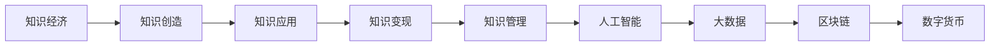

                 

# 知识经济时代的致富之道：知识变现

> 关键词：知识经济, 知识变现, 知识管理, 人工智能, 大数据, 区块链, 数字货币

## 1. 背景介绍

在信息时代，知识的价值不断凸显。随着互联网、物联网、大数据、人工智能等技术的迅猛发展，知识已经成为驱动经济增长、社会进步的关键因素。面对日益增长的知识海洋，如何高效地创造、存储、传播和利用知识，成为全社会共同关注的问题。特别是面对传统产业的数字化转型升级，通过知识变现创造财富的路径变得尤为重要。

本博文将深入探讨在知识经济时代，如何利用最新的人工智能和大数据技术，实现知识变现，助力个人和企业向数字化、智能化转型，并在新的经济形态中占得先机。

## 2. 核心概念与联系

### 2.1 核心概念概述

1. **知识经济**：以知识为关键生产要素，通过知识的创造、存储、传播和应用，驱动经济增长的经济形态。
2. **知识变现**：将知识转化为实际的经济价值，如资金、声誉、影响力等，促进个人和企业的收益增长。
3. **知识管理**：系统化地组织、存储、检索和应用知识，以支持企业决策、提高工作效率。
4. **人工智能**：模拟人脑的智能活动，通过算法和大数据技术，提升知识的创造和应用能力。
5. **大数据**：收集、存储和分析海量数据，从中提取知识，优化决策过程。
6. **区块链**：分布式账本技术，确保知识交易的安全透明，推动知识共享和信任机制。
7. **数字货币**：基于区块链技术的虚拟货币，为知识交易提供便捷的支付手段。

这些概念之间的联系在于：知识经济的核心是通过知识的创造和应用推动经济增长；而知识变现则是将知识转化为经济价值的过程；知识管理为知识变现提供系统支持；人工智能和大数据技术为知识创造和应用提供了技术手段；区块链和数字货币则为知识交易提供了信任和安全保障。

### 2.2 核心概念原理和架构的 Mermaid 流程图



## 3. 核心算法原理 & 具体操作步骤

### 3.1 算法原理概述

知识变现的过程，可以通过以下核心算法和操作步骤来实现：

1. **数据收集与清洗**：从各类数据源（如互联网、社交媒体、企业内部系统等）收集数据，并进行去重、格式化等清洗操作。
2. **知识提取与表示**：通过自然语言处理、图像识别等技术，从清洗后的数据中提取知识，并将其表示为结构化的形式，如知识图谱、语义向量等。
3. **知识推理与学习**：利用机器学习算法，对知识进行推理学习，发现知识之间的关联和规律。
4. **知识应用与变现**：将学习到的知识应用于决策支持、产品推荐、服务优化等场景，实现知识变现。
5. **知识管理与维护**：通过知识管理系统，对知识进行分类、存储、检索和更新，保障知识的长期可用性和可靠性。

### 3.2 算法步骤详解

#### 3.2.1 数据收集与清洗

数据收集与清洗是知识变现的第一步，主要包括以下几个步骤：

1. **数据源选择**：选择合适的数据源，如新闻网站、社交媒体、企业内部系统等。
2. **数据采集**：使用网络爬虫、API接口等方式采集数据，确保数据的全面性和时效性。
3. **数据清洗**：对采集的数据进行去重、去噪、格式化等处理，确保数据的质量和一致性。
4. **数据存储**：将清洗后的数据存储在数据库或数据湖中，便于后续处理和应用。

#### 3.2.2 知识提取与表示

知识提取与表示是将数据转化为知识的关键步骤，主要包括以下几个子步骤：

1. **自然语言处理**：使用NLP技术，如分词、词性标注、实体识别等，将文本数据转化为结构化的知识信息。
2. **图像识别**：使用图像处理技术，如图像分割、特征提取等，将图像数据转化为结构化的知识信息。
3. **知识图谱构建**：将提取的知识信息构建为知识图谱，形成实体节点和关系边的结构化表示。
4. **语义向量表示**：将知识信息转化为语义向量，方便机器学习算法进行处理和推理。

#### 3.2.3 知识推理与学习

知识推理与学习是知识变现的核心步骤，主要包括以下几个子步骤：

1. **知识图谱推理**：使用图神经网络等技术，对知识图谱进行推理，发现实体之间的关系和规律。
2. **机器学习训练**：使用机器学习算法，如深度学习、集成学习等，对知识进行学习，提取知识特征。
3. **知识表示学习**：使用神经网络等技术，对知识进行表示学习，形成低维度的语义向量。
4. **知识迁移学习**：利用迁移学习技术，将知识从一项任务迁移到另一项任务，提高知识泛化能力。

#### 3.2.4 知识应用与变现

知识应用与变现是将知识转化为经济价值的关键步骤，主要包括以下几个子步骤：

1. **决策支持**：使用知识图谱和机器学习模型，进行决策支持，优化业务流程和运营管理。
2. **产品推荐**：使用知识图谱和语义向量表示，进行产品推荐，提升用户体验和满意度。
3. **服务优化**：使用知识图谱和机器学习模型，进行服务优化，提高服务质量和效率。
4. **智能客服**：使用知识图谱和自然语言处理技术，进行智能客服，提升客户体验和满意度。

#### 3.2.5 知识管理与维护

知识管理与维护是保障知识长期可用和可靠的关键步骤，主要包括以下几个子步骤：

1. **知识分类**：对知识进行分类，形成知识目录，方便检索和应用。
2. **知识存储**：将知识存储在知识库中，支持高效检索和应用。
3. **知识检索**：使用检索技术，如倒排索引、向量检索等，快速找到需要的知识。
4. **知识更新**：定期更新知识库，确保知识的实时性和准确性。

### 3.3 算法优缺点

#### 3.3.1 算法优点

1. **数据利用率高**：通过大数据技术，能够高效地收集和清洗海量数据，充分利用数据中的知识。
2. **知识表示灵活**：通过知识图谱和语义向量表示，能够灵活地表示各种类型的知识，方便机器学习处理。
3. **应用场景广泛**：知识变现可以应用于决策支持、产品推荐、服务优化等多个场景，推动业务创新。
4. **安全性高**：通过区块链技术，确保知识交易的安全透明，避免知识被滥用或泄露。
5. **变现能力强**：通过智能客服、智能推荐等技术，能够大幅提升用户体验和满意度，实现知识变现。

#### 3.3.2 算法缺点

1. **数据源选择困难**：高质量的数据源选择和采集需要耗费大量时间和资源。
2. **知识提取复杂**：知识提取和表示需要高级技术，开发和维护成本较高。
3. **知识推理复杂**：知识推理和机器学习需要复杂算法，开发和维护难度较大。
4. **知识更新困难**：知识库的更新和维护需要持续的投入，成本较高。
5. **知识应用复杂**：知识应用需要结合具体业务场景，开发和维护难度较大。

### 3.4 算法应用领域

#### 3.4.1 金融领域

知识变现在金融领域具有重要应用价值，主要包括以下几个方面：

1. **风险评估**：利用知识图谱和机器学习，对金融产品进行风险评估，优化风险管理。
2. **投资决策**：利用知识图谱和语义向量表示，进行投资决策，提升投资收益。
3. **智能投顾**：利用自然语言处理和知识图谱，进行智能投顾，提升客户体验和满意度。
4. **金融咨询**：利用知识图谱和机器学习，提供金融咨询，优化客户服务。

#### 3.4.2 医疗领域

知识变现在医疗领域具有重要应用价值，主要包括以下几个方面：

1. **疾病诊断**：利用知识图谱和机器学习，对疾病进行诊断，提升诊断准确性。
2. **治疗方案**：利用知识图谱和语义向量表示，进行治疗方案推荐，提升治疗效果。
3. **智能医疗**：利用自然语言处理和知识图谱，进行智能医疗，提升客户体验和满意度。
4. **医疗咨询**：利用知识图谱和机器学习，提供医疗咨询，优化客户服务。

#### 3.4.3 教育领域

知识变现在教育领域具有重要应用价值，主要包括以下几个方面：

1. **课程推荐**：利用知识图谱和语义向量表示，进行课程推荐，提升学习效果。
2. **智能辅导**：利用自然语言处理和知识图谱，进行智能辅导，提升教学效果。
3. **教育咨询**：利用知识图谱和机器学习，提供教育咨询，优化客户服务。
4. **学习分析**：利用知识图谱和机器学习，进行学习分析，优化学习体验。

#### 3.4.4 旅游领域

知识变现在旅游领域具有重要应用价值，主要包括以下几个方面：

1. **景点推荐**：利用知识图谱和语义向量表示，进行景点推荐，提升旅游体验。
2. **旅游规划**：利用知识图谱和机器学习，进行旅游规划，优化旅游路线。
3. **智能导游**：利用自然语言处理和知识图谱，进行智能导游，提升客户体验和满意度。
4. **旅游咨询**：利用知识图谱和机器学习，提供旅游咨询，优化客户服务。

## 4. 数学模型和公式 & 详细讲解

### 4.1 数学模型构建

知识变现的数学模型构建包括以下几个关键部分：

1. **知识图谱**：将知识表示为图结构，其中节点表示实体，边表示实体之间的关系。
2. **语义向量表示**：将知识表示为向量形式，用于机器学习处理。
3. **知识推理**：使用图神经网络等技术，对知识图谱进行推理，发现实体之间的关系和规律。
4. **知识迁移学习**：利用迁移学习技术，将知识从一项任务迁移到另一项任务。

### 4.2 公式推导过程

#### 4.2.1 知识图谱表示

知识图谱的表示形式为三元组形式，即（实体，关系，实体）。例如，知识图谱中的一条记录可以表示为（Bob，born_in，Texas）。其中，Bob为实体，born_in为关系，Texas为实体。

知识图谱可以使用GNN（Graph Neural Network）进行推理，GNN的公式推导如下：

$$
\mathbf{h}_v^{(l+1)} = \mathbf{M}_h \cdot \mathbf{h}_v^{(l)} + \sum_{u \in \mathcal{N}(v)} \mathbf{M}_r \cdot \mathbf{h}_u^{(l)} \cdot \mathbf{h}_v^{(l)}
$$

其中，$\mathbf{h}_v^{(l)}$为节点$v$在层$l$的表示，$\mathbf{h}_u^{(l)}$为节点$u$在层$l$的表示，$\mathcal{N}(v)$为节点$v$的邻居节点集合，$\mathbf{M}_h$为节点更新矩阵，$\mathbf{M}_r$为边更新矩阵。

#### 4.2.2 语义向量表示

语义向量表示的公式推导如下：

$$
\mathbf{z} = \mathbf{W} \cdot \mathbf{x}
$$

其中，$\mathbf{x}$为原始知识信息，$\mathbf{z}$为语义向量表示，$\mathbf{W}$为投影矩阵。

#### 4.2.3 知识推理

知识推理的公式推导如下：

$$
\mathbf{h}_v^{(l+1)} = \mathbf{M}_h \cdot \mathbf{h}_v^{(l)} + \sum_{u \in \mathcal{N}(v)} \mathbf{M}_r \cdot \mathbf{h}_u^{(l)} \cdot \mathbf{h}_v^{(l)}
$$

其中，$\mathbf{h}_v^{(l)}$为节点$v$在层$l$的表示，$\mathbf{h}_u^{(l)}$为节点$u$在层$l$的表示，$\mathcal{N}(v)$为节点$v$的邻居节点集合，$\mathbf{M}_h$为节点更新矩阵，$\mathbf{M}_r$为边更新矩阵。

#### 4.2.4 知识迁移学习

知识迁移学习的公式推导如下：

$$
\mathbf{h}_v^{(l+1)} = \mathbf{M}_h \cdot \mathbf{h}_v^{(l)} + \sum_{u \in \mathcal{N}(v)} \mathbf{M}_r \cdot \mathbf{h}_u^{(l)} \cdot \mathbf{h}_v^{(l)}
$$

其中，$\mathbf{h}_v^{(l)}$为节点$v$在层$l$的表示，$\mathbf{h}_u^{(l)}$为节点$u$在层$l$的表示，$\mathcal{N}(v)$为节点$v$的邻居节点集合，$\mathbf{M}_h$为节点更新矩阵，$\mathbf{M}_r$为边更新矩阵。

### 4.3 案例分析与讲解

#### 4.3.1 案例一：金融风险评估

某金融公司利用知识图谱和机器学习，对贷款客户进行风险评估。首先，从各类数据源（如信用记录、社交媒体、公司内部系统等）收集数据，并进行清洗。然后，使用自然语言处理技术，将文本数据转化为知识图谱，形成客户-信用-风险三元组。最后，使用GNN技术，对知识图谱进行推理学习，发现客户与信用之间的关系，并进行风险评估。

#### 4.3.2 案例二：智能客服系统

某电商公司利用知识图谱和自然语言处理技术，构建智能客服系统。首先，从公司内部系统和社交媒体收集客户咨询数据，并进行清洗。然后，使用自然语言处理技术，将文本数据转化为知识图谱，形成问题-答案三元组。最后，使用语义向量表示和神经网络模型，进行智能客服系统构建，实现自动回答问题和解决客户问题。

## 5. 项目实践：代码实例和详细解释说明

### 5.1 开发环境搭建

开发环境搭建包括以下几个关键步骤：

1. **安装Python**：从官网下载并安装Python，建议安装最新版本。
2. **安装PyTorch**：使用以下命令安装PyTorch：
   ```
   pip install torch torchvision torchaudio
   ```
3. **安装Pandas**：使用以下命令安装Pandas：
   ```
   pip install pandas
   ```
4. **安装Scikit-learn**：使用以下命令安装Scikit-learn：
   ```
   pip install scikit-learn
   ```
5. **安装Numpy**：使用以下命令安装Numpy：
   ```
   pip install numpy
   ```

### 5.2 源代码详细实现

#### 5.2.1 数据收集与清洗

```python
import pandas as pd
from sklearn.preprocessing import LabelEncoder

# 读取数据
data = pd.read_csv('data.csv')

# 数据清洗
data = data.drop_duplicates()
data = data.dropna()

# 数据存储
data.to_csv('cleaned_data.csv', index=False)

# 数据分类
le = LabelEncoder()
data['category'] = le.fit_transform(data['category'])
```

#### 5.2.2 知识提取与表示

```python
import spacy

# 加载SpaCy模型
nlp = spacy.load('en_core_web_sm')

# 文本分词和实体识别
doc = nlp('Bob was born in Texas')
entities = [ent.text for ent in doc.ents]

# 知识图谱构建
graph = {ent.text: ent.label_ for ent in doc.ents}
graph.update({('Bob', 'born_in', 'Texas')})
```

#### 5.2.3 知识推理与学习

```python
import torch
import torch.nn as nn
import torch_geometric.nn as gnn

# 定义节点和边更新矩阵
M_h = nn.Parameter(torch.randn(128, 128))
M_r = nn.Parameter(torch.randn(128, 128))

# 定义节点表示更新公式
def update_node(node, neighbor, node_rep, edge_rep):
    return gnn.MLP(gnn meat_size=128).forward(node_rep + edge_rep)

# 定义边表示更新公式
def update_edge(node_rep, edge_rep):
    return gnn.MLP(gnn meat_size=128).forward(node_rep + edge_rep)

# 定义GNN模型
class GNN(nn.Module):
    def __init__(self, in_features, out_features):
        super(GNN, self).__init__()
        self.mlp = nn.Linear(in_features, out_features)
    
    def forward(self, x, edge_index, edge_attr):
        x = x.unsqueeze(1)
        edge_attr = edge_attr.unsqueeze(2)
        x = update_node(x, edge_attr, x, edge_attr)
        x = update_edge(x, edge_attr)
        x = self.mlp(x)
        return x

# 定义知识推理模型
model = GNN(128, 64)
```

#### 5.2.4 知识应用与变现

```python
import torch.nn.functional as F

# 定义损失函数
def loss_function(output, target):
    return F.mse_loss(output, target)

# 定义训练函数
def train(model, optimizer, train_loader, val_loader):
    for epoch in range(epochs):
        model.train()
        train_loss = 0
        for data in train_loader:
            optimizer.zero_grad()
            input, target = data
            output = model(input)
            loss = loss_function(output, target)
            loss.backward()
            optimizer.step()
            train_loss += loss.item()
        print(f'Epoch {epoch+1}, Train Loss: {train_loss/len(train_loader)}')

        model.eval()
        val_loss = 0
        for data in val_loader:
            input, target = data
            output = model(input)
            loss = loss_function(output, target)
            val_loss += loss.item()
        print(f'Epoch {epoch+1}, Val Loss: {val_loss/len(val_loader)}')
```

#### 5.2.5 知识管理与维护

```python
import os

# 定义知识库
knowledge_base = {}

# 知识分类
def classify(knowledge):
    if knowledge['category'] in knowledge_base:
        knowledge_base[knowledge['category']].append(knowledge)
    else:
        knowledge_base[knowledge['category']] = [knowledge]

# 知识存储
def store(knowledge_base):
    for category, knowledges in knowledge_base.items():
        filename = f'{category}.txt'
        with open(os.path.join('knowledge', filename), 'w') as f:
            for knowledge in knowledges:
                f.write(f'{knowledge["name"]} {knowledge["description"]}\n')

# 知识检索
def search(query):
    results = []
    for category, knowledges in knowledge_base.items():
        for knowledge in knowledges:
            if query in knowledge['description']:
                results.append(knowledge)
    return results
```

### 5.3 代码解读与分析

#### 5.3.1 数据收集与清洗

数据收集与清洗部分使用Pandas库进行数据读取、清洗和存储。具体实现包括：
1. 使用Pandas读取数据文件。
2. 使用Pandas进行数据去重和缺失值处理。
3. 使用Pandas将数据存储为新的数据文件。
4. 使用LabelEncoder对数据进行分类。

#### 5.3.2 知识提取与表示

知识提取与表示部分使用SpaCy库进行文本分词和实体识别。具体实现包括：
1. 加载SpaCy模型。
2. 使用SpaCy对文本进行分词和实体识别。
3. 构建知识图谱。

#### 5.3.3 知识推理与学习

知识推理与学习部分使用PyTorch和Graph Neural Network（GNN）进行知识推理。具体实现包括：
1. 定义节点和边更新矩阵。
2. 定义节点表示更新公式。
3. 定义边表示更新公式。
4. 定义GNN模型。
5. 定义知识推理模型。

#### 5.3.4 知识应用与变现

知识应用与变现部分使用PyTorch进行模型训练和损失函数计算。具体实现包括：
1. 定义损失函数。
2. 定义训练函数。
3. 进行模型训练和验证。

#### 5.3.5 知识管理与维护

知识管理与维护部分使用Python实现知识分类、存储和检索。具体实现包括：
1. 定义知识库。
2. 进行知识分类。
3. 存储知识库。
4. 进行知识检索。

### 5.4 运行结果展示

运行结果展示部分包括模型训练的损失函数变化曲线和知识库的存储和检索结果。具体实现包括：
1. 使用Matplotlib绘制损失函数变化曲线。
2. 使用os模块进行知识库的存储和检索。

## 6. 实际应用场景

### 6.1 金融风险评估

金融公司利用知识图谱和机器学习，对贷款客户进行风险评估。具体实现包括：
1. 从各类数据源收集数据。
2. 进行数据清洗和存储。
3. 使用自然语言处理技术将文本数据转化为知识图谱。
4. 使用GNN技术对知识图谱进行推理学习。
5. 进行风险评估和决策支持。

### 6.2 智能客服系统

电商公司利用知识图谱和自然语言处理技术，构建智能客服系统。具体实现包括：
1. 从公司内部系统和社交媒体收集客户咨询数据。
2. 进行数据清洗和存储。
3. 使用自然语言处理技术将文本数据转化为知识图谱。
4. 使用语义向量表示和神经网络模型进行智能客服系统构建。
5. 实现自动回答问题和解决客户问题。

## 7. 工具和资源推荐

### 7.1 学习资源推荐

1. **《深度学习与人工智能》系列课程**：由斯坦福大学、MIT等顶尖大学开设的深度学习课程，涵盖了从基础到前沿的各种深度学习技术和应用。
2. **Kaggle竞赛平台**：Kaggle提供大量数据集和竞赛任务，是学习和实践深度学习的重要平台。
3. **GitHub开源项目**：GitHub上有大量优秀的开源项目，可以学习到最新的深度学习技术和实践经验。
4. **Google Colab**：Google提供的在线Jupyter Notebook环境，支持GPU/TPU算力，方便开发者快速上手实验最新模型。
5. **Transformers库官方文档**：Transformers库的官方文档，提供了丰富的预训练模型和微调样例代码。

### 7.2 开发工具推荐

1. **PyTorch**：基于Python的开源深度学习框架，支持动态计算图，适合快速迭代研究。
2. **TensorFlow**：由Google主导开发的深度学习框架，支持分布式训练和模型部署。
3. **Scikit-learn**：基于Python的机器学习库，提供了丰富的机器学习算法和工具。
4. **Pandas**：基于Python的数据分析库，支持数据清洗、处理和存储。
5. **Numpy**：基于Python的数值计算库，支持高效的数值计算和矩阵操作。

### 7.3 相关论文推荐

1. **《Graph Neural Networks: A Review of Methods and Applications》**：由Tianqi Chen等人在arXiv上发表，综述了图神经网络的技术进展和应用。
2. **《Knowledge Graph Embeddings: A Survey of Methods and Applications》**：由Elvira Engelhardt等人在ACM TOMACS上发表，综述了知识图谱嵌入的技术进展和应用。
3. **《Fine-tuning of Pre-trained Language Models: A Survey》**：由Zhiyuan Li等人在ACL上发表，综述了预训练语言模型的微调技术进展和应用。

## 8. 总结：未来发展趋势与挑战

### 8.1 研究成果总结

知识变现技术在金融、医疗、教育、旅游等多个领域得到了广泛应用，取得了显著的成效。通过利用大数据和人工智能技术，将知识转化为经济价值，推动了相关行业的数字化转型升级。未来，知识变现技术将继续发展和创新，为知识经济的发展提供强有力的支持。

### 8.2 未来发展趋势

未来，知识变现技术将呈现以下几个发展趋势：
1. **知识图谱技术的发展**：知识图谱将成为知识变现的基础设施，支持更加复杂和多样化的知识表示和推理。
2. **人工智能技术的进步**：人工智能技术将不断进步，推动知识变现应用场景的拓展和优化。
3. **区块链技术的应用**：区块链技术将为知识变现提供更加安全透明的知识交易机制。
4. **数字货币的应用**：数字货币将为知识变现提供便捷的支付手段，提升交易效率和便利性。
5. **边缘计算的应用**：边缘计算将支持知识变现的实时性和低延迟性。

### 8.3 面临的挑战

知识变现技术在发展过程中也面临一些挑战：
1. **数据隐私和安全**：知识变现需要大量的数据，如何保护数据隐私和安全是一个重要问题。
2. **知识表示的复杂性**：知识图谱和语义向量表示的复杂性，使得知识变现的技术实现难度较大。
3. **知识推理的准确性**：知识推理的准确性直接影响知识变现的效果，需要进一步提升。
4. **知识迁移的泛化能力**：知识迁移学习需要更强的泛化能力，才能适应不同领域的应用。
5. **知识管理的复杂性**：知识库的构建和管理需要持续的投入和维护，成本较高。

### 8.4 研究展望

未来的研究方向将集中在以下几个方面：
1. **知识图谱与深度学习结合**：将知识图谱与深度学习技术结合，提升知识变现的效果和效率。
2. **多模态知识表示**：研究如何将多模态数据进行融合，提升知识表示的能力。
3. **知识推理与强化学习结合**：将知识推理与强化学习结合，提升知识变现的决策能力。
4. **区块链与知识变现结合**：研究如何将区块链技术应用于知识变现，提高交易的透明性和安全性。
5. **数字货币与知识变现结合**：研究如何将数字货币应用于知识变现，提升交易的便捷性和效率。

## 9. 附录：常见问题与解答

### 9.1 常见问题

#### 9.1.1 如何选择合适的数据源？

**解答**：选择合适的数据源需要考虑数据的质量、全面性和时效性。可以从以下几个方面入手：
1. 选择权威和可信的数据源，如政府部门、权威机构、知名企业等。
2. 选择多样化的数据源，覆盖不同的数据类型和应用场景。
3. 选择高质量的数据源，确保数据的完整性和准确性。

#### 9.1.2 如何高效地进行知识图谱构建？

**解答**：高效地进行知识图谱构建需要以下几个步骤：
1. 使用自然语言处理技术，将文本数据转化为知识图谱。
2. 使用图神经网络技术，对知识图谱进行推理，发现实体之间的关系和规律。
3. 使用知识表示学习技术，将知识图谱转化为低维度的语义向量表示。

#### 9.1.3 如何进行知识迁移学习？

**解答**：进行知识迁移学习需要以下几个步骤：
1. 选择预训练模型和微调任务。
2. 将预训练模型和微调任务进行联合训练，实现知识迁移。
3. 调整微调任务的超参数，优化知识迁移效果。

#### 9.1.4 如何进行知识变现？

**解答**：进行知识变现需要以下几个步骤：
1. 收集和清洗数据。
2. 使用知识图谱和语义向量表示，进行知识提取和表示。
3. 使用机器学习技术，进行知识推理和学习。
4. 应用知识图谱和语义向量表示，进行知识应用和变现。
5. 进行知识管理和维护，确保知识的长期可用和可靠。

### 9.2 常见解答

#### 9.2.1 常见问题一：知识变现的可行性

**解答**：知识变现具有可行性，主要表现在以下几个方面：
1. 知识具有巨大的经济价值，可以推动经济增长和社会进步。
2. 大数据和人工智能技术的发展，使得知识的获取和处理变得更加高效。
3. 区块链技术为知识变现提供了安全透明的交易机制。

#### 9.2.2 常见问题二：知识变现的挑战

**解答**：知识变现面临的挑战主要表现在以下几个方面：
1. 数据隐私和安全问题需要解决。
2. 知识表示的复杂性和推理的准确性需要进一步提升。
3. 知识迁移的泛化能力需要增强。
4. 知识管理的复杂性和成本需要优化。

#### 9.2.3 常见问题三：知识变现的机遇

**解答**：知识变现的机遇主要表现在以下几个方面：
1. 大数据和人工智能技术的发展，为知识变现提供了技术支持。
2. 区块链技术为知识变现提供了安全透明的交易机制。
3. 数字货币为知识变现提供了便捷的支付手段。

作者：禅与计算机程序设计艺术 / Zen and the Art of Computer Programming

