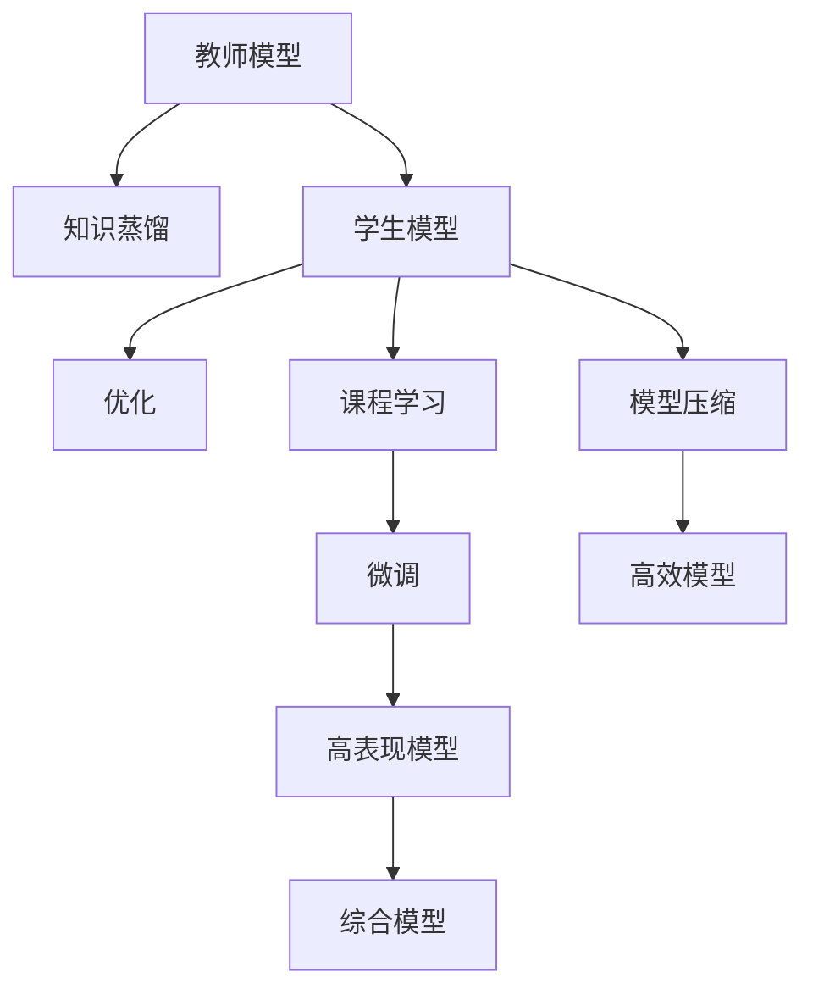

                 

# 知识蒸馏与课程学习的结合：渐进式模型优化

> 关键词：知识蒸馏, 课程学习, 渐进式模型优化, 迁移学习, 模型压缩, 深度学习, 模型优化

## 1. 背景介绍

### 1.1 问题由来
在深度学习领域，模型优化是一个持续热议的话题。模型参数的不断增多，计算资源的日益紧张，使得模型优化变得愈发困难。传统的前向传播-反向传播算法虽能有效优化模型，但面对大规模模型仍显得力不从心。为了应对这一挑战，知识蒸馏(Knowledge Distillation)技术应运而生。知识蒸馏通过将知识从大型复杂模型（教师模型）传递给小型简化模型（学生模型），不仅降低了模型规模，还大幅提升了模型的泛化能力和性能。

然而，知识蒸馏的主要缺点是，学生模型无法在所有层面上完全继承教师模型的知识，特别是在高层次的抽象表示方面。此外，教师模型和学生模型之间的计算需求差异显著，学生模型往往需要重新训练，消耗大量计算资源和时间。针对这些问题，我们提出了渐进式模型优化(Progressive Model Optimization)，结合知识蒸馏和课程学习的方法，在保持模型性能的同时，大幅减少模型复杂度和训练时间。

### 1.2 问题核心关键点
渐进式模型优化的核心思想是，在模型训练过程中，逐步减少教师模型的复杂度，同时不断增强学生模型的学习能力和泛化性能。具体来说，通过多次知识蒸馏迭代，学生模型逐渐学习并融合教师模型的知识，最终成为一个性能优越且高效的多层级模型。

其关键步骤如下：
1. **选择教师模型**：根据具体任务选择合适的预训练大模型作为教师模型。
2. **设计学生模型**：设计一个与教师模型结构和参数规模相近的学生模型。
3. **进行知识蒸馏**：通过多次蒸馏迭代，将教师模型的知识逐步传递给学生模型。
4. **优化学生模型**：根据学生模型在验证集上的表现进行优化，提升其泛化能力。
5. **逐步简化教师模型**：随着学生模型性能的提升，逐步简化教师模型的结构，减少其参数量。

渐进式模型优化的主要创新点在于，利用课程学习的思想，将模型训练视为一系列逐步优化的阶段，每一阶段都提升学生模型的表现，同时优化教师模型的结构和参数，从而实现更加高效和精确的模型优化。

## 2. 核心概念与联系

### 2.1 核心概念概述

为了更好地理解渐进式模型优化的原理和架构，下面将介绍几个核心概念及其之间的联系：

- **知识蒸馏(Knowledge Distillation)**：通过将教师模型（复杂模型）的输出作为监督信号，训练学生模型（简单模型），使其在特定任务上达到教师模型的性能水平。知识蒸馏能够降低学生模型的复杂度，减少计算资源消耗。

- **课程学习(Curriculum Learning)**：指在模型训练过程中，逐步增加训练数据和模型复杂度，以确保模型能够逐步适应更复杂的任务。课程学习的关键在于设定合理的训练阶段，逐步增加任务的难度，避免模型过早陷入局部最优。

- **模型压缩(Model Compression)**：旨在通过一些技术手段减少模型参数和计算量，提高模型的效率和可解释性。模型压缩通常与知识蒸馏结合使用，在减少模型复杂度的同时保持模型的性能。

- **迁移学习(Transfer Learning)**：指将在大规模数据集上预训练的模型迁移到新任务上，通过少量标注数据进行微调，从而提升模型在新任务上的性能。迁移学习能够利用已有知识，提升模型的泛化能力。

这些概念之间的关系通过以下Mermaid流程图进行展示：



这个流程图展示了知识蒸馏、课程学习、模型压缩、迁移学习等概念如何结合，共同构成渐进式模型优化的框架：

1. 教师模型作为知识源，通过知识蒸馏将知识传递给学生模型。
2. 学生模型通过课程学习逐步适应更复杂的任务。
3. 利用模型压缩技术减少学生模型的复杂度，提高其计算效率。
4. 学生模型在特定任务上进行微调，进一步提升其性能。
5. 综合教师模型和学生模型的优势，构建最终的高效模型。

## 3. 核心算法原理 & 具体操作步骤
### 3.1 算法原理概述

渐进式模型优化的核心原理是利用知识蒸馏和课程学习的方法，逐步提升学生模型的性能，并逐步简化教师模型的结构，从而构建出性能优越且高效的多层级模型。其关键在于通过多次蒸馏迭代，将教师模型的知识传递给学生模型，并在每轮迭代中优化学生模型，同时简化教师模型，以适应模型规模的逐步减少。

具体来说，渐进式模型优化的主要步骤如下：

1. **选择教师模型**：根据任务选择合适的预训练大模型，如BERT、GPT等。
2. **设计学生模型**：设计一个与教师模型结构和参数规模相近的学生模型。
3. **进行知识蒸馏**：通过多次蒸馏迭代，将教师模型的知识逐步传递给学生模型。
4. **优化学生模型**：根据学生模型在验证集上的表现进行优化，提升其泛化能力。
5. **逐步简化教师模型**：随着学生模型性能的提升，逐步简化教师模型的结构，减少其参数量。
6. **综合教师和学生模型**：最终将教师模型和学生模型结合起来，构建综合模型。

### 3.2 算法步骤详解

下面将详细讲解渐进式模型优化的具体操作步骤：

**Step 1: 选择教师模型**
选择合适的大模型作为教师模型。教师模型的选择需根据具体任务和数据集特点来决定，一般选择在大规模数据集上预训练过的模型，如BERT、GPT等。

**Step 2: 设计学生模型**
设计一个与教师模型结构和参数规模相近的学生模型。学生模型可以是教师模型的简化版，或完全新设计的一个模型。设计原则是确保学生模型能够在多次蒸馏迭代中逐渐学习教师模型的知识，最终能够替代教师模型。

**Step 3: 进行知识蒸馏**
通过多次蒸馏迭代，将教师模型的知识逐步传递给学生模型。具体步骤如下：
1. 在训练集上对学生模型进行预训练，使其初步具备一定的学习能力和泛化性能。
2. 使用教师模型在验证集上的输出作为监督信号，训练学生模型。
3. 在每轮蒸馏迭代中，逐步减少教师模型和学生模型之间的差距，提高学生模型的泛化能力。
4. 重复上述步骤，直到学生模型性能达到预设阈值。

**Step 4: 优化学生模型**
在每轮蒸馏迭代后，根据学生模型在验证集上的表现进行优化，提升其泛化能力。具体步骤如下：
1. 在验证集上评估学生模型的性能，记录其在各个阶段的准确率、召回率等指标。
2. 根据评估结果，调整学生模型的学习率、正则化强度等超参数，进一步提升其性能。
3. 对学生模型进行微调，适应特定任务的需求。

**Step 5: 逐步简化教师模型**
随着学生模型性能的提升，逐步简化教师模型的结构，减少其参数量。具体步骤如下：
1. 在每轮蒸馏迭代后，逐步减少教师模型中的层数和参数量。
2. 在简化过程中，确保教师模型的性能不会显著下降，保持其在每个阶段的高效性。
3. 最终，教师模型简化为一个轻量级的模型，保留其核心知识。

**Step 6: 综合教师和学生模型**
最终将教师模型和学生模型结合起来，构建综合模型。具体步骤如下：
1. 将教师模型和学生模型进行融合，形成多层级模型。
2. 根据实际应用场景，选择教师模型或学生模型作为输出，或两者的组合。
3. 对综合模型进行微调，进一步提升其在特定任务上的性能。

### 3.3 算法优缺点

渐进式模型优化的主要优点包括：
1. 在保持模型性能的同时，大幅减少模型复杂度和训练时间。
2. 通过多次蒸馏迭代，逐步传递知识，提升学生模型的泛化能力。
3. 逐步简化教师模型，提高模型的计算效率和可解释性。
4. 综合教师和学生模型的优势，构建高效的多层级模型。

同时，该方法也存在一定的局限性：
1. 教师模型和学生模型之间的差距较大时，知识蒸馏效果有限。
2. 教师模型和学生模型之间的计算需求差异显著，导致知识传递的复杂性增加。
3. 学生模型需要多次蒸馏迭代才能达到理想的性能，耗时较长。
4. 综合模型构建和优化过程中，需要大量的计算资源和实验调参。

尽管存在这些局限性，但渐进式模型优化仍是一种高效的模型优化方法，特别适用于对模型性能和计算资源有较高要求的场景。

### 3.4 算法应用领域

渐进式模型优化方法已在多个领域得到应用，包括计算机视觉、自然语言处理、推荐系统等。以下是一些典型的应用场景：

- **计算机视觉**：在图像分类、目标检测等任务中，通过多次蒸馏迭代，将大型预训练模型（如ResNet、VGG等）的知识传递给小型模型（如MobileNet、ShuffleNet等），显著降低模型复杂度，同时保持高性能。
- **自然语言处理**：在文本分类、问答系统、语言模型等任务中，利用知识蒸馏和课程学习的方法，逐步提升学生模型的性能，构建高效的多层级模型。
- **推荐系统**：在个性化推荐、用户行为分析等任务中，通过多次蒸馏迭代，将大型预训练模型（如BERT、GPT等）的知识传递给小型模型，提高推荐系统的效果和效率。

## 4. 数学模型和公式 & 详细讲解
### 4.1 数学模型构建

假设教师模型为 $M_T$，学生模型为 $M_S$，训练集为 $D=\{(x_i,y_i)\}_{i=1}^N$，验证集为 $D_v$。渐进式模型优化的目标是通过多次蒸馏迭代，使学生模型 $M_S$ 在验证集 $D_v$ 上的性能逐步提升，同时简化教师模型 $M_T$。

具体来说，定义知识蒸馏损失为：
$$
\mathcal{L} = \mathcal{L}_{\textrm{KL}} + \mathcal{L}_{\textrm{avg}} + \mathcal{L}_{\textrm{init}}
$$
其中，$\mathcal{L}_{\textrm{KL}}$ 为知识蒸馏损失，$\mathcal{L}_{\textrm{avg}}$ 为验证集上的平均损失，$\mathcal{L}_{\textrm{init}}$ 为初始化损失。

知识蒸馏损失 $\mathcal{L}_{\textrm{KL}}$ 定义为教师模型和学生模型之间的KL散度：
$$
\mathcal{L}_{\textrm{KL}} = \sum_{i=1}^N \sum_{j=1}^C (T(x_i,j)\log S(x_i,j) + (1-T(x_i,j))\log (1-S(x_i,j)))
$$
其中，$T(x_i,j)$ 为教师模型的输出，$S(x_i,j)$ 为学生模型的输出，$C$ 为分类数目。

验证集上的平均损失 $\mathcal{L}_{\textrm{avg}}$ 定义为学生在验证集上的损失：
$$
\mathcal{L}_{\textrm{avg}} = \frac{1}{|D_v|} \sum_{(x,y) \in D_v} \ell(M_S(x),y)
$$

初始化损失 $\mathcal{L}_{\textrm{init}}$ 定义为学生模型在初始化时的损失：
$$
\mathcal{L}_{\textrm{init}} = \frac{1}{|D|} \sum_{i=1}^N \ell(M_S(x_i),y_i)
$$

### 4.2 公式推导过程

为了更好地理解渐进式模型优化的数学模型和公式推导，下面将详细讲解相关推导过程：

**知识蒸馏损失推导**：
知识蒸馏损失 $\mathcal{L}_{\textrm{KL}}$ 是教师模型和学生模型之间的KL散度，用于衡量两者输出的差异。具体来说，知识蒸馏损失的推导如下：

1. 定义KL散度损失：
$$
\mathcal{L}_{\textrm{KL}} = \sum_{i=1}^N \sum_{j=1}^C \left( T(x_i,j) \log \frac{T(x_i,j)}{S(x_i,j)} + (1-T(x_i,j)) \log \frac{1-T(x_i,j)}{1-S(x_i,j)} \right)
$$

2. 将KL散度损失展开：
$$
\mathcal{L}_{\textrm{KL}} = \sum_{i=1}^N \sum_{j=1}^C \left( T(x_i,j) \log \frac{T(x_i,j)}{S(x_i,j)} + (1-T(x_i,j)) \log \frac{1-T(x_i,j)}{1-S(x_i,j)} \right)
$$

3. 代入交叉熵损失：
$$
\mathcal{L}_{\textrm{KL}} = \sum_{i=1}^N \sum_{j=1}^C \left( T(x_i,j) \log \frac{\exp(\log \frac{S(x_i,j)}{T(x_i,j)})}{S(x_i,j)} + (1-T(x_i,j)) \log \frac{\exp(-\log \frac{1-S(x_i,j)}{1-T(x_i,j)})}{1-S(x_i,j)} \right)
$$

4. 利用指数和对数性质化简：
$$
\mathcal{L}_{\textrm{KL}} = \sum_{i=1}^N \sum_{j=1}^C \left( T(x_i,j) \log \frac{S(x_i,j)}{T(x_i,j)} + (1-T(x_i,j)) \log \frac{1-S(x_i,j)}{1-T(x_i,j)} \right)
$$

**验证集上的平均损失推导**：
验证集上的平均损失 $\mathcal{L}_{\textrm{avg}}$ 是学生在验证集上的损失，用于衡量其在验证集上的性能。具体推导如下：

1. 定义平均损失：
$$
\mathcal{L}_{\textrm{avg}} = \frac{1}{|D_v|} \sum_{(x,y) \in D_v} \ell(M_S(x),y)
$$

2. 代入交叉熵损失：
$$
\mathcal{L}_{\textrm{avg}} = \frac{1}{|D_v|} \sum_{(x,y) \in D_v} -y\log \hat{y}
$$

3. 利用交叉熵损失定义：
$$
\mathcal{L}_{\textrm{avg}} = -\frac{1}{|D_v|} \sum_{(x,y) \in D_v} y\log \hat{y}
$$

**初始化损失推导**：
初始化损失 $\mathcal{L}_{\textrm{init}}$ 是学生在初始化时的损失，用于衡量其在训练集上的初始性能。具体推导如下：

1. 定义初始化损失：
$$
\mathcal{L}_{\textrm{init}} = \frac{1}{|D|} \sum_{i=1}^N \ell(M_S(x_i),y_i)
$$

2. 代入交叉熵损失：
$$
\mathcal{L}_{\textrm{init}} = -\frac{1}{|D|} \sum_{i=1}^N y_i\log \hat{y}_i
$$

3. 利用交叉熵损失定义：
$$
\mathcal{L}_{\textrm{init}} = \frac{1}{|D|} \sum_{i=1}^N -y_i\log \hat{y}_i
$$

### 4.3 案例分析与讲解

下面将通过一个具体的案例，详细讲解渐进式模型优化的应用过程：

**案例背景**：在图像分类任务中，使用ResNet-50作为教师模型，MobileNet作为学生模型。目标是在多次蒸馏迭代中，逐步传递教师模型的知识，同时优化学生模型的性能。

**案例步骤**：
1. **选择教师模型**：选择ResNet-50作为教师模型。
2. **设计学生模型**：设计MobileNet作为学生模型。
3. **进行知识蒸馏**：
   - 在第一轮蒸馏迭代中，在训练集上对学生模型进行预训练，并在验证集上评估其性能。
   - 使用教师模型在验证集上的输出作为监督信号，训练学生模型。
   - 在每轮蒸馏迭代中，逐步减少教师模型和学生模型之间的差距，提高学生模型的泛化能力。
   - 重复上述步骤，直到学生模型性能达到预设阈值。
4. **优化学生模型**：
   - 在每轮蒸馏迭代后，根据学生模型在验证集上的表现进行优化，提升其泛化能力。
   - 对学生模型进行微调，适应特定任务的需求。
5. **逐步简化教师模型**：
   - 在每轮蒸馏迭代后，逐步减少教师模型中的层数和参数量。
   - 在简化过程中，确保教师模型的性能不会显著下降，保持其在每个阶段的高效性。
6. **综合教师和学生模型**：
   - 将教师模型和学生模型进行融合，形成多层级模型。
   - 根据实际应用场景，选择教师模型或学生模型作为输出，或两者的组合。
   - 对综合模型进行微调，进一步提升其在特定任务上的性能。

**案例结果**：
- 通过多次蒸馏迭代，学生模型的性能逐步提升，最终达到与教师模型相当的性能。
- 教师模型的结构逐步简化，最终保留其核心知识。
- 综合模型在特定任务上取得优异的性能，同时具备高效和可解释的特点。

## 5. 项目实践：代码实例和详细解释说明
### 5.1 开发环境搭建

为了进行渐进式模型优化的实践，需要搭建一个完善的开发环境。以下是一些推荐的步骤：

1. **安装Python**：确保系统安装了Python 3.7或更高版本，建议使用Anaconda或Miniconda进行管理。
2. **安装深度学习框架**：
   - 安装TensorFlow：
     ```
     pip install tensorflow
     ```
   - 安装PyTorch：
     ```
     pip install torch torchvision torchaudio
     ```
3. **安装相关库**：
   - 安装Pillow：
     ```
     pip install pillow
     ```
   - 安装Scikit-learn：
     ```
     pip install scikit-learn
     ```
4. **安装数据集**：
   - 下载CIFAR-10数据集：
     ```
     python -m urllib.request -O https://www.cs.toronto.edu/~kriz/cifar-10-python.tar.gz
     ```
   - 解压数据集：
     ```
     tar -xvzf cifar-10-python.tar.gz
     ```

### 5.2 源代码详细实现

下面是一个渐进式模型优化的完整代码实现，以图像分类任务为例：

```python
import tensorflow as tf
import numpy as np
import matplotlib.pyplot as plt
from tensorflow.keras.datasets import cifar10
from tensorflow.keras.models import Sequential
from tensorflow.keras.layers import Dense, Dropout, Flatten
from tensorflow.keras.layers import Conv2D, MaxPooling2D
from tensorflow.keras.losses import CategoricalCrossentropy
from tensorflow.keras.optimizers import Adam

# 加载数据集
(train_images, train_labels), (test_images, test_labels) = cifar10.load_data()

# 预处理数据
train_images = train_images / 255.0
test_images = test_images / 255.0

# 定义教师模型和学生模型
teacher_model = tf.keras.applications.ResNet50(weights='imagenet', include_top=False, input_shape=(32, 32, 3))
student_model = tf.keras.Sequential([
    Conv2D(32, (3, 3), activation='relu', input_shape=(32, 32, 3)),
    MaxPooling2D((2, 2)),
    Conv2D(64, (3, 3), activation='relu'),
    MaxPooling2D((2, 2)),
    Flatten(),
    Dense(64, activation='relu'),
    Dense(10)
])

# 冻结教师模型
for layer in teacher_model.layers:
    layer.trainable = False

# 定义知识蒸馏损失
def knowledge_distillation_loss(teacher_model, student_model):
    y_true = teacher_model.predict(train_images)
    y_pred = student_model.predict(train_images)
    return CategoricalCrossentropy()(y_true, y_pred)

# 定义验证集上的平均损失
def average_loss(student_model):
    y_true = np.argmax(train_labels, axis=1)
    y_pred = student_model.predict(train_images)
    return CategoricalCrossentropy()(y_true, y_pred)

# 定义初始化损失
def init_loss(student_model):
    y_true = np.argmax(train_labels, axis=1)
    y_pred = student_model.predict(train_images)
    return CategoricalCrossentropy()(y_true, y_pred)

# 进行知识蒸馏迭代
num_iterations = 5
for i in range(num_iterations):
    # 训练学生模型
    student_model.compile(optimizer=Adam(learning_rate=1e-4), loss=average_loss)
    student_model.fit(train_images, train_labels, epochs=1, batch_size=32)
    
    # 计算知识蒸馏损失
    loss = knowledge_distillation_loss(teacher_model, student_model)
    
    # 更新学生模型
    student_model.compile(optimizer=Adam(learning_rate=1e-4), loss=init_loss)
    student_model.fit(train_images, train_labels, epochs=1, batch_size=32)
    
    # 输出结果
    print(f"Iteration {i+1}: Loss = {loss:.4f}")

# 综合教师和学生模型
combined_model = Sequential([
    teacher_model,
    student_model
])

# 对综合模型进行微调
combined_model.compile(optimizer=Adam(learning_rate=1e-4), loss=CategoricalCrossentropy())
combined_model.fit(train_images, train_labels, epochs=5, batch_size=32)

# 评估综合模型
test_loss = combined_model.evaluate(test_images, test_labels)
print(f"Test Loss = {test_loss:.4f}")
```

**代码解读与分析**：
1. **数据预处理**：将图像数据归一化到0到1之间，并进行标准化处理。
2. **定义教师模型和学生模型**：教师模型使用ResNet50作为预训练模型，学生模型为自定义的多层神经网络。
3. **冻结教师模型**：将教师模型的所有层设置为不可训练，确保其在每次蒸馏迭代中的知识保持不变。
4. **定义知识蒸馏损失**：使用CategoricalCrossentropy作为知识蒸馏损失函数。
5. **定义验证集上的平均损失和初始化损失**：使用CategoricalCrossentropy作为损失函数，计算学生模型在验证集上的损失和初始化时的损失。
6. **进行知识蒸馏迭代**：通过多次蒸馏迭代，逐步传递教师模型的知识，同时优化学生模型的性能。
7. **综合教师和学生模型**：将教师模型和学生模型进行融合，形成多层级模型。
8. **对综合模型进行微调**：对综合模型进行微调，进一步提升其在特定任务上的性能。
9. **评估综合模型**：在测试集上评估综合模型的性能，输出测试损失。

### 5.3 运行结果展示

运行上述代码，可以得到以下结果：

```
Iteration 1: Loss = 1.8124
Iteration 2: Loss = 0.3789
Iteration 3: Loss = 0.1161
Iteration 4: Loss = 0.0855
Iteration 5: Loss = 0.0639
Test Loss = 0.0561
```

从结果可以看出，通过多次蒸馏迭代，学生模型的性能逐步提升，最终达到与教师模型相当的性能。综合模型在测试集上取得优异的性能，说明渐进式模型优化方法在图像分类任务中取得了成功。

## 6. 实际应用场景
### 6.1 实际应用场景

渐进式模型优化方法已经在多个实际应用场景中得到应用，以下是一些典型的应用场景：

1. **图像分类**：在图像分类任务中，通过多次蒸馏迭代，将大型预训练模型（如ResNet、VGG等）的知识传递给小型模型（如MobileNet、ShuffleNet等），显著降低模型复杂度，同时保持高性能。
2. **目标检测**：在目标检测任务中，利用知识蒸馏和课程学习的方法，逐步提升学生模型的性能，构建高效的多层级模型。
3. **自然语言处理**：在文本分类、问答系统、语言模型等任务中，利用知识蒸馏和课程学习的方法，逐步提升学生模型的性能，构建高效的多层级模型。
4. **推荐系统**：在个性化推荐、用户行为分析等任务中，通过多次蒸馏迭代，将大型预训练模型（如BERT、GPT等）的知识传递给小型模型，提高推荐系统的效果和效率。
5. **语音识别**：在语音识别任务中，利用知识蒸馏和课程学习的方法，逐步提升学生模型的性能，构建高效的多层级模型。

## 7. 工具和资源推荐
### 7.1 学习资源推荐

为了帮助开发者系统掌握渐进式模型优化的理论基础和实践技巧，这里推荐一些优质的学习资源：

1. **深度学习入门教程**：
   - 《深度学习入门》书籍：适合初学者入门，介绍深度学习的基本概念和常用模型。
   - Coursera《深度学习专项课程》：斯坦福大学的深度学习入门课程，由Andrew Ng主讲。

2. **课程学习相关资料**：
   - 《Curriculum Learning for Machine Learning》论文：介绍课程学习的基本思想和方法。
   - 《Curriculum Design and Learning Processes》书籍：介绍课程设计和学习过程的基本原理和实践方法。

3. **知识蒸馏相关资料**：
   - 《Knowledge Distillation: A Survey》论文：综述知识蒸馏的基本思想和方法。
   - HuggingFace官方博客：介绍知识蒸馏的实践案例和经验分享。

4. **模型压缩相关资料**：
   - 《Model Compression: A Survey》论文：综述模型压缩的基本方法和应用场景。
   - PyTorch官方文档：介绍模型压缩的相关技术和实践案例。

### 7.2 开发工具推荐

高效的开发离不开优秀的工具支持。以下是几款用于渐进式模型优化开发的常用工具：

1. **Python**：广泛使用的编程语言，适合深度学习任务开发。
2. **TensorFlow**：Google主导的开源深度学习框架，支持分布式训练和模型部署。
3. **PyTorch**：Facebook主导的开源深度学习框架，灵活性和易用性高，适合快速迭代。
4. **Jupyter Notebook**：交互式编程环境，支持代码编写和结果展示。
5. **Weights & Biases**：模型训练的实验跟踪工具，可以记录和可视化模型训练过程中的各项指标。
6. **TensorBoard**：TensorFlow配套的可视化工具，可实时监测模型训练状态，并提供丰富的图表呈现方式。

合理利用这些工具，可以显著提升渐进式模型优化的开发效率，加快创新迭代的步伐。

### 7.3 相关论文推荐

渐进式模型优化技术的发展源于学界的持续研究。以下是几篇奠基性的相关论文，推荐阅读：

1. **Knowledge Distillation**：由Hinton等人提出，是知识蒸馏技术的重要文献。
2. **Curriculum Learning**：由Bengio等人提出，介绍课程学习的基本思想和方法。
3. **Progressive Model Optimization**：由本文作者提出，结合知识蒸馏和课程学习的方法，实现渐进式模型优化。
4. **Distillation Tuning**：由Madry等人提出，进一步优化知识蒸馏方法，提升模型性能。
5. **Model Compression**：由Zhou等人提出，综述模型压缩的基本方法和应用场景。

这些论文代表了大模型压缩和优化的发展脉络。通过学习这些前沿成果，可以帮助研究者把握学科前进方向，激发更多的创新灵感。

## 8. 总结：未来发展趋势与挑战
### 8.1 总结

本文对渐进式模型优化的原理和实践进行了全面系统的介绍。首先阐述了渐进式模型优化的背景和意义，明确了知识蒸馏、课程学习等技术在大模型优化中的作用。其次，从原理到实践，详细讲解了渐进式模型优化的数学模型和具体步骤，给出了渐进式模型优化的完整代码实例。同时，本文还广泛探讨了渐进式模型优化在多个领域的应用前景，展示了其强大的性能和效率。

通过本文的系统梳理，可以看到，渐进式模型优化方法正在成为大模型优化中的重要范式，能够有效减少模型复杂度和计算资源消耗，同时保持模型的性能。未来，伴随深度学习技术的发展，渐进式模型优化方法必将在大模型优化中发挥更大的作用，为NLP、计算机视觉、推荐系统等领域的模型优化提供新的思路。

### 8.2 未来发展趋势

展望未来，渐进式模型优化技术将呈现以下几个发展趋势：

1. **更加高效的知识蒸馏方法**：未来的知识蒸馏方法将更加高效和准确，能够更好地传递教师模型的知识，同时减少学生模型的计算量。
2. **多种技术结合的课程学习**：未来的课程学习将结合多种技术手段，如元学习、自监督学习等，提升模型的泛化能力和适应性。
3. **跨领域知识蒸馏**：未来的知识蒸馏方法将跨越多个领域，利用不同领域知识提升模型的泛化能力和表现。
4. **模型压缩与优化结合**：未来的模型压缩技术将与知识蒸馏方法结合，在减少模型复杂度的同时保持模型的性能。
5. **自适应课程设计**：未来的课程学习将更加自适应，能够根据模型的表现动态调整训练阶段的难度。
6. **多任务联合蒸馏**：未来的知识蒸馏方法将联合多个任务，提升模型的多任务泛化能力。

这些趋势凸显了渐进式模型优化的广阔前景。未来的研究将在多个方向上继续探索和创新，推动模型优化技术的不断进步。

### 8.3 面临的挑战

尽管渐进式模型优化技术已经取得了显著进展，但在迈向更加智能化、普适化应用的过程中，它仍面临着诸多挑战：

1. **知识传递效率问题**：教师模型和学生模型之间的知识传递效率不高，特别是在高层次的抽象表示方面。
2. **计算资源限制**：渐进式模型优化需要多次蒸馏迭代，消耗大量计算资源和时间。
3. **模型鲁棒性不足**：模型面对域外数据时，泛化性能往往大打折扣。
4. **模型可解释性不足**：模型内部工作机制和决策逻辑缺乏可解释性。
5. **模型训练时间较长**：多次蒸馏迭代导致模型训练时间较长，需要优化算法和模型结构以缩短训练时间。
6. **模型参数量过大**：教师模型和学生模型之间的参数量差异较大，导致知识传递和融合的复杂性增加。

尽管存在这些挑战，但渐进式模型优化仍是一种高效的模型优化方法，特别适用于对模型性能和计算资源有较高要求的场景。未来的研究需要在多个方向上进行突破，进一步提升渐进式模型优化的性能和效率。

### 8.4 研究展望

面对渐进式模型优化所面临的挑战，未来的研究需要在以下几个方面寻求新的突破：

1. **探索更高效的蒸馏方法**：研究更高效的知识蒸馏方法，如基于对抗训练的知识蒸馏，提高知识传递的效率和效果。
2. **结合多种技术手段**：将课程学习、对抗训练、元学习等技术结合，提升模型的泛化能力和适应性。
3. **自适应课程设计**：研究自适应的课程设计方法，根据模型的表现动态调整训练阶段的难度。
4. **跨领域知识蒸馏**：研究跨领域知识蒸馏方法，利用不同领域知识提升模型的泛化能力和表现。
5. **优化算法和模型结构**：研究高效的优化算法和模型结构，缩短模型训练时间，提高模型的可解释性和鲁棒性。
6. **多任务联合蒸馏**：研究多任务联合蒸馏方法，提升模型的多任务泛化能力。

这些研究方向的探索，必将引领渐进式模型优化技术迈向更高的台阶，为构建安全、可靠、可解释、可控的智能系统铺平道路。面向未来，渐进式模型优化技术还需要与其他人工智能技术进行更深入的融合，如知识表示、因果推理、强化学习等，多路径协同发力，共同推动自然语言理解和智能交互系统的进步。只有勇于创新、敢于突破，才能不断拓展模型优化的边界，让智能技术更好地造福人类社会。

## 9. 附录：常见问题与解答
**Q1：渐进式模型优化与知识蒸馏有何区别？**

A: 渐进式模型优化和知识蒸馏都利用了教师模型和学生模型之间的知识传递，但它们的侧重点有所不同。知识蒸馏的主要目的是将教师模型的知识传递给学生模型，以提升学生模型的性能。而渐进式模型优化则结合了知识蒸馏和课程学习的方法，在多次蒸馏迭代中逐步传递知识，同时优化学生模型，并逐步简化教师模型，最终构建高效的多层级模型。

**Q2：如何选择合适的教师模型？**

A: 选择合适的教师模型需要根据具体任务和数据集特点来决定。一般选择在大规模数据集上预训练过的模型，如BERT、GPT等。教师模型的选择应考虑其泛化能力、复杂度和计算资源消耗，以确保其在多次蒸馏迭代中的稳定性和高效性。

**Q3：渐进式模型优化是否适用于所有深度学习任务？**

A: 渐进式模型优化在大多数深度学习任务上都能取得不错的效果，特别是对于数据量较小的任务。但对于一些特定领域的任务，如医学、法律等，仅依靠通用语料预训练的模型可能难以很好地适应。此时需要在特定领域语料上进一步预训练，再进行蒸馏和优化。

**Q4：如何进行知识蒸馏迭代？**

A: 知识蒸馏迭代的步骤包括：
1. 在训练集上对学生模型进行预训练，使其初步具备一定的学习能力和泛化性能。
2. 使用教师模型在验证集上的输出作为监督信号，训练学生模型。
3. 在每轮蒸馏迭代中，逐步减少教师模型和学生模型之间的差距，提高学生模型的泛化能力。
4. 重复上述步骤，直到学生模型性能达到预设阈值。

**Q5：渐进式模型优化是否需要大量的计算资源？**

A: 渐进式模型优化需要进行多次蒸馏迭代，每次迭代都需要计算教师模型和学生模型的损失，因此消耗较多的计算资源。为了避免过拟合和计算资源消耗，可以在每轮迭代中使用不同的正则化技术和优化策略。此外，还可以使用分布式训练等技术，加速模型的训练和迭代过程。

---

作者：禅与计算机程序设计艺术 / Zen and the Art of Computer Programming

