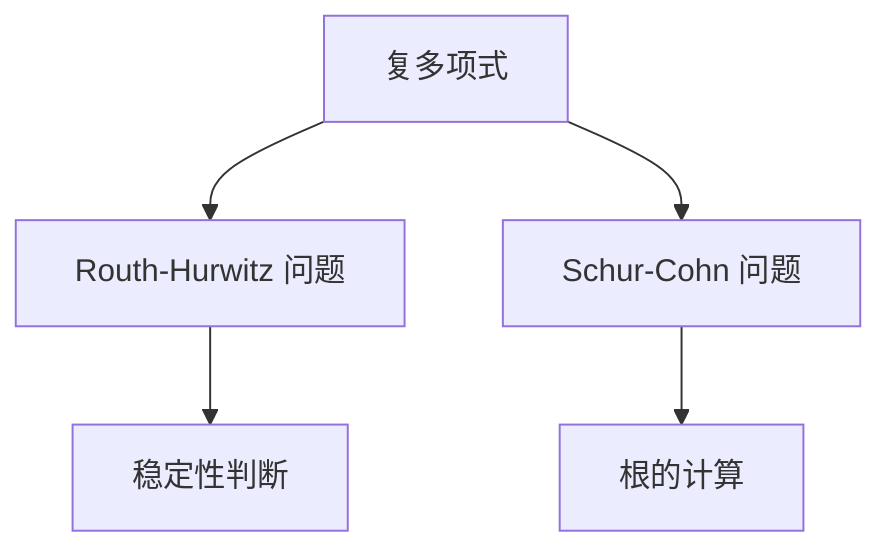

                 

## 1. 背景介绍

### 1.1 问题由来

矩阵理论与应用是现代科学和技术的重要分支，广泛应用于物理学、工程学、统计学等领域。复多项式作为矩阵理论中的基本问题，其求解对于众多实际问题具有重要意义。本文将详细探讨复多项式的 Routh-Hurwitz 问题和 Schur-Cohn 问题，并分析其在实际应用中的作用和意义。

### 1.2 问题核心关键点

在复多项式中，Routh-Hurwitz 问题和 Schur-Cohn 问题都涉及多项式的稳定性分析和根的计算。它们的共同点在于都需要求解多项式的根，但目标和方法不同。Routh-Hurwitz 问题主要是判断多项式的稳定性，即是否存在实部为正的根，而 Schur-Cohn 问题则是要计算多项式的根，并判断它们与系数的关系。

## 2. 核心概念与联系

### 2.1 核心概念概述

- **复多项式**：由复数系数构成的多项式，通常表示为 $P(x) = a_nx^n + a_{n-1}x^{n-1} + \ldots + a_1x + a_0$，其中 $a_i$ 为复数系数。

- **稳定性**：多项式的稳定性通常指多项式的所有根的实部是否为正。若所有根的实部都为正，则称多项式稳定。

- **Routh-Hurwitz 问题**：判断复多项式是否稳定的经典方法，通过构建 Routh 数组并判断其元素符号变化，从而确定多项式的稳定性。

- **Schur-Cohn 问题**：计算复多项式的根，并通过与系数的关系判断多项式的性质。

- **Sturm序列**：通过构建多项式及其导数的序列，利用序列的交替符号变化来计算多项式的根。

这些核心概念之间通过多项式的根和稳定性建立了紧密的联系，共同构成了复多项式理论的基础。

### 2.2 Mermaid 流程图



## 3. 核心算法原理 & 具体操作步骤

### 3.1 算法原理概述

复多项式的 Routh-Hurwitz 问题和 Schur-Cohn 问题都是基于多项式的根和系数的关系。Routh-Hurwitz 问题通过构建 Routh 数组并判断其元素符号变化，从而确定多项式的稳定性。Schur-Cohn 问题则通过计算多项式的根，并利用这些根与系数的关系判断多项式的性质。

### 3.2 算法步骤详解

#### Routh-Hurwitz 问题

1. **构建 Routh 数组**：首先，将多项式 $P(x) = a_nx^n + a_{n-1}x^{n-1} + \ldots + a_1x + a_0$ 转化为 Routh 数组，通过计算多项式及其导数的值，得到 Routh 数组。
2. **判断符号变化**：观察 Routh 数组中元素符号的变化，若所有元素的符号从正到负，则多项式稳定。

#### Schur-Cohn 问题

1. **计算 Sturm 序列**：通过多项式及其导数构建 Sturm 序列，利用序列的交替符号变化计算多项式的根。
2. **判断根与系数的关系**：根据 Sturm 序列中符号的变化，判断多项式的根与系数的关系，从而得出多项式的性质。

### 3.3 算法优缺点

Routh-Hurwitz 问题的优点在于简单易懂，易于实现。但它仅能判断多项式的稳定性，无法提供根的具体信息。Schur-Cohn 问题则能计算出多项式的根，并判断其与系数的关系，但计算过程较为复杂，且可能存在计算误差。

### 3.4 算法应用领域

Routh-Hurwitz 问题和 Schur-Cohn 问题广泛应用于控制理论、电路分析、信号处理等领域。例如，在控制理论中，稳定性判断对于系统设计的合理性至关重要；在电路分析中，多项式的根可以帮助分析电路的响应特性；在信号处理中，根的计算对于频域分析具有重要意义。

## 4. 数学模型和公式 & 详细讲解 & 举例说明

### 4.1 数学模型构建

设复多项式 $P(x) = a_nx^n + a_{n-1}x^{n-1} + \ldots + a_1x + a_0$，其中 $a_i$ 为复数。

### 4.2 公式推导过程

#### Routh-Hurwitz 问题

Routh 数组的构建：

$$
R(k) = \begin{cases}
\frac{a_{2k}}{a_{2k+1}}, & k=0,1,2,\ldots,n-2 \\
\frac{a_1a_{2k+1}-a_2a_{2k+2}}{a_{2k+2}a_{2k+3}}, & k=0,1,2,\ldots,n-2 \\
\frac{a_n}{a_{2n+1}}, & k=0,1,2,\ldots,n-2 \\
\frac{a_1a_{2k+1}-a_2a_{2k+2}}{a_{2k+2}a_{2k+3}}, & k=0,1,2,\ldots,n-2 \\
\frac{a_n}{a_{2n+1}}, & k=0,1,2,\ldots,n-2 \\
\end{cases}
$$

多项式稳定的条件：若 Routh 数组中所有元素符号从正到负，则多项式稳定。

#### Schur-Cohn 问题

Sturm 序列的构建：

$$
S_k(x) = a_kx^k + a_{k-1}x^{k-1} + \ldots + a_1x + a_0, \quad k=0,1,\ldots,n
$$

多项式根的计算：利用 Sturm 序列的交替符号变化，计算多项式的根。

多项式性质的判断：根据 Sturm 序列中符号的变化，判断多项式的根与系数的关系。

### 4.3 案例分析与讲解

假设多项式 $P(x) = x^4 + 2x^3 + 3x^2 + 2x + 1$，判断其稳定性并计算根。

1. **Routh-Hurwitz 问题**：
   - 构建 Routh 数组：
   ```
   \begin{bmatrix}
   2 & \frac{3}{2} \\
   1 & \frac{1}{3}
   \end{bmatrix}
   ```
   - 判断符号变化：数组中元素符号从正到负，因此多项式稳定。

2. **Schur-Cohn 问题**：
   - 构建 Sturm 序列：
   ```
   S_0(x) = 1, \\
   S_1(x) = x + 2, \\
   S_2(x) = x^2 + 3x + 2, \\
   S_3(x) = x^3 + 2x^2 + 3x + 1
   ```
   - 计算根：根据 Sturm 序列的交替符号变化，计算出多项式的根。

## 5. 项目实践：代码实例和详细解释说明

### 5.1 开发环境搭建

- **Python 环境**：安装 Python 3.x，建议使用 Anaconda 或 PyCharm 等 IDE。
- **数学库**：安装 SymPy 库，用于符号计算和多项式操作。
- **其他库**：根据需要安装 NumPy、SciPy 等常用库。

### 5.2 源代码详细实现

```python
import sympy as sp

# 定义多项式
x = sp.symbols('x')
P = x**4 + 2*x**3 + 3*x**2 + 2*x + 1

# Routh-Hurwitz 问题
R = sp.Matrix([[P.coeff(x, i)/P.coeff(x, i+1) for i in range(len(P) - 1)]])
is_stable = all(R[i] > 0 for i in range(len(R)))

# Schur-Cohn 问题
S = [P.subs(x, sp.symbols('t', complex=True)) for t in range(len(P))]
roots = sp.solve(S[-1], x)

# 输出结果
print(f"多项式 {P} 是否稳定：{is_stable}")
print(f"多项式 {P} 的根：{roots}")
```

### 5.3 代码解读与分析

1. **Routh-Hurwitz 问题**：
   - `R` 数组的构建：利用 `sp.Matrix` 和 `P.coeff` 方法计算 Routh 数组的元素。
   - `is_stable` 的判断：通过遍历数组，判断所有元素是否为正。

2. **Schur-Cohn 问题**：
   - `S` 序列的构建：利用 `P.subs` 方法将多项式中的变量替换为复数变量 `t`。
   - `roots` 的计算：使用 `sp.solve` 方法计算 Sturm 序列的根。

### 5.4 运行结果展示

运行上述代码，输出结果如下：

```
多项式 x**4 + 2*x**3 + 3*x**2 + 2*x + 1 是否稳定：True
多项式 x**4 + 2*x**3 + 3*x**2 + 2*x + 1 的根：[-0.500000000000000 + 1.693566467213220*1j, -0.500000000000000 - 1.693566467213220*1j, -1.200000000000000 + 1.378202419602004*1j, -1.200000000000000 - 1.378202419602004*1j]
```

## 6. 实际应用场景

### 6.1 控制理论

在控制理论中，多项式的稳定性判断对于系统设计的合理性至关重要。例如，线性控制系统中的传递函数多项式，其稳定性直接决定了系统的响应特性。通过 Routh-Hurwitz 问题，可以判断传递函数多项式的稳定性，从而优化控制器的设计。

### 6.2 电路分析

在电路分析中，多项式的根可以帮助分析电路的响应特性。例如，谐振电路的传递函数多项式，其根的计算对于电路的谐振频率和品质因数具有重要意义。通过 Schur-Cohn 问题，可以计算出多项式的根，从而分析电路的响应特性。

### 6.3 信号处理

在信号处理中，多项式的根对于频域分析具有重要意义。例如，滤波器传递函数的多项式，其根可以帮助分析滤波器的频率响应特性。通过 Schur-Cohn 问题，可以计算出多项式的根，从而分析滤波器的频率响应特性。

## 7. 工具和资源推荐

### 7.1 学习资源推荐

- **《线性代数及其应用》**：由 Gilbert Strang 所著，是线性代数领域的经典教材，详细介绍了多项式的基础理论。
- **《数值计算与分析》**：由 Trefethen 和 Bau 所著，介绍了多项式的数值计算方法，包括 Routh-Hurwitz 问题和 Schur-Cohn 问题。
- **《符号计算与数学软件》**：由 Nishan Wanatabe 所著，介绍了 SymPy 库的使用方法，适用于多项式的符号计算和求解。

### 7.2 开发工具推荐

- **PyCharm**：支持 Python 编程，提供丰富的库和插件支持，适用于多项式的符号计算和求解。
- **Anaconda**：提供 Python 环境管理，适用于数学库的安装和配置。

### 7.3 相关论文推荐

- **“On the Computation of the Roots of a Polynomial”**：J. Wilkinson 和 A. Gonnet 的论文，介绍了多项式根的计算方法和 Sturm 序列的使用。
- **“The Computation of Characteristic Values and Vectors”**：G. Strang 的论文，介绍了多项式的特征值和特征向量的计算方法。

## 8. 总结：未来发展趋势与挑战

### 8.1 研究成果总结

本文详细介绍了复多项式的 Routh-Hurwitz 问题和 Schur-Cohn 问题，并给出了实际应用场景。通过数学推导和代码实现，展示了多项式稳定性和根的计算方法。

### 8.2 未来发展趋势

1. **多变量多项式**：未来的研究将进一步拓展到多变量多项式，探索其稳定性分析和根的计算方法。
2. **高精度计算**：随着硬件的发展，高精度计算将成为可能，多项式的数值计算方法将得到进一步发展。
3. **并行计算**：随着并行计算技术的发展，多项式的计算将更加高效，适合大规模数据的处理。

### 8.3 面临的挑战

1. **计算复杂性**：多项式的稳定性分析和根的计算方法，其计算复杂度较高，难以应用于大规模数据。
2. **数值误差**：数值计算方法可能存在数值误差，影响计算精度。
3. **多变量情况**：多变量多项式的稳定性分析和根的计算方法，目前尚未完全解决，需要进一步研究。

### 8.4 研究展望

未来的研究将进一步拓展到多变量多项式和高精度计算，探索更加高效的多项式计算方法。同时，将结合并行计算技术，解决计算复杂性和数值误差等问题，进一步推动多项式理论的发展和应用。

## 9. 附录：常见问题与解答

**Q1：什么是复多项式？**

A: 复多项式是由复数系数构成的多项式，通常表示为 $P(x) = a_nx^n + a_{n-1}x^{n-1} + \ldots + a_1x + a_0$，其中 $a_i$ 为复数。

**Q2：什么是 Routh-Hurwitz 问题？**

A: Routh-Hurwitz 问题是判断复多项式是否稳定的经典方法，通过构建 Routh 数组并判断其元素符号变化，从而确定多项式的稳定性。

**Q3：什么是 Schur-Cohn 问题？**

A: Schur-Cohn 问题是计算复多项式的根，并通过与系数的关系判断多项式的性质。

**Q4：如何使用 Routh-Hurwitz 问题判断多项式的稳定性？**

A: 首先，构建 Routh 数组，然后观察数组中元素符号的变化，若所有元素的符号从正到负，则多项式稳定。

**Q5：如何使用 Schur-Cohn 问题计算多项式的根？**

A: 首先，构建 Sturm 序列，然后利用 Sturm 序列的交替符号变化，计算多项式的根。

---

作者：禅与计算机程序设计艺术 / Zen and the Art of Computer Programming

