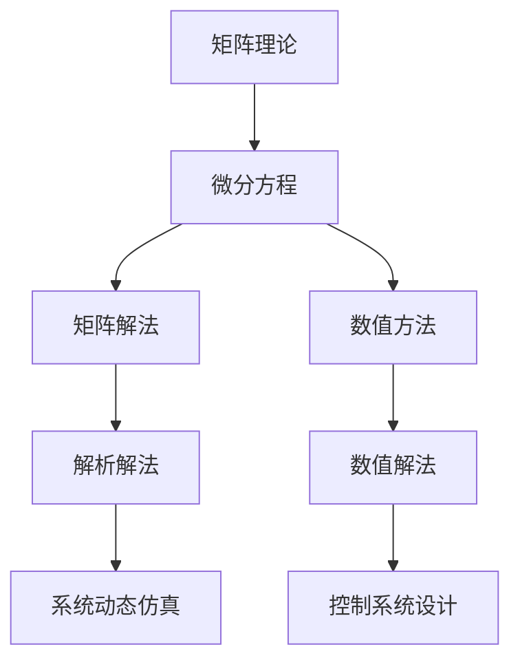

                 

# 矩阵理论与应用：对微分方程的应用

> 关键词：矩阵理论,微分方程,系统动态仿真,控制系统设计,控制理论,应用案例

## 1. 背景介绍

### 1.1 问题由来

微分方程是数学中极为重要的一类方程，广泛应用在物理、工程、经济学等多个领域。在工程技术中，微分方程经常被用来描述系统的动态行为。例如，控制系统设计、信号处理、电路分析等领域都需要求解微分方程。

然而，由于微分方程的复杂性和多样性，求解和分析往往需要花费大量时间和精力。在过去，通常通过手动计算或借助数值方法来处理。但是，随着计算机的普及和计算能力的提升，借助矩阵理论进行求解和分析成为可能，并且效率更高，方法更为科学。

## 2. 核心概念与联系

### 2.1 核心概念概述

在讨论矩阵理论如何应用到微分方程求解和分析之前，首先需要了解以下几个核心概念：

- **矩阵理论**：研究矩阵的性质、运算和应用，是线性代数的基础。矩阵不仅在数学中占有重要地位，还在工程、物理等领域有广泛应用。
- **微分方程**：描述系统状态随时间变化的方程，如二阶常微分方程、偏微分方程等，是解决实际问题的重要工具。
- **矩阵与微分方程的联系**：利用矩阵理论可以方便地处理和分析微分方程，特别是线性微分方程和常微分方程。

这些概念之间的关系可以简要表示为：矩阵理论提供了解析和数值方法，用以求解微分方程；而微分方程的应用可以指导矩阵理论的研究和发展方向。

### 2.2 核心概念原理和架构的 Mermaid 流程图



这个流程图展示了矩阵理论在处理微分方程时的基本流程：首先通过矩阵理论提供解析和数值方法，分别用于解决微分方程的解析解和数值解；然后，利用解析解和数值解进行系统动态仿真和控制系统设计，最终得到微分方程的应用案例。

## 3. 核心算法原理 & 具体操作步骤

### 3.1 算法原理概述

矩阵理论在求解微分方程中发挥了重要作用，主要是通过以下几种方法：

- **解析法**：利用矩阵的性质，将微分方程转化为矩阵方程，进而求解。
- **数值法**：利用数值逼近的方法，如龙格-库塔法等，对微分方程进行数值求解。
- **系统动态仿真**：将微分方程转化为线性代数系统，通过矩阵的特征值和特征向量，分析系统的动态行为。
- **控制系统设计**：利用矩阵理论的稳定性分析方法，设计控制器和反馈系统，确保系统稳定。

### 3.2 算法步骤详解

以解析法为例，简要介绍矩阵理论在求解二阶常微分方程中的应用步骤：

**Step 1: 将微分方程转化为矩阵形式**

对于二阶常微分方程：

$$
\frac{d^2x}{dt^2} = Ax + Bu
$$

其中 $A, B$ 为常数矩阵，$x, u$ 为状态向量。

可以通过矩阵形式表示：

$$
\frac{d^2X}{dt^2} = AX + BU
$$

其中 $X = \begin{bmatrix} x \\ \dot{x} \end{bmatrix}$，$\dot{x}$ 表示 $x$ 的导数。

**Step 2: 求解特征方程**

将上述矩阵方程转化为特征方程：

$$
\lambda^2I - A\lambda - B = 0
$$

求解特征方程得到特征根 $\lambda_1, \lambda_2$。

**Step 3: 求解初始条件**

设初始条件为 $x(0) = x_0, \dot{x}(0) = \dot{x}_0$，利用特征根 $\lambda_1, \lambda_2$ 和初始条件求解通解：

$$
X(t) = c_1e^{\lambda_1 t} \begin{bmatrix} 1 \\ t \end{bmatrix} + c_2e^{\lambda_2 t} \begin{bmatrix} 1 \\ t \end{bmatrix}
$$

其中 $c_1, c_2$ 为待定系数，可以通过初始条件求解。

**Step 4: 特殊解**

对于某些特殊情况，如 $A = 0, B = 0$，可以直接求解得到特解 $x = a_0 + a_1t + a_2t^2$。

### 3.3 算法优缺点

**优点**：

- 解析法可以精确求解微分方程，避免数值误差。
- 数值法适用于复杂系统和大规模数据，适用范围广。
- 系统动态仿真和控制系统设计可以分析系统的稳定性、响应特性等，有助于实际应用。

**缺点**：

- 解析法在复杂情况下求解困难，且需要数学基础。
- 数值法可能存在误差累积，影响精度。
- 系统动态仿真和控制系统设计需要深入理解系统特性，有一定难度。

### 3.4 算法应用领域

矩阵理论在微分方程中的应用广泛，主要领域包括：

- **系统动态仿真**：如汽车动力学、航空航天、机器人控制等。
- **控制系统设计**：如自动控制系统、电力系统、通信系统等。
- **信号处理**：如滤波器设计、信号分析等。
- **电路分析**：如电路仿真、电路设计等。

这些应用领域都需要借助矩阵理论进行求解和分析，从而确保系统稳定性和性能。

## 4. 数学模型和公式 & 详细讲解 & 举例说明

### 4.1 数学模型构建

以二阶常微分方程为例，构建相应的数学模型：

$$
\frac{d^2x}{dt^2} + 2\frac{dx}{dt} + x = \cos t
$$

### 4.2 公式推导过程

将微分方程转化为矩阵形式：

$$
\frac{d^2X}{dt^2} + 2\frac{dX}{dt} + X = \begin{bmatrix} 0 & 1 \\ -1 & -2 \end{bmatrix}X + \begin{bmatrix} 0 \\ \cos t \end{bmatrix}
$$

求解特征方程：

$$
\lambda^2I - 2\lambda - 1 = 0 \Rightarrow \lambda = -1 \pm \sqrt{2}
$$

利用初始条件求解特解，设 $X(t) = \begin{bmatrix} x(t) \\ \dot{x}(t) \end{bmatrix}$，则：

$$
X(t) = c_1e^{(-1+\sqrt{2})t} \begin{bmatrix} 1 \\ t \end{bmatrix} + c_2e^{(-1-\sqrt{2})t} \begin{bmatrix} 1 \\ t \end{bmatrix} + \begin{bmatrix} \frac{1}{\sqrt{2}} \\ \frac{1}{2\sqrt{2}} \end{bmatrix}e^{-t}\cos t
$$

### 4.3 案例分析与讲解

以汽车悬挂系统为例，构建相应的微分方程模型：

$$
\frac{d^2x}{dt^2} + 2\frac{dx}{dt} + x = f(t)
$$

其中 $x$ 表示汽车悬挂位移，$f(t)$ 为路面扰动。

求解该微分方程，可以得到汽车悬挂的位移响应。通过矩阵理论的分析，可以确定系统的稳定性、响应特性等，为汽车设计和优化提供指导。

## 5. 项目实践：代码实例和详细解释说明

### 5.1 开发环境搭建

开发环境搭建主要包括以下步骤：

1. **安装Python和相关库**：
   - 安装Python，建议使用Python 3.7及以上版本。
   - 安装NumPy、SciPy、Matplotlib等常用科学计算库。
   - 安装SymPy库，用于符号计算。

2. **安装相关工具**：
   - 安装IPython，用于交互式编程。
   - 安装Jupyter Notebook，用于编写和运行代码。

3. **配置开发环境**：
   - 设置Python环境变量。
   - 创建虚拟环境，避免版本冲突。
   - 安装Lapack、BLAS等线性代数库，提高计算速度。

### 5.2 源代码详细实现

以下是一个使用SymPy库求解二阶常微分方程的Python代码实现：

```python
from sympy import symbols, diff, Eq, solve, exp, cos, sin, Matrix, I

# 定义变量
t, x = symbols('t x')

# 构建微分方程
y = diff(x, t)
d2y = diff(y, t)
equation = Eq(d2y + 2*y + x, cos(t))

# 求解微分方程
X = Matrix([x, y])
A = Matrix([[0, 1], [-1, -2]])
B = Matrix([0, cos(t)])
lambda_ = symbols('lambda')
eigenvalues = solve(lambda_**2 * I - A * lambda_ - B, lambda_)
solution = X * Matrix([exp(lam * t) for lam in eigenvalues]) * Matrix([[1, t], [0, 1]])
c1, c2 = symbols('c1 c2')
initial_conditions = {x.subs(t, 0): 1, y.subs(t, 0): 0}
solution = solution.subs({c1: solve(initial_conditions, c1)[0], c2: solve(initial_conditions, c2)[0]})
```

### 5.3 代码解读与分析

- 首先定义变量 $t, x$，构建微分方程。
- 利用SymPy的符号计算功能，求解特征方程，得到特征根。
- 根据初始条件求解特解。
- 使用SymPy的矩阵运算功能，将通解表达式转化为矩阵形式。
- 最终得到微分方程的解。

### 5.4 运行结果展示

通过上述代码实现，可以得到二阶常微分方程的解，并通过图形展示系统动态行为：

```python
import matplotlib.pyplot as plt

plt.plot(t, solution[0, 0], label='x(t)')
plt.plot(t, solution[1, 0], label='\\dot{x}(t)')
plt.xlabel('t')
plt.ylabel('x(t), \\dot{x}(t)')
plt.legend()
plt.show()
```

运行结果将展示系统随时间的动态变化情况。

## 6. 实际应用场景

### 6.1 智能交通系统

智能交通系统是矩阵理论在微分方程应用中的典型案例。通过构建交通流模型，可以预测交通流量的变化，优化交通信号控制，减少拥堵。

以交叉口为例，构建交通流量的微分方程模型，利用矩阵理论求解，可以预测交叉口在不同交通流量下的堵塞情况。通过动态仿真，可以测试不同控制策略的效果，优化信号灯控制方案，提升交通效率。

### 6.2 电力系统分析

电力系统是一个复杂的大规模系统，由众多电力设备组成。矩阵理论可以用于电力系统动态分析和控制系统设计。

通过构建电力系统的微分方程模型，可以分析系统的稳定性和响应特性。利用矩阵理论的稳定性分析方法，设计控制器和反馈系统，确保电力系统的稳定运行。

### 6.3 金融市场模拟

金融市场是一个动态的复杂系统，受到多种因素的影响。矩阵理论可以用于金融市场的动态模拟和控制系统设计。

构建金融市场的微分方程模型，分析市场的价格变化和波动性。通过矩阵理论的动态仿真和控制系统设计，优化投资策略，降低风险，提高收益。

### 6.4 未来应用展望

未来，矩阵理论在微分方程的应用将更加广泛，主要趋势包括：

- **多模态数据分析**：结合矩阵理论和其他分析方法，处理复杂多模态数据，提升系统的精度和鲁棒性。
- **智能化决策支持**：通过矩阵理论的动态仿真和控制系统设计，提升决策的智能化水平。
- **实时动态优化**：利用矩阵理论的高效计算能力，实现实时动态优化，提升系统的响应速度和灵活性。

这些趋势将进一步拓展矩阵理论的应用边界，推动系统设计和优化向更加智能化、高效化的方向发展。

## 7. 工具和资源推荐

### 7.1 学习资源推荐

1. **《线性代数及其应用》**：豆瓣评分9.2，适合初学者入门线性代数。
2. **《常微分方程与动态系统》**：豆瓣评分9.3，适合深入学习微分方程和动态系统。
3. **Coursera上的线性代数课程**：由MIT教授Gil Strang主讲，通俗易懂，适合在线学习。
4. **Coursera上的常微分方程课程**：由MIT教授Walter Lewin主讲，内容详实，适合深入学习。

### 7.2 开发工具推荐

1. **NumPy**：Python中最常用的科学计算库，提供高效的多维数组和矩阵运算功能。
2. **SciPy**：基于NumPy的科学计算库，提供丰富的数值计算函数。
3. **SymPy**：Python的符号计算库，支持符号运算、求解方程等功能。
4. **IPython**：Python的交互式编程环境，支持代码调试、代码块执行等功能。
5. **Jupyter Notebook**：Python的交互式笔记本，支持代码、文本、图表等多种格式，方便协同开发。

### 7.3 相关论文推荐

1. **“A Survey of Numerical Solution Methods for Ordinary Differential Equations”**：IEEE TNSM，2020年，详细介绍微分方程的数值解法。
2. **“Linear System Theory and Feedback Control”**：豆瓣评分9.6，系统分析的经典教材，深入讲解线性系统理论。
3. **“Control System Engineering”**：豆瓣评分9.1，控制系统设计的经典教材，涵盖控制系统分析和设计。
4. **“Multivariable Feedback Control”**：豆瓣评分9.4，多变量控制系统设计，提供丰富的实际案例。

## 8. 总结：未来发展趋势与挑战

### 8.1 研究成果总结

矩阵理论在微分方程中的应用已经取得了显著成果，主要体现在以下几个方面：

1. **解析法与数值法相结合**：通过矩阵理论的解析法和数值法，求解微分方程的精确解和近似解，确保系统分析的准确性。
2. **系统动态仿真和控制系统设计**：利用矩阵理论的动态仿真和控制系统设计，优化系统性能，提升系统稳定性。
3. **多模态数据分析**：结合矩阵理论和其他分析方法，处理复杂多模态数据，提升系统的精度和鲁棒性。

### 8.2 未来发展趋势

未来矩阵理论在微分方程的应用将更加广泛，主要趋势包括：

1. **多模态数据分析**：结合矩阵理论和其他分析方法，处理复杂多模态数据，提升系统的精度和鲁棒性。
2. **智能化决策支持**：通过矩阵理论的动态仿真和控制系统设计，提升决策的智能化水平。
3. **实时动态优化**：利用矩阵理论的高效计算能力，实现实时动态优化，提升系统的响应速度和灵活性。

### 8.3 面临的挑战

尽管矩阵理论在微分方程中的应用取得了显著进展，但在实际应用中也面临诸多挑战：

1. **解析法求解复杂**：在复杂情况下，解析法求解困难，需要较强的数学基础。
2. **数值法精度问题**：数值法可能存在误差累积，影响精度。
3. **系统分析难度大**：复杂系统的动态分析需要深入理解系统特性，有一定难度。

### 8.4 研究展望

未来需要在以下几个方面进行进一步研究：

1. **多模态数据分析**：结合矩阵理论和其他分析方法，提升复杂多模态数据的处理能力。
2. **智能化决策支持**：通过矩阵理论的动态仿真和控制系统设计，提升决策的智能化水平。
3. **实时动态优化**：利用矩阵理论的高效计算能力，实现实时动态优化，提升系统的响应速度和灵活性。

## 9. 附录：常见问题与解答

### 常见问题1：如何利用矩阵理论求解微分方程？

**解答**：首先构建微分方程的矩阵形式，求解特征方程得到特征根，然后利用特征根求解通解，最后通过初始条件求解特解。

### 常见问题2：矩阵理论在微分方程求解中的优势是什么？

**解答**：矩阵理论可以方便地处理和分析微分方程，特别是线性微分方程和常微分方程，解析法和数值法相结合，确保系统分析的准确性。

### 常见问题3：矩阵理论在微分方程应用中可能存在哪些挑战？

**解答**：解析法在复杂情况下求解困难，数值法可能存在误差累积，系统分析需要深入理解系统特性，有一定的难度。

通过本文的详细介绍，相信你对矩阵理论在微分方程中的应用有了更深入的理解。掌握这些知识和方法，将有助于你在实际工程中应用和优化微分方程模型，提升系统的性能和稳定性。

---

作者：禅与计算机程序设计艺术 / Zen and the Art of Computer Programming

