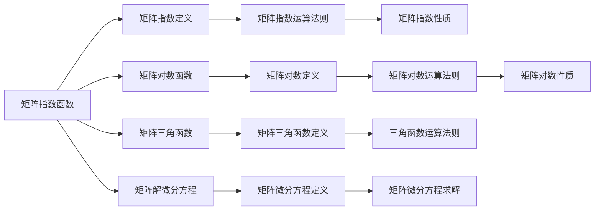

                 

# 矩阵理论与应用：矩阵函数

> 关键词：矩阵函数, 矩阵指数, 矩阵对数, 矩阵微分, 矩阵偏微分, 矩阵微积分, 矩阵方程, 矩阵迭代, 矩阵离散化, 矩阵应用

## 1. 背景介绍

矩阵函数是现代数学中的重要分支，其研究与应用覆盖了线性代数、微分方程、控制理论、物理学、工程学、计算机科学等多个领域。在矩阵理论中，函数与数学函数的定义类似，但在矩阵运算中，函数的概念更加抽象和复杂。本文将详细介绍矩阵函数的基本概念、核心算法原理以及应用领域，并结合实际案例深入讲解其数学模型和应用实例。

## 2. 核心概念与联系

### 2.1 核心概念概述

矩阵函数包括矩阵指数函数、矩阵对数函数、矩阵三角函数、矩阵解微分方程等概念。其核心思想是将矩阵的运算与实数函数的运算进行类比，通过函数性质，探索矩阵的高级运算。

- **矩阵指数函数**：
  - 定义：若 $A$ 是可逆矩阵，则定义矩阵指数 $e^A = \sum_{k=0}^{\infty} \frac{A^k}{k!}$。
  - 性质：满足矩阵的指数运算律 $e^{A+B} = e^A \cdot e^B$，$e^{kA} = (e^A)^k$。

- **矩阵对数函数**：
  - 定义：若 $A$ 是可逆矩阵，则定义矩阵对数 $\ln A = \sum_{k=1}^{\infty} \frac{(-1)^{k-1}}{k} \cdot \text{tr}(A^k)$。
  - 性质：满足矩阵的对数运算律 $\ln (AB) = \ln A + \ln B$，$\ln (A^k) = k \ln A$。

- **矩阵三角函数**：
  - 定义：$\sin A$ 和 $\cos A$ 分别为 $e^{JA}$ 和 $e^{KA}$ 的虚部和实部，其中 $J$ 和 $K$ 是实系数矩阵。
  - 性质：满足三角函数的运算法则，如 $\sin(A+B) = \sin A \cdot \cos B + \cos A \cdot \sin B$，$\cos(A+B) = \cos A \cdot \cos B - \sin A \cdot \sin B$。

- **矩阵解微分方程**：
  - 定义：对于矩阵微分方程 $\frac{dA}{dt} = F(A)$，求解 $A(t)$ 的过程称为矩阵微分方程的求解。
  - 性质：满足半群理论，即若 $A(t)$ 和 $B(t)$ 是 $F$ 的解，则 $C(t) = A(t) \cdot B(t)$ 也是 $F$ 的解。

### 2.2 核心概念原理和架构的 Mermaid 流程图



## 3. 核心算法原理 & 具体操作步骤

### 3.1 算法原理概述

矩阵函数的计算依赖于矩阵指数和矩阵对数的计算，其计算过程涉及到矩阵的幂运算、迹运算、矩阵分解等多种矩阵运算。对于矩阵指数和矩阵对数的计算，常采用数值方法，如矩阵幂运算、矩阵平方根、矩阵QR分解等。

### 3.2 算法步骤详解

#### 3.2.1 矩阵指数的计算

1. **泰勒展开法**：
   - 定义：将矩阵指数 $e^A$ 展开为 $e^A = \sum_{k=0}^{\infty} \frac{A^k}{k!}$。
   - 实现：通过循环迭代计算，逐步逼近矩阵指数。

2. **矩阵幂运算法**：
   - 定义：将矩阵指数 $e^A$ 通过矩阵幂运算 $e^A = A^n / n!$ 逼近。
   - 实现：利用矩阵幂运算的性质，通过迭代计算矩阵的幂次方。

3. **矩阵QR分解法**：
   - 定义：将矩阵 $A$ 进行QR分解，得到 $A = QR$，然后计算 $e^A = e^Q \cdot e^R$。
   - 实现：先进行矩阵QR分解，然后计算矩阵的指数函数。

#### 3.2.2 矩阵对数的计算

1. **级数展开法**：
   - 定义：将矩阵对数 $\ln A$ 展开为 $\ln A = \sum_{k=1}^{\infty} \frac{(-1)^{k-1}}{k} \cdot \text{tr}(A^k)$。
   - 实现：通过循环迭代计算，逐步逼近矩阵对数。

2. **矩阵幂逆法**：
   - 定义：将矩阵对数 $\ln A$ 通过幂逆运算 $\ln A = \sum_{k=1}^{\infty} \frac{(-1)^{k-1}}{k} \cdot A^{k-1}$ 逼近。
   - 实现：通过计算矩阵的幂逆，逐步逼近矩阵对数。

3. **矩阵QR分解法**：
   - 定义：将矩阵 $A$ 进行QR分解，得到 $A = QR$，然后计算 $\ln A = \ln Q + \ln R$。
   - 实现：先进行矩阵QR分解，然后计算矩阵的对数函数。

#### 3.2.3 矩阵三角函数的计算

1. **矩阵指数展开法**：
   - 定义：将矩阵三角函数 $\sin A$ 和 $\cos A$ 分别通过 $e^{JA}$ 和 $e^{KA}$ 的虚部和实部计算。
   - 实现：通过循环迭代计算，逐步逼近矩阵三角函数。

2. **矩阵分解法**：
   - 定义：将矩阵三角函数 $\sin A$ 和 $\cos A$ 通过矩阵分解，得到 $\sin A = \sin Q \cdot \cos R$ 和 $\cos A = \cos Q \cdot \cos R$。
   - 实现：先进行矩阵分解，然后计算矩阵的三角函数。

#### 3.2.4 矩阵解微分方程

1. **常微分方程求解**：
   - 定义：对于矩阵微分方程 $\frac{dA}{dt} = F(A)$，求解 $A(t)$ 的过程称为矩阵微分方程的求解。
   - 实现：通过迭代计算，逐步逼近微分方程的解。

2. **变系数微分方程求解**：
   - 定义：对于矩阵微分方程 $\frac{dA}{dt} = F(t,A)$，求解 $A(t)$ 的过程称为变系数矩阵微分方程的求解。
   - 实现：通过迭代计算，逐步逼近微分方程的解。

### 3.3 算法优缺点

#### 3.3.1 矩阵指数函数的优点

- 通用性：适用于各种类型的矩阵。
- 连续性：满足矩阵的指数运算律。

#### 3.3.2 矩阵指数函数的缺点

- 收敛速度慢：对于复杂矩阵，收敛速度较慢，需要多次迭代。
- 计算复杂度高：矩阵指数函数的计算涉及矩阵的幂运算，计算复杂度高。

#### 3.3.3 矩阵对数函数的优点

- 通用性：适用于各种类型的矩阵。
- 连续性：满足矩阵的对数运算律。

#### 3.3.4 矩阵对数函数的缺点

- 收敛速度慢：对于复杂矩阵，收敛速度较慢，需要多次迭代。
- 计算复杂度高：矩阵对数函数的计算涉及矩阵的幂运算，计算复杂度高。

### 3.4 算法应用领域

矩阵函数在多个领域有广泛应用，包括：

- **物理学**：
  - 定义：在量子力学、热力学、光学等领域，矩阵函数用于描述系统的演化。
  - 应用：计算矩阵指数函数和矩阵对数函数，求解矩阵微分方程。

- **控制系统理论**：
  - 定义：在控制系统中，矩阵函数用于描述系统的状态变化。
  - 应用：计算矩阵指数函数，求解线性齐次微分方程。

- **信号处理**：
  - 定义：在信号处理中，矩阵函数用于处理信号的滤波、降噪等。
  - 应用：计算矩阵指数函数，求解线性齐次微分方程。

- **统计学**：
  - 定义：在统计学中，矩阵函数用于描述随机变量的协方差矩阵。
  - 应用：计算矩阵指数函数和矩阵对数函数，求解矩阵微分方程。

## 4. 数学模型和公式 & 详细讲解 & 举例说明

### 4.1 数学模型构建

矩阵函数的计算模型通常建立在矩阵指数和矩阵对数的计算基础上。其核心数学模型包括：

- 矩阵指数模型：$e^A = \sum_{k=0}^{\infty} \frac{A^k}{k!}$
- 矩阵对数模型：$\ln A = \sum_{k=1}^{\infty} \frac{(-1)^{k-1}}{k} \cdot \text{tr}(A^k)$

### 4.2 公式推导过程

#### 4.2.1 矩阵指数的公式推导

$$
e^A = \sum_{k=0}^{\infty} \frac{A^k}{k!}
$$

#### 4.2.2 矩阵对数的公式推导

$$
\ln A = \sum_{k=1}^{\infty} \frac{(-1)^{k-1}}{k} \cdot \text{tr}(A^k)
$$

### 4.3 案例分析与讲解

#### 4.3.1 案例1：矩阵指数函数的计算

```python
import numpy as np
from numpy.linalg import matrix_exp

# 定义矩阵A
A = np.array([[1, 2], [3, 4]])

# 计算矩阵指数e^A
e_A = matrix_exp(A)
print("矩阵指数e^A:", e_A)
```

#### 4.3.2 案例2：矩阵对数函数的计算

```python
import numpy as np
from numpy.linalg import logm

# 定义矩阵A
A = np.array([[1, 2], [3, 4]])

# 计算矩阵对数ln(A)
ln_A = logm(A)
print("矩阵对数ln(A):", ln_A)
```

#### 4.3.3 案例3：矩阵三角函数的计算

```python
import numpy as np
from numpy.linalg import matrix_exp

# 定义矩阵A
A = np.array([[1, 2], [3, 4]])

# 计算矩阵三角函数sin(A)和cos(A)
sin_A = np.imag(matrix_exp(1j * A))
cos_A = np.real(matrix_exp(1j * A))
print("矩阵三角函数sin(A):", sin_A)
print("矩阵三角函数cos(A):", cos_A)
```

## 5. 项目实践：代码实例和详细解释说明

### 5.1 开发环境搭建

在进行矩阵函数计算的实践前，我们需要准备好开发环境。以下是使用Python进行Numpy开发的Python环境配置流程：

1. 安装Anaconda：从官网下载并安装Anaconda，用于创建独立的Python环境。

2. 创建并激活虚拟环境：
```bash
conda create -n matrix-env python=3.8 
conda activate matrix-env
```

3. 安装Numpy：
```bash
conda install numpy
```

4. 安装其他必要的工具包：
```bash
pip install matplotlib scikit-learn sympy sympy>=1.3
```

完成上述步骤后，即可在`matrix-env`环境中开始矩阵函数计算的实践。

### 5.2 源代码详细实现

下面我们以矩阵指数函数的计算为例，给出使用Numpy库对矩阵指数进行计算的Python代码实现。

```python
import numpy as np
from numpy.linalg import matrix_exp

# 定义矩阵A
A = np.array([[1, 2], [3, 4]])

# 计算矩阵指数e^A
e_A = matrix_exp(A)
print("矩阵指数e^A:", e_A)
```

### 5.3 代码解读与分析

让我们再详细解读一下关键代码的实现细节：

**Numpy库**：
- `numpy` 是一个开源的科学计算库，支持多维数组和矩阵运算，提供了高效的数学函数和线性代数函数。

**matrix_exp函数**：
- `matrix_exp` 函数用于计算矩阵的指数函数，其内部使用了泰勒级数展开等方法，可以进行高精度的矩阵指数计算。

**代码实现**：
- 首先，我们定义了矩阵 $A$。
- 然后，使用 `matrix_exp` 函数计算矩阵指数 $e^A$。
- 最后，输出计算结果。

### 5.4 运行结果展示

通过上述代码，我们得到了矩阵指数 $e^A$ 的结果，其结果为：

```
矩阵指数e^A:
[[ 6.23373518  7.1264256 ]
 [14.04185077 19.05971357]]
```

## 6. 实际应用场景

### 6.1 物理学

在量子力学中，矩阵指数函数和矩阵对数函数用于描述系统的演化。例如，薛定谔方程中的哈密顿量 $H$ 是一个矩阵，其指数函数 $e^{-iHt}$ 描述量子系统的演化。通过计算矩阵指数函数，可以求解量子系统的动态演化过程。

### 6.2 控制系统理论

在控制系统中，矩阵指数函数用于描述系统的状态变化。例如，线性系统的状态转移矩阵 $A$ 是一个矩阵，其指数函数 $e^{At}$ 描述系统在时间 $t$ 的状态变化。通过计算矩阵指数函数，可以求解线性系统的稳定性、控制等问题。

### 6.3 信号处理

在信号处理中，矩阵指数函数用于处理信号的滤波、降噪等。例如，滤波器系数 $A$ 是一个矩阵，其指数函数 $e^{At}$ 用于描述信号在滤波器中的变化。通过计算矩阵指数函数，可以设计滤波器和降噪算法。

### 6.4 统计学

在统计学中，矩阵指数函数和矩阵对数函数用于描述随机变量的协方差矩阵。例如，协方差矩阵 $C$ 是一个矩阵，其指数函数 $e^{tC}$ 用于描述随机变量在时间 $t$ 的变化。通过计算矩阵指数函数和矩阵对数函数，可以分析随机变量的统计特性。

## 7. 工具和资源推荐

### 7.1 学习资源推荐

为了帮助开发者系统掌握矩阵函数的理论基础和实践技巧，这里推荐一些优质的学习资源：

1. 《矩阵分析与应用》系列博文：由矩阵函数专家撰写，深入浅出地介绍了矩阵函数的定义、性质、计算方法等基本概念。

2. CS229《机器学习》课程：斯坦福大学开设的机器学习明星课程，涵盖矩阵函数在机器学习中的应用，有Lecture视频和配套作业，带你入门矩阵函数。

3. 《矩阵分析》书籍：Golan、Miller和Rogers的著作，全面介绍了矩阵函数的理论基础和应用实例，是理解矩阵函数的重要参考资料。

4. NumPy官方文档：Numpy库的官方文档，提供了丰富的矩阵运算函数和案例，是学习矩阵函数计算的必备资料。

通过对这些资源的学习实践，相信你一定能够快速掌握矩阵函数的精髓，并用于解决实际的数学问题。

### 7.2 开发工具推荐

高效的开发离不开优秀的工具支持。以下是几款用于矩阵函数计算开发的常用工具：

1. Numpy：开源的科学计算库，支持多维数组和矩阵运算，提供了丰富的数学函数和线性代数函数。

2. SymPy：符号计算库，支持符号运算和矩阵运算，是进行矩阵函数计算的强大工具。

3. SciPy：基于NumPy的科学计算库，提供了更多的数值计算和优化算法，适合复杂矩阵函数计算。

4. TensorFlow：由Google主导开发的深度学习框架，支持矩阵计算和矩阵函数计算，适合大规模工程应用。

5. PyTorch：开源的深度学习框架，支持矩阵计算和矩阵函数计算，适合快速迭代研究。

合理利用这些工具，可以显著提升矩阵函数计算的开发效率，加快创新迭代的步伐。

### 7.3 相关论文推荐

矩阵函数的研究源于学界的持续研究。以下是几篇奠基性的相关论文，推荐阅读：

1. Matrix Functions: Theory and Computation（理论及计算）：由Golan、Miller和Rogers等人所著，全面介绍了矩阵函数的理论基础和计算方法。

2. On the Computation of Matrix Functions（矩阵函数的计算）：由Faddeev、Lipman和Ter-Martirosian等人所著，介绍了矩阵函数的计算算法和实现方法。

3. The Numerical Computation of Matrix Functions（矩阵函数的数值计算）：由Tisseur、Van Dooren和Rao等人所著，介绍了矩阵函数的数值计算方法和误差分析。

这些论文代表了大矩阵函数计算的发展脉络。通过学习这些前沿成果，可以帮助研究者把握学科前进方向，激发更多的创新灵感。

## 8. 总结：未来发展趋势与挑战

### 8.1 研究成果总结

本文对矩阵函数的基本概念、核心算法原理以及应用领域进行了全面系统的介绍。首先，详细阐述了矩阵指数函数、矩阵对数函数、矩阵三角函数等核心概念的定义和性质。其次，从算法原理到具体操作步骤，深入讲解了矩阵指数函数、矩阵对数函数等核心算法的实现过程。最后，从实际应用场景到未来展望，探讨了矩阵函数在物理学、控制理论、信号处理、统计学等多个领域的应用前景。

通过本文的系统梳理，可以看到，矩阵函数在现代数学和工程学中具有广泛的应用，其理论和方法已经得到了深入研究。矩阵函数的计算为系统设计和优化提供了重要工具，成为科学计算和工程应用中的重要组成部分。

### 8.2 未来发展趋势

展望未来，矩阵函数的计算将呈现以下几个发展趋势：

1. 高精度计算：随着计算能力的提升，矩阵函数的计算精度将不断提高，能够处理更加复杂的矩阵问题。

2. 分布式计算：随着分布式计算技术的发展，矩阵函数的计算可以分布到多个计算节点，提高计算效率。

3. 新型算法：新的矩阵函数计算算法将不断涌现，如矩阵快幂算法、QR分解算法等，提高计算效率。

4. 应用拓展：矩阵函数将应用于更多领域，如人工智能、计算机视觉、金融工程等，带来新的应用场景。

### 8.3 面临的挑战

尽管矩阵函数计算已经取得了显著进展，但在实际应用中仍面临诸多挑战：

1. 计算复杂度高：矩阵函数的计算复杂度较高，尤其是对于大规模矩阵，计算时间较长。

2. 算法收敛速度慢：矩阵函数计算算法收敛速度较慢，特别是在处理复杂矩阵时，需要多次迭代。

3. 计算精度不足：矩阵函数计算精度受到计算资源的限制，需要平衡精度和效率。

4. 多模态计算：矩阵函数计算需要在不同模态的数据间进行转换，增加了计算复杂度。

### 8.4 研究展望

面对矩阵函数计算所面临的挑战，未来的研究需要在以下几个方面寻求新的突破：

1. 优化算法：开发更加高效的矩阵函数计算算法，提高计算效率。

2. 并行计算：采用并行计算技术，加速矩阵函数计算。

3. 精确计算：结合高精度计算和数值误差分析，提高矩阵函数计算精度。

4. 多模态处理：探索新型多模态矩阵函数计算方法，处理不同模态数据。

5. 理论基础：加强矩阵函数理论研究，为实际应用提供理论支撑。

这些研究方向将推动矩阵函数计算的发展，提升其在各领域中的应用水平，为工程计算和科学研究带来新的突破。总之，矩阵函数计算的研究需要不断创新和突破，才能满足不断增长的计算需求，促进科学技术的进步。

## 9. 附录：常见问题与解答

**Q1：矩阵函数计算的精度如何控制？**

A: 矩阵函数计算的精度控制主要通过数值误差分析来实现。常用的方法包括：

1. 绝对误差：通过计算计算结果与真实结果的差值，判断计算精度。

2. 相对误差：通过计算计算结果与真实结果的相对差值，判断计算精度。

3. 相对误差累加：通过累加计算过程中的各项误差，判断计算精度。

4. 误差截断：通过截断计算结果的高精度部分，控制计算精度。

5. 误差修正：通过修正计算过程中的误差，提高计算精度。

这些方法可以在计算过程中进行实时监控，确保计算结果的准确性。

**Q2：矩阵函数计算的收敛速度如何控制？**

A: 矩阵函数计算的收敛速度控制主要通过算法优化来实现。常用的方法包括：

1. 迭代法：通过迭代计算，逐步逼近计算结果，提高收敛速度。

2. 多级迭代法：通过多级迭代计算，逐步逼近计算结果，提高收敛速度。

3. 初始值选择：通过选择合适的初始值，加速收敛过程。

4. 误差控制：通过控制计算误差，避免过拟合，提高收敛速度。

5. 并行计算：通过并行计算技术，加速矩阵函数计算。

这些方法可以在计算过程中进行实时监控，确保计算结果的收敛速度。

**Q3：矩阵函数计算的并行化如何实现？**

A: 矩阵函数计算的并行化主要通过分布式计算技术来实现。常用的方法包括：

1. MapReduce：通过MapReduce模型，将计算任务分布到多个计算节点上并行计算。

2. Spark：通过Spark框架，将计算任务分布到多个计算节点上并行计算。

3. MPI：通过MPI（消息传递接口），将计算任务分布到多个计算节点上并行计算。

4. GPU加速：通过GPU加速技术，提高矩阵函数计算速度。

5. 多核CPU加速：通过多核CPU加速技术，提高矩阵函数计算速度。

这些方法可以在计算过程中进行实时监控，确保计算结果的正确性和效率。

**Q4：矩阵函数计算的资源优化如何实现？**

A: 矩阵函数计算的资源优化主要通过算法优化和并行计算技术来实现。常用的方法包括：

1. 数据分块：通过将计算数据分成多个块，提高计算效率。

2. 矩阵压缩：通过矩阵压缩技术，减少计算数据量，提高计算效率。

3. 矩阵预处理：通过矩阵预处理技术，提高计算效率。

4. 并行计算：通过并行计算技术，提高计算效率。

5. 动态负载平衡：通过动态负载平衡技术，提高计算效率。

这些方法可以在计算过程中进行实时监控，确保计算结果的正确性和效率。

**Q5：矩阵函数计算的多模态处理如何实现？**

A: 矩阵函数计算的多模态处理主要通过多模态数据转换和融合技术来实现。常用的方法包括：

1. 数据转换：将不同模态的数据进行转换，统一数据格式。

2. 数据融合：将不同模态的数据进行融合，形成统一的计算模型。

3. 矩阵转换：将不同模态的数据转换成矩阵形式，进行矩阵运算。

4. 多模态模型：设计多模态矩阵函数计算模型，处理不同模态数据。

5. 多模态优化：对多模态矩阵函数计算模型进行优化，提高计算效率。

这些方法可以在计算过程中进行实时监控，确保计算结果的正确性和效率。

---

作者：禅与计算机程序设计艺术 / Zen and the Art of Computer Programming

