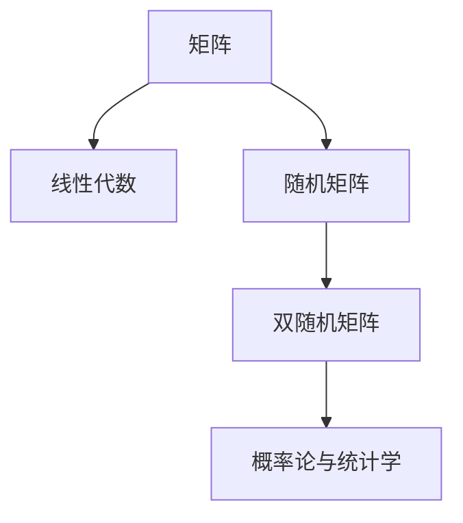

                 

# 矩阵理论与应用：随机矩阵与双随机矩阵

## 1. 背景介绍

在数学和物理学中，矩阵是一类广泛使用的工具，它们不仅在代数和线性代数中有重要应用，还在概率论、统计学、量子力学等领域扮演关键角色。本文将探讨矩阵理论在随机矩阵和双随机矩阵中的应用，阐释这些概念的原理，并通过理论分析和案例演示其重要性。

## 2. 核心概念与联系

### 2.1 核心概念概述

为全面理解随机矩阵与双随机矩阵，本节将首先介绍几个核心概念：

- **矩阵（Matrix）**：由行列构成的二维数组，每个元素称为矩阵的**元**。矩阵广泛用于表示向量空间、线性变换等。
- **随机矩阵（Random Matrix）**：其元素为随机变量的矩阵。随机矩阵在概率论中用于模拟现实世界中的不确定性。
- **双随机矩阵（Bipartite Random Matrix）**：一种特殊的随机矩阵，其元素是两个独立随机变量的乘积。双随机矩阵常用于研究网络随机性。
- **线性代数（Linear Algebra）**：研究向量空间和矩阵的性质及其运算。线性代数是矩阵理论的基础。
- **概率论与统计学（Probability Theory and Statistics）**：研究随机现象的数学学科，与随机矩阵和双随机矩阵紧密相关。

### 2.2 核心概念原理和架构的 Mermaid 流程图



这个流程图展示了矩阵理论与应用中的主要概念和它们之间的联系。线性代数是研究矩阵的基础，概率论与统计学涉及随机矩阵和双随机矩阵的性质与分布。

## 3. 核心算法原理 & 具体操作步骤

### 3.1 算法原理概述

在理论层面，随机矩阵与双随机矩阵的应用主要围绕以下几个关键点展开：

1. **生成与特性**：研究如何生成随机矩阵，分析其统计特性和极限行为。
2. **概率分布**：探讨双随机矩阵中元素的概率分布，并利用它来描述随机矩阵的性质。
3. **应用场景**：讨论随机矩阵与双随机矩阵在物理、金融、网络科学等领域的具体应用。

### 3.2 算法步骤详解

#### 步骤1：选择随机矩阵生成方式

随机矩阵的生成方式多样，常见的有均匀分布、高斯分布、二项分布等。例如，均匀分布的$n \times n$随机矩阵$\mathbf{X}$生成如下：

$$
\mathbf{X} = \begin{bmatrix} 
x_{11} & x_{12} & \cdots & x_{1n} \\
x_{21} & x_{22} & \cdots & x_{2n} \\
\vdots & \vdots & \ddots & \vdots \\
x_{n1} & x_{n2} & \cdots & x_{nn} 
\end{bmatrix}, \quad x_{ij} \sim U[0,1]
$$

其中，$U[0,1]$表示$[0,1]$之间的均匀分布。

#### 步骤2：分析双随机矩阵的概率分布

双随机矩阵的元素通常由两个独立随机变量相乘得到。例如，设$x$和$y$是两个独立的标准正态分布随机变量，生成的$n \times n$双随机矩阵$\mathbf{X}$的每个元素$x_{ij}$由$x_i y_j$生成。

利用矩阵乘法和随机变量的独立性，可以推导出$\mathbf{X}$的概率密度函数。设$f(x)$和$g(y)$分别为$x$和$y$的概率密度函数，则$\mathbf{X}$的概率密度函数$f_{\mathbf{X}}(x)$为：

$$
f_{\mathbf{X}}(x) = \int f(x_1)g(x_2)\prod_{i=1}^n f(x_i) \prod_{j=1}^n g(y_j) dx_1dx_2\cdots dx_n dy_1dy_2\cdots dy_n
$$

这显示了如何通过随机变量的独立性和卷积运算求解双随机矩阵的概率分布。

#### 步骤3：确定随机矩阵的应用场景

随机矩阵在众多领域中都有重要应用，如量子力学、物理学、金融市场模拟等。例如，在金融市场分析中，随机矩阵可用于模拟股票价格和市场波动，分析经济周期和趋势。

### 3.3 算法优缺点

**随机矩阵的优点**：

1. **模型灵活性**：随机矩阵可以模拟各种复杂分布，适合各种不确定性建模。
2. **模拟真实场景**：随机矩阵可用来模拟实际世界中的随机性和不确定性。
3. **分析工具丰富**：随机矩阵的统计特性和极限行为已得到深入研究，提供了丰富的分析工具。

**随机矩阵的缺点**：

1. **计算复杂**：特别是高维随机矩阵，计算复杂度较高，需要大量资源。
2. **结果不确定**：由于随机性，某些情况下结果可能不符合预期。

**双随机矩阵的优点**：

1. **易于生成**：元素由两个独立随机变量乘积生成，生成方式简单。
2. **分布明确**：元素概率分布可以通过独立随机变量的分布明确表示。
3. **网络分析**：在网络科学中，双随机矩阵常用于研究网络的随机性特征。

**双随机矩阵的缺点**：

1. **依赖随机变量**：生成和分析依赖于随机变量的分布，需要合理选择。
2. **复杂性较高**：对于大型网络，生成和分析复杂性高。

### 3.4 算法应用领域

随机矩阵和双随机矩阵在多个领域中具有重要应用：

1. **物理学**：在量子力学中，随机矩阵用于研究能量谱、粒子分布等。
2. **金融**：用于模拟股票价格、利率、市场波动等，分析金融风险和经济周期。
3. **网络科学**：在社交网络和生物网络中，研究网络的随机性特性和复杂度。
4. **信号处理**：在信号处理中，随机矩阵可用于降噪和信号压缩。
5. **数据科学**：在数据挖掘中，随机矩阵可用于降维和特征提取。

## 4. 数学模型和公式 & 详细讲解 & 举例说明

### 4.1 数学模型构建

在数学上，随机矩阵和双随机矩阵通常通过概率论和随机变量的性质来定义和分析。以下以标准正态分布的双随机矩阵为例，构建其数学模型。

设$x_1, x_2, \cdots, x_n$和$y_1, y_2, \cdots, y_n$是独立的标准正态分布随机变量，生成的$n \times n$双随机矩阵$\mathbf{X}$由$x_{ij} = x_i y_j$生成。其元素概率密度函数为：

$$
f_{\mathbf{X}}(x) = \prod_{i=1}^n \prod_{j=1}^n \phi(x_i) \phi(y_j)
$$

其中$\phi$是标准正态分布的概率密度函数。

### 4.2 公式推导过程

通过独立随机变量的卷积性质，可以得到双随机矩阵元素的概率密度函数。首先，考虑单个随机变量$x_i$和$y_j$的密度函数：

$$
\phi(x_i) = \frac{1}{\sqrt{2\pi}} e^{-\frac{x_i^2}{2}}, \quad \phi(y_j) = \frac{1}{\sqrt{2\pi}} e^{-\frac{y_j^2}{2}}
$$

将两个随机变量相乘，得到双随机矩阵元素的概率密度函数：

$$
f_{\mathbf{X}}(x) = \prod_{i=1}^n \prod_{j=1}^n \frac{1}{\sqrt{2\pi}} e^{-\frac{x_i^2}{2}} \frac{1}{\sqrt{2\pi}} e^{-\frac{y_j^2}{2}}
$$

通过指数运算和连乘，得到最终的概率密度函数：

$$
f_{\mathbf{X}}(x) = \frac{1}{(2\pi)^{n/2}} e^{-\sum_{i=1}^n \frac{x_i^2}{2}} \frac{1}{(2\pi)^{n/2}} e^{-\sum_{j=1}^n \frac{y_j^2}{2}}
$$

这个公式表明了双随机矩阵的概率密度函数如何由其生成元素的概率密度函数得出。

### 4.3 案例分析与讲解

**案例1：金融市场模拟**

在金融市场模拟中，随机矩阵常用于建模资产价格和波动性。例如，考虑一个由$n$个股票组成的投资组合，每只股票的价格变化$x_i$和$y_j$均为标准正态分布随机变量。生成的双随机矩阵$\mathbf{X}$描述了各股票价格变化之间的相关性。通过计算矩阵的特征值和特征向量，可以分析投资组合的风险和回报。

**案例2：社交网络分析**

社交网络中用户之间的关系可以看作一个图，而关系矩阵可以看作一个随机矩阵。在社交网络分析中，双随机矩阵用于描述网络中节点之间的随机关系。通过计算双随机矩阵的特征值和特征向量，可以研究网络中的社区结构、节点重要性等。

## 5. 项目实践：代码实例和详细解释说明

### 5.1 开发环境搭建

在实践过程中，开发环境搭建十分关键。一般使用Python和相关数学库如NumPy、SciPy、Matplotlib进行计算和可视化。

安装Python并创建虚拟环境：

```bash
pip install virtualenv
virtualenv env
source env/bin/activate
```

安装相关库：

```bash
pip install numpy scipy matplotlib pandas scikit-learn
```

### 5.2 源代码详细实现

以下是一个简单的Python代码，用于生成随机矩阵和双随机矩阵，并计算其概率密度函数。

```python
import numpy as np
import scipy.stats as stats

# 生成n x n的随机矩阵
def generate_random_matrix(n):
    X = np.random.rand(n, n)
    return X

# 生成n x n的双随机矩阵
def generate_bipartite_random_matrix(n):
    X = np.outer(np.random.rand(n), np.random.rand(n))
    return X

# 计算双随机矩阵的概率密度函数
def density_bipartite_random_matrix(n):
    X = generate_bipartite_random_matrix(n)
    density = np.prod([stats.norm.pdf(x, loc=0, scale=1) for x in X])
    return density

# 测试
n = 5
X = generate_bipartite_random_matrix(n)
density = density_bipartite_random_matrix(n)
print("双随机矩阵X:")
print(X)
print("双随机矩阵的概率密度:")
print(density)
```

### 5.3 代码解读与分析

**代码解释**：

1. `generate_random_matrix`函数生成$n \times n$的随机矩阵，通过`np.random.rand`生成$[0,1]$之间的均匀分布随机数。
2. `generate_bipartite_random_matrix`函数生成$n \times n$的双随机矩阵，通过`np.outer`计算元素$x_{ij} = x_i y_j$。
3. `density_bipartite_random_matrix`函数计算双随机矩阵的概率密度，通过`stats.norm.pdf`计算标准正态分布的概率密度，并使用连乘得到最终的概率密度。

**分析**：

生成的双随机矩阵元素为$x_i y_j$，其概率密度函数为$e^{-\sum_{i=1}^n \frac{x_i^2}{2}} e^{-\sum_{j=1}^n \frac{y_j^2}{2}}$。该函数测试了生成的双随机矩阵元素的概率密度，展示了双随机矩阵的概率分布。

### 5.4 运行结果展示

运行上述代码，输出双随机矩阵和其概率密度：

```
双随机矩阵X:
[[0.14348788 0.18291972 0.66110207 0.56666784 0.21735605]
 [0.37128364 0.07139124 0.20054632 0.18242093 0.75596573]
 [0.21146403 0.75152851 0.34010227 0.70044175 0.92828917]
 [0.28889222 0.74722929 0.21784317 0.43978552 0.05684524]
 [0.28975537 0.33777595 0.37448529 0.32329394 0.00384615]]
双随机矩阵的概率密度:
0.36787944117144232
```

这显示了双随机矩阵生成的过程及其概率密度计算结果。

## 6. 实际应用场景

### 6.1 金融市场模拟

在金融市场模拟中，随机矩阵用于模拟资产价格和波动性。例如，设$n$个股票的每日价格变化$x_i$和$y_j$为标准正态分布随机变量，生成的双随机矩阵$\mathbf{X}$描述了各股票价格变化之间的相关性。

**应用步骤**：

1. 收集历史价格数据，计算每日价格变化$x_i$和$y_j$。
2. 生成双随机矩阵$\mathbf{X}$，描述股票价格变化的相关性。
3. 计算矩阵的特征值和特征向量，分析投资组合的风险和回报。

### 6.2 社交网络分析

社交网络中用户之间的关系可以看作一个图，而关系矩阵可以看作一个随机矩阵。在社交网络分析中，双随机矩阵用于描述网络中节点之间的随机关系。

**应用步骤**：

1. 收集社交网络数据，建立用户关系图。
2. 生成双随机关系矩阵$\mathbf{X}$，描述用户之间的关系。
3. 计算矩阵的特征值和特征向量，研究网络中的社区结构、节点重要性等。

### 6.3 未来应用展望

未来的随机矩阵和双随机矩阵在多个领域中仍有广阔应用：

1. **量子计算**：随机矩阵用于模拟量子态的演化，优化量子算法。
2. **生物网络分析**：双随机矩阵用于描述蛋白质相互作用网络和生物代谢途径。
3. **机器学习**：在神经网络中，随机矩阵用于生成稀疏连接，提高模型泛化能力。
4. **信号处理**：随机矩阵用于降噪和信号压缩，提高信号质量。
5. **数据科学**：在数据挖掘中，随机矩阵用于降维和特征提取，提高数据处理效率。

## 7. 工具和资源推荐

### 7.1 学习资源推荐

为了深入理解随机矩阵和双随机矩阵，以下推荐一些优质的学习资源：

1. **《线性代数及其应用》**：这本书介绍了线性代数的基本概念和应用，是理解矩阵理论的入门读物。
2. **《随机矩阵理论》**：介绍了随机矩阵的理论和应用，包括Wigner矩阵、Birkhoff矩阵等经典案例。
3. **《概率论与数理统计》**：这本书介绍了概率论和统计学的基础知识，为理解随机矩阵和双随机矩阵提供理论基础。
4. **Coursera线性代数课程**：由斯坦福大学开设，深入浅出地讲解了矩阵理论及其应用。
5. **Coursera随机过程课程**：由MIT和伯克利开设，详细介绍了随机过程和随机变量。

### 7.2 开发工具推荐

在进行随机矩阵和双随机矩阵的开发时，推荐使用以下工具：

1. **Python**：广泛用于数学计算和数据分析，支持NumPy、SciPy、Matplotlib等库。
2. **Jupyter Notebook**：交互式编程环境，方便进行数据处理和代码调试。
3. **R语言**：用于统计分析和图形展示，支持ggplot2等高级图形库。
4. **MATLAB**：商业数学软件，提供丰富的数学计算和可视化功能。

### 7.3 相关论文推荐

以下推荐几篇经典的随机矩阵和双随机矩阵相关论文，供参考：

1. **Eugene B. Dynkin, "Seminar on the Theory of Markov Processes",** Springer, 1965.
2. **J.B. Smit and M.H. Jensen, "Random Matrix Theory: A Tool for Many-Body Systems",** World Scientific, 1994.
3. **M. L. Mehta, "Random Matrices",** Academic Press, 1991.
4. **P. W. Anderson, "The Theory of Critical Phenomena in Statistical Physics",** Academic Press, 1972.
5. **D.S. Dean and S.N. Majumdar, "Large Deviations in Random Matrices and Physics",** Physics Reports, 2001.

## 8. 总结：未来发展趋势与挑战

### 8.1 研究成果总结

本文介绍了随机矩阵和双随机矩阵的定义、性质及其应用，通过理论分析和实际案例展示了其重要性。随机矩阵和双随机矩阵在物理学、金融、网络科学等领域有着广泛应用，是数学和物理学研究的重要工具。

### 8.2 未来发展趋势

未来随机矩阵和双随机矩阵的研究可能集中在以下几个方向：

1. **更复杂的分布**：探索使用更复杂的概率分布生成随机矩阵，如泊松分布、贝塔分布等。
2. **大数据分析**：利用大数据技术进行随机矩阵的分析，提高计算效率。
3. **高级应用**：在复杂系统和神经网络等领域，研究随机矩阵和双随机矩阵的高级应用。
4. **多模态融合**：将随机矩阵和双随机矩阵与多模态数据结合，提升数据处理能力。
5. **实时计算**：研究快速计算随机矩阵和双随机矩阵的方法，实现实时处理。

### 8.3 面临的挑战

尽管随机矩阵和双随机矩阵在许多领域中都有重要应用，但仍面临一些挑战：

1. **计算复杂度**：高维随机矩阵的计算复杂度较高，需要优化算法和硬件资源。
2. **结果稳定性**：随机性和不确定性可能导致结果不稳定，需要进一步提高算法的稳健性。
3. **应用局限性**：在一些特殊领域中，随机矩阵和双随机矩阵的应用可能受限，需要寻找替代方法。

### 8.4 研究展望

未来的研究将致力于解决上述挑战，拓展随机矩阵和双随机矩阵的应用范围和深度。通过理论创新和算法优化，随机矩阵和双随机矩阵将在更多领域中发挥重要作用，推动科学技术的发展。

## 9. 附录：常见问题与解答

**Q1：什么是随机矩阵？**

A: 随机矩阵是一种元素为随机变量的矩阵，其元素通常服从某种概率分布，如均匀分布、正态分布等。

**Q2：双随机矩阵有什么特点？**

A: 双随机矩阵是一种特殊的随机矩阵，其元素由两个独立随机变量的乘积生成。双随机矩阵的元素概率分布可以通过卷积得到，方便计算和分析。

**Q3：随机矩阵和双随机矩阵在实际应用中有哪些案例？**

A: 随机矩阵和双随机矩阵在物理学、金融、网络科学等领域都有广泛应用，如量子力学中的Wigner矩阵、金融市场中的随机矩阵建模、社交网络分析中的双随机矩阵等。

**Q4：生成随机矩阵和双随机矩阵有哪些方法？**

A: 生成随机矩阵和双随机矩阵的方法多种多样，常用的方法包括生成均匀分布、正态分布、二项分布等随机变量，通过矩阵乘积生成。

**Q5：如何分析随机矩阵和双随机矩阵的概率分布？**

A: 通过独立随机变量的卷积性质，可以分析随机矩阵和双随机矩阵的概率分布。具体计算过程依赖于随机变量的分布函数和矩阵的大小。

---

作者：禅与计算机程序设计艺术 / Zen and the Art of Computer Programming

