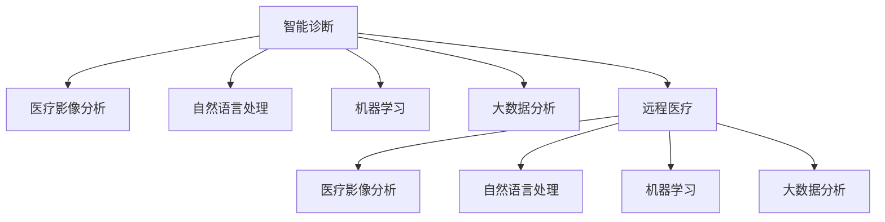

                 

# 硅谷医疗健康:智能诊断与远程医疗

## 1. 背景介绍

### 1.1 问题由来
近年来，随着人工智能技术的飞速发展，医疗健康领域也在发生着革命性的变化。尤其是智能诊断和远程医疗技术，正在逐步改变传统的医疗服务模式。硅谷作为全球科技创新的中心，汇聚了大量顶尖的AI企业和技术人才，为智能诊断和远程医疗的发展提供了强大的技术支持。

智能诊断和远程医疗技术，通过利用大数据、深度学习和自然语言处理等前沿技术，实现医疗数据的高效处理和分析，以及医疗服务的远程获取，不仅提升了医疗效率，也降低了医疗成本，改善了患者的健康体验。在硅谷，已有许多公司通过创新技术，推出了诸多智能诊断和远程医疗的解决方案，为全球医疗健康产业带来了深远影响。

### 1.2 问题核心关键点
智能诊断和远程医疗的核心在于通过AI技术实现医疗服务的智能化和远程化。其关键点包括：
- **数据驱动**：通过收集、分析和利用大量的医疗数据，提升诊断的准确性和效率。
- **智能分析**：运用深度学习、自然语言处理等技术，实现对医疗影像、病历、症状描述等非结构化数据的智能分析。
- **远程交互**：通过互联网和移动设备，实现医生与患者之间的远程沟通，提供远程诊断和治疗服务。
- **决策支持**：为医生提供实时的诊断建议和参考信息，辅助医生做出更准确的决策。

这些关键点构成了智能诊断和远程医疗技术的基石，推动着医疗健康行业的数字化转型。

### 1.3 问题研究意义
智能诊断和远程医疗技术的研究和应用，对于改善全球医疗资源分配不均、提升医疗服务质量和效率、降低医疗成本具有重要意义。通过硅谷的科技创新，智能诊断和远程医疗技术有望在全球范围内实现普及，为医疗健康事业带来质的飞跃。

1. **提高医疗效率**：智能诊断技术可以快速处理大量的医疗数据，辅助医生快速诊断，提升诊断效率。
2. **降低医疗成本**：远程医疗技术使得患者可以在家中或偏远地区获得医疗服务，减少了医疗出行的成本和时间。
3. **改善患者体验**：智能诊断和远程医疗技术使得患者能够获得更加便捷、个性化的医疗服务，提升了整体的健康体验。
4. **推动医疗创新**：通过与大数据、AI等前沿技术结合，智能诊断和远程医疗技术不断推动医疗服务的创新，为医疗健康产业注入新的活力。

## 2. 核心概念与联系

### 2.1 核心概念概述

为了更好地理解智能诊断和远程医疗技术的原理和应用，本节将介绍几个密切相关的核心概念：

- **智能诊断**：利用人工智能技术对患者的健康数据进行分析，快速准确地诊断疾病。
- **远程医疗**：通过互联网和移动设备，实现医生与患者之间的远程沟通，提供诊断和治疗服务。
- **医疗影像分析**：利用深度学习技术对医疗影像数据进行智能分析，辅助诊断。
- **自然语言处理**：对患者的症状描述、病历等文本数据进行分析和理解，辅助诊断。
- **机器学习**：通过训练模型，从历史医疗数据中学习疾病诊断和预测的知识。
- **大数据分析**：对大规模医疗数据进行收集、分析和应用，提升医疗服务的决策支持能力。

这些概念之间的逻辑关系可以通过以下Mermaid流程图来展示：



这个流程图展示了你智能诊断和远程医疗技术的核心概念及其之间的关系：

1. 智能诊断技术可以综合利用医疗影像、自然语言处理、机器学习和大数据分析等技术，实现对疾病的快速准确诊断。
2. 远程医疗技术通过互联网和移动设备，使得医生能够实时获取患者的健康数据和病历，进行远程诊断和治疗。
3. 医疗影像分析、自然语言处理、机器学习和大数据分析等技术在远程医疗中均有广泛应用，进一步提升远程医疗的诊断和治疗能力。

## 3. 核心算法原理 & 具体操作步骤

### 3.1 算法原理概述

智能诊断和远程医疗技术的核心算法原理主要包括深度学习、自然语言处理、计算机视觉等前沿技术。这些技术通过复杂的数据处理和模型训练，实现了对医疗数据的智能分析和诊断。

#### 3.1.1 深度学习

深度学习在智能诊断和远程医疗中主要应用于医疗影像分析、症状识别、诊断预测等场景。通过训练大规模的神经网络模型，深度学习能够从大量医疗数据中学习到复杂的特征表示，从而实现对医疗数据的智能分析和诊断。

#### 3.1.2 自然语言处理

自然语言处理技术在智能诊断中主要应用于患者症状描述的理解和病历数据的分析。通过对非结构化文本数据的处理和分析，自然语言处理技术能够从患者描述的症状中提取关键信息，辅助医生进行诊断。

#### 3.1.3 计算机视觉

计算机视觉技术在智能诊断中主要应用于医疗影像的分析和识别。通过对医疗影像的深度学习处理，计算机视觉技术能够自动检测和识别出病变区域，提供诊断支持。

### 3.2 算法步骤详解

智能诊断和远程医疗技术的实现一般包括以下几个关键步骤：

**Step 1: 数据收集与预处理**
- 收集医疗影像、病历、症状描述等医疗数据。
- 对数据进行清洗、去噪和标准化处理，确保数据的质量和一致性。

**Step 2: 模型训练与优化**
- 选择适合的深度学习模型（如卷积神经网络CNN、循环神经网络RNN、Transformer等）。
- 利用医疗数据进行模型训练，通过反向传播等算法优化模型参数。
- 应用正则化技术（如L2正则、Dropout等），防止模型过拟合。

**Step 3: 模型应用与评估**
- 将训练好的模型应用于新的医疗数据中，进行疾病诊断和预测。
- 利用测试集评估模型的性能，计算准确率、召回率、F1分数等指标。
- 根据评估结果调整模型参数，进一步提升模型效果。

**Step 4: 部署与集成**
- 将训练好的模型部署到服务器或移动设备上，提供诊断和预测服务。
- 集成到医院的HIS系统或远程医疗平台中，实现与电子病历的交互和数据共享。

### 3.3 算法优缺点

智能诊断和远程医疗技术具有以下优点：
1. **高效准确**：深度学习和大数据分析等技术能够快速处理大量医疗数据，提供高效准确的诊断和治疗建议。
2. **成本低廉**：相比于传统医疗服务，智能诊断和远程医疗减少了人力和时间成本，提高了医疗服务的普及率。
3. **方便便捷**：患者可以在家中或偏远地区获取医疗服务，减少了医疗出行的时间和成本。
4. **提升体验**：智能诊断和远程医疗技术提供了更加个性化和便捷的医疗服务，提升了患者体验。

同时，这些技术也存在一些局限性：
1. **数据隐私问题**：医疗数据涉及隐私，数据收集和传输过程中需要严格保护患者隐私。
2. **模型可靠性**：模型依赖于训练数据的质量，模型偏差可能导致误诊和漏诊。
3. **技术门槛高**：深度学习和计算机视觉等技术需要较高的技术门槛，推广和应用需要专业的技术支持。
4. **依赖设备**：远程医疗技术依赖互联网和移动设备，设备性能和网络稳定性对诊断和治疗效果有较大影响。

尽管存在这些局限性，但智能诊断和远程医疗技术在实际应用中已经展现出了巨大的潜力和优势，为医疗健康产业带来了深远影响。

### 3.4 算法应用领域

智能诊断和远程医疗技术已经在多个领域得到了广泛应用，例如：

- **智能影像诊断**：通过深度学习技术对医疗影像进行智能分析，辅助医生进行疾病诊断和预测。
- **智能症状识别**：利用自然语言处理技术对患者的症状描述进行分析和理解，辅助医生进行诊断和治疗。
- **远程医疗咨询**：通过互联网和移动设备，实现医生与患者之间的远程沟通，提供诊断和治疗服务。
- **慢性病管理**：利用智能监测设备收集患者的健康数据，通过机器学习技术进行分析，提供个性化的健康管理建议。
- **健康监测与预警**：利用物联网技术收集患者的生理数据，通过机器学习技术进行分析和预测，实现健康状态的实时监测和预警。

除了上述这些经典应用外，智能诊断和远程医疗技术还在更多场景中得到创新应用，如智能病历记录、虚拟健康助手、健康数据分析等，为医疗健康行业带来了新的突破。

## 4. 数学模型和公式 & 详细讲解 & 举例说明

### 4.1 数学模型构建

为了更好地理解智能诊断和远程医疗技术的数学原理，本节将使用数学语言对相关模型进行详细构建。

假设我们有一个医疗影像数据集 $D=\{(x_i, y_i)\}_{i=1}^N$，其中 $x_i$ 为医疗影像数据， $y_i$ 为相应的疾病标签。我们的目标是通过深度学习模型 $M_{\theta}$ 对新的医疗影像数据进行疾病诊断。模型的输入为 $x$，输出为 $y$，即疾病标签。

定义模型 $M_{\theta}$ 在输入 $x$ 上的损失函数为 $\ell(M_{\theta}(x),y)$，则在数据集 $D$ 上的经验风险为：

$$
\mathcal{L}(\theta) = \frac{1}{N}\sum_{i=1}^N \ell(M_{\theta}(x_i),y_i)
$$

其中 $\ell$ 为交叉熵损失函数，用于衡量模型输出与真实标签之间的差异。

### 4.2 公式推导过程

以下我们以医疗影像分析为例，推导交叉熵损失函数及其梯度的计算公式。

假设模型 $M_{\theta}$ 在输入 $x$ 上的输出为 $\hat{y}=M_{\theta}(x) \in [0,1]$，表示样本属于疾病的概率。真实标签 $y \in \{0,1\}$。则二分类交叉熵损失函数定义为：

$$
\ell(M_{\theta}(x),y) = -[y\log \hat{y} + (1-y)\log (1-\hat{y})]
$$

将其代入经验风险公式，得：

$$
\mathcal{L}(\theta) = -\frac{1}{N}\sum_{i=1}^N [y_i\log M_{\theta}(x_i)+(1-y_i)\log(1-M_{\theta}(x_i))]
$$

根据链式法则，损失函数对参数 $\theta_k$ 的梯度为：

$$
\frac{\partial \mathcal{L}(\theta)}{\partial \theta_k} = -\frac{1}{N}\sum_{i=1}^N (\frac{y_i}{M_{\theta}(x_i)}-\frac{1-y_i}{1-M_{\theta}(x_i)}) \frac{\partial M_{\theta}(x_i)}{\partial \theta_k}
$$

其中 $\frac{\partial M_{\theta}(x_i)}{\partial \theta_k}$ 可进一步递归展开，利用自动微分技术完成计算。

在得到损失函数的梯度后，即可带入参数更新公式，完成模型的迭代优化。重复上述过程直至收敛，最终得到适应医疗影像诊断的最优模型参数 $\theta^*$。

## 5. 项目实践：代码实例和详细解释说明

### 5.1 开发环境搭建

在进行智能诊断和远程医疗项目的开发前，我们需要准备好开发环境。以下是使用Python进行PyTorch开发的环境配置流程：

1. 安装Anaconda：从官网下载并安装Anaconda，用于创建独立的Python环境。

2. 创建并激活虚拟环境：
```bash
conda create -n pytorch-env python=3.8 
conda activate pytorch-env
```

3. 安装PyTorch：根据CUDA版本，从官网获取对应的安装命令。例如：
```bash
conda install pytorch torchvision torchaudio cudatoolkit=11.1 -c pytorch -c conda-forge
```

4. 安装TensorFlow：由Google主导开发的开源深度学习框架，生产部署方便，适合大规模工程应用。同样有丰富的预训练语言模型资源。

5. 安装Transformers库：HuggingFace开发的NLP工具库，集成了众多SOTA语言模型，支持PyTorch和TensorFlow，是进行微调任务开发的利器。

6. 安装各类工具包：
```bash
pip install numpy pandas scikit-learn matplotlib tqdm jupyter notebook ipython
```

完成上述步骤后，即可在`pytorch-env`环境中开始智能诊断和远程医疗项目的开发。

### 5.2 源代码详细实现

这里我们以医疗影像分析为例，给出使用Transformers库对ResNet模型进行微调的PyTorch代码实现。

首先，定义数据处理函数：

```python
from transformers import ResNetModel, AdamW
from torch.utils.data import Dataset
import torch

class MedicalDataset(Dataset):
    def __init__(self, images, labels):
        self.images = images
        self.labels = labels
        self.transform = torchvision.transforms.Compose([
            torchvision.transforms.Resize((256, 256)),
            torchvision.transforms.ToTensor(),
            torchvision.transforms.Normalize(mean=[0.485, 0.456, 0.406], std=[0.229, 0.224, 0.225])
        ])
        
    def __len__(self):
        return len(self.images)
    
    def __getitem__(self, item):
        image = self.transform(self.images[item])
        label = self.labels[item]
        return {'image': image, 
                'label': label}

# 假设我们有一个包含10000张医疗影像和其对应的疾病标签的集合
train_dataset = MedicalDataset(train_images, train_labels)
dev_dataset = MedicalDataset(dev_images, dev_labels)
test_dataset = MedicalDataset(test_images, test_labels)
```

然后，定义模型和优化器：

```python
from transformers import ResNetModel, AdamW

model = ResNetModel.from_pretrained('resnet18')

optimizer = AdamW(model.parameters(), lr=2e-5)
```

接着，定义训练和评估函数：

```python
from torch.utils.data import DataLoader
from tqdm import tqdm
from sklearn.metrics import classification_report

device = torch.device('cuda') if torch.cuda.is_available() else torch.device('cpu')
model.to(device)

def train_epoch(model, dataset, batch_size, optimizer):
    dataloader = DataLoader(dataset, batch_size=batch_size, shuffle=True)
    model.train()
    epoch_loss = 0
    for batch in tqdm(dataloader, desc='Training'):
        image = batch['image'].to(device)
        label = batch['label'].to(device)
        model.zero_grad()
        outputs = model(image)
        loss = outputs.loss
        epoch_loss += loss.item()
        loss.backward()
        optimizer.step()
    return epoch_loss / len(dataloader)

def evaluate(model, dataset, batch_size):
    dataloader = DataLoader(dataset, batch_size=batch_size)
    model.eval()
    preds, labels = [], []
    with torch.no_grad():
        for batch in tqdm(dataloader, desc='Evaluating'):
            image = batch['image'].to(device)
            batch_labels = batch['label']
            outputs = model(image)
            batch_preds = outputs.logits.argmax(dim=1).to('cpu').tolist()
            batch_labels = batch_labels.to('cpu').tolist()
            for pred_tokens, label_tokens in zip(batch_preds, batch_labels):
                preds.append(pred_tokens)
                labels.append(label_tokens)
                
    print(classification_report(labels, preds))
```

最后，启动训练流程并在测试集上评估：

```python
epochs = 5
batch_size = 16

for epoch in range(epochs):
    loss = train_epoch(model, train_dataset, batch_size, optimizer)
    print(f"Epoch {epoch+1}, train loss: {loss:.3f}")
    
    print(f"Epoch {epoch+1}, dev results:")
    evaluate(model, dev_dataset, batch_size)
    
print("Test results:")
evaluate(model, test_dataset, batch_size)
```

以上就是使用PyTorch对ResNet模型进行医疗影像分析的完整代码实现。可以看到，得益于Transformers库的强大封装，我们可以用相对简洁的代码完成模型的加载和微调。

### 5.3 代码解读与分析

让我们再详细解读一下关键代码的实现细节：

**MedicalDataset类**：
- `__init__`方法：初始化医疗影像数据和标签，同时定义数据增强操作。
- `__len__`方法：返回数据集的样本数量。
- `__getitem__`方法：对单个样本进行处理，将其转换为模型所需的张量格式，并返回包含图像和标签的字典。

**train_epoch函数**：
- 定义训练函数，对数据以批为单位进行迭代，在每个批次上前向传播计算loss并反向传播更新模型参数，最后返回该epoch的平均loss。

**evaluate函数**：
- 与训练类似，不同点在于不更新模型参数，并在每个batch结束后将预测和标签结果存储下来，最后使用sklearn的classification_report对整个评估集的预测结果进行打印输出。

**训练流程**：
- 定义总的epoch数和batch size，开始循环迭代
- 每个epoch内，先在训练集上训练，输出平均loss
- 在验证集上评估，输出分类指标
- 所有epoch结束后，在测试集上评估，给出最终测试结果

可以看到，PyTorch配合Transformers库使得模型微调的代码实现变得简洁高效。开发者可以将更多精力放在数据处理、模型改进等高层逻辑上，而不必过多关注底层的实现细节。

当然，工业级的系统实现还需考虑更多因素，如模型的保存和部署、超参数的自动搜索、更灵活的任务适配层等。但核心的微调范式基本与此类似。

## 6. 实际应用场景

### 6.1 智能影像诊断

智能影像诊断是智能诊断和远程医疗技术的重要应用场景之一。通过深度学习技术对医疗影像进行智能分析，可以快速准确地诊断出疾病，辅助医生进行诊断和治疗决策。

在实践中，可以收集大量的医疗影像数据，包括CT、MRI、X光片等，并标注上对应的疾病标签。利用这些数据集训练深度学习模型，如卷积神经网络CNN，用于自动识别和标注影像中的病变区域。

具体实现流程如下：
1. 收集和预处理医疗影像数据，确保数据质量和一致性。
2. 利用深度学习框架（如TensorFlow、PyTorch等）构建和训练深度学习模型。
3. 在测试集上评估模型性能，计算准确率、召回率、F1分数等指标。
4. 将训练好的模型部署到服务器或移动设备上，提供诊断服务。

智能影像诊断技术已经在多个医疗领域得到应用，如肺癌、乳腺癌、糖尿病等。通过智能影像诊断，医生能够快速准确地识别出影像中的病变区域，辅助进行诊断和治疗决策，提升医疗效率和准确性。

### 6.2 智能症状识别

智能症状识别是智能诊断和远程医疗技术的另一重要应用场景。通过自然语言处理技术对患者的症状描述进行分析和理解，可以快速准确地诊断出疾病，辅助医生进行诊断和治疗决策。

在实践中，可以收集大量的患者症状描述数据，并标注上对应的疾病标签。利用这些数据集训练自然语言处理模型，如BERT、GPT等，用于自动识别和标注症状描述中的关键信息。

具体实现流程如下：
1. 收集和预处理患者症状描述数据，确保数据质量和一致性。
2. 利用自然语言处理框架（如HuggingFace Transformers等）构建和训练自然语言处理模型。
3. 在测试集上评估模型性能，计算准确率、召回率、F1分数等指标。
4. 将训练好的模型部署到服务器或移动设备上，提供诊断服务。

智能症状识别技术已经在多个医疗领域得到应用，如心血管疾病、糖尿病、癌症等。通过智能症状识别，医生能够快速准确地理解患者的症状描述，辅助进行诊断和治疗决策，提升医疗效率和准确性。

### 6.3 远程医疗咨询

远程医疗咨询是智能诊断和远程医疗技术的核心应用场景之一。通过互联网和移动设备，医生能够实时获取患者的健康数据和病历，进行远程诊断和治疗，提高医疗服务的可及性和效率。

在实践中，可以构建远程医疗平台，提供视频、语音、文字等多种沟通方式，实现医生与患者之间的远程沟通。通过实时采集和分析患者的健康数据和病历，提供实时的诊断和治疗建议。

具体实现流程如下：
1. 构建远程医疗平台，提供视频、语音、文字等多种沟通方式。
2. 实时采集和分析患者的健康数据和病历，提取关键信息。
3. 利用深度学习和大数据分析等技术，提供实时的诊断和治疗建议。
4. 将诊断和治疗建议反馈给医生，辅助进行诊断和治疗决策。

远程医疗咨询技术已经在多个医疗领域得到应用，如心血管疾病、糖尿病、癌症等。通过远程医疗咨询，医生能够实时获取患者的健康数据和病历，提供实时的诊断和治疗建议，提高医疗服务的可及性和效率。

### 6.4 慢性病管理

慢性病管理是智能诊断和远程医疗技术的另一重要应用场景。通过智能监测设备收集患者的生理数据，利用深度学习技术进行分析，提供个性化的健康管理建议。

在实践中，可以构建智能监测设备，实时采集患者的生理数据（如血压、心率、血糖等），并上传到云端进行处理和分析。利用深度学习技术，分析生理数据的变化趋势，提供个性化的健康管理建议。

具体实现流程如下：
1. 构建智能监测设备，实时采集患者的生理数据。
2. 将生理数据上传到云端进行处理和分析。
3. 利用深度学习技术，分析生理数据的变化趋势。
4. 提供个性化的健康管理建议，辅助患者进行健康管理。

慢性病管理技术已经在多个医疗领域得到应用，如高血压、糖尿病、心脏病等。通过慢性病管理，患者能够实时获取健康数据和健康建议，进行个性化的健康管理，提高生活质量。

### 6.5 健康监测与预警

健康监测与预警是智能诊断和远程医疗技术的另一重要应用场景。通过物联网技术收集患者的生理数据，利用深度学习技术进行分析，实现健康状态的实时监测和预警。

在实践中，可以构建智能监测设备，实时采集患者的生理数据（如血压、心率、血糖等），并上传到云端进行处理和分析。利用深度学习技术，分析生理数据的变化趋势，实现健康状态的实时监测和预警。

具体实现流程如下：
1. 构建智能监测设备，实时采集患者的生理数据。
2. 将生理数据上传到云端进行处理和分析。
3. 利用深度学习技术，分析生理数据的变化趋势。
4. 实现健康状态的实时监测和预警，及时提醒患者和医生注意健康状况。

健康监测与预警技术已经在多个医疗领域得到应用，如高血压、糖尿病、心脏病等。通过健康监测与预警，患者能够实时获取健康数据和预警信息，及时调整生活习惯和医疗方案，提高生活质量。

## 7. 工具和资源推荐

### 7.1 学习资源推荐

为了帮助开发者系统掌握智能诊断和远程医疗技术的理论基础和实践技巧，这里推荐一些优质的学习资源：

1. 《深度学习》系列课程：由吴恩达等教授主讲的深度学习课程，系统介绍了深度学习的基本概念和算法。
2. 《自然语言处理综论》书籍：斯坦福大学李飞飞教授主讲的自然语言处理课程，介绍了自然语言处理的基本概念和算法。
3. 《医学影像处理与分析》书籍：介绍医学影像处理与分析的基本概念和技术，适合医学和计算机领域的学习者。
4. 《机器学习实战》书籍：实战性较强的机器学习入门书籍，适合初学者掌握机器学习的基本方法和工具。
5. 《医疗数据分析与处理》课程：介绍医疗数据分析与处理的基本概念和技术，适合医疗和数据科学领域的学习者。

通过对这些资源的学习实践，相信你一定能够快速掌握智能诊断和远程医疗技术的精髓，并用于解决实际的医疗健康问题。

### 7.2 开发工具推荐

高效的开发离不开优秀的工具支持。以下是几款用于智能诊断和远程医疗开发的常用工具：

1. PyTorch：基于Python的开源深度学习框架，灵活动态的计算图，适合快速迭代研究。大部分预训练语言模型都有PyTorch版本的实现。
2. TensorFlow：由Google主导开发的开源深度学习框架，生产部署方便，适合大规模工程应用。同样有丰富的预训练语言模型资源。
3. Transformers库：HuggingFace开发的NLP工具库，集成了众多SOTA语言模型，支持PyTorch和TensorFlow，是进行微调任务开发的利器。
4. Weights & Biases：模型训练的实验跟踪工具，可以记录和可视化模型训练过程中的各项指标，方便对比和调优。与主流深度学习框架无缝集成。
5. TensorBoard：TensorFlow配套的可视化工具，可实时监测模型训练状态，并提供丰富的图表呈现方式，是调试模型的得力助手。
6. Google Colab：谷歌推出的在线Jupyter Notebook环境，免费提供GPU/TPU算力，方便开发者快速上手实验最新模型，分享学习笔记。

合理利用这些工具，可以显著提升智能诊断和远程医疗任务的开发效率，加快创新迭代的步伐。

### 7.3 相关论文推荐

智能诊断和远程医疗技术的发展源于学界的持续研究。以下是几篇奠基性的相关论文，推荐阅读：

1. 《深度学习在医学影像中的应用》：介绍深度学习技术在医学影像中的应用，刷新了多项影像诊断的性能指标。
2. 《自然语言处理在医疗领域的应用》：介绍自然语言处理技术在医疗领域的应用，提升了疾病诊断和治疗的准确性。
3. 《远程医疗：互联网+医疗服务的探索》：探讨了远程医疗在医疗服务中的应用，提升了医疗服务的可及性和效率。
4. 《医疗数据分析与预测》：介绍医疗数据分析和预测的基本方法，提升了医疗决策的科学性和准确性。
5. 《基于深度学习的智能健康监测与预警》：介绍深度学习技术在健康监测与预警中的应用，提高了健康监测的准确性和及时性。

这些论文代表了大语言模型微调技术的发展脉络。通过学习这些前沿成果，可以帮助研究者把握学科前进方向，激发更多的创新灵感。

## 8. 总结：未来发展趋势与挑战

### 8.1 总结

本文对智能诊断和远程医疗技术的核心算法原理和具体操作步骤进行了详细讲解，展示了其在医疗健康领域的应用前景和实际效果。

智能诊断和远程医疗技术在医疗健康领域的应用，不仅提升了医疗效率和准确性，也降低了医疗成本，改善了患者的健康体验。通过硅谷的科技创新，智能诊断和远程医疗技术有望在全球范围内实现普及，为医疗健康事业带来深远影响。

### 8.2 未来发展趋势

展望未来，智能诊断和远程医疗技术的发展趋势包括：

1. **技术升级**：深度学习和大数据分析等技术将不断升级，提升智能诊断和远程医疗的准确性和效率。
2. **数据整合**：通过数据整合和共享，实现不同医疗机构和医疗数据的协同应用，提升医疗服务的整体水平。
3. **设备普及**：智能监测设备和远程医疗平台的普及，使得智能诊断和远程医疗技术能够广泛应用，提高医疗服务的可及性。
4. **个性化医疗**：通过智能诊断和远程医疗技术，实现个性化医疗服务，提供量身定制的治疗方案。
5. **跨领域融合**：智能诊断和远程医疗技术与物联网、大数据、区块链等技术的融合，提升医疗服务的智能化和安全性。
6. **伦理考量**：在智能诊断和远程医疗技术的应用过程中，将更多地考虑到数据隐私和伦理道德问题，确保技术应用的安全和公平。

这些趋势凸显了智能诊断和远程医疗技术的广阔前景。这些方向的探索发展，必将进一步提升医疗健康行业的数字化转型，推动医疗健康事业的可持续发展。

### 8.3 面临的挑战

尽管智能诊断和远程医疗技术已经取得了一定的进展，但在实际应用中仍面临一些挑战：

1. **数据隐私**：医疗数据涉及隐私，数据收集和传输过程中需要严格保护患者隐私。
2. **技术门槛**：深度学习和大数据分析等技术需要较高的技术门槛，推广和应用需要专业的技术支持。
3. **设备性能**：智能监测设备和远程医疗平台需要高性能的硬件支持，设备性能和网络稳定性对诊断和治疗效果有较大影响。
4. **数据质量**：医疗数据的质量和一致性对模型训练和应用效果有较大影响，需要大量的高质量数据进行训练和验证。
5. **伦理问题**：在智能诊断和远程医疗技术的应用过程中，需要考虑到数据隐私和伦理道德问题，确保技术应用的安全和公平。
6. **法规合规**：智能诊断和远程医疗技术的应用需要遵守相关法律法规，确保技术应用的合规性。

这些挑战需要在技术、政策、伦理等多个层面进行综合考虑，逐步解决。只有通过多方合作和共同努力，才能确保智能诊断和远程医疗技术的安全、公平和可持续应用。

### 8.4 研究展望

未来的研究需要在以下几个方面进行深入探索：

1. **深度学习和大数据分析的结合**：探索如何更好地结合深度学习和大数据分析等技术，提升智能诊断和远程医疗的准确性和效率。
2. **多模态数据的融合**：探索如何更好地融合多模态数据（如医疗影像、自然语言、生理数据等），提升诊断和治疗的效果。
3. **数据隐私和伦理问题的研究**：研究如何保护医疗数据隐私，确保数据使用的公平性和安全性。
4. **个性化医疗的实现**：研究如何通过智能诊断和远程医疗技术，实现个性化医疗服务，提供量身定制的治疗方案。
5. **跨领域技术的融合**：研究如何融合物联网、大数据、区块链等技术，提升医疗服务的智能化和安全性。
6. **多模态智能监测系统的构建**：研究如何构建多模态智能监测系统，实现健康状态的实时监测和预警。

这些研究方向将进一步推动智能诊断和远程医疗技术的发展，为医疗健康事业带来新的突破。

## 9. 附录：常见问题与解答

**Q1：智能诊断和远程医疗技术能否替代医生进行诊断？**

A: 智能诊断和远程医疗技术可以作为医生的辅助工具，提升诊断和治疗的效率和准确性，但并不能完全替代医生。在复杂或不确定的情况下，医生仍然需要发挥主观判断和经验积累的作用。

**Q2：智能诊断和远程医疗技术如何保证数据隐私？**

A: 智能诊断和远程医疗技术在数据收集和传输过程中，需要严格遵守数据隐私法规（如GDPR等），采用加密传输、数据匿名化、访问控制等技术手段，保护患者隐私。

**Q3：智能诊断和远程医疗技术的应用场景有哪些？**

A: 智能诊断和远程医疗技术可以在多个医疗领域得到应用，如智能影像诊断、智能症状识别、远程医疗咨询、慢性病管理、健康监测与预警等。

**Q4：智能诊断和远程医疗技术面临的主要挑战是什么？**

A: 智能诊断和远程医疗技术面临的主要挑战包括数据隐私问题、技术门槛、设备性能、数据质量、伦理问题、法规合规等。

**Q5：智能诊断和远程医疗技术在实际应用中需要考虑哪些因素？**

A: 智能诊断和远程医疗技术在实际应用中需要考虑数据隐私、技术门槛、设备性能、数据质量、伦理问题、法规合规等综合因素，确保技术应用的合法性、公平性和安全性。

**Q6：智能诊断和远程医疗技术未来的发展方向是什么？**

A: 智能诊断和远程医疗技术未来的发展方向包括技术升级、数据整合、设备普及、个性化医疗、跨领域融合、伦理考量等，推动医疗健康行业的数字化转型。

**Q7：智能诊断和远程医疗技术的应用前景如何？**

A: 智能诊断和远程医疗技术在医疗健康领域具有广阔的应用前景，能够提升医疗效率和准确性，降低医疗成本，改善患者的健康体验。

通过本文的系统梳理，可以看到，智能诊断和远程医疗技术正在成为医疗健康领域的重要范式，极大地提升了医疗服务的智能化水平。未来，伴随深度学习和大数据分析等技术的不断进步，智能诊断和远程医疗技术必将在全球范围内得到广泛应用，为医疗健康事业带来深远影响。

---

作者：禅与计算机程序设计艺术 / Zen and the Art of Computer Programming

