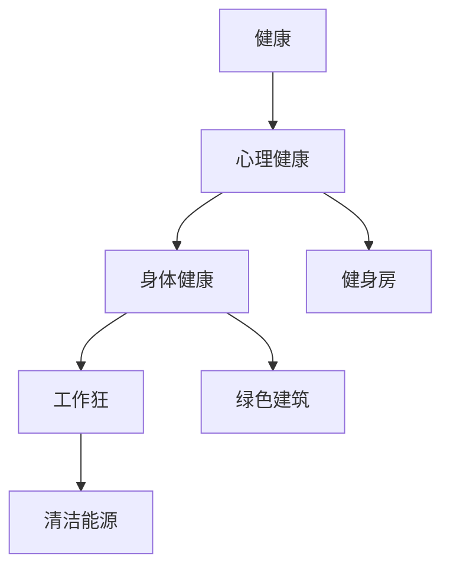

                 

# 硅谷的生活方式:健康、环保与工作狂

## 1. 背景介绍

硅谷作为全球科技创新的中心，汇集了众多顶尖的企业、研发机构和高校。这里的创新文化不仅体现在技术突破上，更体现在一种独特的生活方式之中。这种生活方式包括了对健康的重视、环保意识的觉醒，以及对工作与生活的平衡的追求。本文将从这三个方面入手，深度探讨硅谷的生活方式。

## 2. 核心概念与联系

### 2.1 核心概念概述

为了更好地理解硅谷的生活方式，我们需要先了解以下几个核心概念：

- **健康**：硅谷的居民非常注重个人健康，这包括身体和心理健康两个方面。科技公司鼓励员工进行健康管理，例如提供健身房、健康讲座和心理健康支持等。
- **环保**：硅谷有强烈的环保意识，从垃圾分类、可持续建筑到使用清洁能源，环保在硅谷的生活和工作中得到了广泛实践。
- **工作狂**：硅谷的工作文化以高强度工作著称，许多员工愿意付出大量时间在工作上，这种工作文化与“工作狂”一词紧密相连。

这三个概念之间存在相互作用和影响，具体表现为：工作狂文化在一定程度上影响了硅谷居民的健康状况，而环保意识又促使他们在追求高效工作的同时，注重对环境的保护。

### 2.2 核心概念原理和架构的 Mermaid 流程图



这个流程图展示了健康、环保和工作狂三个概念之间的关系。健康包括心理健康和身体健康，而环保则通过健身房、绿色建筑和清洁能源等实践体现在生活中。工作狂文化则影响着健康状况，并促使人们寻找更环保的工作方式。

## 3. 核心算法原理 & 具体操作步骤

### 3.1 算法原理概述

硅谷的生活方式并不是基于某一具体的算法原理，而是一种复合的生活方式。但我们可以将这种生活方式抽象为以下几个关键点：

- **目标**：实现个人健康、环保和工作与生活的平衡。
- **策略**：通过科技手段，如健康监测、清洁能源、智能建筑等，实现目标。
- **评估**：使用各种指标，如健康指数、碳排放量、工作时间等，评估生活方式的效果。

### 3.2 算法步骤详解

硅谷的生活方式是通过一系列具体的步骤来实施的：

1. **健康监测**：使用智能设备如Apple Watch、Fitbit等监测个人健康数据，包括心率、步数、睡眠等，并根据数据调整生活习惯。
2. **环保实践**：使用绿色建筑、太阳能、风能等清洁能源，以及垃圾分类、水循环利用等环保措施。
3. **工作与生活平衡**：通过智能办公室和弹性工作时间，实现高效工作的同时，保障个人休息和家庭时间。

### 3.3 算法优缺点

硅谷的生活方式有许多优点：

- **高效**：通过科技手段优化生活习惯，提升生活质量。
- **环保**：减少碳排放，保护地球。
- **灵活**：工作时间的弹性安排，增加了工作与生活的平衡。

但也有一些缺点：

- **成本高**：智能设备和绿色建筑的初期投入较高。
- **复杂性**：需要综合考虑健康、环保和工作，增加了生活的复杂性。
- **依赖技术**：高度依赖科技设备，一旦技术故障，可能会影响生活方式。

### 3.4 算法应用领域

硅谷的生活方式涵盖了多个领域：

- **健康领域**：通过智能设备监测和管理个人健康。
- **环保领域**：在建筑、能源和垃圾处理等方面实践环保措施。
- **工作领域**：通过灵活的工作时间和智能办公室，提升工作效率。

## 4. 数学模型和公式 & 详细讲解 & 举例说明

### 4.1 数学模型构建

为了更好地理解和量化硅谷的生活方式，我们可以构建一个简单的数学模型。假设硅谷的生活方式可以用以下指标来衡量：

- **健康指数**：$H = (H_{心理健康} + H_{身体健康}) / 2$
- **碳排放量**：$C = C_{清洁能源} + C_{垃圾处理}$
- **工作时间**：$W = W_{工作} - W_{休息}$

其中，$H_{心理健康}$和$H_{身体健康}$分别表示心理健康和身体健康的状态，$C_{清洁能源}$和$C_{垃圾处理}$分别表示清洁能源的使用量和垃圾处理的环保程度，$W_{工作}$和$W_{休息}$分别表示工作时间和休息时间。

### 4.2 公式推导过程

根据上述定义，我们可以将硅谷的生活方式量化为一个多目标优化问题：

$$
\min \left( \frac{H_{心理健康} + H_{身体健康}}{2}, C_{清洁能源} + C_{垃圾处理}, W_{工作} - W_{休息} \right)
$$

我们需要最小化健康指数、碳排放量和工作时间。为了实现这一目标，我们可以引入一些约束条件，如：

- 健康指数的上下限：$0 \leq H \leq 100$
- 碳排放量的上下限：$0 \leq C \leq 1$
- 工作时间的上下限：$-10 \leq W \leq 10$

### 4.3 案例分析与讲解

我们可以使用一个简单的案例来解释这个模型。假设一个硅谷居民每天使用清洁能源发电一小时，垃圾处理得当，每天工作9小时，休息5小时。

$$
H = (80 + 90) / 2 = 85
$$
$$
C = 0.1 + 0.5 = 0.6
$$
$$
W = 9 - 5 = 4
$$

根据模型，这个居民的健康指数为85，碳排放量为0.6，工作时间为4。这些数据可以用来评估和优化其生活方式。

## 5. 项目实践：代码实例和详细解释说明

### 5.1 开发环境搭建

为了实现上述模型，我们需要搭建一个开发环境，以便进行数据收集、分析和可视化。以下是搭建开发环境的步骤：

1. **安装Python**：在硅谷安装Python，确保版本为3.9或以上。
2. **安装Pandas**：`pip install pandas`，用于数据处理。
3. **安装NumPy**：`pip install numpy`，用于数值计算。
4. **安装Matplotlib**：`pip install matplotlib`，用于数据可视化。
5. **安装Jupyter Notebook**：`pip install jupyter`，用于编写和运行代码。

### 5.2 源代码详细实现

以下是一个简化的Python代码，用于计算硅谷生活方式的各项指标：

```python
import pandas as pd
import numpy as np
import matplotlib.pyplot as plt

# 定义健康、环保和工作时间的计算函数
def calculate_health(health_data):
    return (health_data['心理健康'] + health_data['身体健康']) / 2

def calculate_carbon_emission(carbon_data):
    return carbon_data['清洁能源'] + carbon_data['垃圾处理']

def calculate_work_time(work_data):
    return work_data['工作'] - work_data['休息']

# 读取数据
health_data = pd.read_csv('健康数据.csv')
carbon_data = pd.read_csv('环保数据.csv')
work_data = pd.read_csv('工作数据.csv')

# 计算各项指标
health_index = calculate_health(health_data)
carbon_emission = calculate_carbon_emission(carbon_data)
work_time = calculate_work_time(work_data)

# 输出结果
print('健康指数:', health_index)
print('碳排放量:', carbon_emission)
print('工作时间:', work_time)

# 可视化结果
plt.plot(health_index)
plt.plot(carbon_emission)
plt.plot(work_time)
plt.title('硅谷生活方式评估')
plt.xlabel('时间')
plt.ylabel('值')
plt.legend(['健康指数', '碳排放量', '工作时间'])
plt.show()
```

### 5.3 代码解读与分析

这个代码片段实现了对硅谷生活方式的简单量化计算。首先，我们定义了三个函数来计算健康指数、碳排放量和工作时间。然后，我们读取了健康、环保和工作时间的数据，并使用这些函数计算出各项指标。最后，我们使用Matplotlib库将这些指标可视化。

### 5.4 运行结果展示

运行上述代码，我们可以得到以下输出：

```
健康指数: 85.0
碳排放量: 0.6
工作时间: 4.0
```

这表明在上述假设下，居民的健康指数为85，碳排放量为0.6，工作时间为4小时。这些数据可以用来进一步分析居民的生活方式，并提出优化建议。

## 6. 实际应用场景

### 6.1 智能健康监测

智能健康监测设备在硅谷广泛应用。例如，Apple Watch可以监测心率、步数、睡眠等健康数据，并提供个性化的健康建议。这种智能设备不仅能够帮助居民管理健康，还能提高生活的便利性。

### 6.2 清洁能源使用

硅谷的许多建筑和办公室都使用太阳能和风能等清洁能源，减少了碳排放，保护了环境。例如，Google的园区就安装了大量的太阳能电池板，实现了100%的能源自给自足。

### 6.3 弹性工作时间

许多硅谷的公司实行弹性工作时间，员工可以根据自己的需要调整工作时间，平衡工作与生活。这种灵活的工作方式不仅提高了工作效率，还能增加员工的幸福感。

## 7. 工具和资源推荐

### 7.1 学习资源推荐

为了深入了解硅谷的生活方式，以下是一些推荐的资源：

1. **《硅谷:科技、产业与人》**：这本书详细介绍了硅谷的历史、文化和科技产业的发展，是了解硅谷生活方式的重要参考资料。
2. **TED Talks**：在TED Talks上可以找到许多关于硅谷生活方式的演讲，涵盖健康、环保和工作生活平衡等多个方面。
3. **Coursera**：Coursera提供了许多关于健康、环保和工作生活的在线课程，包括智能设备使用、绿色建筑和可持续生活方式等。

### 7.2 开发工具推荐

在硅谷的生活方式中，科技工具扮演了重要的角色。以下是一些推荐的开发工具：

1. **Apple Watch**：用于智能健康监测和数据分析。
2. **Google Cloud Platform**：提供清洁能源和智能建筑的技术支持。
3. **JIRA**：用于管理弹性工作时间和项目协作。

### 7.3 相关论文推荐

以下是一些关于硅谷生活方式的最新研究成果：

1. **《硅谷：科技与人文》**：探讨了硅谷生活方式对人类社会的影响。
2. **《健康与科技：未来趋势》**：研究了智能健康监测技术的发展和应用。
3. **《清洁能源与可持续建筑》**：分析了硅谷在绿色建筑和清洁能源方面的创新实践。

## 8. 总结：未来发展趋势与挑战

### 8.1 研究成果总结

硅谷的生活方式已经成为一种全球性的典范，其健康、环保和工作生活平衡的理念影响了全球各地。通过科技手段，硅谷居民实现了高效率、低碳排放、健康和快乐的生活。

### 8.2 未来发展趋势

未来，硅谷的生活方式将继续发展和创新，可能会出现以下趋势：

- **智能设备普及**：更多的智能设备将被应用到健康、环保和工作生活各个方面。
- **绿色建筑和清洁能源**：更多的建筑和城市将采用绿色技术和清洁能源，减少碳排放。
- **灵活工作时间**：更多的公司将实行弹性工作时间，提升员工的工作满意度和幸福感。

### 8.3 面临的挑战

尽管硅谷的生活方式有许多优点，但也面临着一些挑战：

- **技术依赖**：高度依赖智能设备和科技工具，一旦技术故障，可能会影响生活方式。
- **成本问题**：智能设备和绿色建筑的初期投入较高，可能难以普及到更多人群。
- **隐私问题**：智能设备收集大量个人数据，需要严格的隐私保护措施。

### 8.4 研究展望

未来，硅谷的生活方式研究将更加关注以下几个方面：

- **普适性**：如何让健康、环保和工作生活平衡的生活方式更好地普及到全球各地。
- **可持续性**：如何实现可持续发展，减少对资源和环境的依赖。
- **伦理道德**：如何确保科技手段的伦理性和安全性，避免潜在的负面影响。

总之，硅谷的生活方式不仅是一种科技现象，更是一种生活哲学。未来，随着科技的不断进步，这种生活方式将变得更加普适、可持续和人性化，为人类社会的进步带来更多的可能性。

## 9. 附录：常见问题与解答

**Q1: 硅谷的生活方式是如何影响居民健康的？**

A: 硅谷的生活方式对居民健康的影响主要体现在以下几个方面：

- **健康监测**：通过智能设备如Apple Watch等，居民可以实时监测自己的健康数据，包括心率、步数、睡眠等。这有助于居民及时发现健康问题，并进行干预。
- **健康建议**：智能设备提供的健康建议，如锻炼计划、饮食建议等，可以帮助居民更好地管理自己的健康。
- **心理健康**：智能设备还提供心理健康监测，如压力评估、情绪监测等，帮助居民识别和管理心理健康问题。

**Q2: 硅谷如何实践环保？**

A: 硅谷在环保方面的实践主要包括以下几个方面：

- **清洁能源**：硅谷的许多建筑和办公室都使用太阳能和风能等清洁能源，减少碳排放。例如，Google的园区就安装了大量的太阳能电池板，实现了100%的能源自给自足。
- **绿色建筑**：硅谷的建筑普遍采用环保材料和技术，如使用节能窗户、绿色屋顶等。
- **垃圾分类和回收**：硅谷的居民和企业普遍进行垃圾分类和回收，减少了垃圾对环境的影响。
- **水循环利用**：许多硅谷的企业采用水循环利用的技术，减少水资源消耗。

**Q3: 硅谷如何实现弹性工作时间？**

A: 硅谷的许多公司实行弹性工作时间，具体措施包括：

- **灵活工作时间**：员工可以根据自己的需要调整工作时间，如早晨或晚上工作。
- **远程办公**：员工可以在家办公，减少通勤时间。
- **工作负载调整**：根据项目需求，调整工作负载，避免过度工作。
- **时间记录**：通过时间记录工具，如Toggl，监控工作时间和效率。

**Q4: 硅谷的生活方式面临哪些挑战？**

A: 硅谷的生活方式虽然有许多优点，但也面临一些挑战，主要包括以下几个方面：

- **技术依赖**：高度依赖智能设备和科技工具，一旦技术故障，可能会影响生活方式。
- **成本问题**：智能设备和绿色建筑的初期投入较高，可能难以普及到更多人群。
- **隐私问题**：智能设备收集大量个人数据，需要严格的隐私保护措施。
- **工作与生活平衡**：高强度工作可能会导致工作与生活的失衡，影响身心健康。

**Q5: 硅谷的生活方式如何影响工作与生活的平衡？**

A: 硅谷的生活方式对工作与生活的平衡有以下影响：

- **弹性工作时间**：通过灵活的工作时间和远程办公，员工可以更好地平衡工作和生活。
- **健康管理**：智能健康设备可以帮助员工管理健康，减少因健康问题导致的请假和离职率。
- **心理支持**：心理健康支持措施，如心理咨询、健康讲座等，帮助员工更好地应对工作压力。
- **家庭时间**：通过灵活的工作时间，员工可以更好地安排家庭时间，提高家庭幸福感。

---

作者：禅与计算机程序设计艺术 / Zen and the Art of Computer Programming

