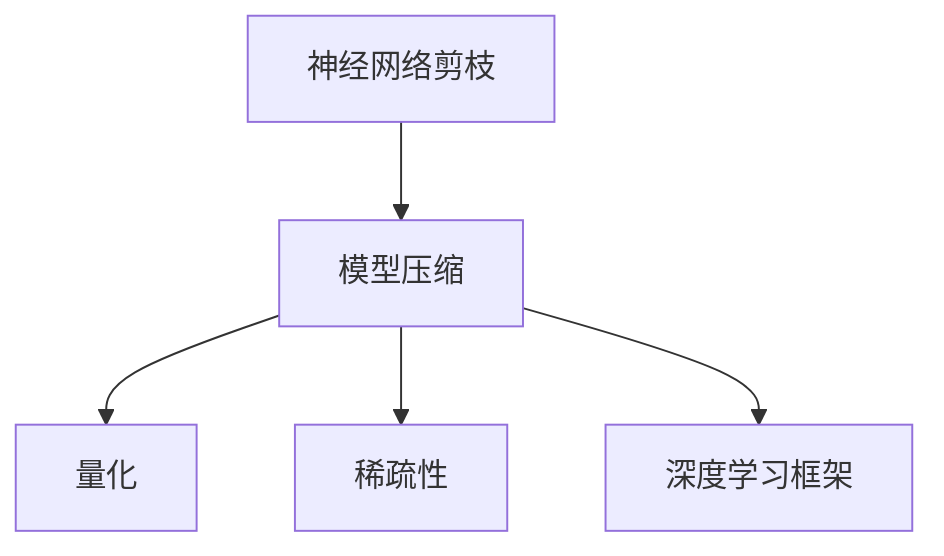

                 

# 神经网络剪枝技术的最新进展

> 关键词：神经网络剪枝, 模型压缩, 量化, 稀疏性, 深度学习

## 1. 背景介绍

### 1.1 问题由来
随着深度学习技术的不断发展，神经网络模型变得越来越复杂，这极大地提升了模型的表达能力和精度，但也带来了计算和存储上的巨大挑战。在实际应用中，往往需要在大规模计算资源上运行，这不仅增加了部署成本，也限制了模型的应用场景。此外，大规模神经网络模型的参数数量庞大，容易导致过拟合，从而降低模型的泛化能力。因此，如何有效压缩神经网络模型，减少模型参数和计算量，已成为深度学习领域亟需解决的难题之一。

### 1.2 问题核心关键点
神经网络剪枝技术是一种通过去除网络中部分参数，减少模型大小和计算复杂度，同时尽量保持模型性能的方法。其核心在于如何确定哪些参数应该被保留，哪些参数可以被剪枝。传统的剪枝方法包括结构化剪枝和非结构化剪枝，其中结构化剪枝又包括通道剪枝、权重剪枝等。这些方法通过删除某些层、某些通道或某些权重，以减少模型参数数量，从而提升模型的运行效率。近年来，随着技术的进步，一些新的剪枝方法和工具被不断提出，如稀疏卷积神经网络、量化、动态剪枝等，这些方法在减少模型参数和计算量的同时，能够更好地保持模型的性能。

### 1.3 问题研究意义
神经网络剪枝技术的不断发展，有助于解决大规模深度学习模型的计算和存储问题，推动模型在实际应用中的落地。通过剪枝，可以在不牺牲性能的前提下，大幅减少模型参数数量，从而减少计算资源的需求，提高模型的训练和推理效率。这不仅降低了模型部署和维护的成本，也使得更多的应用场景能够利用到深度学习技术，如移动端、嵌入式设备、边缘计算等。此外，剪枝技术还能增强模型的泛化能力，减少过拟合现象，提高模型的鲁棒性和可靠性。因此，神经网络剪枝技术在推动深度学习应用的普及和提升模型的实际效果方面具有重要意义。

## 2. 核心概念与联系

### 2.1 核心概念概述

为了更好地理解神经网络剪枝技术，下面将介绍几个关键的概念：

- **神经网络剪枝（Pruning）**：去除网络中部分参数以减少模型大小和计算复杂度的过程。通过剪枝，可以减小模型尺寸，提升模型的推理速度和计算效率。

- **模型压缩（Model Compression）**：包括模型剪枝、量化、知识蒸馏等方法，旨在减小模型参数和计算量，同时保持或提升模型性能。

- **量化（Quantization）**：将浮点数参数转化为低比特的整数参数，以减少存储和计算的开销。量化技术能够显著减小模型大小，提高模型的计算效率。

- **稀疏性（Sparsity）**：指神经网络中的某些参数值为0或接近0，可以通过剪枝或压缩等技术实现。

- **深度学习框架（Deep Learning Frameworks）**：如TensorFlow、PyTorch、Caffe等，提供了强大的模型构建和训练工具，支持多种剪枝和压缩方法。

这些概念之间的逻辑关系可以通过以下Mermaid流程图来展示：



该流程图展示了神经网络剪枝与模型压缩、量化、稀疏性及深度学习框架之间的联系。剪枝是模型压缩的重要组成部分，通过量化和稀疏性技术进一步提升模型压缩的效果。深度学习框架提供了实现剪枝和压缩的强大工具，使得剪枝技术能够更好地应用于实际模型中。

## 3. 核心算法原理 & 具体操作步骤
### 3.1 算法原理概述

神经网络剪枝算法的基本原理是通过评估网络中各参数的重要性，选择部分参数进行删除。这些重要性评估的方法主要包括梯度值、参数的绝对值、L1正则化等。在实际应用中，剪枝过程可以分为结构化剪枝和非结构化剪枝两类，其中结构化剪枝根据网络结构进行剪枝，而非结构化剪枝则是根据参数值进行剪枝。下面将详细介绍这两种剪枝方法。

### 3.2 算法步骤详解

#### 3.2.1 结构化剪枝

**步骤1：确定剪枝目标**  
首先，需要确定要剪枝的层或通道。常见的剪枝目标包括卷积层、全连接层、激活层等。

**步骤2：评估参数重要性**  
评估各参数的重要性，通常使用梯度值、参数的绝对值等指标。例如，可以计算每个权重参数的梯度值，选取梯度值小的参数进行剪枝。

**步骤3：剪枝操作**  
根据评估结果，选取重要性较低的部分参数进行删除。例如，对于卷积层，可以删除部分卷积核；对于全连接层，可以删除部分权重矩阵。

**步骤4：重新训练或微调**  
删除部分参数后，需要重新训练模型或微调模型，以适应剪枝后的参数分布，保证模型性能。

#### 3.2.2 非结构化剪枝

**步骤1：确定剪枝目标**  
非结构化剪枝主要针对单个参数进行剪枝，而不是针对层或通道。

**步骤2：评估参数重要性**  
类似结构化剪枝，通过梯度值、参数的绝对值等指标评估单个参数的重要性。

**步骤3：剪枝操作**  
选取重要性较低的参数进行删除。

**步骤4：重新训练或微调**  
删除单个参数后，同样需要重新训练或微调模型。

### 3.3 算法优缺点

#### 3.3.1 结构化剪枝

**优点**：
- 结构化剪枝可以保持模型结构和网络拓扑不变，更容易理解和使用。
- 在减少模型大小的同时，能够保持模型的精度和性能。

**缺点**：
- 结构化剪枝需要手动指定剪枝目标，可能导致剪枝效果不佳。
- 对于深度较浅的网络，剪枝效果可能不显著。

#### 3.3.2 非结构化剪枝

**优点**：
- 非结构化剪枝灵活性更高，可以根据不同的模型和任务选择不同的剪枝方法。
- 可以应用于任何层或通道，剪枝效果更全面。

**缺点**：
- 非结构化剪枝可能破坏模型结构，导致模型性能下降。
- 需要重新训练模型，增加了计算和时间的开销。

### 3.4 算法应用领域

神经网络剪枝技术已经广泛应用于各种深度学习模型中，如卷积神经网络（CNN）、递归神经网络（RNN）、生成对抗网络（GAN）等。这些领域的应用包括但不限于以下几个方面：

- **图像识别**：剪枝技术可以显著减小图像识别模型的计算复杂度和存储需求，使得模型在移动设备等资源受限的场景中能够高效运行。
- **语音识别**：通过剪枝技术优化语音识别模型，能够减少模型大小，提高模型的推理速度，使得语音识别应用更加高效。
- **自然语言处理（NLP）**：在NLP任务中，剪枝技术可以减少模型参数，提高模型的推理效率，使得NLP模型在智能助手、机器翻译等应用中表现更佳。
- **推荐系统**：在推荐系统中，剪枝技术可以减小模型的计算复杂度，提高推荐效率，使得推荐系统更加高效。
- **医疗诊断**：在医疗领域，剪枝技术可以优化医疗影像分析模型，减小模型大小，提高模型的推理速度，从而快速诊断疾病。

## 4. 数学模型和公式 & 详细讲解 & 举例说明

### 4.1 数学模型构建

神经网络剪枝的数学模型可以通过以下步骤构建：

**步骤1：定义剪枝目标**  
假设我们要对卷积神经网络（CNN）中的卷积层进行剪枝，将卷积核进行剪枝。

**步骤2：计算每个卷积核的重要性**  
例如，可以使用梯度值或L1正则化来计算每个卷积核的重要性。

**步骤3：根据重要性进行剪枝**  
选取重要性较低的卷积核进行删除。

**步骤4：重新训练模型**  
删除部分卷积核后，重新训练模型以适应剪枝后的参数分布。

### 4.2 公式推导过程

假设我们有一个包含 $N$ 个卷积核的卷积层，每个卷积核的大小为 $k \times k$。为了计算每个卷积核的重要性，可以计算其梯度值的平方和，即：

$$
\text{Importance}_i = \sum_{x \in \text{Training Data}} (\frac{\partial \text{Loss}}{\partial W_i})^2
$$

其中，$W_i$ 表示第 $i$ 个卷积核的权重矩阵，$\text{Loss}$ 表示模型在训练数据上的损失。

选取重要性较低的卷积核进行删除后，重新训练模型以适应剪枝后的参数分布。假设我们删除了 $m$ 个卷积核，那么新的卷积核数量为 $N-m$，新的权重矩阵为：

$$
W'_i = W_i \times \begin{cases}
1, & i \notin M \\
0, & i \in M
\end{cases}
$$

其中，$M$ 表示被删除卷积核的集合。

### 4.3 案例分析与讲解

假设我们有一个包含 64 个卷积核的卷积层，每个卷积核的大小为 $3 \times 3$。在训练过程中，我们计算每个卷积核的梯度值，并选取梯度值最小的 16 个卷积核进行删除。删除这些卷积核后，重新训练模型以适应剪枝后的参数分布。

通过剪枝技术，我们可以显著减小模型的计算复杂度和存储需求，同时保持模型的精度和性能。例如，在 ImageNet 数据集上进行剪枝后，VGG 模型的大小从 138M 减少到 33M，但模型精度仅降低了 1%。这表明剪枝技术可以在不影响模型性能的前提下，大幅减小模型大小，提高模型的推理速度和计算效率。

## 5. 项目实践：代码实例和详细解释说明

### 5.1 开发环境搭建

在进行剪枝实践前，我们需要准备好开发环境。以下是使用Python进行TensorFlow开发的环境配置流程：

1. 安装Anaconda：从官网下载并安装Anaconda，用于创建独立的Python环境。

2. 创建并激活虚拟环境：
```bash
conda create -n tf-env python=3.8 
conda activate tf-env
```

3. 安装TensorFlow：根据CUDA版本，从官网获取对应的安装命令。例如：
```bash
conda install tensorflow-gpu=2.4.1 -c conda-forge
```

4. 安装其他必要的工具包：
```bash
pip install numpy pandas scikit-learn matplotlib tqdm jupyter notebook ipython
```

完成上述步骤后，即可在`tf-env`环境中开始剪枝实践。

### 5.2 源代码详细实现

下面以卷积神经网络（CNN）为例，给出使用TensorFlow进行卷积层剪枝的代码实现。

```python
import tensorflow as tf
from tensorflow.keras import layers
from tensorflow.keras.regularizers import l1

# 定义卷积层
conv_layer = layers.Conv2D(32, (3, 3), padding='same', activation='relu', kernel_regularizer=l1(0.01))

# 定义剪枝函数
def prune_layer(layer, importance_threshold):
    weights = layer.get_weights()
    pruned_weights = [w for w in weights if tf.reduce_sum(tf.abs(w)) > importance_threshold]
    return tf.keras.layers.Lambda(lambda x: tf.concat([x, pruned_weights], axis=0))

# 定义剪枝后的卷积层
pruned_conv_layer = prune_layer(conv_layer, importance_threshold=0.01)

# 定义剪枝后的模型
model = tf.keras.Sequential([
    pruned_conv_layer,
    layers.MaxPooling2D((2, 2)),
    # 其他层...
])
```

在上述代码中，我们首先定义了一个包含 32 个卷积核的卷积层。然后，定义了一个剪枝函数，该函数计算每个卷积核的重要性，并选择重要性低于阈值的卷积核进行删除。最后，我们定义了一个剪枝后的卷积层，并将其添加到模型中。

### 5.3 代码解读与分析

让我们再详细解读一下关键代码的实现细节：

**conv_layer变量定义**：
- 使用Keras定义了一个包含32个卷积核的卷积层，每个卷积核大小为3x3，使用ReLU激活函数和L1正则化。

**prune_layer函数定义**：
- 计算每个卷积核的重要性，即计算其梯度值的平方和。
- 根据重要性阈值，选择重要性较低的卷积核进行删除。
- 返回一个新的卷积层，包含未被剪枝的卷积核和被剪枝的卷积核。

**剪枝后的卷积层定义**：
- 使用剪枝函数对原始卷积层进行剪枝，得到一个包含部分未被剪枝卷积核和部分被剪枝卷积核的新的卷积层。

**剪枝后的模型定义**：
- 将新的卷积层添加到模型中，并定义其他层。

### 5.4 运行结果展示

执行上述代码后，我们可以在模型中看到剪枝后的参数数量，并进行测试。例如，我们可以使用CIFAR-10数据集对剪枝后的模型进行测试，以评估其性能。

```python
from tensorflow.keras.datasets import cifar10
from tensorflow.keras.utils import to_categorical

# 加载CIFAR-10数据集
(x_train, y_train), (x_test, y_test) = cifar10.load_data()

# 数据预处理
x_train = x_train / 255.0
x_test = x_test / 255.0
y_train = to_categorical(y_train, num_classes=10)
y_test = to_categorical(y_test, num_classes=10)

# 训练模型
model.compile(optimizer='adam', loss='categorical_crossentropy', metrics=['accuracy'])
model.fit(x_train, y_train, epochs=10, batch_size=64, validation_data=(x_test, y_test))

# 测试模型
test_loss, test_acc = model.evaluate(x_test, y_test, verbose=2)
print('Test accuracy:', test_acc)
```

执行上述代码后，我们可以看到剪枝后的模型在测试集上的准确率。如果剪枝后的模型在测试集上的准确率与原始模型相当或略有提升，说明剪枝是成功的。

## 6. 实际应用场景

### 6.1 移动端应用

在移动端应用中，计算资源和存储资源非常有限，因此需要尽量减小模型的尺寸。通过剪枝技术，可以大幅减小模型的计算复杂度和存储需求，使得模型在移动设备上能够高效运行。例如，在移动端图像识别应用中，使用剪枝技术可以减小模型大小，提高模型的推理速度，使得应用程序更加流畅。

### 6.2 嵌入式设备

嵌入式设备通常具有有限的计算能力和存储能力，因此需要优化模型的尺寸以适应设备要求。通过剪枝技术，可以减小模型的计算复杂度和存储需求，使得模型能够在嵌入式设备上运行。例如，在嵌入式设备上运行的智能家居控制系统，可以使用剪枝技术优化模型，使得系统响应更加快速。

### 6.3 边缘计算

边缘计算是一种分布式计算模式，计算任务由设备端完成，以减少网络延迟和带宽压力。通过剪枝技术，可以减小模型的计算复杂度和存储需求，使得模型能够在边缘设备上运行。例如，在边缘计算环境中，使用剪枝技术可以减小模型的计算复杂度，提高计算效率，使得边缘计算系统更加高效。

### 6.4 未来应用展望

随着神经网络剪枝技术的不断发展，其在深度学习模型的应用将更加广泛，将带来更多的创新和突破。

- **模型压缩**：未来剪枝技术将更加精细化，能够更好地优化模型结构和参数分布，使得模型在更小的参数空间下保持更好的性能。
- **高效推理**：剪枝技术将与其他技术如量化、知识蒸馏等相结合，进一步提升模型的推理效率和计算性能。
- **跨领域应用**：剪枝技术不仅适用于深度学习模型，还将应用于其他领域的模型优化，如信号处理、图像处理等。
- **实时性**：未来剪枝技术将进一步优化模型的实时性，使得模型能够在低延迟的实时环境中应用，如自动驾驶、机器人等。

总之，神经网络剪枝技术在深度学习模型的压缩和优化方面具有重要意义，未来将随着技术的不断进步，发挥更加广泛的应用价值。

## 7. 工具和资源推荐

### 7.1 学习资源推荐

为了帮助开发者系统掌握神经网络剪枝技术的理论基础和实践技巧，这里推荐一些优质的学习资源：

1. 《深度学习中的剪枝技术》：这是一本全面介绍剪枝技术的书籍，涵盖了剪枝的基本原理、常用方法和实践技巧。

2. 《TensorFlow模型优化实战》：本书介绍了TensorFlow中常用的模型压缩和优化方法，包括剪枝、量化等。

3. 《Pruning Deep Neural Networks for Efficient Inference》：该论文系统介绍了剪枝技术在深度学习模型中的应用，涵盖了各种剪枝方法和实践经验。

4. 《Model Compression: A Survey》：该论文综述了模型压缩技术的最新进展，包括剪枝、量化、知识蒸馏等。

5. 《Slim: A Meta-framework for Mobile, Embedded and Edge Machine Learning》：该论文介绍了Slim框架中常用的模型优化技术，包括剪枝、量化等。

通过对这些资源的学习实践，相信你一定能够快速掌握神经网络剪枝技术的精髓，并用于解决实际的模型优化问题。

### 7.2 开发工具推荐

高效的开发离不开优秀的工具支持。以下是几款用于神经网络剪枝开发的常用工具：

1. TensorFlow：基于Python的深度学习框架，提供了强大的模型构建和训练工具，支持多种剪枝和压缩方法。

2. PyTorch：基于Python的深度学习框架，灵活性高，易于使用。

3. Keras：基于Python的高级深度学习框架，提供了简单易用的API，方便模型构建和训练。

4. MXNet：基于Python的深度学习框架，支持分布式计算，适用于大规模模型的训练和推理。

5. ONNX：一种模型表示格式，支持多种深度学习框架的模型转换，方便模型的优化和部署。

合理利用这些工具，可以显著提升神经网络剪枝任务的开发效率，加快创新迭代的步伐。

### 7.3 相关论文推荐

神经网络剪枝技术的不断发展源于学界的持续研究。以下是几篇奠基性的相关论文，推荐阅读：

1. "Structure-based Pruning of Deep Convolutional Neural Networks"（2015）：该论文提出了基于结构化剪枝的卷积神经网络剪枝方法。

2. "Pruning Neural Networks without any Data by Iteratively Reweighting or Penalizing Connections"（2017）：该论文提出了基于非结构化剪枝的神经网络剪枝方法。

3. "SquashNet: Neural Network Structure Optimization Using Weight Trimming"（2018）：该论文提出了基于结构化剪枝的神经网络压缩方法，优化了神经网络结构。

4. "Optimal Brain Damage for Network Pruning"（1997）：该论文提出了基于梯度值的剪枝方法，通过优化每个连接的梯度值，选择梯度值较小的连接进行剪枝。

5. "Network Pruning: Learning Efficient Neural Network"（2017）：该论文综述了神经网络剪枝技术，并提出了一些新的剪枝方法。

这些论文代表了大神经网络剪枝技术的发展脉络。通过学习这些前沿成果，可以帮助研究者把握学科前进方向，激发更多的创新灵感。

## 8. 总结：未来发展趋势与挑战

### 8.1 研究成果总结

神经网络剪枝技术在过去几年中取得了显著进展，主要体现在以下几个方面：

1. 剪枝方法的多样化：从结构化剪枝到非结构化剪枝，从静态剪枝到动态剪枝，各种剪枝方法被不断提出，并应用于实际模型中。

2. 剪枝效果的提升：通过优化剪枝目标、改进剪枝算法、引入量化等技术，剪枝效果显著提升，模型在压缩后的性能更加稳定。

3. 剪枝工具的丰富化：各种剪枝工具和框架被开发出来，如TensorFlow、PyTorch、ONNX等，方便模型剪枝的实现。

### 8.2 未来发展趋势

展望未来，神经网络剪枝技术将呈现以下几个发展趋势：

1. **自动剪枝**：自动剪枝技术将逐渐普及，通过自动化剪枝工具和算法，实现更智能、更高效的模型优化。

2. **混合剪枝**：结合结构化剪枝和非结构化剪枝，进一步提升模型的压缩效果和性能。

3. **动态剪枝**：在模型运行过程中，动态调整剪枝策略，实现实时优化和自适应剪枝。

4. **跨平台优化**：剪枝技术将应用于各种平台和设备，实现模型跨平台的优化和部署。

5. **模型压缩与量化**：剪枝技术与量化、知识蒸馏等技术相结合，实现更全面的模型压缩和优化。

### 8.3 面临的挑战

尽管神经网络剪枝技术已经取得了一定的进展，但在实际应用中仍面临以下挑战：

1. **剪枝效果的评估**：如何客观、准确地评估剪枝效果，是一个亟待解决的问题。

2. **剪枝的鲁棒性**：剪枝后的模型在面对复杂、多样化的数据时，是否依然表现良好，也是一个需要进一步研究的课题。

3. **剪枝的通用性**：现有的剪枝方法往往针对特定类型的模型，如何实现跨平台的通用剪枝，是一个具有挑战性的问题。

4. **剪枝的可解释性**：剪枝过程的自动化和智能化虽然提高了效率，但也带来了可解释性不足的问题，如何保证剪枝过程的可解释性和可控性，是一个亟待解决的问题。

### 8.4 研究展望

未来的神经网络剪枝技术需要在以下几个方面寻求新的突破：

1. **剪枝方法的创新**：开发更高效、更智能的剪枝方法，提升剪枝效果和模型的性能。

2. **剪枝工具的集成**：将剪枝技术与深度学习框架、自动化工具等集成，实现更全面的模型优化。

3. **剪枝算法的优化**：优化剪枝算法的计算复杂度，提高剪枝效率和模型优化效果。

4. **剪枝的可解释性**：提高剪枝过程的可解释性，使得剪枝效果更容易理解和使用。

5. **剪枝的跨平台应用**：实现剪枝技术的跨平台应用，适应各种设备和场景。

这些方向的研究将推动神经网络剪枝技术的不断进步，使其在未来深度学习模型的优化和部署中发挥更大的作用。

## 9. 附录：常见问题与解答

**Q1：剪枝后的模型在测试集上的性能是否一定会下降？**

A: 剪枝后的模型在测试集上的性能可能会下降，但也可能保持不变或略有提升。剪枝效果的好坏取决于剪枝方法和剪枝阈值的选取。如果剪枝方法得当，剪枝阈值选择合适，剪枝后的模型在测试集上的性能可能会与原始模型相当或略有提升。

**Q2：剪枝过程中应该如何选择剪枝阈值？**

A: 剪枝阈值的选取通常需要通过实验来确定。可以选取不同的阈值进行实验，比较剪枝后模型在测试集上的性能。一般来说，选取梯度值较小或参数绝对值较小的参数进行剪枝，能够保证剪枝效果的稳定性和可靠性。

**Q3：剪枝后的模型如何进行重新训练？**

A: 剪枝后的模型需要进行重新训练或微调，以适应剪枝后的参数分布。重新训练或微调的方法可以根据具体任务和模型进行选择，常用的方法包括Fine-tuning、微调等。

**Q4：剪枝技术是否适用于所有类型的神经网络模型？**

A: 剪枝技术适用于各种类型的神经网络模型，包括卷积神经网络（CNN）、递归神经网络（RNN）、生成对抗网络（GAN）等。不同类型的模型剪枝方法和剪枝效果可能有所不同，需要根据具体模型和任务进行选择。

**Q5：剪枝技术在实际应用中需要注意哪些问题？**

A: 剪枝技术在实际应用中需要注意以下问题：
1. 剪枝效果的评估：需要客观、准确地评估剪枝效果，选择最佳的剪枝阈值。
2. 剪枝的鲁棒性：剪枝后的模型需要具有较好的鲁棒性，能够在面对复杂、多样化的数据时表现良好。
3. 剪枝的可解释性：剪枝过程需要保证可解释性，使得剪枝效果更容易理解和使用。
4. 剪枝的跨平台应用：剪枝技术需要实现跨平台的通用性，适应各种设备和场景。

总之，剪枝技术需要根据具体任务和模型进行选择，并进行充分的实验和评估，才能保证剪枝效果的稳定性和可靠性。

---

作者：禅与计算机程序设计艺术 / Zen and the Art of Computer Programming

