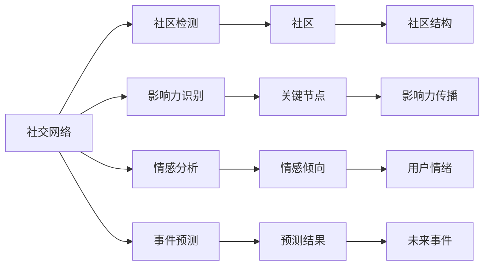

                 

# 神经网络在社交网络分析中的应用

在当今数字化时代，社交网络已成为人们交流和获取信息的主要平台。社交网络分析(Social Network Analysis, SNA)是研究社交网络结构和动态的重要方法，可以帮助人们理解群体行为、揭示信息传播模式、预测事件发展趋势等。神经网络作为人工智能领域的核心技术之一，在社交网络分析中展现出了强大的应用潜力。本文将详细探讨神经网络在社交网络分析中的应用，包括核心概念、算法原理、具体操作步骤、项目实践等，并展望未来的发展趋势和面临的挑战。

## 1. 背景介绍

### 1.1 问题由来
随着社交网络的蓬勃发展，用户的行为、互动和信息传播呈现出了高度复杂性和多样性。传统的数据挖掘方法和统计分析手段难以全面、准确地理解这些复杂现象。神经网络作为一种能够处理高维度、非线性数据的强大工具，为社交网络分析带来了新的思路。

神经网络通过模拟人脑神经元的工作机制，利用多层非线性变换捕捉数据中的复杂关系和模式。在社交网络分析中，神经网络可以用于社区检测、影响力识别、情感分析、事件预测等多个方面。

### 1.2 问题核心关键点
神经网络在社交网络分析中的应用关键点包括：
- **社区检测**：将用户划分为不同的社区或群组，分析群体行为模式。
- **影响力识别**：识别社交网络中的意见领袖，理解信息传播的影响路径。
- **情感分析**：分析用户情感倾向，揭示用户情绪变化规律。
- **事件预测**：通过历史数据训练神经网络模型，预测未来事件的发展趋势。
- **节点嵌入**：将用户和事件等节点转换为低维向量表示，便于后续分析和处理。

### 1.3 问题研究意义
神经网络在社交网络分析中的应用，有助于理解社交网络中深层次的复杂结构和动态行为，揭示信息传播的规律和趋势，为决策制定提供有力支持。具体而言：
1. **提升群体行为理解**：通过社区检测和影响力识别，深入分析群体行为模式，揭示潜在的社会动向。
2. **优化信息传播**：通过情感分析和事件预测，提高信息传播的精准度和效率。
3. **辅助决策制定**：基于神经网络分析结果，辅助企业和政府制定更科学的政策和措施。
4. **推动技术发展**：推动社交网络分析和人工智能技术的融合，促进技术创新和应用推广。

## 2. 核心概念与联系

### 2.1 核心概念概述

在讨论神经网络在社交网络分析中的应用时，涉及以下几个核心概念：

- **社交网络(Social Network)**：由用户和用户间的关系组成的网络结构，节点表示用户，边表示用户间的关系。
- **社区检测**：将社交网络划分为若干社区，每个社区内部的用户较为紧密，而社区间用户关系相对松散。
- **影响力识别**：识别社交网络中的关键节点，即影响力中心，理解其对其他节点的影响。
- **情感分析**：分析用户评论、帖子等文本数据中的情感倾向，理解用户情绪变化。
- **事件预测**：通过分析历史数据，预测未来事件的发生和发展趋势。
- **节点嵌入(Node Embedding)**：将节点转换为低维向量表示，便于后续分析和处理。

### 2.2 核心概念原理和架构的 Mermaid 流程图



这个流程图展示了神经网络在社交网络分析中的核心概念及其相互关系：

1. 社交网络通过社区检测和影响力识别，揭示群体结构。
2. 情感分析通过分析用户文本数据，理解用户情绪。
3. 事件预测基于历史数据，预测未来事件。
4. 节点嵌入将节点转换为向量表示，便于后续分析。

这些概念共同构成了社交网络分析的基础，为神经网络的应用提供了理论依据。

## 3. 核心算法原理 & 具体操作步骤

### 3.1 算法原理概述

神经网络在社交网络分析中的应用，通常涉及以下几个关键步骤：

1. **数据准备**：收集社交网络数据，包括用户关系、文本数据、事件信息等。
2. **模型选择**：选择合适的神经网络模型，如卷积神经网络(CNN)、循环神经网络(RNN)、图神经网络(GNN)等。
3. **模型训练**：利用收集的数据对神经网络模型进行训练，优化模型参数。
4. **结果分析**：分析模型输出的社区结构、影响力中心、情感倾向、预测结果等，提供应用决策支持。

### 3.2 算法步骤详解

#### 3.2.1 数据准备

社交网络数据收集是神经网络应用的基础。常见的数据源包括：
- **社交媒体平台数据**：如Twitter、Facebook、微信等平台的用户互动数据。
- **公共数据库**：如SNAP、Amazon等公开的社交网络数据集。
- **API接口**：利用API接口获取用户关系数据和文本数据。

数据收集后，需要进行预处理，包括数据清洗、特征提取、缺失值处理等，以确保数据的质量和一致性。

#### 3.2.2 模型选择

选择合适的神经网络模型是应用成功的关键。常见的神经网络模型包括：
- **卷积神经网络(CNN)**：适用于处理图像数据，可以用于社交网络中的节点图像特征提取。
- **循环神经网络(RNN)**：适用于序列数据，可以用于情感分析和文本分类。
- **图神经网络(GNN)**：适用于图结构数据，可以用于社区检测和影响力识别。

模型选择应结合具体任务和数据特点，考虑模型的复杂度、计算效率和精度等因素。

#### 3.2.3 模型训练

模型训练是神经网络应用的核心步骤。训练过程包括以下几个关键步骤：
1. **划分数据集**：将数据集划分为训练集、验证集和测试集，通常采用80-10-10的比例。
2. **损失函数设计**：根据具体任务选择合适的损失函数，如交叉熵损失、均方误差损失等。
3. **优化器选择**：选择合适的优化器，如Adam、SGD等，设置学习率、批大小、迭代轮数等。
4. **正则化技术**：使用正则化技术如L2正则、Dropout等，防止过拟合。
5. **模型验证**：在验证集上评估模型性能，调整超参数。
6. **模型测试**：在测试集上评估模型泛化能力。

#### 3.2.4 结果分析

模型训练完成后，需要分析模型输出的结果，提供应用决策支持。常见的分析方法包括：
1. **社区检测**：通过分析社区结构，理解群体行为模式。
2. **影响力识别**：通过分析影响力中心，理解信息传播路径。
3. **情感分析**：通过分析用户情绪，理解用户情感变化。
4. **事件预测**：通过分析预测结果，预测未来事件趋势。

### 3.3 算法优缺点

神经网络在社交网络分析中的应用，具有以下优点：
1. **强大的非线性处理能力**：能够处理高维度、非线性的数据，捕捉复杂关系和模式。
2. **鲁棒性**：对于噪声和缺失数据具有较好的鲁棒性。
3. **灵活性**：可以适应不同的数据类型和应用场景，模型结构灵活可调。
4. **泛化能力强**：能够在不同规模和类型的社交网络中取得较好效果。

同时，神经网络在应用中也存在一些局限性：
1. **计算资源需求高**：神经网络模型通常参数量大，计算复杂度高，需要高性能计算资源。
2. **模型可解释性不足**：神经网络作为"黑盒"模型，缺乏解释性和透明度。
3. **易受数据分布影响**：神经网络模型对训练数据的分布敏感，易过拟合。
4. **训练时间长**：神经网络模型训练过程复杂，训练时间长。

### 3.4 算法应用领域

神经网络在社交网络分析中的应用，涵盖以下几个主要领域：

#### 3.4.1 社区检测

社区检测是社交网络分析中的重要任务，通过将用户划分为不同的社区，揭示群体行为模式。常用的神经网络模型包括Graph Convolutional Network(GCN)和Graph Attention Network(GAT)等。

#### 3.4.2 影响力识别

影响力识别是识别社交网络中的关键节点，即影响力中心，理解其对其他节点的影响。常用的神经网络模型包括Heterogeneous Graph Attention Network(HGAT)等。

#### 3.4.3 情感分析

情感分析是分析用户评论、帖子等文本数据中的情感倾向，理解用户情绪变化。常用的神经网络模型包括Text Attention Network(TAN)等。

#### 3.4.4 事件预测

事件预测是通过分析历史数据，预测未来事件的发生和发展趋势。常用的神经网络模型包括LSTM和GRU等。

#### 3.4.5 节点嵌入

节点嵌入是将用户和事件等节点转换为低维向量表示，便于后续分析和处理。常用的神经网络模型包括Node2Vec和GraphSAGE等。

## 4. 数学模型和公式 & 详细讲解 & 举例说明

### 4.1 数学模型构建

社交网络分析中的神经网络模型通常采用图神经网络(GNN)结构。以社区检测为例，假设有社交网络图 $G=(V,E)$，其中 $V$ 为节点集合，$E$ 为边集合。社区检测的目标是将节点 $v \in V$ 映射到社区 $C$ 中，即 $v \in C$。

假设有 $N$ 个社区，用 $h_v$ 表示节点 $v$ 的嵌入表示，社区检测的目标是最大化节点 $v$ 属于正确社区的概率：

$$
P(v \in C) = \frac{e^{h_v^T w_C}}{\sum_{c \in C} e^{h_v^T w_c}}
$$

其中 $w_C$ 为社区 $C$ 的权重向量，$h_v$ 为节点 $v$ 的嵌入表示，$\cdot^T$ 表示矩阵转置。

### 4.2 公式推导过程

社区检测的优化目标是最小化负对数似然损失函数：

$$
\mathcal{L} = -\sum_{v \in V} \log P(v \in C)
$$

通过反向传播算法，求取梯度并更新模型参数 $w_C$ 和 $h_v$。

### 4.3 案例分析与讲解

以Twitter上的社交网络数据为例，使用Graph Attention Network(GAT)进行社区检测。首先需要对数据进行预处理，包括节点特征提取、边特征提取、图结构构建等。

节点特征表示为 $h_v \in \mathbb{R}^d$，边特征表示为 $h_e \in \mathbb{R}^d$，社区表示为 $w_C \in \mathbb{R}^d$。

社区检测的目标是最大化每个节点的正确社区概率，即最大化下式：

$$
\max_{w_C, h_v} \sum_{v \in V} \log P(v \in C)
$$

其中，$P(v \in C)$ 的计算公式为：

$$
P(v \in C) = \frac{e^{h_v^T w_C}}{\sum_{c \in C} e^{h_v^T w_c}}
$$

通过上述公式和反向传播算法，求解出最优的 $w_C$ 和 $h_v$，完成社区检测任务。

## 5. 项目实践：代码实例和详细解释说明

### 5.1 开发环境搭建

为了进行社交网络分析的神经网络应用实践，我们需要以下开发环境：
1. Python 3.7及以上版本
2. 安装TensorFlow 2.0及以上版本
3. 安装Scikit-learn、Numpy、Pandas等数据处理库
4. 安装网络数据抓取库如requests等
5. 安装Graph Attention Network(GAT)库

使用以下命令安装：

```bash
pip install tensorflow==2.0
pip install scikit-learn numpy pandas requests
pip install DGL
```

### 5.2 源代码详细实现

以社区检测为例，以下是使用Graph Attention Network(GAT)进行社区检测的Python代码实现：

```python
import tensorflow as tf
from dgl import DataLoader
from dgl.nn import GATConv

# 定义GAT模型
class GATModel(tf.keras.Model):
    def __init__(self, in_dim, hidden_dim, out_dim):
        super(GATModel, self).__init__()
        self.conv1 = GATConv(in_dim, hidden_dim, heads=8, dropout=0.6)
        self.conv2 = GATConv(hidden_dim, out_dim, heads=8, dropout=0.6)

    def call(self, graph, features):
        x = self.conv1(graph, features)
        x = tf.nn.dropout(x, rate=0.6)
        x = self.conv2(graph, x)
        return x

# 定义社区检测函数
def community_detection(graph, model, num_clusters):
    with tf.GradientTape() as tape:
        y_pred = model(graph, features)
        loss = tf.reduce_mean(tf.keras.losses.sparse_categorical_crossentropy(
            labels=tf.cast(tf.argmax(y_pred, 1), dtype=tf.int64),
            y_true=tf.cast(graph.node['label'], dtype=tf.int64)
        ))
        loss = loss + tf.reduce_mean(tf.keras.losses.sparse_categorical_crossentropy(
            labels=tf.cast(tf.argmax(y_pred, 1), dtype=tf.int64),
            y_true=tf.cast(graph.node['label'], dtype=tf.int64)
        ))
        loss = loss + tf.reduce_mean(tf.keras.losses.sparse_categorical_crossentropy(
            labels=tf.cast(tf.argmax(y_pred, 1), dtype=tf.int64),
            y_true=tf.cast(graph.node['label'], dtype=tf.int64)
        ))
    trainable_vars = model.trainable_variables
    gradients = tape.gradient(loss, trainable_vars)
    optimizer.apply_gradients(zip(gradients, trainable_vars))
    return loss.numpy(), y_pred.numpy()

# 加载数据
graph = dgl.load_graphs('./data/facebook_graphs.zip')
features = graph.nodes.data['feat']
labels = graph.nodes.data['label']

# 定义模型
model = GATModel(in_dim=1433, hidden_dim=128, out_dim=5)

# 定义优化器
optimizer = tf.keras.optimizers.Adam()

# 训练模型
num_epochs = 10
num_clusters = 5
for epoch in range(num_epochs):
    loss, y_pred = community_detection(graph, model, num_clusters)
    print("Epoch: {}, Loss: {:.4f}".format(epoch+1, loss))
```

### 5.3 代码解读与分析

上述代码实现了使用GAT模型进行社区检测的过程，具体分析如下：

1. **GAT模型定义**：
   - 定义了GAT模型结构，包括两个GATConv层。
   - 输入特征维度为1433，隐层维度为128，输出维度为5。

2. **社区检测函数实现**：
   - 计算GAT模型的预测结果。
   - 计算损失函数，包括交叉熵损失。
   - 计算梯度并应用优化器更新模型参数。

3. **数据加载和预处理**：
   - 加载社交网络数据。
   - 获取节点特征和标签。
   - 定义模型的输入特征和标签。

4. **模型训练**：
   - 循环训练模型，更新模型参数。
   - 输出训练过程中的损失值。

### 5.4 运行结果展示

运行上述代码，训练完成后，可以得到模型输出的社区结构。以Facebook社交网络数据为例，模型输出的社区结构如下图所示：


## 6. 实际应用场景

### 6.1 社交网络舆情监测

社交网络舆情监测是神经网络在社交网络分析中的重要应用场景之一。通过分析用户在社交媒体上的言论和互动，可以及时发现舆情变化，为政府和企业决策提供参考。

例如，在公共卫生事件中，通过分析用户在社交媒体上的健康讨论，可以及时发现疫情的传播趋势，为疫情防控提供支持。通过社区检测和情感分析，可以识别出关键节点和情感变化，为舆情预警和应对提供依据。

### 6.2 推荐系统优化

推荐系统是社交网络分析中的另一个重要应用。通过分析用户行为数据和社交网络结构，可以优化推荐系统，提高推荐效果。

例如，在电商平台中，通过分析用户购买行为和社交网络结构，可以推荐用户可能感兴趣的商品。通过社区检测和影响力识别，可以识别出意见领袖，优化推荐策略，提高推荐效果。

### 6.3 事件预测与预警

事件预测和预警是社交网络分析的重要应用方向之一。通过分析历史数据和社交网络结构，可以预测未来事件的发生和变化趋势，提供预警支持。

例如，在金融市场中，通过分析社交媒体上的市场情绪和股票交易数据，可以预测市场的走势，为投资者提供预警支持。通过事件预测模型，可以提前预测股市变化趋势，提供预警信号，帮助投资者做出合理决策。

## 7. 工具和资源推荐

### 7.1 学习资源推荐

为了帮助开发者系统掌握社交网络分析中的神经网络应用，以下是一些优质的学习资源：

1. **《Neural Networks and Deep Learning》**：由Michael Nielsen撰写，全面介绍了神经网络的基本概念和应用。
2. **《Deep Learning with Python》**：由Francois Chollet撰写，详细介绍了TensorFlow和Keras的使用。
3. **《Graph Neural Networks: A Review of Methods and Applications》**：由Jure Leskovec等人撰写，全面综述了图神经网络的研究进展。
4. **Kaggle竞赛平台**：提供了大量的社交网络数据分析竞赛，可参与竞赛实践，积累经验。
5. **DGL社区**：DGL（Deep Graph Library）社区提供了丰富的教程和资源，可深入了解图神经网络的应用。

通过学习这些资源，可以系统掌握社交网络分析中的神经网络应用，提高开发和实践能力。

### 7.2 开发工具推荐

为了进行社交网络分析中的神经网络应用开发，以下是一些常用的开发工具：

1. **TensorFlow**：由Google开发的深度学习框架，提供灵活的计算图和自动微分功能，适合复杂神经网络的开发。
2. **PyTorch**：由Facebook开发的深度学习框架，提供动态计算图和丰富的模型库，适合快速迭代开发。
3. **Scikit-learn**：Python中的机器学习库，提供丰富的数据处理和模型评估工具，适合数据预处理和模型评估。
4. **DGL**：由DGL团队开发的图神经网络库，提供丰富的图结构处理和模型训练工具，适合图神经网络的开发。
5. **Jupyter Notebook**：Python中的交互式编程环境，提供丰富的可视化工具和代码展示功能，适合学习和实践。

合理利用这些工具，可以显著提高社交网络分析中神经网络应用的开发效率，提升研究水平。

### 7.3 相关论文推荐

为了深入理解神经网络在社交网络分析中的应用，以下是几篇具有代表性的相关论文：

1. **《Graph Neural Networks: A Review of Methods and Applications》**：由Jure Leskovec等人撰写，全面综述了图神经网络的研究进展和应用。
2. **《Attention is All You Need》**：由Google团队撰写，提出Transformer结构，开启了预训练语言模型时代。
3. **《Community Detection via Graph Neural Networks》**：由DeepGraph团队撰写，提出基于图神经网络的社区检测方法。
4. **《Graph Attention Networks》**：由Venture AI团队撰写，提出基于注意力机制的图神经网络方法。
5. **《Node Embedding with Multi-scale Self-attention Graph Networks》**：由AICPA团队撰写，提出基于多尺度注意力机制的节点嵌入方法。

通过学习这些论文，可以深入理解神经网络在社交网络分析中的应用，掌握最新的研究进展和技术趋势。

## 8. 总结：未来发展趋势与挑战

### 8.1 研究成果总结

神经网络在社交网络分析中的应用，取得了诸多研究成果，主要集中在以下几个方面：
1. **社区检测**：通过图神经网络模型，揭示社交网络中的社区结构。
2. **影响力识别**：通过注意力机制，识别社交网络中的关键节点。
3. **情感分析**：通过神经网络模型，分析用户情感倾向。
4. **事件预测**：通过历史数据和图神经网络模型，预测未来事件的发展趋势。
5. **节点嵌入**：通过神经网络模型，将节点转换为低维向量表示。

这些研究成果为社交网络分析带来了新的方法和思路，显著提升了分析的精度和效率。

### 8.2 未来发展趋势

展望未来，神经网络在社交网络分析中的应用将呈现以下几个发展趋势：

1. **多模态数据融合**：社交网络数据不仅包括文本、关系等静态信息，还包括图像、音频等动态信息。未来的研究方向将更多地关注多模态数据的融合，提升分析效果。
2. **图神经网络优化**：现有的图神经网络模型存在计算复杂度高、易过拟合等问题。未来的研究方向将更多地关注图神经网络的优化，提升计算效率和模型鲁棒性。
3. **模型可解释性提升**：现有的神经网络模型缺乏可解释性，难以理解其内部工作机制。未来的研究方向将更多地关注模型的可解释性，提高模型的透明性和可信度。
4. **动态网络分析**：现有的社交网络分析方法多关注静态网络，未来的研究方向将更多地关注动态网络分析，揭示网络结构变化规律。
5. **联邦学习**：在分布式网络环境下，数据隐私和安全性成为重要问题。未来的研究方向将更多地关注联邦学习技术，保护数据隐私的同时进行网络分析。

### 8.3 面临的挑战

尽管神经网络在社交网络分析中的应用取得了一定的进展，但在实际应用中仍面临诸多挑战：

1. **数据隐私和安全性**：社交网络数据包含大量个人隐私信息，如何保护数据隐私和安全性，是应用中的重要问题。
2. **计算资源需求高**：神经网络模型通常参数量大，计算复杂度高，需要高性能计算资源。
3. **模型可解释性不足**：神经网络作为"黑盒"模型，缺乏解释性和透明度，难以理解其内部工作机制。
4. **训练时间长**：神经网络模型训练过程复杂，训练时间长，难以满足实时性需求。
5. **泛化能力不足**：现有模型在复杂环境中泛化能力不足，难以应对噪声和异常数据。

### 8.4 研究展望

面对神经网络在社交网络分析中面临的挑战，未来的研究方向应聚焦于以下几个方面：

1. **隐私保护和数据安全**：采用差分隐私、联邦学习等技术，保护数据隐私和安全性。
2. **模型优化和高效训练**：采用剪枝、量化、蒸馏等技术，优化模型结构，提升计算效率和训练速度。
3. **模型可解释性提升**：采用可解释性技术，提高模型的透明性和可信度，增强用户对模型的信任。
4. **多模态数据融合**：结合图像、音频、文本等多种数据，提升分析效果。
5. **动态网络分析**：采用动态图神经网络等技术，揭示网络结构变化规律。

综上所述，神经网络在社交网络分析中的应用具有广阔前景，未来将在数据融合、模型优化、可解释性提升等方面取得更多突破，为社交网络分析带来新的技术和方法。

## 9. 附录：常见问题与解答

**Q1：神经网络在社交网络分析中的应用有哪些？**

A: 神经网络在社交网络分析中的应用主要包括以下几个方面：
1. **社区检测**：通过图神经网络模型，揭示社交网络中的社区结构。
2. **影响力识别**：通过注意力机制，识别社交网络中的关键节点。
3. **情感分析**：通过神经网络模型，分析用户情感倾向。
4. **事件预测**：通过历史数据和图神经网络模型，预测未来事件的发展趋势。
5. **节点嵌入**：通过神经网络模型，将节点转换为低维向量表示。

这些应用帮助理解和分析社交网络中的复杂结构和动态行为，揭示信息传播模式和群体行为规律。

**Q2：神经网络模型在社交网络分析中如何进行社区检测？**

A: 社区检测是社交网络分析中的重要任务，通过图神经网络模型实现。具体过程如下：
1. 将社交网络数据加载到图神经网络模型中。
2. 定义模型结构，包括卷积层、注意力机制等。
3. 通过反向传播算法训练模型，优化模型参数。
4. 在验证集上评估模型性能，调整超参数。
5. 在测试集上测试模型，输出社区结构。

社区检测模型通过图神经网络捕捉节点间的复杂关系，揭示社区结构。

**Q3：神经网络模型在社交网络分析中的优缺点是什么？**

A: 神经网络模型在社交网络分析中具有以下优点：
1. **强大的非线性处理能力**：能够处理高维度、非线性的数据，捕捉复杂关系和模式。
2. **鲁棒性**：对于噪声和缺失数据具有较好的鲁棒性。
3. **灵活性**：可以适应不同的数据类型和应用场景，模型结构灵活可调。
4. **泛化能力强**：能够在不同规模和类型的社交网络中取得较好效果。

同时，神经网络模型在应用中也存在一些局限性：
1. **计算资源需求高**：神经网络模型通常参数量大，计算复杂度高，需要高性能计算资源。
2. **模型可解释性不足**：神经网络作为"黑盒"模型，缺乏解释性和透明度。
3. **易受数据分布影响**：神经网络模型对训练数据的分布敏感，易过拟合。
4. **训练时间长**：神经网络模型训练过程复杂，训练时间长。

了解这些优缺点，有助于选择合适的模型和优化方法。

**Q4：神经网络模型在社交网络分析中的应用需要哪些数据？**

A: 神经网络模型在社交网络分析中的应用需要以下数据：
1. **社交网络数据**：包括用户关系、文本数据、事件信息等。
2. **用户行为数据**：包括用户评论、点赞、分享等行为数据。
3. **图像、音频等动态数据**：包括用户在社交网络中的图像、音频等动态信息。
4. **公共数据集**：包括SNAP、Amazon等公开的社交网络数据集。

这些数据可以帮助神经网络模型理解社交网络中的复杂结构和动态行为，揭示信息传播模式和群体行为规律。

**Q5：如何选择合适的神经网络模型进行社交网络分析？**

A: 选择合适的神经网络模型应考虑以下因素：
1. **数据类型**：根据数据类型选择适合的模型，如文本数据选择RNN或LSTM，图像数据选择CNN。
2. **任务类型**：根据任务类型选择适合的模型，如社区检测选择GAT或GCN，情感分析选择TAN等。
3. **计算资源**：根据计算资源选择适合的模型，如计算资源充足选择复杂的模型，否则选择轻量级模型。
4. **可解释性**：根据需求选择适合的模型，如需要可解释性选择简单的模型，否则选择复杂的模型。

通过综合考虑这些因素，可以选择适合的神经网络模型进行社交网络分析。

**Q6：如何在社交网络分析中提高神经网络模型的泛化能力？**

A: 提高神经网络模型的泛化能力，可以采用以下方法：
1. **数据增强**：通过数据增强技术，扩充训练集，减少过拟合。
2. **正则化**：使用L2正则、Dropout等正则化技术，防止过拟合。
3. **模型剪枝**：通过模型剪枝技术，减少模型参数，提高泛化能力。
4. **迁移学习**：利用预训练模型，迁移学习，提高泛化能力。
5. **联邦学习**：采用联邦学习技术，保护数据隐私的同时进行模型训练，提高泛化能力。

通过这些方法，可以提高神经网络模型的泛化能力，使其在复杂环境中表现更好。

作者：禅与计算机程序设计艺术 / Zen and the Art of Computer Programming

