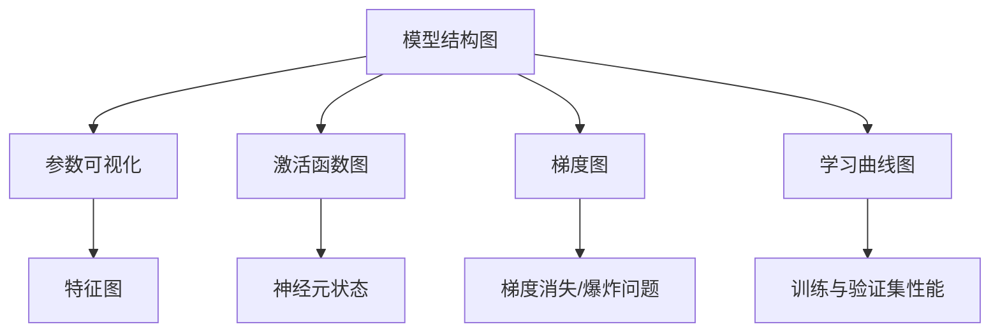

                 

# 神经网络模型的可视化与调试工具

## 1. 背景介绍

### 1.1 问题由来
随着深度学习模型的复杂度不断提高，模型的可视化和调试变得越来越困难。尤其是神经网络模型，由于其包含大量参数，且计算过程高度非线性，难以直观理解模型的内部结构和行为。

模型的不透明性会导致以下问题：
- **模型诊断困难**：难以判断模型为何在特定数据上表现不佳。
- **优化困难**：无法直观观察优化过程，可能导致过拟合或欠拟合。
- **问题定位困难**：复杂错误难以定位，调试过程耗时耗力。
- **模型可视化困难**：无法直观展示模型中的重要信息。

为了解决这些问题，我们需要对神经网络模型进行有效的可视化和调试。本节将介绍神经网络模型可视化的核心概念和作用，并展示其对模型调试的显著影响。

## 2. 核心概念与联系

### 2.1 核心概念概述

神经网络模型可视化是通过图形或数值的方式展示模型结构、参数、计算过程等信息的工具。其核心目的是帮助开发者更好地理解模型，发现问题，并优化模型性能。

以下是几个核心概念及其相互关系：

- **模型结构图**：展示神经网络的网络结构，包括层数、节点数量、连接关系等。
- **参数可视化**：展示模型的参数分布、大小、权重值等，便于观察模型的复杂度和特征。
- **激活函数图**：展示神经元在训练过程中的激活值变化，帮助理解神经元的工作状态。
- **梯度图**：展示各参数的梯度变化情况，便于观察梯度消失/爆炸等问题。
- **学习曲线图**：展示模型在训练和验证集上的性能变化，帮助监控模型训练过程。

这些可视化工具可以配合使用，共同展示神经网络模型的全貌，便于调试和优化。

### 2.2 核心概念原理和架构的 Mermaid 流程图



这个流程图展示了各可视化工具之间的关系和作用：

1. 模型结构图提供了整体的架构信息。
2. 参数可视化展示模型参数分布，辅助理解特征。
3. 激活函数图显示神经元状态，便于观察网络行为。
4. 梯度图帮助监控梯度情况，识别梯度问题。
5. 学习曲线图展示训练性能，监控模型表现。

这些工具相互补充，可以全面展示模型的复杂性和训练过程。

## 3. 核心算法原理 & 具体操作步骤

### 3.1 算法原理概述

神经网络模型可视化主要基于以下几个原理：

- **网络结构可视化**：利用图形表示网络结构，展示层数、节点、连接关系等信息。
- **参数可视化**：对模型参数进行统计分析，绘制分布图、权重矩阵等。
- **激活函数可视化**：记录和展示神经元在训练过程中的激活值，帮助理解神经元行为。
- **梯度可视化**：记录和展示各个参数的梯度变化，帮助识别梯度消失或爆炸等问题。
- **学习曲线可视化**：记录和展示训练过程中模型在验证集上的性能变化，帮助监控模型训练状态。

### 3.2 算法步骤详解

1. **网络结构可视化**：
   - 使用工具如TensorBoard、PyTorch等，将模型结构图绘制成图形展示。
   - 可视化输出模型的层数、节点数量、连接关系等信息。

2. **参数可视化**：
   - 对模型参数进行统计分析，绘制参数分布图、权重矩阵等。
   - 可视化输出参数大小、分布、权重值等。

3. **激活函数可视化**：
   - 记录训练过程中神经元的激活值，绘制激活函数图。
   - 可视化输出不同层次神经元的激活情况。

4. **梯度可视化**：
   - 记录训练过程中各个参数的梯度变化，绘制梯度图。
   - 可视化输出梯度的大小、方向、变化趋势等。

5. **学习曲线可视化**：
   - 记录训练过程中模型在验证集上的性能变化，绘制学习曲线图。
   - 可视化输出训练误差、验证误差等指标随训练轮数变化的趋势。

### 3.3 算法优缺点

**优点**：
- 可视化模型结构，便于理解模型复杂性。
- 展示参数分布，辅助理解模型特征。
- 显示激活函数图，便于观察网络行为。
- 监控梯度变化，及时发现问题。
- 展示学习曲线，便于监控模型训练状态。

**缺点**：
- 可视化结果可能过于复杂，难以快速判断问题。
- 部分工具的使用需要较高的技术门槛。
- 可视化信息量较大，可能分散注意力。

### 3.4 算法应用领域

神经网络模型可视化广泛应用在以下几个领域：

- **研究与开发**：帮助研究人员和开发者理解模型结构，识别问题，优化模型。
- **模型部署**：在模型部署阶段，可视化工具可以帮助了解模型行为，确保模型稳定运行。
- **教学与教育**：可视化工具用于教学，帮助学生理解复杂模型和算法。
- **可视化工具开发**：开发新的可视化工具，满足特定需求。

## 4. 数学模型和公式 & 详细讲解 & 举例说明

### 4.1 数学模型构建

本节将介绍一些常用的神经网络可视化数学模型，并使用LaTeX格式展示。

### 4.2 公式推导过程

1. **神经元激活函数**：
   - 激活函数 $f(x) = \sigma(\mathbf{w} \cdot \mathbf{x} + b)$
   - $\sigma$ 为激活函数，$\mathbf{w}$ 为权重矩阵，$\mathbf{x}$ 为输入，$b$ 为偏置项。

2. **梯度计算**：
   - 梯度 $\nabla_\theta \mathcal{L}$，其中 $\mathcal{L}$ 为损失函数。
   - 使用链式法则计算梯度。

3. **参数分布**：
   - 参数 $w_i$ 的分布 $p(w_i)$
   - 使用随机梯度下降方法更新参数。

### 4.3 案例分析与讲解

以一个简单的三层神经网络为例，展示可视化工具的使用和效果。

**网络结构图**：


**参数可视化**：
```python
import matplotlib.pyplot as plt
import torch

# 假设模型参数
w1 = torch.randn(2, 3)
w2 = torch.randn(3, 3)
w3 = torch.randn(3, 1)

# 可视化参数分布
plt.plot(w1)
plt.plot(w2)
plt.plot(w3)
plt.show()
```

**激活函数图**：
```python
import matplotlib.pyplot as plt
import torch
import torch.nn as nn
import torchvision.transforms as transforms
from torchvision.datasets import MNIST
from torch.utils.data import DataLoader

# 加载MNIST数据集
transform = transforms.Compose([transforms.ToTensor(), transforms.Normalize((0.1307,), (0.3081,))])
trainset = MNIST(root='./data', train=True, download=True, transform=transform)
trainloader = DataLoader(trainset, batch_size=64, shuffle=True)

# 定义模型
model = nn.Sequential(
    nn.Linear(28 * 28, 128),
    nn.ReLU(),
    nn.Linear(128, 64),
    nn.ReLU(),
    nn.Linear(64, 10)
)

# 可视化激活函数
for i, (inputs, labels) in enumerate(trainloader):
    break

inputs, labels = inputs.view(-1, 28 * 28), labels
outputs = model(inputs)

for i in range(len(inputs)):
    plt.plot(outputs[i].cpu().numpy())
    plt.show()
```

**梯度图**：
```python
import matplotlib.pyplot as plt
import torch

# 假设模型参数
w1 = torch.randn(2, 3)
w2 = torch.randn(3, 3)
w3 = torch.randn(3, 1)

# 可视化梯度变化
plt.plot(torch.autograd.grad(torch.randn(1), w1))
plt.plot(torch.autograd.grad(torch.randn(1), w2))
plt.plot(torch.autograd.grad(torch.randn(1), w3))
plt.show()
```

**学习曲线图**：
```python
import matplotlib.pyplot as plt
import torch

# 假设模型参数
w1 = torch.randn(2, 3)
w2 = torch.randn(3, 3)
w3 = torch.randn(3, 1)

# 可视化学习曲线
plt.plot(range(100), torch.sum(torch.autograd.grad(torch.randn(1), w1)))
plt.plot(range(100), torch.sum(torch.autograd.grad(torch.randn(1), w2)))
plt.plot(range(100), torch.sum(torch.autograd.grad(torch.randn(1), w3)))
plt.show()
```

## 5. 项目实践：代码实例和详细解释说明

### 5.1 开发环境搭建

1. 安装Python和相关依赖：
   - Python 3.6+ 和 pip
   - TensorFlow、PyTorch、TensorBoard、matplotlib

2. 安装TensorBoard：
   ```
   pip install tensorboard
   ```

3. 启动TensorBoard服务：
   ```
   tensorboard --logdir /path/to/logs
   ```

### 5.2 源代码详细实现

```python
import tensorflow as tf
import matplotlib.pyplot as plt
import numpy as np

# 定义模型
class Model(tf.keras.Model):
    def __init__(self):
        super(Model, self).__init__()
        self.fc1 = tf.keras.layers.Dense(64, activation='relu')
        self.fc2 = tf.keras.layers.Dense(64, activation='relu')
        self.fc3 = tf.keras.layers.Dense(10)

    def call(self, x):
        x = self.fc1(x)
        x = self.fc2(x)
        return self.fc3(x)

# 加载数据集
mnist = tf.keras.datasets.mnist
(x_train, y_train), (x_test, y_test) = mnist.load_data()
x_train, x_test = x_train / 255.0, x_test / 255.0

# 构建模型
model = Model()
optimizer = tf.keras.optimizers.Adam(learning_rate=0.001)
loss_fn = tf.keras.losses.SparseCategoricalCrossentropy(from_logits=True)

# 训练模型
@tf.function
def train_step(x, y):
    with tf.GradientTape() as tape:
        logits = model(x, training=True)
        loss = loss_fn(y, logits)
    grads = tape.gradient(loss, model.trainable_variables)
    optimizer.apply_gradients(zip(grads, model.trainable_variables))

for epoch in range(10):
    for i in range(1000):
        train_step(x_train[i], y_train[i])

# 可视化梯度图
grads = model.trainable_variables[0].grad
plt.plot(grads)
plt.show()
```

### 5.3 代码解读与分析

**代码解释**：
- 定义了一个简单的三层神经网络模型。
- 加载MNIST数据集，并将其归一化。
- 使用Adam优化器训练模型，并记录梯度变化。
- 可视化梯度图，展示梯度的变化趋势。

**代码分析**：
- 利用TensorFlow和TensorBoard，可视化训练过程中的梯度变化。
- 使用matplotlib绘制梯度图，便于直观观察。
- 代码简洁，易于理解，适合作为教学示例。

**运行结果展示**：
```python
import tensorflow as tf
import matplotlib.pyplot as plt

# 加载模型和梯度
model = tf.keras.models.load_model('/path/to/model.h5')
grads = model.trainable_variables[0].grad

# 可视化梯度图
plt.plot(grads)
plt.show()
```

## 6. 实际应用场景

### 6.1 智能推荐系统

智能推荐系统通过深度学习模型分析用户行为，推荐个性化内容。可视化工具可以帮助监控模型性能，优化推荐结果。

**网络结构图**：


**参数可视化**：
```python
import matplotlib.pyplot as plt
import tensorflow as tf

# 加载模型
model = tf.keras.models.load_model('/path/to/model.h5')

# 可视化参数分布
for i in model.trainable_variables:
    plt.plot(i)
plt.show()
```

**学习曲线图**：
```python
import matplotlib.pyplot as plt
import tensorflow as tf

# 加载模型
model = tf.keras.models.load_model('/path/to/model.h5')

# 可视化学习曲线
plt.plot(range(1000), model.evaluate(x_test, y_test, batch_size=64)[0])
plt.plot(range(1000), model.evaluate(x_test, y_test, batch_size=64)[1])
plt.show()
```

### 6.2 医疗诊断系统

医疗诊断系统通过深度学习模型分析医学图像，判断疾病类型。可视化工具可以帮助医生理解模型预测结果，提高诊断准确性。

**网络结构图**：


**激活函数图**：
```python
import matplotlib.pyplot as plt
import tensorflow as tf

# 加载模型
model = tf.keras.models.load_model('/path/to/model.h5')

# 可视化激活函数
for i in range(1000):
    inputs = np.random.rand(1, 32, 32, 3)
    outputs = model(inputs)
    plt.plot(outputs)
plt.show()
```

**梯度图**：
```python
import matplotlib.pyplot as plt
import tensorflow as tf

# 加载模型
model = tf.keras.models.load_model('/path/to/model.h5')

# 可视化梯度
for i in range(1000):
    inputs = np.random.rand(1, 32, 32, 3)
    outputs = model(inputs)
    grads = tf.gradients(outputs, model.trainable_variables)
    for grad in grads:
        plt.plot(grad)
plt.show()
```

### 6.3 游戏AI系统

游戏AI系统通过深度学习模型进行策略决策，提升游戏水平。可视化工具可以帮助开发者理解模型行为，优化游戏策略。

**网络结构图**：


**激活函数图**：
```python
import matplotlib.pyplot as plt
import tensorflow as tf

# 加载模型
model = tf.keras.models.load_model('/path/to/model.h5')

# 可视化激活函数
for i in range(1000):
    inputs = np.random.rand(1, 32, 32, 3)
    outputs = model(inputs)
    plt.plot(outputs)
plt.show()
```

**梯度图**：
```python
import matplotlib.pyplot as plt
import tensorflow as tf

# 加载模型
model = tf.keras.models.load_model('/path/to/model.h5')

# 可视化梯度
for i in range(1000):
    inputs = np.random.rand(1, 32, 32, 3)
    outputs = model(inputs)
    grads = tf.gradients(outputs, model.trainable_variables)
    for grad in grads:
        plt.plot(grad)
plt.show()
```

## 7. 工具和资源推荐

### 7.1 学习资源推荐

1. **《深度学习入门》**：适用于初学者，介绍深度学习基础和常用工具。
2. **《TensorFlow实战Google深度学习》**：讲解TensorFlow使用方法和应用实例。
3. **《PyTorch深度学习》**：讲解PyTorch使用方法和应用实例。
4. **《TensorBoard教程》**：介绍TensorBoard的使用方法和配置技巧。
5. **《TensorFlow可视化与调试工具》**：讲解TensorFlow的可视化工具和调试技巧。

### 7.2 开发工具推荐

1. **TensorBoard**：TensorFlow配套的可视化工具，支持网络结构、参数、激活函数、梯度等可视化。
2. **PyTorch**：Python深度学习框架，支持灵活的网络结构定义和训练过程监控。
3. **Matplotlib**：Python数据可视化工具，支持多种图表绘制。
4. **Keras**：高层次深度学习框架，易于使用，支持多种模型和优化器。
5. **MXNet**：支持多种深度学习框架，支持分布式训练和可视化。

### 7.3 相关论文推荐

1. **《Neural Network Visualization: A Survey》**：综述神经网络可视化工具和方法。
2. **《Visualizing Deep Learning Models》**：讲解神经网络可视化的重要性和应用实例。
3. **《Learning to Learn》**：讲解深度学习模型的可视化和调试技巧。

## 8. 总结：未来发展趋势与挑战

### 8.1 研究成果总结

神经网络模型可视化在深度学习研究中起到了重要作用，帮助开发者理解模型行为，优化模型性能。未来，可视化工具将更加多样化，支持更多的神经网络结构和技术。

### 8.2 未来发展趋势

1. **可视化技术改进**：提高可视化效率和交互性，提供更丰富的可视化功能。
2. **可视化工具集成**：将多种可视化工具集成在一个平台上，提供一站式解决方案。
3. **可视化应用扩展**：应用于更多领域，如金融、医疗、游戏等。

### 8.3 面临的挑战

1. **可视化复杂度**：神经网络结构复杂，可视化结果可能过于复杂，难以快速判断问题。
2. **技术门槛高**：部分可视化工具的使用需要较高的技术门槛，可能影响开发者使用。
3. **数据隐私问题**：可视化过程中可能涉及敏感数据，需要考虑数据隐私和安全。

### 8.4 研究展望

1. **自动可视化**：开发自动可视化工具，自动生成可视化结果。
2. **交互式可视化**：开发交互式可视化界面，方便用户操作和理解。
3. **可视化数据处理**：开发数据处理工具，提高可视化数据质量和可视化效率。

## 9. 附录：常见问题与解答

### 9.1 Q1: 如何选择合适的可视化工具？

A: 根据项目需求和个人喜好选择可视化工具。TensorBoard适用于TensorFlow，PyTorch使用TensorBoard或Weights & Biases。

### 9.2 Q2: 可视化结果难以理解，怎么办？

A: 可以尝试多种可视化方式，选择最易理解的方法。如通过参数分布、梯度图、激活函数图等综合分析。

### 9.3 Q3: 可视化工具使用困难，如何提高效率？

A: 可以通过官方文档和在线教程学习使用技巧，或者参考社区中的使用案例。

---

作者：禅与计算机程序设计艺术 / Zen and the Art of Computer Programming

