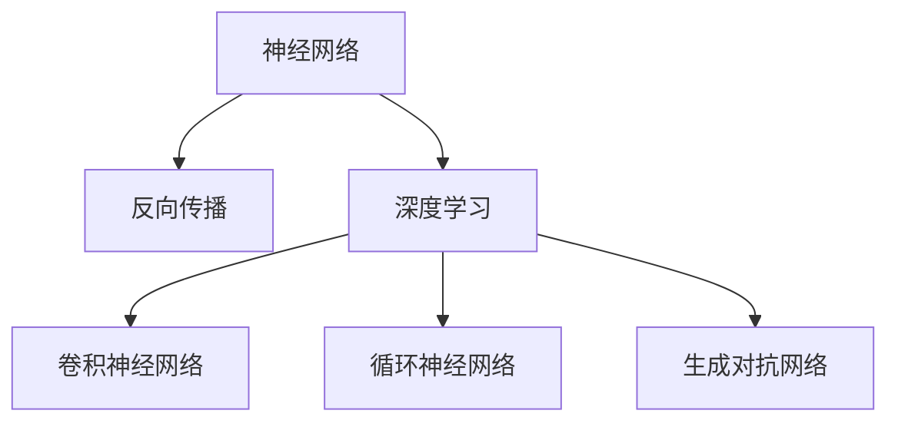

                 

# 神经网络：人工智能的未来

## 1. 背景介绍

### 1.1 问题由来
神经网络，作为人工智能（AI）领域最为重要的技术之一，自1980年代以来，经历了几次重大突破，从浅层感知机（Perceptron）到多层感知器（MLP），再到卷积神经网络（CNN）和循环神经网络（RNN），每一次的演进都为AI领域带来了革命性的变化。

近年来，深度学习（Deep Learning）的兴起，特别是神经网络在图像识别、语音识别、自然语言处理等领域的卓越表现，更是将神经网络的研究推向了新的高度。在大数据、高性能计算和深度学习理论的推动下，神经网络成为了解决复杂问题的有力工具，正在塑造着人工智能的未来。

### 1.2 问题核心关键点
神经网络的核心关键点在于其能够通过大量的数据训练，自动提取特征，学习复杂模式，实现对未知数据的预测和分类。这一过程通常包括以下几个步骤：

1. **数据准备**：收集并标注数据集，用于模型训练。
2. **模型设计**：选择合适的神经网络结构，如卷积神经网络、循环神经网络、生成对抗网络等。
3. **模型训练**：使用反向传播算法（Backpropagation）训练模型，最小化损失函数。
4. **模型评估**：使用验证集或测试集评估模型性能。
5. **模型部署**：将训练好的模型应用于实际场景中。

这些步骤共同构成了神经网络的核心流程，使得神经网络在图像识别、语音识别、自然语言处理、推荐系统等领域取得了显著的成果。

### 1.3 问题研究意义
研究神经网络技术，对于推动人工智能的发展具有重要意义：

1. **推动技术创新**：神经网络技术不断演进，催生了更多的新算法和模型，如深度信念网络、生成对抗网络、注意力机制等，为AI领域注入了新的活力。
2. **提高模型性能**：神经网络通过自动化的特征提取和模式学习，显著提高了模型的预测准确率和泛化能力，使得AI系统能够应对更复杂、多样化的任务。
3. **加速应用落地**：神经网络的强大性能使得其在实际应用中得到了广泛应用，如智能推荐系统、自动驾驶、语音助手等，推动了AI技术的产业化进程。
4. **赋能行业升级**：神经网络技术的应用，为传统行业带来了变革性影响，如金融、医疗、教育等，提高了这些行业的智能化水平和效率。
5. **促进跨领域融合**：神经网络在图像、语音、文本等多模态数据上的良好表现，促进了不同领域的深度融合，如计算机视觉与自然语言处理的结合，为跨领域的创新应用提供了可能。

## 2. 核心概念与联系

### 2.1 核心概念概述

为更好地理解神经网络的核心概念，本节将介绍几个关键概念：

- **神经网络（Neural Network, NN）**：由多个神经元（或节点）组成的计算模型，通过连接权重和激活函数，实现对输入数据的处理和预测。
- **反向传播（Backpropagation）**：一种用于优化神经网络权重的算法，通过链式法则计算梯度，更新模型参数。
- **深度学习（Deep Learning）**：基于多层神经网络的机器学习方法，通过逐层特征提取和抽象，学习复杂的模式和关系。
- **卷积神经网络（Convolutional Neural Network, CNN）**：一种专门用于处理图像数据的神经网络，通过卷积和池化操作提取特征。
- **循环神经网络（Recurrent Neural Network, RNN）**：一种能够处理序列数据的神经网络，通过记忆单元（如LSTM、GRU）捕捉序列信息。
- **生成对抗网络（Generative Adversarial Network, GAN）**：由生成器和判别器组成的两层神经网络，通过对抗训练生成高质量的假数据。

这些概念之间的逻辑关系可以通过以下Mermaid流程图来展示：



这个流程图展示了一些核心概念及其之间的关系：

1. 神经网络是深度学习的基础，通过反向传播算法进行参数优化。
2. 深度学习通过多层神经网络实现复杂模式学习，分为卷积神经网络、循环神经网络等。
3. 生成对抗网络是一种特殊类型的神经网络，用于生成假数据。

这些概念共同构成了神经网络的学习和应用框架，使其能够处理各种类型的输入数据，实现复杂的预测和生成任务。

## 3. 核心算法原理 & 具体操作步骤
### 3.1 算法原理概述

神经网络的核心算法原理是反向传播算法，通过梯度下降法不断优化模型参数，最小化损失函数。其核心思想是：通过链式法则计算梯度，并将梯度反向传播到每一层神经元，更新权重和偏置，以实现模型的自监督学习。

形式化地，假设神经网络模型为 $M_\theta$，其中 $\theta$ 为模型参数。给定训练集 $D=\{(x_i, y_i)\}_{i=1}^N$，其中 $x_i$ 为输入，$y_i$ 为标签，神经网络的损失函数为 $L_\theta(y_i, M_\theta(x_i))$。神经网络的优化目标是最小化损失函数：

$$
\theta^* = \mathop{\arg\min}_{\theta} \sum_{i=1}^N L_\theta(y_i, M_\theta(x_i))
$$

反向传播算法通过链式法则计算损失函数对每个神经元输出的梯度，并通过激活函数求导反向传播，计算梯度。具体步骤如下：

1. **前向传播**：将输入数据 $x$ 逐层传递，通过激活函数计算各层的输出 $h_l(x)$。
2. **计算误差**：通过损失函数计算预测值 $y$ 与真实值 $y'$ 之间的误差 $E(y,y')$。
3. **反向传播**：从输出层开始，通过链式法则计算误差对每个神经元输出的梯度，并利用激活函数的导数计算权重和偏置的梯度。
4. **参数更新**：使用梯度下降法更新模型参数 $\theta$，使误差最小化。

### 3.2 算法步骤详解

神经网络模型训练的一般步骤如下：

**Step 1: 数据准备**
- 收集并标注训练数据集 $D$，划分为训练集、验证集和测试集。
- 将数据进行预处理，如归一化、标准化、数据增强等，以提高模型泛化能力。

**Step 2: 模型设计**
- 选择合适的神经网络结构，如卷积神经网络、循环神经网络等。
- 确定模型的输入输出维度，选择合适的激活函数和损失函数。

**Step 3: 模型训练**
- 将训练集数据分批次输入模型，进行前向传播计算输出。
- 计算损失函数值，并根据链式法则计算梯度。
- 使用优化算法（如SGD、Adam）更新模型参数。
- 周期性在验证集上评估模型性能，决定是否触发Early Stopping。
- 重复上述步骤直到满足预设的迭代轮数或Early Stopping条件。

**Step 4: 模型评估**
- 在测试集上评估模型性能，对比训练前后精度提升。
- 使用模型对新样本进行推理预测，集成到实际应用系统中。

### 3.3 算法优缺点

神经网络算法具有以下优点：
1. **自动特征提取**：通过多层次的特征学习，神经网络能够自动提取数据的抽象特征，无需手工设计特征。
2. **泛化能力强**：通过大量数据训练，神经网络具备较强的泛化能力，能够处理未知数据。
3. **可解释性提升**：随着模型结构的改进和算法的优化，神经网络的可解释性也在不断提高，如使用注意力机制、可解释模型等。
4. **应用广泛**：神经网络在图像识别、语音识别、自然语言处理等多个领域都有广泛应用，推动了AI技术的发展。

同时，该算法也存在以下局限性：
1. **数据依赖**：神经网络需要大量标注数据进行训练，数据收集和标注成本较高。
2. **计算资源消耗大**：神经网络训练和推理需要大量的计算资源，对硬件要求高。
3. **过拟合风险**：在训练数据不足或模型复杂度过高的情况下，神经网络容易出现过拟合现象。
4. **模型结构复杂**：神经网络的复杂结构可能导致模型训练和推理过程较为复杂，难以调试和优化。
5. **模型可解释性差**：深度神经网络往往被视为"黑盒"系统，难以解释其内部工作机制和决策逻辑。

尽管存在这些局限性，但神经网络在处理复杂数据和任务上的卓越表现，使得其在实际应用中具有不可替代的地位。未来研究将更多关注如何提高神经网络的效率、可解释性和鲁棒性，以适应更广泛的应用场景。

### 3.4 算法应用领域

神经网络技术在多个领域得到了广泛应用，如：

- 计算机视觉：如图像分类、目标检测、人脸识别等。
- 自然语言处理：如机器翻译、文本分类、情感分析等。
- 语音识别：如语音转文本、语音识别、语音合成等。
- 推荐系统：如协同过滤、基于内容的推荐、深度推荐等。
- 游戏AI：如智能游戏、游戏推荐、机器人对战等。
- 金融分析：如股票预测、信用评估、风险管理等。

除了上述这些经典应用外，神经网络还在医疗、交通、环境监测等更多领域得到了创新性应用，展示了其强大的跨领域适用性。

## 4. 数学模型和公式 & 详细讲解 & 举例说明

### 4.1 数学模型构建

神经网络模型的数学模型通常基于以下几个关键部分：

1. **输入层**：输入数据 $x$。
2. **隐藏层**：神经元 $h_l(x)$，通过激活函数 $f$ 计算得到。
3. **输出层**：预测值 $y$，通过线性变换和激活函数计算得到。
4. **损失函数**：如均方误差损失 $L = \frac{1}{N} \sum_{i=1}^N (y_i - M_\theta(x_i))^2$，交叉熵损失 $L = -\frac{1}{N} \sum_{i=1}^N y_i \log M_\theta(x_i)$ 等。

### 4.2 公式推导过程

以最简单的单层感知机为例，假设输入数据 $x$ 和标签 $y$，模型参数为 $\theta$，激活函数为 $f$，则模型的输出 $y$ 可以通过以下公式计算：

$$
y = M_\theta(x) = \theta \cdot x + b
$$

其中 $b$ 为偏置项，$f(y) = f(\theta \cdot x + b)$ 为激活函数。损失函数为均方误差损失：

$$
L = \frac{1}{2} \sum_{i=1}^N (y_i - M_\theta(x_i))^2
$$

通过反向传播算法，计算损失函数对每个神经元输出的梯度 $\nabla_\theta L$，并利用链式法则计算权重和偏置的梯度：

$$
\nabla_\theta L = \frac{\partial L}{\partial \theta} = \sum_{i=1}^N (y_i - M_\theta(x_i)) \frac{\partial M_\theta(x_i)}{\partial \theta}
$$

其中 $\frac{\partial M_\theta(x_i)}{\partial \theta}$ 可以通过反向传播计算得到。

### 4.3 案例分析与讲解

以卷积神经网络（CNN）为例，CNN在图像识别任务中表现出色。其核心思想是通过卷积和池化操作，自动提取图像特征，并通过多层次的特征学习，提升模型的泛化能力。

假设输入图像 $x$ 大小为 $H \times W \times C$，卷积核 $k$ 大小为 $h \times w$，输出特征图 $y$ 大小为 $H' \times W' \times C'$，则卷积操作可以通过以下公式计算：

$$
y_{i,j,k} = \sum_{m=0}^{h-1} \sum_{n=0}^{w-1} x_{i-m,j-n,k} \cdot w_{m,n}
$$

其中 $w_{m,n}$ 为卷积核权重，通过前向传播计算得到。池化操作可以将特征图尺寸缩小，保留重要的特征信息，如最大池化、平均池化等。

CNN模型在图像识别任务中的训练过程大致如下：
1. 将图像数据 $x$ 和标签 $y$ 划分为训练集和测试集，并进行数据增强等预处理。
2. 选择适当的卷积层、池化层、全连接层等组成CNN模型。
3. 使用随机梯度下降法（SGD）或其他优化算法进行模型训练。
4. 在验证集上评估模型性能，决定是否触发Early Stopping。
5. 在测试集上评估模型性能，使用模型对新图像进行分类预测。

## 5. 项目实践：代码实例和详细解释说明

### 5.1 开发环境搭建

在进行神经网络项目实践前，我们需要准备好开发环境。以下是使用Python进行PyTorch开发的环境配置流程：

1. 安装Anaconda：从官网下载并安装Anaconda，用于创建独立的Python环境。

2. 创建并激活虚拟环境：
```bash
conda create -n pytorch-env python=3.8 
conda activate pytorch-env
```

3. 安装PyTorch：根据CUDA版本，从官网获取对应的安装命令。例如：
```bash
conda install pytorch torchvision torchaudio cudatoolkit=11.1 -c pytorch -c conda-forge
```

4. 安装TensorBoard：使用pip安装TensorBoard，用于实时监测模型训练状态。
```bash
pip install tensorboard
```

5. 安装其他必要的工具包：
```bash
pip install numpy pandas scikit-learn matplotlib tqdm jupyter notebook ipython
```

完成上述步骤后，即可在`pytorch-env`环境中开始神经网络项目实践。

### 5.2 源代码详细实现

下面以一个简单的卷积神经网络（CNN）模型为例，给出使用PyTorch进行图像分类的代码实现。

```python
import torch
import torch.nn as nn
import torch.optim as optim
import torchvision.transforms as transforms
from torchvision import datasets, models

# 定义CNN模型
class Net(nn.Module):
    def __init__(self):
        super(Net, self).__init__()
        self.conv1 = nn.Conv2d(3, 6, 5)
        self.pool = nn.MaxPool2d(2, 2)
        self.conv2 = nn.Conv2d(6, 16, 5)
        self.fc1 = nn.Linear(16 * 5 * 5, 120)
        self.fc2 = nn.Linear(120, 84)
        self.fc3 = nn.Linear(84, 10)

    def forward(self, x):
        x = self.pool(nn.functional.relu(self.conv1(x)))
        x = self.pool(nn.functional.relu(self.conv2(x)))
        x = x.view(-1, 16 * 5 * 5)
        x = nn.functional.relu(self.fc1(x))
        x = nn.functional.relu(self.fc2(x))
        x = self.fc3(x)
        return x

# 数据预处理
transform = transforms.Compose([
    transforms.ToTensor(),
    transforms.Normalize((0.5, 0.5, 0.5), (0.5, 0.5, 0.5))
])

trainset = datasets.CIFAR10(root='./data', train=True, download=True, transform=transform)
trainloader = torch.utils.data.DataLoader(trainset, batch_size=4, shuffle=True, num_workers=2)

testset = datasets.CIFAR10(root='./data', train=False, download=True, transform=transform)
testloader = torch.utils.data.DataLoader(testset, batch_size=4, shuffle=False, num_workers=2)

# 定义模型和优化器
model = Net()
criterion = nn.CrossEntropyLoss()
optimizer = optim.SGD(model.parameters(), lr=0.001, momentum=0.9)

# 训练模型
for epoch in range(2):  # 只训练两轮
    running_loss = 0.0
    for i, data in enumerate(trainloader, 0):
        inputs, labels = data
        optimizer.zero_grad()
        outputs = model(inputs)
        loss = criterion(outputs, labels)
        loss.backward()
        optimizer.step()
        running_loss += loss.item()
        if i % 2000 == 1999:    # 每2000个小批处理一次打印
            print('[%d, %5d] loss: %.3f' %
                  (epoch + 1, i + 1, running_loss / 2000))
            running_loss = 0.0

print('Finished Training')

# 测试模型
correct = 0
total = 0
with torch.no_grad():
    for data in testloader:
        images, labels = data
        outputs = model(images)
        _, predicted = torch.max(outputs.data, 1)
        total += labels.size(0)
        correct += (predicted == labels).sum().item()

print('Accuracy of the network on the 10000 test images: %d %%' % (
    100 * correct / total))
```

以上就是使用PyTorch进行图像分类任务的完整代码实现。可以看到，通过PyTorch的高级API，代码实现变得简洁高效，开发者可以轻松构建和训练卷积神经网络。

### 5.3 代码解读与分析

让我们再详细解读一下关键代码的实现细节：

**Net类**：
- `__init__`方法：定义卷积、池化、全连接等核心组件。
- `forward`方法：定义模型前向传播的计算流程。

**数据预处理**：
- 使用`transforms.Compose`将一系列数据变换组合起来，进行图像归一化和数据增强。

**模型训练**：
- 定义训练集和测试集，使用`DataLoader`进行批处理，以便模型训练和推理。
- 使用SGD优化算法，根据梯度下降法更新模型参数。
- 在每个epoch结束时打印训练误差。

**模型测试**：
- 在测试集上评估模型性能，使用`no_grad`模式进行推理。
- 计算模型在测试集上的分类准确率，并打印输出。

可以看到，PyTorch提供了强大的API和工具，使得神经网络模型的构建和训练变得简单高效。开发者只需关注模型结构和算法细节，无需过多关注底层实现。

当然，在工业级的系统实现中，还需要考虑更多因素，如模型保存和部署、超参数调优、分布式训练等。但核心的训练流程大致相同。

## 6. 实际应用场景
### 6.1 计算机视觉

神经网络技术在计算机视觉领域的应用极为广泛，如图像分类、目标检测、人脸识别、图像生成等。通过训练神经网络模型，可以从原始图像中自动提取特征，实现对图像的高效处理和分析。

例如，在图像分类任务中，神经网络通过多层卷积和池化操作，自动提取图像特征，并通过全连接层进行分类。在目标检测任务中，神经网络通过区域提议网络（RPN）生成候选框，并通过分类和回归网络进行目标定位和大小预测。

### 6.2 自然语言处理

神经网络技术在自然语言处理领域也有广泛应用，如机器翻译、文本分类、情感分析、问答系统等。通过训练神经网络模型，可以从自然语言文本中自动提取语义信息，并进行分类、生成、推理等操作。

例如，在机器翻译任务中，神经网络通过编码器和解码器结构，将源语言文本自动翻译成目标语言文本。在文本分类任务中，神经网络通过多层全连接层或卷积层，自动提取文本特征，并进行分类。在问答系统中，神经网络通过记忆网络（如LSTM、GRU）捕捉问题-答案对，并进行推理和生成。

### 6.3 语音识别

神经网络技术在语音识别领域也有广泛应用，如语音转文本、语音识别、语音合成等。通过训练神经网络模型，可以从音频信号中自动提取语音特征，并进行语音识别和生成。

例如，在语音转文本任务中，神经网络通过卷积层和全连接层，自动提取音频信号的特征，并进行语音转文本。在语音识别任务中，神经网络通过多层循环神经网络（RNN），自动提取音频信号的特征，并进行语音识别。在语音合成任务中，神经网络通过生成对抗网络（GAN）或变分自编码器（VAE），生成高质量的合成语音。

### 6.4 推荐系统

神经网络技术在推荐系统中的应用也非常广泛，如协同过滤、基于内容的推荐、深度推荐等。通过训练神经网络模型，可以从用户行为数据中自动提取特征，并进行推荐预测。

例如，在协同过滤推荐任务中，神经网络通过多层全连接层，自动提取用户和物品的特征，并进行推荐预测。在基于内容的推荐任务中，神经网络通过卷积层和池化层，自动提取物品的特征，并进行推荐预测。在深度推荐任务中，神经网络通过多层卷积层和池化层，自动提取用户和物品的特征，并进行推荐预测。

### 6.5 游戏AI

神经网络技术在游戏AI领域也有广泛应用，如智能游戏、游戏推荐、机器人对战等。通过训练神经网络模型，可以从游戏数据中自动提取特征，并进行游戏决策和推荐。

例如，在智能游戏任务中，神经网络通过多层卷积和池化层，自动提取游戏状态特征，并进行游戏决策。在游戏推荐任务中，神经网络通过多层全连接层，自动提取游戏特征，并进行游戏推荐。在机器人对战任务中，神经网络通过多层循环神经网络（RNN），自动提取游戏状态特征，并进行游戏决策。

## 7. 工具和资源推荐
### 7.1 学习资源推荐

为了帮助开发者系统掌握神经网络的技术基础和实践技巧，这里推荐一些优质的学习资源：

1. 《深度学习》（Ian Goodfellow、Yoshua Bengio、Aaron Courville著）：经典的深度学习教材，系统讲解了深度学习的基本理论和实践方法。

2. 《神经网络与深度学习》（Michael Nielsen著）：通俗易懂地介绍了神经网络的基本原理和应用，适合入门学习。

3. 《动手学深度学习》（李沐等著）：基于MXNet的深度学习教材，包含丰富的代码示例和动手实验。

4. 《神经网络基础》（李航著）：系统讲解了神经网络的基本概念和原理，适合深入理解。

5. DeepLearning.ai（Andrew Ng主讲）：斯坦福大学开设的深度学习课程，涵盖神经网络、深度学习、计算机视觉等方向。

通过对这些资源的学习实践，相信你一定能够快速掌握神经网络的技术精髓，并用于解决实际的AI问题。
###  7.2 开发工具推荐

高效的开发离不开优秀的工具支持。以下是几款用于神经网络开发的常用工具：

1. PyTorch：基于Python的开源深度学习框架，灵活动态的计算图，适合快速迭代研究。提供了丰富的模型和优化器，支持分布式训练和GPU加速。

2. TensorFlow：由Google主导开发的开源深度学习框架，生产部署方便，支持多种硬件平台和深度学习算法。

3. Keras：基于Python的高层API，提供了简单易用的接口，适合快速搭建和训练神经网络模型。

4. MXNet：由Apache支持的深度学习框架，支持多种编程语言，适合大规模工程应用。

5. Caffe：基于C++的深度学习框架，适合高性能计算和图像处理任务。

6. Theano：基于Python的数学库，提供高效的数值计算和自动微分，支持GPU加速。

合理利用这些工具，可以显著提升神经网络开发的效率，加快模型训练和推理的速度，同时提高模型的准确率和泛化能力。

### 7.3 相关论文推荐

神经网络技术的发展离不开学界的持续研究。以下是几篇奠基性的相关论文，推荐阅读：

1. **多层感知机（MLP）**：1988年，Yoshua Bengio、Geoffrey Hinton和Christopher J.C. Burges发表了论文《学习多层神经网络》，奠定了多层感知机的理论基础。

2. **卷积神经网络（CNN）**：1989年，Yann LeCun、Léon Bottou、Gérard Baho和John Denker发表了论文《反向传播学习在计算机视觉中的应用》，提出了卷积神经网络的模型架构。

3. **循环神经网络（RNN）**：1990年，Sepp Hochreiter和Jürgen Schmidhuber发表了论文《长短期记忆网络》，提出了循环神经网络的模型架构。

4. **深度信念网络（DBN）**：2006年，Geoffrey Hinton发表了论文《深度信念网络》，提出了深度信念网络的模型架构。

5. **生成对抗网络（GAN）**：2014年，Ian Goodfellow、Jean Pouget-Abadie、Mehdi Mirza、Bing Xu、David Warde-Farley、Sherjil Ozair、Aaron Courville和Yoshua Bengio发表了论文《生成对抗网络》，提出了生成对抗网络的模型架构。

这些论文代表了大神经网络的发展脉络。通过学习这些前沿成果，可以帮助研究者把握学科前进方向，激发更多的创新灵感。

## 8. 总结：未来发展趋势与挑战

### 8.1 总结

本文对神经网络技术进行了全面系统的介绍。首先阐述了神经网络的发展背景和核心原理，明确了神经网络在AI领域的重要地位。其次，从原理到实践，详细讲解了神经网络模型的数学模型和训练过程，给出了神经网络项目开发的完整代码实例。同时，本文还广泛探讨了神经网络技术在计算机视觉、自然语言处理、语音识别、推荐系统、游戏AI等多个领域的应用前景，展示了神经网络技术的强大威力。

通过本文的系统梳理，可以看到，神经网络技术已经广泛应用于各个领域，推动了AI技术的快速发展。未来，伴随神经网络技术的不断演进，其在更多领域的应用将更加广泛，为人类社会的智能化转型注入新的动力。

### 8.2 未来发展趋势

展望未来，神经网络技术将呈现以下几个发展趋势：

1. **模型规模不断增大**：随着计算能力和数据量的提升，神经网络模型的参数量还将持续增长。超大规模神经网络有望学习到更复杂的语言和视觉模式，推动AI技术的进一步发展。

2. **模型结构更加复杂**：未来的神经网络模型将采用更加复杂的结构，如注意力机制、自注意力机制、跨模态融合等，提升模型的表达能力和泛化能力。

3. **模型训练更加高效**：未来的神经网络训练将更加高效，通过分布式训练、混合精度训练等技术，减少训练时间和资源消耗，提升模型训练的速度和效率。

4. **模型应用更加广泛**：神经网络技术将进一步渗透到更多领域，如医疗、金融、交通、环境监测等，推动这些领域的智能化升级。

5. **模型可解释性提升**：未来的神经网络模型将更加注重可解释性，通过模型压缩、可视化技术等手段，提高模型的透明性和可信度。

6. **跨领域融合更加深入**：未来的神经网络技术将与其他AI技术进行更深层次的融合，如知识图谱、自然语言处理、计算机视觉等，推动跨领域应用的创新。

这些趋势凸显了神经网络技术的广阔前景。这些方向的探索发展，必将进一步推动AI技术的成熟和应用，为人类的智能化进程注入新的活力。

### 8.3 面临的挑战

尽管神经网络技术已经取得了瞩目成就，但在迈向更加智能化、普适化应用的过程中，它仍面临着诸多挑战：

1. **数据依赖问题**：神经网络需要大量高质量标注数据进行训练，数据收集和标注成本较高。如何降低对标注数据的依赖，提高模型的泛化能力，是一个重要问题。

2. **计算资源消耗大**：神经网络训练和推理需要大量的计算资源，对硬件要求高。如何优化模型结构和训练算法，减少计算资源消耗，提高模型训练和推理的效率，是一个重要问题。

3. **模型鲁棒性不足**：神经网络在面对域外数据时，泛化性能往往大打折扣。如何在保持模型性能的同时，提高模型的鲁棒性和泛化能力，是一个重要问题。

4. **模型可解释性差**：深度神经网络往往被视为"黑盒"系统，难以解释其内部工作机制和决策逻辑。如何提高模型的可解释性，赋予模型更高的可信度，是一个重要问题。

5. **安全性问题**：神经网络模型可能存在预测偏差、有害信息等风险，对社会和伦理造成负面影响。如何设计安全的神经网络模型，保障其输出的公正性和可信度，是一个重要问题。

6. **隐私保护问题**：神经网络模型在处理敏感数据时，可能存在隐私泄露的风险。如何保护用户隐私，保障数据安全，是一个重要问题。

这些挑战凸显了神经网络技术在实际应用中的复杂性和多样性。未来研究需要在这些方面进行更多探索，以推动神经网络技术的进一步成熟和应用。

### 8.4 研究展望

面对神经网络技术所面临的种种挑战，未来的研究需要在以下几个方面寻求新的突破：

1. **无监督学习和自监督学习**：探索无监督学习和自监督学习的方法，减少对标注数据的依赖，提高模型的泛化能力。

2. **参数高效和计算高效的模型**：开发更加参数高效和计算高效的神经网络模型，提高模型的效率和可解释性。

3. **跨领域融合技术**：促进跨领域技术融合，推动知识图谱、自然语言处理、计算机视觉等领域的深度结合，提升模型的表达能力和泛化能力。

4. **模型压缩和可视化**：研究模型压缩和可视化技术，提高模型的透明性和可信度，促进模型的理解和应用。

5. **安全性和隐私保护**：设计安全的神经网络模型，保障其输出的公正性和可信度，保护用户隐私和数据安全。

6. **人机协同系统**：研究人机协同系统，通过智能代理、交互界面等手段，提升人机交互体验和效果。

这些研究方向将为神经网络技术的进一步发展提供新的思路和方法，推动神经网络技术在更多领域的应用，实现人类社会的智能化升级。

## 9. 附录：常见问题与解答

**Q1：神经网络模型如何处理非结构化数据？**

A: 神经网络模型可以通过多种方式处理非结构化数据，如自然语言文本、图像、音频等。常用的方法包括：

1. **文本数据**：使用卷积神经网络（CNN）、循环神经网络（RNN）、Transformer等模型，自动提取文本特征，并进行分类、生成、推理等操作。

2. **图像数据**：使用卷积神经网络（CNN）、残差网络（ResNet）等模型，自动提取图像特征，并进行分类、检测、生成等操作。

3. **音频数据**：使用卷积神经网络（CNN）、循环神经网络（RNN）等模型，自动提取音频特征，并进行分类、识别、生成等操作。

**Q2：神经网络模型的训练过程如何优化？**

A: 神经网络模型的训练过程可以通过多种方式进行优化，如：

1. **数据增强**：通过图像旋转、裁剪、噪声等方式，扩充训练集数据，提高模型的泛化能力。

2. **正则化技术**：使用L2正则、Dropout、Batch Normalization等技术，防止模型过拟合。

3. **优化算法**：选择适合的优化算法，如SGD、Adam、Adagrad等，调整学习率和学习率衰减策略。

4. **模型结构优化**：设计合适的神经网络结构，如深度、宽度、激活函数等，提升模型的表达能力和泛化能力。

5. **超参数调优**：通过网格搜索、随机搜索、贝叶斯优化等方法，寻找最优的超参数组合，提升模型性能。

**Q3：神经网络模型如何提高泛化能力？**

A: 提高神经网络模型的泛化能力可以从以下几个方面入手：

1. **数据增强**：扩充训练集数据，通过图像旋转、裁剪、噪声等方式，提高模型的泛化能力。

2. **正则化技术**：使用L2正则、Dropout、Batch Normalization等技术，防止模型过拟合。

3. **模型结构优化**：设计合适的神经网络结构，如深度、宽度、激活函数等，提升模型的表达能力和泛化能力。

4. **迁移学习**：通过迁移学习，将在大规模数据集上预训练的模型应用于小规模任务，提升模型的泛化能力。

5. **自监督学习**：使用自监督学习任务，如掩码语言模型、自编码器等，自动提取数据特征，提高模型的泛化能力。

**Q4：神经网络模型如何提高可解释性？**

A: 提高神经网络模型的可解释性可以从以下几个方面入手：

1. **模型压缩**：通过模型压缩技术，减少模型参数量，提升模型的透明性和可解释性。

2. **可视化技术**：使用可视化技术，如特征可视化、梯度可视化、热力图等，理解模型内部的工作机制。

3. **可解释模型**：使用可解释模型，如决策树、线性回归、逻辑回归等，提升模型的透明性和可解释性。

4. **解释性评估**：通过解释性评估技术，如LIME、SHAP等，评估模型的可解释性和可信度。

5. **用户友好的界面**：设计用户友好的界面，通过交互界面等方式，提升模型的透明性和可解释性。

**Q5：神经网络模型在医疗领域的应用有哪些？**

A: 神经网络模型在医疗领域的应用非常广泛，如：

1. **医学影像分析**：使用卷积神经网络（CNN）、残差网络（ResNet）等模型，自动分析医学影像，进行疾病诊断、病变定位等操作。

2. **电子病历分析**：使用循环神经网络（RNN）、长短时记忆网络（LSTM）等模型，自动分析电子病历数据，进行病情预测、治疗方案推荐等操作。

3. **药物研发**：使用生成对抗网络（GAN）、变分自编码器（VAE）等模型，自动分析药物分子数据，进行药物设计、分子筛选等操作。

4. **基因组学分析**：使用深度学习模型，自动分析基因组数据，进行基因表达分析、疾病关联分析等操作。

5. **患者监控**：使用深度学习模型，自动分析患者监测数据，进行病情预测、治疗效果评估等操作。

这些应用展示了神经网络技术在医疗领域的重要价值，推动了医疗技术的发展和进步。

---

作者：禅与计算机程序设计艺术 / Zen and the Art of Computer Programming

