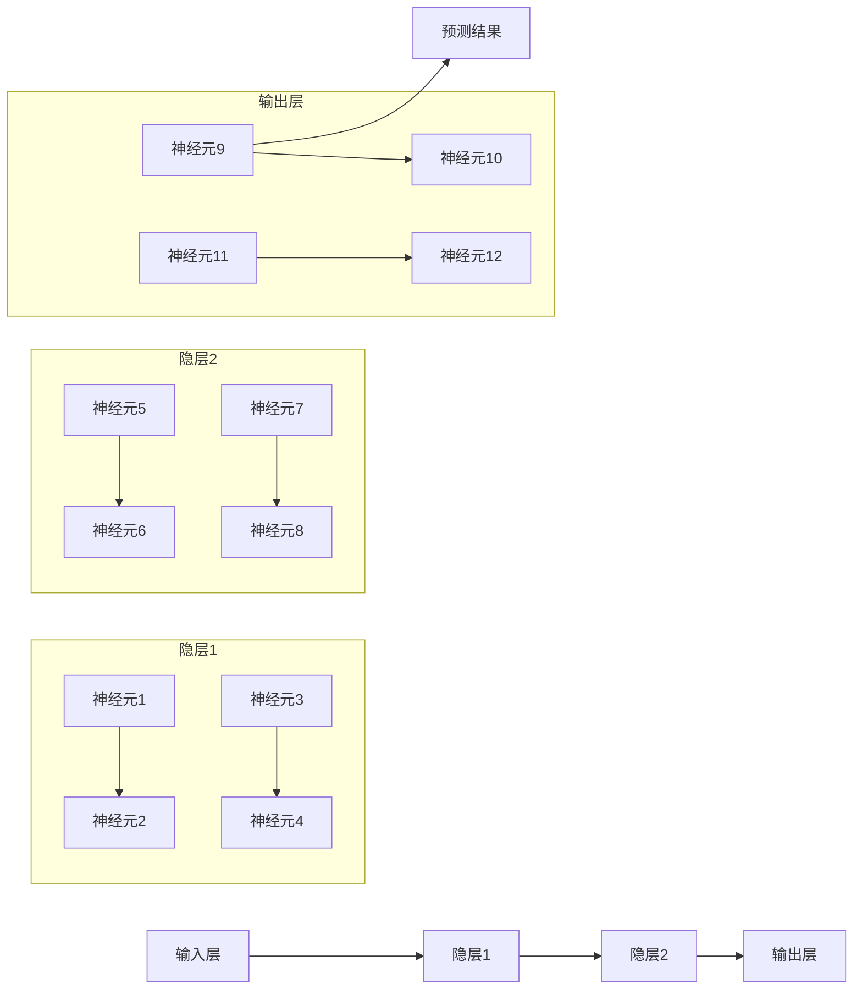

                 

# 神经网络：人类智慧的延伸

## 1. 背景介绍

### 1.1 问题由来

在人类漫长的进化史中，智慧的累积和传承成为了生存的关键。语言、文字、数学、逻辑等抽象思维能力，让人类能够超越个体经验的限制，在更广阔的时空中传递和交流知识。然而，当复杂度日益增长时，人类大脑的计算能力和记忆范围也随之受限。如何超越这些瓶颈，以更高效、更全面的方式记录和处理信息，一直是科技发展的重要课题。

随着计算机科学的发展，神经网络作为一种模拟生物神经元活动的计算模型，逐渐展现出超越人类智慧的潜力。尤其是深度学习时代的到来，神经网络在图像识别、语音处理、自然语言处理(NLP)、游戏AI等领域取得了颠覆性的进展，成为21世纪人工智能的骨干力量。

### 1.2 问题核心关键点

神经网络技术的演进经历了从浅层感知机(Perceptron)到多层感知机(Multilayer Perceptron, MLP)、卷积神经网络(Convolutional Neural Network, CNN)、循环神经网络(Recurrent Neural Network, RNN)、长短期记忆网络(Long Short-Term Memory, LSTM)、门控循环单元(Gated Recurrent Unit, GRU)、卷积LSTM、注意力机制(Attention)、 Transformer等逐步深入的过程。每个阶段的技术突破，都在不同程度上拓展了神经网络的计算能力和应用范围。

神经网络的发展趋势是参数量的增大、网络的深度增加、结构的复杂化。目前，主流的大模型如GPT、BERT等，已达到了亿级参数量。这不仅提升了模型的复杂度和学习能力，也带来了更高的计算资源需求和推理效率的挑战。

### 1.3 问题研究意义

神经网络技术的演进和应用，对人类社会的各个层面产生了深远影响：

1. 工业生产：自动化、智能化生产线、机器人、工业监控等。
2. 医疗健康：诊断、治疗、康复、健康管理等。
3. 交通运输：无人驾驶、智能交通管理、物流配送等。
4. 教育培训：个性化学习、智能辅导、在线教育等。
5. 金融安全：风险管理、欺诈检测、智能投顾等。
6. 安全防护：网络安全、恶意软件检测、入侵检测等。
7. 社会治理：智能客服、舆情分析、灾害预警等。

研究神经网络技术，对于提升人类生产力和生活质量，构建更加智能化的未来社会，具有重大意义。

## 2. 核心概念与联系

### 2.1 核心概念概述

神经网络是一种基于生物神经元计算模型的计算框架。它通过模拟生物神经元之间的连接和激活机制，进行数据的处理和表达。在深度学习中，神经网络通常由多层神经元构成，每一层处理数据的不同特征，逐步提取出更高级的抽象特征，最终输出预测结果。

神经网络的核心概念包括：

- **神经元(Neuron)**：神经网络的基本单位，类似于生物神经元。接收输入、处理信息并传递给下一层神经元。
- **层(Layer)**：神经网络的各层由一组神经元组成。不同层处理不同层次的特征，从低级到高级逐步抽象。
- **激活函数(Activation Function)**：控制神经元的输出特性，如ReLU、Sigmoid、Tanh等。
- **损失函数(Loss Function)**：衡量模型预测结果与真实标签的差异，如均方误差、交叉熵等。
- **优化器(Optimizer)**：通过梯度下降等算法更新模型参数，如Adam、SGD等。
- **过拟合(Overfitting)**：模型在训练集上表现优异，但在测试集上表现不佳的现象。
- **欠拟合(Underfitting)**：模型无法有效捕捉数据规律，训练和测试集表现均不佳的现象。

### 2.2 核心概念原理和架构的 Mermaid 流程图

以下是一个简单化的神经网络架构图，展示了其基本组成：



这个流程图展示了神经网络从输入到输出的基本流程。输入数据经过多层神经元处理后，最终输出预测结果。每一层神经元通过激活函数进行非线性变换，从而提取更高级别的特征。

### 2.3 核心概念间的联系

神经网络中的各个概念并非孤立存在，它们之间通过一系列规则和算法紧密联系：

- **输入层**：接收原始数据，进行预处理。
- **隐层**：提取数据特征，通常由多个神经元组成。
- **输出层**：输出预测结果，通常对应任务的具体类别或值。
- **激活函数**：引入非线性变换，使得模型能够拟合非线性关系。
- **损失函数**：衡量模型预测结果与真实标签的差异，用于优化模型的参数。
- **优化器**：基于梯度下降等算法，自动调整模型参数，最小化损失函数。

这些概念共同构成了神经网络的计算框架，使其具备学习和推理能力。

## 3. 核心算法原理 & 具体操作步骤

### 3.1 算法原理概述

神经网络的计算过程主要分为前向传播和反向传播两个阶段。前向传播将输入数据输入模型，通过各层神经元的计算，输出预测结果。反向传播则根据预测结果与真实标签的误差，反向计算梯度，并根据梯度更新模型参数，从而优化模型性能。

神经网络的优化过程主要包括损失函数的计算、梯度计算、参数更新等步骤。其中，梯度下降算法是最常用的优化算法，通过不断迭代更新模型参数，使得损失函数最小化。

### 3.2 算法步骤详解

以下是神经网络优化的一般步骤：

**Step 1: 准备数据和模型**

1. 准备训练数据和验证数据，划分训练集、验证集、测试集。
2. 定义神经网络模型，包括层数、每层神经元数量、激活函数等。

**Step 2: 定义损失函数**

1. 根据具体任务，选择适合的损失函数。如分类任务使用交叉熵损失，回归任务使用均方误差损失等。
2. 定义损失函数计算方法，通常将模型输出与真实标签进行对比，计算损失。

**Step 3: 定义优化器**

1. 选择适合的优化算法，如Adam、SGD等。
2. 设置优化器的超参数，如学习率、批量大小等。

**Step 4: 前向传播和损失计算**

1. 将训练数据批次输入模型，计算前向传播结果。
2. 计算损失函数值，记录当前误差。

**Step 5: 反向传播和参数更新**

1. 根据损失函数的梯度，计算各层神经元的梯度。
2. 使用优化器更新模型参数，最小化损失函数。

**Step 6: 验证和测试**

1. 在验证集上评估模型性能，监控过拟合情况。
2. 在测试集上测试模型泛化能力，评估最终效果。

通过以上步骤，神经网络模型可以在监督学习任务上逐步优化，提升性能。

### 3.3 算法优缺点

神经网络的优点包括：

1. 强大的特征提取能力：通过多层非线性变换，提取数据中的高级特征。
2. 鲁棒性：面对噪声、缺失数据等复杂情况，仍能保持较高的准确性。
3. 泛化能力强：通过大量的训练数据，能够适应新数据。
4. 可解释性强：通过可视化神经元激活情况，理解模型工作机制。

然而，神经网络也存在一些缺点：

1. 计算资源消耗大：模型参数量和计算复杂度呈指数级增长，需要大量计算资源。
2. 过拟合问题：在训练集上表现优异，但在测试集上表现不佳。
3. 需要大量数据：训练神经网络需要大量的标注数据，获取成本高。
4. 可解释性差：黑盒模型，难以解释内部工作机制。
5. 调试困难：模型复杂度高，调试过程繁琐。

### 3.4 算法应用领域

神经网络技术在多个领域都有广泛应用，包括但不限于：

- **计算机视觉**：图像识别、目标检测、图像分割等。
- **自然语言处理**：机器翻译、情感分析、文本生成等。
- **语音处理**：语音识别、语音合成、语音增强等。
- **游戏AI**：游戏对战、自动策略生成等。
- **金融分析**：风险评估、投资策略、市场预测等。
- **医疗诊断**：疾病诊断、病理分析、基因组学等。
- **能源管理**：智能电网、能源预测等。
- **交通控制**：智能交通、自动驾驶等。

这些应用展示了神经网络技术的强大潜力和广泛影响力。

## 4. 数学模型和公式 & 详细讲解 & 举例说明

### 4.1 数学模型构建

神经网络模型的数学模型可以表示为：

$$
y = f_{\theta}(x)
$$

其中，$y$ 为输出，$x$ 为输入，$\theta$ 为模型参数。通常，神经网络由多层非线性函数$f$构成，每一层有多个神经元，每个神经元接收前一层的输出作为输入，经过线性变换和非线性变换，输出自己的预测结果。

### 4.2 公式推导过程

以简单的全连接神经网络为例，其前向传播和反向传播的公式如下：

**前向传播**

$$
h_l = \sigma(\mathbf{W}_l\mathbf{h}_{l-1} + \mathbf{b}_l)
$$

其中，$\mathbf{W}_l$ 为权重矩阵，$\mathbf{b}_l$ 为偏置向量，$\sigma$ 为激活函数。$\mathbf{h}_l$ 为第$l$层的输出。

**反向传播**

$$
\frac{\partial L}{\partial \mathbf{W}_l} = \frac{\partial L}{\partial \mathbf{h}_l} \cdot \mathbf{h}_{l-1}^T
$$

$$
\frac{\partial L}{\partial \mathbf{b}_l} = \frac{\partial L}{\partial \mathbf{h}_l}
$$

其中，$L$ 为损失函数，$\frac{\partial L}{\partial \mathbf{h}_l}$ 为损失函数对第$l$层输出的梯度。

### 4.3 案例分析与讲解

以手写数字识别为例，介绍神经网络的工作原理。

1. **数据准备**：收集手写数字图片，进行预处理，生成训练集和测试集。
2. **模型定义**：定义一个简单的多层感知机模型，包含多个隐藏层和输出层。
3. **损失函数**：选择交叉熵损失函数，衡量模型预测结果与真实标签的差异。
4. **优化器**：选择Adam优化器，学习率设置为0.001。
5. **训练过程**：将训练集输入模型，进行前向传播和损失计算。反向传播计算梯度，使用优化器更新模型参数。在验证集上评估模型性能，监控训练过程，防止过拟合。

## 5. 项目实践：代码实例和详细解释说明

### 5.1 开发环境搭建

神经网络的开发通常使用Python和深度学习框架如TensorFlow、PyTorch等。以下是基于TensorFlow搭建神经网络模型的环境配置步骤：

1. 安装TensorFlow：使用pip安装TensorFlow。
2. 安装相关依赖：安装NumPy、Matplotlib、Pillow等库。
3. 准备数据集：收集手写数字图片，并进行预处理。

### 5.2 源代码详细实现

以下是一个简单的手写数字识别模型的代码实现，包含模型定义、数据加载、训练、评估等部分。

```python
import tensorflow as tf
import numpy as np
import matplotlib.pyplot as plt
import PIL

# 准备数据集
train_images = []
train_labels = []
for i in range(1, 8):
    for j in range(1, 8):
        for k in range(1, 8):
            image = PIL.Image.open(f"./train/{i}/{j}/{k}.png")
            image = image.resize((28, 28))
            image = np.array(image)
            train_images.append(image)
            train_labels.append(i)
train_images = np.array(train_images)
train_labels = np.array(train_labels)

# 定义模型
model = tf.keras.models.Sequential([
    tf.keras.layers.Flatten(input_shape=(28, 28)),
    tf.keras.layers.Dense(128, activation='relu'),
    tf.keras.layers.Dense(10, activation='softmax')
])

# 编译模型
model.compile(optimizer='adam',
              loss='sparse_categorical_crossentropy',
              metrics=['accuracy'])

# 训练模型
history = model.fit(train_images, train_labels, epochs=10, batch_size=32, validation_split=0.2)

# 评估模型
test_images = ...
test_labels = ...
test_loss, test_acc = model.evaluate(test_images, test_labels)

# 可视化训练过程
plt.plot(history.history['accuracy'], label='Accuracy')
plt.plot(history.history['val_accuracy'], label='Val Accuracy')
plt.xlabel('Epoch')
plt.ylabel('Accuracy')
plt.legend()
plt.show()

plt.plot(history.history['loss'], label='Loss')
plt.plot(history.history['val_loss'], label='Val Loss')
plt.xlabel('Epoch')
plt.ylabel('Loss')
plt.legend()
plt.show()
```

### 5.3 代码解读与分析

**数据准备**：
- 通过PIL库加载手写数字图片，并进行预处理，将图片转换为28x28的二维数组。
- 将数据集分为训练集和测试集，存储在`train_images`和`train_labels`中。

**模型定义**：
- 使用`tf.keras.models.Sequential`定义一个顺序模型，包含一个Flatten层、一个全连接层和一个softmax输出层。
- Flatten层用于将二维数组展开为一维数组。
- 全连接层包含128个神经元，使用ReLU激活函数。
- softmax输出层包含10个神经元，用于分类。

**模型编译**：
- 使用Adam优化器，交叉熵损失函数，并指定评估指标为准确率。

**模型训练**：
- 使用`fit`函数进行模型训练，设置训练轮数为10，批量大小为32。
- 使用`validation_split`参数指定验证集比例。

**模型评估**：
- 使用`evaluate`函数在测试集上评估模型性能。
- 输出测试集上的损失和准确率。

**可视化训练过程**：
- 使用Matplotlib库绘制训练和验证集上的准确率和损失曲线，帮助监控模型训练过程。

## 6. 实际应用场景

### 6.1 医疗诊断

神经网络在医疗诊断中的应用，已经取得了显著进展。通过深度学习，医生可以借助神经网络模型分析医学影像、病理切片等数据，快速准确地进行疾病诊断。

以乳腺癌检测为例，神经网络可以通过分析乳腺X光片，识别出乳腺癌病灶，并给出疾病分类结果。这种方式不仅提高了诊断速度，还减少了医生的工作负担，提升了诊断准确率。

### 6.2 智能驾驶

智能驾驶是神经网络在自动驾驶领域的重要应用。通过感知、决策和控制三个环节，神经网络可以实现无人驾驶汽车的安全行驶。

在感知环节，神经网络可以分析摄像头和激光雷达的实时数据，识别道路、车辆、行人等目标。在决策环节，神经网络可以根据感知数据，规划行驶路径，避免碰撞。在控制环节，神经网络可以控制车辆转向、加速和刹车，保证行驶安全。

### 6.3 金融风险管理

神经网络在金融领域的应用，主要集中在风险评估、欺诈检测等方面。通过分析历史交易数据和市场行情，神经网络可以预测股票价格走势，识别异常交易行为。

以信用评分为例，神经网络可以通过分析用户的信用记录、收入、消费习惯等数据，预测用户的信用风险，帮助金融机构进行贷款审批。这种方式不仅提高了审批效率，还减少了坏账风险。

### 6.4 未来应用展望

随着神经网络技术的不断发展，未来将会有更多领域受益于神经网络的应用。以下是几个可能的应用场景：

- **智能家居**：通过神经网络分析用户行为数据，实现智能推荐和控制，提升生活质量。
- **智慧农业**：利用神经网络分析气象数据、土壤湿度、作物生长情况，进行精准农业管理。
- **智能制造**：通过神经网络分析生产数据、设备状态、产品质量，实现智能调度、维护和质量控制。
- **自然灾害预警**：利用神经网络分析气象数据、地质数据，提前预警自然灾害，减少损失。

神经网络技术在未来的应用将更加广泛，为人类社会的各个领域带来新的变革。

## 7. 工具和资源推荐

### 7.1 学习资源推荐

- **深度学习书籍**：《深度学习》（Ian Goodfellow、Yoshua Bengio、Aaron Courville合著）、《Python深度学习》（Francois Chollet著）等。
- **在线课程**：Coursera、edX、Udacity等平台上的深度学习课程，如斯坦福大学的CS231n课程。
- **论文阅读**：arXiv、Google Scholar等平台上的神经网络论文，如AlexNet、VGGNet、ResNet等经典模型论文。
- **开源项目**：GitHub上的深度学习项目，如TensorFlow、PyTorch等。

### 7.2 开发工具推荐

- **TensorFlow**：Google开发的深度学习框架，支持分布式计算，适合大规模工程应用。
- **PyTorch**：Facebook开发的深度学习框架，动态计算图，适合快速迭代研究。
- **Keras**：高层次的深度学习API，提供简单易用的模型定义和训练接口。
- **MXNet**：灵活高效的深度学习框架，支持多种编程语言和设备。

### 7.3 相关论文推荐

- **AlexNet**：ImageNet大规模视觉识别挑战赛的冠军模型，奠定了卷积神经网络在图像识别领域的基础。
- **VGGNet**：在ImageNet比赛中表现优异的卷积神经网络，推动了深度学习的广泛应用。
- **ResNet**：通过残差连接解决深度网络训练问题，提升了神经网络的层数和精度。
- **Transformer**：Google开发的自注意力机制模型，显著提升了自然语言处理任务的性能。
- **BERT**：Google发布的预训练语言模型，显著提升了各种NLP任务的SOTA。

## 8. 总结：未来发展趋势与挑战

### 8.1 总结

神经网络技术的演进，深刻改变了计算机科学和人工智能的格局。从最初的感知机，到多层感知机、卷积神经网络、循环神经网络、长短期记忆网络、注意力机制、Transformer等，每一次技术突破都推动了神经网络的计算能力和应用范围。

通过深入学习神经网络的技术原理和应用实践，我们可以更好地掌握这一强大的工具，将其应用于各个领域，提升生产力，优化决策，创造新的价值。

### 8.2 未来发展趋势

未来，神经网络技术将呈现以下发展趋势：

- **模型规模继续增大**：随着算力成本的下降和数据规模的扩张，神经网络模型的参数量和计算复杂度将进一步增加。
- **模型结构更加复杂**：神经网络将更多地引入注意力机制、残差连接、自注意力等技术，提升模型的计算能力和泛化性能。
- **迁移学习和自监督学习的应用**：通过迁移学习和自监督学习，神经网络可以在有限的标注数据下取得更好的性能，降低对标注数据的依赖。
- **模型的推理加速和压缩**：通过模型裁剪、量化加速、分布式训练等技术，提升神经网络的推理效率和计算性能。
- **模型的可解释性和鲁棒性**：通过可视化、解释模型等技术，提升神经网络的可解释性。通过对抗训练、数据增强等技术，提升模型的鲁棒性。
- **模型的跨领域应用**：神经网络将更多地应用于跨领域任务，如图像、语音、自然语言、医学等多模态数据的融合。

### 8.3 面临的挑战

尽管神经网络技术已经取得了瞩目成就，但在其发展过程中，仍面临着诸多挑战：

- **计算资源消耗大**：神经网络模型的参数量和计算复杂度呈指数级增长，需要大量计算资源。
- **数据依赖高**：训练神经网络需要大量的标注数据，获取成本高。
- **可解释性差**：神经网络通常被认为是黑盒模型，难以解释内部工作机制。
- **训练和推理效率低**：神经网络模型的训练和推理效率低，需要优化算法和技术。
- **鲁棒性不足**：面对噪声、缺失数据等复杂情况，神经网络模型的鲁棒性仍需提高。

### 8.4 研究展望

未来，神经网络技术的研究方向将更加注重以下几个方面：

- **模型压缩和加速**：通过模型裁剪、量化加速、分布式训练等技术，提升神经网络的推理效率和计算性能。
- **跨领域应用的探索**：通过跨领域数据融合和模型迁移，提升神经网络的跨领域应用能力。
- **自监督学习和迁移学习**：通过自监督学习和迁移学习，降低神经网络对标注数据的依赖，提升模型的泛化性能。
- **模型解释性和鲁棒性**：通过可视化、解释模型等技术，提升神经网络的可解释性。通过对抗训练、数据增强等技术，提升模型的鲁棒性。

通过这些研究方向的探索，神经网络技术将不断突破自身局限，拓展应用领域，为人类社会带来更多的变革和进步。

## 9. 附录：常见问题与解答

**Q1：神经网络是否只能用于图像识别？**

A: 神经网络不仅适用于图像识别，还可以应用于自然语言处理、语音识别、游戏AI等多个领域。不同领域的神经网络模型有不同的设计理念和应用方式，但核心原理是相通的。

**Q2：神经网络是否会引发道德问题？**

A: 神经网络在应用过程中，确实存在引发道德问题的情况。如神经网络在医疗诊断中的应用可能导致误诊，在金融欺诈检测中的应用可能导致误判等。解决这一问题需要建立严格的监管机制和伦理审查制度。

**Q3：如何提升神经网络的泛化性能？**

A: 提升神经网络的泛化性能可以从多个方面入手，如增加数据量、改进模型结构、引入正则化技术、使用迁移学习等。在实际应用中，需要根据具体场景和数据特点，进行灵活调整和优化。

**Q4：神经网络是否容易过拟合？**

A: 神经网络在面对复杂数据时，容易发生过拟合。为了避免过拟合，可以采用数据增强、正则化、提前停止等技术，或者使用更复杂的模型结构，如卷积神经网络、残差网络等。

**Q5：神经网络如何应用于实时任务？**

A: 神经网络的实时应用需要考虑计算资源和推理效率。可以通过模型裁剪、量化加速、分布式训练等技术，提升神经网络的推理效率和计算性能。在实际应用中，需要根据具体场景和需求，进行合理的模型设计和优化。

---

作者：禅与计算机程序设计艺术 / Zen and the Art of Computer Programming

