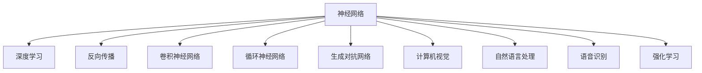

                 

# 神经网络：人类智慧的延伸

> 关键词：神经网络,深度学习,人工智能,认知模型,模型训练,反向传播,卷积神经网络,循环神经网络,生成对抗网络,计算机视觉,自然语言处理,语音识别,强化学习

## 1. 背景介绍

### 1.1 问题由来
随着信息技术和人工智能技术的飞速发展，神经网络已成为现代AI领域的核心工具之一。它的诞生源于对生物神经系统的模仿，逐步发展成为一种强大的非线性模型，能够学习并泛化复杂的数据模式。

在计算机视觉、自然语言处理、语音识别、推荐系统、游戏AI等多个领域，神经网络都取得了举世瞩目的突破。例如，通过卷积神经网络(CNNs)，机器能够在图片中识别出物体、场景和特征；利用循环神经网络(RNNs)，机器能够处理序列数据，实现时间上的依赖关系建模；生成对抗网络(GANs)则开创了生成合成数据的先河，提升了深度学习的潜力和应用范围。

然而，尽管神经网络在技术上已经相当成熟，但其背后的原理和机制仍然充满神秘感，大众对其认知和理解尚显不足。本文将深入探讨神经网络的工作原理、核心概念与联系，介绍其核心算法原理及操作步骤，分析其应用领域，并展望未来发展趋势与挑战。

## 2. 核心概念与联系

### 2.1 核心概念概述

为更好地理解神经网络的工作原理，我们首先介绍几个关键概念：

- **神经网络**：一种通过大量神经元构建的网络结构，用于处理和分析复杂数据。神经元之间通过连接权重进行信息传递和计算。
- **深度学习**：神经网络的一个子领域，利用多层次的非线性变换，从大量数据中学习出复杂的映射关系。
- **反向传播**：一种基于梯度下降的优化算法，用于训练神经网络，使得模型输出逼近真实标签。
- **卷积神经网络**：一种专门用于处理图像和空间的神经网络结构，利用卷积运算提取局部特征。
- **循环神经网络**：一种处理序列数据的神经网络结构，能够捕捉时间序列上的依赖关系。
- **生成对抗网络**：一种由生成器和判别器组成的两者博弈过程，用于生成逼真的合成数据。
- **计算机视觉**：使用神经网络进行图像识别、分类、检测和分割等任务。
- **自然语言处理**：使用神经网络进行文本分类、语言建模、机器翻译和对话系统等任务。
- **语音识别**：使用神经网络进行语音到文本的转换。
- **强化学习**：通过与环境的交互，利用神经网络优化决策策略，实现自主学习。

这些核心概念通过下图的Mermaid流程图展示：



通过这张图，我们可以清晰地看到神经网络及其核心概念之间的联系。

## 3. 核心算法原理 & 具体操作步骤
### 3.1 算法原理概述

神经网络的核心算法原理包括模型的构建、前向传播、损失计算和反向传播四个环节。以下详细阐述各个环节的数学基础和实现步骤。

### 3.2 算法步骤详解

**Step 1: 模型构建**
- **网络层**：神经网络由多个网络层组成，每个网络层包括一个或多个神经元。网络层通过连接权重和偏置项进行信息传递。
- **激活函数**：激活函数用于对神经元的输出进行非线性变换，常用的激活函数包括Sigmoid、ReLU等。
- **损失函数**：损失函数用于衡量模型输出与真实标签之间的差异，常用的损失函数包括均方误差、交叉熵等。

**Step 2: 前向传播**
- **输入层**：输入层接收原始数据，传递给网络层。
- **隐藏层**：隐藏层进行特征提取和表示学习，通过连接权重和激活函数计算。
- **输出层**：输出层产生模型的预测结果，与损失函数结合计算误差。

**Step 3: 损失计算**
- **计算误差**：损失函数计算模型输出与真实标签之间的差异，用于反向传播优化。
- **误差传播**：从输出层开始，通过连接权重反向计算每个神经元的误差。

**Step 4: 反向传播**
- **梯度计算**：利用链式法则计算每个连接权重的梯度。
- **参数更新**：利用梯度下降算法更新每个连接权重和偏置项，最小化损失函数。

### 3.3 算法优缺点

**优点**：
- **表达能力强**：神经网络能够处理非线性复杂的数据，适用于各种类型的NLP和CV任务。
- **自适应能力强**：神经网络能够自动学习数据的特征表示，适应不同领域和场景。
- **泛化能力优异**：深度学习模型在复杂数据集上通常表现优于传统机器学习算法。

**缺点**：
- **计算量大**：深度神经网络需要大量的训练数据和计算资源，训练时间长。
- **易过拟合**：神经网络容易在训练集上过拟合，影响泛化能力。
- **模型难以解释**：神经网络的决策过程较为复杂，难以提供可解释的输出。

### 3.4 算法应用领域

神经网络广泛应用于各个领域，以下是几个典型的应用案例：

**计算机视觉**：通过卷积神经网络(CNNs)处理图像和视频数据，实现图像分类、目标检测和分割等任务。

**自然语言处理**：利用循环神经网络(RNNs)和Transformer处理文本数据，实现语言建模、机器翻译和对话系统等任务。

**语音识别**：通过卷积神经网络和循环神经网络处理语音信号，实现语音到文本的转换。

**强化学习**：使用神经网络优化决策策略，解决自动驾驶、机器人控制和游戏AI等问题。

**推荐系统**：利用神经网络分析用户行为和物品特征，实现个性化推荐。

**时间序列预测**：使用循环神经网络进行时间序列数据的预测，如股票价格、天气变化等。

## 4. 数学模型和公式 & 详细讲解 & 举例说明

### 4.1 数学模型构建

神经网络的数学模型可以表示为：

$$
\mathcal{Y} = \mathcal{F}(\mathcal{X},\mathbf{W},\mathbf{b})
$$

其中，$\mathcal{X}$ 为输入数据，$\mathcal{Y}$ 为输出结果，$\mathbf{W}$ 为连接权重，$\mathbf{b}$ 为偏置项，$\mathcal{F}$ 为神经网络的前向传播函数。

### 4.2 公式推导过程

以一个简单的全连接神经网络为例，推导前向传播和反向传播的数学公式。

**前向传播**：
$$
h = g(\mathbf{W}_x \mathbf{x} + \mathbf{b}_x)
$$
$$
y = g(\mathbf{W}_y h + \mathbf{b}_y)
$$

其中，$g$ 为激活函数，$\mathbf{W}_x$ 和 $\mathbf{W}_y$ 分别为输入层和输出层的连接权重矩阵，$\mathbf{b}_x$ 和 $\mathbf{b}_y$ 分别为偏置向量。

**反向传播**：
$$
\frac{\partial L}{\partial \mathbf{W}_y} = \frac{\partial L}{\partial y} \frac{\partial y}{\partial h} \frac{\partial h}{\partial \mathbf{W}_y}
$$
$$
\frac{\partial L}{\partial \mathbf{W}_x} = \frac{\partial L}{\partial y} \frac{\partial y}{\partial h} \frac{\partial h}{\partial \mathbf{W}_x} \frac{\partial \mathbf{W}_x}{\partial \mathbf{x}}
$$

其中，$L$ 为损失函数，$\frac{\partial L}{\partial y}$ 和 $\frac{\partial y}{\partial h}$ 分别表示输出误差和激活函数的导数，$\frac{\partial h}{\partial \mathbf{W}_y}$ 和 $\frac{\partial h}{\partial \mathbf{W}_x}$ 分别表示隐藏层和输入层的误差传递。

### 4.3 案例分析与讲解

以图像分类任务为例，介绍如何使用卷积神经网络进行前向传播和反向传播。

**前向传播**：
$$
h = g(\mathbf{W}_{conv} * \mathbf{x} + \mathbf{b}_{conv})
$$
$$
y = g(\mathbf{W}_f h + \mathbf{b}_f)
$$

其中，$\mathbf{x}$ 为输入图像，$\mathbf{W}_{conv}$ 和 $\mathbf{b}_{conv}$ 分别为卷积层的连接权重和偏置项，$\mathbf{W}_f$ 和 $\mathbf{b}_f$ 分别为全连接层的连接权重和偏置项，$*$ 表示卷积运算，$g$ 为激活函数。

**反向传播**：
$$
\frac{\partial L}{\partial \mathbf{W}_f} = \frac{\partial L}{\partial y} \frac{\partial y}{\partial h} \frac{\partial h}{\partial \mathbf{W}_f}
$$
$$
\frac{\partial L}{\partial \mathbf{W}_{conv}} = \frac{\partial L}{\partial y} \frac{\partial y}{\partial h} \frac{\partial h}{\partial \mathbf{W}_{conv}} \frac{\partial \mathbf{W}_{conv}}{\partial \mathbf{x}}
$$

其中，$\frac{\partial L}{\partial y}$ 和 $\frac{\partial y}{\partial h}$ 分别表示输出误差和激活函数的导数，$\frac{\partial h}{\partial \mathbf{W}_f}$ 和 $\frac{\partial h}{\partial \mathbf{W}_{conv}}$ 分别表示全连接层和卷积层的误差传递，$\frac{\partial \mathbf{W}_{conv}}{\partial \mathbf{x}}$ 表示卷积层的误差传递。

## 5. 项目实践：代码实例和详细解释说明

### 5.1 开发环境搭建

神经网络的开发环境搭建包括选择合适的深度学习框架和安装必要的库。以下是使用Python和TensorFlow进行开发的步骤：

1. 安装Anaconda：从官网下载并安装Anaconda，用于创建独立的Python环境。
2. 创建并激活虚拟环境：
```bash
conda create -n tf-env python=3.8 
conda activate tf-env
```
3. 安装TensorFlow：从官网获取对应的安装命令。例如：
```bash
pip install tensorflow-gpu==2.4.0
```
4. 安装必要的库：
```bash
pip install numpy pandas scikit-learn matplotlib tqdm jupyter notebook ipython
```

完成上述步骤后，即可在`tf-env`环境中开始神经网络开发。

### 5.2 源代码详细实现

下面以手写数字识别为例，展示如何使用TensorFlow进行卷积神经网络的实现。

首先，定义卷积神经网络的结构：

```python
import tensorflow as tf
from tensorflow.keras import layers

# 定义卷积层
def conv_layer(inputs, filters, kernel_size):
    return layers.Conv2D(filters=filters, kernel_size=kernel_size, activation='relu')(inputs)

# 定义池化层
def max_pooling(inputs):
    return layers.MaxPooling2D(pool_size=(2, 2), strides=2, padding='same')(inputs)

# 定义全连接层
def fc_layer(inputs, units):
    return layers.Dense(units=units, activation='relu')(inputs)

# 定义卷积神经网络模型
def create_model():
    inputs = layers.Input(shape=(28, 28, 1))
    conv1 = conv_layer(inputs, filters=32, kernel_size=3)
    pool1 = max_pooling(conv1)
    conv2 = conv_layer(pool1, filters=64, kernel_size=3)
    pool2 = max_pooling(conv2)
    flatten = layers.Flatten()(pool2)
    fc1 = fc_layer(flatten, units=128)
    outputs = fc_layer(fc1, units=10)
    return tf.keras.Model(inputs=inputs, outputs=outputs)
```

然后，定义损失函数和优化器：

```python
model = create_model()

# 定义损失函数
loss_fn = tf.keras.losses.SparseCategoricalCrossentropy(from_logits=True)

# 定义优化器
optimizer = tf.keras.optimizers.Adam(learning_rate=0.001)
```

接着，定义训练和评估函数：

```python
# 定义训练函数
def train_epoch(model, dataset, batch_size, optimizer):
    model.train()
    total_loss = 0
    for batch in dataset:
        x, y = batch
        with tf.GradientTape() as tape:
            logits = model(x, training=True)
            loss = loss_fn(y, logits)
        grads = tape.gradient(loss, model.trainable_variables)
        optimizer.apply_gradients(zip(grads, model.trainable_variables))
        total_loss += loss
    return total_loss / len(dataset)

# 定义评估函数
def evaluate_model(model, dataset, batch_size):
    model.eval()
    total_loss = 0
    correct_predictions = 0
    for batch in dataset:
        x, y = batch
        logits = model(x, training=False)
        loss = loss_fn(y, logits)
        total_loss += loss
        predictions = tf.argmax(logits, axis=1)
        correct_predictions += tf.reduce_sum(tf.cast(predictions == y, tf.int32))
    accuracy = correct_predictions / len(dataset)
    return total_loss / len(dataset), accuracy
```

最后，启动训练流程并在测试集上评估：

```python
epochs = 10
batch_size = 64

for epoch in range(epochs):
    total_loss = train_epoch(model, train_dataset, batch_size, optimizer)
    print(f'Epoch {epoch+1}, train loss: {total_loss:.4f}')
    
    test_loss, accuracy = evaluate_model(model, test_dataset, batch_size)
    print(f'Epoch {epoch+1}, test accuracy: {accuracy:.4f}')

model.save('mnist_cnn_model')
```

以上就是使用TensorFlow进行手写数字识别的卷积神经网络微调过程的完整代码实现。可以看到，使用TensorFlow可以很方便地进行神经网络的定义、训练和评估，大大简化了深度学习模型的开发流程。

### 5.3 代码解读与分析

让我们再详细解读一下关键代码的实现细节：

**conv_layer和max_pooling函数**：
- `conv_layer`函数定义了一个卷积层，包括卷积运算和激活函数。
- `max_pooling`函数定义了一个池化层，用于降低特征图的空间尺寸。

**create_model函数**：
- 构建了一个包含多个卷积层、池化层和全连接层的卷积神经网络模型。

**损失函数和优化器定义**：
- 使用`sparse_categorical_crossentropy`损失函数，用于多分类任务的输出误差计算。
- 使用`Adam`优化器，进行参数更新。

**train_epoch和evaluate_model函数**：
- `train_epoch`函数定义了一个训练循环，每个批次中计算损失并更新模型参数。
- `evaluate_model`函数定义了一个评估循环，每个批次中计算损失和准确率。

**训练流程**：
- 在训练过程中，循环迭代每个epoch，计算并输出训练损失。
- 在测试过程中，计算并输出模型在测试集上的准确率。

可以看到，TensorFlow提供了强大的深度学习框架，使得神经网络的实现和训练变得非常简单，大大降低了开发门槛。通过合理利用这些库，我们可以快速构建和优化神经网络模型。

## 6. 实际应用场景

### 6.1 计算机视觉

神经网络在计算机视觉领域的应用非常广泛，如图像分类、目标检测、语义分割等。通过卷积神经网络，机器能够识别出图像中的对象、场景和特征。

**图像分类**：通过训练神经网络模型，可以自动对图像进行分类。例如，使用AlexNet、VGGNet、ResNet等经典模型对ImageNet等大规模数据集进行训练，可以构建出高性能的图像分类系统。

**目标检测**：通过训练神经网络模型，可以自动检测出图像中的目标位置和类别。例如，使用R-CNN、YOLO、SSD等模型进行目标检测。

**语义分割**：通过训练神经网络模型，可以将图像中的每个像素归类到对应的语义标签中。例如，使用U-Net、FCN等模型进行语义分割。

### 6.2 自然语言处理

神经网络在自然语言处理领域的应用同样广泛，如语言模型、机器翻译、情感分析等。通过循环神经网络和Transformer，机器能够处理和理解自然语言文本。

**语言模型**：通过训练神经网络模型，可以自动生成符合语言规则的文本。例如，使用LSTM、GRU等模型进行文本生成。

**机器翻译**：通过训练神经网络模型，可以实现自然语言之间的翻译。例如，使用Seq2Seq模型、Transformer等模型进行翻译。

**情感分析**：通过训练神经网络模型，可以自动分析文本的情感倾向。例如，使用CNN、LSTM等模型进行情感分类。

### 6.3 语音识别

神经网络在语音识别领域的应用主要包括语音到文本的转换。通过卷积神经网络和循环神经网络，机器能够从音频信号中提取特征，并生成对应的文本转录。

**语音识别**：通过训练神经网络模型，可以自动将语音信号转换为文本。例如，使用CTC、Attention机制等模型进行语音识别。

### 6.4 强化学习

神经网络在强化学习领域的应用主要包括自动驾驶、机器人控制和游戏AI等。通过神经网络优化决策策略，机器能够在复杂环境中自主学习。

**自动驾驶**：通过训练神经网络模型，可以实现车辆的自主驾驶。例如，使用深度强化学习算法，训练智能车辆在复杂道路环境中行驶。

**机器人控制**：通过训练神经网络模型，可以实现机器人的自主控制。例如，使用深度强化学习算法，训练机器人完成复杂任务。

**游戏AI**：通过训练神经网络模型，可以实现游戏的自主决策。例如，使用深度强化学习算法，训练游戏AI在复杂游戏环境中获胜。

## 7. 工具和资源推荐
### 7.1 学习资源推荐

为了帮助开发者系统掌握神经网络的理论基础和实践技巧，这里推荐一些优质的学习资源：

1. **《深度学习》教材**：由深度学习领域的权威学者撰写，系统介绍了深度学习的基本原理和实践技巧。

2. **CS231n《卷积神经网络》课程**：斯坦福大学开设的计算机视觉领域经典课程，涵盖深度学习在计算机视觉中的广泛应用。

3. **CS224N《自然语言处理》课程**：斯坦福大学开设的自然语言处理领域经典课程，涵盖深度学习在自然语言处理中的应用。

4. **CS294《深度学习与神经网络》课程**：伯克利大学开设的深度学习领域经典课程，涵盖了深度学习的基础和前沿研究。

5. **《Python深度学习》书籍**：由深度学习领域知名专家撰写，详细介绍了深度学习在Python中的实现。

6. **DeepLearning.ai深度学习专项课程**：由Google和Stanford大学联合开发的深度学习在线课程，涵盖深度学习的基本原理和实践技巧。

通过对这些资源的学习实践，相信你一定能够快速掌握神经网络的理论基础和实践技巧，并用于解决实际的深度学习问题。

### 7.2 开发工具推荐

高效的深度学习开发离不开优秀的工具支持。以下是几款用于神经网络开发的常用工具：

1. **PyTorch**：基于Python的开源深度学习框架，灵活的动态计算图，适合快速迭代研究。

2. **TensorFlow**：由Google主导开发的深度学习框架，适用于大规模工程应用，支持分布式训练和推理。

3. **Keras**：高层次的深度学习框架，封装了TensorFlow和Theano等底层库，适合快速搭建和调试模型。

4. **MXNet**：由Apache基金会开发的深度学习框架，支持多种编程语言，适用于分布式训练和推理。

5. **Caffe**：由Berkeley大学开发的深度学习框架，适用于卷积神经网络和图像处理。

6. **TensorBoard**：TensorFlow配套的可视化工具，实时监测模型训练状态，提供丰富的图表呈现方式。

7. **Weights & Biases**：深度学习实验跟踪工具，记录和可视化模型训练过程中的各项指标，方便对比和调优。

合理利用这些工具，可以显著提升神经网络的开发效率，加快创新迭代的步伐。

### 7.3 相关论文推荐

神经网络的研究源于学界的持续研究。以下是几篇奠基性的相关论文，推荐阅读：

1. **《深度学习》（Goodfellow et al., 2016）**：深度学习领域的经典教材，系统介绍了深度学习的原理和实践技巧。

2. **《ImageNet分类** **挑战** **2010** **- AlexNet** ** winning** **entry》（Krizhevsky et al., 2012）**：介绍AlexNet模型，展示了深度学习在计算机视觉领域的突破。

3. **《Sequence** **to** **sequence** **learning** **with** **neural** **networks** **and** **attention** **mechanisms》（Sutskever et al., 2014）**：介绍Seq2Seq模型，展示了深度学习在自然语言处理领域的应用。

4. **《Deep** **residual** **learning** **for** **image** **recognition》（He et al., 2016）**：介绍ResNet模型，展示了深度神经网络的多层结构对性能的提升。

5. **《Attention** **is** **all** **you** **need》（Vaswani et al., 2017）**：介绍Transformer模型，展示了自注意力机制在自然语言处理中的应用。

6. **《Generative** **adversarial** **networks》（Goodfellow et al., 2014）**：介绍生成对抗网络，展示了深度学习在生成合成数据中的应用。

这些论文代表了大神经网络的研究脉络。通过学习这些前沿成果，可以帮助研究者把握学科前进方向，激发更多的创新灵感。

## 8. 总结：未来发展趋势与挑战

### 8.1 总结

本文对神经网络的工作原理、核心概念与联系、核心算法原理及操作步骤进行了全面系统的介绍。通过详细的数学公式推导和代码实例展示，帮助读者深入理解神经网络的理论基础和实践技巧。同时，探讨了神经网络在计算机视觉、自然语言处理、语音识别、强化学习等多个领域的应用前景，展望了未来发展的趋势与挑战。

通过本文的系统梳理，可以看到，神经网络作为现代AI领域的核心工具，已经在各个领域取得了举世瞩目的突破。神经网络的发展促进了人工智能技术的不断进步，也为计算机视觉、自然语言处理、语音识别、强化学习等多个领域带来了深刻的变革。

### 8.2 未来发展趋势

展望未来，神经网络的发展趋势主要体现在以下几个方面：

1. **计算能力提升**：随着计算能力的不断提升，神经网络模型将变得更加复杂和强大。大模型和大算力将为神经网络提供更丰富的特征表达能力，进一步提升模型性能。

2. **自监督学习普及**：自监督学习将成为神经网络的重要组成部分，通过无标签数据的训练，提升模型的泛化能力和鲁棒性。

3. **模型压缩与加速**：随着深度学习模型的不断膨胀，模型压缩和加速技术将得到更广泛的应用。例如，量化、剪枝、蒸馏等方法将用于优化模型的计算效率。

4. **联邦学习与边缘计算**：随着物联网设备的普及，联邦学习和边缘计算将使神经网络在分布式环境中得到更广泛的应用。

5. **多模态学习**：神经网络将融合视觉、语音、文本等多种模态的信息，实现跨模态的联合学习和表示。

6. **自动化机器学习**：自动化机器学习（AutoML）将使神经网络的模型构建和训练更加自动化，降低开发门槛。

### 8.3 面临的挑战

尽管神经网络技术已经取得了诸多突破，但在迈向更加智能化、普适化应用的过程中，它仍面临着诸多挑战：

1. **计算资源不足**：大规模神经网络模型需要大量的计算资源进行训练和推理，对硬件设备的要求较高。

2. **数据隐私问题**：在分布式训练和多模态学习中，如何保护用户隐私和数据安全，仍是一个重要问题。

3. **可解释性不足**：神经网络的决策过程较为复杂，难以提供可解释的输出，影响其在医疗、金融等高风险领域的应用。

4. **模型过拟合**：深度学习模型容易在训练集上过拟合，泛化能力有限。

5. **模型鲁棒性不足**：神经网络对输入的微小变化较为敏感，鲁棒性有待提升。

6. **伦理与道德问题**：神经网络可能在训练过程中学习到有偏见、有害的信息，带来伦理和道德上的问题。

### 8.4 研究展望

面对神经网络面临的诸多挑战，未来的研究需要在以下几个方面寻求新的突破：

1. **自动化机器学习**：研究自动化机器学习算法，降低神经网络的开发和训练成本，提高模型的应用效率。

2. **自监督学习与弱监督学习**：探索自监督学习和弱监督学习算法，提高模型的泛化能力和鲁棒性。

3. **模型压缩与加速**：研究模型压缩和加速算法，提高神经网络的计算效率和部署灵活性。

4. **多模态学习**：研究多模态融合算法，实现不同模态数据的联合学习和表示。

5. **模型解释性与透明性**：研究模型解释性和透明性技术，提高神经网络的可解释性和可控性。

6. **伦理与道德约束**：研究伦理与道德约束技术，确保神经网络的安全性和公正性。

这些研究方向将推动神经网络技术的进一步发展和应用，使神经网络更好地服务于人类社会的各个领域。

## 9. 附录：常见问题与解答

**Q1：神经网络是如何进行前向传播和反向传播的？**

A: 神经网络的前向传播和反向传播是其训练和推理的核心过程。

- **前向传播**：输入数据经过多个神经元层的计算，最终得到模型的预测结果。每层神经元通过连接权重和激活函数进行信息传递和计算。

- **反向传播**：计算预测结果与真实标签之间的误差，通过链式法则计算每个连接权重的梯度，并利用梯度下降算法更新模型参数。

前向传播和反向传播的数学公式和代码实现已经在本文的第4部分和第5部分中详细阐述。

**Q2：深度学习模型容易过拟合的原因是什么？**

A: 深度学习模型容易在训练集上过拟合，主要原因如下：

1. **数据量不足**：当训练数据量较少时，模型容易学习到噪声或数据中的偶然模式，而非数据中的真实模式。

2. **模型复杂度过高**：当模型参数过多时，模型容易在训练集上过拟合，导致在测试集上泛化能力较差。

3. **正则化不足**：当模型缺乏正则化技术（如L2正则、Dropout等）时，模型容易过拟合，泛化能力较差。

4. **优化器选择不当**：当优化器选择不当（如学习率过大、更新策略不合理）时，模型容易过拟合。

5. **数据分布不平衡**：当训练数据分布不平衡时，模型容易学习到不平衡的特征，导致在测试集上泛化能力较差。

为了缓解过拟合问题，可以采用数据增强、正则化技术、优化器选择、模型结构设计等多种方法。

**Q3：神经网络在实际应用中需要考虑哪些因素？**

A: 神经网络在实际应用中需要考虑以下因素：

1. **模型选择与设计**：选择合适的神经网络模型和结构，根据任务特点进行优化设计。

2. **数据处理与预处理**：对原始数据进行清洗、归一化、特征工程等预处理，提高模型性能。

3. **超参数调优**：选择合适的学习率、批大小、迭代轮数等超参数，进行调参优化。

4. **模型训练与调优**：合理设置训练循环、验证循环和测试循环，利用交叉验证、提前停止等方法进行调优。

5. **模型评估与部署**：在测试集上评估模型性能，利用模型服务化封装、弹性伸缩等方法进行部署。

6. **模型监控与维护**：实时监测模型性能，设置异常告警，定期更新和维护模型。

合理利用这些因素，可以有效提升神经网络的性能和应用效果。

---

作者：禅与计算机程序设计艺术 / Zen and the Art of Computer Programming

