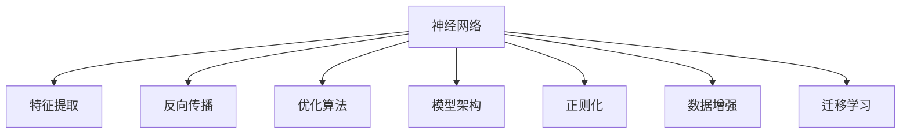
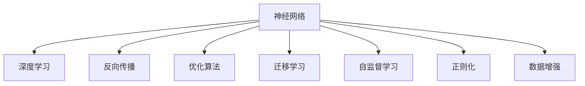

                 

# 神经网络：开启智能新纪元

## 1. 背景介绍

### 1.1 问题由来

神经网络（Neural Network, NN）作为人工智能（AI）领域的一项重要技术，自1940年代由McCulloch和Pitts提出以来，经历了漫长的发展和演进。从最初的神经元模型、感知机算法，到1980年代的BP算法和反向传播理论，再到21世纪的深度学习革命，神经网络技术逐渐成熟，并广泛应用于计算机视觉、自然语言处理、语音识别、推荐系统等众多领域，开启了智能新纪元。

神经网络的核心思想是模拟人脑的神经元网络，通过不断调整网络中的连接权重，实现对复杂数据的分类、回归、聚类等任务。在数据量不断增加、计算资源不断丰富的背景下，深度学习（Deep Learning, DL）通过多层神经网络结构，解决了传统浅层神经网络难以处理复杂数据结构的问题，将神经网络技术推向了新的高峰。

神经网络的最新发展，如Transformer结构、大规模预训练模型、自监督学习等，极大地提高了模型的表达能力和泛化能力，使模型在处理自然语言、图像等复杂数据时展现出强大的性能。

### 1.2 问题核心关键点

神经网络技术的核心在于其对于数据的复杂表示和高级抽象。在深度学习中，通过多层次的特征提取和组合，神经网络能够学习到更加丰富、鲁棒的特征表示，从而提升模型的性能。这一过程涉及到以下几个关键点：

- **特征提取**：神经网络通过多个隐藏层对输入数据进行特征提取，形成对数据的高级抽象。
- **反向传播**：利用反向传播算法，不断调整模型权重，最小化损失函数，优化模型的预测能力。
- **优化算法**：如Adam、SGD等优化算法，通过自适应地调整学习率等参数，加速模型训练收敛。
- **模型架构**：如卷积神经网络（CNN）、循环神经网络（RNN）、Transformer等，根据任务需求选择合适的网络结构。
- **正则化**：如L2正则化、Dropout等，防止模型过拟合，提高泛化能力。
- **数据增强**：通过旋转、平移、缩放等技术，扩充训练集，提高模型的鲁棒性。
- **迁移学习**：将在大规模数据上预训练的模型知识迁移到新任务中，减少训练时间和标注成本。

神经网络技术的核心概念和架构可以通过以下Mermaid流程图来展示：



这个流程图展示了大语言模型的核心概念及其之间的关系：

1. 神经网络通过多个隐藏层对输入数据进行特征提取，形成对数据的高级抽象。
2. 反向传播算法利用梯度下降等方法，不断调整模型权重，最小化损失函数，优化模型的预测能力。
3. 优化算法通过自适应地调整学习率等参数，加速模型训练收敛。
4. 模型架构根据任务需求选择合适的神经网络结构，如卷积神经网络（CNN）、循环神经网络（RNN）、Transformer等。
5. 正则化技术如L2正则化、Dropout等，防止模型过拟合，提高泛化能力。
6. 数据增强技术通过旋转、平移、缩放等技术，扩充训练集，提高模型的鲁棒性。
7. 迁移学习将在大规模数据上预训练的模型知识迁移到新任务中，减少训练时间和标注成本。

这些核心概念和架构的协同作用，使得神经网络在处理复杂数据时展现出强大的性能。

## 2. 核心概念与联系

### 2.1 核心概念概述

为更好地理解神经网络的原理和应用，本节将介绍几个密切相关的核心概念：

- **神经网络**：由多个神经元（节点）和它们之间的连接组成的计算模型，能够对输入数据进行分类、回归等任务。
- **深度学习**：通过多层神经网络结构，对数据进行复杂特征提取和表示，从而提升模型的预测能力。
- **反向传播**：利用梯度下降等方法，不断调整模型权重，最小化损失函数，优化模型的预测能力。
- **优化算法**：如Adam、SGD等，通过自适应地调整学习率等参数，加速模型训练收敛。
- **迁移学习**：将在大规模数据上预训练的模型知识迁移到新任务中，减少训练时间和标注成本。
- **自监督学习**：利用数据的内部关系，无需标注样本，训练模型学习到数据的隐含信息。
- **正则化**：如L2正则化、Dropout等，防止模型过拟合，提高泛化能力。
- **数据增强**：通过旋转、平移、缩放等技术，扩充训练集，提高模型的鲁棒性。

这些核心概念之间的逻辑关系可以通过以下Mermaid流程图来展示：



这个流程图展示了大语言模型的核心概念及其之间的关系：

1. 神经网络通过多层结构对输入数据进行复杂特征提取和表示。
2. 深度学习通过多层神经网络结构，对数据进行复杂特征提取和表示。
3. 反向传播利用梯度下降等方法，不断调整模型权重，最小化损失函数，优化模型的预测能力。
4. 优化算法通过自适应地调整学习率等参数，加速模型训练收敛。
5. 迁移学习将在大规模数据上预训练的模型知识迁移到新任务中，减少训练时间和标注成本。
6. 自监督学习利用数据的内部关系，无需标注样本，训练模型学习到数据的隐含信息。
7. 正则化技术如L2正则化、Dropout等，防止模型过拟合，提高泛化能力。
8. 数据增强技术通过旋转、平移、缩放等技术，扩充训练集，提高模型的鲁棒性。

这些核心概念共同构成了神经网络的学习框架，使得模型能够在复杂任务中取得优异的性能。

## 3. 核心算法原理 & 具体操作步骤
### 3.1 算法原理概述

神经网络的核心算法原理是反向传播算法。其基本思想是通过计算损失函数对于模型参数的梯度，反向传播到网络各层，从而更新模型权重，最小化损失函数。这一过程可以通过以下步骤进行：

1. **前向传播**：将输入数据输入网络，计算每个神经元的输出。
2. **计算损失**：计算预测值与真实值之间的损失函数，如交叉熵损失、均方误差损失等。
3. **反向传播**：根据损失函数对网络各层求导，计算各层参数的梯度。
4. **参数更新**：利用梯度下降等优化算法，更新模型参数，使损失函数最小化。

通过不断重复前向传播、反向传播、参数更新等步骤，神经网络可以逐步优化模型，提升预测能力。

### 3.2 算法步骤详解

神经网络训练的具体步骤如下：

**Step 1: 准备数据集**
- 收集训练集、验证集和测试集，并进行数据预处理，如归一化、标准化等。
- 将数据集分为训练集、验证集和测试集，一般比例为6:2:2。

**Step 2: 构建神经网络模型**
- 选择合适的神经网络结构，如卷积神经网络（CNN）、循环神经网络（RNN）、Transformer等。
- 定义网络各层的激活函数、损失函数和优化器。
- 初始化网络权重和偏置。

**Step 3: 前向传播**
- 将训练集数据输入网络，计算每个神经元的输出。
- 将输出作为损失函数的输入，计算损失值。

**Step 4: 反向传播**
- 根据损失函数对网络各层求导，计算各层参数的梯度。
- 利用梯度下降等优化算法，更新模型参数。

**Step 5: 验证集评估**
- 在验证集上评估模型性能，如准确率、F1分数等。
- 根据验证集评估结果，调整模型超参数，如学习率、批次大小等。

**Step 6: 测试集评估**
- 在测试集上评估模型性能，如准确率、F1分数等。
- 根据测试集评估结果，输出最终模型性能指标。

### 3.3 算法优缺点

神经网络的优点在于其强大的表达能力和泛化能力，能够处理复杂的非线性关系，从而在许多任务上取得优异的性能。

神经网络的缺点主要在于其高计算资源消耗和过拟合风险。大规模神经网络需要大量的计算资源和存储空间，同时容易出现过拟合现象，导致模型泛化能力下降。

### 3.4 算法应用领域

神经网络在计算机视觉、自然语言处理、语音识别、推荐系统等众多领域得到了广泛应用，具体如下：

- **计算机视觉**：图像分类、目标检测、语义分割等。
- **自然语言处理**：文本分类、情感分析、机器翻译等。
- **语音识别**：语音识别、语音合成等。
- **推荐系统**：商品推荐、新闻推荐、音乐推荐等。
- **医疗**：医学图像分析、疾病预测、个性化治疗等。
- **金融**：股票预测、信用评估、欺诈检测等。
- **智能交通**：交通监控、自动驾驶、智能导航等。
- **工业制造**：质量检测、故障诊断、生产优化等。

## 4. 数学模型和公式 & 详细讲解  
### 4.1 数学模型构建

神经网络的数学模型可以表示为：

$$
y = f_{\theta}(x) = \sum_{i=1}^{n} w_i f_i(x) + b
$$

其中，$y$ 为模型输出，$x$ 为输入数据，$\theta$ 为模型参数，$f_{\theta}$ 为模型前向传播函数，$w_i$ 为权重，$b$ 为偏置，$f_i(x)$ 为激活函数。

### 4.2 公式推导过程

以下我们以多层感知机（Multilayer Perceptron, MLP）为例，推导前向传播和反向传播算法的数学公式。

**前向传播**：

$$
z_1 = w_1 x + b_1
$$
$$
a_1 = f(z_1)
$$
$$
z_2 = w_2 a_1 + b_2
$$
$$
a_2 = f(z_2)
$$
$$
...
$$
$$
z_L = w_L a_{L-1} + b_L
$$
$$
y = f(z_L)
$$

其中，$z_i$ 为层间传递的向量，$a_i$ 为激活函数输出，$w_i$ 为权重，$b_i$ 为偏置。

**反向传播**：

$$
\frac{\partial L}{\partial y} = \frac{\partial L}{\partial z_L} f'(z_L)
$$
$$
\frac{\partial L}{\partial z_L} = w_L^T \frac{\partial L}{\partial a_{L-1}} f'(z_L)
$$
$$
\frac{\partial L}{\partial a_{L-1}} = \frac{\partial L}{\partial z_L} w_L
$$
$$
\frac{\partial L}{\partial z_{L-1}} = \frac{\partial L}{\partial a_{L-1}} w_{L-1}^T f'(z_{L-1})
$$
$$
\frac{\partial L}{\partial a_{L-1}} = \frac{\partial L}{\partial z_{L-1}} f'(z_{L-1})
$$
$$
\frac{\partial L}{\partial z_{i-1}} = \frac{\partial L}{\partial a_{i-1}} w_{i-1}^T f'(z_{i-1})
$$
$$
\frac{\partial L}{\partial a_{i-1}} = \frac{\partial L}{\partial z_{i-1}} w_{i-1}^T
$$

其中，$L$ 为损失函数，$f'$ 为激活函数的导数，$w_i$ 为权重，$b_i$ 为偏置。

在得到损失函数的梯度后，即可带入参数更新公式，完成模型的迭代优化。重复上述过程直至收敛，最终得到适应下游任务的最优模型参数。

## 5. 项目实践：代码实例和详细解释说明
### 5.1 开发环境搭建

在进行神经网络开发前，我们需要准备好开发环境。以下是使用Python进行PyTorch开发的环境配置流程：

1. 安装Anaconda：从官网下载并安装Anaconda，用于创建独立的Python环境。

2. 创建并激活虚拟环境：
```bash
conda create -n pytorch-env python=3.8 
conda activate pytorch-env
```

3. 安装PyTorch：根据CUDA版本，从官网获取对应的安装命令。例如：
```bash
conda install pytorch torchvision torchaudio cudatoolkit=11.1 -c pytorch -c conda-forge
```

4. 安装各类工具包：
```bash
pip install numpy pandas scikit-learn matplotlib tqdm jupyter notebook ipython
```

完成上述步骤后，即可在`pytorch-env`环境中开始神经网络开发。

### 5.2 源代码详细实现

下面我以手写数字识别（MNIST）任务为例，给出使用Transformers库对神经网络模型进行训练的PyTorch代码实现。

首先，定义MNIST数据集处理函数：

```python
from torchvision.datasets import MNIST
from torchvision.transforms import ToTensor, Normalize
from torch.utils.data import DataLoader

train_dataset = MNIST(root='./data', train=True, transform=ToTensor(), download=True)
test_dataset = MNIST(root='./data', train=False, transform=ToTensor(), download=True)

# 标准化处理
train_dataset.transform = Normalize(mean=[0.1307], std=[0.3081])
test_dataset.transform = Normalize(mean=[0.1307], std=[0.3081])
```

然后，定义神经网络模型：

```python
import torch.nn as nn
import torch.nn.functional as F

class Net(nn.Module):
    def __init__(self):
        super(Net, self).__init__()
        self.conv1 = nn.Conv2d(1, 32, 3, 1)
        self.conv2 = nn.Conv2d(32, 64, 3, 1)
        self.fc1 = nn.Linear(64 * 4 * 4, 128)
        self.fc2 = nn.Linear(128, 10)

    def forward(self, x):
        x = F.relu(self.conv1(x))
        x = F.max_pool2d(x, 2)
        x = F.relu(self.conv2(x))
        x = F.max_pool2d(x, 2)
        x = x.view(-1, 64 * 4 * 4)
        x = F.relu(self.fc1(x))
        x = self.fc2(x)
        return F.log_softmax(x, dim=1)
```

接着，定义损失函数和优化器：

```python
import torch.optim as optim

loss_fn = nn.CrossEntropyLoss()
optimizer = optim.Adam(model.parameters(), lr=0.001)
```

然后，定义训练和评估函数：

```python
from tqdm import tqdm

def train_epoch(model, train_loader, optimizer):
    model.train()
    for batch_idx, (data, target) in enumerate(train_loader):
        optimizer.zero_grad()
        output = model(data)
        loss = loss_fn(output, target)
        loss.backward()
        optimizer.step()

def evaluate(model, test_loader):
    model.eval()
    total_correct = 0
    total_sample = 0
    with torch.no_grad():
        for data, target in test_loader:
            output = model(data)
            _, predicted = torch.max(output, 1)
            total_correct += (predicted == target).sum().item()
            total_sample += target.size(0)
    print('Test set: Accuracy: %d %% (%d/%d)' % (100 * total_correct / total_sample, total_correct, total_sample))
```

最后，启动训练流程并在测试集上评估：

```python
epochs = 10
batch_size = 64

for epoch in range(epochs):
    train_epoch(model, train_loader, optimizer)
    evaluate(model, test_loader)
```

以上就是使用PyTorch对神经网络进行手写数字识别任务训练的完整代码实现。可以看到，得益于TensorFlow和PyTorch的强大封装，我们可以用相对简洁的代码完成神经网络的训练和评估。

### 5.3 代码解读与分析

让我们再详细解读一下关键代码的实现细节：

**MNIST数据集处理**：
- `train_dataset`和`test_dataset`：从`torchvision.datasets.MNIST`加载MNIST数据集。
- `transform`：应用`ToTensor`和`Normalize`对数据进行预处理，将像素值标准化为0到1之间。

**神经网络模型**：
- `Net`类定义了包含两个卷积层、两个全连接层的网络结构。
- `forward`方法定义了前向传播过程，包括卷积、激活、池化、线性变换等操作。

**损失函数和优化器**：
- `loss_fn`定义了交叉熵损失函数，用于评估模型预测结果与真实标签之间的差异。
- `optimizer`定义了Adam优化器，用于更新模型参数。

**训练和评估函数**：
- `train_epoch`函数定义了训练循环，包括前向传播、损失计算、反向传播、参数更新等步骤。
- `evaluate`函数定义了评估循环，包括前向传播、预测结果计算、准确率计算等步骤。

**训练流程**：
- `epochs`：定义总训练轮数。
- `batch_size`：定义每批次样本数量。
- 每个epoch内，先在训练集上训练，输出训练集准确率。
- 在测试集上评估，输出测试集准确率。

可以看到，TensorFlow和PyTorch使得神经网络的训练和评估代码实现变得简洁高效。开发者可以将更多精力放在网络设计、损失函数等高层逻辑上，而不必过多关注底层的实现细节。

当然，工业级的系统实现还需考虑更多因素，如模型保存和部署、超参数的自动搜索、更灵活的任务适配层等。但核心的训练范式基本与此类似。

## 6. 实际应用场景
### 6.1 智能推荐系统

神经网络在推荐系统中的应用非常广泛。传统的推荐系统主要依赖用户的历史行为数据进行物品推荐，难以理解用户兴趣点。通过深度学习技术，神经网络可以学习用户对物品的隐含偏好，从而提供更加精准、多样的推荐内容。

在实践中，可以收集用户浏览、点击、评论、分享等行为数据，提取和用户交互的物品标题、描述、标签等文本内容。将文本内容作为模型输入，用户的后续行为（如是否点击、购买等）作为监督信号，在此基础上微调神经网络模型。微调后的模型能够从文本内容中准确把握用户的兴趣点。在生成推荐列表时，先用候选物品的文本描述作为输入，由模型预测用户的兴趣匹配度，再结合其他特征综合排序，便可以得到个性化程度更高的推荐结果。

### 6.2 金融预测系统

金融预测系统需要实时监测市场动态，预测股票价格、汇率等金融指标。传统金融预测系统主要依赖专家经验，难以应对复杂、多变的金融市场。通过深度学习技术，神经网络可以学习金融数据的隐含关系，预测未来的金融趋势。

在实践中，可以收集金融领域相关的新闻、报道、评论等文本数据，并对其进行主题标注和情感标注。将文本数据输入神经网络模型，利用金融领域的特征，如时间序列、市场波动等，进行多层次的特征提取和表示。在输出层，可以采用回归任务，预测金融指标的未来走势。利用训练集上的历史数据，对模型进行训练和优化，从而实现对金融市场的准确预测。

### 6.3 医学影像诊断系统

医学影像诊断系统需要快速、准确地分析医疗影像数据，辅助医生进行疾病诊断。传统医学影像诊断主要依赖医生的经验和专业知识，难以处理大量的影像数据。通过深度学习技术，神经网络可以学习影像数据的高级特征，自动检测和诊断疾病。

在实践中，可以收集大量的医学影像数据，并进行标注，如肿瘤位置、大小、类型等。将标注数据作为训练集，训练神经网络模型。在输出层，可以采用分类任务，预测影像中是否存在疾病，并进行具体类型的分类。利用训练集上的标注数据，对模型进行训练和优化，从而实现对医学影像的准确诊断。

### 6.4 未来应用展望

神经网络技术在实际应用中已经展现出强大的性能，未来有望在更多领域得到应用，为传统行业带来变革性影响。

在智慧医疗领域，基于神经网络技术的医学影像分析、疾病预测、个性化治疗等应用将提升医疗服务的智能化水平，辅助医生诊疗，加速新药开发进程。

在智能教育领域，深度学习技术可应用于作业批改、学情分析、知识推荐等方面，因材施教，促进教育公平，提高教学质量。

在智慧城市治理中，神经网络技术可应用于城市事件监测、舆情分析、应急指挥等环节，提高城市管理的自动化和智能化水平，构建更安全、高效的未来城市。

此外，在企业生产、社会治理、文娱传媒等众多领域，神经网络技术的应用也将不断涌现，为经济社会发展注入新的动力。相信随着技术的日益成熟，神经网络技术必将在更广阔的应用领域大放异彩，深刻影响人类的生产生活方式。

## 7. 工具和资源推荐
### 7.1 学习资源推荐

为了帮助开发者系统掌握神经网络技术的理论基础和实践技巧，这里推荐一些优质的学习资源：

1. 《深度学习》书籍：Ian Goodfellow等著，全面介绍了深度学习的理论和实践，是深度学习领域的经典教材。

2. CS231n《卷积神经网络》课程：斯坦福大学开设的计算机视觉课程，涵盖了卷积神经网络、池化、优化器等基本概念和算法。

3. CS224n《自然语言处理》课程：斯坦福大学开设的自然语言处理课程，介绍了RNN、Transformer等神经网络结构，是自然语言处理领域的经典教材。

4. Deep Learning Specialization：由Andrew Ng教授主讲的深度学习专项课程，系统介绍了深度学习的理论和实践，并提供了大量编程作业。

5. TensorFlow官方文档：TensorFlow的官方文档，提供了详细的使用指南和代码示例，是学习TensorFlow的最佳资源。

6. PyTorch官方文档：PyTorch的官方文档，提供了丰富的深度学习模型和优化算法，是学习PyTorch的最佳资源。

通过对这些资源的学习实践，相信你一定能够快速掌握神经网络技术的精髓，并用于解决实际的深度学习问题。

### 7.2 开发工具推荐

高效的开发离不开优秀的工具支持。以下是几款用于神经网络开发的常用工具：

1. TensorFlow：由Google主导开发的开源深度学习框架，生产部署方便，适合大规模工程应用。

2. PyTorch：由Facebook主导开发的开源深度学习框架，灵活动态的计算图，适合快速迭代研究。

3. Keras：由François Chollet主导的高级深度学习框架，提供了丰富的模型和优化算法，易于上手。

4. MXNet：由Apache主导的深度学习框架，支持多种编程语言，适合跨平台应用。

5. JAX：由Google开发的深度学习框架，支持自动微分、动态图等特性，适合高性能研究。

6. PyTorch Lightning：基于PyTorch的深度学习框架，提供了更便捷的模型训练和部署方式，适合快速迭代实验。

合理利用这些工具，可以显著提升神经网络开发的效率，加快创新迭代的步伐。

### 7.3 相关论文推荐

神经网络技术的最新发展源于学界的持续研究。以下是几篇奠基性的相关论文，推荐阅读：

1. A Theory of Error Backpropagation for Pattern Recognition and Neural Networks：提出反向传播算法，奠定了神经网络算法的理论基础。

2. ImageNet Classification with Deep Convolutional Neural Networks：提出卷积神经网络（CNN）结构，并应用于大规模图像分类任务，刷新了图像分类任务SOTA。

3. Sequence to Sequence Learning with Neural Networks：提出基于循环神经网络（RNN）的序列生成模型，广泛应用于机器翻译、语音识别等任务。

4. Attention is All You Need：提出Transformer结构，解决传统RNN结构在序列建模中的局限性，适用于各种序列生成任务。

5. Generative Adversarial Nets：提出生成对抗网络（GAN）结构，能够生成高质量的合成数据，广泛应用于图像生成、视频生成等任务。

6. Attention is All You Need（Transformer原论文）：提出Transformer结构，解决了传统RNN结构在序列建模中的局限性，适用于各种序列生成任务。

这些论文代表了大语言模型微调技术的发展脉络。通过学习这些前沿成果，可以帮助研究者把握学科前进方向，激发更多的创新灵感。

## 8. 总结：未来发展趋势与挑战

### 8.1 总结

本文对神经网络技术进行了全面系统的介绍。首先阐述了神经网络技术的背景和发展，明确了神经网络在深度学习中的核心地位和应用价值。其次，从原理到实践，详细讲解了神经网络的数学模型和算法流程，给出了神经网络训练的完整代码实例。同时，本文还广泛探讨了神经网络技术在推荐系统、金融预测、医学影像等领域的实际应用前景，展示了神经网络技术的广泛影响。此外，本文精选了神经网络技术的各类学习资源，力求为读者提供全方位的技术指引。

通过本文的系统梳理，可以看到，神经网络技术作为深度学习的重要组成部分，在处理复杂数据时展现出强大的性能。得益于反向传播算法和优化算法，神经网络能够不断优化模型，提升预测能力。同时，神经网络技术的广泛应用，正在深刻改变各行各业的生产生活方式，具有广阔的发展前景。

### 8.2 未来发展趋势

展望未来，神经网络技术将呈现以下几个发展趋势：

1. 模型规模持续增大。随着算力成本的下降和数据规模的扩张，神经网络模型的参数量还将持续增长。超大规模神经网络蕴含的丰富特征表示，有望支撑更加复杂多变的下游任务。

2. 模型结构更加多样。未来会涌现更多神经网络结构，如Transformer、GNN、CapsNet等，这些结构能够更好地适应不同类型的数据，提升模型的表现能力。

3. 自监督学习成为主流。在无监督学习范式下，利用数据的内部关系，无需标注样本，训练模型学习到数据的隐含信息，减少标注成本，提高模型泛化能力。

4. 迁移学习推广应用。将在大规模数据上预训练的模型知识迁移到新任务中，减少训练时间和标注成本，提高模型泛化能力。

5. 联邦学习成为热点。在分布式环境中，通过联邦学习机制，多个设备或节点联合训练模型，保护数据隐私的同时，提升模型的性能。

6. 强化学习与神经网络结合。将强化学习与神经网络结合，提升模型的决策能力和自适应能力，广泛应用于游戏、机器人、智能交通等领域。

以上趋势凸显了神经网络技术的广阔前景。这些方向的探索发展，必将进一步提升神经网络模型的性能和应用范围，为各行各业带来新的变革。

### 8.3 面临的挑战

尽管神经网络技术已经取得了瞩目成就，但在迈向更加智能化、普适化应用的过程中，它仍面临着诸多挑战：

1. 标注数据需求高。神经网络技术需要大量标注数据进行训练，而标注数据的获取和维护成本较高。如何降低标注成本，提高标注效率，是神经网络技术的重要研究方向。

2. 过拟合风险大。大规模神经网络容易发生过拟合现象，导致模型泛化能力下降。如何通过正则化、数据增强等方法，减少过拟合风险，提高模型泛化能力，是神经网络技术的难点之一。

3. 计算资源消耗大。大规模神经网络需要大量的计算资源和存储空间，同时容易面临训练时间过长、计算成本高昂等问题。如何优化模型结构，提高计算效率，是神经网络技术的重要研究方向。

4. 模型可解释性差。神经网络模型通常被视为"黑盒"系统，难以解释其内部工作机制和决策逻辑。如何赋予神经网络模型更强的可解释性，是神经网络技术的重要研究方向。

5. 模型安全性问题。神经网络模型容易受到对抗样本攻击，导致预测结果出错。如何提高神经网络模型的鲁棒性和安全性，是神经网络技术的重要研究方向。

6. 隐私保护问题。神经网络技术需要大量的数据进行训练，数据隐私保护问题成为关注的重点。如何在使用神经网络技术时保护用户隐私，是神经网络技术的重要研究方向。

正视神经网络技术面临的这些挑战，积极应对并寻求突破，将使神经网络技术在迈向更加智能化、普适化应用的过程中，逐步走向成熟和完善。

### 8.4 研究展望

面对神经网络技术所面临的挑战，未来的研究需要在以下几个方面寻求新的突破：

1. 探索无监督和半监督神经网络方法。摆脱对大规模标注数据的依赖，利用自监督学习、主动学习等无监督和半监督范式，最大限度利用非结构化数据，实现更加灵活高效的神经网络训练。

2. 研究参数高效和计算高效的神经网络范式。开发更加参数高效的神经网络方法，在固定大部分模型参数的情况下，只更新极少量的任务相关参数。同时优化神经网络的计算图，减少前向传播和反向传播的资源消耗，实现更加轻量级、实时性的部署。

3. 融合因果分析和博弈论工具。将因果分析方法引入神经网络模型，识别出模型决策的关键特征，增强模型输出解释的因果性和逻辑性。借助博弈论工具刻画人机交互过程，主动探索并规避模型的脆弱点，提高系统稳定性。

4. 引入更多先验知识。将符号化的先验知识，如知识图谱、逻辑规则等，与神经网络模型进行巧妙融合，引导神经网络模型学习更准确、合理的特征表示。同时加强不同模态数据的整合，实现视觉、语音等多模态信息与文本信息的协同建模。

5. 结合因果分析和博弈论工具。将因果分析方法引入神经网络模型，识别出模型决策的关键特征，增强模型输出解释的因果性和逻辑性。借助博弈论工具刻画人机交互过程，主动探索并规避模型的脆弱点，提高系统稳定性。

6. 纳入伦理道德约束。在神经网络模型的训练目标中引入伦理导向的评估指标，过滤和惩罚有偏见、有害的输出倾向。同时加强人工干预和审核，建立模型行为的监管机制，确保输出的安全性。

这些研究方向的探索，必将引领神经网络技术迈向更高的台阶，为构建安全、可靠、可解释、可控的智能系统铺平道路。面向未来，神经网络技术还需要与其他人工智能技术进行更深入的融合，如知识表示、因果推理、强化学习等，多路径协同发力，共同推动人工智能技术的进步。只有勇于创新、敢于突破，才能不断拓展神经网络技术的边界，让智能技术更好地造福人类社会。

## 9. 附录：常见问题与解答

**Q1：神经网络技术的核心思想是什么？**

A: 神经网络技术的核心思想是模拟人脑的神经元网络，通过不断调整网络中的连接权重，实现对输入数据的复杂特征提取和表示。其基本原理是反向传播算法，通过梯度下降等方法，不断调整模型权重，最小化损失函数，优化模型的预测能力。

**Q2：如何选择神经网络的隐藏层数和节点数？**

A: 神经网络的设计需要考虑隐藏层数和节点数的影响。通常情况下，增加隐藏层数和节点数可以提高模型的表达能力，但也容易导致过拟合。在实际应用中，需要根据具体任务和数据集的大小，进行实验和调参，找到最优的神经网络结构。

**Q3：神经网络中的激活函数有哪些，各自有何特点？**

A: 神经网络中常用的激活函数包括Sigmoid函数、ReLU函数、Tanh函数、LeakyReLU函数等。其中，Sigmoid函数在输入为负数时，输出为0，容易出现梯度消失的问题；Tanh函数在输入为正数时输出为1，在输入为负数时输出为-1，适合二分类任务；ReLU函数在输入为正数时输出与输入相等，在输入为负数时输出为0，能有效缓解梯度消失问题；LeakyReLU函数在输入为负数时输出一个小的负斜率，进一步缓解了ReLU函数在输入为负数时的梯度消失问题。

**Q4：如何提高神经网络的泛化能力？**

A: 提高神经网络的泛化能力是神经网络技术的核心目标之一。以下是几种常见的方法：
1. 数据增强：通过旋转、平移、缩放等技术，扩充训练集，提高模型的鲁棒性。
2. 正则化：如L2正则化、Dropout等，防止模型过拟合，提高泛化能力。
3. 迁移学习：将在大规模数据上预训练的模型知识迁移到新任务中，减少训练时间和标注成本。
4. 自监督学习：利用数据的内部关系，无需标注样本，训练模型学习到数据的隐含信息。
5. 联邦学习：在分布式环境中，通过联邦学习机制，多个设备或节点联合训练模型，保护数据隐私的同时，提升模型的性能。

这些方法可以帮助神经网络模型更好地泛化到新任务和数据上。

**Q5：神经网络技术在实际应用中面临哪些挑战？**

A: 神经网络技术在实际应用中面临以下挑战：
1. 标注成本高：神经网络技术需要大量标注数据进行训练，而标注数据的获取和维护成本较高。
2. 过拟合风险大：大规模神经网络容易发生过拟合现象，导致模型泛化能力下降。
3. 计算资源消耗大：大规模神经网络需要大量的计算资源和存储空间，同时容易面临训练时间过长、计算成本高昂等问题。
4. 模型可解释性差：神经网络模型通常被视为"黑盒"系统，难以解释其内部工作机制和决策逻辑。
5. 模型安全性问题：神经网络模型容易受到对抗样本攻击，导致预测结果出错。
6. 隐私保护问题：神经网络技术需要大量的数据进行训练，数据隐私保护问题成为关注的重点。

这些挑战需要通过不断优化算法和模型结构，结合其他人工智能技术，才能逐步克服。

---

作者：禅与计算机程序设计艺术 / Zen and the Art of Computer Programming

