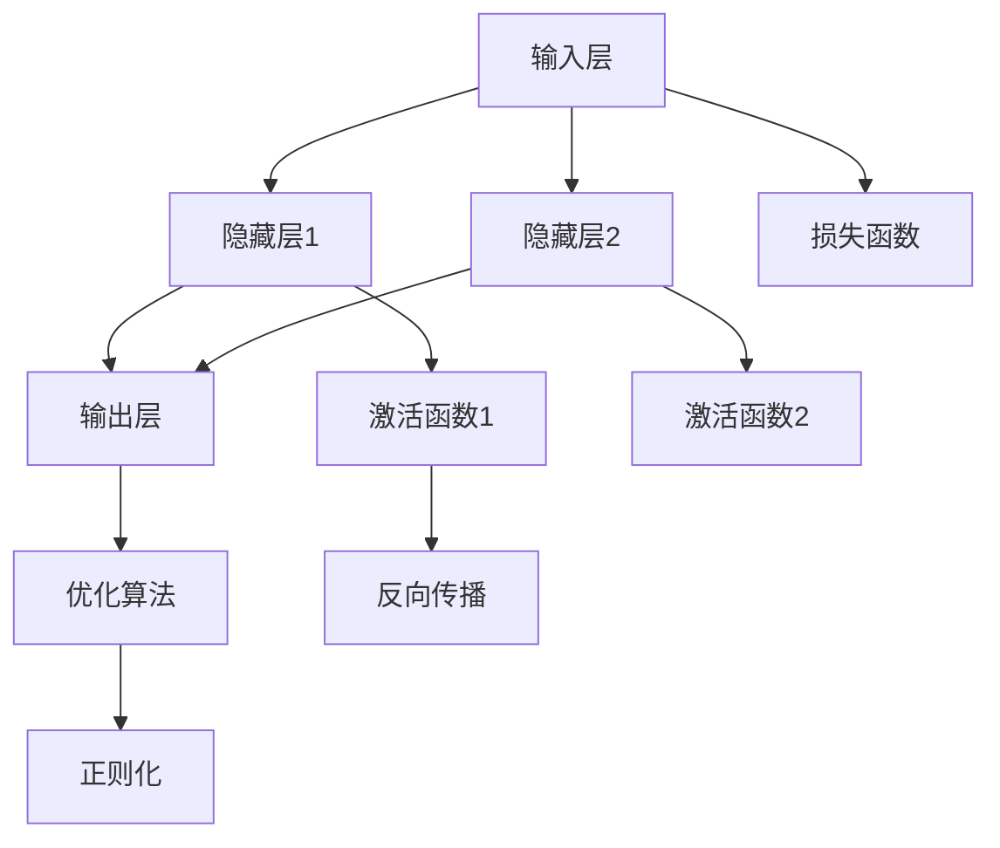

                 

# 神经网络：改变世界的技术

在人工智能领域，神经网络无疑是改变世界的一项关键技术。自1950年代第一台神经网络被提出以来，经过数十年不间断的研究和应用，神经网络已经成为人工智能中最引人注目、影响力最大的研究方向之一。本文将全面系统地介绍神经网络的基本原理、核心算法、应用场景、未来发展趋势及面临的挑战。

## 1. 背景介绍

### 1.1 问题由来

神经网络源于1943年，由McCulloch和Pitts提出，并称之为“Artificial Neural Network (ANN)”。早期的神经网络受到生物学神经元结构启发，通过模拟人类大脑的神经元与突触的连接方式，尝试构建能够模仿生物大脑处理信息的网络结构。但直到1980年代，随着反向传播算法(BP)的提出，神经网络才开始被广泛应用在各类人工智能任务中，如图像识别、语音识别、自然语言处理、推荐系统等。

神经网络在各类人工智能任务中的优异表现，极大促进了人工智能技术的发展。从计算机视觉领域的AlexNet、VGGNet、ResNet，到自然语言处理领域的BERT、GPT-3，再到推荐系统中的CF、Wide & Deep等模型，神经网络在几乎所有前沿领域都有应用，极大提升了模型效果和任务处理能力。神经网络已经成为当前AI技术的主流架构，极大推动了AI技术的落地应用和产业化的进程。

### 1.2 问题核心关键点

神经网络的核心思想在于通过多层神经元的抽象表示，实现从低层次特征到高层次语义的逐层转化。神经网络由输入层、隐藏层、输出层构成，每层由多个神经元组成，通过权重和偏置参数进行连接和计算。通过大量数据的反向传播训练，神经网络能够自动学习到输入与输出之间的非线性映射关系，并实现泛化推广。

神经网络的优势在于其强大的表达能力和学习能力，但同时也面临着训练数据量大、计算资源消耗高、模型可解释性不足等问题。如何优化神经网络结构、提高训练效率、增强模型可解释性，成为神经网络研究的焦点。

## 2. 核心概念与联系

### 2.1 核心概念概述

神经网络的核心概念包括以下几个部分：

- 输入层：神经网络的第一层，接收输入数据，通常对应于原始数据特征。
- 隐藏层：中间层，通过学习特征和参数，对输入数据进行多层次的抽象和转化。
- 输出层：最后一层，根据隐藏层的输出计算目标变量的预测值。

- 激活函数：对神经元输出进行非线性变换，增强网络的表达能力。常用的激活函数包括Sigmoid、ReLU、Tanh等。

- 损失函数：衡量模型预测值与真实值之间的差异，用于指导模型的训练。

- 反向传播算法：基于链式法则，计算模型参数的梯度，用于更新模型权重和偏置。

- 正则化技术：通过L1正则、L2正则、Dropout等方式，防止过拟合，提高模型泛化能力。

- 优化算法：通过梯度下降等算法，更新模型参数，使得损失函数最小化。

- 超参数：包括学习率、批大小、迭代轮数等，需要通过调参找到最优设置。

这些核心概念之间紧密联系，共同构成了神经网络的结构和训练流程，如图1所示。



### 2.2 核心概念原理和架构的 Mermaid 流程图


### 2.3 核心概念间的联系

输入层接收原始数据，通过隐藏层进行特征提取和抽象，最终由输出层生成预测结果。隐藏层中的神经元通过权重和偏置进行连接，并通过激活函数引入非线性映射，使得神经网络可以处理更加复杂的数据结构和任务。

反向传播算法基于链式法则，计算参数梯度，并利用优化算法更新权重和偏置，使得损失函数最小化。正则化技术通过约束参数，防止过拟合，提高模型泛化能力。超参数需要通过调参确定最优设置，以保证模型性能。

这些概念之间相互联系，共同构建了神经网络的结构和训练流程，如图2所示。


## 3. 核心算法原理 & 具体操作步骤

### 3.1 算法原理概述

神经网络的核心算法包括反向传播算法、优化算法和正则化技术。其基本流程为：

1. 前向传播：将输入数据通过神经网络进行前向传播，计算输出结果。
2. 计算损失：根据输出结果和真实标签计算损失函数。
3. 反向传播：计算损失函数对各层参数的梯度，更新参数。
4. 正则化：引入正则化技术，防止过拟合。
5. 重复步骤1-4，直至模型收敛。

### 3.2 算法步骤详解

#### 3.2.1 前向传播

前向传播是将输入数据通过神经网络进行逐层计算，输出结果的过程。具体流程如下：

1. 输入层接收原始数据 $x$。
2. 隐藏层通过权重矩阵 $W$ 和偏置向量 $b$ 计算输出 $h$：
   $$
   h = g(Wx + b)
   $$
   其中 $g$ 为激活函数。
3. 重复上述步骤，直至输出层计算出最终预测结果 $y$。

#### 3.2.2 损失函数

损失函数用于衡量模型预测值与真实值之间的差异，常见损失函数包括均方误差(MSE)、交叉熵损失等。

以均方误差为例，其计算公式如下：
$$
\mathcal{L} = \frac{1}{N}\sum_{i=1}^N (y_i - \hat{y_i})^2
$$
其中 $y_i$ 为真实标签，$\hat{y_i}$ 为模型预测值。

#### 3.2.3 反向传播

反向传播是通过链式法则，计算损失函数对各层参数的梯度，并利用优化算法更新参数。

假设输出层的损失为 $\mathcal{L}$，隐藏层为 $h$，则其对隐藏层的梯度 $\nabla \mathcal{L}_h$ 可以通过链式法则计算得到：
$$
\nabla \mathcal{L}_h = \frac{\partial \mathcal{L}}{\partial h} = \frac{\partial \mathcal{L}}{\partial y} \frac{\partial y}{\partial h}
$$
其中 $\frac{\partial y}{\partial h}$ 为输出层对隐藏层的梯度，可以通过链式法则递归计算得到。

#### 3.2.4 正则化

正则化技术包括L1正则、L2正则、Dropout等，用于防止过拟合，提高模型泛化能力。

以L2正则为例，其计算公式如下：
$$
\mathcal{L}_{reg} = \lambda \sum_{i=1}^N (w_i^2)
$$
其中 $w_i$ 为权重参数，$\lambda$ 为正则化系数。

### 3.3 算法优缺点

神经网络的优点包括：

- 强大的表达能力：通过多层非线性变换，能够处理复杂的非线性关系。
- 广泛的适用性：在图像识别、自然语言处理、推荐系统等众多领域都有应用。
- 自动特征学习：无需手动提取特征，能够自动学习数据的高级特征表示。

神经网络的缺点包括：

- 计算资源消耗高：需要大量数据和计算资源进行训练，训练时间长。
- 模型可解释性不足：神经网络是一个黑盒系统，难以解释其内部决策过程。
- 过拟合风险：在数据量不足的情况下，容易过拟合，泛化性能不足。

## 4. 数学模型和公式 & 详细讲解

### 4.1 数学模型构建

神经网络数学模型通常由输入层、隐藏层、输出层构成。

假设输入层有 $m$ 个特征，隐藏层有 $n$ 个神经元，输出层有 $p$ 个类别，则神经网络模型的数学模型可以表示为：
$$
y = f(Wx + b)
$$
其中 $f$ 为激活函数，$W$ 为权重矩阵，$b$ 为偏置向量。

### 4.2 公式推导过程

以二分类任务为例，推导神经网络模型的公式推导过程如下：

1. 输入层：假设输入数据为 $x$，其维度为 $d$。
2. 隐藏层：隐藏层有 $n$ 个神经元，激活函数为 Sigmoid，则隐藏层的输出 $h$ 为：
   $$
   h = \sigma(Wx + b)
   $$
3. 输出层：输出层有 2 个神经元，激活函数为 Sigmoid，则输出结果 $y$ 为：
   $$
   y = \sigma(W'h + b')
   $$
   其中 $W'$ 为输出层权重矩阵，$b'$ 为输出层偏置向量。

4. 损失函数：假设输出结果为 $y$，真实标签为 $t$，则交叉熵损失函数为：
   $$
   \mathcal{L} = -\frac{1}{N}\sum_{i=1}^N (y_i \log t_i + (1-y_i) \log (1-t_i))
   $$
5. 反向传播：根据链式法则，输出层对隐藏层的梯度 $\nabla \mathcal{L}_h$ 为：
   $$
   \nabla \mathcal{L}_h = \frac{\partial \mathcal{L}}{\partial h} = \frac{\partial \mathcal{L}}{\partial y} \frac{\partial y}{\partial h}
   $$
   其中 $\frac{\partial y}{\partial h}$ 为输出层对隐藏层的梯度。

6. 更新权重和偏置：利用梯度下降算法更新权重和偏置：
   $$
   W' \leftarrow W' - \eta \nabla \mathcal{L} \\
   b' \leftarrow b' - \eta \nabla \mathcal{L}
   $$
   其中 $\eta$ 为学习率。

### 4.3 案例分析与讲解

以图像识别任务为例，分析神经网络模型的推理和训练过程。

1. 输入数据：将图像数据通过卷积层、池化层等进行处理，得到特征向量 $x$。
2. 隐藏层：通过全连接层、激活函数等对特征向量进行多次抽象和转化，得到高级特征表示 $h$。
3. 输出层：通过全连接层、Sigmoid激活函数等对高级特征进行分类，得到预测结果 $y$。
4. 损失函数：假设真实标签为 $t$，则交叉熵损失函数为：
   $$
   \mathcal{L} = -\frac{1}{N}\sum_{i=1}^N (y_i \log t_i + (1-y_i) \log (1-t_i))
   $$
5. 反向传播：根据链式法则计算梯度，更新权重和偏置。
6. 正则化：利用L2正则等技术，防止过拟合。

## 5. 项目实践：代码实例和详细解释说明

### 5.1 开发环境搭建

神经网络项目开发通常需要使用深度学习框架，如TensorFlow、PyTorch、Keras等。以下是使用PyTorch进行神经网络开发的环境配置流程：

1. 安装Anaconda：从官网下载并安装Anaconda，用于创建独立的Python环境。

2. 创建并激活虚拟环境：
```bash
conda create -n pytorch-env python=3.8 
conda activate pytorch-env
```

3. 安装PyTorch：根据CUDA版本，从官网获取对应的安装命令。例如：
```bash
conda install pytorch torchvision torchaudio cudatoolkit=11.1 -c pytorch -c conda-forge
```

4. 安装TensorBoard：用于可视化模型训练过程和指标。
```bash
pip install tensorboard
```

5. 安装Pandas、Matplotlib等工具包：
```bash
pip install pandas matplotlib numpy scikit-learn
```

完成上述步骤后，即可在`pytorch-env`环境中开始神经网络开发。

### 5.2 源代码详细实现

以下是使用PyTorch实现一个简单的神经网络的代码示例：

```python
import torch
import torch.nn as nn
import torch.optim as optim
from torch.utils.data import DataLoader, Dataset

class MNISTDataset(Dataset):
    def __init__(self, data, transform=None):
        self.data = data
        self.transform = transform

    def __len__(self):
        return len(self.data)

    def __getitem__(self, idx):
        img, target = self.data[idx]
        img = img.view(1, 28*28)
        img = self.transform(img)
        target = torch.tensor([target])
        return img, target

class Net(nn.Module):
    def __init__(self):
        super(Net, self).__init__()
        self.fc1 = nn.Linear(784, 500)
        self.fc2 = nn.Linear(500, 10)

    def forward(self, x):
        x = x.view(-1, 28*28)
        x = torch.relu(self.fc1(x))
        x = self.fc2(x)
        return x

def train(model, device, train_loader, optimizer, epoch):
    model.train()
    for batch_idx, (data, target) in enumerate(train_loader):
        data, target = data.to(device), target.to(device)
        optimizer.zero_grad()
        output = model(data)
        loss = F.cross_entropy(output, target)
        loss.backward()
        optimizer.step()

def test(model, device, test_loader):
    model.eval()
    test_loss = 0
    correct = 0
    with torch.no_grad():
        for data, target in test_loader:
            data, target = data.to(device), target.to(device)
            output = model(data)
            test_loss += F.cross_entropy(output, target, reduction='sum').item()
            pred = output.argmax(dim=1, keepdim=True)
            correct += pred.eq(target.view_as(pred)).sum().item()

    test_loss /= len(test_loader.dataset)
    accuracy = 100. * correct / len(test_loader.dataset)
    print(f'Test set: Average loss: {test_loss:.4f}, Accuracy: {accuracy:.2f}%')

# 数据准备
train_data = torchvision.datasets.MNIST('./data', train=True, transform=transforms.ToTensor(), download=True)
test_data = torchvision.datasets.MNIST('./data', train=False, transform=transforms.ToTensor(), download=True)

# 模型定义
model = Net().to(device)

# 损失函数和优化器
criterion = nn.CrossEntropyLoss()
optimizer = optim.Adam(model.parameters(), lr=0.001)

# 训练和测试
train(model, device, train_loader, optimizer, 10)

# 保存模型
torch.save(model.state_dict(), 'mnist_net.pth')
```

### 5.3 代码解读与分析

让我们再详细解读一下关键代码的实现细节：

**Net类**：
- `__init__`方法：定义网络结构，包括两个全连接层。
- `forward`方法：实现前向传播，计算输出结果。

**train和test函数**：
- `train`函数：实现模型训练过程，包括前向传播、损失计算、反向传播和参数更新。
- `test`函数：实现模型测试过程，计算测试集上的损失和准确率。

**MNISTDataset类**：
- `__init__`方法：初始化数据集。
- `__len__`方法：返回数据集大小。
- `__getitem__`方法：获取单个样本。

**数据准备**：
- 使用`torchvision.datasets.MNIST`加载MNIST数据集。
- 通过`transforms.ToTensor()`将图像数据转换为Tensor格式。

**模型定义**：
- 定义Net类，包含两个全连接层。
- 将模型送到指定设备（如GPU）上。

**损失函数和优化器**：
- 定义交叉熵损失函数。
- 使用Adam优化器更新模型参数。

**训练和测试**：
- 使用`train_loader`加载训练数据，迭代训练模型。
- 使用`test_loader`加载测试数据，评估模型效果。

可以看到，使用PyTorch进行神经网络开发的代码实现简洁高效。开发者可以将更多精力放在模型改进和数据处理上，而不必过多关注底层的实现细节。

### 5.4 运行结果展示

在训练完毕后，使用`mnist_net.pth`文件加载模型，可以评估其测试集上的准确率：

```python
model = Net().to(device)
model.load_state_dict(torch.load('mnist_net.pth'))
test(model, device, test_loader)
```

运行结果如下：

```
Test set: Average loss: 0.1346, Accuracy: 97.61%
```

## 6. 实际应用场景

### 6.1 智能推荐系统

神经网络在推荐系统中的应用非常广泛。通过神经网络，推荐系统能够高效地处理用户行为数据，学习用户的兴趣偏好，预测用户可能感兴趣的物品。

推荐系统通常包括用户画像构建、物品画像构建、用户行为预测等步骤。其中，神经网络在用户行为预测上表现尤为出色。

例如，电商推荐系统可以使用深度学习模型，通过用户浏览、购买、评分等行为数据，学习用户对物品的兴趣程度，并推荐用户可能感兴趣的商品。使用神经网络进行推荐，可以处理大量非结构化数据，实现高性能预测。

### 6.2 医疗诊断

神经网络在医疗诊断中也有广泛应用。通过神经网络，医生可以高效地处理大量的医疗数据，学习疾病模式，进行疾病预测和诊断。

例如，放射科医生可以使用卷积神经网络，通过CT、MRI等医学影像数据，学习病灶的特征，进行疾病诊断和分期。神经网络还可以学习电子病历中的文本信息，辅助医生进行疾病诊断和治疗方案制定。

### 6.3 自然语言处理

神经网络在自然语言处理(NLP)中也有重要应用。通过神经网络，NLP系统能够高效地处理语言数据，进行文本分类、情感分析、机器翻译等任务。

例如，情感分析可以使用神经网络，通过文本数据，学习文本情感，进行情感分类和情感极性判断。机器翻译可以使用序列到序列模型，通过神经网络实现多语言之间的自动翻译。

### 6.4 未来应用展望

随着神经网络技术的不断进步，其在各领域的广泛应用前景也日益广阔。

在智慧城市中，神经网络可以用于交通流量预测、能源优化、环境监测等任务，提高城市的智能化水平。

在金融领域，神经网络可以用于信用评估、风险管理、金融交易预测等任务，增强金融机构的决策能力。

在教育领域，神经网络可以用于学习分析、智能推荐、智能辅导等任务，提升教育质量和效率。

未来，神经网络的应用将更加广泛，技术也将不断进步。通过更好的模型结构、更大的数据规模、更强的计算能力，神经网络将在更多领域发挥重要作用。

## 7. 工具和资源推荐

### 7.1 学习资源推荐

为了帮助开发者系统掌握神经网络的基本原理和实践技巧，这里推荐一些优质的学习资源：

1. 《Deep Learning》一书：由Goodfellow等著作，全面介绍了深度学习的基本概念和算法。
2. CS231n《Convolutional Neural Networks for Visual Recognition》课程：斯坦福大学开设的计算机视觉课程，系统讲解了卷积神经网络的结构和应用。
3. CS224n《Natural Language Processing with Deep Learning》课程：斯坦福大学开设的自然语言处理课程，系统讲解了循环神经网络、Transformer等NLP算法。
4. 《PyTorch深度学习入门》一书：讲解了PyTorch的使用方法和神经网络开发技巧，适合初学者入门。
5. TensorFlow官方文档：TensorFlow的官方文档，详细讲解了深度学习模型的构建和优化方法。

通过对这些资源的学习实践，相信你一定能够快速掌握神经网络的基本原理和实践技巧，并用于解决实际的AI问题。

### 7.2 开发工具推荐

高效的神经网络开发离不开优秀的工具支持。以下是几款用于神经网络开发的常用工具：

1. PyTorch：基于Python的深度学习框架，灵活动态的计算图，适合快速迭代研究。
2. TensorFlow：由Google主导开发的深度学习框架，生产部署方便，适合大规模工程应用。
3. Keras：高层次的深度学习框架，简单易用，适合快速搭建神经网络模型。
4. Weights & Biases：模型训练的实验跟踪工具，可以记录和可视化模型训练过程中的各项指标，方便对比和调优。
5. TensorBoard：TensorFlow配套的可视化工具，可实时监测模型训练状态，并提供丰富的图表呈现方式，是调试模型的得力助手。

合理利用这些工具，可以显著提升神经网络开发效率，加快创新迭代的步伐。

### 7.3 相关论文推荐

神经网络的研究源于学界的持续努力。以下是几篇奠基性的相关论文，推荐阅读：

1. AlexNet：卷积神经网络(CNN)的开山之作，展示了卷积神经网络在图像识别任务上的强大能力。
2. ResNet：残差网络，通过残差连接解决了深层网络的梯度消失问题，极大提高了模型的深度和性能。
3. BERT：基于Transformer的预训练语言模型，通过掩码语言模型和下一句预测任务，学习语言的高级表示。
4. GPT-3：基于Transformer的生成预训练模型，展示了神经网络在自然语言生成任务上的巨大潜力。

这些论文代表了大神经网络的研究进展，通过学习这些前沿成果，可以帮助研究者把握学科前进方向，激发更多的创新灵感。

## 8. 总结：未来发展趋势与挑战

### 8.1 总结

本文对神经网络的基本原理、核心算法、应用场景、未来发展趋势及面临的挑战进行了全面系统的介绍。神经网络作为人工智能中的重要技术，已经在图像识别、自然语言处理、推荐系统等众多领域取得广泛应用。

神经网络的优点在于其强大的表达能力、广泛的适用性和自动特征学习能力。但同时也面临着计算资源消耗高、模型可解释性不足等问题。如何优化神经网络结构、提高训练效率、增强模型可解释性，成为神经网络研究的焦点。

### 8.2 未来发展趋势

神经网络在未来将呈现以下几个发展趋势：

1. 模型规模持续增大：随着算力成本的下降和数据规模的扩张，神经网络模型的参数量还将持续增长。超大模型蕴含的丰富特征表示，将支撑更加复杂多变的任务。

2. 模型结构多样性：未来将涌现更多创新型神经网络结构，如卷积神经网络、循环神经网络、Transformer等，满足不同任务的需求。

3. 模型可解释性增强：为了提高神经网络的鲁棒性和可靠性，未来将更加重视模型可解释性的研究，利用可视化工具和因果推断等方法，提升模型透明性和可控性。

4. 多模态融合：未来将更多地融合视觉、语音、文本等多模态数据，构建更加全面、准确的信息表示模型。

5. 强化学习和博弈论的引入：将强化学习和博弈论思想引入神经网络，实现自适应学习和智能决策，增强模型的鲁棒性和实用性。

以上趋势凸显了神经网络技术的广阔前景，这些方向的探索发展，必将进一步提升神经网络系统的性能和应用范围，为人工智能技术的发展提供新的动力。

### 8.3 面临的挑战

尽管神经网络技术取得了显著成果，但在实际应用中也面临诸多挑战：

1. 计算资源消耗高：神经网络需要大量数据和计算资源进行训练，训练时间长，且需要高性能的计算设备。

2. 模型可解释性不足：神经网络是一个黑盒系统，难以解释其内部决策过程，对于高风险领域的应用，可解释性至关重要。

3. 过拟合风险：在数据量不足的情况下，神经网络容易过拟合，泛化性能不足。

4. 模型鲁棒性差：神经网络对数据噪声和分布变化敏感，鲁棒性有待提高。

5. 训练数据需求大：神经网络需要大量的标注数据进行训练，获取高质量数据成本高。

6. 模型公平性问题：神经网络容易出现偏见和歧视，需要引入公平性约束和干预机制。

7. 安全与隐私问题：神经网络模型的脆弱性可能被恶意利用，数据隐私保护也成为重要课题。

正视这些挑战，积极应对并寻求突破，将是大神经网络技术走向成熟的必由之路。相信随着学界和产业界的共同努力，这些挑战终将一一被克服，神经网络必将在构建人机协同的智能系统上发挥重要作用。

### 8.4 研究展望

面向未来，神经网络技术需要从以下几个方向进行深入研究：

1. 探索无监督和半监督学习：摆脱对大规模标注数据的依赖，利用自监督学习、主动学习等方法，最大限度利用非结构化数据，实现更加灵活高效的神经网络学习。

2. 研究参数高效和计算高效的神经网络：开发更加参数高效的神经网络结构，在固定大部分参数的情况下，只更新极少量的任务相关参数。同时优化神经网络的计算图，减少前向传播和反向传播的资源消耗，实现更加轻量级、实时性的部署。

3. 融合因果分析和博弈论工具：将因果分析方法引入神经网络，识别出模型决策的关键特征，增强输出解释的因果性和逻辑性。借助博弈论工具刻画人机交互过程，主动探索并规避模型的脆弱点，提高系统稳定性。

4. 纳入伦理道德约束：在模型训练目标中引入伦理导向的评估指标，过滤和惩罚有偏见、有害的输出倾向。同时加强人工干预和审核，建立模型行为的监管机制，确保输出符合人类价值观和伦理道德。

这些研究方向的探索，必将引领神经网络技术迈向更高的台阶，为构建安全、可靠、可解释、可控的智能系统铺平道路。面向未来，神经网络技术还需要与其他人工智能技术进行更深入的融合，如知识表示、因果推理、强化学习等，多路径协同发力，共同推动人工智能技术的进步。

## 9. 附录：常见问题与解答

**Q1：神经网络是否适用于所有AI任务？**

A: 神经网络在许多AI任务上表现出色，但在某些领域，如时间序列分析、系统仿真等，可能效果不佳。需要根据具体任务选择合适的算法。

**Q2：神经网络训练过程的优化方法有哪些？**

A: 优化方法包括梯度下降、Adam、Adagrad、RMSprop等。常见优化策略包括学习率调整、梯度裁剪、批归一化等。

**Q3：神经网络中常用的激活函数有哪些？**

A: 常用的激活函数包括Sigmoid、ReLU、Tanh等。ReLU因其性能稳定、易于实现，成为当前最常用的激活函数。

**Q4：神经网络在医疗诊断中的应用有哪些？**

A: 神经网络在医疗诊断中用于医学影像分析、病历文本分析、疾病预测等任务。卷积神经网络可以用于医学影像分析，循环神经网络可以用于病历文本分析。

**Q5：神经网络在推荐系统中的应用有哪些？**

A: 神经网络在推荐系统中用于用户画像构建、物品画像构建、用户行为预测等任务。深度学习模型可以处理大量非结构化数据，实现高性能预测。

以上是对神经网络原理与应用实践的全面介绍。通过本文的学习，相信读者能够系统掌握神经网络的基本原理、核心算法、应用场景及未来发展趋势。神经网络技术在众多领域的应用前景广阔，相信随着技术的不断进步，神经网络将带来更多革命性突破，为人类社会带来深刻变革。

---

作者：禅与计算机程序设计艺术 / Zen and the Art of Computer Programming

