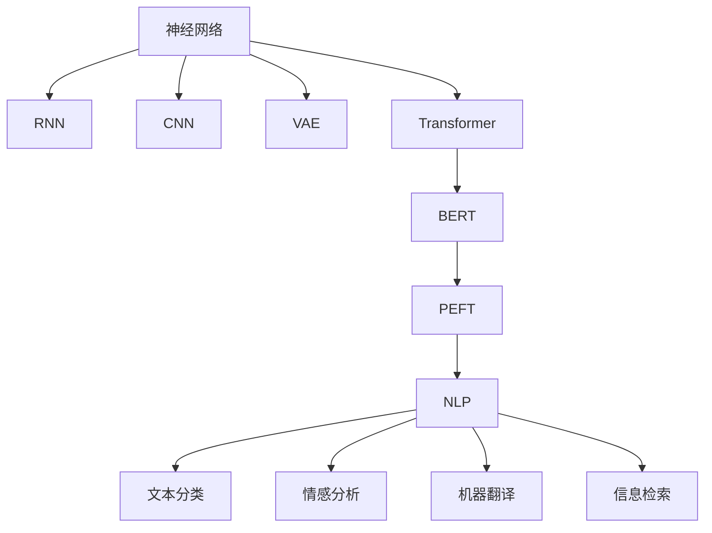

                 

# 神经网络：自然语言处理的新突破

> 关键词：神经网络,自然语言处理,Transformer,BERT,预训练,下游任务,参数高效微调,自然语言处理(NLP)

## 1. 背景介绍

### 1.1 问题由来
近年来，深度学习技术的飞速发展为自然语言处理（NLP）带来了革命性的变化。特别是以神经网络为核心的模型，如循环神经网络（RNN）、卷积神经网络（CNN）、变分自编码器（VAE）等，已经在机器翻译、文本分类、信息检索、情感分析等诸多任务上取得了突破性的进展。然而，这些模型普遍存在一些限制，如对长序列的记忆能力有限、训练时间长、难以捕捉远距离的依赖关系等。

### 1.2 问题核心关键点
神经网络在NLP领域面临的挑战促使研究者不断探索新的模型架构和训练方法。随着Transformer模型和预训练技术的发展，神经网络在NLP任务中的表现获得了显著提升，成为了新的主流技术范式。Transformer通过引入自注意力机制（self-attention），有效解决了上述问题，并推动了NLP领域的诸多新突破。

## 2. 核心概念与联系

### 2.1 核心概念概述

为了更好地理解神经网络在NLP中的应用，本节将介绍几个核心概念：

- 神经网络（Neural Network）：一种通过学习数据分布来自动提取特征的机器学习模型。在NLP中，神经网络被广泛应用于文本分类、序列标注、机器翻译等任务。
- 循环神经网络（RNN）：一种可以处理序列数据的神经网络模型，具有记忆单元，能够捕捉序列中的时间依赖关系。
- 卷积神经网络（CNN）：一种基于卷积操作的神经网络模型，常用于文本分类、情感分析等任务。
- 变分自编码器（VAE）：一种生成式模型，能够生成新的文本，并用于文本生成任务。
- Transformer模型：一种基于自注意力机制的神经网络模型，通过并行计算，显著提升了训练和推理速度。
- BERT模型：一种预训练语言模型，通过掩码语言模型和下一句预测任务进行自监督预训练，学习丰富的语言表示。
- 参数高效微调（PEFT）：在微调过程中，只更新少量的模型参数，而固定大部分预训练权重不变，以提高微调效率，避免过拟合。
- 自然语言处理（NLP）：使用计算机技术处理和分析自然语言数据，包括文本分类、情感分析、机器翻译、信息检索等任务。

这些核心概念之间的逻辑关系可以通过以下Mermaid流程图来展示：



这个流程图展示了一系列的NLP核心概念及其之间的关系：

1. 神经网络是NLP的基础模型。
2. RNN和CNN常用于处理序列和文本分类任务。
3. VAE用于文本生成。
4. Transformer通过自注意力机制，提升了训练和推理效率。
5. BERT是预训练语言模型，通过自监督学习获得强大的语言表示。
6. PEFT是一种高效的微调方法，固定大部分预训练参数，只微调顶层。
7. NLP是一个广泛的领域，涉及多种任务，如文本分类、情感分析、机器翻译等。

这些概念共同构成了NLP技术的核心框架，使得神经网络能够在多个任务上取得卓越表现。通过理解这些核心概念，我们可以更好地把握神经网络在NLP中的应用和优化方向。

## 3. 核心算法原理 & 具体操作步骤
### 3.1 算法原理概述

神经网络在NLP中的应用主要基于序列建模和特征提取。通过学习大规模语料库中的语言特征，神经网络能够捕捉语言的结构、语法和语义信息，从而进行自然语言处理。

对于NLP任务，神经网络通常包含嵌入层（Embedding Layer）、全连接层（Fully Connected Layer）和激活函数（Activation Function）。嵌入层将文本中的单词或字符映射为高维向量，全连接层负责特征提取和计算，激活函数用于引入非线性特性。

以Transformer为例，其核心结构包括编码器（Encoder）和解码器（Decoder）。编码器由多个自注意力层（Self-Attention Layer）和前馈网络层（Feedforward Layer）组成，能够并行计算处理序列数据。解码器由多层自注意力层和全连接层构成，能够预测序列标签或生成文本。

### 3.2 算法步骤详解

以下是使用Transformer模型进行NLP任务微调的详细步骤：

**Step 1: 准备预训练模型和数据集**
- 选择合适的预训练语言模型，如BERT、GPT等。
- 准备下游任务的数据集，划分为训练集、验证集和测试集。

**Step 2: 添加任务适配层**
- 根据任务类型，在预训练模型顶层设计合适的输出层和损失函数。
- 对于分类任务，通常使用softmax函数输出多类概率。
- 对于生成任务，通常使用语言模型的解码器输出概率分布。

**Step 3: 设置微调超参数**
- 选择合适的优化算法及其参数，如AdamW、SGD等，设置学习率、批大小、迭代轮数等。
- 设置正则化技术及强度，包括权重衰减、Dropout、Early Stopping等。
- 确定冻结预训练参数的策略，如仅微调顶层，或全部参数都参与微调。

**Step 4: 执行梯度训练**
- 将训练集数据分批次输入模型，前向传播计算损失函数。
- 反向传播计算参数梯度，根据设定的优化算法和学习率更新模型参数。
- 周期性在验证集上评估模型性能，根据性能指标决定是否触发Early Stopping。
- 重复上述步骤直到满足预设的迭代轮数或Early Stopping条件。

**Step 5: 测试和部署**
- 在测试集上评估微调后模型的效果，对比微调前后的精度提升。
- 使用微调后的模型对新样本进行推理预测，集成到实际的应用系统中。

以上是使用Transformer进行NLP任务微调的一般流程。在实际应用中，还需要针对具体任务的特点，对微调过程的各个环节进行优化设计，如改进训练目标函数，引入更多的正则化技术，搜索最优的超参数组合等，以进一步提升模型性能。

### 3.3 算法优缺点

神经网络在NLP中的应用具有以下优点：
1. 能够自动提取和处理序列数据，无需手工设计特征。
2. 通过预训练学习丰富的语言知识，能够在下游任务上获得更好的效果。
3. 能够处理长序列和远距离依赖关系，适应复杂语言结构。
4. 并行计算能力强，训练速度快。

同时，神经网络在NLP中也存在一些缺点：
1. 训练数据需求量大，获取高质量标注数据成本高。
2. 过拟合风险高，需要采取正则化等方法缓解。
3. 模型复杂度高，难以解释模型内部工作机制。
4. 计算资源消耗大，对硬件要求高。

尽管存在这些局限性，但神经网络仍然是NLP领域的主流技术范式，其在大规模语料预训练和微调上的成功应用，为NLP技术的发展提供了强大的支持。

### 3.4 算法应用领域

神经网络在NLP领域已经得到了广泛的应用，覆盖了几乎所有常见任务，例如：

- 文本分类：如情感分析、主题分类、意图识别等。神经网络能够自动提取文本特征，学习分类边界。
- 命名实体识别：识别文本中的人名、地名、机构名等特定实体。神经网络能够捕捉实体边界和类型。
- 关系抽取：从文本中抽取实体之间的语义关系。神经网络能够学习实体-关系三元组。
- 问答系统：对自然语言问题给出答案。神经网络能够理解问题语义，匹配答案。
- 机器翻译：将源语言文本翻译成目标语言。神经网络能够学习语言-语言映射。
- 文本摘要：将长文本压缩成简短摘要。神经网络能够学习文本结构，提取关键信息。
- 对话系统：使机器能够与人自然对话。神经网络能够理解对话历史，生成回复。

除了上述这些经典任务外，神经网络还被创新性地应用到更多场景中，如可控文本生成、常识推理、代码生成、数据增强等，为NLP技术带来了全新的突破。

## 4. 数学模型和公式 & 详细讲解 & 举例说明

### 4.1 数学模型构建

神经网络在NLP中的应用通常包括嵌入层、全连接层和激活函数。以文本分类任务为例，数学模型可以表示为：

$$
\mathbf{x} = \text{Embedding}(\mathbf{X})
$$

$$
\mathbf{h} = \text{Fully Connected}(\mathbf{x})
$$

$$
\mathbf{y} = \text{Softmax}(\mathbf{h})
$$

其中，$\mathbf{x}$ 表示输入文本的嵌入表示，$\mathbf{h}$ 表示全连接层的输出，$\mathbf{y}$ 表示分类结果的概率分布。

### 4.2 公式推导过程

以文本分类为例，假设输入文本为 $\mathbf{X} = [x_1, x_2, ..., x_n]$，其中 $x_i$ 表示单词 $i$ 的嵌入表示。则嵌入层的输出为：

$$
\mathbf{x} = \text{Embedding}(\mathbf{X}) = [\mathbf{x}_1, \mathbf{x}_2, ..., \mathbf{x}_n]
$$

其中，$\mathbf{x}_i$ 表示单词 $i$ 的嵌入向量。

假设全连接层为 $\mathbf{h} = \text{Fully Connected}(\mathbf{x})$，则有：

$$
\mathbf{h} = \mathbf{W}_x\mathbf{x} + \mathbf{b}_x
$$

其中，$\mathbf{W}_x$ 为全连接层的权重矩阵，$\mathbf{b}_x$ 为偏置向量。

假设输出层为 $\mathbf{y} = \text{Softmax}(\mathbf{h})$，则有：

$$
\mathbf{y} = \text{Softmax}(\mathbf{h}) = \frac{e^{\mathbf{h}}}{\sum_{j=1}^C e^{\mathbf{h}_j}}
$$

其中，$C$ 表示类别数，$\mathbf{y}_j$ 表示第 $j$ 个类别的预测概率。

通过最大化对数似然损失函数：

$$
\mathcal{L} = -\sum_{i=1}^N \sum_{j=1}^C y_{ij} \log \hat{y}_{ij}
$$

对模型参数进行优化，即可训练出文本分类模型。

### 4.3 案例分析与讲解

以BERT模型为例，BERT通过掩码语言模型和下一句预测任务进行自监督预训练，学习丰富的语言表示。其数学模型可以表示为：

$$
\mathbf{h}_1 = \mathbf{x}_1\mathbf{W}_x + \mathbf{b}_x
$$

$$
\mathbf{h}_2 = \mathbf{x}_2\mathbf{W}_x + \mathbf{b}_x
$$

$$
\mathbf{h} = \mathbf{h}_1 + \mathbf{h}_2
$$

其中，$\mathbf{h}_1$ 和 $\mathbf{h}_2$ 表示两个子词的嵌入表示，$\mathbf{h}$ 表示最终的语言表示。

对于下一句预测任务，BERT的数学模型可以表示为：

$$
\mathbf{y} = \text{Softmax}(\mathbf{h})
$$

$$
\mathcal{L} = -\sum_{i=1}^N \log \hat{y}_{ij}
$$

其中，$\mathbf{y}$ 表示预测结果的概率分布，$\mathcal{L}$ 表示交叉熵损失函数。

BERT的预训练过程通常使用随机掩码的方式，将输入序列中的某些位置随机遮盖，让模型学习预测被遮盖位置的单词。具体过程如下：

1. 对于每个位置 $i$，以概率 $p$ 遮盖输入序列 $\mathbf{x}$ 中的位置。
2. 对于被遮盖的位置 $j$，使用一个掩码标记 $\tilde{x}_j$ 代替，表示这是一个被遮盖的位置。
3. 将 $\tilde{x}_j$ 和未遮盖的部分拼接，作为输入序列 $\tilde{\mathbf{x}}$，计算语言模型损失函数。
4. 使用下一句预测任务计算预测结果 $\hat{y}$，计算交叉熵损失函数。

通过大规模无标签数据对BERT进行预训练，能够学习到丰富的语言知识，提升在下游任务上的微调效果。

## 5. 项目实践：代码实例和详细解释说明

### 5.1 开发环境搭建

在进行神经网络在NLP任务微调实践前，我们需要准备好开发环境。以下是使用Python进行TensorFlow开发的环境配置流程：

1. 安装Anaconda：从官网下载并安装Anaconda，用于创建独立的Python环境。

2. 创建并激活虚拟环境：
```bash
conda create -n tensorflow-env python=3.8 
conda activate tensorflow-env
```

3. 安装TensorFlow：根据CUDA版本，从官网获取对应的安装命令。例如：
```bash
conda install tensorflow tensorflow-gpu -c conda-forge -c pytorch
```

4. 安装Keras：
```bash
pip install keras
```

5. 安装各类工具包：
```bash
pip install numpy pandas scikit-learn matplotlib tqdm jupyter notebook ipython
```

完成上述步骤后，即可在`tensorflow-env`环境中开始微调实践。

### 5.2 源代码详细实现

下面我们以文本分类任务为例，给出使用TensorFlow和Keras库对RNN模型进行NLP任务微调的PyTorch代码实现。

首先，定义文本分类的数据处理函数：

```python
from tensorflow.keras.preprocessing.text import Tokenizer
from tensorflow.keras.preprocessing.sequence import pad_sequences
from tensorflow.keras.utils import to_categorical

def preprocess_data(texts, labels):
    tokenizer = Tokenizer()
    tokenizer.fit_on_texts(texts)
    sequences = tokenizer.texts_to_sequences(texts)
    padded_sequences = pad_sequences(sequences, maxlen=max_len, padding='post')
    labels = to_categorical(labels)
    return padded_sequences, labels
```

然后，定义模型和优化器：

```python
from tensorflow.keras.models import Sequential
from tensorflow.keras.layers import Embedding, LSTM, Dense, Dropout

model = Sequential()
model.add(Embedding(input_dim=tokenizer.num_words+1, output_dim=embedding_dim, input_length=max_len))
model.add(LSTM(units=hidden_units, dropout=dropout_rate, recurrent_dropout=dropout_rate))
model.add(Dense(units=num_classes, activation='softmax'))
model.compile(loss='categorical_crossentropy', optimizer='adam', metrics=['accuracy'])

optimizer = Adam()
```

接着，定义训练和评估函数：

```python
from tensorflow.keras.callbacks import EarlyStopping

def train_model(model, X_train, y_train, X_val, y_val, batch_size, epochs, callbacks):
    model.fit(X_train, y_train, batch_size=batch_size, epochs=epochs, validation_data=(X_val, y_val), callbacks=callbacks)

def evaluate_model(model, X_test, y_test, batch_size):
    scores = model.evaluate(X_test, y_test, batch_size=batch_size)
    return scores
```

最后，启动训练流程并在测试集上评估：

```python
max_len = 100
embedding_dim = 100
hidden_units = 128
dropout_rate = 0.2
num_classes = 2

X_train, y_train = preprocess_data(train_texts, train_labels)
X_val, y_val = preprocess_data(dev_texts, dev_labels)
X_test, y_test = preprocess_data(test_texts, test_labels)

train_model(model, X_train, y_train, X_val, y_val, batch_size, epochs, [EarlyStopping(patience=3)])
scores = evaluate_model(model, X_test, y_test, batch_size)
print(scores)
```

以上就是使用TensorFlow和Keras对RNN进行文本分类任务微调的完整代码实现。可以看到，得益于Keras的强大封装，我们可以用相对简洁的代码完成RNN模型的加载和微调。

### 5.3 代码解读与分析

让我们再详细解读一下关键代码的实现细节：

**preprocess_data函数**：
- 定义了一个数据预处理函数，将原始文本转换为模型所需的序列数据和标签数据。
- 使用Keras的Tokenizer类对文本进行分词和编码。
- 使用pad_sequences函数对序列数据进行填充，使得所有序列长度相同。
- 使用to_categorical函数将标签转换为one-hot编码，方便模型训练。

**train_model函数**：
- 定义了模型训练函数，将数据分批次输入模型，计算损失函数并更新模型参数。
- 使用EarlyStopping回调函数，在验证集上监控模型性能，一旦性能不再提升，即停止训练。

**evaluate_model函数**：
- 定义了模型评估函数，在测试集上计算模型的损失和准确率。
- 使用evaluate函数对测试集进行评估，返回模型在测试集上的性能指标。

**训练流程**：
- 定义了训练集和测试集的长度，模型参数。
- 在训练集和验证集上启动模型训练，监控模型性能。
- 在测试集上评估模型，输出模型在测试集上的性能指标。

可以看到，Keras和TensorFlow使得RNN微调的代码实现变得简洁高效。开发者可以将更多精力放在数据处理、模型改进等高层逻辑上，而不必过多关注底层的实现细节。

当然，工业级的系统实现还需考虑更多因素，如模型的保存和部署、超参数的自动搜索、更灵活的任务适配层等。但核心的微调范式基本与此类似。

## 6. 实际应用场景
### 6.1 智能客服系统

基于RNN和Transformer的NLP技术，可以广泛应用于智能客服系统的构建。传统客服往往需要配备大量人力，高峰期响应缓慢，且一致性和专业性难以保证。而使用神经网络模型进行微调后的客服系统，可以7x24小时不间断服务，快速响应客户咨询，用自然流畅的语言解答各类常见问题。

在技术实现上，可以收集企业内部的历史客服对话记录，将问题和最佳答复构建成监督数据，在此基础上对神经网络模型进行微调。微调后的客服模型能够自动理解用户意图，匹配最合适的答案模板进行回复。对于客户提出的新问题，还可以接入检索系统实时搜索相关内容，动态组织生成回答。如此构建的智能客服系统，能大幅提升客户咨询体验和问题解决效率。

### 6.2 金融舆情监测

金融机构需要实时监测市场舆论动向，以便及时应对负面信息传播，规避金融风险。传统的人工监测方式成本高、效率低，难以应对网络时代海量信息爆发的挑战。基于神经网络模型的NLP技术，能够自动分析金融领域相关的新闻、报道、评论等文本数据，并对其进行主题标注和情感标注。将神经网络模型应用到实时抓取的网络文本数据，就能够自动监测不同主题下的情感变化趋势，一旦发现负面信息激增等异常情况，系统便会自动预警，帮助金融机构快速应对潜在风险。

### 6.3 个性化推荐系统

当前的推荐系统往往只依赖用户的历史行为数据进行物品推荐，无法深入理解用户的真实兴趣偏好。基于神经网络模型的个性化推荐系统，可以更好地挖掘用户行为背后的语义信息，从而提供更精准、多样的推荐内容。

在实践中，可以收集用户浏览、点击、评论、分享等行为数据，提取和用户交互的物品标题、描述、标签等文本内容。将文本内容作为模型输入，用户的后续行为（如是否点击、购买等）作为监督信号，在此基础上微调神经网络模型。微调后的模型能够从文本内容中准确把握用户的兴趣点。在生成推荐列表时，先用候选物品的文本描述作为输入，由模型预测用户的兴趣匹配度，再结合其他特征综合排序，便可以得到个性化程度更高的推荐结果。

### 6.4 未来应用展望

随着神经网络技术的发展，基于神经网络模型的NLP应用将在更多领域得到应用，为各行各业带来变革性影响。

在智慧医疗领域，基于神经网络模型的问答系统、病历分析、药物研发等应用将提升医疗服务的智能化水平，辅助医生诊疗，加速新药开发进程。

在智能教育领域，基于神经网络模型的作业批改、学情分析、知识推荐等应用将促进教育公平，提高教学质量。

在智慧城市治理中，基于神经网络模型的城市事件监测、舆情分析、应急指挥等应用将提高城市管理的自动化和智能化水平，构建更安全、高效的未来城市。

此外，在企业生产、社会治理、文娱传媒等众多领域，基于神经网络模型的NLP应用也将不断涌现，为经济社会发展注入新的动力。相信随着技术的日益成熟，神经网络技术必将在更广阔的应用领域大放异彩，深刻影响人类的生产生活方式。

## 7. 工具和资源推荐
### 7.1 学习资源推荐

为了帮助开发者系统掌握神经网络在NLP中的应用，这里推荐一些优质的学习资源：

1. 《深度学习》系列书籍：斯坦福大学的吴恩达教授所著，全面介绍了深度学习的基础知识和算法原理。
2. 《Python深度学习》书籍：Francois Chollet所著，介绍了使用Keras进行深度学习模型开发的实践技巧。
3. 《自然语言处理入门》书籍：斯坦福大学的李飞飞教授所著，介绍了NLP的基本概念和常用技术。
4. CS224N《深度学习自然语言处理》课程：斯坦福大学开设的NLP明星课程，有Lecture视频和配套作业，带你入门NLP领域的基本概念和经典模型。
5. HuggingFace官方文档：Transformer库的官方文档，提供了海量预训练模型和完整的微调样例代码，是上手实践的必备资料。

通过对这些资源的学习实践，相信你一定能够快速掌握神经网络在NLP中的应用和优化方向。
###  7.2 开发工具推荐

高效的开发离不开优秀的工具支持。以下是几款用于神经网络在NLP任务微调开发的常用工具：

1. PyTorch：基于Python的开源深度学习框架，灵活动态的计算图，适合快速迭代研究。大部分预训练语言模型都有PyTorch版本的实现。

2. TensorFlow：由Google主导开发的开源深度学习框架，生产部署方便，适合大规模工程应用。同样有丰富的预训练语言模型资源。

3. Keras：一个高层次的深度学习库，使用简单，易于上手，适合初学者和快速原型设计。

4. Weights & Biases：模型训练的实验跟踪工具，可以记录和可视化模型训练过程中的各项指标，方便对比和调优。与主流深度学习框架无缝集成。

5. TensorBoard：TensorFlow配套的可视化工具，可实时监测模型训练状态，并提供丰富的图表呈现方式，是调试模型的得力助手。

6. Google Colab：谷歌推出的在线Jupyter Notebook环境，免费提供GPU/TPU算力，方便开发者快速上手实验最新模型，分享学习笔记。

合理利用这些工具，可以显著提升神经网络在NLP任务微调任务的开发效率，加快创新迭代的步伐。

### 7.3 相关论文推荐

神经网络在NLP领域的发展源于学界的持续研究。以下是几篇奠基性的相关论文，推荐阅读：

1. Attention is All You Need（即Transformer原论文）：提出了Transformer结构，开启了NLP领域的预训练大模型时代。

2. BERT: Pre-training of Deep Bidirectional Transformers for Language Understanding：提出BERT模型，引入基于掩码的自监督预训练任务，学习丰富的语言表示。

3. Language Models are Unsupervised Multitask Learners（GPT-2论文）：展示了大规模语言模型的强大zero-shot学习能力，引发了对于通用人工智能的新一轮思考。

4. Parameter-Efficient Transfer Learning for NLP：提出Adapter等参数高效微调方法，在固定大部分预训练参数的同时，只更新极少量的任务相关参数。

5. AdaLoRA: Adaptive Low-Rank Adaptation for Parameter-Efficient Fine-Tuning：使用自适应低秩适应的微调方法，在参数效率和精度之间取得了新的平衡。

这些论文代表了大神经网络在NLP任务微调技术的发展脉络。通过学习这些前沿成果，可以帮助研究者把握学科前进方向，激发更多的创新灵感。

## 8. 总结：未来发展趋势与挑战

### 8.1 总结

本文对基于神经网络的大语言处理技术进行了全面系统的介绍。首先阐述了神经网络在NLP领域的应用背景和意义，明确了神经网络在NLP任务中的独特价值。其次，从原理到实践，详细讲解了神经网络在NLP中的核心算法和具体操作步骤，给出了神经网络在NLP任务微调的完整代码实现。同时，本文还广泛探讨了神经网络在智能客服、金融舆情、个性化推荐等多个行业领域的应用前景，展示了神经网络技术的广泛影响力。此外，本文精选了神经网络在NLP任务微调技术的各类学习资源，力求为读者提供全方位的技术指引。

通过本文的系统梳理，可以看到，基于神经网络的NLP技术正在成为NLP领域的主流技术范式，其在大规模语料预训练和微调上的成功应用，为NLP技术的发展提供了强大的支持。未来，伴随神经网络技术的发展，NLP技术必将在更广阔的应用领域大放异彩，深刻影响人类的生产生活方式。

### 8.2 未来发展趋势

展望未来，神经网络在NLP中的应用将呈现以下几个发展趋势：

1. 模型规模持续增大。随着算力成本的下降和数据规模的扩张，神经网络模型的参数量还将持续增长。超大规模神经网络模型蕴含的丰富语言知识，有望支撑更加复杂多变的下游任务微调。

2. 微调方法日趋多样。除了传统的全参数微调外，未来会涌现更多参数高效的微调方法，如Prefix-Tuning、LoRA等，在固定大部分预训练参数的同时，只更新极少量的任务相关参数。

3. 持续学习成为常态。随着数据分布的不断变化，神经网络模型也需要持续学习新知识以保持性能。如何在不遗忘原有知识的同时，高效吸收新样本信息，将成为重要的研究课题。

4. 标注样本需求降低。受启发于提示学习(Prompt-based Learning)的思路，未来的神经网络微调方法将更好地利用大神经网络的语言理解能力，通过更加巧妙的任务描述，在更少的标注样本上也能实现理想的微调效果。

5. 计算资源消耗减少。未来的神经网络模型将通过稀疏化、量化等方法，显著降低计算资源消耗，提升训练和推理速度。

6. 模型通用性增强。经过海量数据的预训练和多领域任务的微调，未来的神经网络模型将具备更强大的常识推理和跨领域迁移能力，逐步迈向通用人工智能(AGI)的目标。

以上趋势凸显了神经网络在NLP中的应用前景。这些方向的探索发展，必将进一步提升NLP系统的性能和应用范围，为人类认知智能的进化带来深远影响。

### 8.3 面临的挑战

尽管神经网络在NLP中的应用已经取得了瞩目成就，但在迈向更加智能化、普适化应用的过程中，它仍面临着诸多挑战：

1. 训练数据需求量大。虽然神经网络能够自动提取和处理序列数据，但大规模标注数据的需求仍然很高，获取高质量标注数据的成本也很高。如何进一步降低神经网络对标注样本的依赖，将是一大难题。

2. 过拟合风险高。当前神经网络模型在处理长序列和远距离依赖关系时，容易发生过拟合。如何缓解过拟合问题，避免灾难性遗忘，还需要更多理论和实践的积累。

3. 推理效率有待提高。尽管神经网络模型的精度高，但在实际部署时往往面临推理速度慢、内存占用大等效率问题。如何优化推理速度，提升系统响应速度，优化资源占用，将是重要的优化方向。

4. 可解释性亟需加强。当前神经网络模型的内部工作机制难以解释，对于医疗、金融等高风险应用，算法的可解释性和可审计性尤为重要。如何赋予神经网络模型更强的可解释性，将是亟待攻克的难题。

5. 安全性有待保障。神经网络模型难免会学习到有偏见、有害的信息，通过微调传递到下游任务，产生误导性、歧视性的输出，给实际应用带来安全隐患。如何从数据和算法层面消除模型偏见，避免恶意用途，确保输出的安全性，也将是重要的研究课题。

6. 知识整合能力不足。现有的神经网络模型往往局限于任务内数据，难以灵活吸收和运用更广泛的先验知识。如何让神经网络模型更好地与外部知识库、规则库等专家知识结合，形成更加全面、准确的信息整合能力，还有很大的想象空间。

正视神经网络在NLP应用中面临的这些挑战，积极应对并寻求突破，将是大语言处理技术迈向成熟的必由之路。相信随着学界和产业界的共同努力，这些挑战终将一一被克服，神经网络技术必将在构建人机协同的智能时代中扮演越来越重要的角色。

### 8.4 研究展望

面对神经网络在NLP应用中面临的挑战，未来的研究需要在以下几个方面寻求新的突破：

1. 探索无监督和半监督微调方法。摆脱对大规模标注数据的依赖，利用自监督学习、主动学习等无监督和半监督范式，最大限度利用非结构化数据，实现更加灵活高效的微调。

2. 研究参数高效和计算高效的微调范式。开发更加参数高效的微调方法，在固定大部分预训练参数的同时，只更新极少量的任务相关参数。同时优化神经网络模型的计算图，减少前向传播和反向传播的资源消耗，实现更加轻量级、实时性的部署。

3. 引入因果分析和博弈论工具。将因果分析方法引入神经网络模型，识别出模型决策的关键特征，增强输出解释的因果性和逻辑性。借助博弈论工具刻画人机交互过程，主动探索并规避模型的脆弱点，提高系统稳定性。

4. 纳入伦理道德约束。在模型训练目标中引入伦理导向的评估指标，过滤和惩罚有偏见、有害的输出倾向。同时加强人工干预和审核，建立模型行为的监管机制，确保输出符合人类价值观和伦理道德。

这些研究方向的探索，必将引领神经网络在NLP微调技术迈向更高的台阶，为构建安全、可靠、可解释、可控的智能系统铺平道路。面向未来，神经网络技术还需要与其他人工智能技术进行更深入的融合，如知识表示、因果推理、强化学习等，多路径协同发力，共同推动自然语言理解和智能交互系统的进步。只有勇于创新、敢于突破，才能不断拓展神经网络模型的边界，让智能技术更好地造福人类社会。

## 9. 附录：常见问题与解答

**Q1：神经网络在NLP任务中是否存在局限性？**

A: 神经网络在NLP任务中存在以下局限性：
1. 对标注数据需求高。神经网络需要大量高质量标注数据进行训练，获取标注数据的成本和难度较大。
2. 过拟合风险高。神经网络模型在处理长序列和远距离依赖关系时容易发生过拟合，影响模型泛化性能。
3. 推理效率低。神经网络模型在推理过程中计算资源消耗大，推理速度慢，难以满足实时性要求。
4. 可解释性差。神经网络模型的内部工作机制难以解释，难以进行人工审核和监管。

**Q2：如何选择适当的神经网络架构？**

A: 选择适当的神经网络架构需要考虑以下几个因素：
1. 任务类型。不同任务需要不同的网络架构。如文本分类通常使用RNN或CNN，序列标注使用RNN或Transformer。
2. 数据规模。大规模数据适合使用Transformer等深度神经网络，小规模数据则可以选择浅层神经网络。
3. 计算资源。计算资源丰富的环境适合使用大模型，资源有限的环境则需要选择参数较少的模型。

**Q3：如何缓解神经网络模型的过拟合风险？**

A: 缓解神经网络模型的过拟合风险需要采取以下措施：
1. 数据增强。通过回译、近义替换等方式扩充训练集，增加样本多样性。
2. 正则化。使用L2正则、Dropout等技术，防止模型过度适应训练数据。
3. 早停策略。在验证集上监控模型性能，一旦性能不再提升，立即停止训练。
4. 参数共享。使用共享参数的方法，减少模型复杂度，降低过拟合风险。

**Q4：如何优化神经网络模型的推理效率？**

A: 优化神经网络模型的推理效率需要采取以下措施：
1. 模型压缩。使用剪枝、量化等方法，减小模型参数和计算量。
2. 并行计算。使用GPU、TPU等硬件加速推理过程。
3. 推理优化。优化推理算法，减少计算和存储开销。

**Q5：如何提高神经网络模型的可解释性？**

A: 提高神经网络模型的可解释性需要采取以下措施：
1. 可视化。使用可视化工具展示模型内部特征和决策过程。
2. 解释模型。使用特征重要性分析、局部可解释模型等方法，解释模型的预测结果。
3. 设计任务。在任务描述中明确模型的输出，提高模型的可解释性。

**Q6：如何保证神经网络模型的安全性？**

A: 保证神经网络模型的安全性需要采取以下措施：
1. 数据清洗。过滤和消除模型训练数据中的有害信息。
2. 模型监控。实时监控模型输出，发现异常情况及时干预。
3. 伦理约束。在模型训练和应用过程中，引入伦理导向的评估指标，过滤有害输出。

通过这些方法的综合运用，可以有效缓解神经网络在NLP应用中的局限性，提升模型的性能和安全性。

