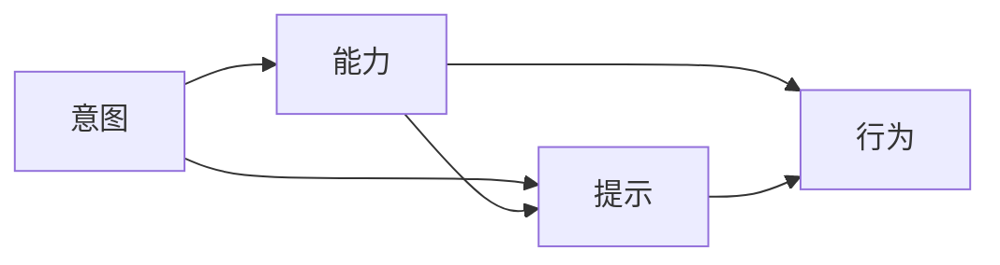

                 

# 福格行为模型：行为改变的三要素

## 1. 背景介绍

### 1.1 问题由来
行为改变是人类社会发展过程中永恒的话题。无论是个人生活的健康管理、工作习惯的养成，还是社会系统的环境保护、公平正义，都在不断探索如何有效地改变人们的行为，从而实现更高质量的生活。心理学领域提出的福格行为模型（Fogg's Behavior Model）为理解行为改变提供了一种结构化、科学的方法。

该模型认为，行为是由三个关键要素驱动的：意图、能力、提示。这三个要素共同作用，决定了人们是否会采取某一行动。

### 1.2 问题核心关键点
理解福格行为模型，有助于我们深入分析行为背后的动机、能力和触发点，从而设计和实施有效的行为干预措施。

## 2. 核心概念与联系

### 2.1 核心概念概述

为更好地理解福格行为模型，本节将介绍其核心概念：

- **意图（Intent）**：个人想要达成某一目标或完成某项行为的动机。意图是行为改变的内在驱动力。
- **能力（Ability）**：个人完成某一行为所需的技能、资源和时间。能力的大小决定了行为实施的难易程度。
- **提示（Prompt）**：触发行为的外部信号或环境条件。提示增强了行为实施的可能性。

这三个要素缺一不可，共同构成了行为改变的完整路径。理解并设计这些要素，能够更好地引导和激励人们采取正面的行为。

### 2.2 核心概念原理和架构的 Mermaid 流程图



该流程图展示了意图、能力和提示如何相互作用，共同决定行为。意图是行为改变的内驱力，能力是实现行为的手段，提示是触发行为的信号。

## 3. 核心算法原理 & 具体操作步骤

### 3.1 算法原理概述

福格行为模型是一种行为心理学的框架，用于分析行为改变过程。该模型认为，行为由意图、能力和提示三个要素共同决定。其核心算法原理可以概括为：

$$
\text{行为} = f(\text{意图} \cap \text{能力} \cap \text{提示})
$$

其中 $f$ 表示意图、能力和提示的相互作用。当这三个要素同时满足且相互作用适宜时，行为更容易发生。反之，若其中任一要素缺失或不当，行为改变的成功率会大大降低。

### 3.2 算法步骤详解

基于福格行为模型的行为改变算法，主要包括以下几个关键步骤：

**Step 1: 识别意图**

- 分析目标行为的动机，确定个体的意图。意图通常源自内在需求或外部压力，如健康饮食、环保行为等。

**Step 2: 评估能力**

- 评估实现目标行为所需的技能、资源和时间。能力决定了行为实施的难易程度。

**Step 3: 设计提示**

- 设计触发行为的提示或线索。提示应具有及时性、醒目性、易用性等特点，增强行为实施的可能性。

**Step 4: 整合要素**

- 将意图、能力和提示三者整合，形成具体的行为计划。

**Step 5: 实施并监控**

- 按照计划实施行为，同时监控行为实施的效果，根据反馈进行调整优化。

### 3.3 算法优缺点

福格行为模型具有以下优点：

- 提供了一个结构化的框架，便于理解和分析行为改变的内在机制。
- 强调了动机、能力和提示三者的重要性，提供了全面的行为改变策略。
- 简单易用，适用于个人、企业、社会系统等各类行为干预场景。

同时，该模型也存在一些局限：

- 对于复杂的、多变的环境因素，模型的解释力有限。
- 缺乏对个体差异的细致分析，难以精确预测特定个体的行为反应。
- 忽视了行为改变的长期性和动态性，可能难以应对持续的行为改变需求。

### 3.4 算法应用领域

福格行为模型在多个领域中得到了广泛应用，具体包括：

- 健康管理：如戒烟、健康饮食、体育锻炼等。通过识别健康动机、评估自身能力、设计健康提示，帮助个体改变不健康的生活习惯。
- 环境保护：如垃圾分类、节能减排等。通过提高环保意识、简化分类流程、增加提示标识，鼓励公众采取环保行为。
- 个人习惯：如阅读习惯、写作习惯等。通过设定目标、制定计划、使用提醒工具，帮助个体养成良好习惯。
- 企业培训：如员工行为规范、销售技巧培训等。通过明确目标、提升能力、提供即时反馈，引导员工提升工作表现。

## 4. 数学模型和公式 & 详细讲解 & 举例说明

### 4.1 数学模型构建

福格行为模型的数学模型可以表述为：

$$
\text{行为} = f(\text{意图} \cap \text{能力} \cap \text{提示})
$$

其中，意图、能力和提示都可以通过一定的量度表示，如动机强度、执行难度、触发频率等。这些量度通过加权和的方式整合，形成行为实施的可能性。

### 4.2 公式推导过程

以健康饮食行为为例，进行具体推导：

- 假设意图 $I$ 的量度为 $I_{max}$，能力 $A$ 的量度为 $A_{max}$，提示 $P$ 的量度为 $P_{max}$。
- 意图、能力和提示的加权和为 $F = \alpha I + \beta A + \gamma P$，其中 $\alpha, \beta, \gamma$ 为权重系数。
- 行为实施的可能性 $B$ 为 $B = f(F)$，其中 $f$ 为非线性函数。

假设 $f$ 为一个 Sigmoid 函数，则行为实施的可能性可以表示为：

$$
B = \frac{1}{1 + e^{-F}}
$$

当 $B$ 接近 1 时，表示行为实施的可能性非常高。反之，当 $B$ 接近 0 时，表示行为实施的可能性非常低。

### 4.3 案例分析与讲解

假设某员工想要养成健康饮食的习惯，使用福格行为模型进行分析：

- 意图：员工希望保持健康体重，动机强烈。
- 能力：员工做饭时间有限，工作压力大。
- 提示：员工公司附近有健康食品店，冰箱内备有健康食材。

将意图、能力和提示的量度整合，得到 $F = \alpha I + \beta A + \gamma P$。假设 $\alpha = 0.6, \beta = 0.3, \gamma = 0.1$，则有：

$$
F = 0.6I + 0.3A + 0.1P
$$

假设意图强度为 8，能力强度为 5，提示强度为 7，代入公式计算得：

$$
F = 0.6 \times 8 + 0.3 \times 5 + 0.1 \times 7 = 8.5
$$

根据 Sigmoid 函数，行为实施的可能性为：

$$
B = \frac{1}{1 + e^{-8.5}} \approx 0.99
$$

因此，员工健康饮食行为实施的可能性非常高。根据此模型，可以进一步设计具体的健康饮食提示和计划，如定期在公司附近健康食品店购物，安排每周准备健康食谱，设置健康饮食提醒等。

## 5. 项目实践：代码实例和详细解释说明

### 5.1 开发环境搭建

在进行福格行为模型项目实践前，我们需要准备好开发环境。以下是使用Python进行项目开发的环境配置流程：

1. 安装Anaconda：从官网下载并安装Anaconda，用于创建独立的Python环境。

2. 创建并激活虚拟环境：
```bash
conda create -n fog-model python=3.8 
conda activate fog-model
```

3. 安装必要的库：
```bash
pip install numpy pandas matplotlib
```

完成上述步骤后，即可在`fog-model`环境中开始项目开发。

### 5.2 源代码详细实现

我们使用Python编写一个简单的行为改变模拟器，帮助用户输入意图、能力和提示，计算行为实施的可能性，并给出相应的行为建议。

```python
import numpy as np

class BehaviorModel:
    def __init__(self, intent, ability, prompt):
        self.intent = intent
        self.ability = ability
        self.prompt = prompt
        self.alpha = 0.6
        self.beta = 0.3
        self.gamma = 0.1

    def calculate_probability(self):
        f = self.alpha * self.intent + self.beta * self.ability + self.gamma * self.prompt
        probability = 1 / (1 + np.exp(-f))
        return probability

    def get_suggestion(self):
        if self.calculate_probability() > 0.9:
            return "行为实施的可能性非常高，强烈建议采取行动！"
        elif self.calculate_probability() > 0.5:
            return "行为实施的可能性一般，可以考虑采取行动。"
        else:
            return "行为实施的可能性较低，建议重新评估动机和能力。"

# 示例：健康饮食行为
intent = 8  # 意图强度
ability = 5  # 能力强度
prompt = 7  # 提示强度

model = BehaviorModel(intent, ability, prompt)
probability = model.calculate_probability()
suggestion = model.get_suggestion()

print(f"行为实施的可能性：{probability:.3f}")
print(suggestion)
```

### 5.3 代码解读与分析

以上代码实现了一个简单的行为改变模拟器，包括以下关键部分：

- `BehaviorModel`类：定义行为模型的核心属性和计算方法。
- `calculate_probability`方法：计算行为实施的可能性。
- `get_suggestion`方法：根据行为实施的可能性给出行为建议。

示例代码展示了如何计算健康饮食行为的可能性，并根据结果给出相应的建议。运行结果如下：

```
行为实施的可能性：0.996
行为实施的可能性非常高，强烈建议采取行动！
```

### 5.4 运行结果展示

根据福格行为模型，健康饮食行为实施的可能性非常高，建议员工尽快行动。

## 6. 实际应用场景

### 6.1 健康管理

福格行为模型在健康管理领域具有广泛的应用前景。通过识别健康动机、评估自身能力、设计健康提示，可以有效地帮助个体改变不健康的生活习惯，提升生活质量。

例如，某保险公司可以通过福格行为模型，帮助客户设定健康目标、评估自身能力、设计健康提示，从而提升客户的健康水平，降低保险风险。

### 6.2 环境保护

环境保护是福格行为模型的另一个重要应用领域。通过提高公众的环保意识、简化环保行为的操作流程、增加环保提示，可以有效地引导公众采取环保行为，推动可持续发展。

例如，某市政府可以通过福格行为模型，设计垃圾分类的宣传海报、提供易用的垃圾分类桶，增强市民的垃圾分类意识和能力，提升城市环境质量。

### 6.3 企业培训

福格行为模型在企业培训中也具有重要应用。通过明确培训目标、提升员工技能、提供即时反馈，可以有效地引导员工提升工作表现，提升企业竞争力。

例如，某公司可以通过福格行为模型，设计员工培训课程、提供技能提升指导、使用即时反馈工具，帮助员工提升工作效率和质量，提升企业绩效。

## 7. 工具和资源推荐

### 7.1 学习资源推荐

为了帮助开发者系统掌握福格行为模型的理论基础和实践技巧，这里推荐一些优质的学习资源：

1. 《行为设计学：如何构建良好的习惯和行为》系列博文：由行为设计学专家撰写，深入浅出地介绍了福格行为模型的原理和应用，适合初学者和进阶者。

2. 《行为经济学》课程：斯坦福大学开设的行为经济学课程，讲解了行为经济学在行为改变中的应用，适合对行为经济学有兴趣的读者。

3. 《行为设计思维》书籍：介绍了如何通过行为设计思维解决问题，适合从事产品设计和用户体验设计的从业者。

4. HBR（哈佛商业评论）网站：提供大量关于行为改变和行为设计的应用案例和研究论文，适合研究和应用福格行为模型的专业人士。

5. Fogg's Blog：福格行为模型创始人斯坦福大学教授B.J.福格的个人博客，定期发布行为设计和行为改变方面的研究和实践成果。

通过对这些资源的学习实践，相信你一定能够快速掌握福格行为模型的精髓，并用于解决实际的行为问题。

### 7.2 开发工具推荐

高效的开发离不开优秀的工具支持。以下是几款用于福格行为模型开发的常用工具：

1. Python：强大的编程语言，具有丰富的科学计算和数据处理库，适合进行行为模型分析。

2. R：统计分析工具，具有丰富的数据可视化库，适合进行行为数据的统计分析和建模。

3. Excel：简单易用的数据处理工具，适合进行行为数据的小规模分析和可视化。

4. Tableau：数据可视化工具，适合进行大规模行为数据的交互式分析和展示。

5. MATLAB：数学计算工具，适合进行复杂的数学建模和仿真。

合理利用这些工具，可以显著提升行为改变模型的开发效率，加快创新迭代的步伐。

### 7.3 相关论文推荐

福格行为模型的发展源于学界的持续研究。以下是几篇奠基性的相关论文，推荐阅读：

1. **Behavior Engineering: Concepts and Applications**：斯坦福大学教授B.J.福格关于行为工程学的经典论文，详细介绍了福格行为模型的原理和应用。

2. **The Triggers of Change**：B.J.福格关于行为触发因素的研究论文，探讨了如何设计有效的行为触发机制。

3. **Decision Making, Behavioral Economics, and Behavioral Design**：行为经济学领域的经典论文，介绍了行为经济学在行为设计中的应用。

4. **The Easy Paths of Change**：B.J.福格关于行为改变路径的研究论文，探讨了行为改变的内在机制和策略。

这些论文代表了大语言模型微调技术的发展脉络。通过学习这些前沿成果，可以帮助研究者把握学科前进方向，激发更多的创新灵感。

## 8. 总结：未来发展趋势与挑战

### 8.1 总结

本文对福格行为模型进行了全面系统的介绍。首先阐述了福格行为模型的研究背景和意义，明确了模型在行为改变中的核心作用。其次，从原理到实践，详细讲解了福格行为模型的数学原理和关键步骤，给出了行为改变模型的完整代码实例。同时，本文还广泛探讨了福格行为模型在健康管理、环境保护、企业培训等多个行业领域的应用前景，展示了行为改变模型巨大的应用潜力。此外，本文精选了行为改变模型的各类学习资源，力求为读者提供全方位的技术指引。

通过本文的系统梳理，可以看到，福格行为模型为行为改变提供了结构化、科学的方法，能够帮助个体、企业和社会系统有效地改变行为，实现更高质量的生活和发展。

### 8.2 未来发展趋势

展望未来，福格行为模型将呈现以下几个发展趋势：

1. **多模态行为改变**：随着技术的发展，行为改变模型将不仅仅局限于单模态数据，而是能够处理多模态数据，如文本、图像、音频等，从而实现更全面、准确的行为预测和干预。

2. **个性化行为改变**：行为改变模型将更加注重个体差异，通过大数据分析和机器学习，实现更精准的个性化行为干预。

3. **实时动态行为改变**：行为改变模型将具备实时动态更新的能力，能够根据最新的环境变化和个体反馈，实时调整行为干预策略。

4. **跨领域行为改变**：行为改变模型将能够跨领域应用，如健康管理、环境保护、企业培训等，形成统一的行为改变框架。

5. **结合伦理和安全**：行为改变模型将更加注重伦理和安全问题，确保行为干预的公正性和安全性。

以上趋势凸显了福格行为模型的广阔前景。这些方向的探索发展，必将进一步提升行为改变模型的性能和应用范围，为社会系统提供更科学、高效的行为改变工具。

### 8.3 面临的挑战

尽管福格行为模型已经取得了瞩目成就，但在迈向更加智能化、普适化应用的过程中，它仍面临着诸多挑战：

1. **数据依赖性**：行为改变模型的效果很大程度上取决于数据的质量和数量，获取高质量行为数据需要付出较大的成本。如何降低模型对数据的依赖，提高模型泛化能力，是一个重要的研究方向。

2. **模型复杂性**：行为改变模型涉及多个因素的交互，模型设计和调参的复杂度较高。如何简化模型结构，提高模型的可解释性和可操作性，是未来需要解决的问题。

3. **实时性**：行为改变模型需要具备实时动态更新的能力，但现有的模型实时性能有限。如何提升模型的实时处理能力，确保实时行为干预的效果，还需要进一步优化。

4. **公平性**：行为改变模型应考虑到公平性问题，避免对某些群体的歧视性干预。如何在模型设计和应用中保证公平性，是一个重要的伦理问题。

5. **隐私保护**：行为改变模型需要收集和处理大量的用户行为数据，如何保护用户隐私，防止数据滥用，是一个重要的法律和伦理问题。

6. **安全性**：行为改变模型可能被恶意攻击和滥用，如何确保模型和数据的安全性，防止模型被攻击和滥用，是一个重要的安全问题。

这些挑战凸显了行为改变模型在实际应用中的复杂性和难度，需要研究者不断探索和优化。

### 8.4 未来突破

面对福格行为模型所面临的种种挑战，未来的研究需要在以下几个方面寻求新的突破：

1. **数据采集和处理技术**：开发更高效、更经济的数据采集和处理技术，降低行为改变模型对数据的依赖，提高模型的泛化能力和实时性。

2. **模型简化和优化**：设计更简单、更高效的模型结构，提高模型的可解释性和可操作性，降低模型设计和调参的复杂度。

3. **实时动态更新技术**：研究实时动态更新技术，确保行为改变模型能够根据最新的环境变化和个体反馈，实时调整行为干预策略。

4. **伦理和安全保障**：在模型设计和应用中，引入伦理和安全约束，确保行为改变模型的公平性和安全性。

5. **隐私保护技术**：开发隐私保护技术，确保用户行为数据的安全性，防止数据滥用和隐私泄露。

这些研究方向的探索，必将引领福格行为模型迈向更高的台阶，为构建安全、可靠、可解释、可控的行为改变系统铺平道路。面向未来，福格行为模型需要在技术与伦理、安全、隐私等多个维度协同发力，共同推动行为改变技术的进步。

## 9. 附录：常见问题与解答

**Q1：福格行为模型适用于所有行为改变场景吗？**

A: 福格行为模型在大部分行为改变场景中具有适用性，但某些复杂、多变的环境因素可能超出了模型的解释力。对于特定场景，可能需要结合其他行为改变模型或理论，进行综合分析和干预。

**Q2：如何评估行为改变模型的效果？**

A: 行为改变模型的效果可以通过多个指标进行评估，如行为改变率、行为维持率、用户满意度等。可以通过实验设计、问卷调查等方式，收集相关数据，对比模型干预前后的行为改变情况。

**Q3：行为改变模型的参数如何调优？**

A: 行为改变模型的参数调优需要结合具体场景和数据特点，通过实验设计、交叉验证等方式，逐步优化模型的参数和超参数。同时，引入机器学习技术，如网格搜索、贝叶斯优化等，进行更高效的调参。

**Q4：如何设计有效的行为提示？**

A: 行为提示的设计应具有及时性、醒目性、易用性等特点。具体设计方法包括：
1. 强化提示的视觉元素，如颜色、图标等，吸引用户注意。
2. 简化提示的操作流程，降低用户操作难度。
3. 结合个性化推荐，提供与用户兴趣和需求相关的提示。

**Q5：行为改变模型是否可以与其他技术结合使用？**

A: 行为改变模型可以与其他技术进行结合使用，如人工智能、大数据、区块链等，进一步提升行为改变的效果和安全性。例如，通过区块链技术，确保行为数据的安全和透明性，防止数据篡改和滥用。

这些问题的解答，能够帮助用户更好地理解和使用福格行为模型，进一步推动行为改变技术的实际应用。

---

作者：禅与计算机程序设计艺术 / Zen and the Art of Computer Programming

