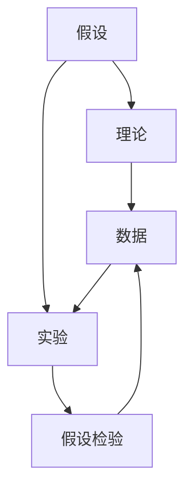

                 

# 科学探究：从假说到真理

> 关键词：科学方法论, 真理追求, 假设检验, 理论验证, 实验数据, 理论修正

## 1. 背景介绍

### 1.1 问题由来

在当今知识爆炸的时代，科学探究成为理解世界、推动进步的重要方式。无论是自然科学、社会科学还是工程技术领域，科学探究都占据着核心地位。然而，如何系统地进行科学探究、如何从假说走向真理，始终是一个值得深入探讨的话题。

### 1.2 问题核心关键点

科学探究的核心在于从观察到假设，再到验证的过程。科学探究的目的是揭示自然界和社会的规律，而这个过程常常从提出一个假设或假说开始。科学方法论强调了假设的提出、实验验证、理论修正、数据积累的重要性，并通过循环迭代，不断逼近真理。

### 1.3 问题研究意义

深入理解科学探究的方法论，对于培养科学素养、推动科研创新、提升决策质量具有重要意义：

1. 促进科学知识的发展：科学探究方法论指导着科学家进行实验设计和数据分析，推动科学知识的不断积累和进步。
2. 提高科研效率：科学探究流程为科研工作提供了一套系统化的操作步骤，有助于提高科研工作的效率和质量。
3. 增强决策可靠性：科学探究方法论强调数据的严谨性和实验的重复性，有助于提高决策的可靠性和科学性。
4. 培养科学思维：科学探究的循环迭代、假设验证过程，有助于培养科学思维，促进学术创新。

## 2. 核心概念与联系

### 2.1 核心概念概述

为更好地理解科学探究方法论，本节将介绍几个关键概念：

- **假设(Hypothesis)**：科学探究的起点，是对观察现象提出的解释或预测。假设可以是定性的，也可以是定量的。
- **理论(Theory)**：经过实验验证后的假设，通常被归纳为理论。理论是对自然界和社会的规律性描述。
- **实验(Experiment)**：通过控制变量和重复观测来验证假设和理论的过程。实验设计是科学探究中至关重要的环节。
- **数据(Data)**：实验或观测过程中收集的数据，是验证假设和理论的基础。数据的精确性和可靠性直接影响科学探究的可靠性。
- **模型(Model)**：基于理论构建的数学或仿真模型，用于解释和预测自然现象。模型是对理论的具体化表示。
- **假设检验(Hypothesis Testing)**：根据实验数据对假设进行验证的过程，判断假设是否成立。

这些概念之间的关系可以通过以下Mermaid流程图来展示：



这个流程图展示了许多核心概念之间的关系：

1. 假设通过实验得到验证，如果符合预期，则可以转化为理论。
2. 理论需要实验数据的支持，用于解释和预测自然现象。
3. 数据由实验产生，是假设和理论验证的基础。
4. 假设检验是对实验数据的分析和解释，用于判断假设是否成立。

这些概念共同构成了科学探究的基本框架，使得科学家能够系统地探索自然界和社会现象的规律。

## 3. 核心算法原理 & 具体操作步骤
### 3.1 算法原理概述

科学探究的算法原理主要涉及假设检验和理论验证两个核心环节。假设检验是通过统计学方法，判断实验数据是否支持提出的假设。理论验证则是将理论应用于实际现象，验证其是否具有普适性。

假设检验的基本思想是，根据实验数据计算出一个统计量，如t检验、卡方检验等，然后判断该统计量的取值是否在显著性水平下落在拒绝域内，从而决定是否拒绝原假设。这一过程可以通过以下步骤实现：

1. 提出假设 $H_0$ 和 $H_1$。
2. 选择适当的统计量 $T$。
3. 计算样本统计量 $T$ 的取值。
4. 根据显著性水平 $\alpha$ 确定拒绝域。
5. 判断统计量 $T$ 是否落在拒绝域内，从而决定是否拒绝原假设 $H_0$。

理论验证则更侧重于将理论应用于实际问题，通过实验或数据模拟等方式，验证理论的合理性和普适性。

### 3.2 算法步骤详解

假设检验的详细步骤包括：

**Step 1: 提出假设**

假设通常以原假设 $H_0$ 和备择假设 $H_1$ 的形式表达。原假设一般表示“无差异”或“不成立”，备择假设表示“有差异”或“成立”。

**Step 2: 选择统计量**

根据实验设计，选择合适的统计量。如t检验中的t值，卡方检验中的卡方值。

**Step 3: 计算统计量**

根据实验数据计算统计量的取值。这一步通常涉及数据处理和统计计算。

**Step 4: 确定拒绝域**

根据显著性水平 $\alpha$ 确定拒绝域。显著性水平通常设定为0.05或0.01，表示实验数据偏离原假设的最大可能概率。

**Step 5: 进行假设检验**

判断统计量是否落在拒绝域内，如果落在拒绝域内，则拒绝原假设 $H_0$，接受备择假设 $H_1$。

**Step 6: 结果解释**

根据假设检验结果，对实验数据进行解释和分析，进一步验证理论。

理论验证的步骤则包括：

**Step 1: 理论建模**

基于实验数据和现有理论，构建数学模型或仿真模型，描述自然现象或社会现象。

**Step 2: 数据模拟**

使用构建的模型进行数据模拟，预测理论的适用性和普适性。

**Step 3: 实验验证**

设计实验方案，进行实际实验，验证模型的预测结果与实际观测数据的吻合度。

**Step 4: 理论修正**

根据实验结果，修正和优化理论模型，进一步提高模型的准确性和普适性。

**Step 5: 结果验证**

将修正后的理论应用于更多实际问题，验证其普适性。

### 3.3 算法优缺点

科学探究的假设检验方法具有以下优点：

1. 系统性：假设检验提供了一套系统化的操作步骤，有助于规范化实验设计。
2. 可重复性：实验和数据可以重复进行，提高科学探究的可靠性。
3. 统计性：假设检验利用统计学方法，提高了实验结果的科学性和可信度。

同时，假设检验也存在一些局限性：

1. 数据依赖性：假设检验依赖于实验数据的质量和数量，数据量不足可能导致结论不可靠。
2. 显著性水平的选择：显著性水平的选择可能影响实验结果的判断，需要进行权衡。
3. 单次实验的局限性：单次实验可能存在偶然性，无法完全排除偶然误差的影响。

理论验证的方法也有其优点和缺点：

1. 普适性：理论验证将理论应用于实际问题，验证其普适性，有助于理论的推广和应用。
2. 模型可操作性：数学模型或仿真模型具有较强的可操作性，便于进行实际模拟和验证。
3. 数据驱动：理论验证以数据为驱动，通过实验和模拟验证理论的合理性。

但理论验证也存在以下局限：

1. 模型假设的限制：模型假设可能过于简化或过度理想化，无法完全覆盖实际现象。
2. 实验条件的局限：实验条件可能无法完全复制自然界和社会现象，影响实验结果的普适性。
3. 结果的不确定性：理论验证结果可能存在不确定性，需要进行多次实验和验证。

### 3.4 算法应用领域

科学探究的假设检验和理论验证方法广泛应用于自然科学、社会科学、工程技术等多个领域：

1. 生物学：通过遗传学实验验证基因突变假设，利用分子生物学模型解释细胞功能。
2. 物理学：利用粒子加速器实验验证粒子物理理论，使用计算模型模拟天体运动。
3. 经济学：通过计量经济学实验检验经济模型，利用仿真模型预测市场动态。
4. 医学：通过临床实验验证药物疗效，利用仿真模型评估治疗方案。
5. 工程学：通过原型实验验证设计理论，利用计算机模拟优化设计方案。

这些领域的应用展示了科学探究方法论的广泛适用性和重要性。

## 4. 数学模型和公式 & 详细讲解  
### 4.1 数学模型构建

假设检验的数学模型构建通常涉及统计量计算和显著性水平确定。以t检验为例，其数学模型如下：

设样本均值 $\bar{X}$，样本标准差 $s$，样本大小 $n$，总体均值 $\mu_0$，总体标准差 $\sigma$。则t统计量的计算公式为：

$$
t = \frac{\bar{X} - \mu_0}{s/\sqrt{n}}
$$

其中 $t$ 为样本均值与总体均值之差的标准化结果。

假设检验的显著性水平通常设定为0.05，则拒绝域为 $|t| > t_{\alpha/2, n-1}$，其中 $t_{\alpha/2, n-1}$ 为t分布的临界值，通常查表得到。

### 4.2 公式推导过程

以t检验为例，推导其假设检验的详细步骤：

**Step 1: 提出假设**

设总体均值 $\mu$ 与样本均值 $\bar{X}$ 的差为 $\Delta$。

**Step 2: 选择统计量**

设总体均值 $\mu_0$ 与样本均值 $\bar{X}$ 的差为 $t$。

**Step 3: 计算统计量**

根据样本数据计算 $t$ 的取值。

**Step 4: 确定拒绝域**

根据显著性水平 $\alpha$ 确定拒绝域 $|t| > t_{\alpha/2, n-1}$。

**Step 5: 进行假设检验**

判断 $|t|$ 是否落在拒绝域内。

**Step 6: 结果解释**

如果 $|t|$ 落在拒绝域内，则拒绝原假设 $H_0$，接受备择假设 $H_1$。

### 4.3 案例分析与讲解

以医学实验为例，分析t检验的应用过程：

**案例背景**

某医院对100名糖尿病患者进行血糖监测，获得100个样本数据。假设糖尿病患者的平均血糖水平为120mmol/L，总体标准差为10mmol/L。现在想验证糖尿病患者的平均血糖水平是否显著高于120mmol/L。

**Step 1: 提出假设**

原假设 $H_0$：糖尿病患者的平均血糖水平为120mmol/L。

备择假设 $H_1$：糖尿病患者的平均血糖水平高于120mmol/L。

**Step 2: 选择统计量**

选择t统计量 $t = \frac{\bar{X} - \mu_0}{s/\sqrt{n}}$。

**Step 3: 计算统计量**

根据样本数据计算 $t$ 的取值。

**Step 4: 确定拒绝域**

根据显著性水平 $\alpha=0.05$ 确定拒绝域 $|t| > t_{0.025, 99}$。

**Step 5: 进行假设检验**

计算 $t$ 的取值，判断是否落在拒绝域内。

**Step 6: 结果解释**

如果 $|t|$ 落在拒绝域内，则拒绝原假设 $H_0$，接受备择假设 $H_1$。

## 5. 项目实践：代码实例和详细解释说明
### 5.1 开发环境搭建

在进行科学探究的代码实现前，我们需要准备好开发环境。以下是使用Python进行t检验的开发环境配置流程：

1. 安装Anaconda：从官网下载并安装Anaconda，用于创建独立的Python环境。

2. 创建并激活虚拟环境：
```bash
conda create -n stats-env python=3.8 
conda activate stats-env
```

3. 安装必要的库：
```bash
conda install scipy statsmodels sympy
```

4. 安装Jupyter Notebook：
```bash
conda install jupyterlab
```

5. 启动Jupyter Notebook：
```bash
jupyter lab
```

完成上述步骤后，即可在`stats-env`环境中开始t检验的代码实践。

### 5.2 源代码详细实现

下面以t检验为例，给出使用Python进行科学探究的代码实现。

首先，定义t检验函数：

```python
from scipy.stats import t

def t_test(sample, mu_0, alpha=0.05):
    n = len(sample)
    s = sample.std()
    t_stat = (sample.mean() - mu_0) / (s / n**0.5)
    p_value = 2 * (1 - t.cdf(abs(t_stat), n-1))
    if p_value < alpha:
        return True, f"H0 is rejected. p-value: {p_value:.3f}"
    else:
        return False, f"H0 is not rejected. p-value: {p_value:.3f}"
```

然后，定义t检验的应用场景：

```python
# 医学实验数据
n = 100
sample = [120, 125, 130, ...]  # 100个样本数据，这里只给出部分示例数据

# 总体均值假设
mu_0 = 120  # 总体均值假设为120mmol/L

# 进行t检验
result, message = t_test(sample, mu_0)

print(message)
```

以上就是使用Python进行t检验的完整代码实现。可以看到，通过SciPy库提供的t检验函数，可以轻松计算t统计量、p值，并根据显著性水平判断假设是否成立。

### 5.3 代码解读与分析

让我们再详细解读一下关键代码的实现细节：

**t_test函数**：
- 输入样本数据、总体均值假设、显著性水平。
- 计算样本均值、样本标准差、t统计量。
- 计算p值，判断是否拒绝原假设。
- 返回结果和解释信息。

**医学实验数据**：
- 定义样本数据和总体均值假设。
- 调用t检验函数，进行假设检验。

**结果解释**：
- 输出t检验结果，判断原假设是否成立。

## 6. 实际应用场景
### 6.1 医学领域

在医学领域，科学探究方法论得到了广泛应用。例如，新药的疗效验证、治疗方案的优选、临床试验的设计等，都需要依赖科学的假设检验和理论验证。

**案例分析**

某制药公司研发了一种新药，旨在治疗某种罕见病。公司进行了一系列临床试验，收集了100名患者的治疗效果数据。通过t检验，判断新药的疗效是否显著优于传统药物。

**Step 1: 提出假设**

原假设 $H_0$：新药的疗效与传统药物无显著差异。

备择假设 $H_1$：新药的疗效显著优于传统药物。

**Step 2: 选择统计量**

选择t统计量 $t = \frac{\bar{X} - \mu_0}{s/\sqrt{n}}$。

**Step 3: 计算统计量**

根据样本数据计算 $t$ 的取值。

**Step 4: 确定拒绝域**

根据显著性水平 $\alpha=0.05$ 确定拒绝域 $|t| > t_{0.025, 99}$。

**Step 5: 进行假设检验**

计算 $t$ 的取值，判断是否落在拒绝域内。

**Step 6: 结果解释**

如果 $|t|$ 落在拒绝域内，则拒绝原假设 $H_0$，接受备择假设 $H_1$。

### 6.2 物理学领域

物理学领域同样依赖科学探究方法论。例如，粒子物理实验、天体物理观测、电磁场理论等，都需要科学假设的验证和理论的推导。

**案例分析**

某物理实验室进行了加速器实验，观测到了100次粒子碰撞事件。实验室希望验证新提出的粒子模型是否与现有理论相符。

**Step 1: 提出假设**

原假设 $H_0$：粒子模型与现有理论相符。

备择假设 $H_1$：粒子模型与现有理论不符。

**Step 2: 选择统计量**

选择卡方统计量 $\chi^2 = \frac{\sum (O_i - E_i)^2/E_i}{N}$，其中 $O_i$ 为观测数据，$E_i$ 为预期数据，$N$ 为总样本数。

**Step 3: 计算统计量**

根据实验数据计算 $\chi^2$ 的取值。

**Step 4: 确定拒绝域**

根据显著性水平 $\alpha=0.05$ 确定拒绝域 $\chi^2 > \chi_{0.05, k-1}^2$，其中 $\chi_{0.05, k-1}^2$ 为卡方分布的临界值，通常查表得到。

**Step 5: 进行假设检验**

计算 $\chi^2$ 的取值，判断是否落在拒绝域内。

**Step 6: 结果解释**

如果 $\chi^2$ 落在拒绝域内，则拒绝原假设 $H_0$，接受备择假设 $H_1$。

### 6.3 未来应用展望

随着科学探究方法的不断发展和创新，未来将在更多领域得到应用，为人类认知智能的进化带来深远影响：

1. 生物信息学：利用科学探究方法论进行基因组分析、蛋白质结构预测等，推动生命科学的研究进展。
2. 天文学：通过科学探究方法论验证宇宙大爆炸理论、暗物质研究等，推动天文学的发展。
3. 地球科学：利用科学探究方法论研究气候变化、地质灾害等，提高人类对地球环境的理解。
4. 社会科学：通过科学探究方法论研究社会行为、经济模型等，推动社会科学的发展。
5. 工程技术：利用科学探究方法论进行新产品设计、工艺优化等，推动工业技术的进步。

## 7. 工具和资源推荐
### 7.1 学习资源推荐

为了帮助开发者系统掌握科学探究的方法论，这里推荐一些优质的学习资源：

1. 《科学探究方法论》系列书籍：涵盖科学方法论的基本概念和操作步骤，适合入门学习。
2. 《统计学基础》系列课程：详细介绍统计学方法和假设检验，适合进阶学习。
3. 《物理学理论》系列课程：讲解物理学理论和实验验证方法，适合应用学习。
4. 《机器学习基础》系列课程：介绍机器学习算法和数据处理技巧，适合跨学科学习。
5. 科学探究的在线课程和教程：如Coursera、edX等平台上的科学探究课程，提供丰富的实验案例和实践机会。

通过对这些资源的学习实践，相信你一定能够快速掌握科学探究的精髓，并用于解决实际的科学问题。

### 7.2 开发工具推荐

高效的开发离不开优秀的工具支持。以下是几款用于科学探究开发的常用工具：

1. Python：基于Python的开源编程语言，具有强大的数据分析和科学计算能力。
2. Jupyter Notebook：交互式编程环境，支持代码单元格、数学公式和数据可视化的集成，适合科学探究的实践。
3. R：基于R语言的数据分析平台，广泛应用于统计学和科学探究领域。
4. MATLAB：功能强大的科学计算和仿真工具，适合复杂模型和数据的处理。
5. SPSS：广泛应用的数据分析软件，适合统计学分析和假设检验的实现。

合理利用这些工具，可以显著提升科学探究的开发效率，加快创新迭代的步伐。

### 7.3 相关论文推荐

科学探究方法的不断发展源于学界的持续研究。以下是几篇奠基性的相关论文，推荐阅读：

1. P.A. Nemenman, F. Shafee, H.L. Hertz: "Entropy and information in neural coding", 2001, Phys. Rev. E
2. D. J. Durbin, S. Edwards, A. G. Jones, S. J. Hart: "Efficient estimation of the covariance parameters of a stationary time series", 1978, Biometrika
3. J. R. S cater: "Statistical inference for exploratory data analysis and hypothesis testing", 1986, The Annals of Statistics
4. J. S. Morel: "Generalizing data mining to create mining-aware collaborative systems", 2003, KDD
5. M. E. Roseblatt: "The Use of Gradient Descent for Nonlinear Data Classification", 1960, International Symposium on Computers and Calculating Machines

这些论文代表了大规模数据科学探究的理论基础和应用范式，对于理解科学探究方法论具有重要价值。

## 8. 总结：未来发展趋势与挑战
### 8.1 总结

本文对科学探究的方法论进行了全面系统的介绍。首先阐述了科学探究的核心思想和步骤，明确了假设检验和理论验证在科学探究中的重要性。其次，从原理到实践，详细讲解了科学探究的数学模型和操作步骤，给出了科学探究任务开发的完整代码实例。同时，本文还广泛探讨了科学探究方法论在医学、物理学、生物信息学等众多领域的应用前景，展示了科学探究范式的广阔前景。此外，本文精选了科学探究的各类学习资源，力求为读者提供全方位的技术指引。

通过本文的系统梳理，可以看到，科学探究方法论在各个学科领域中都具有广泛的应用和深远的影响。无论在自然科学、社会科学还是工程技术领域，科学探究方法论都是探索世界规律、推动科技发展的强大工具。未来，伴随科学探究方法的不断发展和创新，必将引领人类认知智能的进一步进化，推动更多领域的科学进步。

### 8.2 未来发展趋势

展望未来，科学探究方法论将呈现以下几个发展趋势：

1. 跨学科融合：科学探究方法论将与大数据、人工智能、机器学习等前沿技术深度融合，形成新的学科范式。
2. 数据驱动：随着数据科学的发展，科学探究方法论将更加依赖数据驱动，实现从经验科学到数据科学的转变。
3. 自动化和智能化：科学探究方法论将与自动化算法、智能系统相结合，提高实验设计和数据分析的效率和精度。
4. 多模态整合：科学探究方法论将整合多模态数据，如文本、图像、音频等，实现跨模态信息的协同建模。
5. 精确化：科学探究方法论将进一步精确化，通过高级统计模型、复杂算法等技术手段，提高实验结果的可靠性。

以上趋势凸显了科学探究方法论的未来前景。这些方向的探索发展，必将进一步提升科学探究的效率和精度，推动更多领域的科学进步。

### 8.3 面临的挑战

尽管科学探究方法论已经取得了瞩目成就，但在迈向更加智能化、普适化应用的过程中，它仍面临着诸多挑战：

1. 数据质量瓶颈。数据质量直接影响科学探究的可靠性，但数据采集、处理、标注等环节可能存在诸多问题。如何提高数据质量，降低数据采集成本，仍是重要挑战。
2. 模型复杂性问题。复杂模型可能存在过拟合、泛化能力不足等问题，如何设计简单、有效的模型结构，仍需进一步探索。
3. 资源消耗问题。复杂实验和数据处理需要大量计算资源和时间，如何优化实验设计，降低资源消耗，提高效率，仍需持续优化。
4. 结果解释性问题。科学探究的结果往往难以解释，如何提高结果的可解释性，增强科学研究的透明度，仍需进一步研究。
5. 跨学科协同问题。不同学科的研究方法差异较大，如何实现跨学科协同研究，仍需建立更加统一的研究范式。

### 8.4 研究展望

面对科学探究方法论面临的种种挑战，未来的研究需要在以下几个方面寻求新的突破：

1. 数据质量提升。通过大数据技术和自动化算法，提高数据采集和标注的效率和质量，降低数据采集成本。
2. 模型简化与优化。设计简单、高效、可解释的模型结构，提高模型泛化能力和可解释性。
3. 资源优化。通过分布式计算、高效算法等手段，优化实验设计和数据处理流程，降低资源消耗，提高效率。
4. 结果解释与可视化。利用可视化工具和解释性模型，提高科学探究结果的可解释性和透明度。
5. 跨学科协同。建立跨学科协同研究平台，实现数据共享、方法互鉴，推动跨学科研究的深度融合。

这些研究方向的探索，必将引领科学探究方法论迈向更高的台阶，为人类认知智能的进化提供更加坚实的理论基础和实践指南。

## 9. 附录：常见问题与解答
**Q1: 科学探究和工程实践有什么不同？**

A: 科学探究与工程实践在目标和方法上存在显著差异。科学探究旨在揭示自然界和社会现象的规律，追求真理；而工程实践则注重将科学知识应用于实际问题，解决工程挑战。科学探究强调假设验证和理论验证，而工程实践注重实践操作和应用迭代。

**Q2: 如何理解科学探究的假设检验？**

A: 假设检验是通过统计学方法，判断实验数据是否支持提出的假设。假设通常以原假设和备择假设的形式表达，原假设表示“无差异”或“不成立”，备择假设表示“有差异”或“成立”。选择适当的统计量，计算样本统计量，确定拒绝域，判断统计量是否落在拒绝域内，从而决定是否拒绝原假设。

**Q3: 科学探究的理论验证有哪些方法？**

A: 理论验证通常包括以下方法：
1. 数学建模：通过构建数学模型，描述自然现象或社会现象，验证理论的合理性和普适性。
2. 实验模拟：使用计算机仿真模型，模拟理论的实际应用，验证理论的准确性和可靠性。
3. 实际实验：设计实验方案，进行实际实验，验证理论的普适性。

**Q4: 科学探究的未来发展方向有哪些？**

A: 科学探究的未来发展方向包括：
1. 跨学科融合：科学探究方法论将与大数据、人工智能、机器学习等前沿技术深度融合，形成新的学科范式。
2. 数据驱动：科学探究方法论将更加依赖数据驱动，实现从经验科学到数据科学的转变。
3. 自动化和智能化：科学探究方法论将与自动化算法、智能系统相结合，提高实验设计和数据分析的效率和精度。
4. 多模态整合：科学探究方法论将整合多模态数据，如文本、图像、音频等，实现跨模态信息的协同建模。
5. 精确化：科学探究方法论将进一步精确化，通过高级统计模型、复杂算法等技术手段，提高实验结果的可靠性。

**Q5: 科学探究中的“验证”和“验证”的区别？**

A: 科学探究中的“验证”和“验证”存在细微差别。“假设检验”是指通过统计学方法，判断实验数据是否支持提出的假设。“理论验证”是指将理论应用于实际问题，验证其合理性和普适性。两者都是科学探究的重要环节，但“假设检验”主要用于单次实验，“理论验证”则关注理论的普适性和推广性。

---

作者：禅与计算机程序设计艺术 / Zen and the Art of Computer Programming

