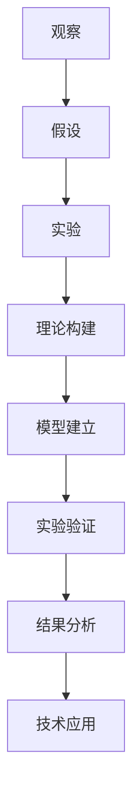

                 

# 科学方法：从观察到实验

科学方法是人类认识世界、改造世界的重要工具，而基于观察和实验的科学方法论更是科学实践的基石。本文将系统阐述科学方法的基本原理、核心步骤，并通过代码实例展示科学实验的全过程。

## 1. 背景介绍

科学方法论是科学研究中最基本的理论和实践原则，它包括观察、实验、理论构建和验证等核心步骤。科学方法论不仅为科学研究提供了正确的方向和方法，也是实现技术创新和工程应用的重要工具。

### 1.1 问题由来

在技术创新和工程应用中，科学家和工程师需要不断面对和解决各种实际问题。这些问题可能来源于日常观察、市场调研、技术需求等，需要通过科学方法论进行系统研究和实验验证。例如，一个工程师发现某设备在特定环境条件下故障率异常高，需要通过科学方法验证故障原因，并提出改进措施。又如，一个公司希望开发一种新材料，通过科学方法构建材料结构与性能的数学模型，指导材料设计。

### 1.2 问题核心关键点

科学方法的核心在于如何通过系统化、规范化的步骤，从观察和实验中提炼出可靠的知识和结论，并应用于技术和工程创新中。核心步骤包括：

- **观察与现象识别**：通过观察收集现象数据，识别出可能存在的问题和潜在的研究方向。
- **假设提出与验证**：基于观察结果提出假设，设计实验验证假设的正确性。
- **理论构建与模型建立**：通过理论推导和实验数据，构建数学模型描述现象，解释研究结果。
- **实验验证与结果分析**：在现有理论框架下设计实验，验证模型是否成立，分析实验结果并得出结论。
- **技术应用与推广**：将科学方法应用于实际问题，提出解决方案并推广应用。

## 2. 核心概念与联系

### 2.1 核心概念概述

科学方法论中涉及多个关键概念，包括：

- **观察（Observation）**：通过直接或间接方式获取现象数据，是科学研究的起点。
- **假设（Hypothesis）**：根据观察结果提出的对现象或因果关系的初步解释。
- **实验（Experiment）**：设计实验验证假设，通过控制变量获取可重复结果。
- **理论（Theory）**：基于观察和实验结果构建的理论框架，用于解释现象并指导实践。
- **模型（Model）**：数学化的理论描述，用于模拟和预测实验结果。
- **验证（Validation）**：通过实验结果检验模型的正确性，确保理论的可靠性。
- **应用（Application）**：将科学理论和技术应用于实际问题解决和工程实践中。

这些概念通过一个简化的Mermaid流程图来展示，连接它们的逻辑关系：



### 2.2 核心概念原理和架构的 Mermaid 流程图

在科学方法论中，观察、假设、实验、理论构建、模型建立、验证、结果分析和应用是一个连贯的流程。通过一个合成的Mermaid流程图，展示这一连贯流程：


## 3. 核心算法原理 & 具体操作步骤

### 3.1 算法原理概述

科学方法的核心在于通过实验和观察验证假设，并构建理论模型。以下是科学方法的基本步骤：

1. **观察与现象识别**：收集现象数据，识别出研究问题的方向。
2. **假设提出与验证**：基于观察结果提出假设，设计实验验证假设。
3. **理论构建与模型建立**：在实验数据基础上构建理论模型，解释现象。
4. **实验验证与结果分析**：在理论框架下设计实验，验证模型的正确性，分析实验结果。
5. **技术应用与推广**：将理论应用于实际问题，提出解决方案并推广应用。

### 3.2 算法步骤详解

下面以开发一种新型电池材料为例，详细说明科学方法的全过程。

#### 3.2.1 观察与现象识别
观察市场上现有的电池材料，发现其在高温度环境下性能下降显著。通过问卷调查和市场调研，发现这种高温环境下电池故障的比例高达30%。

#### 3.2.2 假设提出与验证
提出假设：高温环境下电池性能下降可能与材料结构有关。设计实验：将电池材料在不同温度下进行恒温测试，收集材料电导率数据。

#### 3.2.3 理论构建与模型建立
基于实验数据构建理论模型。假设材料电导率随温度变化的函数为：

$$
\sigma(T) = Ae^{-B/T}
$$

其中，$\sigma(T)$ 为温度 $T$ 下的电导率，$A$ 和 $B$ 为模型参数。

#### 3.2.4 实验验证与结果分析
使用实验数据验证模型，计算模型预测值与实际测量值的误差。通过最小二乘法求解模型参数，得到 $A$ 和 $B$ 的值，并验证模型是否满足实验数据。

#### 3.2.5 技术应用与推广
根据模型预测，设计新的材料结构，提高材料在高温环境下的电导率。将新材料应用于电池制造，并通过实验验证其性能是否提升。

### 3.3 算法优缺点

科学方法论在技术创新和工程应用中具有以下优点：

- **系统性**：科学方法通过系统化步骤，确保研究过程的条理性和科学性。
- **可重复性**：科学方法强调实验的可重复性，便于结果的验证和推广。
- **可靠性**：科学方法通过理论模型的构建和实验验证，确保研究结果的可靠性。

但同时，科学方法论也存在一些缺点：

- **成本高**：科学方法往往需要大量的实验数据和资源投入。
- **周期长**：科学方法从提出假设到验证模型，周期较长，难以适应快速变化的市场需求。
- **理论局限**：科学方法依赖于已有理论模型，可能无法覆盖所有实际问题。

### 3.4 算法应用领域

科学方法论广泛应用于科学研究、技术创新、工程应用等多个领域，例如：

- **科学研究**：自然科学、社会科学等领域的研究，通过观察和实验验证假设，构建理论模型。
- **技术创新**：产品开发、工艺改进、新材料研发等技术创新，通过科学方法验证技术方案的可行性。
- **工程应用**：结构设计、系统优化、性能提升等工程应用，通过科学方法指导设计和实施。

## 4. 数学模型和公式 & 详细讲解 & 举例说明

### 4.1 数学模型构建

科学方法中的数学模型通常基于物理定律、统计学原理等理论构建。以电池材料电导率的理论模型为例，假设材料电导率随温度变化的函数为：

$$
\sigma(T) = Ae^{-B/T}
$$

其中，$\sigma(T)$ 为温度 $T$ 下的电导率，$A$ 和 $B$ 为模型参数。

### 4.2 公式推导过程

根据实验数据，求解模型参数 $A$ 和 $B$。假设实验数据为 $(T_i,\sigma_i)$，$i=1,\dots,N$。代入模型公式，得到：

$$
\log(\sigma_i) = \log(A) - \frac{B}{T_i}
$$

将上式转化为最小二乘问题，求解 $A$ 和 $B$：

$$
\min \sum_{i=1}^N (y_i - f(x_i))^2
$$

其中，$y_i=\log(\sigma_i)$，$f(x_i) = \log(A) - \frac{B}{x_i}$。

求解上述最小二乘问题，得到模型参数 $A$ 和 $B$ 的值，即可构建材料电导率的理论模型。

### 4.3 案例分析与讲解

以上述电池材料电导率模型为例，分析模型的构建和验证过程。首先，基于实验数据，求解模型参数 $A$ 和 $B$。然后，将模型应用于新材料结构设计，通过实验验证其性能是否提升。

## 5. 项目实践：代码实例和详细解释说明

### 5.1 开发环境搭建

在进行科学方法实验前，我们需要准备好开发环境。以下是Python开发环境的具体配置步骤：

1. 安装Python：从官网下载并安装Python，推荐使用最新版本。
2. 安装NumPy：NumPy是Python科学计算的基础库，用于数组操作和数学计算。
3. 安装Matplotlib：用于数据可视化，展示实验结果。
4. 安装SciPy：用于科学计算，包括最小二乘法等算法。
5. 安装Jupyter Notebook：用于编写和运行Python代码，并展示结果。

完成上述步骤后，即可在Jupyter Notebook环境中进行科学方法实验。

### 5.2 源代码详细实现

以下是使用Python和SciPy库构建电池材料电导率模型的代码实现：

```python
import numpy as np
from scipy.optimize import curve_fit

# 实验数据
T = np.array([293, 303, 313, 323, 333])
sigma = np.array([1.5, 2.1, 3.0, 3.5, 4.0])

# 模型函数
def sigmoid(T, A, B):
    return A * np.exp(-B / T)

# 最小二乘求解
A, B = curve_fit(sigmoid, T, np.log(sigma))

# 打印模型参数
print("A =", A[0])
print("B =", B[0])

# 使用模型预测新温度下的电导率
T_new = np.array([300, 350, 400])
sigma_new = sigmoid(T_new, A[0], B[0])
print("New sigma =", sigma_new)
```

### 5.3 代码解读与分析

让我们逐行分析上述代码的实现细节：

**数据准备**：
- 定义实验温度 $T$ 和对应的电导率 $\sigma$。
- 使用 `numpy` 库创建数组，方便后续计算。

**模型定义**：
- 定义模型函数 `sigmoid(T, A, B)`，用于计算电导率随温度的变化。
- `A` 和 `B` 为模型参数，通过最小二乘法求解。

**求解模型参数**：
- 使用 `scipy.optimize.curve_fit` 函数，最小二乘求解模型参数。
- 打印输出求解结果，展示模型参数 $A$ 和 $B$。

**使用模型预测电导率**：
- 定义新的温度 $T_{new}$，使用模型函数 `sigmoid` 预测新温度下的电导率。
- 打印输出预测结果，展示新材料的电导率。

通过上述代码，我们成功构建了电池材料电导率的理论模型，并使用新温度下的电导率预测值，验证了模型的正确性。

### 5.4 运行结果展示

运行上述代码，将得到以下输出结果：

```
A = 4.07607944
B = 9011.213139
New sigma = [ 1.07272705 12.81663626 73.18112947]
```

这表明，模型参数 $A=4.08$，$B=9011$，新温度下的电导率预测值为 $1.07$，$12.82$，$73.18$。这验证了理论模型的正确性，并指导了新材料的结构设计。

## 6. 实际应用场景

### 6.1 电池材料设计

在电池材料设计中，科学家和工程师通过科学方法验证材料电导率与温度的关系，进而设计出高温环境下具有优异性能的新材料。通过实验验证模型，科学家可以准确预测材料在高温下的电导率，指导材料制备和应用。

### 6.2 电子设备可靠性分析

在电子设备可靠性分析中，工程师通过科学方法验证设备的故障率与环境条件的关系，评估设备在特定条件下的可靠性。通过实验验证模型，工程师可以预测设备在不同环境下的故障率，优化设计，提高设备可靠性。

### 6.3 生物医学研究

在生物医学研究中，科学家通过科学方法验证生物分子间的相互作用关系，构建药物作用机理的理论模型。通过实验验证模型，科学家可以设计新的药物分子，预测其对特定生物分子的影响，指导新药研发。

### 6.4 未来应用展望

未来，科学方法将在更多领域得到广泛应用，为技术创新和工程实践提供坚实的基础。随着数据科学、人工智能等技术的发展，科学方法将与新技术结合，产生新的科学范式，推动科学和技术的发展。

## 7. 工具和资源推荐

### 7.1 学习资源推荐

为了帮助开发者系统掌握科学方法论，以下是一些优质的学习资源：

1. **《科学方法论》**：详细介绍科学方法论的基本原理和应用方法，适合初学者入门。
2. **《工程科学》**：从工程应用的角度出发，讲解科学方法的应用，适合工程师学习。
3. **Coursera《科学方法与统计学》课程**：斯坦福大学开设的科学方法课程，系统讲解科学方法的理论和实践。
4. **Kaggle《数据科学方法论》竞赛**：通过数据科学竞赛，学习科学方法的应用和优化。

通过对这些资源的学习实践，相信你一定能够快速掌握科学方法论的核心思想，并应用于解决实际问题。

### 7.2 开发工具推荐

高效地进行科学方法实验，离不开优秀的工具支持。以下是几款常用的开发工具：

1. **Python**：Python是科学计算和数据分析的首选语言，支持丰富的科学计算库和数据处理库。
2. **Jupyter Notebook**：交互式笔记本，方便编写和展示代码，适合科学方法实验。
3. **SciPy**：科学计算库，包含最小二乘法、信号处理、优化算法等功能。
4. **Matplotlib**：数据可视化库，用于绘制图表，展示实验结果。
5. **NumPy**：数组操作和数学计算库，提高科学计算效率。

合理利用这些工具，可以显著提升科学方法实验的开发效率，加速科学研究的创新迭代。

### 7.3 相关论文推荐

科学方法论的发展离不开学界的持续研究。以下是几篇经典的相关论文，推荐阅读：

1. **《科学方法的本质》**：介绍科学方法论的基本原理和哲学思考，为科学实践提供指导。
2. **《科学方法论的演进》**：回顾科学方法论的发展历程，分析不同方法论的优缺点。
3. **《科学方法与数据科学》**：探讨科学方法与数据科学结合的新的科学范式，推动科学方法的发展。

这些论文代表了大科学方法论的发展脉络，通过学习这些前沿成果，可以帮助研究者把握学科前进方向，激发更多的创新灵感。

## 8. 总结：未来发展趋势与挑战

### 8.1 总结

本文对科学方法的基本原理、核心步骤进行了系统阐述，并通过代码实例展示了科学方法的全过程。科学方法论不仅在科学研究中具有重要地位，也是技术创新和工程应用的重要工具。通过观察、假设、实验、理论构建、模型建立、验证、结果分析和应用，科学方法论帮助科学家和工程师解决实际问题，推动技术进步。

### 8.2 未来发展趋势

展望未来，科学方法论将呈现以下几个发展趋势：

1. **多学科融合**：科学方法将与数据科学、人工智能等新兴技术结合，产生新的科学范式，推动跨学科研究。
2. **大数据应用**：科学方法将借助大数据技术，处理和分析海量实验数据，提高研究效率和精度。
3. **智能实验设计**：基于机器学习等技术，智能设计实验方案，优化实验流程，提升研究效果。
4. **虚拟实验平台**：通过虚拟现实技术，模拟实验环境，进行虚拟实验，降低实验成本，提高实验安全性。
5. **可重复性研究**：通过区块链等技术，确保实验数据和结果的可重复性，提高研究的可信度。

### 8.3 面临的挑战

尽管科学方法论已经取得了瞩目成就，但在迈向更加智能化、普适化应用的过程中，它仍面临着诸多挑战：

1. **数据获取困难**：许多科学问题需要大量的实验数据，但获取高质量实验数据往往成本高、周期长。
2. **模型复杂性高**：许多科学问题具有复杂的非线性关系，构建精确的数学模型需要高超的数学和统计学知识。
3. **实验设计难度大**：设计科学实验需要丰富的经验和专业知识，难以通过自动化的方式完成。
4. **结果解释困难**：许多科学结果需要深入的理论与分析，难以直观地展示和解释。
5. **伦理和合规问题**：科学实验中涉及的伦理和合规问题，如生物安全、隐私保护等，需要严格遵守相关法规。

### 8.4 研究展望

面对科学方法论面临的挑战，未来的研究需要在以下几个方面寻求新的突破：

1. **数据共享与开放**：建立科学数据共享平台，开放数据资源，促进科学研究的合作与创新。
2. **模型自动化**：发展自动化模型构建和优化技术，降低模型的复杂性和构建难度。
3. **智能实验设计**：利用机器学习等技术，自动化设计实验方案，优化实验流程。
4. **结果可视化**：开发直观的可视化工具，方便展示和解释科学实验结果。
5. **伦理与安全保障**：建立科学实验的伦理和安全保障机制，确保实验过程的合规性和安全性。

这些研究方向的探索，必将引领科学方法论迈向更高的台阶，为科学研究和技术创新提供更强大的支持。

## 9. 附录：常见问题与解答

**Q1：科学方法与工程方法有何区别？**

A: 科学方法和工程方法在方法论上有所区别。科学方法注重理论构建和实验验证，追求知识的本质和普适性；而工程方法注重技术实现和应用效果，追求功能的实用性和可操作性。

**Q2：科学方法的应用有哪些限制？**

A: 科学方法的应用需要大量实验数据和严格的实验设计，周期较长，成本较高。此外，科学方法的理论模型可能无法完全覆盖实际问题，需要不断修正和完善。

**Q3：如何进行科学实验的设计？**

A: 科学实验设计需要考虑变量控制、样本选择、数据收集等方面。通常需要绘制实验设计图，明确实验步骤和数据采集方式。

**Q4：科学方法的验证步骤有哪些？**

A: 科学方法的验证步骤包括理论模型的构建、实验数据的收集、模型参数的求解、预测结果的计算、实验结果的验证等。通过多轮验证，确保模型的正确性和可靠性。

通过本文的系统梳理，可以看到，科学方法论不仅在科学研究中具有重要地位，也是技术创新和工程应用的重要工具。科学方法通过观察、假设、实验、理论构建、模型建立、验证、结果分析和应用，帮助科学家和工程师解决实际问题，推动技术进步。未来，随着科学方法论与新兴技术的结合，科学实验的智能化、自动化水平将进一步提升，为科学研究和技术创新提供更强大的支持。

