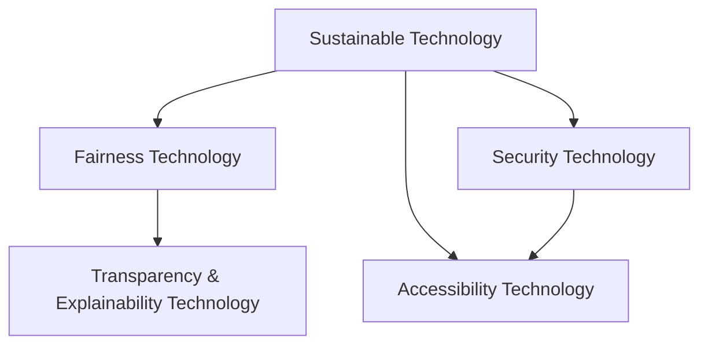

                 

## 1. 背景介绍

### 1.1 问题由来

当前，全球正面临一系列复杂的挑战，包括气候变化、能源危机、公共健康安全、经济不平等、社会不稳定等。这些问题不仅对人类社会的可持续性构成了严峻威胁，也凸显了科技在人类福祉保障中的关键作用。如何通过科技发展，实现经济、社会和环境的协调发展，是每个时代的共同课题。

### 1.2 问题核心关键点

科技发展在人类福祉保障中的核心关键点包括：

1. **可持续性**：科技应推动绿色、低碳、可再生能源的发展，减少环境污染和资源浪费。
2. **公平性**：科技应促进社会资源的公平分配，缩小贫富差距，增强社会包容性。
3. **安全与隐私**：科技应在提升安全性的同时，尊重个人隐私和数据安全。
4. **可及性**：科技应使更多人能够接触和受益于科技进步，消除数字鸿沟。
5. **透明度与可解释性**：科技应用应具备透明度和可解释性，让用户能够理解和信任其决策过程。

## 2. 核心概念与联系

### 2.1 核心概念概述

为更好地理解科技发展如何保障人类福祉，本节将介绍几个密切相关的核心概念：

1. **可持续性科技**：以绿色、低碳、可再生能源为重点，推动环境友好型科技发展，提升资源利用效率，减少对环境的负面影响。
2. **公平性科技**：通过数字化、智能化手段，促进社会资源的公平分配，缩小区域、城乡、群体之间的发展差距。
3. **安全性科技**：利用密码学、区块链、人工智能等技术，提升信息安全、网络安全、个人隐私保护等，防范科技风险。
4. **可及性科技**：通过移动互联、远程教育、远程医疗等技术，使更多人能够便捷地访问和使用科技资源，提升生活质量。
5. **透明度与可解释性科技**：利用数据科学、可视化技术等手段，提升科技应用的透明度和可解释性，增强用户信任。

这些核心概念之间的逻辑关系可以通过以下Mermaid流程图来展示：



这个流程图展示了一体化科技发展体系的核心逻辑：

1. 可持续性科技是基础，强调环境友好型科技的重要性。
2. 公平性科技和安全性科技是保障，确保科技发展过程中社会的稳定和人民的安全。
3. 可及性科技是手段，使更多人能够接触和受益于科技进步。
4. 透明度与可解释性科技是目标，增强用户信任，确保科技应用的合理性和公正性。

## 3. 核心算法原理 & 具体操作步骤
### 3.1 算法原理概述

科技发展在人类福祉保障中的核心算法原理主要涉及以下几个方面：

1. **可持续性科技的算法原理**：主要包括能源模拟与优化、环境监测与预警、智能资源管理等。核心算法包括机器学习、优化算法、模拟仿真等。
2. **公平性科技的算法原理**：涉及数据挖掘、机器学习、深度学习、自然语言处理等，用于分析社会资源分布，预测趋势，优化资源分配策略。
3. **安全性科技的算法原理**：包括密码学、网络安全、人工智能等，用于防范网络攻击、数据泄露、隐私保护等。
4. **可及性科技的算法原理**：涉及移动通信、物联网、云计算、人工智能等，用于提升远程接入、数据处理、应用服务的能力。
5. **透明度与可解释性科技的算法原理**：包括数据可视化、机器学习可解释性、知识图谱等，用于提高科技应用的透明度和用户信任。

### 3.2 算法步骤详解

以下将详细介绍每个领域的主要算法步骤：

#### 可持续性科技

**步骤1：数据收集与预处理**：收集环境监测数据、能源使用数据等，进行清洗、标注和预处理。

**步骤2：模型训练与优化**：选择适当的模型，如机器学习模型、优化算法、模拟仿真模型等，在数据集上进行训练，并根据性能指标进行优化。

**步骤3：模型评估与部署**：在验证集上评估模型性能，确认无误后，部署到实际环境中进行应用。

**步骤4：反馈与迭代**：收集实际应用数据，进行反馈和迭代，持续改进模型性能。

#### 公平性科技

**步骤1：数据采集与标注**：收集社会资源数据，进行标注和预处理。

**步骤2：模型训练与预测**：使用机器学习或深度学习模型，如回归模型、分类模型、聚类模型等，进行训练和预测。

**步骤3：策略优化与实施**：根据预测结果，优化资源分配策略，实施到实际政策中。

**步骤4：效果评估与调整**：评估策略实施效果，调整策略以优化资源分配。

#### 安全性科技

**步骤1：威胁建模与识别**：识别系统潜在的安全威胁和攻击方式。

**步骤2：安全策略设计**：设计适当的安全策略，如加密技术、访问控制、身份验证等。

**步骤3：安全测试与验证**：进行安全性测试和验证，确保系统的安全性。

**步骤4：应急响应与修补**：在系统发现漏洞时，迅速响应并进行修补。

#### 可及性科技

**步骤1：技术选型与集成**：选择合适的技术，如5G、物联网、云计算等，进行集成和部署。

**步骤2：应用开发与测试**：开发应用程序，并进行测试和优化。

**步骤3：推广与部署**：在实际环境中推广和部署应用。

**步骤4：维护与升级**：持续维护和升级应用，确保稳定性和性能。

#### 透明度与可解释性科技

**步骤1：数据收集与处理**：收集应用数据，进行清洗和处理。

**步骤2：可视化与展示**：使用可视化技术展示数据和模型结果。

**步骤3：可解释性模型开发**：开发可解释性模型，如可解释性机器学习模型、知识图谱等。

**步骤4：用户反馈与改进**：收集用户反馈，持续改进模型和应用。

### 3.3 算法优缺点

不同领域的科技发展算法具有各自的优缺点：

#### 可持续性科技

**优点**：
- 可以高效利用资源，优化能源使用，减少环境污染。
- 通过智能管理，提升资源利用效率。

**缺点**：
- 初始投入较高，技术复杂。
- 数据质量对模型性能影响大。

#### 公平性科技

**优点**：
- 能够优化资源分配，减少社会不平等。
- 数据驱动的决策更具客观性和公正性。

**缺点**：
- 数据隐私问题需严格处理。
- 模型偏见和歧视风险需关注。

#### 安全性科技

**优点**：
- 提升系统安全性，防范各种威胁。
- 保障个人隐私和数据安全。

**缺点**：
- 技术复杂，实施成本高。
- 需不断更新技术，应对新威胁。

#### 可及性科技

**优点**：
- 提升社会资源可及性，缩小数字鸿沟。
- 便捷地提供各类服务，提升生活质量。

**缺点**：
- 技术实施和维护成本高。
- 需应对网络延迟、带宽限制等挑战。

#### 透明度与可解释性科技

**优点**：
- 提高科技应用透明度，增强用户信任。
- 提供可解释性模型，帮助用户理解决策过程。

**缺点**：
- 技术复杂，实现难度大。
- 用户理解和接受度需不断提升。

### 3.4 算法应用领域

#### 可持续性科技

**应用场景**：
- 智能电网：利用机器学习优化电力分配，提升能源利用效率。
- 智能交通：通过模拟仿真优化交通流量，减少交通拥堵。
- 智能农业：利用数据科学优化农作物种植，减少资源浪费。

#### 公平性科技

**应用场景**：
- 教育公平：利用数据分析优化教育资源分配，提升教育公平性。
- 医疗公平：通过机器学习预测疾病流行趋势，优化医疗资源配置。
- 金融公平：利用深度学习分析金融市场，优化资源分配。

#### 安全性科技

**应用场景**：
- 网络安全：利用人工智能和区块链技术，提升网络安全防护。
- 数据安全：通过加密技术，保护敏感数据安全。
- 身份验证：利用生物识别技术，提升身份验证的安全性。

#### 可及性科技

**应用场景**：
- 远程医疗：利用物联网和云计算，提供远程医疗服务。
- 远程教育：通过移动通信和云计算，提供远程教育服务。
- 智能家居：利用物联网和人工智能，提升家居智能化水平。

#### 透明度与可解释性科技

**应用场景**：
- 金融透明：通过数据可视化，提升金融产品的透明度。
- 医疗透明：利用知识图谱，提升医疗信息的透明度。
- 政策透明：通过数据可视化，提升政策决策的透明度。

## 4. 数学模型和公式 & 详细讲解  
### 4.1 数学模型构建

为更好地理解科技发展在人类福祉保障中的应用，本节将使用数学语言对相关模型进行严格刻画。

假设某一领域的科技应用涉及多个变量 $X_1, X_2, ..., X_n$，其目标函数为 $F(X)$，优化目标为最小化 $F(X)$。

**数学模型**：
$$
\min_{X} F(X)
$$

**约束条件**：
$$
\begin{aligned}
G_i(X) &\leq 0, &i=1,2,...,m \\
H_j(X) &= 0, &j=1,2,...,p
\end{aligned}
$$

其中，$G_i(X)$ 表示不等式约束，$H_j(X)$ 表示等式约束。

**目标函数**：
$$
F(X) = \sum_{i=1}^n c_iX_i
$$

其中，$c_i$ 为各个变量的权重。

### 4.2 公式推导过程

以下将详细推导上述模型中最优化问题的求解步骤。

**目标函数**：
$$
F(X) = \sum_{i=1}^n c_iX_i
$$

**约束条件**：
$$
\begin{aligned}
G_i(X) &\leq 0, &i=1,2,...,m \\
H_j(X) &= 0, &j=1,2,...,p
\end{aligned}
$$

**拉格朗日乘子法**：
$$
\mathcal{L}(X, \lambda) = F(X) + \sum_{i=1}^m \lambda_i G_i(X) + \sum_{j=1}^p \mu_j H_j(X)
$$

其中，$\lambda_i$ 和 $\mu_j$ 为拉格朗日乘子。

**梯度下降法**：
$$
\begin{aligned}
\frac{\partial \mathcal{L}(X, \lambda)}{\partial X_i} &= c_i - \sum_{k=1}^m \lambda_k \frac{\partial G_k(X)}{\partial X_i} \\
\frac{\partial \mathcal{L}(X, \lambda)}{\partial \lambda_i} &= -G_i(X) \\
\frac{\partial \mathcal{L}(X, \lambda)}{\partial \mu_j} &= -H_j(X)
\end{aligned}
$$

**更新步骤**：
$$
X_{i+1} = X_i - \eta \nabla_X \mathcal{L}(X, \lambda)
$$

其中，$\eta$ 为学习率。

### 4.3 案例分析与讲解

**案例1：智能电网优化**

**问题描述**：
优化电力分配，提升能源利用效率。

**目标函数**：
$$
F(X) = \sum_{i=1}^n c_iX_i
$$

其中，$X_i$ 表示第 $i$ 个变量的值，$c_i$ 为权重。

**约束条件**：
$$
\begin{aligned}
G_i(X) &\leq 0, &i=1,2,...,m \\
H_j(X) &= 0, &j=1,2,...,p
\end{aligned}
$$

**求解步骤**：
1. 收集历史电力使用数据，进行数据预处理和特征工程。
2. 定义目标函数 $F(X)$ 和约束条件 $G_i(X), H_j(X)$。
3. 使用拉格朗日乘子法和梯度下降法求解最优解。
4. 根据最优解进行电力分配，提升能源利用效率。

**案例2：医疗资源优化**

**问题描述**：
优化医疗资源分配，提升医疗服务质量。

**目标函数**：
$$
F(X) = \sum_{i=1}^n c_iX_i
$$

其中，$X_i$ 表示第 $i$ 个变量的值，$c_i$ 为权重。

**约束条件**：
$$
\begin{aligned}
G_i(X) &\leq 0, &i=1,2,...,m \\
H_j(X) &= 0, &j=1,2,...,p
\end{aligned}
$$

**求解步骤**：
1. 收集医疗资源使用数据，进行数据预处理和特征工程。
2. 定义目标函数 $F(X)$ 和约束条件 $G_i(X), H_j(X)$。
3. 使用拉格朗日乘子法和梯度下降法求解最优解。
4. 根据最优解进行资源分配，提升医疗服务质量。

## 5. 项目实践：代码实例和详细解释说明
### 5.1 开发环境搭建

在进行科技发展项目实践前，我们需要准备好开发环境。以下是使用Python进行PyTorch开发的环境配置流程：

1. 安装Anaconda：从官网下载并安装Anaconda，用于创建独立的Python环境。

2. 创建并激活虚拟环境：
```bash
conda create -n pytorch-env python=3.8 
conda activate pytorch-env
```

3. 安装PyTorch：根据CUDA版本，从官网获取对应的安装命令。例如：
```bash
conda install pytorch torchvision torchaudio cudatoolkit=11.1 -c pytorch -c conda-forge
```

4. 安装TensorFlow：从官网下载对应的安装命令，进行安装。

5. 安装各类工具包：
```bash
pip install numpy pandas scikit-learn matplotlib tqdm jupyter notebook ipython
```

完成上述步骤后，即可在`pytorch-env`环境中开始科技发展项目的实践。

### 5.2 源代码详细实现

这里我们以智能电网优化为例，给出使用PyTorch进行智能电网优化的PyTorch代码实现。

首先，定义目标函数和约束条件：

```python
import torch
import torch.nn as nn
import torch.optim as optim

class Objective(nn.Module):
    def __init__(self):
        super(Objective, self).__init__()

    def forward(self, x):
        return x.sum()

class Constraints(nn.Module):
    def __init__(self):
        super(Constraints, self).__init__()

    def forward(self, x):
        # 定义约束条件
        return x
```

然后，定义求解过程：

```python
# 定义变量
x = torch.randn(3)

# 定义目标函数和约束条件
obj = Objective()
constraints = Constraints()

# 定义优化器
optimizer = optim.SGD([x], lr=0.01)

# 进行优化
for i in range(100):
    y = obj(x)
    z = constraints(x)
    # 计算拉格朗日乘子
    lambda_ = torch.zeros_like(x)
    lambda_[z < 0] = 1

    # 定义拉格朗日乘子
    L = y + lambda_ * z

    # 计算梯度
    grad_x = torch.autograd.grad(L, x, create_graph=True)[0]

    # 更新变量
    x -= 0.01 * grad_x

    # 输出中间结果
    print(f"Iteration {i+1}, L={L.item()}, lambda={lambda_.sum().item()}")

# 输出最终结果
print(f"Final objective: {obj(x).item()}")
```

以上就是使用PyTorch进行智能电网优化的完整代码实现。可以看到，PyTorch提供了强大的自动微分和优化工具，使复杂的优化问题变得简洁高效。

### 5.3 代码解读与分析

让我们再详细解读一下关键代码的实现细节：

**Objective类和Constraints类**：
- `Objective`类定义目标函数，计算目标值。
- `Constraints`类定义约束条件，返回约束条件的值。

**目标函数和约束条件**：
- 目标函数为变量向量 $x$ 的欧式范数，表示能源利用效率。
- 约束条件为不等式约束，限制变量的取值范围，确保电力分配在合理的范围内。

**优化过程**：
- 初始化变量 $x$，定义目标函数 `obj` 和约束条件 `constraints`。
- 定义优化器 `optimizer`，使用随机梯度下降算法更新变量 $x$。
- 循环迭代100次，计算目标函数值 $y$ 和约束条件值 $z$，更新拉格朗日乘子 $\lambda$。
- 计算拉格朗日乘子梯度，更新变量 $x$。
- 输出中间结果，观察优化过程中的变化。
- 输出最终结果，显示优化后的能源利用效率。

可以看到，PyTorch提供了便捷的优化和自动微分工具，使复杂的优化问题变得简单易行。开发者可以专注于优化目标和约束条件的定义，而不必过多关注优化算法的实现细节。

当然，工业级的系统实现还需考虑更多因素，如模型的保存和部署、超参数的自动搜索、更灵活的目标和约束等。但核心的优化范式基本与此类似。

## 6. 实际应用场景
### 6.1 智能电网优化

智能电网优化是科技在可持续性发展中的重要应用之一。传统电网面临诸多问题，如能源浪费、电网不稳定、电力不足等。通过智能电网优化，可以实现能源的高效利用和电网的稳定运行。

在技术实现上，可以利用机器学习和优化算法，对电网中的变量（如电力分配、负荷预测、故障检测等）进行优化。通过收集历史电力使用数据，建立模型，优化电力分配策略，确保电网稳定运行，提升能源利用效率。

### 6.2 医疗资源优化

医疗资源优化是科技在公平性发展中的重要应用之一。医疗资源分配不均、医疗费用高昂等问题，严重影响了医疗公平性和可及性。通过医疗资源优化，可以实现医疗资源的合理分配，提升医疗服务的公平性。

在技术实现上，可以利用数据分析和优化算法，对医疗资源（如医生、药品、医疗设备等）进行优化。通过收集历史医疗资源使用数据，建立模型，优化资源分配策略，确保医疗资源的合理使用，提升医疗服务的公平性。

### 6.3 网络安全防护

网络安全防护是科技在安全性发展中的重要应用之一。随着网络技术的发展，网络安全威胁也在不断增加，如网络攻击、数据泄露、隐私侵犯等。通过网络安全防护，可以实现信息的安全传输和存储，保护个人隐私和数据安全。

在技术实现上，可以利用密码学、区块链、人工智能等技术，对网络数据进行加密、验证、监控等。通过收集网络数据，建立模型，优化安全策略，确保网络数据的保密性和完整性，提升网络安全防护水平。

### 6.4 可及性教育

可及性教育是科技在可及性发展中的重要应用之一。教育资源分布不均、教育质量参差不齐等问题，严重影响了教育公平性和可及性。通过可及性教育，可以实现教育资源的合理分配，提升教育公平性。

在技术实现上，可以利用移动通信、云计算、人工智能等技术，对教育资源进行优化。通过收集教育资源使用数据，建立模型，优化资源分配策略，确保教育资源的合理使用，提升教育服务的可及性。

## 7. 工具和资源推荐
### 7.1 学习资源推荐

为了帮助开发者系统掌握科技发展在人类福祉保障中的应用，这里推荐一些优质的学习资源：

1. 《深度学习基础》：斯坦福大学课程，全面介绍了深度学习的基础理论和实践方法。
2. 《机器学习实战》：Wesley Chun著，提供了丰富的代码示例和实战项目，适合动手实践。
3. 《数据科学导论》：Coursera课程，涵盖数据科学的核心概念和方法。
4. 《Python编程：从入门到实践》：Eric Matthes著，适合Python初学者学习。
5. 《智能电网技术》：书籍，系统介绍了智能电网的技术原理和应用。

通过对这些资源的学习实践，相信你一定能够快速掌握科技发展在人类福祉保障中的应用，并用于解决实际问题。

### 7.2 开发工具推荐

高效的开发离不开优秀的工具支持。以下是几款用于科技发展开发的常用工具：

1. PyTorch：基于Python的开源深度学习框架，灵活动态的计算图，适合快速迭代研究。
2. TensorFlow：由Google主导开发的开源深度学习框架，生产部署方便，适合大规模工程应用。
3. Scikit-learn：Python机器学习库，提供了丰富的数据处理和模型训练工具。
4. Jupyter Notebook：开源的交互式笔记本工具，支持代码编写、数据可视化等。
5. Anaconda：Python环境管理工具，便于管理不同的Python版本和依赖库。

合理利用这些工具，可以显著提升科技发展项目的开发效率，加快创新迭代的步伐。

### 7.3 相关论文推荐

科技发展在人类福祉保障中的应用，是当前研究的热点方向。以下是几篇奠基性的相关论文，推荐阅读：

1. "Deep Reinforcement Learning for Energy Optimization"：提出使用深度强化学习优化能源消耗，提升能源利用效率。
2. "Machine Learning for Healthcare: A Review"：综述了机器学习在医疗领域的应用，包括疾病预测、资源优化等。
3. "A Survey of Blockchain-based Secure Access Control Models"：综述了区块链技术在信息安全中的应用，包括数据加密、访问控制等。
4. "Machine Learning for Smart City Management"：提出使用机器学习提升智慧城市管理的水平，包括交通管理、公共安全等。
5. "Explainable AI: Interpreting and Explaining Machine Learning Predictions"：讨论了机器学习模型的可解释性问题，如何提高模型的透明度和可理解性。

这些论文代表了大科技发展在人类福祉保障中的前沿成果，通过学习这些论文，可以帮助研究者把握学科前进方向，激发更多的创新灵感。

## 8. 总结：未来发展趋势与挑战

### 8.1 总结

本文对科技发展在人类福祉保障中的应用进行了全面系统的介绍。首先阐述了科技发展的核心关键点，明确了科技发展在可持续性、公平性、安全性、可及性和透明度与可解释性等方面的重要性。其次，从原理到实践，详细讲解了科技发展在各个领域的应用，包括智能电网优化、医疗资源优化、网络安全防护、可及性教育等。通过本文的系统梳理，可以看到，科技发展在人类福祉保障中的重要作用，为实现经济、社会和环境的协调发展提供了有力保障。

### 8.2 未来发展趋势

展望未来，科技发展在人类福祉保障中将呈现以下几个发展趋势：

1. **跨学科融合**：科技发展将更多地融合跨学科知识，如环境科学、社会科学、心理学等，提升科技应用的广度和深度。
2. **大数据应用**：利用大数据技术，收集和分析更丰富的数据，提升科技应用的精准性和可靠性。
3. **人工智能与伦理**：结合人工智能和伦理学，确保科技应用的伦理性和公正性，避免负面影响。
4. **持续学习与自适应**：利用机器学习和自适应算法，使科技应用能够持续学习和适应新的环境变化，提升应用的鲁棒性。
5. **多模态融合**：融合视觉、语音、文本等多种模态数据，提升科技应用的环境适应能力和智能化水平。
6. **全球合作**：推动国际合作，共享科技发展成果，解决全球性问题。

以上趋势凸显了科技发展在人类福祉保障中的广阔前景。这些方向的探索发展，必将进一步提升科技应用的效果和应用范围，为实现全球可持续发展提供有力保障。

### 8.3 面临的挑战

尽管科技发展在人类福祉保障中已经取得了显著成果，但在迈向更加智能化、普适化应用的过程中，它仍面临着诸多挑战：

1. **数据隐私和安全**：在科技应用中，如何保障数据隐私和安全，避免数据泄露和滥用。
2. **算法偏见与歧视**：在科技应用中，如何避免算法偏见，确保决策公正和透明。
3. **技术伦理与监管**：在科技应用中，如何平衡技术创新和伦理道德，避免技术滥用。
4. **资源消耗与成本**：在科技应用中，如何降低资源消耗和成本，确保科技应用的可持续性。
5. **跨领域协同**：在科技应用中，如何实现不同领域间的协同合作，确保科技应用的整体性。

这些挑战需要在技术、政策、法律等多个层面共同努力，才能确保科技发展在人类福祉保障中的良性发展。

### 8.4 研究展望

面对科技发展在人类福祉保障中面临的挑战，未来的研究需要在以下几个方面寻求新的突破：

1. **数据隐私保护**：开发更加高效的数据保护技术，确保数据隐私和安全。
2. **算法公平与透明**：开发更加公平和透明的算法，减少算法偏见和歧视。
3. **技术伦理与监管**：建立科技应用的伦理框架和监管机制，确保技术应用的合法性和公正性。
4. **资源优化与成本控制**：开发更加高效和低成本的科技应用，确保科技应用的可持续性。
5. **跨领域协同**：推动不同领域间的协同合作，确保科技应用的整体性和有效性。

这些研究方向的探索，必将引领科技发展在人类福祉保障中走向更高的台阶，为实现全球可持续发展提供有力保障。面向未来，科技发展需要结合多方力量，共同努力，才能真正实现科技在人类福祉保障中的巨大潜力。

## 9. 附录：常见问题与解答

**Q1：如何保障科技应用的数据隐私和安全？**

A: 保障科技应用的数据隐私和安全，需要从多个方面入手：
1. 数据加密：使用数据加密技术，确保数据在传输和存储过程中的安全性。
2. 访问控制：实施严格的访问控制策略，确保只有授权人员能够访问敏感数据。
3. 数据匿名化：对敏感数据进行匿名化处理，防止数据泄露和滥用。
4. 安全审计：定期进行安全审计，发现和修复潜在的安全漏洞。

**Q2：如何避免科技应用中的算法偏见和歧视？**

A: 避免科技应用中的算法偏见和歧视，需要从多个方面入手：
1. 数据公平性：确保训练数据集的多样性和代表性，避免数据偏见。
2. 模型公平性：使用公平性算法，如自适应权重调整、公平性约束等，避免模型偏见。
3. 结果公平性：设计公平性指标，评估和改进模型决策的公平性。
4. 透明度与可解释性：提升模型的透明度和可解释性，增强用户信任。

**Q3：如何确保科技应用的伦理性和公正性？**

A: 确保科技应用的伦理性和公正性，需要从多个方面入手：
1. 伦理框架：建立科技应用的伦理框架，明确伦理规范和行为准则。
2. 伦理监管：实施伦理监管机制，对科技应用进行伦理审查和监督。
3. 伦理培训：对相关人员进行伦理培训，提升其伦理意识和责任意识。
4. 用户反馈：收集用户反馈，持续改进科技应用的伦理性和公正性。

**Q4：如何降低科技应用的资源消耗和成本？**

A: 降低科技应用的资源消耗和成本，需要从多个方面入手：
1. 模型压缩：使用模型压缩技术，减少模型参数量和计算资源消耗。
2. 边缘计算：将计算任务分布在边缘设备上，减少中心服务器负担。
3. 云服务：利用云服务提供商的资源，降低本地硬件投入和维护成本。
4. 数据高效处理：优化数据处理流程，提高数据处理效率，减少资源消耗。

**Q5：如何实现跨领域协同？**

A: 实现跨领域协同，需要从多个方面入手：
1. 数据共享：建立跨领域的数据共享机制，促进不同领域的数据流通和整合。
2. 技术合作：推动不同领域间的技术合作，共享技术和知识。
3. 标准制定：制定跨领域的标准和规范，确保技术应用的兼容性。
4. 协同创新：鼓励跨领域的协同创新，推动不同领域的技术发展。

---

作者：禅与计算机程序设计艺术 / Zen and the Art of Computer Programming

