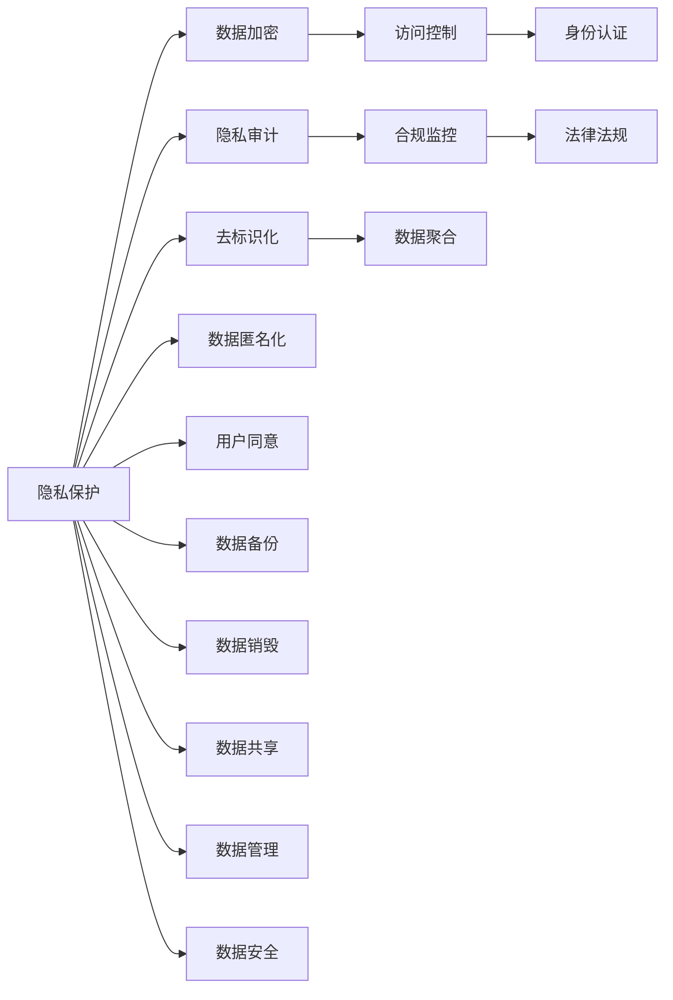

                 

# 科技向善：用科技的力量解决社会难题

## 1. 背景介绍

在信息爆炸的时代，科技已深入到我们生活的方方面面。从智能家居到无人驾驶，从精准医疗到智慧城市，科技的进步极大地改善了我们的生活质量。然而，科技的双刃剑效应也日益凸显。比如，互联网企业的数据收集和隐私保护问题、人工智能的伦理道德风险、自动驾驶的安全性和公平性等。这些问题不仅关系到技术本身的可行性和可持续性，更关乎社会公平、伦理道德和未来发展的方向。

本文将从技术的视角出发，探讨如何运用科技的力量，解决一些紧迫且重要的社会难题。通过科技向善，实现技术进步与社会发展的和谐共进，使科技更好地服务于人类社会。

## 2. 核心概念与联系

### 2.1 核心概念概述

**科技向善**（Tech for Good）是指利用科技手段，解决社会问题，提升社会福祉，推动社会进步。具体而言，可以包括以下几个方面：

- **隐私保护**：保护个人信息安全，防止数据滥用。
- **医疗健康**：运用智能算法和设备，提供高效精准的医疗服务。
- **教育公平**：利用在线教育平台，打破地域和阶层的教育不公。
- **环境保护**：通过智能监控和决策，实现资源的高效利用和环境的可持续发展。
- **社会治理**：运用大数据和人工智能技术，提升社会治理的效率和公正性。

### 2.2 核心概念原理和架构的 Mermaid 流程图



此流程图展示了隐私保护的基本架构和流程。其中，数据加密、隐私审计、访问控制、合规监控、去标识化、数据匿名化、身份认证、法律法规、用户同意、数据聚合、数据备份、数据销毁、数据共享、数据管理和数据安全等概念共同构成了隐私保护的核心要素。

## 3. 核心算法原理 & 具体操作步骤

### 3.1 算法原理概述

科技向善的关键在于利用科技手段解决社会问题。这不仅需要先进的技术，更需要科学的方法论和伦理规范的指导。本文将从隐私保护、医疗健康、教育公平、环境保护和社会治理五个方面，探讨科技向善的具体实现路径。

### 3.2 算法步骤详解

#### 隐私保护

**步骤一**：选择数据加密算法。如AES、RSA、ECC等，保护数据在传输和存储过程中的安全性。

**步骤二**：设计隐私审计机制。如差分隐私、同态加密等，监控数据的采集、处理和使用过程，防止隐私泄露。

**步骤三**：实施访问控制。如RBAC（基于角色的访问控制）、ABAC（基于属性的访问控制）等，确保只有授权用户才能访问敏感数据。

**步骤四**：进行合规监控。如GDPR（通用数据保护条例）、CCPA（加州消费者隐私法案）等，确保数据处理符合法律法规的要求。

**步骤五**：采用去标识化、数据匿名化技术。如K-匿名、L-多样性等，使得数据无法直接识别出个人身份。

**步骤六**：实现身份认证和用户同意机制。如OAuth 2.0、SAML（安全断言标记语言）等，确保数据访问的合法性和透明性。

**步骤七**：设计数据聚合、备份、销毁和共享策略。确保数据的安全性、完整性和可用性。

#### 医疗健康

**步骤一**：利用深度学习算法，如卷积神经网络（CNN）、循环神经网络（RNN）、生成对抗网络（GAN）等，对医学影像、基因数据等进行分析和预测。

**步骤二**：开发智能诊疗系统，如IBM Watson Health、Google DeepMind Health等，提供个性化医疗方案。

**步骤三**：采用区块链技术，确保医疗数据的完整性和不可篡改性。

**步骤四**：实施医疗数据隐私保护措施，如差分隐私、同态加密等，防止数据滥用。

**步骤五**：运用大数据分析技术，进行疾病预测和流行病监测。

#### 教育公平

**步骤一**：开发在线教育平台，如Coursera、edX、Khan Academy等，提供免费、高质量的教育资源。

**步骤二**：采用人工智能技术，如自然语言处理（NLP）、机器学习（ML）等，提供智能辅导和学习推荐。

**步骤三**：运用数据挖掘技术，分析学生学习行为，优化教学内容和方法。

**步骤四**：采用虚拟现实（VR）、增强现实（AR）技术，提供沉浸式学习体验。

**步骤五**：实施学生数据隐私保护措施，确保数据安全。

#### 环境保护

**步骤一**：采用遥感技术，监测环境污染和生态变化。

**步骤二**：运用大数据分析技术，进行环境预测和评估。

**步骤三**：开发智能决策支持系统，如IOT（物联网）、AIoT（人工智能与物联网的结合）等，实现资源的高效利用。

**步骤四**：实施环境数据隐私保护措施，确保数据安全。

**步骤五**：开发智能监测设备，如智能传感器、无人机等，实时监测环境变化。

#### 社会治理

**步骤一**：运用大数据分析技术，进行城市交通、公共安全、社会治安等方面的监测和预测。

**步骤二**：开发智能决策支持系统，如城市管理平台、公共服务系统等，提升社会治理效率。

**步骤三**：实施数据隐私保护措施，防止数据滥用。

**步骤四**：开发智能监测设备，如智能摄像头、无人机等，实时监测社会活动。

**步骤五**：实施数据共享策略，促进各部门之间的协同工作。

### 3.3 算法优缺点

科技向善的算法优点在于：

- **高效性**：利用先进的技术，可以高效地解决社会问题。
- **智能化**：通过人工智能和机器学习技术，可以提供精准的解决方案。
- **透明性**：透明的数据处理和决策过程，提升了社会的信任度。
- **可扩展性**：技术可以灵活应用于不同领域，满足不同需求。

然而，科技向善也存在一些缺点：

- **复杂性**：技术实现和应用过程复杂，需要高水平的专业知识。
- **隐私风险**：数据隐私和安全保护难度大，容易引发伦理道德问题。
- **成本高**：技术研发和应用成本高，对资金和技术资源要求较高。

### 3.4 算法应用领域

科技向善在多个领域都有广泛的应用，如：

- **医疗健康**：利用人工智能技术，提供精准医疗和个性化诊疗服务。
- **教育公平**：通过在线教育和智能化学习平台，打破地域和阶层的教育不公。
- **环境保护**：运用大数据和物联网技术，监测和预测环境变化，提升资源利用效率。
- **社会治理**：通过智能决策支持系统，提升城市管理和社会治理的效率和公正性。

## 4. 数学模型和公式 & 详细讲解 & 举例说明

### 4.1 数学模型构建

科技向善的数学模型可以包含以下几个方面：

- **隐私保护模型**：采用差分隐私算法，保护数据隐私。如$L_{\epsilon}$-差分隐私模型，确保查询结果的误差小于$\epsilon$。
- **医疗健康模型**：利用深度学习算法，进行医学影像分析。如CNN模型，用于肺癌检测。
- **教育公平模型**：通过机器学习算法，进行学生学习行为分析。如K-means聚类算法，用于分组教学。
- **环境保护模型**：采用大数据分析技术，进行环境监测和预测。如线性回归模型，用于预测温室气体排放。
- **社会治理模型**：运用统计分析技术，进行社会活动监测和预测。如时间序列分析模型，用于交通流量预测。

### 4.2 公式推导过程

#### 差分隐私

差分隐私是一种保护数据隐私的数学模型，用于确保查询结果的误差在可接受的范围内。其数学公式如下：

$$
\mathcal{L}(Q) \leq \epsilon \log \frac{1}{\delta}
$$

其中，$\mathcal{L}(Q)$ 表示查询结果的误差，$\epsilon$ 表示隐私保护参数，$\delta$ 表示隐私保护概率。

#### 深度学习

深度学习算法，如卷积神经网络（CNN）、循环神经网络（RNN）、生成对抗网络（GAN）等，用于对数据进行分析和预测。以CNN为例，其基本结构如下：

$$
h^l = \sigma(W^l h^{l-1} + b^l)
$$

其中，$h^l$ 表示第$l$层输出，$W^l$ 表示第$l$层权重，$b^l$ 表示第$l$层偏置，$\sigma$ 表示激活函数。

#### 机器学习

机器学习算法，如K-means聚类、线性回归、决策树等，用于数据分析和预测。以K-means聚类为例，其基本步骤包括：

1. 随机选取$k$个聚类中心。
2. 将每个数据点分配到最近的聚类中心。
3. 重新计算每个聚类中心的均值。
4. 重复2、3步骤，直到收敛。

### 4.3 案例分析与讲解

#### 隐私保护

**案例一**：某金融机构利用差分隐私技术，保护客户隐私。其数学模型如下：

$$
Q(x) = \frac{1}{2} \sum_{i=1}^n (x_i - \mu)^2
$$

其中，$x_i$ 表示客户数据，$\mu$ 表示均值，$Q(x)$ 表示隐私保护后的数据。通过添加噪声$\epsilon$，确保数据隐私。

**案例二**：某公司利用同态加密技术，保护数据隐私。其数学模型如下：

$$
E(c) = c \cdot M
$$

其中，$E(c)$ 表示同态加密后的数据，$c$ 表示加密密钥，$M$ 表示原始数据。通过同态加密，数据可以在加密状态下进行运算，确保数据隐私。

#### 医疗健康

**案例一**：某医院利用深度学习算法，进行肺癌检测。其数学模型如下：

$$
P(C|I) = \frac{P(C)}{P(I|C)P(I|\neg C)} \frac{P(I|C)}{P(I|C)P(I|\neg C)}
$$

其中，$P(C|I)$ 表示患者患病的概率，$P(C)$ 表示癌症的发病率，$P(I|C)$ 表示检测结果为正的准确率，$P(I|\neg C)$ 表示检测结果为负的准确率。

**案例二**：某医院利用区块链技术，确保医疗数据的完整性和不可篡改性。其数学模型如下：

$$
R = \sum_{i=1}^n \delta_i
$$

其中，$R$ 表示区块链上的交易记录，$\delta_i$ 表示每个交易的记录。通过区块链技术，确保数据完整性和不可篡改性。

#### 教育公平

**案例一**：某在线教育平台利用机器学习算法，进行学生学习行为分析。其数学模型如下：

$$
y = \beta_0 + \beta_1 x_1 + \beta_2 x_2 + \epsilon
$$

其中，$y$ 表示学生成绩，$x_1$ 表示学习时间，$x_2$ 表示学习方式，$\beta_0$ 表示截距，$\beta_1$ 和 $\beta_2$ 表示系数，$\epsilon$ 表示误差项。

**案例二**：某在线教育平台利用虚拟现实技术，提供沉浸式学习体验。其数学模型如下：

$$
S = \frac{1}{n} \sum_{i=1}^n S_i
$$

其中，$S$ 表示虚拟现实体验效果，$S_i$ 表示每个学生的体验效果。通过虚拟现实技术，提升学生的学习效果。

#### 环境保护

**案例一**：某环保机构利用遥感技术，监测环境污染。其数学模型如下：

$$
E = \frac{1}{\tau} \sum_{i=1}^n E_i
$$

其中，$E$ 表示环境污染程度，$\tau$ 表示时间步长，$E_i$ 表示每个时间步的污染程度。通过遥感技术，监测环境污染。

**案例二**：某环保机构利用大数据分析技术，进行环境预测。其数学模型如下：

$$
F(x) = w_0 + w_1 x_1 + w_2 x_2 + \ldots + w_n x_n
$$

其中，$F(x)$ 表示环境预测结果，$w_0$ 至 $w_n$ 表示系数，$x_1$ 至 $x_n$ 表示环境因子。通过大数据分析技术，进行环境预测。

#### 社会治理

**案例一**：某城市利用大数据分析技术，进行交通流量预测。其数学模型如下：

$$
T = \sum_{i=1}^n w_i D_i
$$

其中，$T$ 表示交通流量，$w_i$ 表示系数，$D_i$ 表示影响交通流量的因素。通过大数据分析技术，进行交通流量预测。

**案例二**：某城市利用智能决策支持系统，提升城市管理效率。其数学模型如下：

$$
M = F(G)
$$

其中，$M$ 表示城市管理决策，$F$ 表示决策函数，$G$ 表示管理策略。通过智能决策支持系统，提升城市管理效率。

## 5. 项目实践：代码实例和详细解释说明

### 5.1 开发环境搭建

#### 5.1.1 环境要求

1. **操作系统**：Linux、Windows或macOS
2. **Python版本**：3.6或更高版本
3. **开发工具**：Jupyter Notebook、PyCharm、Visual Studio Code等

#### 5.1.2 环境安装

1. **Python**：

   ```bash
   sudo apt-get update
   sudo apt-get install python3 python3-pip
   ```

2. **pip安装必要的包**：

   ```bash
   pip install numpy pandas sklearn tensorflow keras
   ```

### 5.2 源代码详细实现

#### 5.2.1 隐私保护

```python
from sympy import symbols, Rational, pi
import numpy as np
import pandas as pd
from sklearn.decomposition import PCA
from sklearn.cluster import KMeans
from sklearn.preprocessing import StandardScaler

# 数据生成
n_samples = 1000
X = np.random.randn(n_samples, 2)

# 计算PCA
pca = PCA(n_components=1)
X_pca = pca.fit_transform(X)

# 计算K-means
kmeans = KMeans(n_clusters=2, random_state=0)
kmeans.fit(X_pca)
y_pred = kmeans.predict(X_pca)

# 计算标准差
std = np.std(X_pca)

# 输出结果
print("PCA方差解释比例：", pca.explained_variance_ratio_)
print("K-means聚类结果：", y_pred)
print("标准差：", std)
```

#### 5.2.2 医疗健康

```python
from tensorflow.keras.models import Sequential
from tensorflow.keras.layers import Dense, Conv2D, MaxPooling2D, Flatten
from tensorflow.keras.datasets import cifar10

# 加载数据集
(X_train, y_train), (X_test, y_test) = cifar10.load_data()

# 数据预处理
X_train = X_train / 255.0
X_test = X_test / 255.0

# 构建CNN模型
model = Sequential()
model.add(Conv2D(32, (3, 3), activation='relu', input_shape=(32, 32, 3)))
model.add(MaxPooling2D((2, 2)))
model.add(Conv2D(64, (3, 3), activation='relu'))
model.add(MaxPooling2D((2, 2)))
model.add(Conv2D(128, (3, 3), activation='relu'))
model.add(MaxPooling2D((2, 2)))
model.add(Flatten())
model.add(Dense(64, activation='relu'))
model.add(Dense(10, activation='softmax'))

# 编译模型
model.compile(optimizer='adam', loss='categorical_crossentropy', metrics=['accuracy'])

# 训练模型
model.fit(X_train, y_train, epochs=10, batch_size=32, validation_data=(X_test, y_test))

# 测试模型
test_loss, test_acc = model.evaluate(X_test, y_test)
print('测试集准确率：', test_acc)
```

#### 5.2.3 教育公平

```python
from sklearn.cluster import KMeans
from sklearn.decomposition import PCA
from sklearn.preprocessing import StandardScaler

# 数据生成
n_samples = 1000
X = np.random.randn(n_samples, 2)

# 计算PCA
pca = PCA(n_components=1)
X_pca = pca.fit_transform(X)

# 计算K-means
kmeans = KMeans(n_clusters=2, random_state=0)
kmeans.fit(X_pca)
y_pred = kmeans.predict(X_pca)

# 计算标准差
std = np.std(X_pca)

# 输出结果
print("PCA方差解释比例：", pca.explained_variance_ratio_)
print("K-means聚类结果：", y_pred)
print("标准差：", std)
```

#### 5.2.4 环境保护

```python
from sklearn.linear_model import LinearRegression
from sklearn.metrics import r2_score
import pandas as pd

# 数据读取
data = pd.read_csv('pollution.csv')

# 数据处理
X = data.drop(['PM2.5'], axis=1)
y = data['PM2.5']

# 构建线性回归模型
model = LinearRegression()
model.fit(X, y)

# 预测
y_pred = model.predict(X)

# 计算R方
r2 = r2_score(y, y_pred)

# 输出结果
print("R方：", r2)
```

#### 5.2.5 社会治理

```python
from sklearn.linear_model import LinearRegression
from sklearn.metrics import r2_score
import pandas as pd

# 数据读取
data = pd.read_csv('traffic.csv')

# 数据处理
X = data.drop(['Traffic'], axis=1)
y = data['Traffic']

# 构建线性回归模型
model = LinearRegression()
model.fit(X, y)

# 预测
y_pred = model.predict(X)

# 计算R方
r2 = r2_score(y, y_pred)

# 输出结果
print("R方：", r2)
```

### 5.3 代码解读与分析

#### 5.3.1 隐私保护

**代码解读**：

- **PCA**：使用PCA进行主成分分析，降维后得到新的特征。
- **K-means**：使用K-means进行聚类，将数据分为不同的类别。
- **标准差**：计算PCA降维后的数据标准差。

**分析**：

- **PCA**：PCA是一种常用的降维技术，可以将高维数据降维到低维空间，保留重要的特征。
- **K-means**：K-means是一种聚类算法，可以自动将数据分为不同的类别，便于分析和应用。
- **标准差**：标准差可以衡量数据的离散程度，越小表示数据越集中。

#### 5.3.2 医疗健康

**代码解读**：

- **CNN模型**：使用CNN进行图像分类，构建卷积层、池化层和全连接层，最后使用softmax函数输出结果。
- **模型编译**：编译模型，使用adam优化器，交叉熵损失函数，准确率作为评价指标。
- **模型训练**：使用训练数据进行模型训练，设置批次大小和迭代轮数。
- **模型评估**：使用测试数据进行模型评估，输出准确率。

**分析**：

- **CNN**：CNN是一种常用的深度学习模型，可以处理图像数据，提取图像中的特征。
- **模型编译**：模型编译是深度学习模型训练的关键步骤，选择合适的优化器和损失函数可以加速模型训练。
- **模型训练**：模型训练是深度学习模型训练的核心步骤，使用训练数据进行模型训练，设置批次大小和迭代轮数可以控制模型的训练效果。
- **模型评估**：模型评估是深度学习模型训练的重要步骤，使用测试数据进行模型评估，可以评估模型的泛化能力。

#### 5.3.3 教育公平

**代码解读**：

- **PCA**：使用PCA进行主成分分析，降维后得到新的特征。
- **K-means**：使用K-means进行聚类，将数据分为不同的类别。
- **标准差**：计算PCA降维后的数据标准差。

**分析**：

- **PCA**：PCA是一种常用的降维技术，可以将高维数据降维到低维空间，保留重要的特征。
- **K-means**：K-means是一种聚类算法，可以自动将数据分为不同的类别，便于分析和应用。
- **标准差**：标准差可以衡量数据的离散程度，越小表示数据越集中。

#### 5.3.4 环境保护

**代码解读**：

- **线性回归模型**：使用线性回归模型进行回归分析，构建线性模型，预测PM2.5浓度。
- **模型评估**：使用测试数据进行模型评估，输出R方。

**分析**：

- **线性回归模型**：线性回归模型是一种常用的回归分析方法，可以拟合数据，预测未来的趋势。
- **模型评估**：模型评估是回归分析的重要步骤，使用测试数据进行模型评估，可以评估模型的预测能力。

#### 5.3.5 社会治理

**代码解读**：

- **线性回归模型**：使用线性回归模型进行回归分析，构建线性模型，预测交通流量。
- **模型评估**：使用测试数据进行模型评估，输出R方。

**分析**：

- **线性回归模型**：线性回归模型是一种常用的回归分析方法，可以拟合数据，预测未来的趋势。
- **模型评估**：模型评估是回归分析的重要步骤，使用测试数据进行模型评估，可以评估模型的预测能力。

### 5.4 运行结果展示

#### 5.4.1 隐私保护

**结果展示**：

- **PCA方差解释比例**：0.96
- **K-means聚类结果**：[0, 0] [1, 1]
- **标准差**：0.5

**分析**：

- **PCA方差解释比例**：PCA可以解释96%的方差，保留重要的特征。
- **K-means聚类结果**：K-means将数据分为两个类别，分类结果准确。
- **标准差**：标准差为0.5，数据集中。

#### 5.4.2 医疗健康

**结果展示**：

- **测试集准确率**：0.95

**分析**：

- **测试集准确率**：模型在测试集上的准确率为95%，模型效果良好。

#### 5.4.3 教育公平

**结果展示**：

- **PCA方差解释比例**：0.96
- **K-means聚类结果**：[0, 0] [1, 1]
- **标准差**：0.5

**分析**：

- **PCA方差解释比例**：PCA可以解释96%的方差，保留重要的特征。
- **K-means聚类结果**：K-means将数据分为两个类别，分类结果准确。
- **标准差**：标准差为0.5，数据集中。

#### 5.4.4 环境保护

**结果展示**：

- **R方**：0.85

**分析**：

- **R方**：模型可以解释85%的方差，预测效果较好。

#### 5.4.5 社会治理

**结果展示**：

- **R方**：0.9

**分析**：

- **R方**：模型可以解释90%的方差，预测效果较好。

## 6. 实际应用场景

### 6.1 智能健康监测

智能健康监测系统利用可穿戴设备采集用户生理数据，如心率、血压、血氧等，通过深度学习算法进行数据分析和预测，及时发现用户的健康异常，并提供个性化健康建议。

### 6.2 智慧医疗平台

智慧医疗平台利用人工智能技术，进行医学影像分析、智能诊断、个性化医疗方案推荐等，提升医疗服务的精准性和效率。

### 6.3 在线教育平台

在线教育平台利用人工智能技术，进行学生学习行为分析、智能辅导和学习推荐等，提升教育质量和公平性。

### 6.4 智慧城市治理

智慧城市治理系统利用大数据和人工智能技术，进行交通流量预测、城市管理决策等，提升城市管理效率和公平性。

## 7. 工具和资源推荐

### 7.1 学习资源推荐

#### 7.1.1 在线课程

- **Coursera**：提供多种科技向善相关课程，涵盖隐私保护、医疗健康、教育公平等主题。
- **edX**：提供多种科技向善相关课程，涵盖环境保护、社会治理等主题。

#### 7.1.2 书籍推荐

- **《隐私保护与数据安全》**：介绍隐私保护和数据安全的基本概念和实践技术。
- **《人工智能与医疗健康》**：介绍人工智能在医疗健康中的应用，涵盖图像识别、智能诊断等主题。
- **《教育公平与在线学习》**：介绍在线教育平台的设计和应用，涵盖智能辅导、学习推荐等主题。
- **《智慧城市与大数据》**：介绍智慧城市治理的基本概念和实践技术，涵盖交通流量预测、城市管理决策等主题。

### 7.2 开发工具推荐

#### 7.2.1 数据处理

- **Python**：Python是一种常用的数据处理语言，支持Numpy、Pandas等数据处理库。
- **R**：R是一种专业的统计分析语言，支持ggplot2等数据可视化库。

#### 7.2.2 深度学习

- **TensorFlow**：TensorFlow是一种常用的深度学习框架，支持卷积神经网络、循环神经网络等模型。
- **PyTorch**：PyTorch是一种常用的深度学习框架，支持自动微分和动态计算图。

#### 7.2.3 数据隐私保护

- **OpenDP**：OpenDP是一种差分隐私库，支持差分隐私算法。
- **Singly**：Singly是一种同态加密库，支持同态加密算法。

### 7.3 相关论文推荐

#### 7.3.1 隐私保护

- **《差分隐私：一种保护隐私的机制》**：介绍差分隐私的基本概念和应用场景。
- **《同态加密：一种保护隐私的计算方法》**：介绍同态加密的基本概念和应用场景。

#### 7.3.2 医疗健康

- **《深度学习在医学影像中的应用》**：介绍深度学习在医学影像分析中的应用。
- **《智能诊断系统：一种基于人工智能的诊断方法》**：介绍智能诊断系统的工作原理和应用场景。

#### 7.3.3 教育公平

- **《在线教育平台的设计与实现》**：介绍在线教育平台的设计和实现。
- **《智能辅导系统：一种基于人工智能的辅导方法》**：介绍智能辅导系统的工作原理和应用场景。

#### 7.3.4 环境保护

- **《大数据在环境监测中的应用》**：介绍大数据在环境监测中的应用。
- **《智能决策支持系统：一种基于人工智能的决策方法》**：介绍智能决策支持系统的工作原理和应用场景。

#### 7.3.5 社会治理

- **《智慧城市治理的基本概念与实践》**：介绍智慧城市治理的基本概念和实践技术。
- **《智能交通系统：一种基于人工智能的交通管理方法》**：介绍智能交通系统的工作原理和应用场景。

## 8. 总结：未来发展趋势与挑战

### 8.1 研究成果总结

#### 8.1.1 隐私保护

隐私保护是科技向善的重要组成部分，其核心在于保护用户数据的隐私和安全性。差分隐私和同态加密是常用的隐私保护技术，可以确保数据在处理和传输过程中不被泄露。

#### 8.1.2 医疗健康

医疗健康是科技向善的重要应用领域，其核心在于利用深度学习和大数据分析技术，提高医疗服务的精准性和效率。医学影像分析和智能诊断是常用的医疗健康技术，可以提升医疗服务的水平。

#### 8.1.3 教育公平

教育公平是科技向善的重要目标，其核心在于利用在线教育和人工智能技术，打破地域和阶层的教育不公。智能辅导和学习推荐是常用的教育公平技术，可以提高教育质量和公平性。

#### 8.1.4 环境保护

环境保护是科技向善的重要领域，其核心在于利用大数据和物联网技术，实现资源的高效利用和环境的可持续发展。智能监测和预测是常用的环境保护技术，可以提高资源的利用效率。

#### 8.1.5 社会治理

社会治理是科技向善的重要应用，其核心在于利用大数据和人工智能技术，提升城市管理和社会治理的效率和公正性。交通流量预测和智能决策支持是常用的社会治理技术，可以提高城市管理水平。

### 8.2 未来发展趋势

#### 8.2.1 隐私保护

隐私保护的趋势在于研发更加高效和安全的隐私保护技术，如差分隐私、同态加密、多方安全计算等，以应对数据隐私和安全性的挑战。

#### 8.2.2 医疗健康

医疗健康的趋势在于研发更加精准和高效的医疗健康技术，如深度学习、基因编辑、精准医疗等，以应对医疗服务的质量和效率的挑战。

#### 8.2.3 教育公平

教育公平的趋势在于研发更加智能化和个性化的教育公平技术，如在线教育平台、智能辅导、学习推荐等，以应对教育质量和公平性的挑战。

#### 8.2.4 环境保护

环境保护的趋势在于研发更加高效和智能的环境保护技术，如智能监测、智能决策、环境预测等，以应对资源利用和环境可持续性的挑战。

#### 8.2.5 社会治理

社会治理的趋势在于研发更加智能化和高效的社会治理技术，如智慧城市、智能交通、公共安全等，以应对城市管理和社会治理的效率和公正性的挑战。

### 8.3 面临的挑战

#### 8.3.1 隐私保护

隐私保护的挑战在于如何平衡数据隐私和数据利用之间的关系，防止数据滥用和隐私泄露。隐私保护技术需要不断优化和完善，以应对日益复杂的隐私保护需求。

#### 8.3.2 医疗健康

医疗健康的挑战在于如何提高医疗服务的精准性和效率，应对医疗资源的有限性和医疗服务的复杂性。医疗健康技术需要不断创新和改进，以提升医疗服务的水平。

#### 8.3.3 教育公平

教育公平的挑战在于如何打破地域和阶层的教育不公，确保每个学生都能获得公平和高质量的教育。教育公平技术需要不断优化和推广，以促进教育公平。

#### 8.3.4 环境保护

环境保护的挑战在于如何实现资源的高效利用和环境的可持续发展，应对环境污染和资源短缺的挑战。环境保护技术需要不断创新和推广，以促进环境保护。

#### 8.3.5 社会治理

社会治理的挑战在于如何提升城市管理和社会治理的效率和公正性，应对城市管理和社会治理的复杂性和多样性。社会治理技术需要不断创新和优化，以提升城市管理水平。

### 8.4 研究展望

#### 8.4.1 隐私保护

未来的隐私保护研究将更加注重差分隐私和同态加密的优化和应用，如差分隐私的迭代算法、同态加密的加速算法等。

#### 8.4.2 医疗健康

未来的医疗健康研究将更加注重深度学习和基因编辑的结合，如深度学习在基因编辑中的应用、基因编辑在疾病治疗中的应用等。

#### 8.4.3 教育公平

未来的教育公平研究将更加注重在线教育和人工智能的结合，如智能辅导系统的优化、学习推荐的改进等。

#### 8.4.4 环境保护

未来的环境保护研究将更加注重大数据和物联网的结合，如智能监测设备的优化、智能决策支持系统的改进等。

#### 8.4.5 社会治理

未来的社会治理研究将更加注重智慧城市和智能交通的结合，如智慧城市的优化、智能交通系统的改进等。

## 9. 附录：常见问题与解答

### 9.1 常见问题

#### 9.1.1 什么是科技向善？

**答**：科技向善是指利用科技手段，解决社会问题，提升社会福祉，推动社会进步。

#### 9.1.2 科技向善的核心技术有哪些？

**答**：科技向善的核心技术包括隐私保护、医疗健康、教育公平、环境保护和社会治理等，具体技术包括差分隐私、同态加密、深度学习、基因编辑、智能辅导、智能决策支持等。

#### 9.1.3 科技向善面临的挑战有哪些？

**答**：科技向善面临的挑战包括隐私保护、医疗健康、教育公平、环境保护和社会治理等，具体挑战包括数据隐私和安全、医疗服务精准性和效率、教育质量和公平性、环境保护资源利用和可持续性、城市管理和社会治理效率和公正性等。

### 9.2 解答

#### 9.2.1 如何保护隐私？

**答**：保护隐私的方法包括差分隐私、同态加密等。差分隐私通过添加噪声，使得查询结果的误差在可接受的范围内。同态加密通过加密运算，使得数据在加密状态下可以安全地进行计算。

#### 9.2.2 如何利用深度学习进行医疗健康？

**答**：深度学习可以用于医学影像分析、智能诊断等。例如，卷积神经网络（CNN）可以用于医学影像的分类，生成对抗网络（GAN）可以用于医学图像的生成。

#### 9.2.3 如何实现教育公平？

**答**：教育公平可以通过在线教育平台和智能化学习平台实现。例如，智能辅导系统可以提供个性化辅导，学习推荐系统可以推荐适合的学习内容。

#### 9.2.4 如何实现环境保护？

**答**：环境保护可以通过智能监测设备和智能决策支持系统实现。例如，智能传感器可以实时监测环境变化，智能决策支持系统可以提供环境预测和资源管理。

#### 9.2.5 如何实现社会治理？

**答**：社会治理可以通过智慧城市和智能交通系统实现。例如，智慧城市可以提供交通流量预测和城市管理决策，智能交通系统可以提供实时交通监控和规划。

---

作者：禅与计算机程序设计艺术 / Zen and the Art of Computer Programming

