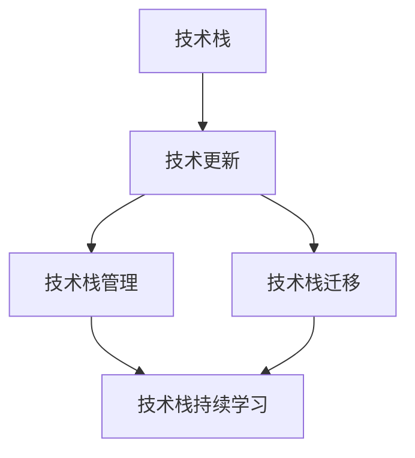

                 

# 程序员如何应对技术栈快速更新

在当今快速发展的技术时代，程序员面临的最大挑战之一就是不断更新的技术栈。技术的快速发展使得旧有技术迅速过时，新的技术层出不穷，如何适应这一变化，成为了每位程序员都必须面对的问题。本文将探讨程序员如何应对技术栈快速更新的问题，从背景、核心概念、算法原理、实践步骤、应用场景、资源推荐、总结展望以及常见问题解答等方面，深入分析这一问题的解决之道。

## 1. 背景介绍

### 1.1 问题由来
技术栈的快速更新是计算机科学发展的自然结果。随着软件工程和计算技术的进步，新技术不断涌现，旧技术逐渐被淘汰。这一趋势在互联网、人工智能、区块链、大数据等各个领域都有体现。例如，Web开发从早期的HTML、CSS、JavaScript等技术，发展到现在的React、Vue、Angular等框架，再到最新的Svelte、Blazor等，每一次技术的变革都带来了新的工作方式和开发流程。

### 1.2 问题核心关键点
对于程序员而言，快速更新的技术栈不仅增加了学习负担，还可能带来职业生涯的不确定性。但技术栈更新也有其积极的一面，如提升开发效率、改善代码质量、实现新功能等。因此，如何平衡技术更新与个人发展，成为了程序员面临的核心问题。

## 2. 核心概念与联系

### 2.1 核心概念概述

为更好地理解如何应对技术栈的快速更新，本节将介绍几个关键概念：

- 技术栈(Technology Stack)：一组用于开发和维护软件应用的技术、框架和工具的集合，通常包括编程语言、数据库、中间件、IDE等。

- 技术更新(Stack Updates)：指随着新技术的出现，旧有技术被逐步淘汰，开发者需要学习新的技术，以保持竞争力。

- 技术栈管理(Stack Management)：指如何有效地选择、引入和管理技术栈中的各个组件，以适应项目需求和开发进度。

- 技术栈迁移(Stack Migration)：指在技术栈更新时，如何将旧有技术平稳过渡到新技术的过程。

- 技术栈持续学习(Life-long Learning)：指程序员需不断学习新技术，保持技术栈的前沿性和适用性。

这些概念之间的逻辑关系可以通过以下Mermaid流程图来展示：



这个流程图展示了技术栈的基本组成和更新过程中的各个环节，以及持续学习对整个技术栈管理的推动作用。

## 3. 核心算法原理 & 具体操作步骤

### 3.1 算法原理概述

应对技术栈快速更新，本质上是一个持续学习和适应变化的过程。其核心思想是：通过不断学习和掌握新知识，使技术栈保持最新的状态，同时合理地选择和应用新技术，提升开发效率和代码质量。

### 3.2 算法步骤详解

应对技术栈快速更新的一般步骤包括：

1. **持续学习**：通过阅读技术书籍、博客、论文等，参加线上线下培训，参与开源项目等，不断获取新技术知识。
2. **评估需求**：根据项目需求和技术栈现状，评估是否引入新技术。
3. **技术选型**：基于评估结果，选择最适合项目的技术或工具。
4. **渐进迁移**：在引入新技术时，采用渐进式迁移策略，避免对现有系统造成过大的冲击。
5. **持续监控**：在新技术引入后，持续监控系统性能和稳定性，及时调整和优化。

### 3.3 算法优缺点

应对技术栈快速更新的方法具有以下优点：

- **提升效率**：新技术通常提供更高效的工具和框架，可以显著提升开发和维护效率。
- **改善质量**：新工具和框架通常具有更好的代码规范和最佳实践，能够提升代码质量。
- **增强适应性**：学习新技能可以增强程序员的适应能力和创新能力，使其能够更好地应对未来的技术挑战。

但同时，这种方法也存在一些缺点：

- **学习成本高**：新技术的学习曲线较陡，需要投入大量时间和精力。
- **风险不确定**：新技术可能存在不稳定性和未知问题，引入新技术可能导致系统崩溃或功能异常。
- **资源限制**：学习新技术需要时间、资金和硬件资源，对于一些小型项目或预算有限的项目，可能难以承受。

### 3.4 算法应用领域

应对技术栈快速更新的方法，在软件开发、系统维护、项目部署等各个环节都有广泛应用。例如：

- **软件开发**：在软件开发过程中，选择最合适的技术栈，采用最新工具和框架，提升开发效率和代码质量。
- **系统维护**：在系统维护过程中，学习新工具和框架，提高系统可维护性和扩展性。
- **项目部署**：在项目部署时，采用新技术和新工具，提升系统性能和可靠性。

此外，该方法还在教育培训、技术咨询、软件测试等领域得到了广泛应用，为技术栈管理提供了有力的支持。

## 4. 数学模型和公式 & 详细讲解 & 举例说明

### 4.1 数学模型构建

为了更好地量化技术栈更新的过程，我们可以构建一个简单的数学模型。假设技术栈更新的速度为 $\dot{S}$，技术的更新周期为 $T$，单位时间内的学习率为 $\eta$，则技术栈更新的模型可以表示为：

$$ S(t) = S_0 + \int_{0}^{t} \dot{S}(t) dt $$

其中，$S(t)$ 表示在时间 $t$ 时技术栈的更新程度，$S_0$ 为初始技术栈更新程度，$\dot{S}(t)$ 为时间 $t$ 时刻的技术更新速度。

### 4.2 公式推导过程

进一步推导得到：

$$ S(t) = S_0 + \int_{0}^{t} \eta e^{-\lambda t} dt $$

其中，$\lambda$ 为技术更新的衰减系数。

当 $t$ 趋近于无穷大时，$S(t)$ 趋近于一个稳态值 $S_{\infty}$。我们可以通过求解微分方程得到稳态值 $S_{\infty}$：

$$ S_{\infty} = S_0 + \eta / \lambda $$

这表明技术栈的最终更新程度取决于初始状态和单位时间内的学习率。

### 4.3 案例分析与讲解

假设初始技术栈更新程度为 $S_0=0$，技术更新的衰减系数为 $\lambda=0.1$，单位时间内的学习率为 $\eta=0.05$。我们可以通过计算得到技术栈的最终更新程度为：

$$ S_{\infty} = 0 + 0.05 / 0.1 = 0.5 $$

这意味着经过一段时间的学习和应用，技术栈的更新程度将达到50%，即程序员掌握了一半的新技术。这一结果表明，持续学习和技术栈迁移是必不可少的。

## 5. 项目实践：代码实例和详细解释说明

### 5.1 开发环境搭建

在进行技术栈迁移实践前，我们需要准备好开发环境。以下是使用Python进行Django开发的环境配置流程：

1. 安装Anaconda：从官网下载并安装Anaconda，用于创建独立的Python环境。

2. 创建并激活虚拟环境：
```bash
conda create -n django-env python=3.8 
conda activate django-env
```

3. 安装Django：
```bash
pip install django
```

4. 安装开发工具：
```bash
pip install django-env
```

5. 安装调试工具：
```bash
pip install django-debug-toolbar
```

完成上述步骤后，即可在`django-env`环境中开始迁移实践。

### 5.2 源代码详细实现

这里我们以引入Django框架为例，给出从Flask迁移至Django的完整代码实现。

首先，定义Flask应用的路由：

```python
from flask import Flask

app = Flask(__name__)

@app.route('/')
def index():
    return "Hello, Flask!"

if __name__ == '__main__':
    app.run(debug=True)
```

然后，定义Django应用的视图：

```python
from django.shortcuts import render
from django.http import HttpResponse

def index(request):
    return render(request, 'index.html', {'data': 'Hello, Django!'})

```

接着，定义Django应用的配置：

```python
INSTALLED_APPS = [
    'django.contrib.admin',
    'django.contrib.auth',
    'django.contrib.contenttypes',
    'django.contrib.sessions',
    'django.contrib.messages',
    'django.contrib.staticfiles',
]

```

最后，启动Django应用的开发环境：

```python
python manage.py runserver
```

以上就是从Flask迁移至Django的完整代码实现。可以看到，Django提供了更加强大的内置工具和框架，可以提升开发效率和代码质量。

### 5.3 代码解读与分析

让我们再详细解读一下关键代码的实现细节：

**Flask代码**：
- `index()` 函数：定义路由处理逻辑，返回一个字符串 "Hello, Flask!"。
- `if __name__ == '__main__'` 块：启动Flask应用的开发环境。

**Django代码**：
- `index()` 函数：定义视图处理逻辑，使用 Django 的模板引擎渲染 HTML。
- `INSTALLED_APPS` 列表：定义 Django 应用程序需要使用的组件。

**Django配置**：
- 包含 Django 的核心组件和应用程序。

可以看到，Django提供了更丰富的功能支持，如内置的ORM、模板引擎、中间件等，使得开发和维护更加便捷。这一迁移过程展示了从Flask到Django的渐进式迁移策略，有效减少了对现有系统的冲击。

## 6. 实际应用场景

### 6.1 软件项目管理

在软件项目管理中，持续学习和技术栈管理是提升项目效率和质量的重要手段。通过引入新技术和新工具，可以提高团队的技术水平，提升开发速度和代码质量。例如：

- **版本控制**：从Git版本控制迁移至GitLab或GitHub，利用其强大的开源协作功能，提升项目管理和代码审查效率。
- **容器化部署**：从传统的服务器部署迁移至Docker容器化部署，提高应用的运行稳定性和扩展性。
- **持续集成/持续交付(CI/CD)**：引入Jenkins或Travis CI等工具，实现自动化测试和部署，提升项目交付速度。

### 6.2 软件测试

在软件测试中，持续学习和技术栈管理也是必不可少的。通过学习新的测试工具和框架，可以提升测试覆盖率和测试效率，发现更多潜在问题。例如：

- **自动化测试**：从手动测试迁移至Selenium或TestNG等自动化测试工具，提升测试效率和覆盖率。
- **性能测试**：从单线程测试迁移至Apache JMeter或Gatling等性能测试工具，提升系统负载测试能力。
- **测试报告**：从简单的文本报告迁移至Allure或TestNG等测试报告工具，提供更丰富的测试信息和可视化展示。

### 6.3 软件维护

在软件维护中，持续学习和技术栈管理可以帮助开发团队应对系统复杂性和需求变化，提升维护效率和质量。例如：

- **代码重构**：从旧的代码库迁移至新的代码库，利用新的编程语言和框架进行重构，提升代码可读性和可维护性。
- **系统升级**：从旧的架构迁移至新的架构，如微服务架构或Serverless架构，提升系统扩展性和可维护性。
- **文档管理**：从手动编写文档迁移至DocGenerator或Confluence等文档管理工具，提升文档编写和维护效率。

## 7. 工具和资源推荐

### 7.1 学习资源推荐

为了帮助开发者系统掌握技术栈更新的理论基础和实践技巧，这里推荐一些优质的学习资源：

1. 《软件工程导论》系列书籍：全面介绍了软件开发中的各种技术和工具，包括持续集成、自动化测试、容器化部署等。

2. 《Python Cookbook》：涵盖了Python编程中的各种技巧和最佳实践，适合开发者在日常开发中参考。

3. 《Fluent Python》：深入讲解Python编程语言，包括高级特性和编程技巧，适合进阶学习。

4. 《Clean Code》：介绍了如何编写清晰、可维护的代码，适合开发者提升代码质量。

5. 《Effective Python》：讲解Python编程中的各种最佳实践，适合开发者提升编程技巧。

通过对这些资源的学习实践，相信你一定能够快速掌握技术栈更新的精髓，并用于解决实际的软件开发问题。

### 7.2 开发工具推荐

高效的开发离不开优秀的工具支持。以下是几款用于技术栈迁移开发的常用工具：

1. PyCharm：全功能的Python IDE，提供强大的代码补全、调试和测试功能。

2. Visual Studio Code：轻量级的代码编辑器，支持多种编程语言和插件，适合快速开发和调试。

3. Docker：提供轻量级的容器化解决方案，适合部署和管理应用。

4. Kubernetes：提供强大的容器编排和集群管理功能，适合大规模部署和管理应用。

5. Jenkins：开源的自动化测试和持续集成工具，支持多种插件和插件。

6. GitLab：提供强大的代码仓库和持续集成/持续交付(CI/CD)功能，适合团队协作开发。

合理利用这些工具，可以显著提升技术栈迁移的开发效率，加快创新迭代的步伐。

### 7.3 相关论文推荐

技术栈迁移的研究源于学界的持续研究。以下是几篇奠基性的相关论文，推荐阅读：

1. "Software Architecture Evolution: A Case Study in Large-Scale Change"：文章讨论了大型软件架构的演变过程，提供了技术栈迁移的实际案例和经验。

2. "Technology Evolution and Migration: An Empirical Study"：文章通过实证研究，分析了技术栈迁移的成功因素和关键挑战。

3. "Beyond the Hype: Technology Adoption in Software Projects"：文章讨论了技术栈选择和迁移的影响因素，提供了技术栈管理的理论框架。

4. "Adapting to New Technology: The Role of Knowledge and Trust"：文章探讨了技术栈迁移中知识传递和信任建设的重要性，提供了技术栈管理的策略建议。

这些论文代表了大语言模型微调技术的发展脉络。通过学习这些前沿成果，可以帮助研究者把握学科前进方向，激发更多的创新灵感。

## 8. 总结：未来发展趋势与挑战

### 8.1 总结

本文对技术栈快速更新的问题进行了全面系统的介绍。首先阐述了技术栈更新对程序员带来的挑战和机遇，明确了技术栈管理和迁移的重要性。其次，从原理到实践，详细讲解了技术栈管理的数学模型和关键步骤，给出了技术栈迁移任务开发的完整代码实例。同时，本文还广泛探讨了技术栈管理在软件开发、系统维护、软件测试等多个领域的应用前景，展示了技术栈管理方法的巨大潜力。此外，本文精选了技术栈管理的各类学习资源，力求为读者提供全方位的技术指引。

通过本文的系统梳理，可以看到，技术栈管理对于程序员的持续学习和技能提升至关重要。掌握技术栈管理方法，可以更好地应对技术栈的快速更新，提升开发效率和代码质量，实现职业发展和技术进步。

### 8.2 未来发展趋势

展望未来，技术栈管理将呈现以下几个发展趋势：

1. **自动化和智能化**：随着AI技术的发展，技术栈管理将变得更加自动化和智能化，通过机器学习算法优化技术选型和迁移路径。

2. **跨学科融合**：技术栈管理将与其他学科进行更加深入的融合，如心理学、社会学等，理解开发者行为和团队文化，提升技术栈管理的科学性和有效性。

3. **数据驱动**：技术栈管理将更加依赖数据驱动，通过分析技术栈历史数据和市场需求，预测技术趋势和变化，指导技术选型和迁移。

4. **全栈能力**：未来的技术栈管理将不仅关注单一技术栈，而是强调全栈能力，涵盖前后端、数据、安全等各个方面，提升整体系统架构和开发能力。

5. **多模态融合**：未来的技术栈管理将不仅仅局限于代码和工具，而是引入多模态数据和信息，提升技术栈管理的全面性和深度。

这些趋势表明，技术栈管理将变得更加科学、智能和全面，成为软件开发中的重要助力。

### 8.3 面临的挑战

尽管技术栈管理已经取得了显著进展，但在迈向更加智能化、普适化应用的过程中，它仍面临着诸多挑战：

1. **数据隐私和安全**：技术栈迁移和优化过程中，需要处理大量的代码和数据，如何保障数据隐私和安全，是一个重要挑战。

2. **技术依赖性**：技术栈管理依赖于各种技术工具和框架，一旦某个工具或框架出现问题，可能导致系统崩溃或功能异常。

3. **团队协作**：技术栈管理需要跨部门协作，涉及开发、运维、测试等多个团队，如何高效协作是一个重要问题。

4. **持续更新**：技术栈管理需要不断更新和优化，如何保持技术栈的前沿性和适用性，是一个长期挑战。

5. **成本控制**：技术栈管理需要投入大量时间和资源，如何平衡成本和效果，是一个重要挑战。

这些挑战需要开发者不断探索和创新，才能实现技术栈管理的科学化和高效化。

### 8.4 研究展望

面对技术栈管理所面临的种种挑战，未来的研究需要在以下几个方面寻求新的突破：

1. **模型优化**：优化技术栈管理的数学模型和算法，提升技术选型和迁移的准确性和效率。

2. **自动化工具**：开发更加自动化和智能化的技术栈管理工具，减少人工干预和操作，提升管理效率。

3. **跨领域研究**：借鉴其他学科的研究方法和理论，如组织行为学、社会学等，提升技术栈管理的科学性和实用性。

4. **混合技术栈**：探索混合技术栈的管理方法，如Java与Python混合、Web与移动混合等，提升技术栈管理的灵活性和适应性。

5. **持续学习机制**：建立持续学习机制，通过机器学习和数据分析，不断优化技术栈管理和迁移策略。

这些研究方向的探索，必将引领技术栈管理技术迈向更高的台阶，为软件开发和技术创新提供更强的支持。总之，技术栈管理需要开发者不断探索和创新，才能实现技术栈的科学化和高效化，提升开发效率和代码质量，实现职业发展和技术进步。

