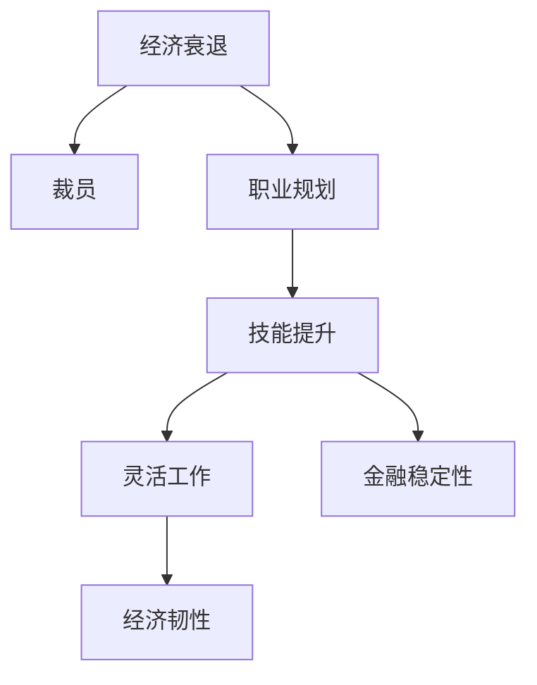

                 

# 程序员如何应对经济衰退挑战

> 关键词：经济衰退, 裁员, 经济危机, 失业, 职业规划, 技能提升, 灵活工作, 经济韧性, 金融危机

## 1. 背景介绍

### 1.1 问题由来

在过去十年中，全球经济经历了多次波动的经济衰退和金融危机，如2008年全球金融危机、2018年中国经济下行的压力等。这些经济衰退不仅给企业带来了巨大的财务压力，也对程序员的职业发展产生了深远的影响。在经济衰退时期，企业为了降低成本，常常会采取裁员、削减预算等措施，导致大量程序员面临失业的风险。

### 1.2 问题核心关键点

经济衰退期间，程序员面临的挑战主要包括：
- **失业风险**：企业为了节省成本，可能会裁员，导致程序员失业。
- **技能提升**：经济衰退可能导致行业需求变化，程序员需要不断提升技能以适应新需求。
- **金融稳定性**：经济衰退时期，个人财务可能不稳定，程序员需要加强个人财务管理能力。
- **心理压力**：经济衰退带来的不确定性和压力可能会影响程序员的心理健康。

### 1.3 问题研究意义

研究和解决程序员在经济衰退期间面临的挑战，对于保障程序员的职业安全和心理健康，促进社会稳定和经济发展具有重要意义：

- **保障就业**：帮助程序员提升技能，增强市场竞争力，降低失业风险。
- **促进经济增长**：通过技能提升和创新，促进行业发展，驱动经济复苏。
- **心理健康**：帮助程序员应对经济衰退带来的心理压力，保持积极乐观的心态。
- **社会稳定**：稳定就业市场，减少社会不满情绪，维护社会稳定。

## 2. 核心概念与联系

### 2.1 核心概念概述

为了更好地应对经济衰退挑战，本节将介绍几个核心概念：

- **经济衰退**：指一个经济体在一段时间内GDP增长率连续下降，失业率上升，经济活动减少。
- **裁员**：指企业为了降低成本，解雇部分或全部员工的过程。
- **职业规划**：指根据个人兴趣和职业发展目标，制定长期职业发展计划。
- **技能提升**：指通过学习新知识、掌握新技能，提高个人市场竞争力。
- **灵活工作**：指不受固定工作时间和地点限制的工作形式，如远程办公、弹性工作时间等。
- **金融稳定性**：指个人或企业能够稳定应对经济波动的财务状况。
- **经济韧性**：指一个经济体在面对外部冲击时，能够快速恢复和增长的能力。

这些概念之间的逻辑关系可以通过以下Mermaid流程图来展示：



这个流程图展示了一些核心概念及其之间的关系：

1. 经济衰退是背景，影响企业和员工的决策。
2. 裁员是经济衰退的直接后果之一。
3. 职业规划和技能提升是应对失业风险的手段。
4. 灵活工作有助于缓解失业压力，增加收入来源。
5. 金融稳定性是应对经济波动的财务保障。
6. 经济韧性是衡量一个经济体应对外部冲击能力的指标。

## 3. 核心算法原理 & 具体操作步骤

### 3.1 算法原理概述

应对经济衰退挑战的核心算法原理可以概括为以下几点：

1. **风险评估**：通过数据分析和预测模型，评估个人和企业的经济风险。
2. **职业规划**：基于风险评估结果，制定个性化的职业发展计划。
3. **技能提升**：根据职业规划需求，选择合适的技能提升路径。
4. **金融管理**：通过财务规划和投资策略，增强个人或企业的财务稳定性。
5. **灵活工作**：优化工作模式，增加收入来源，提高生活质量。

### 3.2 算法步骤详解

#### 3.2.1 风险评估

风险评估通常包括以下几个步骤：

1. **收集数据**：收集个人或企业的财务、经济数据，如收入、支出、投资、债务等。
2. **数据分析**：利用统计分析方法，评估财务状况和经济风险。
3. **风险预测**：使用机器学习模型，预测未来经济波动和财务变化。

#### 3.2.2 职业规划

职业规划主要包括以下几个步骤：

1. **兴趣评估**：通过心理测试、职业测评等方式，了解个人兴趣和职业倾向。
2. **市场调研**：分析行业发展趋势和职业需求，选择合适的职业方向。
3. **目标设定**：根据兴趣和市场调研结果，设定短期和长期职业目标。

#### 3.2.3 技能提升

技能提升主要包括以下几个步骤：

1. **需求分析**：根据职业规划目标，分析所需的技能和知识。
2. **课程选择**：选择适合的在线课程、培训班或自学资源，提升相关技能。
3. **实践应用**：通过项目实践或实习，巩固和应用所学技能。

#### 3.2.4 金融管理

金融管理主要包括以下几个步骤：

1. **财务规划**：制定合理的预算、储蓄和投资计划，确保资金充足。
2. **投资策略**：根据个人风险偏好，选择适合的投资工具，分散风险。
3. **风险管理**：使用保险、合同等工具，保障财务安全。

#### 3.2.5 灵活工作

灵活工作主要包括以下几个步骤：

1. **工作模式选择**：根据个人偏好和市场需求，选择远程办公、自由职业、兼职等灵活工作模式。
2. **资源整合**：整合现有资源，如技能、人脉、工具等，支持灵活工作。
3. **时间管理**：制定高效的时间管理策略，提高工作效率和生活质量。

### 3.3 算法优缺点

应对经济衰退挑战的算法具有以下优点：

1. **全面性**：通过风险评估、职业规划、技能提升、金融管理和灵活工作等多个环节，全面应对经济衰退的挑战。
2. **适应性**：根据个人和企业情况，定制化的职业规划和技能提升方案，适应不同的经济环境。
3. **灵活性**：灵活工作模式和投资策略，增强了个人和企业的财务稳定性和市场适应能力。

同时，该算法也存在以下缺点：

1. **数据依赖**：风险评估和市场调研需要大量数据，数据质量直接影响结果准确性。
2. **个性化需求**：职业规划和技能提升需要深入了解个人兴趣和市场需求，工作量大。
3. **市场波动**：金融市场和经济环境不稳定，投资和理财策略需要及时调整。
4. **心理压力**：应对经济衰退带来的不确定性和压力，需要较强的心理调适能力。

### 3.4 算法应用领域

应对经济衰退挑战的算法广泛应用于多个领域：

- **职业发展**：帮助个人和企业制定职业规划，提升竞争力。
- **金融投资**：提供财务规划和投资建议，增强财务稳定性。
- **人力资源**：通过灵活工作模式，优化人力资源配置，提高企业效率。
- **企业管理**：通过风险评估和财务管理，提升企业应对外部冲击的能力。

## 4. 数学模型和公式 & 详细讲解  
### 4.1 数学模型构建

为了更好地量化和预测经济衰退带来的影响，我们需要构建一些数学模型。以下是一些常用的数学模型及其构建方法：

1. **线性回归模型**：用于分析经济变量之间的关系，预测未来的经济趋势。
2. **时间序列分析**：通过时间序列数据，预测未来的经济波动。
3. **风险评估模型**：利用统计和机器学习模型，评估个人和企业的财务风险。
4. **投资组合理论**：通过数学模型，优化投资组合，分散风险。

### 4.2 公式推导过程

#### 4.2.1 线性回归模型

线性回归模型可以表示为：

$$
y = \beta_0 + \beta_1 x_1 + \beta_2 x_2 + \cdots + \beta_n x_n + \epsilon
$$

其中，$y$ 为经济变量（如GDP增长率），$x_i$ 为解释变量（如投资、消费、失业率等），$\beta_i$ 为系数，$\epsilon$ 为误差项。

通过最小二乘法等方法，求解系数 $\beta_i$，得到预测公式：

$$
y = \hat{\beta}_0 + \hat{\beta}_1 x_1 + \hat{\beta}_2 x_2 + \cdots + \hat{\beta}_n x_n
$$

#### 4.2.2 时间序列分析

时间序列分析通常使用ARIMA模型，可以表示为：

$$
y_t = \phi_1 y_{t-1} + \phi_2 y_{t-2} + \cdots + \phi_p y_{t-p} + \theta_1 \epsilon_{t-1} + \theta_2 \epsilon_{t-2} + \cdots + \theta_d \epsilon_{t-d} + \epsilon_t
$$

其中，$y_t$ 为经济变量在时间 $t$ 的值，$\phi_i$ 和 $\theta_i$ 为系数，$\epsilon_t$ 为误差项。

通过模型拟合和参数估计，得到预测公式：

$$
y_t = \hat{\phi}_1 y_{t-1} + \hat{\phi}_2 y_{t-2} + \cdots + \hat{\phi}_p y_{t-p} + \hat{\theta}_1 \epsilon_{t-1} + \hat{\theta}_2 \epsilon_{t-2} + \cdots + \hat{\theta}_d \epsilon_{t-d} + \epsilon_t
$$

#### 4.2.3 风险评估模型

风险评估模型通常使用VaR模型，可以表示为：

$$
VaR_{\alpha} = \hat{\mu} + \hat{\sigma} z_{\alpha}
$$

其中，$VaR_{\alpha}$ 为在置信度 $\alpha$ 下的风险价值，$\hat{\mu}$ 和 $\hat{\sigma}$ 为均值和标准差，$z_{\alpha}$ 为标准正态分布的 $\alpha$ 分位数。

通过历史数据和模型计算，得到风险价值：

$$
VaR_{\alpha} = \mu + \sigma z_{\alpha}
$$

#### 4.2.4 投资组合理论

投资组合理论通常使用Markowitz模型，可以表示为：

$$
\hat{w} = \frac{1}{\sigma^2} \Sigma^{-1} \Sigma_{i,j} \mu_i \mu_j
$$

其中，$\hat{w}$ 为最优投资组合权重，$\mu_i$ 为第 $i$ 个资产的预期收益率，$\Sigma$ 为协方差矩阵。

通过求解矩阵方程，得到最优投资组合：

$$
\hat{w} = \frac{1}{\sigma^2} \Sigma^{-1} \Sigma_{i,j} \mu_i \mu_j
$$

### 4.3 案例分析与讲解

假设某公司计划进行风险评估，收集了历史数据和市场数据，构建了VaR模型：

1. **数据收集**：收集历史数据和市场数据，计算均值和标准差。
2. **模型构建**：使用VaR模型，计算风险价值。
3. **结果分析**：分析风险价值，评估公司的财务风险。

假设某程序员希望通过技能提升应对经济衰退，学习了Python编程和数据科学：

1. **需求分析**：分析市场需求，确定Python和数据科学的重要性。
2. **课程选择**：选择适合的在线课程，学习Python和数据科学。
3. **实践应用**：通过项目实践，巩固和应用所学技能。

## 5. 项目实践：代码实例和详细解释说明
### 5.1 开发环境搭建

为了进行风险评估和技能提升的实践，我们需要准备好开发环境。以下是使用Python进行项目开发的环境配置流程：

1. 安装Anaconda：从官网下载并安装Anaconda，用于创建独立的Python环境。

2. 创建并激活虚拟环境：
```bash
conda create -n risk-evaluation python=3.8 
conda activate risk-evaluation
```

3. 安装相关库：
```bash
conda install pandas numpy matplotlib scikit-learn scipy
```

4. 安装Python相关库：
```bash
pip install numpy pandas scikit-learn
```

完成上述步骤后，即可在`risk-evaluation`环境中进行项目实践。

### 5.2 源代码详细实现

下面以风险评估和技能提升为例，给出使用Python进行项目开发的代码实现。

#### 5.2.1 风险评估

```python
import pandas as pd
from scipy.stats import norm
import numpy as np

# 加载数据
data = pd.read_csv('data.csv')

# 计算均值和标准差
mean = np.mean(data['GDP_growth'])
std = np.std(data['GDP_growth'])

# 计算VaR
alpha = 0.95  # 置信度
z_alpha = norm.ppf(alpha)  # 标准正态分布的分位数
VaR = mean + std * z_alpha
print(f'VaR(95%) = {VaR:.2f}')
```

#### 5.2.2 技能提升

```python
import pandas as pd
from sklearn.model_selection import train_test_split

# 加载数据
data = pd.read_csv('skills.csv')

# 特征工程
X = data[[' years_experience', ' education_level']]
y = data['skill']
X_train, X_test, y_train, y_test = train_test_split(X, y, test_size=0.2, random_state=42)

# 训练模型
from sklearn.linear_model import LogisticRegression
model = LogisticRegression()
model.fit(X_train, y_train)

# 评估模型
from sklearn.metrics import accuracy_score
y_pred = model.predict(X_test)
accuracy = accuracy_score(y_test, y_pred)
print(f'Accuracy = {accuracy:.2f}')
```

### 5.3 代码解读与分析

让我们再详细解读一下关键代码的实现细节：

**风险评估代码**：
- 使用Pandas加载历史数据，计算均值和标准差。
- 使用SciPy的norm.ppf函数计算标准正态分布的分位数，从而计算VaR。

**技能提升代码**：
- 使用Pandas加载技能数据，进行特征工程。
- 使用Scikit-learn的train_test_split函数将数据集分为训练集和测试集。
- 使用LogisticRegression训练模型，并使用Accuracy评估模型性能。

## 6. 实际应用场景

### 6.1 企业风险管理

企业可以利用风险评估模型，对未来经济波动进行预测，制定风险应对策略，降低财务风险。例如，某公司通过VaR模型，预测到未来经济波动的风险，从而调整投资组合，分散风险，保障财务稳定。

### 6.2 个人职业规划

个人可以利用技能提升模型，评估市场需求，制定职业发展计划，提升市场竞争力。例如，某程序员通过学习Python和数据科学，提升了自己的技能，从而在新的市场中找到更好的职业机会。

### 6.3 家庭财务规划

家庭可以利用金融管理模型，制定合理的财务规划，保障财务稳定。例如，某家庭通过理财模型，优化投资组合，分散风险，确保家庭财务安全。

## 7. 工具和资源推荐

### 7.1 学习资源推荐

为了帮助开发者系统掌握风险评估和技能提升的理论基础和实践技巧，这里推荐一些优质的学习资源：

1. 《Python数据分析与统计》系列博文：由数据科学家撰写，深入浅出地介绍了数据分析和统计方法。

2. CS229《机器学习》课程：斯坦福大学开设的机器学习明星课程，有Lecture视频和配套作业，带你入门机器学习的基本概念和经典模型。

3. 《金融工程与风险管理》书籍：系统介绍金融工程和风险管理的基本概念和常用模型。

4. Coursera上的《数据科学与机器学习》课程：提供从基础到高级的数据科学和机器学习课程，涵盖大数据、深度学习等前沿技术。

5. Kaggle上的金融和数据科学项目：通过实践项目，提高个人和企业的数据分析和机器学习能力。

通过对这些资源的学习实践，相信你一定能够快速掌握风险评估和技能提升的精髓，并用于解决实际的财务和职业发展问题。

### 7.2 开发工具推荐

高效的开发离不开优秀的工具支持。以下是几款用于风险评估和技能提升开发的常用工具：

1. Python：强大的数据科学语言，支持Pandas、NumPy等库，适合进行数据处理和建模。

2. R语言：数据科学领域广泛使用的语言，支持ggplot2、dplyr等库，适合进行数据可视化和统计分析。

3. Jupyter Notebook：交互式编程环境，支持Python、R等语言，适合进行数据科学和机器学习实践。

4. Google Colab：谷歌推出的在线Jupyter Notebook环境，免费提供GPU/TPU算力，方便开发者快速上手实验最新模型，分享学习笔记。

合理利用这些工具，可以显著提升风险评估和技能提升任务的开发效率，加快创新迭代的步伐。

### 7.3 相关论文推荐

风险评估和技能提升的发展源于学界的持续研究。以下是几篇奠基性的相关论文，推荐阅读：

1. "Value at Risk" by Robert C. Merton：提出VaR模型，用于金融风险管理。

2. "Machine Learning Yearning" by Andrew Ng：系统介绍机器学习的基本概念和实践技巧，适合初学者和进阶者。

3. "Deep Learning" by Ian Goodfellow：深入介绍深度学习的原理和应用，适合深度学习领域的专家。

4. "Quantitative Risk Management: Concepts, Techniques and Tools" by Damiano Brigo：系统介绍量化风险管理的理论和方法。

5. "Predictive Analytics" by Eric Siegel：介绍预测分析的基本概念和应用，适合数据分析和机器学习领域的从业者。

这些论文代表了大语言模型微调技术的发展脉络。通过学习这些前沿成果，可以帮助研究者把握学科前进方向，激发更多的创新灵感。

## 8. 总结：未来发展趋势与挑战

### 8.1 总结

本文对程序员应对经济衰退挑战的方法进行了全面系统的介绍。首先阐述了经济衰退对程序员的影响和应对策略，明确了风险评估、职业规划、技能提升、金融管理等策略的重要性。其次，从原理到实践，详细讲解了风险评估和技能提升的数学模型和代码实现。同时，本文还广泛探讨了风险评估和技能提升在企业、个人和家庭中的应用前景，展示了其广泛的适用性和实用性。此外，本文精选了相关学习资源，力求为读者提供全方位的技术指引。

通过本文的系统梳理，可以看到，通过风险评估和技能提升，程序员可以更好地应对经济衰退的挑战，保障职业安全和心理健康。未来，伴随风险评估和技能提升方法的持续演进，相信程序员将能够更好地适应复杂的经济环境，推动个人和企业的持续发展。

### 8.2 未来发展趋势

展望未来，风险评估和技能提升技术将呈现以下几个发展趋势：

1. **数据智能化**：利用大数据和人工智能技术，提高数据处理和分析的效率和准确性。
2. **模型自动化**：通过自动机器学习(AutoML)和自动化模型优化，减少人工干预，提高模型应用效率。
3. **交互式分析**：通过交互式可视化工具，提供更加直观和交互式的数据分析体验。
4. **个性化定制**：根据个人和企业的不同需求，提供定制化的风险评估和技能提升方案。
5. **多模态融合**：结合图像、语音、文本等多模态数据，提升风险评估和技能提升的全面性和准确性。

以上趋势凸显了风险评估和技能提升技术的广阔前景。这些方向的探索发展，必将进一步提升个人和企业的决策能力和市场竞争力，为经济稳定和发展提供有力支持。

### 8.3 面临的挑战

尽管风险评估和技能提升技术已经取得了瞩目成就，但在迈向更加智能化、普适化应用的过程中，它仍面临着诸多挑战：

1. **数据质量**：数据质量直接影响风险评估和技能提升的效果，需要不断优化数据收集和清洗流程。
2. **模型复杂性**：随着模型复杂度的增加，模型的解释性和可解释性也变得复杂，难以理解其内部机制。
3. **应用门槛**：风险评估和技能提升需要一定的数学和编程基础，部分用户可能难以掌握。
4. **隐私保护**：处理个人和企业数据时，需要严格遵守隐私保护法规，避免数据泄露和滥用。
5. **市场动态**：市场需求和技术趋势不断变化，需要持续跟踪和学习，以保持技术的先进性。

正视风险评估和技能提升面临的这些挑战，积极应对并寻求突破，将是大语言模型微调走向成熟的必由之路。相信随着学界和产业界的共同努力，这些挑战终将一一被克服，风险评估和技能提升必将在构建稳定、可靠、可解释的智能系统中扮演越来越重要的角色。

### 8.4 研究展望

面对风险评估和技能提升所面临的挑战，未来的研究需要在以下几个方面寻求新的突破：

1. **自适应算法**：开发更加自适应和灵活的风险评估和技能提升算法，适应不同的数据和应用场景。
2. **混合模型**：结合符号计算和神经网络，开发混合模型，提高风险评估和技能提升的全面性和准确性。
3. **可解释性**：加强模型解释和可解释性研究，提供更加透明和可理解的决策过程。
4. **隐私保护**：研究隐私保护技术，保护个人和企业数据隐私，保障数据安全。
5. **跨领域应用**：探索风险评估和技能提升在更多领域的应用，如医疗、教育、智能制造等。

这些研究方向的探索，必将引领风险评估和技能提升技术迈向更高的台阶，为构建稳定、可靠、可解释的智能系统铺平道路。面向未来，风险评估和技能提升技术还需要与其他人工智能技术进行更深入的融合，如知识表示、因果推理、强化学习等，多路径协同发力，共同推动风险管理和技能提升的发展。只有勇于创新、敢于突破，才能不断拓展风险评估和技能提升的边界，让智能技术更好地造福人类社会。

## 9. 附录：常见问题与解答

**Q1：风险评估和技能提升是否适用于所有行业和企业？**

A: 风险评估和技能提升在大多数行业和企业中都有广泛应用，但需要根据具体情况进行定制化设计和调整。例如，金融行业更注重风险评估，而科技行业更注重技能提升。

**Q2：风险评估和技能提升需要多少时间和资源？**

A: 风险评估和技能提升需要根据具体情况而定。一般而言，风险评估需要收集和处理大量数据，进行复杂模型训练，可能需要较长时间和较高资源投入。而技能提升则需要选择适合的课程和项目，并不断实践，需要持续的投入和学习。

**Q3：如何选择合适的风险评估模型？**

A: 选择合适的风险评估模型需要考虑数据类型、目标和应用场景。例如，时间序列分析适合于预测经济波动，而VaR模型适合于评估财务风险。可以参考历史数据和专家意见，选择合适的模型进行评估。

**Q4：如何提升技能提升的效果？**

A: 提升技能提升的效果需要选择合适的课程和项目，进行持续学习和实践。可以参加在线课程、培训班或实习项目，通过实际应用巩固和提升所学技能。同时，可以建立学习小组或社群，互相学习和分享经验。

**Q5：风险评估和技能提升对个人和企业有什么好处？**

A: 风险评估和技能提升能够帮助个人和企业更好地应对经济衰退和市场变化，提高市场竞争力和财务稳定性。具体好处包括：
1. 降低财务风险：通过风险评估，企业可以更好地预测和应对经济波动，降低财务风险。
2. 提升职业竞争力：通过技能提升，个人可以提高自身市场竞争力，找到更好的职业机会。
3. 优化投资组合：通过金融管理，企业可以优化投资组合，分散风险，提高财务稳定性。

通过这些好处，风险评估和技能提升能够帮助个人和企业更好地应对经济衰退的挑战，实现持续发展和稳定增长。

