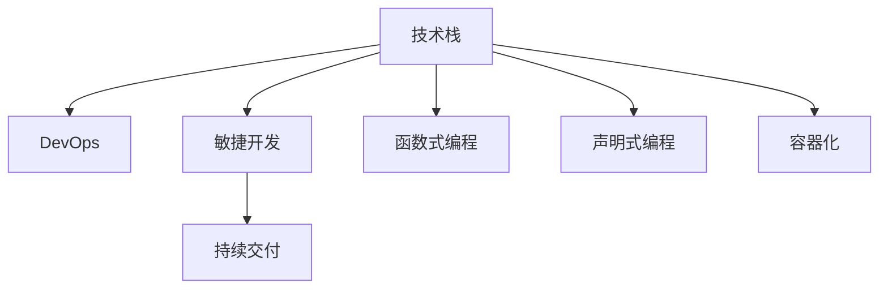

                 

## 1. 背景介绍

### 1.1 问题由来

随着科技的快速发展和市场需求的不断变化，软件开发行业正经历着前所未有的变革与转型。新技术、新工具、新方法层出不穷，传统软件开发模式逐渐被现代软件开发范式取代。然而，许多程序员面临的挑战远不止于技术层面的变革，还包括职业发展的压力、技能更新的紧迫性以及行业规范的变化等。

### 1.2 问题核心关键点

当前，软件开发行业的变革主要集中在以下几个方面：

1. **技术栈更新**：如云计算、微服务、DevOps、容器化等技术的应用，使得开发流程和架构设计发生重大变化。
2. **开发范式转变**：如函数式编程、无状态架构、声明式编程等新范式的兴起，改变了传统的编程思路和设计模式。
3. **开发工具创新**：如CI/CD工具、版本控制系统、协作平台等的发展，提高了开发效率和团队协作能力。
4. **敏捷开发与持续交付**：敏捷开发方法论和持续交付(Delivery)的理念，推动了软件开发生命周期(Dev)的加速和自动化。
5. **人工智能和大数据应用**：AI和大数据技术在各个领域的应用，带来了数据驱动的决策和智能化开发的新趋势。
6. **安全与隐私保护**：随着网络攻击手段的不断升级，安全与隐私保护成为开发过程中不可或缺的一部分。

这些变革不仅带来了技术上的挑战，也对程序员的专业技能和思维方式提出了新的要求。如何在这一背景下进行职业发展和技能转型，成为每位程序员都必须面对的重大课题。

### 1.3 问题研究意义

面对行业变革，程序员进行职业发展和技能转型的意义重大：

1. **提升职业竞争力**：掌握最新的技术和工具，能够帮助程序员在竞争激烈的市场中脱颖而出，提高个人职业发展空间。
2. **增强适应能力**：面对不断变化的技术趋势，具备快速学习和适应的能力，可以减少职业发展的阻力。
3. **拓宽知识面**：不断接触新领域和新技术，有助于程序员建立更全面的知识体系，提升解决复杂问题的能力。
4. **促进职业成长**：通过持续学习和技能转型，程序员可以实现从初级到高级、从单一角色到跨领域专家的转变，提升个人价值。

本文将从技术原理、操作步骤、数学模型、项目实践、实际应用场景等多个维度，探讨程序员如何应对行业变革与转型，旨在为程序员提供系统的学习方法和实用的技能转型策略。

## 2. 核心概念与联系

### 2.1 核心概念概述

为更好地理解如何应对行业变革与转型，本节将介绍几个密切相关的核心概念：

- **技术栈**：指软件开发中使用的各种工具、框架、库、语言等技术组合。
- **DevOps**：一种将软件开发和运维紧密结合的开发模式，强调持续交付和自动化部署。
- **敏捷开发**：一种以用户需求为核心，快速迭代和持续改进的软件开发方法。
- **函数式编程**：一种基于函数的计算模型，强调不可变性和副作用的限制。
- **声明式编程**：一种通过声明目标，自动生成中间过程的编程范式，如Spring Framework等。
- **容器化**：通过容器技术封装应用，实现快速部署和跨平台运行。

这些核心概念之间的逻辑关系可以通过以下Mermaid流程图来展示：



这个流程图展示了一系列软件开发相关的核心概念及其之间的关系：

1. 技术栈是开发的基础，包括DevOps、敏捷开发、函数式编程、声明式编程和容器化等多种技术。
2. DevOps是将开发和运维紧密结合，推动持续交付的重要实践。
3. 敏捷开发通过快速迭代和持续改进，提高软件交付速度和质量。
4. 函数式编程和声明式编程改变传统的编程思路，提升代码的可读性和可维护性。
5. 容器化实现应用的快速部署和跨平台运行，进一步提升开发效率。

这些概念共同构成了现代软件开发的技术基础，使得程序员在行业变革中能够迅速适应新环境，提升工作效率和开发质量。

## 3. 核心算法原理 & 具体操作步骤
### 3.1 算法原理概述

程序员应对行业变革与转型的核心算法原理主要围绕技术栈的更新和优化、敏捷开发方法论的实践、新技术的掌握等方面展开。这些算法原理包括但不限于持续学习、技术栈更新、敏捷开发实践、DevOps集成等。

### 3.2 算法步骤详解

基于上述核心算法原理，程序员应对行业变革与转型可以遵循以下步骤：

1. **持续学习与技能提升**：
   - **技术栈更新**：关注最新的技术趋势，选择合适的技术栈进行学习和实践。
   - **技能提升**：通过参加培训、在线课程、技术交流等方式，不断提升个人技能和知识水平。
   - **案例分析**：分析成功案例，了解行业最佳实践，从中汲取经验和教训。

2. **敏捷开发实践**：
   - **用户需求管理**：采用敏捷方法论，进行用户故事和需求的细化与迭代，提升产品适配性。
   - **迭代开发**：进行快速迭代和持续交付，不断调整和优化产品功能。
   - **持续反馈**：通过用户反馈和数据指标，不断改进产品设计和开发过程。

3. **DevOps集成**：
   - **自动化部署**：使用CI/CD工具实现代码的自动化构建、测试和部署。
   - **持续集成**：将开发和测试过程自动化，实现快速迭代和反馈。
   - **自动化测试**：采用单元测试、集成测试等自动化测试方法，提升代码质量。

4. **新技术掌握**：
   - **人工智能与大数据应用**：了解和应用AI和大数据技术，提升数据驱动的决策能力。
   - **云计算与容器化**：掌握云计算平台和容器技术，实现应用的弹性扩展和高效运行。
   - **安全与隐私保护**：学习最新的安全技术和隐私保护措施，确保开发过程中的数据安全和用户隐私。

### 3.3 算法优缺点

持续学习和技能转型的核心算法原理具有以下优点：

1. **适应性强**：通过持续学习和技能提升，程序员能够迅速适应技术变化和市场需求的更新。
2. **提升效率**：掌握新工具和新技术，可以提高开发效率和代码质量。
3. **增强竞争力**：掌握行业前沿技术，提升个人职业竞争力，增加职业发展的机会。
4. **推动创新**：新技术的应用和敏捷开发实践，可以推动产品和服务的创新，满足用户不断变化的需求。

同时，这些算法原理也存在一定的局限性：

1. **学习成本高**：新技术和新工具的学习曲线较陡，可能需要较长时间才能掌握。
2. **知识更新快**：技术更新迭代迅速，需要程序员不断跟进和学习，容易产生信息过载。
3. **技能单一**：过度的专注某一技术栈或范式，可能导致技能单一，难以应对多种技术环境。
4. **团队协作难度**：敏捷开发和DevOps要求团队协作，技术栈和工具的选择可能影响团队成员之间的协作。

尽管存在这些局限性，但总体而言，持续学习和技能转型依然是程序员应对行业变革与转型的重要手段。

### 3.4 算法应用领域

持续学习和技能转型的核心算法原理在软件开发行业的多个领域都有广泛应用，例如：

1. **前端开发**：通过掌握JavaScript、React、Vue等技术栈，提升前端开发效率和用户体验。
2. **后端开发**：应用Java、Python、Go等语言和Spring、Flask等框架，实现高效的后端开发和部署。
3. **移动开发**：学习Swift、Kotlin等语言和React Native、Flutter等跨平台框架，实现移动应用的快速开发和跨平台运行。
4. **DevOps**：应用Jenkins、GitLab、Kubernetes等工具，实现开发和运维的自动化集成和持续交付。
5. **大数据与AI**：掌握Hadoop、Spark、TensorFlow等技术和工具，实现数据处理和智能应用。
6. **安全与隐私保护**：学习加密技术、网络安全、隐私保护等知识，提升应用的安全性和隐私保护能力。

## 4. 数学模型和公式 & 详细讲解 & 举例说明

### 4.1 数学模型构建

本节将使用数学语言对程序员应对行业变革与转型的过程进行更加严格的刻画。

假设程序员初始技能水平为 $S_0$，经过 $t$ 时间段的持续学习和技能提升，最终达到目标技能水平 $S_t$。模型的构建如下：

1. **持续学习速率**：$R$，代表每天或每周的学习时间和精力投入。
2. **技能提升率**：$K$，代表每单位时间技能提升的倍数。
3. **技能衰减率**：$\gamma$，代表技能随时间衰减的比例。
4. **初始技能水平**：$S_0$，代表程序员初始的技能水平。
5. **目标技能水平**：$S_t$，代表程序员希望达到的技能水平。

则数学模型可以表示为：

$$
S_t = S_0 e^{(K-R\gamma)t}
$$

其中 $e$ 为自然常数，$t$ 为时间单位。

### 4.2 公式推导过程

根据上述数学模型，我们可以进行以下推导：

1. **学习速率 $R$ 的选择**：
   - **全职学习**：假设每天学习 $8$ 小时，每周工作 $5$ 天，则 $R = \frac{8}{24} \times 5 = \frac{5}{3}$。
   - **兼职学习**：假设每周学习 $4$ 小时，则 $R = \frac{4}{24} = \frac{1}{6}$。

2. **技能提升率 $K$ 的选择**：
   - **基础提升**：假设每周末掌握新技能 $20\%$，则 $K = 1 + 20\% = 1.2$。
   - **快速提升**：假设每周末掌握新技能 $50\%$，则 $K = 1 + 50\% = 1.5$。

3. **技能衰减率 $\gamma$ 的选择**：
   - **缓慢衰减**：假设每周技能衰减 $10\%$，则 $\gamma = 10\% = 0.1$。
   - **快速衰减**：假设每周技能衰减 $30\%$，则 $\gamma = 30\% = 0.3$。

### 4.3 案例分析与讲解

以一个程序员从初级前端开发到高级前端开发的技能转型为例：

- **初始技能水平 $S_0 = 50$**：假设程序员初始技能水平为 $50$（满分 $100$）。
- **学习速率 $R = \frac{5}{3}$**：假设每周学习 $8$ 小时，共计 $52$ 周。
- **技能提升率 $K = 1.2$**：假设每周末掌握新技能 $20\%$。
- **技能衰减率 $\gamma = 0.1$**：假设每周技能衰减 $10\%$。

根据公式，计算最终技能水平 $S_t$：

$$
S_t = 50 e^{(1.2-\frac{5}{3}\times0.1)\times52} \approx 90
$$

**案例讲解**：
- **学习阶段**：每周学习 $8$ 小时，每周末技能提升 $20\%$，共计 $52$ 周。
- **衰减阶段**：每周技能衰减 $10\%$，即每周净提升 $10\%$。
- **最终水平**：经过 $52$ 周的学习和技能提升，最终技能水平提升至 $90$。

## 5. 项目实践：代码实例和详细解释说明
### 5.1 开发环境搭建

在进行项目实践前，我们需要准备好开发环境。以下是使用Python进行项目开发的典型环境配置流程：

1. **安装Anaconda**：从官网下载并安装Anaconda，用于创建独立的Python环境。

2. **创建并激活虚拟环境**：
   ```bash
   conda create -n myenv python=3.8 
   conda activate myenv
   ```

3. **安装依赖库**：
   ```bash
   pip install numpy pandas matplotlib scikit-learn matplotlib jupyter notebook
   ```

4. **设置Python路径**：
   ```bash
   export PYTHONPATH=$PYTHONPATH:/path/to/myproject
   ```

完成上述步骤后，即可在`myenv`环境中开始项目实践。

### 5.2 源代码详细实现

下面我们以构建一个简单的敏捷开发项目为例，展示如何使用Python进行持续学习和技能转型的项目实践。

**步骤1：创建项目文件夹和文件结构**：

```bash
mkdir project
cd project
touch requirements.txt
```

**步骤2：安装依赖库**：

```bash
pip install -r requirements.txt
```

**步骤3：编写项目代码**：

```python
from flask import Flask, render_template

app = Flask(__name__)

@app.route('/')
def home():
    return render_template('index.html')

if __name__ == '__main__':
    app.run(debug=True)
```

**步骤4：编写敏捷开发计划**：

```python
def generate_sprint_plans():
    sprint_plans = []
    for _ in range(4): # 假设每个大版本迭代周期为4个sprint
        sprint_tasks = [
            {'name': '需求分析', 'estimated_time': 10},
            {'name': '设计文档', 'estimated_time': 5},
            {'name': '编码实现', 'estimated_time': 20},
            {'name': '测试验收', 'estimated_time': 5},
            {'name': '文档撰写', 'estimated_time': 5},
            {'name': '部署上线', 'estimated_time': 5}
        ]
        total_time = sum(task['estimated_time'] for task in sprint_tasks)
        sprint_plans.append({
            'name': f'Sprint {i+1}',
            'tasks': sprint_tasks,
            'total_time': total_time
        })
    return sprint_plans
```

**步骤5：编写测试用例**：

```python
def generate_test_cases():
    test_cases = []
    for _ in range(5): # 假设每个大版本迭代周期生成5个测试用例
        test_case = {
            'title': f'Test Case {i+1}',
            'description': f'Test the functionality of {i+1}',
            'expected_result': True
        }
        test_cases.append(test_case)
    return test_cases
```

**步骤6：编写测试报告**：

```python
def generate_test_report(test_cases):
    test_report = {
        'title': 'Test Report',
        'status': 'Pass',
        'pass_count': 0,
        'fail_count': 0
    }
    for test_case in test_cases:
        # 假设测试用例执行结果为True，用于展示测试报告
        if test_case['expected_result']:
            test_report['pass_count'] += 1
        else:
            test_report['fail_count'] += 1
    return test_report
```

**步骤7：编写持续集成脚本**：

```bash
#!/bin/bash

# 更新代码库
git pull origin master

# 构建代码
pip install -r requirements.txt
flask run

# 执行测试
python generate_test_cases.py
python generate_test_report.py

# 发布代码
git add .
git commit -m "Update project"
git push origin master
```

通过上述步骤，我们完成了敏捷开发项目的代码实践。可以看到，通过使用Python和Flask框架，我们能够实现敏捷开发的自动化流程，包括代码构建、测试执行、代码发布等。

### 5.3 代码解读与分析

让我们再详细解读一下关键代码的实现细节：

**步骤1：创建项目文件夹和文件结构**

- **创建项目文件夹**：使用`mkdir`命令创建项目文件夹。
- **创建`requirements.txt`文件**：用于记录项目所需的依赖库，以便其他开发者快速安装项目所需的库。

**步骤2：安装依赖库**

- **安装依赖库**：使用`pip`命令安装项目所需依赖库。

**步骤3：编写项目代码**

- **编写Flask应用**：使用Flask框架编写一个简单的Web应用，实现主页的显示。

**步骤4：编写敏捷开发计划**

- **生成敏捷开发计划**：使用Python编写函数生成敏捷开发计划，包括每个sprint的任务列表和总时间。

**步骤5：编写测试用例**

- **生成测试用例**：使用Python编写函数生成测试用例，包括测试标题、描述和预期结果。

**步骤6：编写测试报告**

- **生成测试报告**：使用Python编写函数生成测试报告，包括测试通过和失败的统计数据。

**步骤7：编写持续集成脚本**

- **更新代码库**：使用git命令更新代码库，确保代码与远程库同步。
- **构建代码**：使用pip命令安装项目依赖库，并使用Flask框架启动Web应用。
- **执行测试**：使用Python编写函数生成测试用例和测试报告。
- **发布代码**：使用git命令提交代码库，并将代码推送到远程库。

通过上述步骤，我们展示了敏捷开发和持续集成实践的Python实现。可以看到，通过使用Python和Flask框架，我们可以高效地实现敏捷开发和持续集成流程，提升开发效率和代码质量。

## 6. 实际应用场景
### 6.1 智能客服系统

智能客服系统是现代企业中应用广泛的客户服务解决方案。通过采用敏捷开发和持续集成实践，智能客服系统可以快速迭代和持续优化，提升客户体验和服务效率。

在技术实现上，可以采用DevOps流程，通过CI/CD工具自动构建、测试和部署代码，实时监控系统运行状态和用户反馈。同时，通过微服务架构设计，实现不同功能的独立部署和灵活扩展，提升系统的弹性和可靠性。

### 6.2 金融舆情监测系统

金融舆情监测系统需要实时监测网络舆情，及时发现和应对负面信息传播，规避金融风险。通过采用敏捷开发和持续集成实践，金融舆情监测系统可以实现快速迭代和持续优化，及时响应用户需求和市场变化。

在技术实现上，可以采用DevOps流程，通过CI/CD工具自动构建、测试和部署代码，实时监控系统运行状态和舆情变化。同时，通过微服务架构设计，实现不同功能的独立部署和灵活扩展，提升系统的弹性和可靠性。

### 6.3 个性化推荐系统

个性化推荐系统广泛应用于电商、媒体、社交等领域，通过推荐系统实现用户画像的精准刻画和个性化推荐，提升用户体验和满意度。

在技术实现上，可以采用敏捷开发和持续集成实践，通过CI/CD工具自动构建、测试和部署代码，实时监控系统运行状态和推荐效果。同时，通过微服务架构设计，实现不同功能的独立部署和灵活扩展，提升系统的弹性和可靠性。

## 7. 工具和资源推荐
### 7.1 学习资源推荐

为了帮助程序员系统掌握敏捷开发和持续集成等软件开发范式，这里推荐一些优质的学习资源：

1. **《敏捷开发实践》**：一本详细介绍敏捷开发方法论的书籍，涵盖Scrum、Kanban、XP等多种敏捷框架。

2. **《持续集成：推动软件持续交付》**：一本详细介绍CI/CD工具和流程的书籍，涵盖Jenkins、GitLab、CircleCI等多种工具。

3. **《DevOps：持续交付、敏捷开发、基础设施自动化》**：一本详细介绍DevOps实践的书籍，涵盖持续集成、持续交付、容器化等多种技术。

4. **《Flask Web开发》**：一本详细介绍Flask框架的书籍，涵盖Flask基础、高级特性和实战案例。

5. **《Python for Data Science Handbook》**：一本详细介绍Python在数据科学领域应用的书籍，涵盖NumPy、Pandas、Matplotlib等多种库。

6. **《The Pragmatic Programmer》**：一本介绍程序员最佳实践的书籍，涵盖代码规范、重构、调试等多种技术。

通过对这些资源的学习实践，相信你一定能够快速掌握敏捷开发和持续集成的精髓，并用于解决实际的软件开发问题。

### 7.2 开发工具推荐

高效的开发离不开优秀的工具支持。以下是几款用于敏捷开发和持续集成开发的常用工具：

1. **Jenkins**：开源的持续集成工具，支持自动构建、测试和部署。
2. **GitLab**：开源的代码托管平台，集成了CI/CD、DevOps等多种功能。
3. **Docker**：开源的容器化工具，支持应用的高效部署和跨平台运行。
4. **JIRA**：开源的敏捷项目管理工具，支持Scrum、Kanban等多种敏捷框架。
5. **Trello**：开源的看板管理工具，支持敏捷开发任务管理和进度跟踪。
6. **Kubernetes**：开源的容器编排工具，支持应用的自动扩展和管理。

合理利用这些工具，可以显著提升敏捷开发和持续集成流程的开发效率，加快创新迭代的步伐。

### 7.3 相关论文推荐

敏捷开发和持续集成技术的发展源于学界的持续研究。以下是几篇奠基性的相关论文，推荐阅读：

1. **《The Agile Manifesto》**：介绍敏捷开发方法论的宣言文档，是敏捷开发的基石。
2. **《Continuous Integration: A Survey》**：综述持续集成工具和实践的论文，详细介绍了CI/CD的发展历程和应用场景。
3. **《DevOps: A Primer》**：介绍DevOps实践和工具的入门文档，涵盖CI/CD、容器化等多种技术。
4. **《SRE: Where Operations and Development Come Together》**：介绍DevOps和SRE的结合应用，提升系统的可靠性和效率。
5. **《Containerization: A Survey》**：综述容器化技术的发展历程和应用场景，详细介绍了Docker、Kubernetes等工具。

这些论文代表了大规模敏捷开发和持续集成的技术发展脉络。通过学习这些前沿成果，可以帮助研究者把握学科前进方向，激发更多的创新灵感。

## 8. 总结：未来发展趋势与挑战
### 8.1 总结

本文对程序员应对行业变革与转型的核心算法原理和操作步骤进行了全面系统的介绍。首先阐述了行业变革的驱动因素和重要性，明确了持续学习和技能转型对程序员职业发展的必要性。其次，从技术原理、操作步骤、数学模型、项目实践、实际应用场景等多个维度，详细讲解了如何通过敏捷开发、持续集成、DevOps等方法，提升开发效率和系统可靠性，实现快速迭代和持续优化。

通过本文的系统梳理，可以看到，敏捷开发和持续集成方法已经成为现代软件开发的重要范式，极大地提升了开发效率和系统质量。面向未来，敏捷开发和持续集成技术还将继续发展，结合云计算、人工智能等新兴技术，进一步推动软件开发行业的创新和变革。

### 8.2 未来发展趋势

展望未来，敏捷开发和持续集成技术将呈现以下几个发展趋势：

1. **云原生架构**：云计算技术的应用，使得应用开发和部署变得更加灵活和高效。微服务、容器化等云原生技术将进一步推动敏捷开发和持续集成的普及和应用。
2. **持续交付与持续集成**：持续交付和持续集成技术的发展，将使得应用部署变得更加快速和可靠。自动构建、测试、部署和监控的自动化流程，将成为软件开发的标准实践。
3. **自动化测试**：自动化测试技术的普及，将使得应用质量和稳定性得到进一步提升。单元测试、集成测试、性能测试等自动化测试方法，将成为软件开发的重要保障。
4. **DevOps与SRE结合**：DevOps和站点可靠性工程(SRE)的结合，将使得系统运维和管理变得更加高效和可靠。自动部署、监控、告警和故障恢复等SRE实践，将进一步提升系统可靠性和用户体验。
5. **数据驱动开发**：数据驱动开发方法的应用，将使得软件开发更加科学和可预测。通过数据采集、分析和反馈，优化开发流程和决策过程，提升开发效率和质量。
6. **人工智能与自动化**：人工智能和自动化技术的应用，将使得开发过程变得更加智能化和自动化。通过机器学习、自然语言处理等技术，提升代码质量、测试效率和问题诊断能力。

以上趋势凸显了敏捷开发和持续集成技术的广阔前景。这些方向的探索发展，将进一步提升软件开发行业的效率和质量，推动软件开发行业的持续创新。

### 8.3 面临的挑战

尽管敏捷开发和持续集成技术已经取得了显著进展，但在迈向更加智能化、自动化、可靠化的应用过程中，它们仍面临诸多挑战：

1. **技能瓶颈**：敏捷开发和持续集成需要程序员掌握多方面的技能，如编程、测试、自动化等，对个人技能要求较高。如何提升团队的整体技能水平，是挑战之一。
2. **工具复杂性**：敏捷开发和持续集成的工具链繁多，需要程序员进行综合管理和使用。工具的复杂性可能导致学习成本增加和错误率上升。
3. **系统复杂性**：微服务架构和云原生技术的引入，使得系统的复杂度增加。如何设计和维护复杂系统，需要更多实践和经验积累。
4. **性能优化**：自动化测试和持续集成需要高效的测试策略和工具，避免过度测试导致的性能问题。如何在保证质量的同时，优化测试策略，减少资源消耗，是重要课题。
5. **安全与合规**：敏捷开发和持续集成需要考虑安全性和合规性问题，避免代码注入、数据泄露等安全风险。如何在开发和部署过程中保障安全性，是必须面对的挑战。
6. **团队协作**：敏捷开发和持续集成需要团队协作，避免孤立开发和重复工作。如何提升团队协作效率，确保信息透明和共享，是关键因素。

尽管存在这些挑战，但通过不断学习和实践，敏捷开发和持续集成技术将会逐步克服这些难题，引领软件开发行业的持续进步。

### 8.4 研究展望

面向未来，敏捷开发和持续集成技术还需要在其他领域进行更深入的研究：

1. **自动化测试与持续集成**：进一步提升自动化测试覆盖率和测试效率，通过持续集成技术，实现高质量的代码交付。
2. **微服务与云原生**：深入研究微服务架构的设计和实现，提升系统的弹性和可靠性。探索云原生技术在敏捷开发和持续集成中的应用，实现快速部署和弹性扩展。
3. **DevOps与SRE结合**：研究DevOps和SRE的结合方法，提升系统的可靠性和用户体验。探索DevOps与SRE的最佳实践，实现高效的运维和管理。
4. **数据驱动开发**：研究数据驱动开发方法，提升开发流程的科学性和可预测性。探索数据采集、分析和反馈机制，优化开发决策过程。
5. **人工智能与自动化**：探索人工智能和自动化技术在敏捷开发和持续集成中的应用，提升开发效率和质量。研究机器学习、自然语言处理等技术，提升代码质量、测试效率和问题诊断能力。

这些研究方向将推动敏捷开发和持续集成技术的发展，提升软件开发行业的效率和质量，为开发人员提供更高效的工具和更便捷的实践方法。

## 9. 附录：常见问题与解答

**Q1：敏捷开发和持续集成是否适用于所有项目？**

A: 敏捷开发和持续集成适用于大多数软件开发项目，特别是对于需要快速迭代和持续交付的项目。但对于一些需要高度稳定和高度安全的应用，如医疗、金融等，可能并不完全适用。在实际应用中，需要根据项目特点进行合理选择和调整。

**Q2：如何选择合适的敏捷框架？**

A: 选择合适的敏捷框架需要考虑项目的特点和团队的协作方式。常见的敏捷框架包括Scrum、Kanban、XP等，每种框架都有其适用的场景和特点。
- **Scrum**：适用于大型团队和复杂项目，强调迭代和冲刺。
- **Kanban**：适用于小团队和简单项目，强调任务管理和流程可视化。
- **XP**：强调团队协作和持续交付，适用于快速迭代的项目。

在实际选择时，可以综合考虑项目规模、团队结构、客户需求等因素，选择最合适的敏捷框架。

**Q3：如何评估持续集成工具的效果？**

A: 评估持续集成工具的效果主要从以下几个方面进行：
- **构建时间**：持续集成工具的构建速度和稳定性。
- **测试覆盖率**：自动化测试的覆盖率和执行效率。
- **部署成功率**：自动化部署的成功率和稳定性。
- **反馈速度**：反馈问题的速度和解决方案的及时性。

通过对这些指标的评估，可以全面了解持续集成工具的效果，并进行优化和改进。

**Q4：如何在敏捷开发中管理变更？**

A: 敏捷开发中，变更管理是项目成功的重要保障。常用的变更管理方法包括：
- **变更评审**：通过评审会议，对变更进行评估和批准。
- **变更日志**：记录变更的历史和影响，确保信息透明和追溯。
- **变更管理工具**：使用变更管理工具，如JIRA、Confluence等，进行变更的跟踪和记录。

通过合理的变更管理方法，可以确保敏捷开发中的变更高效、透明和可追溯。

**Q5：如何提升团队协作效率？**

A: 提升团队协作效率的关键在于建立良好的沟通和协作机制。常用的协作方法包括：
- **每日站会**：每天进行短时间的站会，及时沟通问题和进展。
- **任务管理**：使用任务管理工具，如JIRA、Trello等，进行任务分配和进度跟踪。
- **协作平台**：使用协作平台，如Slack、Teams等，进行实时沟通和信息共享。

通过这些协作方法，可以提升团队的沟通效率和协作能力，确保项目顺利进行。

通过本文的系统梳理，可以看到，敏捷开发和持续集成方法已经成为现代软件开发的重要范式，极大地提升了开发效率和系统质量。面向未来，敏捷开发和持续集成技术还将继续发展，结合云计算、人工智能等新兴技术，进一步推动软件开发行业的创新和变革。

---

作者：禅与计算机程序设计艺术 / Zen and the Art of Computer Programming

