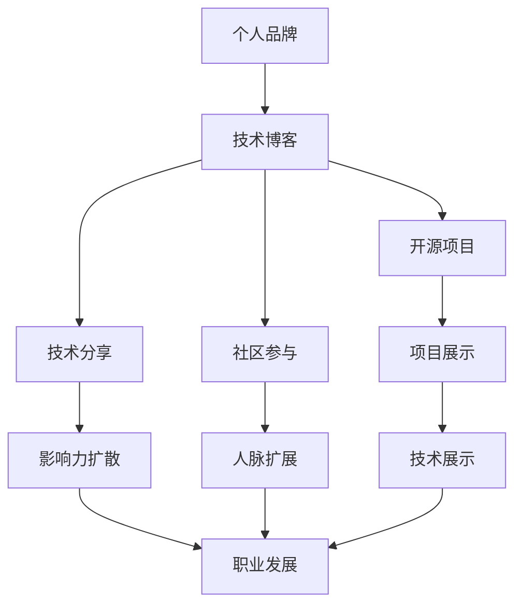

                 

# 程序员如何打造个人品牌IP

> 关键词：个人品牌,技术博客,开源项目,技术分享,社区参与

## 1. 背景介绍

在当今数字化时代，个人品牌IP（Intellectual Property）的建立对于程序员来说愈发重要。无论是在求职、提升影响力，还是在技术交流中脱颖而出，一个独特且有吸引力的个人品牌都能起到举足轻重的作用。然而，如何打造和维护个人品牌IP，却是一个复杂且多维度的课题。本文将从多个角度深入探讨，提供一份全面的指南，帮助程序员打造个人品牌IP。

## 2. 核心概念与联系

在深入讨论个人品牌IP的构建之前，我们首先需要理解几个核心概念，以及它们之间如何相互关联：

- **个人品牌**：指个人在特定领域（通常是技术领域）中形成的独特形象和声誉。个人品牌不仅包括专业技能，还包括态度、价值观、沟通方式等软实力。
- **技术博客**：指程序员个人创建的、主要围绕技术主题的在线内容平台。博客是个人品牌的重要组成部分，是技术交流和知识分享的重要渠道。
- **开源项目**：指程序员贡献给开源社区的项目代码，通常通过GitHub等平台托管。开源项目展示了程序员的技术能力和协作精神，也是个人品牌的重要证明。
- **技术分享**：指程序员通过演讲、培训、教学等方式，将自身的技术知识和经验分享给他人。分享可以是正式的，如线上/线下讲座，也可以是非正式的，如技术博客文章。
- **社区参与**：指程序员在技术社区中积极互动，包括回答问题、参加讨论、组织活动等。社区参与有助于扩大个人影响力，积累人脉资源。

以下是一个简单的Mermaid流程图，展示了这些概念之间的联系：



## 3. 核心算法原理 & 具体操作步骤

### 3.1 算法原理概述

个人品牌IP的建立，本质上是一个长期、持续的自我营销过程。这一过程涉及多方面的策略，包括内容创作、社交互动、专业展示等。在这一过程中，算法原理主要涉及信息的生成、传播、反馈和优化。

具体来说，个人品牌IP的构建包括两个主要阶段：

1. **内容生成与优化**：个人通过技术博客、开源项目等形式，持续输出高质量的内容和技术解决方案。
2. **社交互动与反馈**：通过社区参与、技术分享等方式，与同行业者进行互动，并根据反馈持续优化内容和技术。

### 3.2 算法步骤详解

#### 步骤1: 内容生成与优化

- **技术博客**：选择感兴趣的领域，定期发布高质量的博客文章。文章应包括技术讲解、案例分析、代码实现等，确保内容深度和广度兼具。
- **开源项目**：积极贡献代码，尤其是解决实际问题、优化现有项目的项目。同时，维护项目的文档和测试，提升项目的可访问性和易用性。
- **技术分享**：参与线上/线下技术交流会议，发表技术演讲，或者通过教学、培训等形式，将自己的技术经验传授给他人。
- **内容反馈**：关注读者的反馈，及时调整和改进内容，确保其针对性和实用性。

#### 步骤2: 社交互动与反馈

- **社区参与**：在技术社区如GitHub、Stack Overflow、CSDN等积极参与，回答问题、提供代码帮助、组织技术讨论。
- **品牌传播**：利用社交媒体如Twitter、LinkedIn等平台，展示自己的项目和技术成就，扩大影响力。
- **反馈分析**：定期分析社交媒体和社区反馈，总结自身优势和不足，持续改进和优化。

### 3.3 算法优缺点

#### 优点

- **品牌显著性**：通过持续的技术输出和社交互动，能够在技术社区中建立显著的个人品牌。
- **专业能力展示**：高质量的博客文章、开源项目和技术分享能够展示程序员的专业能力。
- **人脉扩展**：积极参与社区和社交媒体，有助于结识更多的行业内人士，拓展人脉资源。

#### 缺点

- **时间成本**：构建个人品牌需要大量的时间和精力投入，可能影响日常工作和生活。
- **竞争激烈**：技术社区内优秀人才众多，个人品牌建立需要持续努力和创新。
- **品牌维护**：建立个人品牌相对容易，但长期维护和持续提升则需要更大的努力。

### 3.4 算法应用领域

个人品牌IP的构建，不仅可以应用于技术职业发展，还适用于各类技术相关领域，如软件开发、数据科学、人工智能等。无论是在高校、企业还是在自由职业者中，个人品牌都能带来积极的影响。

## 4. 数学模型和公式 & 详细讲解 & 举例说明

### 4.1 数学模型构建

个人品牌的影响力可以通过以下数学模型来描述：

$$
\text{品牌影响力} = \text{内容质量} \times \text{互动频率} \times \text{社区曝光率}
$$

其中，内容质量是指博客文章、开源项目的深度和实用性；互动频率是指参与社区讨论和社交媒体互动的频率；社区曝光率是指个人在技术社区中的可见度。

### 4.2 公式推导过程

为了进一步理解上述模型，我们可以进行推导：

- **内容质量**：假设一个博客文章的质量为Q，分为内容深度（D）和实用性（U）两部分。则内容质量Q可以表示为：
$$
Q = D \times U
$$

- **互动频率**：设每月在社区互动次数为F，则每月互动频率为：
$$
F = \frac{互动次数}{月数}
$$

- **社区曝光率**：设每月社区文章浏览量为E，则每月社区曝光率为：
$$
E = \frac{文章浏览量}{月数}
$$

综合以上公式，可以得到个人品牌影响力的计算公式：
$$
品牌影响力 = Q \times F \times E = D \times U \times \frac{互动次数}{月数} \times \frac{文章浏览量}{月数}
$$

### 4.3 案例分析与讲解

以Google的工程师Chris Lattner为例，他通过在博客上分享LLVM编译器的开发经验和教训，以及开源项目OpenAI Gym，逐渐建立起自己在编程语言设计和人工智能领域的品牌影响力。Chris通过持续的高质量输出，吸引了大量读者和社区参与，最终成为业界知名专家。

## 5. 项目实践：代码实例和详细解释说明

### 5.1 开发环境搭建

建立个人品牌IP的过程中，开发环境的选择非常重要。以下是使用Jekyll搭建技术博客的环境配置流程：

1. 安装Ruby：
```bash
gem install bundler
bundle install
```

2. 安装Jekyll：
```bash
gem install jekyll
```

3. 创建一个新的博客：
```bash
jekyll new blog
```

4. 配置和启动Jekyll：
```bash
cd blog
bundle exec jekyll serve
```

### 5.2 源代码详细实现

下面是一个使用Jekyll创建技术博客的代码实现示例：

```html
--- 
layout: post
title: "如何编写高效的C++代码"
tags: ["C++", "高效编程"]
date: 2023-01-01 00:00:00 -0800
---

<h1>如何编写高效的C++代码</h1>
<p>在编写C++代码时，有许多技巧可以提高代码的性能和可读性。本文将介绍几个实用的技巧。</p>
```

### 5.3 代码解读与分析

上述代码中，`layout`定义了博客文章的布局，`title`和`tags`定义了文章标题和标签，`date`定义了发布日期。代码中使用了Jekyll的Markdown语法，使得文章结构清晰、易于阅读。

### 5.4 运行结果展示

启动Jekyll服务器后，在浏览器中访问`http://localhost:4000`，即可看到我们创建的博客文章。

## 6. 实际应用场景

### 6.1 技术招聘

在技术招聘中，个人品牌IP能够显著提升候选人的竞争力。具备个人品牌的候选人不仅能够通过简历筛选，还能够通过技术博客和开源项目的展示，吸引面试官的注意。

### 6.2 技术交流与合作

个人品牌IP使得技术交流更加顺畅。拥有品牌IP的程序员能够在技术社区中更容易结识同领域的专业人士，进行技术交流和合作。

### 6.3 知识传播与影响

技术博客和技术分享使得程序员能够将自身知识和经验传播给更广泛的受众，提升个人在技术社区中的影响力。

### 6.4 未来应用展望

未来，随着技术社区和社交媒体的不断发展，个人品牌IP的构建将更加便捷和高效。同时，AI和大数据技术的应用，也将帮助程序员更准确地分析自身的影响力和发展趋势，实现更智能化的个人品牌管理。

## 7. 工具和资源推荐

### 7.1 学习资源推荐

- **在线课程**：如Coursera、Udemy等平台上的编程与技术课程，提供系统的学习路径和资源。
- **博客平台**：如Medium、CSDN、TechCrunch等，提供高质量的技术文章和社区互动环境。
- **开源项目平台**：如GitHub、GitLab等，提供丰富的开源项目资源和协作工具。

### 7.2 开发工具推荐

- **博客平台**：如Jekyll、WordPress等，提供博客搭建和内容管理功能。
- **版本控制**：如Git、SVN等，提供代码版本控制和协作工具。
- **协作平台**：如Slack、Microsoft Teams等，提供团队协作和沟通工具。

### 7.3 相关论文推荐

- **《数字时代中的个人品牌》**：探讨了数字时代下个人品牌的构建和维护策略。
- **《开源社区中的个人品牌构建》**：分析了开源社区中个人品牌的建立和管理。
- **《技术博客的兴起与影响》**：研究了技术博客在技术传播中的作用和效果。

## 8. 总结：未来发展趋势与挑战

### 8.1 研究成果总结

个人品牌IP的构建是一个长期且持续的过程。通过高质量的内容输出、积极的社会互动，以及有效的品牌维护，程序员能够在技术社区中建立显著的影响力。然而，这一过程需要时间和精力的投入，并面临激烈的竞争和维护挑战。

### 8.2 未来发展趋势

1. **智能化管理**：AI和大数据分析技术将帮助程序员更高效地分析自身的影响力和发展趋势。
2. **多元化展示**：除了技术博客和开源项目，视频、播客等新兴形式将进一步丰富个人品牌展示渠道。
3. **社区与社交媒体融合**：技术社区和社交媒体的深度融合将带来更广泛的传播效果。

### 8.3 面临的挑战

1. **时间与资源限制**：构建个人品牌需要大量时间和精力，可能影响日常工作和生活。
2. **品牌一致性**：保持个人品牌的一致性和专业性，避免过度商业化或偏离技术核心。
3. **内容真实性**：避免虚假宣传和夸大其词，保持内容的真实性和可靠性。

### 8.4 研究展望

未来，个人品牌IP的构建将更加依赖技术手段，如AI辅助内容创作、数据驱动品牌管理等。同时，个人品牌的建立将更多地与技术创新、社会责任等价值观相结合，成为程序员综合素质的一部分。

## 9. 附录：常见问题与解答

**Q1: 如何平衡个人品牌和技术工作？**

A: 建立一个明确的时间规划，确保在有限的时间内有效利用资源。比如，可以在周末或晚上专注于个人品牌建设，不影响日常工作。

**Q2: 如何选择合适的博客平台？**

A: 选择与技术领域相关、用户活跃的博客平台，如Medium、GitHub Pages等。同时，考虑平台的易用性和SEO优化情况。

**Q3: 如何提升社交媒体互动效果？**

A: 积极参与技术社区讨论，及时回复评论和问题，提供有价值的见解和解决方案。同时，分享个人学习心得和项目进展，增加曝光率。

**Q4: 如何保持博客内容的质量和更新？**

A: 定期检查博客文章和开源项目，确保其内容的时效性和准确性。同时，设置内容更新计划，保持持续的内容输出。

**Q5: 如何利用AI技术辅助个人品牌构建？**

A: 利用自然语言处理技术进行内容推荐和优化，利用数据分析技术进行用户行为分析，提升个人品牌影响力。

---

作者：禅与计算机程序设计艺术 / Zen and the Art of Computer Programming

