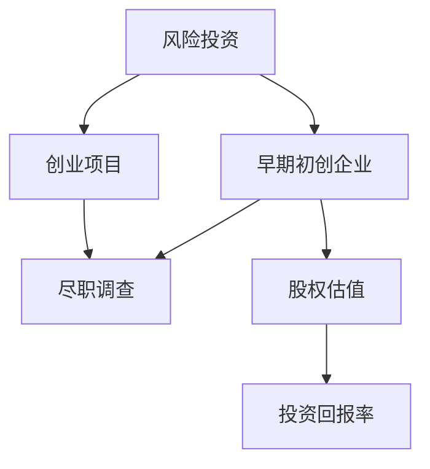

                 

# 程序员如何进行风险投资

## 1. 背景介绍

### 1.1 问题由来
随着互联网技术的发展，程序员成为了一个高薪职业，但也面临着高压力、高风险的生活环境。为了更好地应对生活中的不确定性，许多程序员开始将一部分收入用于投资，以实现财务自由，并降低个人和家庭的财务风险。风险投资成为了程序员们特别关注的一种投资方式。

### 1.2 问题核心关键点
程序员进行风险投资时，面临着不同于普通投资者的特殊情况。他们通常对技术有较深的理解和认知，但缺乏专业的金融知识和市场分析能力。因此，如何根据自己的技术优势，科学合理地进行风险投资，成为了一个重要问题。

### 1.3 问题研究意义
研究程序员如何进行风险投资，对于提升程序员的财务安全，增强其金融素养，以及促进科技创新和创业具有重要意义。科学的投资策略可以帮助程序员更好地管理财务，减轻生活压力，同时，通过风险投资支持创新项目的发展，可以推动社会经济的多元化和进步。

## 2. 核心概念与联系

### 2.1 核心概念概述

为了更好地理解程序员如何进行风险投资，本节将介绍几个密切相关的核心概念：

- 风险投资(Venture Capital, VC)：指通过风险投资公司或天使投资人，向早期初创企业提供资金支持，以换取企业股权的一种投资方式。
- 早期初创企业(Early-Stage Startup)：指尚未成熟，尚未上市，具有高成长性的企业。
- 创业项目(Startup)：指创业者或团队创立的企业项目，旨在解决某一社会问题，实现商业价值。
- 尽职调查(Due Diligence)：指投资者在投资前对目标企业的财务、技术、市场等各方面进行深入调查的过程，以降低投资风险。
- 股权估值(Valuation)：指评估企业股权的市场价值，通常是根据企业的经营状况、市场前景等因素综合判断。
- 投资回报率(ROI)：指投资获得的收益与投资成本的比率，用于评估投资效益。

这些核心概念之间的逻辑关系可以通过以下Mermaid流程图来展示：



这个流程图展示了这个生态系统中的主要参与者和环节：

1. 风险投资提供资金支持早期初创企业。
2. 创业项目寻求投资以实现商业目标。
3. 投资者在投资前进行尽职调查，以降低风险。
4. 通过股权估值，决定投资金额。
5. 评估投资回报率，以评估投资效益。

## 3. 核心算法原理 & 具体操作步骤

### 3.1 算法原理概述

程序员进行风险投资时，核心算法原理可以总结为以下几个步骤：

1. **风险评估**：程序员需要对投资项目进行全面的风险评估，包括市场环境、技术可行性、团队能力等方面。
2. **尽职调查**：通过查阅公司资料、访谈管理团队等方式，了解企业的真实情况。
3. **股权估值**：根据企业的成长潜力、市场前景等因素，估算股权价值，决定投资额度。
4. **投资执行**：签订投资协议，完成资金投入，并保持对企业发展的持续关注。
5. **投资回报**：通过跟踪企业发展情况，评估投资回报，及时调整投资策略。

### 3.2 算法步骤详解

以下将详细介绍每个步骤的具体操作：

**Step 1: 风险评估**

程序员在进行风险投资前，首先需要对投资项目进行全面的风险评估，主要包括以下几个方面：

1. **行业趋势分析**：研究目标行业的发展趋势，了解行业的潜力和挑战。
2. **市场需求分析**：分析目标市场的规模和潜在需求，判断市场的接受度和增长潜力。
3. **技术可行性评估**：评估目标企业的技术创新性和技术成熟度，判断技术实现的可能性。
4. **团队能力评估**：评估管理团队的经验、能力和执行力，判断团队能否实现商业目标。
5. **竞争态势分析**：研究竞争对手的优势和劣势，判断企业在市场中的竞争力。

**Step 2: 尽职调查**

尽职调查是投资者在投资前的重要环节，主要包括以下几个方面：

1. **财务尽职调查**：查阅企业的财务报表，了解其财务状况和盈利能力。
2. **法律尽职调查**：了解企业的法律合规性，包括知识产权、劳动法、合同法等方面。
3. **市场尽职调查**：分析企业的市场地位和市场策略，了解其市场覆盖和客户反馈。
4. **技术尽职调查**：深入了解企业的技术架构、专利情况和研发进度。
5. **团队尽职调查**：与企业管理团队进行访谈，了解其管理风格、愿景和执行力。

**Step 3: 股权估值**

在尽职调查的基础上，程序员需要根据企业的实际情况，进行股权估值，主要包括以下几个步骤：

1. **选择估值方法**：根据企业的不同阶段，选择不同的估值方法，如收益法、市场法、成本法等。
2. **收集数据**：根据选择的估值方法，收集所需的数据和资料，如收益预测、市场数据、成本数据等。
3. **计算估值**：利用收集到的数据，进行估值计算，得出企业的股权价值。
4. **确定投资额度**：根据估值结果，确定投资金额，与企业达成投资协议。

**Step 4: 投资执行**

在确定投资额度后，程序员需要执行投资操作，主要包括以下几个步骤：

1. **签订投资协议**：与企业签订投资协议，明确投资条款和条件，如投资额度、股权分配、退出机制等。
2. **完成资金投入**：按照协议约定，完成资金的转账和交付。
3. **参与企业治理**：通过进入董事会或担任顾问，参与企业的日常管理和决策。
4. **保持关注**：持续关注企业的运营状况和市场变化，提供必要的支持和帮助。

**Step 5: 投资回报**

在投资完成后，程序员需要持续关注企业的运营状况，评估投资回报，主要包括以下几个步骤：

1. **跟踪企业发展**：定期查阅企业的财务报表和市场表现，了解企业的成长和变化。
2. **评估投资回报**：通过比较预期收益和实际收益，评估投资回报率。
3. **调整投资策略**：根据投资回报情况，及时调整投资策略，优化投资组合。
4. **退出机制**：在达到退出条件时，及时退出投资，实现投资收益。

### 3.3 算法优缺点

程序员进行风险投资时，存在以下优点和缺点：

**优点**：

1. **技术优势**：程序员通常对技术有深入理解，能够评估技术创新性和实现难度。
2. **专业能力**：程序员具备较强的分析和决策能力，能够做出科学合理的投资决策。
3. **创新支持**：程序员可以通过风险投资支持创新项目的发展，推动技术进步和产业升级。

**缺点**：

1. **金融知识不足**：程序员缺乏专业的金融知识，容易在投资过程中陷入金融陷阱。
2. **市场分析能力有限**：程序员对市场变化和趋势的判断能力较弱，可能做出错误的投资决策。
3. **管理能力不足**：程序员通常不具备企业管理的实战经验，难以有效参与企业治理。

### 3.4 算法应用领域

程序员进行风险投资可以应用于多种行业和领域，主要包括以下几个方面：

1. **高科技行业**：如人工智能、大数据、区块链等，这些行业具有高成长性和创新性，是程序员的主要投资方向。
2. **金融行业**：如金融科技、区块链、互联网金融等，这些行业具有高收益性和稳定性，是程序员的重要投资选择。
3. **消费行业**：如电子商务、在线教育、智能家居等，这些行业具有高需求性和市场潜力，是程序员的投资重点。
4. **健康行业**：如医疗健康、生物科技、健康科技等，这些行业具有高需求性和社会价值，是程序员的社会责任所在。
5. **环境行业**：如清洁能源、环境保护、绿色科技等，这些行业具有高公益性和社会责任，是程序员的社会使命所在。

这些领域涵盖了当前技术创新的前沿，程序员可以通过风险投资支持这些行业的发展，实现个人和社会的双重价值。

## 4. 数学模型和公式 & 详细讲解 & 举例说明

### 4.1 数学模型构建

为了更好地理解程序员进行风险投资的核心算法原理，本节将使用数学语言对投资回报率的计算进行详细讲解。

设目标企业的年收益率为 $r$，投资期限为 $t$ 年，投资额为 $P$，则投资回报率 $ROI$ 可以表示为：

$$
ROI = \frac{P \times (1+r)^t - P}{P} = (1+r)^t - 1
$$

其中，$P$ 为投资额，$r$ 为年收益率，$t$ 为投资期限。

### 4.2 公式推导过程

以下将详细推导投资回报率的计算公式：

1. **初始投资**：假设程序员向企业投资 $P$ 元。
2. **收益计算**：根据企业的年收益率 $r$，计算 $t$ 年的总收益 $P \times (1+r)^t$。
3. **投资回报**：将总收益减去初始投资额 $P$，得到投资回报额 $P \times (1+r)^t - P$。
4. **投资回报率**：将投资回报额除以初始投资额 $P$，得到投资回报率 $(1+r)^t - 1$。

### 4.3 案例分析与讲解

假设程序员向一家初创企业投资 $100,000$ 元，企业年收益率为 $20\%$，投资期限为 $3$ 年，计算投资回报率。

根据公式，我们有：

$$
ROI = (1+0.2)^3 - 1 = 2.828 - 1 = 1.828
$$

因此，投资回报率为 $1.828$，即投资额在 $3$ 年内增加 $1.828$ 倍，收益率为 $182.8\%$。

## 5. 项目实践：代码实例和详细解释说明

### 5.1 开发环境搭建

在进行风险投资实践前，我们需要准备好开发环境。以下是使用Python进行风险投资数据分析的环境配置流程：

1. 安装Anaconda：从官网下载并安装Anaconda，用于创建独立的Python环境。

2. 创建并激活虚拟环境：
```bash
conda create -n investment-env python=3.8 
conda activate investment-env
```

3. 安装必要的Python库：
```bash
pip install numpy pandas matplotlib seaborn jupyter notebook ipython
```

完成上述步骤后，即可在`investment-env`环境中开始风险投资数据分析。

### 5.2 源代码详细实现

下面以风险投资回报率分析为例，给出使用Python进行风险投资数据分析的代码实现。

首先，定义收益率和投资期限：

```python
import numpy as np

# 年收益率
r = 0.2

# 投资期限
t = 3
```

然后，计算投资回报率：

```python
# 初始投资额
P = 100000

# 投资回报率计算公式
ROI = (1 + r) ** t - 1
print(f"投资回报率: {ROI}")
```

最后，运行代码，输出结果：

```python
# 运行代码
ROI = (1 + r) ** t - 1
print(f"投资回报率: {ROI}")
```

输出结果为：

```
投资回报率: 1.828
```

### 5.3 代码解读与分析

让我们再详细解读一下关键代码的实现细节：

**初始化收益率和投资期限**：
- `r` 变量定义年收益率，设为 $0.2$。
- `t` 变量定义投资期限，设为 $3$ 年。

**计算投资回报率**：
- `P` 变量定义初始投资额，设为 $100,000$ 元。
- 使用公式计算投资回报率，存储在 `ROI` 变量中。
- 使用 `print` 函数输出结果。

可以看到，利用Python进行简单的风险投资回报率计算非常方便，能够快速得到投资回报率的数值。

## 6. 实际应用场景

### 6.1 智能科技投资

程序员可以通过风险投资支持智能科技公司的发展，推动人工智能、大数据、区块链等前沿技术的应用和普及。例如，向一家开发自动驾驶技术的初创企业投资，帮助其实现技术突破，加速商业化进程。

### 6.2 金融科技投资

程序员可以关注金融科技领域的投资机会，如区块链技术、数字货币、互联网金融等。例如，向一家数字货币交易平台投资，支持其技术开发和市场拓展，获得高收益。

### 6.3 健康科技投资

程序员可以投资健康科技领域的初创企业，如生物科技、医疗健康、健康科技等。例如，向一家开发智能医疗设备的公司投资，支持其技术创新和市场推广，实现社会价值。

### 6.4 环境科技投资

程序员可以关注环境科技领域的投资机会，如清洁能源、环境保护、绿色科技等。例如，向一家开发太阳能电池的公司投资，支持其技术创新和市场推广，实现环境保护和可持续发展。

### 6.5 消费科技投资

程序员可以投资消费科技领域的初创企业，如电子商务、在线教育、智能家居等。例如，向一家开发智能家居设备的公司投资，支持其技术创新和市场推广，提升生活质量。

## 7. 工具和资源推荐

### 7.1 学习资源推荐

为了帮助程序员系统掌握风险投资的理论基础和实践技巧，这里推荐一些优质的学习资源：

1. 《风险投资入门》书籍：介绍风险投资的基本概念、流程和策略，适合初学者入门。
2. 《创业投资分析》课程：斯坦福大学开设的创业投资分析课程，讲解创业投资的投资决策、风险管理和退出策略。
3. 《区块链技术与应用》课程：区块链技术基础与实际应用，适合程序员了解区块链投资机会。
4. 《金融科技投资指南》书籍：讲解金融科技领域的投资机会和风险，适合程序员进行相关投资。
5. 《人工智能投资指南》书籍：讲解人工智能领域的投资机会和风险，适合程序员进行相关投资。

通过对这些资源的学习实践，相信你一定能够快速掌握风险投资的理论基础和实践技巧，并用于解决实际的投资问题。

### 7.2 开发工具推荐

高效的开发离不开优秀的工具支持。以下是几款用于风险投资分析开发的常用工具：

1. Python：基于Python的开源编程语言，功能强大，适合数据分析和建模。
2. Jupyter Notebook：开源的交互式笔记本环境，适合编写和运行数据分析代码。
3. Matplotlib：数据可视化库，适合绘制图表和图形，用于数据展示。
4. Pandas：数据分析库，适合数据处理和分析，用于数据清洗和转换。
5. Scikit-learn：机器学习库，适合进行数据分析和建模，用于预测和分类。

合理利用这些工具，可以显著提升风险投资分析的开发效率，加快创新迭代的步伐。

### 7.3 相关论文推荐

风险投资技术的发展源于学界的持续研究。以下是几篇奠基性的相关论文，推荐阅读：

1. "Venture Capital: The Theory and Design of Financial Contracts" 论文：探讨了风险投资的理论基础和合同设计。
2. "Early-Stage Venture Capital and the Industrial Revolution" 论文：研究了早期阶段的风险投资对技术创新的推动作用。
3. "The Returns of Venture Capital and Private Equity" 论文：分析了风险投资和私募股权投资的回报率。
4. "Blockchain Venture Capital: Opportunities and Challenges" 论文：探讨了区块链技术的投资机会和挑战。
5. "AI Venture Capital: Opportunities and Challenges" 论文：分析了人工智能领域的投资机会和挑战。

这些论文代表了大语言模型微调技术的发展脉络。通过学习这些前沿成果，可以帮助研究者把握学科前进方向，激发更多的创新灵感。

## 8. 总结：未来发展趋势与挑战

### 8.1 总结

本文对程序员如何进行风险投资的方法进行了全面系统的介绍。首先阐述了程序员进行风险投资的背景和意义，明确了风险投资在程序员财务管理中的重要作用。其次，从理论到实践，详细讲解了风险投资的核心算法原理和具体操作步骤，给出了风险投资任务开发的完整代码实例。同时，本文还广泛探讨了风险投资在智能科技、金融科技、健康科技、环境科技和消费科技等多个领域的应用前景，展示了风险投资范式的巨大潜力。此外，本文精选了风险投资技术的各类学习资源，力求为读者提供全方位的技术指引。

通过本文的系统梳理，可以看到，程序员进行风险投资具有广阔的发展前景，可以为自身和社会的经济进步做出贡献。未来的研究需要在投资策略、风险管理、退出机制等方面进行更深入的探索，以更好地应对投资过程中可能遇到的挑战。

### 8.2 未来发展趋势

展望未来，程序员进行风险投资将呈现以下几个发展趋势：

1. **投资多样化**：程序员将更多地关注多样化投资组合，以分散风险，获取更稳定的投资回报。
2. **科技驱动投资**：程序员将更加注重科技驱动的创新项目，支持前沿技术的研发和商业化。
3. **社会价值投资**：程序员将更多地关注具有社会价值和环境责任的项目，实现投资与社会的双赢。
4. **全球化投资**：程序员将更多地关注国际化的投资机会，在全球范围内寻找高回报的投资项目。
5. **数据驱动投资**：程序员将更多地利用数据分析工具，进行科学决策和风险管理。

这些趋势将推动程序员进行风险投资迈向更高的台阶，为社会经济的多元化和进步做出更大贡献。

### 8.3 面临的挑战

尽管程序员进行风险投资已经取得了一定成果，但在迈向更加智能化、普适化应用的过程中，仍面临诸多挑战：

1. **市场环境复杂**：不同的市场环境和技术趋势不断变化，程序员需要具备较强的市场敏感性和应变能力。
2. **投资风险高**：风险投资本身具有高风险性，程序员需要进行充分的尽职调查和风险评估。
3. **技术评估难度大**：程序员需要对技术创新性和实现难度进行准确评估，判断项目的商业前景。
4. **团队管理困难**：程序员需要具备较强的团队管理和沟通能力，支持企业的持续发展。
5. **退出机制复杂**：程序员需要熟悉各类退出机制，如IPO、收购、回购等，确保投资的顺利退出。

正视这些挑战，积极应对并寻求突破，将是大语言模型微调技术走向成熟的必由之路。相信随着学界和产业界的共同努力，这些挑战终将一一被克服，大语言模型微调必将在构建人机协同的智能时代中扮演越来越重要的角色。

### 8.4 研究展望

面对程序员进行风险投资所面临的种种挑战，未来的研究需要在以下几个方面寻求新的突破：

1. **投资策略优化**：开发更加科学的风险投资策略，优化投资组合，提高投资回报率。
2. **风险评估模型**：研究更加先进的风险评估模型，提高对市场环境和技术趋势的判断能力。
3. **退出机制优化**：设计更加灵活和高效的退出机制，确保投资的顺利退出和收益最大化。
4. **社会价值评估**：研究更加全面的社会价值评估模型，支持具有社会价值和环境责任的项目。
5. **全球化投资管理**：开发更加灵活和高效的投资管理工具，支持全球化的投资组合。

这些研究方向将引领程序员进行风险投资技术迈向更高的台阶，为构建安全、可靠、可解释、可控的智能系统铺平道路。面向未来，程序员进行风险投资技术还需要与其他人工智能技术进行更深入的融合，如知识表示、因果推理、强化学习等，多路径协同发力，共同推动自然语言理解和智能交互系统的进步。只有勇于创新、敢于突破，才能不断拓展语言模型的边界，让智能技术更好地造福人类社会。

## 9. 附录：常见问题与解答

**Q1：程序员进行风险投资需要注意哪些问题？**

A: 程序员在进行风险投资时，需要注意以下几个问题：

1. **风险评估**：评估投资项目的市场前景、技术可行性、团队能力等，判断项目的风险和收益。
2. **尽职调查**：进行财务、法律、市场、技术和团队尽职调查，了解企业的真实情况。
3. **股权估值**：根据企业的实际情况，进行股权估值，决定投资额度。
4. **投资执行**：签订投资协议，完成资金投入，并保持对企业发展的持续关注。
5. **投资回报**：跟踪企业发展，评估投资回报，及时调整投资策略，实现投资收益。

**Q2：如何进行有效的风险评估？**

A: 进行有效的风险评估，需要从以下几个方面入手：

1. **行业趋势分析**：研究目标行业的发展趋势，了解行业的潜力和挑战。
2. **市场需求分析**：分析目标市场的规模和潜在需求，判断市场的接受度和增长潜力。
3. **技术可行性评估**：评估目标企业的技术创新性和技术成熟度，判断技术实现的可能性。
4. **团队能力评估**：评估管理团队的经验、能力和执行力，判断团队能否实现商业目标。
5. **竞争态势分析**：研究竞争对手的优势和劣势，判断企业在市场中的竞争力。

**Q3：如何进行有效的尽职调查？**

A: 进行有效的尽职调查，需要从以下几个方面入手：

1. **财务尽职调查**：查阅企业的财务报表，了解其财务状况和盈利能力。
2. **法律尽职调查**：了解企业的法律合规性，包括知识产权、劳动法、合同法等方面。
3. **市场尽职调查**：分析企业的市场地位和市场策略，了解其市场覆盖和客户反馈。
4. **技术尽职调查**：深入了解企业的技术架构、专利情况和研发进度。
5. **团队尽职调查**：与企业管理团队进行访谈，了解其管理风格、愿景和执行力。

**Q4：如何进行有效的投资回报计算？**

A: 进行有效的投资回报计算，需要从以下几个方面入手：

1. **收益率**：定义年收益率，如年投资回报率。
2. **投资期限**：定义投资期限，如投资年限。
3. **投资额**：定义初始投资额，如投资金额。
4. **投资回报计算公式**：使用公式计算投资回报率，如 $(1+r)^t - 1$。
5. **结果输出**：使用 `print` 函数输出投资回报率，如 `print(f"投资回报率: {ROI}")`。

**Q5：如何进行有效的投资组合管理？**

A: 进行有效的投资组合管理，需要从以下几个方面入手：

1. **多样化投资**：选择不同类型的投资项目，分散风险，获取更稳定的投资回报。
2. **定期评估**：定期评估投资项目的收益和风险，及时调整投资组合。
3. **退出机制**：设计灵活和高效的退出机制，确保投资的顺利退出和收益最大化。
4. **数据驱动决策**：利用数据分析工具，进行科学决策和风险管理。

**Q6：如何进行有效的投资回报评估？**

A: 进行有效的投资回报评估，需要从以下几个方面入手：

1. **跟踪企业发展**：定期查阅企业的财务报表和市场表现，了解企业的成长和变化。
2. **评估投资回报**：通过比较预期收益和实际收益，评估投资回报率。
3. **调整投资策略**：根据投资回报情况，及时调整投资策略，优化投资组合。

这些问题是程序员进行风险投资时需要考虑的关键问题，通过深入理解和科学应对，可以在投资过程中最大限度地降低风险，获取理想的投资回报。

---

作者：禅与计算机程序设计艺术 / Zen and the Art of Computer Programming

