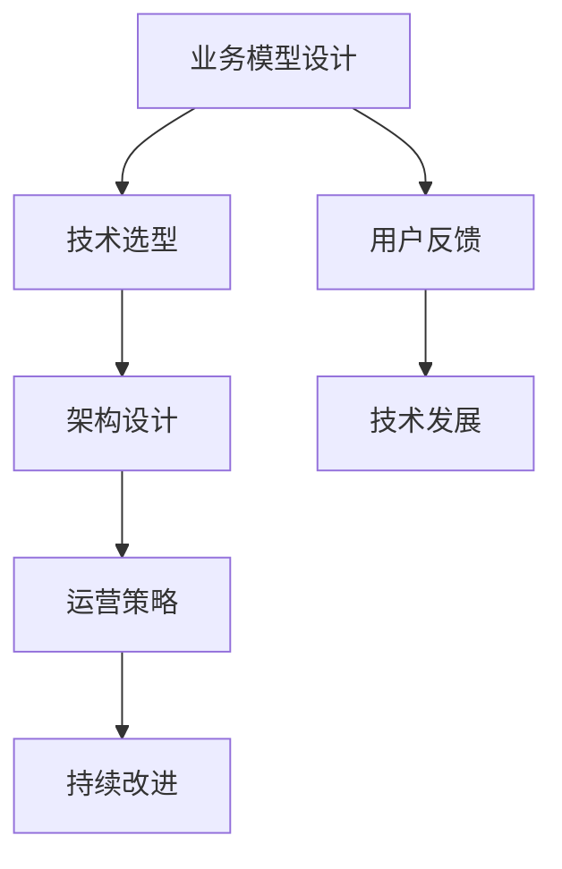

                 

# 程序员的被动收入：构建与维护

程序员的被动收入，也称为副业或投资收入，是指除了日常工作之外，通过其他渠道获得的收入。这种收入能够帮助程序员实现财务自由，提高生活质量，同时还能降低职业风险。本文将详细介绍如何构建与维护程序员的被动收入，涵盖业务模型构建、技术选型、运营策略等多个方面，旨在为有意愿实现被动收入的程序员提供实用指导。

## 1. 背景介绍

### 1.1 问题由来
近年来，随着互联网和人工智能技术的飞速发展，程序员的收入水平和工作环境得到了显著改善。然而，随着科技行业的竞争日益激烈，很多程序员面临较大的职业风险和压力。在这种情况下，构建与维护被动收入成为了许多程序员的重要目标。通过开发应用程序、参与开源项目、撰写技术博客等方式，程序员可以在不影响日常工作的情况下，获取稳定的额外收入。

### 1.2 问题核心关键点
构建与维护被动收入的关键点包括：
- **业务模型设计**：确定被动收入的来源和盈利模式。
- **技术选型与架构**：选择合适的技术栈，设计高效的架构，保证被动收入系统的稳定性和扩展性。
- **运营策略**：制定有效的推广和运营策略，吸引用户，提高收入。
- **持续改进**：根据用户反馈和技术发展，不断优化产品和服务，保持市场竞争力。

### 1.3 问题研究意义
构建与维护程序员的被动收入，具有以下重要意义：
- **财务自由**：通过被动收入，程序员可以实现财务自由，提高生活质量，降低生活压力。
- **职业安全感**：被动收入提供了一种额外的收入来源，降低了程序员对日常工作的依赖，增强了职业安全感。
- **技术成长**：构建被动收入项目，需要不断学习新技术和工具，这有助于提升程序员的技术水平和综合能力。
- **创新与创业**：通过被动收入项目，程序员可以积累经验，探索新的商业机会，为未来的创业打下基础。

## 2. 核心概念与联系

### 2.1 核心概念概述

为了更好地理解如何构建与维护程序员的被动收入，我们首先介绍几个核心概念：

- **被动收入**：指除了日常工作之外，通过其他渠道获得的稳定收入，如租金收入、版权收入、广告收入等。
- **业务模型**：定义被动收入来源和盈利方式，如App销售、订阅服务、内容付费等。
- **技术栈**：选择适合被动收入项目的技术栈，如后端使用Python，前端使用React等。
- **架构设计**：设计高效、可扩展的架构，保证系统的稳定性和扩展性。
- **运营策略**：制定推广和运营策略，吸引用户，提高收入。
- **持续改进**：根据用户反馈和技术发展，不断优化产品和服务。

这些核心概念之间的逻辑关系可以通过以下Mermaid流程图来展示：



这个流程图展示了构建与维护程序员被动收入的关键步骤及其关联：

1. 确定业务模型，确定被动收入的来源和盈利方式。
2. 选择合适的技术栈，设计高效的架构。
3. 制定有效的推广和运营策略，吸引用户。
4. 根据用户反馈和技术发展，不断优化产品和服务。

这些概念共同构成了程序员被动收入的构建与维护框架，为程序员实现财务自由和职业成长提供了指导。

## 3. 核心算法原理 & 具体操作步骤

### 3.1 算法原理概述

构建与维护程序员的被动收入，本质上是一个多学科交叉的过程，涉及业务模型设计、技术选型、架构设计、运营策略等多个方面。其核心思想是通过综合运用这些方法，实现被动收入项目的持续稳定运营，不断创造收入。

### 3.2 算法步骤详解

以下是构建与维护程序员被动收入的详细步骤：

**Step 1: 业务模型设计**

1. **识别被动收入来源**：确定被动收入的来源，如App销售、广告收入、内容付费等。
2. **确定盈利模式**：根据不同来源，制定相应的盈利模式，如订阅制、一次性付费、免费增值服务等。
3. **市场调研**：进行市场调研，了解目标用户的痛点和需求，确定产品定位和差异化策略。

**Step 2: 技术选型与架构设计**

1. **选择合适的技术栈**：根据业务需求，选择合适的编程语言和技术框架，如Python、React、MySQL等。
2. **设计架构**：设计高效、可扩展的架构，如微服务架构、事件驱动架构等，保证系统的稳定性和扩展性。
3. **选型组件化**：将项目分解为可复用的组件，提高开发效率和代码维护性。

**Step 3: 运营策略**

1. **市场推广**：通过社交媒体、SEO、SEM等手段，进行市场推广，吸引潜在用户。
2. **用户留存**：通过优秀的用户体验、持续的产品迭代，提高用户留存率。
3. **收入提升**：通过数据分析和市场反馈，优化价格策略和推广策略，提升收入。

**Step 4: 持续改进**

1. **用户反馈**：收集用户反馈，了解用户需求和痛点，指导产品迭代。
2. **技术发展**：关注技术发展趋势，引入新技术和新工具，提升系统性能。
3. **市场调整**：根据市场变化和竞争态势，及时调整业务策略和运营策略。

### 3.3 算法优缺点

构建与维护程序员的被动收入具有以下优点：
1. **财务自由**：被动收入提供了一种额外的收入来源，帮助程序员实现财务自由，降低生活压力。
2. **职业安全感**：被动收入降低了程序员对日常工作的依赖，增强了职业安全感。
3. **技术成长**：构建被动收入项目，需要不断学习新技术和工具，有助于提升程序员的技术水平和综合能力。
4. **创新与创业**：通过被动收入项目，程序员可以积累经验，探索新的商业机会，为未来的创业打下基础。

同时，该方法也存在一些局限性：
1. **时间和精力投入**：构建与维护被动收入需要投入大量时间和精力，可能会影响日常工作。
2. **市场风险**：被动收入项目面临市场竞争和用户需求变化，可能存在较高的市场风险。
3. **技术难度**：不同领域的技术栈和技术要求不同，对程序员的技术能力提出了更高的要求。
4. **资源需求**：被动收入项目需要一定的资源投入，如服务器、带宽、开发工具等。

尽管存在这些局限性，但整体而言，构建与维护程序员的被动收入仍是一种值得探索的途径，能够显著提升程序员的生活质量和职业发展潜力。

### 3.4 算法应用领域

构建与维护程序员的被动收入方法，适用于多种领域和场景，例如：

- **移动应用开发**：开发具有潜在用户规模的应用程序，如学习应用、健身应用等。
- **在线教育**：提供在线课程和教育服务，如编程教育、数据分析教育等。
- **内容创作**：通过撰写技术博客、录制技术视频等方式，获得广告收入、流量收入等。
- **技术咨询**：提供技术咨询和解决方案，帮助企业解决技术问题，获得咨询服务费。
- **开源项目**：参与和维护开源项目，获取社区支持和贡献奖励。

除了上述这些经典领域外，程序员还可以通过探索新的商业模式和市场机会，拓展被动收入的来源。

## 4. 数学模型和公式 & 详细讲解 & 举例说明

### 4.1 数学模型构建

在构建与维护程序员的被动收入过程中，需要构建多个数学模型，如收入模型、用户增长模型、成本控制模型等。以下以一个简单的收入模型为例进行说明。

假设被动收入项目每月收入为 $I$，成本为 $C$，用户数 $U$，单个用户每月收入 $R$，则收入模型可以表示为：

$$
I = U \times R - C
$$

在实践中，我们需要根据具体业务需求，构建更加复杂和精确的数学模型。

### 4.2 公式推导过程

以用户增长模型为例，假设每月新用户数为 $N$，现有用户数 $U_0$，则下月用户数 $U_1$ 可以表示为：

$$
U_1 = U_0 + N
$$

通过多次迭代，可以计算出未来任意时间点的用户数 $U_t$：

$$
U_t = U_{t-1} + N
$$

利用递推公式，可以求解任意时间点的用户数。

### 4.3 案例分析与讲解

假设一个程序员开发了一款在线学习应用，每月成本为5000元，每个用户每月支付10元，每月新增1000个用户，则收入模型和用户增长模型可以分别表示为：

$$
I = U \times 10 - 5000
$$

$$
U_{t+1} = U_t + 1000
$$

假设第一个月有500个用户，则第二个月有1500个用户，第三个月有2500个用户。每月收入分别为：

$$
I_1 = 500 \times 10 - 5000 = 0
$$

$$
I_2 = 1500 \times 10 - 5000 = 10000
$$

$$
I_3 = 2500 \times 10 - 5000 = 20000
$$

通过以上案例，我们可以看到，通过合理的模型设计和计算，程序员可以预测和控制被动收入的增长和收益。

## 5. 项目实践：代码实例和详细解释说明

### 5.1 开发环境搭建

在进行被动收入项目开发前，我们需要准备开发环境。以下是使用Python进行Django开发的环境配置流程：

1. 安装Anaconda：从官网下载并安装Anaconda，用于创建独立的Python环境。

2. 创建并激活虚拟环境：
```bash
conda create -n myenv python=3.8 
conda activate myenv
```

3. 安装Django和其他必要库：
```bash
pip install django djangorestframework django-cors-headers
```

4. 安装开发工具：
```bash
pip install VSCode-vscode-django-docs django-mptt django-crispy-forms django-tables2
```

完成上述步骤后，即可在`myenv`环境中开始被动收入项目的开发。

### 5.2 源代码详细实现

以下是一个简单的在线学习应用的后端实现，使用Django和Python进行开发：

```python
# settings.py
INSTALLED_APPS = [
    'django.contrib.admin',
    'django.contrib.auth',
    'django.contrib.contenttypes',
    'django.contrib.sessions',
    'django.contrib.messages',
    'django.contrib.staticfiles',
    'rest_framework',
    'corsheaders',
    'myapp',
]

# views.py
from rest_framework.views import APIView
from rest_framework.response import Response
from django.shortcuts import render

class UserView(APIView):
    def get(self, request):
        # 返回用户信息
        return Response({'message': 'Welcome to the learning app!'})

# urls.py
from django.urls import path
from .views import UserView

urlpatterns = [
    path('user/', UserView.as_view()),
]

# urls.py
from django.urls import include, path

urlpatterns = [
    path('api/', include('myapp.urls')),
]
```

以上代码实现了一个简单的用户信息API，用户可以通过访问`/api/user/`获取欢迎信息。

### 5.3 代码解读与分析

让我们再详细解读一下关键代码的实现细节：

**settings.py**：
- 定义了项目的安装应用列表，包含了Django自带的通用应用和第三方应用。

**views.py**：
- 定义了APIView，处理HTTP请求，返回用户欢迎信息。
- 使用`render`函数，将欢迎信息渲染为HTML页面，发送给客户端。

**urls.py**：
- 定义了项目的URL路由，将API请求转发到对应的视图处理。

通过上述代码，我们可以快速搭建一个简单的在线学习应用的后端API，实现基本的用户登录和信息展示功能。

### 5.4 运行结果展示

运行项目后，在浏览器中访问`/api/user/`，可以收到欢迎信息。例如：

```
Welcome to the learning app!
```

以上就是一个简单的被动收入项目开发示例，展示了如何使用Django构建API，并通过前端页面展示欢迎信息。

## 6. 实际应用场景

### 6.1 在线教育

在线教育是一个典型的被动收入项目。程序员可以通过开发在线课程平台，提供丰富的教学资源，吸引学生订阅或购买课程，获得稳定的收入。在线教育平台通常需要具备以下几个功能：

- **课程内容**：提供海量的课程内容，如视频、PPT、文档等。
- **课程互动**：提供课程讨论区、作业提交、在线答疑等功能，增强用户体验。
- **数据分析**：通过数据分析工具，了解用户学习行为和反馈，优化课程内容和推荐算法。

### 6.2 技术咨询

技术咨询是程序员被动收入的另一种常见形式。程序员可以通过提供技术解决方案和咨询服务，帮助企业解决技术问题，获得咨询费。技术咨询项目通常需要具备以下几个特点：

- **领域专业知识**：程序员需具备一定的领域专业知识，如软件开发、数据分析、人工智能等。
- **沟通能力**：具备良好的沟通能力和项目管理能力，能够与客户高效协作。
- **技术支持**：提供快速响应的技术支持，及时解决客户问题。

### 6.3 内容创作

内容创作也是程序员被动收入的重要来源之一。程序员可以通过撰写技术博客、录制技术视频等方式，获得广告收入、流量收入等。内容创作项目通常需要具备以下几个特点：

- **内容质量**：创作高质量的内容，吸引更多用户关注和分享。
- **多样化形式**：创作多种形式的内容，如文章、视频、播客等，满足不同用户的需求。
- **多平台分发**：将内容发布到多个平台，如Medium、Bilibili、YouTube等，扩大影响力。

### 6.4 未来应用展望

随着技术的不断进步，程序员的被动收入项目将呈现以下发展趋势：

1. **智能化**：利用人工智能技术，如机器学习、自然语言处理等，提升被动收入项目的功能和效率。
2. **多模态**：结合多种技术栈和工具，实现跨领域的技术应用，提高项目的竞争力。
3. **自动化**：引入自动化工具，如CI/CD、自动化测试等，降低运营成本，提高开发效率。
4. **云化**：利用云计算平台，快速部署和扩展被动收入项目，降低资源需求。
5. **国际化**：面向全球市场，引入多语言支持和本地化功能，扩大用户基础。

这些趋势将进一步提升程序员被动收入项目的潜力和价值，为程序员提供更多机会和选择。

## 7. 工具和资源推荐

### 7.1 学习资源推荐

为了帮助程序员系统掌握被动收入项目的开发技巧，这里推荐一些优质的学习资源：

1. **《Python Web开发实战》**：深入浅出地介绍了Django框架的使用，适合初学者快速上手。
2. **《RESTful API设计与实现》**：讲解了RESTful API的设计和实现方法，适合开发API项目。
3. **《数据科学与人工智能开发实战》**：涵盖了数据科学和人工智能的开发实战，适合综合提升技术能力。
4. **《区块链技术及应用》**：介绍了区块链技术的原理和应用，适合开发区块链应用。
5. **《机器学习实战》**：介绍了机器学习的基本概念和算法，适合开发机器学习项目。

通过这些资源的学习实践，相信你一定能够快速掌握被动收入项目的开发技巧，并将其应用到实际项目中。

### 7.2 开发工具推荐

高效的开发离不开优秀的工具支持。以下是几款用于被动收入项目开发的常用工具：

1. **Visual Studio Code**：功能强大的代码编辑器，支持多种编程语言和插件。
2. **Django**：流行的Python Web框架，适合开发高扩展性的Web应用。
3. **MySQL**：常用的关系型数据库，适合存储和管理用户数据。
4. **Docker**：容器化技术，方便部署和管理被动收入项目。
5. **Jenkins**：持续集成工具，自动构建和测试被动收入项目。

合理利用这些工具，可以显著提升被动收入项目的开发效率，加快创新迭代的步伐。

### 7.3 相关论文推荐

被动收入项目的持续发展和优化，离不开学界的持续研究。以下是几篇奠基性的相关论文，推荐阅读：

1. **《软件开源的商业模式研究》**：探讨了开源软件项目的商业模式和社区发展策略。
2. **《基于社区的在线教育平台研究》**：介绍了基于社区的在线教育平台的设计和实现方法。
3. **《在线教育平台的个性化推荐算法研究》**：探讨了在线教育平台的个性化推荐算法，提高用户粘性。
4. **《区块链技术在数字内容版权保护中的应用》**：介绍了区块链技术在数字内容版权保护中的应用。
5. **《人工智能在被动收入项目中的应用》**：探讨了人工智能技术在被动收入项目中的各种应用场景。

这些论文代表了被动收入项目发展的最新动态，通过学习这些前沿成果，可以帮助程序员把握技术趋势，积累更多的项目经验。

## 8. 总结：未来发展趋势与挑战

### 8.1 总结

本文对构建与维护程序员的被动收入方法进行了全面系统的介绍。首先阐述了被动收入的来源和盈利模式，明确了程序员实现被动收入的重要性。其次，从业务模型设计、技术选型、架构设计、运营策略等多个方面，详细讲解了如何构建与维护程序员的被动收入项目。最后，本文还广泛探讨了被动收入项目在教育、咨询、内容创作等多个领域的应用前景，展示了被动收入项目的广阔潜力。

通过本文的系统梳理，可以看到，构建与维护程序员的被动收入项目，不仅能够提供额外的收入来源，还能提升程序员的技术水平和综合能力，增强职业安全感，为未来的创业和创新打下坚实的基础。

### 8.2 未来发展趋势

展望未来，程序员的被动收入项目将呈现以下几个发展趋势：

1. **智能化**：利用人工智能技术，如机器学习、自然语言处理等，提升被动收入项目的功能和效率。
2. **多模态**：结合多种技术栈和工具，实现跨领域的技术应用，提高项目的竞争力。
3. **自动化**：引入自动化工具，如CI/CD、自动化测试等，降低运营成本，提高开发效率。
4. **云化**：利用云计算平台，快速部署和扩展被动收入项目，降低资源需求。
5. **国际化**：面向全球市场，引入多语言支持和本地化功能，扩大用户基础。

这些趋势将进一步提升程序员被动收入项目的潜力和价值，为程序员提供更多机会和选择。

### 8.3 面临的挑战

尽管被动收入项目带来了诸多机会，但在实现过程中，程序员仍面临一些挑战：

1. **时间和精力投入**：构建与维护被动收入项目需要投入大量时间和精力，可能会影响日常工作。
2. **市场风险**：被动收入项目面临市场竞争和用户需求变化，可能存在较高的市场风险。
3. **技术难度**：不同领域的技术栈和技术要求不同，对程序员的技术能力提出了更高的要求。
4. **资源需求**：被动收入项目需要一定的资源投入，如服务器、带宽、开发工具等。

尽管存在这些挑战，但通过系统规划和科学管理，程序员可以有效地克服这些困难，实现被动收入项目的成功。

### 8.4 研究展望

面对程序员被动收入项目所面临的种种挑战，未来的研究需要在以下几个方面寻求新的突破：

1. **技术创新**：开发更加高效、易于维护的技术栈和工具，降低项目开发和运营的难度。
2. **市场需求**：深入了解市场和用户需求，提供更加贴合用户需求的产品和服务。
3. **商业化策略**：探索多种商业模式，如订阅制、一次性付费、广告收入等，提高项目盈利能力。
4. **国际化布局**：面向全球市场，引入多语言支持和本地化功能，扩大用户基础。

这些研究方向的探索，将引领程序员被动收入项目迈向更高的台阶，为程序员提供更多机会和选择。通过不断创新和探索，程序员可以在被动收入项目中实现财务自由和职业成长，为未来发展打下坚实的基础。

## 9. 附录：常见问题与解答

**Q1：如何选择合适的业务模型？**

A: 选择合适的业务模型需要考虑市场需求、技术可行性、资源投入等多个因素。建议进行市场调研，了解目标用户的需求和痛点，确定业务定位和差异化策略。可以参考其他成功的案例，分析其商业模式和运营策略，借鉴其成功经验。

**Q2：如何高效构建被动收入项目？**

A: 高效构建被动收入项目需要系统规划和科学管理。建议先进行需求分析和业务设计，明确项目目标和功能需求。然后选择合适的技术栈和开发工具，设计高效、可扩展的架构。最后进行项目开发、测试和部署，不断优化和迭代。

**Q3：如何提升被动收入项目的用户留存率？**

A: 提升用户留存率需要关注用户体验和产品迭代。建议通过数据分析和用户反馈，了解用户需求和痛点，优化产品功能和界面设计。同时，引入社区互动和用户激励机制，增强用户粘性和满意度。

**Q4：如何应对被动收入项目面临的市场风险？**

A: 应对市场风险需要制定有效的运营策略和风险管理措施。建议进行市场调研和竞争分析，了解市场环境和用户需求变化。同时，引入多种营销渠道和用户反馈机制，及时调整运营策略，降低市场风险。

**Q5：如何提升被动收入项目的盈利能力？**

A: 提升盈利能力需要综合考虑收入模型、用户增长、成本控制等多个因素。建议通过数据分析和市场反馈，优化价格策略和推广策略，提高用户订阅率和购买率。同时，控制项目成本，提高运营效率，确保盈利能力的稳定增长。

通过以上问题和解答，我们希望程序员能够更好地理解如何构建与维护被动收入项目，提升财务自由和生活质量，实现职业成长和创新发展。

