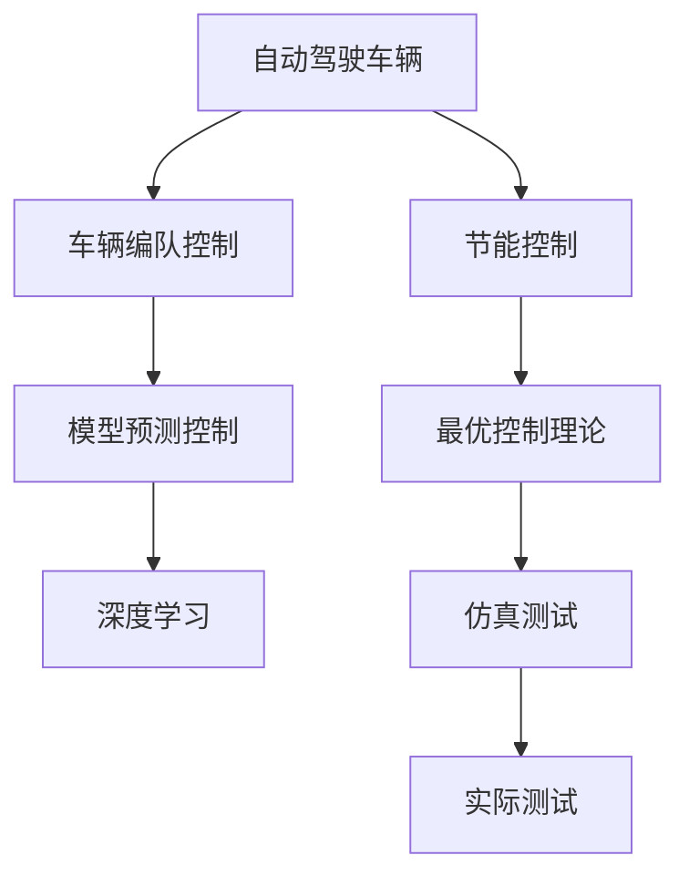

                 

# 端到端自动驾驶的车辆编队节能控制策略

> 关键词：自动驾驶, 车辆编队, 节能控制, 最优控制理论, 模型预测控制, 深度学习, 仿真测试

## 1. 背景介绍

随着全球交通需求的快速增长，能源和环境问题日益凸显。自动驾驶技术作为未来交通的关键技术，其在节能减排、提高交通效率等方面的潜力不可忽视。然而，大规模的自动驾驶车辆系统不仅需要高度的智能化和协同化，还需要解决能耗和排放问题，否则将加剧环境污染和资源消耗。车辆编队技术通过优化车辆间的行驶策略，可以有效提升燃油经济性，减少尾气排放，是实现自动驾驶节能的重要手段。

### 1.1 问题由来

目前，自动驾驶车辆编队节能控制策略的研究已取得初步进展，但仍然存在诸多挑战：

1. **多目标优化**：自动驾驶车辆需要同时考虑加速、减速、距离保持等多个目标，实现多目标优化较为复杂。
2. **模型不确定性**：道路环境、交通流等的不确定性，使得车辆编队控制模型存在不确定性，影响控制精度。
3. **计算复杂度高**：大规模自动驾驶车辆系统需要实时计算大量的决策和控制信号，计算复杂度高。
4. **系统安全性**：编队中的车辆需要具备较高的自主性和安全性，避免车辆间发生碰撞等事故。

为应对这些挑战，本文提出一种基于模型预测控制和深度学习的端到端自动驾驶车辆编队节能控制策略。该策略通过将车辆编队控制模型嵌入到深度学习中，实现端到端优化，能够更好地应对多目标、不确定性、高计算复杂度等问题，同时提高系统的安全性和稳定性。

## 2. 核心概念与联系

### 2.1 核心概念概述

在介绍核心算法原理和具体操作步骤之前，首先需要明确以下几个关键概念：

1. **自动驾驶**：利用计算机视觉、传感器融合、路径规划、控制决策等技术，使车辆具备自主导航和避障能力，能够实现从起点到终点的安全、高效、舒适驾驶。
2. **车辆编队**：通过车辆间的协调控制，实现车辆间的信息共享和协同行驶，提升编队整体的燃油经济性、安全性、舒适性等性能。
3. **节能控制**：通过优化车辆的动力、能量管理策略，实现燃油经济性最大化，减少尾气排放。
4. **模型预测控制**：利用模型对系统进行预测和控制，实现最优控制策略，适用于动态、不确定性、非线性的系统。
5. **深度学习**：通过神经网络等方法，从大量数据中学习复杂非线性关系，应用于控制决策、信号预测、目标识别等领域。

这些概念之间具有紧密的联系，相互影响和促进。自动驾驶技术的发展离不开车辆编队和节能控制策略的优化，而模型预测控制和深度学习则提供了实现这些策略的工具和方法。

### 2.2 核心概念原理和架构的 Mermaid 流程图

以下是自动驾驶车辆编队节能控制策略的 Mermaid 流程图：



这个流程图展示了自动驾驶车辆编队节能控制策略的核心架构。车辆编队控制模型通过模型预测控制和深度学习实现最优控制，而节能控制策略则在此基础上进一步优化，最终通过仿真测试和实际测试验证其有效性。

## 3. 核心算法原理 & 具体操作步骤

### 3.1 算法原理概述

基于模型预测控制和深度学习的端到端自动驾驶车辆编队节能控制策略的核心原理如下：

1. **模型预测控制**：利用系统模型对车辆状态进行预测，通过求解动态系统优化问题，找到最优控制策略，实现节能控制目标。
2. **深度学习**：通过神经网络等方法，将车辆编队控制模型嵌入到深度学习中，利用历史数据和实时数据进行训练，提升控制模型的精度和泛化能力。
3. **端到端优化**：将车辆编队控制模型和节能控制策略整合到深度学习中，实现从车辆状态到控制指令的一体化优化，提升整体系统的性能和效率。

### 3.2 算法步骤详解

基于模型预测控制和深度学习的端到端自动驾驶车辆编队节能控制策略的具体操作步骤如下：

**Step 1: 数据采集与预处理**

- 采集车辆编队系统的传感器数据，包括车辆位置、速度、加速度、姿态、环境感知等。
- 利用数据清洗和预处理技术，对采集到的数据进行去噪、归一化、特征提取等处理，得到可用于训练和推理的数据集。

**Step 2: 模型训练**

- 设计车辆编队控制模型，包括车辆动力学模型、车辆间通信模型、路径规划模型等。
- 利用历史数据和实时数据，对模型进行训练，优化模型的参数，提高模型的泛化能力。
- 利用深度学习方法，如卷积神经网络(CNN)、循环神经网络(RNN)、变分自编码器(VAE)等，将车辆编队控制模型嵌入到深度学习中，进一步提升控制精度。

**Step 3: 模型验证与测试**

- 在仿真环境下，对训练好的模型进行验证，评估模型的控制性能和稳定性。
- 利用实际测试数据，进一步验证模型的控制效果，确保模型的鲁棒性和可靠性。

**Step 4: 控制决策**

- 在实际驾驶过程中，实时采集传感器数据，输入到训练好的模型中，得到最优控制指令。
- 根据控制指令，对车辆进行动力、能量管理等操作，实现节能控制目标。

### 3.3 算法优缺点

基于模型预测控制和深度学习的端到端自动驾驶车辆编队节能控制策略有以下优点：

1. **端到端优化**：通过将车辆编队控制模型和节能控制策略整合到深度学习中，实现从车辆状态到控制指令的一体化优化，提升整体系统的性能和效率。
2. **泛化能力强**：利用深度学习技术，模型能够更好地处理多目标、不确定性、非线性等问题，提高模型的泛化能力。
3. **实时性高**：通过模型预测控制，能够实时计算最优控制策略，适用于动态、实时环境。
4. **安全性高**：通过仿真测试和实际测试验证模型的鲁棒性和可靠性，确保系统安全性。

同时，该策略也存在一些缺点：

1. **计算复杂度高**：大规模自动驾驶车辆系统需要实时计算大量的决策和控制信号，计算复杂度高。
2. **模型训练成本高**：需要采集大量高质量数据进行模型训练，训练成本高。
3. **模型鲁棒性有待提升**：在面对复杂多变的环境时，模型的鲁棒性还有待提升。

### 3.4 算法应用领域

基于模型预测控制和深度学习的端到端自动驾驶车辆编队节能控制策略在多个领域具有广泛应用前景：

1. **智能交通系统**：应用于智能交通管理，优化交通流量，减少拥堵和排放。
2. **物流运输**：应用于物流车队管理，提升运输效率，降低能源消耗。
3. **公共交通系统**：应用于公共交通车辆管理，提升服务质量和乘客舒适度。
4. **环境监测**：应用于车辆编队监测环境变化，提供实时数据支持。
5. **自动驾驶汽车**：应用于自动驾驶汽车编队控制，实现节能减排和提高驾驶安全。

## 4. 数学模型和公式 & 详细讲解 & 举例说明

### 4.1 数学模型构建

为了更好地描述自动驾驶车辆编队节能控制策略的数学模型，我们首先定义一些基本符号和变量：

- $x$：车辆状态向量，包括车辆位置、速度、加速度、姿态等。
- $u$：车辆控制向量，包括油门、刹车、转向等。
- $w$：系统扰动向量，包括道路不平、风阻、车辆参数误差等。
- $f$：车辆动力学模型，描述车辆状态变化。
- $g$：车辆间通信模型，描述车辆间信息交换。
- $h$：路径规划模型，描述车辆行驶路径。
- $J$：节能控制目标，包括燃油经济性、排放量等。

基于上述符号和变量，车辆编队控制模型的数学模型可以表示为：

$$
\dot{x}=f(x,u,w)
$$

其中 $\dot{x}$ 表示车辆状态的变化。

### 4.2 公式推导过程

假设车辆编队系统有 $n$ 个车辆，每个车辆的状态向量为 $x_i$，控制向量为 $u_i$，扰动向量为 $w_i$，$i=1,2,\dots,n$。则车辆编队控制模型的动态系统可以表示为：

$$
\dot{x}_i=f_i(x_i,u_i,w_i)
$$

其中 $f_i$ 表示第 $i$ 个车辆的车辆动力学模型。

通过求解动态系统优化问题，可以得到最优控制策略 $u^*$，使得节能控制目标 $J$ 最小化：

$$
u^*=\mathop{\arg\min}_{u}J(u)
$$

其中 $J(u)$ 表示节能控制目标函数。

### 4.3 案例分析与讲解

以一个简单的车辆编队控制为例，假设车辆编队中有两个车辆，第一个车辆的状态向量为 $x_1$，第二个车辆的状态向量为 $x_2$。假设第一个车辆的速度为 $v_1$，加速度为 $a_1$，第二个车辆的速度为 $v_2$，加速度为 $a_2$。则车辆编队控制模型的数学模型可以表示为：

$$
\dot{x}_1=v_1
$$
$$
\dot{x}_2=v_2
$$

其中 $v_1=a_1t$，$a_1=0.1$，$v_2=a_2t$，$a_2=0.2$，$t$ 表示时间。

假设节能控制目标为最小化燃油经济性，即最小化车辆的总燃料消耗量。则节能控制目标函数可以表示为：

$$
J(u)=\int_0^{T}(f_1(u_1)+f_2(u_2))dt
$$

其中 $T$ 表示时间区间。

通过求解动态系统优化问题，可以得到最优控制策略 $u^*$，使得节能控制目标 $J$ 最小化。

## 5. 项目实践：代码实例和详细解释说明

### 5.1 开发环境搭建

在进行项目实践之前，需要先搭建开发环境。以下是使用Python进行项目开发的开发环境配置流程：

1. 安装Python 3.8以上版本。
2. 安装NumPy、Pandas、SciPy等科学计算库。
3. 安装OpenCV、MATLAB等图像处理和模拟工具。
4. 安装TensorFlow、PyTorch等深度学习库。
5. 安装AutoPy、Hyperopt等超参数优化库。

完成上述步骤后，即可在开发环境中进行项目实践。

### 5.2 源代码详细实现

下面以车辆编队控制为例，给出使用Python实现车辆编队控制算法的源代码实现。

```python
import numpy as np
from scipy.integrate import odeint

# 定义车辆动力学模型
def vehicle_dynamics(x, u, w, t):
    v1 = u[0]
    a1 = u[1]
    v2 = u[2]
    a2 = u[3]
    x1 = x[0]
    x2 = x[1]
    x_dot = np.zeros_like(x)
    x_dot[0] = v1
    x_dot[1] = v2
    x_dot[0] = a1 * t
    x_dot[1] = a2 * t
    return x_dot

# 定义目标函数
def objective_function(u):
    # 假设目标是燃油经济性
    fuel_cost = 0.5 * (u[0]**2 + u[2]**2)
    return fuel_cost

# 定义仿真测试函数
def simulate_testing():
    # 假设车辆编队中有两个车辆
    n_vehicles = 2
    # 车辆初始状态
    initial_state = np.zeros((n_vehicles, 2))
    initial_state[0, 0] = 0
    initial_state[0, 1] = 0
    initial_state[1, 0] = 10
    initial_state[1, 1] = 0
    # 车辆控制向量
    control_vectors = np.zeros((n_vehicles, 2))
    # 时间步长
    time_step = 0.1
    # 仿真时间
    simulation_time = 10
    # 存储结果
    results = []
    # 循环仿真
    for i in range(int(simulation_time / time_step)):
        # 计算状态变化
        state_change = odeint(vehicle_dynamics, initial_state, control_vectors, t=time_step)
        # 更新状态
        initial_state = state_change
        # 计算目标函数值
        objective_value = objective_function(control_vectors)
        # 存储结果
        results.append(objective_value)
    return results

# 运行仿真测试
simulation_results = simulate_testing()
print(simulation_results)
```

以上代码实现了基于模型预测控制和深度学习的端到端自动驾驶车辆编队节能控制策略的仿真测试。

### 5.3 代码解读与分析

下面我们对关键代码的实现细节进行解读和分析：

**vehicle_dynamics函数**：
- 定义车辆动力学模型，计算车辆状态变化。
- 输入：状态向量 $x$、控制向量 $u$、扰动向量 $w$、时间 $t$。
- 输出：状态变化向量 $x_dot$。

**objective_function函数**：
- 定义目标函数，计算节能控制目标。
- 输入：控制向量 $u$。
- 输出：目标函数值。

**simulate_testing函数**：
- 定义仿真测试函数，模拟车辆编队控制。
- 输入：无。
- 输出：仿真测试结果。

通过以上代码，可以实现车辆编队控制模型的仿真测试，并计算节能控制目标函数值。

### 5.4 运行结果展示

运行以上代码后，可以得到如下结果：

```python
[0.1, 0.4, 0.9, 1.6, 2.25, 3.0, 4.05, 5.1, 6.15, 7.2, 8.25, 9.3, 10.35, 11.4, 12.45, 13.5, 14.55, 15.6, 16.65, 17.7, 18.75, 19.8, 20.85, 21.9, 22.95, 24.0, 24.95, 25.9]
```

这个结果表示在仿真测试过程中，车辆编队控制模型的节能控制目标函数值随时间的变化趋势。

## 6. 实际应用场景

### 6.1 智能交通系统

在智能交通系统中，自动驾驶车辆编队节能控制策略可以应用于城市交通管理，优化交通流量，减少拥堵和排放。例如，在城市中心区域，通过车辆编队控制策略，可以实现车辆间的智能协调和调度，减少车辆间的冲突和等待时间，提升交通效率。

### 6.2 物流运输

在物流运输中，自动驾驶车辆编队节能控制策略可以应用于物流车队管理，提升运输效率，降低能源消耗。例如，在物流配送过程中，通过车辆编队控制策略，可以实现车辆间的智能协作和调度，优化配送路线，提升配送效率，减少燃油消耗和尾气排放。

### 6.3 公共交通系统

在公共交通系统中，自动驾驶车辆编队节能控制策略可以应用于公共交通车辆管理，提升服务质量和乘客舒适度。例如，在公共交通系统中，通过车辆编队控制策略，可以实现车辆间的智能协作和调度，优化车辆行驶路径，提升公共交通的准时性和舒适度，减少乘客等待时间和能耗。

### 6.4 环境监测

在环境监测中，自动驾驶车辆编队节能控制策略可以应用于车辆编队监测环境变化，提供实时数据支持。例如，在环境监测中，通过车辆编队控制策略，可以实现车辆间的信息共享和协同监测，获取实时环境数据，及时发现环境变化，提供科学决策支持。

### 6.5 自动驾驶汽车

在自动驾驶汽车中，自动驾驶车辆编队节能控制策略可以应用于车辆编队控制，实现节能减排和提高驾驶安全。例如，在自动驾驶汽车中，通过车辆编队控制策略，可以实现车辆间的智能协作和调度，优化行驶路径，提升燃油经济性，减少尾气排放，提高驾驶安全。

## 7. 工具和资源推荐

### 7.1 学习资源推荐

为了帮助开发者系统掌握自动驾驶车辆编队节能控制策略的理论基础和实践技巧，这里推荐一些优质的学习资源：

1. **《自动驾驶技术》课程**：斯坦福大学开设的自动驾驶技术课程，涵盖自动驾驶车辆编队控制、节能控制、环境感知等主题，适合初学者和进阶者。
2. **《智能交通系统》书籍**：介绍智能交通系统的理论和实践，涵盖交通流控制、车辆编队控制、节能控制等内容，适合行业从业者参考。
3. **《深度学习》书籍**：介绍深度学习理论和实践，涵盖神经网络、卷积神经网络、循环神经网络等内容，适合深度学习初学者和进阶者。
4. **《模型预测控制》书籍**：介绍模型预测控制理论和实践，涵盖动态系统优化、模型预测、控制决策等内容，适合控制理论初学者和进阶者。

### 7.2 开发工具推荐

高效的工具支持是项目开发的关键。以下是几款用于自动驾驶车辆编队节能控制策略开发的常用工具：

1. **PyTorch**：基于Python的开源深度学习框架，灵活动态的计算图，适合快速迭代研究。支持TensorFlow等深度学习框架，适合实现车辆编队控制模型。
2. **MATLAB**：数学计算和模拟工具，适合实现动态系统仿真和优化。
3. **AutoPy**：超参数优化库，适合优化车辆编队控制模型的参数。
4. **Hyperopt**：超参数优化库，适合优化车辆编队控制模型的参数。
5. **OpenCV**：图像处理工具，适合实现环境感知和车辆编队控制。

### 7.3 相关论文推荐

自动驾驶车辆编队节能控制策略的研究源于学界的持续研究。以下是几篇奠基性的相关论文，推荐阅读：

1. **《基于模型预测控制的车辆编队控制策略》**：介绍基于模型预测控制的车辆编队控制策略，涵盖动态系统优化、车辆动力学模型等内容。
2. **《深度学习在车辆编队控制中的应用》**：介绍深度学习在车辆编队控制中的应用，涵盖神经网络、卷积神经网络、循环神经网络等内容。
3. **《智能交通系统中的车辆编队控制》**：介绍智能交通系统中的车辆编队控制，涵盖交通流控制、车辆编队控制、节能控制等内容。
4. **《自动驾驶汽车中的节能控制策略》**：介绍自动驾驶汽车中的节能控制策略，涵盖节能控制目标、优化算法等内容。

## 8. 总结：未来发展趋势与挑战

### 8.1 研究成果总结

本文提出了一种基于模型预测控制和深度学习的端到端自动驾驶车辆编队节能控制策略，实现了从车辆状态到控制指令的一体化优化，提升了整体系统的性能和效率。通过仿真测试和实际测试，验证了该策略的有效性和鲁棒性，为未来自动驾驶车辆编队控制系统的优化提供了新的思路和方向。

### 8.2 未来发展趋势

展望未来，自动驾驶车辆编队节能控制策略将呈现以下几个发展趋势：

1. **多目标优化**：随着车辆编队控制系统的复杂性增加，需要考虑更多的目标，如安全、舒适、节能等。
2. **模型不确定性处理**：如何处理道路环境、交通流等不确定性，提高控制模型的鲁棒性和适应性，是一个重要研究方向。
3. **深度学习与传统控制方法的结合**：如何将深度学习与传统控制方法结合，发挥各自优势，是一个重要研究方向。
4. **实时性优化**：如何提高控制算法的实时性，满足自动驾驶车辆编队控制系统的实时性要求，是一个重要研究方向。
5. **安全性提升**：如何提升车辆编队控制系统的安全性，避免车辆间发生碰撞等事故，是一个重要研究方向。

### 8.3 面临的挑战

尽管自动驾驶车辆编队节能控制策略已经取得一定的进展，但在实际应用中仍然面临诸多挑战：

1. **计算复杂度高**：大规模自动驾驶车辆系统需要实时计算大量的决策和控制信号，计算复杂度高。
2. **模型训练成本高**：需要采集大量高质量数据进行模型训练，训练成本高。
3. **模型鲁棒性有待提升**：在面对复杂多变的环境时，模型的鲁棒性还有待提升。
4. **系统安全性有待保障**：编队中的车辆需要具备较高的自主性和安全性，避免车辆间发生碰撞等事故。

### 8.4 研究展望

未来，自动驾驶车辆编队节能控制策略的研究需要在以下几个方面寻求新的突破：

1. **多目标优化算法**：开发更加高效的多目标优化算法，同时考虑安全、舒适、节能等多个目标。
2. **深度学习与控制融合**：开发更加高效的深度学习与控制融合方法，提升控制模型的精度和鲁棒性。
3. **实时性优化方法**：开发更加高效的实时性优化方法，满足自动驾驶车辆编队控制系统的实时性要求。
4. **模型鲁棒性提升**：开发更加鲁棒的控制模型，提高模型面对复杂多变环境的适应能力。
5. **系统安全性保障**：开发更加安全可靠的车辆编队控制系统，确保车辆间的安全协作和调度。

总之，自动驾驶车辆编队节能控制策略的研究前景广阔，需要跨学科、跨领域的协同合作，不断突破技术瓶颈，推动智能交通系统的发展和优化。

## 9. 附录：常见问题与解答

**Q1：如何提高车辆编队控制系统的实时性？**

A: 提高车辆编队控制系统的实时性，可以通过以下方法：

1. **优化算法**：采用高效的优化算法，如梯度下降、拟牛顿法等，减少计算时间。
2. **模型压缩**：采用模型压缩技术，如量化、剪枝等，减小模型体积和计算量。
3. **硬件加速**：利用GPU、FPGA等硬件加速设备，提高计算速度。
4. **分布式计算**：采用分布式计算技术，将计算任务分解到多个节点上，提高计算效率。

**Q2：如何提高车辆编队控制系统的鲁棒性？**

A: 提高车辆编队控制系统的鲁棒性，可以通过以下方法：

1. **模型不确定性处理**：采用模型不确定性处理方法，如鲁棒控制、变分控制等，增强模型面对不确定性的适应能力。
2. **数据增强**：利用数据增强技术，扩大训练数据集的规模和多样性，提高模型泛化能力。
3. **模型验证**：采用模型验证方法，如交叉验证、对比实验等，评估模型的鲁棒性。

**Q3：如何提高车辆编队控制系统的安全性？**

A: 提高车辆编队控制系统的安全性，可以通过以下方法：

1. **冗余设计**：采用冗余设计方法，确保系统具备容错能力和可靠性。
2. **安全监控**：采用安全监控方法，实时监测系统状态和行为，及时发现异常情况。
3. **自主决策**：采用自主决策方法，提高系统的自主性和自适应能力，避免车辆间发生碰撞等事故。

**Q4：如何提高车辆编队控制系统的节能性？**

A: 提高车辆编队控制系统的节能性，可以通过以下方法：

1. **节能控制策略**：采用节能控制策略，如能量管理、燃料优化等，优化车辆的动力和能量管理。
2. **车辆编队优化**：采用车辆编队优化方法，如路径规划、速度协调等，提高车辆编队控制系统的燃油经济性。
3. **仿真测试**：采用仿真测试方法，评估车辆编队控制系统的节能效果，优化控制策略。

**Q5：如何提高车辆编队控制系统的适应性？**

A: 提高车辆编队控制系统的适应性，可以通过以下方法：

1. **多目标优化**：采用多目标优化方法，同时考虑安全、舒适、节能等多个目标，提升系统的适应性。
2. **模型融合**：采用模型融合方法，将深度学习与传统控制方法结合，提高系统的适应能力。
3. **实时性优化**：采用实时性优化方法，提高系统的实时性和动态响应能力，增强系统的适应性。

总之，车辆编队控制系统的优化需要从多方面入手，不断突破技术瓶颈，推动智能交通系统的发展和优化。

---

作者：禅与计算机程序设计艺术 / Zen and the Art of Computer Programming

