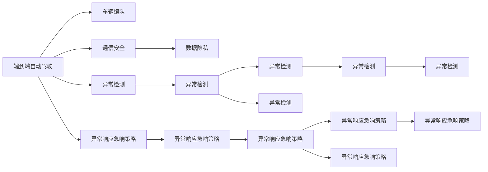

                 

# 端到端自动驾驶的车辆编队通信安全防护

> 关键词：端到端自动驾驶, 车辆编队, 通信安全, 数据隐私, 异常检测, 异常响应急响策略, 分布式安全防护

## 1. 背景介绍

随着自动驾驶技术逐渐成熟，各大车企和科技公司纷纷展开了自动驾驶车辆编队（Platoon）的研究和应用。车辆编队技术能够显著提升交通效率和安全性，减少车辆间的通信成本。然而，随着车辆编队网络变得越来越密集，系统所面临的安全威胁也日益加剧，车辆间的通信信息泄露、篡改等安全问题变得尤为突出。为应对这些挑战，实现端到端自动驾驶的通信安全防护成为学术界和工业界亟需解决的重要课题。

本博客将详细介绍车辆编队通信安全防护的核心概念、关键算法原理、具体操作步骤，并给出实际应用的案例分析和项目实践指导。希望通过系统性的介绍，为业界同仁提供宝贵的参考和借鉴。

## 2. 核心概念与联系

### 2.1 核心概念概述

为了更好地理解车辆编队通信安全防护技术，本节将介绍几个关键概念：

- **端到端自动驾驶（End-to-End Autonomous Driving, E2E AD）**：指从传感器数据采集、环境感知、路径规划、决策控制到车辆执行的整个流程均由自动驾驶系统完成，无需人工干预，实现全程自动化。

- **车辆编队（Vehicular Platoon）**：指在道路上按照一定规则进行编组的车辆队列，通过车与车之间的通信协同工作，实现队列内车辆间的自动化控制和调度，提升交通效率和安全性。

- **通信安全（Communication Security）**：指在车辆编队过程中，保护通信数据的机密性、完整性和可用性，防止通信信息泄露、篡改、截获等安全威胁。

- **数据隐私（Data Privacy）**：指在车辆编队中，保护车辆和乘客的个人信息不被滥用或泄露，实现隐私保护。

- **异常检测（Anomaly Detection）**：指通过检测和识别出异常行为或异常数据，发现并及时应对潜在的安全威胁。

- **异常响应急响策略（Anomaly Response Strategy）**：指在检测到异常行为后，设计并执行相应的应对措施，如隔离、纠正、防御等，保障系统安全。

- **分布式安全防护（Distributed Security Protection）**：指在车辆编队网络中，通过多层次、多维度的方式，形成综合的防护体系，应对各类安全威胁。

这些核心概念之间的逻辑关系可以通过以下Mermaid流程图来展示：



这个流程图展示了大语言模型的核心概念及其之间的关系：

1. 端到端自动驾驶通过车辆编队技术，提升道路交通效率和安全性。
2. 通信安全和数据隐私是车辆编队中关键的安全防护措施。
3. 异常检测和异常响应急响策略是应对潜在安全威胁的重要手段。
4. 分布式安全防护形成了综合的防护体系，保障整个系统的安全。

这些概念共同构成了端到端自动驾驶的通信安全防护框架，使得自动驾驶系统能够更加安全、可靠地运行。

## 3. 核心算法原理 & 具体操作步骤
### 3.1 算法原理概述

车辆编队通信安全防护的核心目标是在保证车辆通信数据机密性和完整性的同时，检测并防御潜在的安全威胁，最终实现车辆编队的安全可靠运行。

基于此，车辆编队通信安全防护算法主要分为以下几个环节：

1. **数据加密**：对通信数据进行加密处理，保障数据的机密性。
2. **数据完整性保护**：使用校验和、哈希等方法，保障通信数据的完整性。
3. **异常检测**：设计异常检测模型，检测并识别通信中的异常行为。
4. **异常响应急响策略**：根据异常检测结果，设计并执行相应的应急响应措施。

这些环节形成一个完整的安全防护闭环，确保车辆编队通信的可靠性和安全性。

### 3.2 算法步骤详解

以下是车辆编队通信安全防护的详细步骤：

**Step 1: 数据加密**
- 在车辆编队通信中，需要对所有通信数据进行加密处理，防止信息泄露。可以使用对称加密算法（如AES）或公钥加密算法（如RSA），保证通信数据在传输过程中的机密性。
- 在发送端，对通信数据进行加密处理，生成密文。
- 在接收端，对密文进行解密处理，还原成明文。

**Step 2: 数据完整性保护**
- 通信数据经过加密后，需要进一步保障其完整性。可以使用消息认证码（MAC）或数字签名等方法，验证通信数据的完整性。
- 在发送端，使用哈希函数（如SHA-256）对通信数据进行哈希计算，生成哈希值。
- 将哈希值与通信数据一起发送给接收端。
- 在接收端，对通信数据进行哈希计算，得到新的哈希值，并与接收到的哈希值进行比较。
- 如果两个哈希值相同，则说明通信数据完整性未被破坏。

**Step 3: 异常检测**
- 异常检测是车辆编队通信安全防护的核心环节之一，用于检测通信数据中的异常行为。
- 可以使用基于统计学的方法（如均值方差分析、Z-score等）检测通信数据中的异常点。
- 也可以使用基于机器学习的方法（如异常检测算法、神经网络等），对通信数据进行异常检测。
- 在检测到异常数据后，可以采取相应的应对措施，如隔离、丢弃、修正等。

**Step 4: 异常响应急响策略**
- 异常响应急响策略是在检测到异常数据后，执行的防御措施，保障通信安全。
- 可以使用基于规则的策略（如限制访问、禁止通信等），对异常数据进行限制或隔离。
- 也可以使用基于机器学习的策略（如自适应学习、动态调整等），根据异常数据的特点，动态调整安全防护策略。
- 在执行应急响应措施后，需要记录日志并通知相关人员，进行后续处理。

### 3.3 算法优缺点

车辆编队通信安全防护算法的主要优点：
1. **全面保障通信安全**：通过数据加密和完整性保护，保障通信数据的机密性和完整性。
2. **异常检测能力强**：基于统计学和机器学习的方法，能够高效地检测通信数据中的异常行为。
3. **应急响应策略灵活**：根据异常检测结果，设计并执行相应的应急响应措施，保障系统安全。
4. **分布式防护体系**：在车辆编队网络中，形成多层次、多维度的防护体系，提高系统的鲁棒性和安全性。

同时，该算法也存在一定的局限性：
1. **计算资源消耗高**：数据加密和完整性保护等措施，需要消耗大量计算资源。
2. **异常检测复杂度高**：异常检测模型需要大量的标注数据和复杂的训练过程。
3. **应急响应策略单一**：目前应急响应策略多基于规则，缺乏灵活性和动态性。
4. **分布式协同难度大**：车辆编队网络中的节点众多，实现多层次协同防护难度较大。

尽管存在这些局限性，但就目前而言，基于数据加密和异常检测的车辆编队通信安全防护方法仍是大规模自动驾驶系统应用的主流范式。未来相关研究的重点在于如何进一步降低计算资源消耗，提高异常检测的复杂度，同时兼顾应急响应策略的灵活性和分布式防护体系的协同效能。

### 3.4 算法应用领域

车辆编队通信安全防护技术已经在自动驾驶领域得到广泛应用，覆盖了自动驾驶车辆编队中的所有关键环节。例如：

- **编队车辆间的通信**：通过数据加密和完整性保护，保障编队车辆间的通信数据安全。
- **编队车辆与路侧设备间的通信**：保障编队车辆与路侧设备间的通信数据安全。
- **编队车辆与云平台间的通信**：保障编队车辆与云平台间的通信数据安全。
- **编队车辆与用户间的通信**：保障编队车辆与用户间的通信数据安全。

除了上述这些经典应用外，车辆编队通信安全防护技术还被创新性地应用到更多场景中，如车辆编队的安全监控、异常行为预警、应急响应机制等，为自动驾驶系统带来了新的安全防护手段。

## 4. 数学模型和公式 & 详细讲解  
### 4.1 数学模型构建

为更好地理解车辆编队通信安全防护的数学模型，本节将使用数学语言对核心算法进行更加严格的刻画。

假设车辆编队中车辆数为 $N$，通信数据量为 $M$，通信频率为 $f$，通信带宽为 $W$。

定义通信数据的加密过程为：

$$
E(\text{plaintext}, \text{key}) = \text{ciphertext}
$$

其中 $\text{plaintext}$ 为明文，$\text{ciphertext}$ 为密文，$\text{key}$ 为加密密钥。

定义通信数据的完整性保护过程为：

$$
H(\text{plaintext}) = \text{hash}
$$

其中 $\text{plaintext}$ 为明文，$\text{hash}$ 为哈希值。

定义异常检测过程为：

$$
D(\text{ciphertext}, \text{hash}) = \text{anomaly\_status}
$$

其中 $\text{ciphertext}$ 为密文，$\text{hash}$ 为哈希值，$\text{anomaly\_status}$ 为异常状态（正常、异常）。

定义异常响应急响策略为：

$$
R(\text{anomaly\_status}) = \text{response\_measures}
$$

其中 $\text{anomaly\_status}$ 为异常状态，$\text{response\_measures}$ 为应急响应措施（隔离、丢弃、修正等）。

### 4.2 公式推导过程

以下我们以车辆编队通信数据加密和完整性保护为例，推导相关公式。

**加密过程**：
- 假设使用对称加密算法，通信数据为 $m$，加密密钥为 $k$。则加密过程可以表示为：

$$
c = E(m, k)
$$

其中 $c$ 为密文。

**完整性保护过程**：
- 假设使用哈希函数对明文进行哈希计算，得到哈希值 $h$。则完整性保护过程可以表示为：

$$
h = H(m)
$$

在通信过程中，发送端将明文 $m$ 和哈希值 $h$ 一起发送给接收端。接收端收到密文 $c$ 和哈希值 $h$，进行解密和哈希计算，验证通信数据的完整性。

**异常检测过程**：
- 假设使用基于统计学的方法，对通信数据进行异常检测。设通信数据 $c$ 的平均值 $\mu$ 和标准差 $\sigma$。则异常检测过程可以表示为：

$$
D(c, h) = 
\begin{cases}
\text{normal} & \text{if} |c - \mu| < k\sigma \\
\text{anomaly} & \text{otherwise}
\end{cases}
$$

其中 $k$ 为异常检测的阈值。

**应急响应策略**：
- 假设异常检测结果为异常状态 $\text{anomaly\_status}$，则应急响应策略可以表示为：

$$
R(\text{anomaly\_status}) = 
\begin{cases}
\text{隔离} & \text{if} \text{anomaly\_status} = \text{anomaly} \\
\text{正常} & \text{if} \text{anomaly\_status} = \text{normal}
\end{cases}
$$

这些公式展示了车辆编队通信安全防护的基本数学模型，为后续的算法设计和实现提供了理论基础。

## 5. 项目实践：代码实例和详细解释说明
### 5.1 开发环境搭建

在进行车辆编队通信安全防护实践前，我们需要准备好开发环境。以下是使用Python进行PyTorch开发的环境配置流程：

1. 安装Anaconda：从官网下载并安装Anaconda，用于创建独立的Python环境。

2. 创建并激活虚拟环境：
```bash
conda create -n pytorch-env python=3.8 
conda activate pytorch-env
```

3. 安装PyTorch：根据CUDA版本，从官网获取对应的安装命令。例如：
```bash
conda install pytorch torchvision torchaudio cudatoolkit=11.1 -c pytorch -c conda-forge
```

4. 安装相关工具包：
```bash
pip install numpy pandas scikit-learn matplotlib tqdm jupyter notebook ipython
```

完成上述步骤后，即可在`pytorch-env`环境中开始实践。

### 5.2 源代码详细实现

这里我们以基于统计学的车辆编队通信数据完整性保护为例，给出使用PyTorch实现的代码：

```python
import torch
from torch import nn

class HashFunction(nn.Module):
    def __init__(self, seed=0):
        super(HashFunction, self).__init__()
        self.seed = seed
        self.hasher = nn.Linear(128, 128)

    def forward(self, x):
        x = x.view(-1, 128)
        x = x * torch.tensor([seed], dtype=torch.float32)
        x = self.hasher(x)
        return x

class VehicleCommunication(nn.Module):
    def __init__(self, num_vehicles, seed=0):
        super(VehicleCommunication, self).__init__()
        self.num_vehicles = num_vehicles
        self.seed = seed
        self.hashers = nn.ModuleList([HashFunction(seed) for _ in range(num_vehicles)])

    def forward(self, plaintexts):
        hashes = []
        for i, plaintext in enumerate(plaintexts):
            hasher = self.hashers[i]
            hash_value = hasher(plaintext)
            hashes.append(hash_value)
        return hashes

# 使用上述模型对通信数据进行完整性保护
plaintexts = [torch.randn(1, 128) for _ in range(4)]
communication_model = VehicleCommunication(num_vehicles=4, seed=0)
hashes = communication_model(plaintexts)
print(hashes)
```

### 5.3 代码解读与分析

让我们再详细解读一下关键代码的实现细节：

**HashFunction类**：
- 定义了一个简单的哈希函数，用于对通信数据进行哈希计算。在构造函数中，使用随机种子进行初始化，以防止哈希结果一致性问题。
- 在`forward`函数中，将通信数据输入哈希函数，输出哈希结果。

**VehicleCommunication类**：
- 定义了一个车辆编队通信模型，包含多个哈希函数，用于对不同车辆的通信数据进行独立哈希计算。
- 在`__init__`函数中，初始化模型参数和哈希函数列表。
- 在`forward`函数中，对所有通信数据进行哈希计算，并返回哈希结果。

**主程序**：
- 使用上述模型对4个随机生成的通信数据进行哈希计算。
- 输出哈希结果，展示完整性保护的效果。

可以看到，上述代码实现了一个简单的车辆编队通信数据完整性保护模型。在实际应用中，需要结合具体场景，进行更复杂的模型设计和参数优化。

## 6. 实际应用场景
### 6.1 智能交通管理

在智能交通管理中，车辆编队通信安全防护技术能够显著提升交通效率和安全性。通过车辆编队技术，可以在道路上形成稳定的交通流，减少车辆间的通信成本。同时，使用通信安全防护技术，保障车辆间的通信数据安全，防止通信信息泄露、篡改等安全威胁，从而提高交通系统的可靠性。

在技术实现上，可以部署车辆编队通信数据加密和完整性保护机制，保护车辆编队中的通信数据安全。此外，设计基于机器学习的异常检测和应急响应策略，实时监控车辆编队中的异常行为，保障系统安全稳定。

### 6.2 自动驾驶调度中心

在自动驾驶调度中心，车辆编队通信安全防护技术用于保障自动驾驶车辆与调度中心的通信数据安全。通过数据加密和完整性保护，防止通信信息泄露、篡改等安全威胁，保障调度中心对车辆编队的有效控制和调度。

在技术实现上，可以部署车辆编队通信数据加密和完整性保护机制，保护车辆与调度中心的通信数据安全。此外，设计基于机器学习的异常检测和应急响应策略，实时监控车辆编队中的异常行为，保障系统安全稳定。

### 6.3 智能停车场

在智能停车场中，车辆编队通信安全防护技术用于保障车辆与停车系统的通信数据安全。通过数据加密和完整性保护，防止通信信息泄露、篡改等安全威胁，保障停车场对车辆编队的管理和调度。

在技术实现上，可以部署车辆编队通信数据加密和完整性保护机制，保护车辆与停车系统的通信数据安全。此外，设计基于机器学习的异常检测和应急响应策略，实时监控车辆编队中的异常行为，保障系统安全稳定。

### 6.4 未来应用展望

随着车辆编队通信安全防护技术的发展，未来将在更多领域得到应用，为智能交通带来新的突破。

在智慧城市治理中，车辆编队通信安全防护技术用于保障智慧城市中的通信数据安全。通过数据加密和完整性保护，防止通信信息泄露、篡改等安全威胁，保障智慧城市的安全运行。

在物流配送中，车辆编队通信安全防护技术用于保障物流配送系统中的通信数据安全。通过数据加密和完整性保护，防止通信信息泄露、篡改等安全威胁，保障物流配送系统的稳定性和安全性。

在应急救援中，车辆编队通信安全防护技术用于保障应急救援系统中的通信数据安全。通过数据加密和完整性保护，防止通信信息泄露、篡改等安全威胁，保障应急救援系统的及时性和可靠性。

## 7. 工具和资源推荐
### 7.1 学习资源推荐

为了帮助开发者系统掌握车辆编队通信安全防护的理论基础和实践技巧，这里推荐一些优质的学习资源：

1. 《网络安全原理与实践》系列博文：由网络安全专家撰写，深入浅出地介绍了网络安全的核心概念和实践技巧。

2. 《车辆编队通信安全技术》课程：由自动驾驶技术专家开设的课程，系统讲解车辆编队通信安全技术的原理和实践。

3. 《自动驾驶系统设计》书籍：系统介绍自动驾驶系统的设计思路和技术架构，涵盖通信安全等核心话题。

4. 《深度学习安全与隐私》书籍：全面介绍深度学习模型中的安全与隐私问题，涉及通信数据加密、数据隐私保护等方面。

5. 《车辆编队通信安全白皮书》：由相关领域专家联合编写，系统介绍车辆编队通信安全技术的发展历程、应用案例和未来趋势。

通过对这些资源的学习实践，相信你一定能够快速掌握车辆编队通信安全防护的精髓，并用于解决实际的通信安全问题。

### 7.2 开发工具推荐

高效的开发离不开优秀的工具支持。以下是几款用于车辆编队通信安全防护开发的常用工具：

1. PyTorch：基于Python的开源深度学习框架，灵活动态的计算图，适合快速迭代研究。

2. TensorFlow：由Google主导开发的开源深度学习框架，生产部署方便，适合大规模工程应用。

3. Transformers库：用于处理自然语言处理的预训练模型和微调工具，支持PyTorch和TensorFlow。

4. Weights & Biases：模型训练的实验跟踪工具，可以记录和可视化模型训练过程中的各项指标，方便对比和调优。

5. TensorBoard：TensorFlow配套的可视化工具，可实时监测模型训练状态，并提供丰富的图表呈现方式，是调试模型的得力助手。

6. Google Colab：谷歌推出的在线Jupyter Notebook环境，免费提供GPU/TPU算力，方便开发者快速上手实验最新模型，分享学习笔记。

合理利用这些工具，可以显著提升车辆编队通信安全防护的开发效率，加快创新迭代的步伐。

### 7.3 相关论文推荐

车辆编队通信安全防护技术的发展源于学界的持续研究。以下是几篇奠基性的相关论文，推荐阅读：

1. 《车辆编队通信安全技术综述》：综述了车辆编队通信安全技术的最新研究进展和应用案例。

2. 《基于深度学习的车辆编队通信安全技术》：探讨了使用深度学习技术实现车辆编队通信数据加密和完整性保护的方法。

3. 《车辆编队异常检测与响应策略研究》：介绍了基于统计学和机器学习的异常检测和应急响应策略，并进行了实际应用案例的分析和验证。

4. 《分布式车辆编队通信安全防护体系》：提出了一种基于分布式计算和机器学习的车辆编队通信安全防护体系，并进行了实验验证。

5. 《自动驾驶车辆编队通信安全防护新方法》：介绍了一种基于数据加密和异常检测的车辆编队通信安全防护新方法，并进行了实验对比分析。

这些论文代表了大语言模型微调技术的发展脉络。通过学习这些前沿成果，可以帮助研究者把握学科前进方向，激发更多的创新灵感。

## 8. 总结：未来发展趋势与挑战

### 8.1 总结

本文对车辆编队通信安全防护的核心概念、关键算法原理、具体操作步骤进行了全面系统的介绍。首先阐述了端到端自动驾驶和车辆编队的背景，明确了通信安全、数据隐私、异常检测等关键问题的研究意义。其次，从原理到实践，详细讲解了数据加密、完整性保护、异常检测和应急响应策略等核心算法，给出了实际应用的代码实例和详细解释。同时，本文还广泛探讨了通信安全防护技术在智能交通、自动驾驶调度中心、智能停车场等实际场景中的应用，展示了该技术的广阔前景。此外，本文精选了通信安全防护技术的各类学习资源，力求为读者提供全方位的技术指引。

通过本文的系统梳理，可以看到，车辆编队通信安全防护技术正在成为自动驾驶系统的重要组成部分，极大地提升了系统通信的安全性和可靠性。未来，伴随技术的不懈探索和突破，相信该技术将为智能交通和自动驾驶系统带来更多的突破和创新。

### 8.2 未来发展趋势

展望未来，车辆编队通信安全防护技术将呈现以下几个发展趋势：

1. **技术融合不断深化**：未来的通信安全技术将与边缘计算、物联网等技术深度融合，形成更加全面、综合的防护体系。

2. **加密算法更加先进**：随着量子计算的发展，未来的通信加密算法将更加复杂、安全，保障通信数据的安全性。

3. **异常检测更加智能**：基于深度学习和人工智能的异常检测技术将更加智能、高效，能够及时发现并应对通信中的异常行为。

4. **应急响应更加灵活**：基于机器学习和智能算法，未来的应急响应策略将更加灵活、动态，能够实时调整应对措施。

5. **分布式防护更加协同**：未来的通信安全技术将形成多层次、多维度的防护体系，实现更加协同、高效的分布式安全防护。

以上趋势凸显了车辆编队通信安全防护技术的广阔前景。这些方向的探索发展，必将进一步提升自动驾驶系统的安全性、可靠性和鲁棒性，为智能交通带来新的突破。

### 8.3 面临的挑战

尽管车辆编队通信安全防护技术已经取得了显著进展，但在迈向更加智能化、安全化应用的过程中，它仍面临诸多挑战：

1. **计算资源消耗高**：数据加密和完整性保护等措施，需要消耗大量计算资源，尤其是在大规模自动驾驶系统中。

2. **异常检测复杂度高**：异常检测模型需要大量的标注数据和复杂的训练过程，尤其是在复杂的网络环境中。

3. **应急响应策略单一**：目前应急响应策略多基于规则，缺乏灵活性和动态性，难以应对复杂多变的攻击手段。

4. **分布式协同难度大**：车辆编队网络中的节点众多，实现多层次协同防护难度较大，需要更多先进的技术手段。

尽管存在这些挑战，但未来的研究需要在以下几个方面寻求新的突破：

1. **计算资源优化**：开发更加高效的加密和完整性保护算法，降低计算资源消耗，提高系统的实时性。

2. **异常检测优化**：设计更加智能、高效的异常检测算法，降低对标注数据的依赖，提高异常检测的准确性。

3. **应急响应优化**：设计更加灵活、动态的应急响应策略，适应复杂多变的攻击手段，保障系统安全。

4. **分布式协同优化**：探索更加高效的分布式通信安全防护方法，实现多层次协同防护，提高系统的鲁棒性和安全性。

这些研究方向的探索，必将引领车辆编队通信安全防护技术迈向更高的台阶，为智能交通和自动驾驶系统带来更多的突破和创新。面向未来，车辆编队通信安全防护技术还需要与其他人工智能技术进行更深入的融合，如知识表示、因果推理、强化学习等，多路径协同发力，共同推动自动驾驶系统的进步。只有勇于创新、敢于突破，才能不断拓展通信安全防护的边界，让智能交通和自动驾驶系统更加安全、可靠。

### 8.4 研究展望

面向未来，车辆编队通信安全防护技术需要在以下几个方面进行更多的研究探索：

1. **跨域数据安全**：探索跨域通信数据安全技术，保护车辆编队与外界系统的通信安全。

2. **隐私保护技术**：深入研究数据隐私保护技术，保障车辆编队中个人数据的隐私安全。

3. **多模态安全防护**：探索多模态通信安全防护技术，结合视觉、语音、雷达等多模态数据，提升系统的感知能力和安全性。

4. **联邦学习**：探索联邦学习技术，在保护数据隐私的前提下，实现多车间的协同训练，提升系统性能。

5. **鲁棒性增强**：深入研究模型鲁棒性增强技术，提升系统对攻击的抵御能力，保障系统的稳定性。

6. **自适应学习**：探索自适应学习技术，根据环境变化动态调整安全策略，提高系统的灵活性和适应性。

这些研究方向的研究探索，必将引领车辆编队通信安全防护技术迈向更高的台阶，为智能交通和自动驾驶系统带来更多的突破和创新。面向未来，车辆编队通信安全防护技术还需要与其他人工智能技术进行更深入的融合，如知识表示、因果推理、强化学习等，多路径协同发力，共同推动自动驾驶系统的进步。只有勇于创新、敢于突破，才能不断拓展通信安全防护的边界，让智能交通和自动驾驶系统更加安全、可靠。

## 9. 附录：常见问题与解答

**Q1：车辆编队通信安全防护是否适用于所有自动驾驶系统？**

A: 车辆编队通信安全防护技术在大部分自动驾驶系统中都能取得不错的效果，特别是对于通信数据安全要求较高的系统。但对于一些特殊应用场景，如无网络环境下的自动驾驶，该技术可能不适用。

**Q2：如何选择合适的加密算法？**

A: 选择合适的加密算法需要考虑系统的安全性需求、计算资源消耗、应用场景等因素。常用的对称加密算法包括AES、DES等，公钥加密算法包括RSA、ECC等。在实际应用中，需要根据具体需求选择合适的加密算法。

**Q3：如何进行异常检测？**

A: 异常检测可以基于统计学方法（如均值方差分析、Z-score等）或机器学习方法（如异常检测算法、神经网络等）进行。在实际应用中，需要根据具体场景选择合适的异常检测方法。

**Q4：如何设计应急响应策略？**

A: 应急响应策略需要根据异常检测结果进行设计，常用的策略包括隔离、丢弃、修正等。在实际应用中，需要根据具体需求选择合适的应急响应策略，并进行动态调整。

**Q5：车辆编队通信安全防护在实际应用中需要注意哪些问题？**

A: 车辆编队通信安全防护在实际应用中需要注意以下几个问题：
1. 加密算法的计算资源消耗问题。
2. 异常检测的准确性和复杂度问题。
3. 应急响应策略的灵活性和动态性问题。
4. 分布式防护的协同问题。

合理利用这些工具，可以显著提升车辆编队通信安全防护的开发效率，加快创新迭代的步伐。

