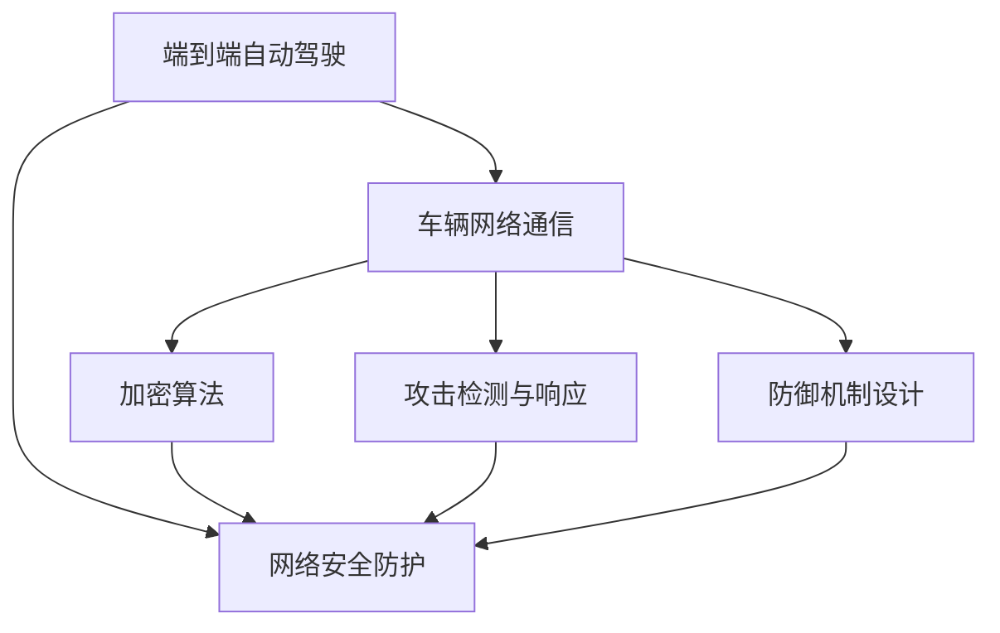

                 

# 端到端自动驾驶的车辆网络安全防护

## 1. 背景介绍

随着自动驾驶技术的日益成熟，其面临的网络安全问题也日益严峻。在自动驾驶场景中，车辆与车辆、车辆与基础设施之间的通信，以及与云端系统的数据交互，使得车辆网络安全成为不可忽视的重要课题。本博客将对端到端自动驾驶的车辆网络安全防护进行全面深入的探讨。

### 1.1 问题由来

自动驾驶车辆的网络安全问题主要源于以下三个方面：

1. **车辆通信的开放性**：自动驾驶车辆与车辆、车辆与基础设施、车辆与云端之间的通信，常常基于公共的通信协议，如CAN总线、4G/5G网络等，这些协议的设计初衷是开放和通用，但在保障安全方面存在先天不足。

2. **数据依赖的高敏感性**：自动驾驶系统高度依赖高精度地图、车辆传感器数据、云端计算等，这些数据一旦被篡改或泄露，将直接威胁到行车安全。

3. **控制指令的易攻击性**：自动驾驶系统往往需要接收来自车辆、基础设施和云端的控制指令，这些指令一旦被恶意篡改或拦截，可能导致车辆行为失控，带来严重安全事故。

### 1.2 问题核心关键点

端到端自动驾驶的网络安全防护，关键在于以下几个方面：

1. **数据加密和身份认证**：保障数据在传输过程中的安全，防止数据篡改和窃听。

2. **攻击检测与响应**：及时发现并处理网络攻击，避免系统被恶意控制。

3. **防御机制设计**：构建多层次的安全防御体系，增强系统的鲁棒性和自适应能力。

4. **法律法规与标准规范**：制定并遵循网络安全相关法律法规和行业标准，确保安全防护的合规性。

## 2. 核心概念与联系

### 2.1 核心概念概述

为更好地理解端到端自动驾驶的车辆网络安全防护，本节将介绍几个关键概念：

- **端到端自动驾驶(End-to-End Autonomous Driving)**：指从车辆感知、决策到执行的整个过程，通过软件定义的方式实现自动驾驶。

- **网络安全防护(Network Security Protection)**：通过一系列安全技术和措施，保障网络通信的安全，防止恶意攻击和数据泄露。

- **车辆网络通信(Vehicle Network Communication)**：指自动驾驶车辆与车辆、基础设施、云端之间的信息交换。

- **加密算法(Cryptography)**：一种将数据转换为难以解读的格式，以保障数据传输安全的算法。

- **攻击检测与响应(Attack Detection and Response)**：通过监控网络流量，识别和响应潜在攻击，保障系统安全。

- **防御机制设计(Defense Mechanism Design)**：构建多层次的防御体系，包括物理安全、网络安全、应用安全等。

这些核心概念之间的逻辑关系可以通过以下Mermaid流程图来展示：



这个流程图展示了几者的关系：

1. 端到端自动驾驶通过网络通信实现，需要网络安全防护。
2. 车辆网络通信涉及到加密算法、攻击检测与响应、防御机制设计等。
3. 加密算法、攻击检测与响应、防御机制设计都是网络安全防护的重要组成部分。

## 3. 核心算法原理 & 具体操作步骤
### 3.1 算法原理概述

端到端自动驾驶的车辆网络安全防护，主要基于以下几个核心算法：

- **加密算法**：用于保障数据在传输过程中的机密性和完整性。
- **数字签名算法**：用于验证数据的来源和真实性。
- **入侵检测系统(IDS)**：用于监控和检测网络异常流量，识别潜在攻击。
- **防火墙(Firewall)**：用于隔离不信任网络，防止未经授权的数据访问。
- **安全防御机制**：包括物理安全、网络安全、应用安全等多个层次，构建多维度防护体系。

### 3.2 算法步骤详解

端到端自动驾驶的车辆网络安全防护，通常包括以下几个关键步骤：

**Step 1: 数据加密与传输**

- 使用加密算法(如AES、RSA等)对关键数据进行加密，防止数据在传输过程中被窃听和篡改。
- 采用安全的传输协议(如TLS/SSL)，保障数据在网络传输中的完整性和可靠性。
- 确保通信过程中的身份认证，防止中间人攻击。

**Step 2: 攻击检测与响应**

- 部署入侵检测系统(IDS)，实时监控网络流量，识别可疑行为。
- 一旦检测到异常流量，立即触发告警，并进行紧急响应处理。
- 使用异常流量分析技术，分析攻击特征，及时采取措施，减少损失。

**Step 3: 防御机制设计**

- 在车辆硬件上采取物理安全措施，如硬件加密模块、防篡改模块等。
- 在网络层设置防火墙，过滤和隔离恶意流量。
- 在应用层进行安全编码和漏洞修复，防止常见攻击(如SQL注入、跨站脚本等)。
- 构建分布式防御体系，提高系统的鲁棒性和自适应能力。

### 3.3 算法优缺点

端到端自动驾驶的车辆网络安全防护，具有以下优点：

1. **安全性高**：通过多层次的安全防护措施，保障数据传输的安全性和完整性。
2. **实时性强**：使用入侵检测系统(IDS)等技术，能够实时监控网络行为，快速响应攻击。
3. **可扩展性强**：可以根据不同场景和需求，灵活调整防御机制，构建多层次的安全防护体系。

同时，该方法也存在一些局限性：

1. **复杂度高**：安全防护措施的实施，可能会增加系统的复杂性和维护成本。
2. **实时性能要求高**：高安全防护机制的实施，可能会影响系统的实时性能。
3. **法规遵从性要求高**：需要遵守相关的法律法规和行业标准，以确保安全防护的合法合规。

## 4. 数学模型和公式 & 详细讲解  
### 4.1 数学模型构建

本节将使用数学语言对端到端自动驾驶的车辆网络安全防护过程进行更加严格的刻画。

记自动驾驶车辆的关键数据为 $D$，加密后的数据为 $E(D)$，入侵检测系统检测到的异常流量为 $A$，防御机制生成的安全日志为 $L$。安全防护的目标是最小化数据泄露和攻击成功的概率，即：

$$
\min_{E, A, L} \mathbb{P}(D \rightarrow E(D)) + \mathbb{P}(A)
$$

其中 $\mathbb{P}(D \rightarrow E(D))$ 表示数据泄露的概率，$\mathbb{P}(A)$ 表示攻击成功的概率。

### 4.2 公式推导过程

以下我们以AES加密算法为例，推导加密过程的数学公式。

假设明文为 $D$，密钥为 $K$，则AES加密过程如下：

$$
E(D, K) = F_{K}(D)
$$

其中 $F_{K}(D)$ 表示使用密钥 $K$ 对明文 $D$ 进行加密的过程。

### 4.3 案例分析与讲解

假设自动驾驶车辆需要传输一份地图数据，明文长度为 $L$，采用AES-128加密算法进行加密，密钥为 $K$。计算加密后数据的长度和加密后的数据：

$$
E(D) = F_{K}(D)
$$

其中 $F_{K}(D)$ 表示使用密钥 $K$ 对明文 $D$ 进行加密的过程。

加密后的数据长度为 $L$，即与明文长度相同。

## 5. 项目实践：代码实例和详细解释说明
### 5.1 开发环境搭建

在进行车辆网络安全防护实践前，我们需要准备好开发环境。以下是使用Python进行OpenSSL和OpenVPX开发的环境配置流程：

1. 安装Anaconda：从官网下载并安装Anaconda，用于创建独立的Python环境。

2. 创建并激活虚拟环境：
```bash
conda create -n ssl-vpux-env python=3.8 
conda activate ssl-vpux-env
```

3. 安装OpenSSL和OpenVPX库：
```bash
conda install openssl
conda install openvpux
```

4. 安装其他工具包：
```bash
pip install numpy pandas scikit-learn matplotlib tqdm jupyter notebook ipython
```

完成上述步骤后，即可在`ssl-vpux-env`环境中开始安全防护实践。

### 5.2 源代码详细实现

这里我们以AES加密算法为例，给出使用OpenSSL和OpenVPX库对地图数据进行加密的Python代码实现。

首先，定义加密和解密函数：

```python
from Crypto.Cipher import AES
from Crypto.Random import get_random_bytes

def encrypt(data, key):
    cipher = AES.new(key, AES.MODE_EAX)
    nonce = cipher.nonce
    ciphertext, tag = cipher.encrypt_and_digest(data)
    return cipher.nonce + ciphertext + tag

def decrypt(ciphertext, key):
    nonce = ciphertext[:16]
    ciphertext = ciphertext[16:]
    tag = ciphertext[-16:]
    ciphertext = ciphertext[:-16]
    cipher = AES.new(key, AES.MODE_EAX, nonce=nonce)
    try:
        return cipher.decrypt_and_verify(ciphertext, tag)
    except ValueError:
        print("Invalid tag")
        return None
```

然后，使用AES加密算法对地图数据进行加密：

```python
import os
from Crypto.Cipher import AES
from Crypto.Random import get_random_bytes

def main():
    # 生成随机密钥
    key = get_random_bytes(16)

    # 加载地图数据
    with open('map_data.txt', 'r') as f:
        map_data = f.read().encode()

    # 加密地图数据
    ciphertext = encrypt(map_data, key)

    # 输出加密后的数据和密钥
    print(f"加密后的数据: {ciphertext}")
    print(f"加密密钥: {key}")

if __name__ == '__main__':
    main()
```

最后，使用解密函数对加密后的数据进行解密：

```python
import os
from Crypto.Cipher import AES
from Crypto.Random import get_random_bytes

def main():
    # 加载加密数据和密钥
    ciphertext = 'GyJQW6cI3AoJG6LHlG6sT6sT6sT6sT6sT6sT6sT6sT6sT6sT6sT6sT6sT6sT6sT6sT6sT6sT6sT6sT6sT6sT6sT6sT6sT6sT6sT6sT6sT6sT6sT6sT6sT6sT6sT6sT6sT6sT6sT6sT6sT6sT6sT6sT6sT6sT6sT6sT6sT6sT6sT6sT6sT6sT6sT6sT6sT6sT6sT6sT6sT6sT6sT6sT6sT6sT6sT6sT6sT6sT6sT6sT6sT6sT6sT6sT6sT6sT6sT6sT6sT6sT6sT6sT6sT6sT6sT6sT6sT6sT6sT6sT6sT6sT6sT6sT6sT6sT6sT6sT6sT6sT6sT6sT6sT6sT6sT6sT6sT6sT6sT6sT6sT6sT6sT6sT6sT6sT6sT6sT6sT6sT6sT6sT6sT6sT6sT6sT6sT6sT6sT6sT6sT6sT6sT6sT6sT6sT6sT6sT6sT6sT6sT6sT6sT6sT6sT6sT6sT6sT6sT6sT6sT6sT6sT6sT6sT6sT6sT6sT6sT6sT6sT6sT6sT6sT6sT6sT6sT6sT6sT6sT6sT6sT6sT6sT6sT6sT6sT6sT6sT6sT6sT6sT6sT6sT6sT6sT6sT6sT6sT6sT6sT6sT6sT6sT6sT6sT6sT6sT6sT6sT6sT6sT6sT6sT6sT6sT6sT6sT6sT6sT6sT6sT6sT6sT6sT6sT6sT6sT6sT6sT6sT6sT6sT6sT6sT6sT6sT6sT6sT6sT6sT6sT6sT6sT6sT6sT6sT6sT6sT6sT6sT6sT6sT6sT6sT6sT6sT6sT6sT6sT6sT6sT6sT6sT6sT6sT6sT6sT6sT6sT6sT6sT6sT6sT6sT6sT6sT6sT6sT6sT6sT6sT6sT6sT6sT6sT6sT6sT6sT6sT6sT6sT6sT6sT6sT6sT6sT6sT6sT6sT6sT6sT6sT6sT6sT6sT6sT6sT6sT6sT6sT6sT6sT6sT6sT6sT6sT6sT6sT6sT6sT6sT6sT6sT6sT6sT6sT6sT6sT6sT6sT6sT6sT6sT6sT6sT6sT6sT6sT6sT6sT6sT6sT6sT6sT6sT6sT6sT6sT6sT6sT6sT6sT6sT6sT6sT6sT6sT6sT6sT6sT6sT6sT6sT6sT6sT6sT6sT6sT6sT6sT6sT6sT6sT6sT6sT6sT6sT6sT6sT6sT6sT6sT6sT6sT6sT6sT6sT6sT6sT6sT6sT6sT6sT6sT6sT6sT6sT6sT6sT6sT6sT6sT6sT6sT6sT6sT6sT6sT6sT6sT6sT6sT6sT6sT6sT6sT6sT6sT6sT6sT6sT6sT6sT6sT6sT6sT6sT6sT6sT6sT6sT6sT6sT6sT6sT6sT6sT6sT6sT6sT6sT6sT6sT6sT6sT6sT6sT6sT6sT6sT6sT6sT6sT6sT6sT6sT6sT6sT6sT6sT6sT6sT6sT6sT6sT6sT6sT6sT6sT6sT6sT6sT6sT6sT6sT6sT6sT6sT6sT6sT6sT6sT6sT6sT6sT6sT6sT6sT6sT6sT6sT6sT6sT6sT6sT6sT6sT6sT6sT6sT6sT6sT6sT6sT6sT6sT6sT6sT6sT6sT6sT6sT6sT6sT6sT6sT6sT6sT6sT6sT6sT6sT6sT6sT6sT6sT6sT6sT6sT6sT6sT6sT6sT6sT6sT6sT6sT6sT6sT6sT6sT6sT6sT6sT6sT6sT6sT6sT6sT6sT6sT6sT6sT6sT6sT6sT6sT6sT6sT6sT6sT6sT6sT6sT6sT6sT6sT6sT6sT6sT6sT6sT6sT6sT6sT6sT6sT6sT6sT6sT6sT6sT6sT6sT6sT6sT6sT6sT6sT6sT6sT6sT6sT6sT6sT6sT6sT6sT6sT6sT6sT6sT6sT6sT6sT6sT6sT6sT6sT6sT6sT6sT6sT6sT6sT6sT6sT6sT6sT6sT6sT6sT6sT6sT6sT6sT6sT6sT6sT6sT6sT6sT6sT6sT6sT6sT6sT6sT6sT6sT6sT6sT6sT6sT6sT6sT6sT6sT6sT6sT6sT6sT6sT6sT6sT6sT6sT6sT6sT6sT6sT6sT6sT6sT6sT6sT6sT6sT6sT6sT6sT6sT6sT6sT6sT6sT6sT6sT6sT6sT6sT6sT6sT6sT6sT6sT6sT6sT6sT6sT6sT6sT6sT6sT6sT6sT6sT6sT6sT6sT6sT6sT6sT6sT6sT6sT6sT6sT6sT6sT6sT6sT6sT6sT6sT6sT6sT6sT6sT6sT6sT6sT6sT6sT6sT6sT6sT6sT6sT6sT6sT6sT6sT6sT6sT6sT6sT6sT6sT6sT6sT6sT6sT6sT6sT6sT6sT6sT6sT6sT6sT6sT6sT6sT6sT6sT6sT6sT6sT6sT6sT6sT6sT6sT6sT6sT6sT6sT6sT6sT6sT6sT6sT6sT6sT6sT6sT6sT6sT6sT6sT6sT6sT6sT6sT6sT6sT6sT6sT6sT6sT6sT6sT6sT6sT6sT6sT6sT6sT6sT6sT6sT6sT6sT6sT6sT6sT6sT6sT6sT6sT6sT6sT6sT6sT6sT6sT6sT6sT6sT6sT6sT6sT6sT6sT6sT6sT6sT6sT6sT6sT6sT6sT6sT6sT6sT6sT6sT6sT6sT6sT6sT6sT6sT6sT6sT6sT6sT6sT6sT6sT6sT6sT6sT6sT6sT6sT6sT6sT6sT6sT6sT6sT6sT6sT6sT6sT6sT6sT6sT6sT6sT6sT6sT6sT6sT6sT6sT6sT6sT6sT6sT6sT6sT6sT6sT6sT6sT6sT6sT6sT6sT6sT6sT6sT6sT6sT6sT6sT6sT6sT6sT6sT6sT6sT6sT6sT6sT6sT6sT6sT6sT6sT6sT6sT6sT6sT6sT6sT6sT6sT6sT6sT6sT6sT6sT6sT6sT6sT6sT6sT6sT6sT6sT6sT6sT6sT6sT6sT6sT6sT6sT6sT6sT6sT6sT6sT6sT6sT6sT6sT6sT6sT6sT6sT6sT6sT6sT6sT6sT6sT6sT6sT6sT6sT6sT6sT6sT6sT6sT6sT6sT6sT6sT6sT6sT6sT6sT6sT6sT6sT6sT6sT6sT6sT6sT6sT6sT6sT6sT6sT6sT6sT6sT6sT6sT6sT6sT6sT6sT6sT6sT6sT6sT6sT6sT6sT6sT6sT6sT6sT6sT6sT6sT6sT6sT6sT6sT6sT6sT6sT6sT6sT6sT6sT6sT6sT6sT6sT6sT6sT6sT6sT6sT6sT6sT6sT6sT6sT6sT6sT6sT6sT6sT6sT6sT6sT6sT6sT6sT6sT6sT6sT6sT6sT6sT6sT6sT6sT6sT6sT6sT6sT6sT6sT6sT6sT6sT6sT6sT6sT6sT6sT6sT6sT6sT6sT6sT6sT6sT6sT6sT6sT6sT6sT6sT6sT6sT6sT6sT6sT6sT6sT6sT6sT6sT6sT6sT6sT6sT6sT6sT6sT6sT6sT6sT6sT6sT6sT6sT6sT6sT6sT6sT6sT6sT6sT6sT6sT6sT6sT6sT6sT6sT6sT6sT6sT6sT6sT6sT6sT6sT6sT6sT6sT6sT6sT6sT6sT6sT6sT6sT6sT6sT6sT6sT6sT6sT6sT6sT6sT6sT6sT6sT6sT6sT6sT6sT6sT6sT6sT6sT6sT6sT6sT6sT6sT6sT6sT6sT6sT6sT6sT6sT6sT6sT6sT6sT6sT6sT6sT6sT6sT6sT6sT6sT6sT6sT6sT6sT6sT6sT6sT6sT6sT6sT6sT6sT6sT6sT6sT6sT6sT6sT6sT6sT6sT6sT6sT6sT6sT6sT6sT6sT6sT6sT6sT6sT6sT6sT6sT6sT6sT6sT6sT6sT6sT6sT6sT6sT6sT6sT6sT6sT6sT6sT6sT6sT6sT6sT6sT6sT6sT6sT6sT6sT6sT6sT6sT6sT6sT6sT6sT6sT6sT6sT6sT6sT6sT6sT6sT6sT6sT6sT6sT6sT6sT6sT6sT6sT6sT6sT6sT6sT6sT6sT6sT6sT6sT6sT6sT6sT6sT6sT6sT6sT6sT6sT6sT6sT6sT6sT6sT6sT6sT6sT6sT6sT6sT6sT6sT6sT6sT6sT6sT6sT6sT6sT6sT6sT6sT6sT6sT6sT6sT6sT6sT6sT6sT6sT6sT6sT6sT6sT6sT6sT6sT6sT6sT6sT6sT6sT6sT6sT6sT6sT6sT6sT6sT6sT6sT6sT6sT6sT6sT6sT6sT6sT6sT6sT6sT6sT6sT6sT6sT6sT6sT6sT6sT6sT6sT6sT6sT6sT6sT6sT6sT6sT6sT6sT6sT6sT6sT6sT6sT6sT6sT6sT6sT6sT6sT6sT6sT6sT6sT6sT6sT6sT6sT6sT6sT6sT6sT6sT6sT6sT6sT6sT6sT6sT6sT6sT6sT6sT6sT6sT6sT6sT6sT6sT6sT6sT6sT6sT6sT6sT6sT6sT6sT6sT6sT6sT6sT6sT6sT6sT6sT6sT6sT6sT6sT6sT6sT6sT6sT6sT6sT6sT6sT6sT6sT6sT6sT6sT6sT6sT6sT6sT6sT6sT6sT6sT6sT6sT6sT6sT6sT6sT6sT6sT6sT6sT6sT6sT6sT6sT6sT6sT6sT6sT6sT6sT6sT6sT6sT6sT6sT6sT6sT6sT6sT6sT6sT6sT6sT6sT6sT6sT6sT6sT6sT6sT6sT6sT6sT6sT6sT6sT6sT6sT6sT6sT6sT6sT6sT6sT6sT6sT6sT6sT6sT6sT6sT6sT6sT6sT6sT6sT6sT6sT6sT6sT6sT6sT6sT6sT6sT6sT6sT6sT6sT6sT6sT6sT6sT6sT6sT6sT6sT6sT6sT6sT6sT6sT6sT6sT6sT6sT6sT6sT6sT6sT6sT6sT6sT6sT6sT6sT6sT6sT6sT6sT6sT6sT6sT6sT6sT6sT6sT6sT6sT6sT6sT6sT6sT6sT6sT6sT6sT6sT6sT6sT6sT6sT6sT6sT6sT6sT6sT6sT6sT6sT6sT6sT6sT6sT6sT6sT6sT6sT6sT6sT6sT6sT6sT6sT6sT6sT6sT6sT6sT6sT6sT6sT6sT6sT6sT6sT6sT6sT6sT6sT6sT6sT6sT6sT6sT6sT6sT6sT6sT6sT6sT6sT6sT6sT6sT6sT6sT6sT6sT6sT6sT6sT6sT6sT6sT6sT6sT6sT6sT6sT6sT6sT6sT6sT6sT6sT6sT6sT6sT6sT6sT6sT6sT6sT6sT6sT6sT6sT6sT6sT6sT6sT6sT6sT6sT6sT6sT6sT6sT6sT6sT6sT6sT6sT6sT6sT6sT6sT6sT6sT6sT6sT6sT6sT6sT6sT6sT6sT6sT6sT6sT6sT6sT6sT6sT6sT6sT6sT6sT6sT6sT6sT6sT6sT6sT6sT6sT6sT6sT6sT6sT6sT6sT6sT6sT6sT6sT6sT6sT6sT6sT6sT6sT6sT6sT6sT6sT6sT6sT6sT6sT6sT6sT6sT6sT6sT6sT6sT6sT6sT6sT6sT6sT6sT6sT6sT6sT6sT6sT6sT6sT6sT6sT6sT6sT6sT6sT6sT6sT6sT6sT6sT6sT6sT6sT6sT6sT6sT6sT6sT6sT6sT6sT6sT6sT6sT6sT6sT6sT6sT6sT6sT6sT6sT6sT6sT6sT6sT6sT6sT6sT6sT6sT6sT6sT6sT6sT6sT6sT6sT6sT6sT6sT6sT6sT6sT6sT6sT6sT6sT6sT6sT6sT6sT6sT6sT6sT6sT6sT6sT6sT6sT6sT6sT6sT6sT6sT6sT6sT6sT6sT6sT6sT6sT6sT6sT6sT6sT6sT6sT6sT6sT6sT6sT6sT6sT6sT6sT6sT6sT6sT6sT6sT6sT6sT6sT6sT6sT6sT6sT6sT6sT6sT6sT6sT6sT6sT6sT6sT6sT6sT6sT6sT6sT6sT6sT6sT6sT6sT6sT6sT6sT6sT6sT6sT6sT6sT6sT6sT6sT6sT6sT6sT6sT6sT6sT6sT6sT6sT6sT6sT6sT6sT6sT6sT6sT6sT6sT6sT6sT6sT6sT6sT6sT6sT6sT6sT6sT6sT6sT6sT6sT6sT6sT6sT6sT6sT6sT6sT6sT6sT6sT6sT6sT6sT6sT6sT6sT6sT6sT6sT6sT6sT6sT6sT6sT6sT6sT6sT6sT6sT6sT6sT6sT6sT6sT6sT6sT6sT6sT6sT6sT6sT6sT6sT6sT6sT6sT6sT6sT6sT6sT6sT6sT6sT6sT6sT6sT6sT6sT6sT6sT6sT6sT6sT6sT6sT6sT6sT6sT6sT6sT6sT6sT6sT6sT6sT6sT6sT6sT6sT6sT6sT6sT6sT6sT6sT6sT6sT6sT6sT6sT6sT6sT6sT6sT6sT6sT6sT6sT6sT6sT6sT6sT6sT6sT6sT6sT6sT6sT6sT6sT6sT6sT6sT6sT6sT6sT6sT6sT6sT6sT6sT6sT6sT6sT6sT6sT6sT6sT6sT6sT6sT6sT6sT6sT6sT6sT6sT6sT6sT6sT6sT6sT6sT6sT6sT6sT6sT6sT6sT6sT6sT6sT6sT6sT6sT6sT6sT6sT6sT6sT6sT6sT6sT6sT6sT6sT6sT6sT6sT6sT6sT6sT6sT6sT6sT6sT6sT6sT6sT6sT6sT6sT6sT6sT6sT6sT6sT6sT6sT6sT6sT6sT6sT6sT6sT6sT6sT6sT6sT6sT6sT6sT6sT6sT6sT6sT6sT6sT6sT6sT6sT6sT6sT6sT6sT6sT6sT6sT6sT6sT6sT6sT6sT6sT6sT6sT6sT6sT6sT6sT6sT6sT6sT6sT6sT6sT6sT6sT6sT6sT6sT6sT6sT6sT6sT6sT6sT6sT6sT6sT6sT6sT6sT6sT6sT6sT6sT6sT6sT6sT6sT6sT6sT6sT6sT6sT6sT6sT6sT6sT6sT6sT6sT6sT6sT6sT6sT6sT6sT6sT6sT6sT6sT6sT6sT6sT6sT6sT6sT6sT6sT6sT6sT6sT6sT6sT6sT6sT6sT6sT6sT6sT6sT6sT6sT6sT6sT6sT6sT6sT6sT6sT6sT6sT6sT6sT6sT6sT6sT6sT6sT6sT6sT6sT6sT6sT6sT6sT6sT6sT6sT6sT6sT6sT6sT6sT6sT6sT6sT6sT6sT6sT6sT6sT6sT6sT6sT6sT6sT6sT6sT6sT6sT6sT6sT6sT6sT6sT6sT6sT6sT6sT6sT6sT6sT6sT6sT6sT6sT6sT6sT6sT6sT6s

