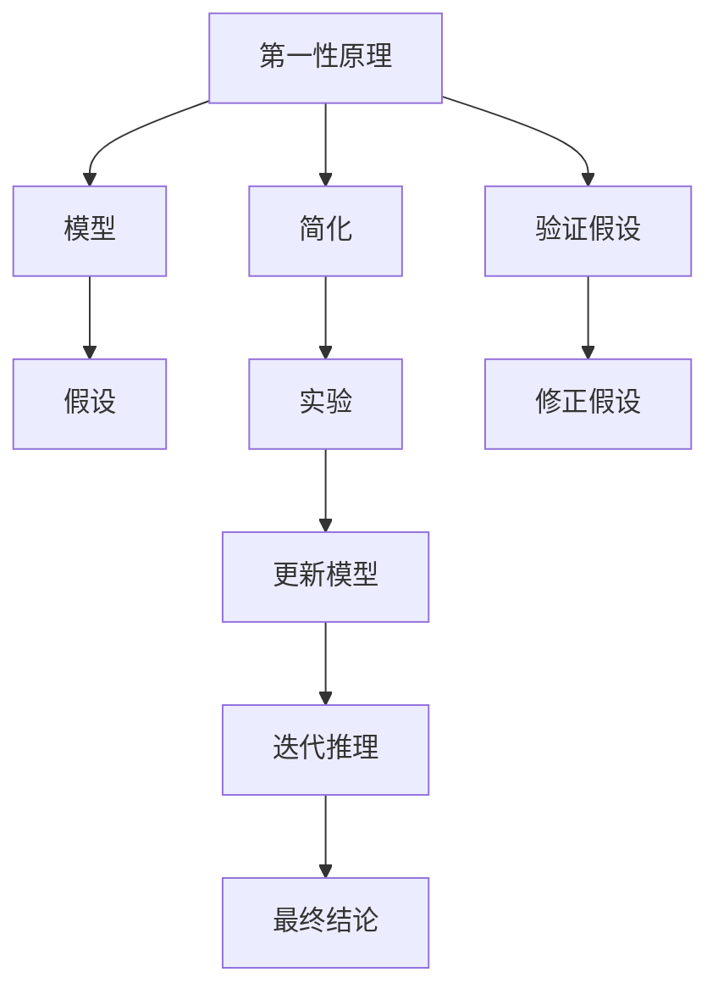

                 

# 第一性原理：科学探究的基石

> 关键词：第一性原理, 科学探究, 物理, 化学, 技术, 工程, 创新, 模型, 复杂性, 简洁性

## 1. 背景介绍

### 1.1 问题由来

科学探究是人类理解世界、推动进步的核心活动。从古希腊哲学家的追问到近代科学革命，从牛顿的万有引力到爱因斯坦的相对论，科学的每一步进展都离不开对“第一性原理”的探索。

在现代科技发展中，第一性原理思考更是成为突破复杂技术瓶颈的关键。不论是物理学、化学，还是工程技术，第一性原理都在激发新的科学发现和创新实践中扮演着至关重要的角色。

### 1.2 问题核心关键点

第一性原理思考的核心理念是“回到基本原理”，从最基础的、最本质的理论出发，推导新的结论，解决复杂问题。在科技发展中，第一性原理思考要求我们从最基础的数据和事实出发，打破现有理论和技术的束缚，提出全新的观点和方法。

实施第一性原理思考的关键在于：

1. 理解基本原理：准确把握某一领域的核心概念和基本定律。
2. 提出假设验证：通过数学模型或实验验证，不断迭代修正假设，以符合现实世界的规律。
3. 简化复杂系统：将复杂系统分解为可控的、可理解的部分，逐一分析和解决问题。

第一性原理思考的优点在于：

1. 创新性强：能够产生颠覆性新思想，突破传统框架。
2. 适应性强：基本原理具有普适性，适用于多种情境。
3. 可靠性高：直接从基本原理出发，不易受误导或干扰。

第一性原理思考的挑战在于：

1. 理解难度大：基本原理往往抽象且深奥，需要高度的数学和物理素养。
2. 实验周期长：验证假设需要大量实验数据和时间。
3. 创新风险高：新假设可能与现有理论冲突，结果未必如预期。

尽管面临这些挑战，第一性原理思考仍是推动科学和技术发展的重要方法论，能够带来根本性的变革和突破。

### 1.3 问题研究意义

在科技日新月异的今天，第一性原理思考对于解决复杂技术问题、驱动技术创新具有不可替代的价值。通过掌握和应用第一性原理，科学家和工程师能够更深刻地理解自然规律，找到问题的本质，设计出更高效、更可持续的技术方案。

## 2. 核心概念与联系

### 2.1 核心概念概述

为了更好地理解第一性原理，本文将介绍几个核心概念及其相互关系：

- 第一性原理(First Principles)：基于最基本的理论或定律出发，推导出新的结论，用于解决复杂问题。
- 模型(Model)：通过抽象简化现实世界，构建出用于研究和计算的理论框架。
- 简化(Simplification)：将复杂系统分解为可控的部分，逐一分析和解决问题。
- 假设(Hypothesis)：根据已有数据和理论提出可能成立的命题，用于验证和推导。
- 实验(Experiment)：通过实际观测和测试，验证假设是否符合现实。

这些概念共同构成了第一性原理思考的基础，有助于我们理解和应用第一性原理解决各类问题。

### 2.2 核心概念原理和架构的 Mermaid 流程图



这个流程图展示了第一性原理思考的基本步骤：

1. 从基本原理出发，构建模型。
2. 通过简化，将复杂问题分解为可控的部分。
3. 提出假设，进行实验验证。
4. 根据实验结果修正假设，更新模型。
5. 迭代推理，直至得到最终结论。

这个流程帮助我们将复杂问题转化为可控的部分，逐一解决，同时保持对基本原理的深刻理解，以确保结论的可靠性。

## 3. 核心算法原理 & 具体操作步骤

### 3.1 算法原理概述

第一性原理思考本质上是一种系统性的研究方法，其核心在于通过简化和实验，验证假设，从而得出符合现实的结论。具体来说，它包括以下几个步骤：

1. 确定基本原理和假设。
2. 构建简化的模型。
3. 设计实验，收集数据。
4. 根据数据验证假设，修正模型。
5. 迭代推理，得出结论。

第一性原理思考强调从基础出发，通过实验和模型验证，推导出新的结论，最终解决复杂问题。

### 3.2 算法步骤详解

#### 3.2.1 确定基本原理和假设

这一步骤要求我们从现有知识体系中提取最核心的概念和定律，并根据这些问题提出初步的假设。例如，在物理学中，牛顿力学和爱因斯坦的相对论可以视为基本原理；在化学中，原子结构理论和化学键理论是基础。

具体方法包括：

- 文献调研：广泛阅读领域内重要文献，掌握基础理论和历史背景。
- 专家咨询：与领域内专家进行交流，获取他们的经验和见解。
- 创新思维：结合最新的技术进展和实验结果，提出新的假设。

#### 3.2.2 构建简化的模型

在这一步骤中，我们需要将复杂系统简化，构建出可操作的数学或物理模型。简化模型的目的是为了清晰地描述问题，并便于进行计算和验证。

具体方法包括：

- 数学建模：将问题转化为数学表达式，通过求解得到结论。
- 物理建模：构建物理模型，通过数值模拟验证假设。
- 分子模型：利用分子动力学等方法，描述微观过程。

#### 3.2.3 设计实验，收集数据

在这一步骤中，我们通过实验收集数据，验证模型和假设。实验设计要求系统性和可重复性，能够准确反映实际问题的规律。

具体方法包括：

- 实验设计：合理设计实验流程，控制变量，确保结果可靠。
- 数据收集：使用高级仪器或软件，精确测量实验数据。
- 数据处理：对数据进行清洗、分析和可视化，发现规律。

#### 3.2.4 根据数据验证假设，修正模型

这一步骤是第一性原理思考的关键，它要求我们根据实验数据，修正模型和假设，确保结论与现实一致。

具体方法包括：

- 假设验证：将实验数据与模型预测结果进行对比，判断假设是否成立。
- 模型修正：根据实验结果，调整模型参数或结构，确保模型更贴近现实。
- 假设迭代：不断提出新的假设，进行实验验证，确保结果不断逼近真实。

#### 3.2.5 迭代推理，得出结论

这一步骤要求我们不断迭代模型和假设，直到得到可靠结论。迭代推理需要坚持逻辑性和系统性，确保每一轮验证都基于前一轮的结果。

具体方法包括：

- 多次实验：进行多次实验，验证模型和假设的一致性。
- 多角度分析：从不同角度分析问题，确保结论的全面性。
- 综合结论：将各轮实验结果综合，得出最终结论。

### 3.3 算法优缺点

第一性原理思考的优点在于：

1. 创新性高：通过返璞归真，容易发现新思路和新方法。
2. 可靠性高：基于基本原理，不容易受到误导和干扰。
3. 适用性强：基本原理具有普适性，适用于多种情境。

第一性原理思考的缺点在于：

1. 理解难度大：基本原理抽象且深奥，需要高度的数学和物理素养。
2. 实验周期长：验证假设需要大量时间和资源。
3. 创新风险高：新假设可能与现有理论冲突，结果未必如预期。

尽管存在这些缺点，第一性原理思考仍是推动科学和技术发展的重要方法论，能够带来根本性的变革和突破。

### 3.4 算法应用领域

第一性原理思考在多个领域中得到广泛应用，包括：

- 物理学：如爱因斯坦的相对论、量子力学等，都是基于基本原理推导出来的。
- 化学：如原子结构理论、化学键理论等，提供了解释化学反应的基础。
- 工程学：如航空工程中的流体力学、结构力学等，基于基本物理定律设计。
- 计算机科学：如数据结构、算法设计等，基于基本计算模型。
- 生物医学：如分子生物学、遗传学等，基于基本生命科学原理。

以上应用领域展示了第一性原理思考的强大潜力，通过理解和应用第一性原理，我们可以在多个领域推动科学和技术的发展。

## 4. 数学模型和公式 & 详细讲解 & 举例说明

### 4.1 数学模型构建

第一性原理思考的数学模型通常基于以下几个步骤：

1. 定义基本变量和参数。
2. 构建数学方程或表达式。
3. 求解数学模型，得到结论。

以牛顿力学为例，我们可以定义位置、速度、加速度等基本变量，然后通过牛顿第二定律建立数学模型，求解得到物体的运动规律。

### 4.2 公式推导过程

以经典力学中的牛顿第二定律为例，公式推导如下：

$$
F = ma
$$

其中，$F$为作用力，$m$为物体的质量，$a$为加速度。这个公式表达了物体受力与其加速度之间的关系，是经典力学的基本方程。

### 4.3 案例分析与讲解

在化学中，第一性原理计算是研究分子和材料性质的重要手段。我们可以通过密度泛函理论构建数学模型，利用量子力学方法求解分子电子结构，从而得到分子性质的精确计算结果。

具体步骤如下：

1. 定义分子结构：将分子表示为原子点阵，确定每个原子的坐标和电子分布。
2. 构建密度泛函模型：利用电子密度和交换关联能函数，构建分子能量表达式。
3. 求解电子结构：使用自洽场方法求解分子电子结构，得到每个原子的电子云和波函数。
4. 计算分子性质：根据电子结构计算分子能级、电荷分布等性质。

## 5. 项目实践：代码实例和详细解释说明

### 5.1 开发环境搭建

在进行第一性原理计算项目实践时，我们需要准备好开发环境。以下是使用Python进行分子模拟环境搭建的步骤：

1. 安装Anaconda：从官网下载并安装Anaconda，用于创建独立的Python环境。

2. 创建并激活虚拟环境：
```bash
conda create -n physics-env python=3.8 
conda activate physics-env
```

3. 安装必要工具包：
```bash
conda install numpy scipy matplotlib
```

4. 安装开源计算库：
```bash
conda install pymatgen openbabel
```

5. 安装分子动力学模拟工具：
```bash
conda install lammps
```

完成上述步骤后，即可在`physics-env`环境中进行第一性原理计算实践。

### 5.2 源代码详细实现

下面我们以计算水分子的振动光谱为例，给出使用pymatgen库进行第一性原理计算的Python代码实现。

```python
from pymatgen.io.qchem import QchemInput, QchemOutput
from pymatgen.io.aset import prepare_qchem_input
from scipy import integrate

# 定义分子结构
input = QchemInput('O-H-H')
input.write('qchem.in')

# 运行Q-Chem计算
qchem_out = QchemOutput('qchem.out')
qchem_out.extract()

# 提取分子振动模式
vibrational_modes = qchem_out.data['vibrational_modes']
frequencies = [mode['frequencies'] for mode in vibrational_modes]
vibrational_frequencies = [freq[0] for freq in frequencies]

# 计算振动光谱密度
integrals = integrate.quad(lambda x: x * exp(-x), 0, np.inf)
gamma = 4 * np.pi * integrals[0]**2

# 计算振动光谱
vibrational_spectrum = np.exp(-gamma * np.array(vibrational_frequencies)**4)
vibrational_spectrum /= np.sum(vibrational_spectrum)

# 输出振动光谱密度
print('Vibrational spectrum density:', vibrational_spectrum)
```

以上代码展示了从分子结构输入到振动光谱计算的完整过程，通过pymatgen和Q-Chem的协同工作，能够高效计算出分子的振动光谱密度。

### 5.3 代码解读与分析

这段代码主要分为以下几个部分：

1. 准备分子结构输入：使用QchemInput类定义分子结构，并将其保存为qchem.in文件。
2. 运行Q-Chem计算：使用QchemOutput类提取Q-Chem的输出结果，包括振动模式等关键数据。
3. 提取振动模式：从Q-Chem输出中提取振动模式，并计算振动频率。
4. 计算振动光谱密度：使用积分公式计算振动光谱密度，得到归一化的光谱分布。
5. 输出振动光谱密度：打印振动光谱密度结果。

通过这一系列操作，我们能够通过第一性原理计算，精确预测分子的振动光谱，为分子结构和性质的研究提供重要数据支持。

## 6. 实际应用场景

### 6.1 新材料设计

第一性原理计算在新材料设计中具有重要应用。通过计算材料电子结构、热力学性质等，预测材料的物理和化学性质，优化材料设计。

例如，计算电池材料的电子结构，预测其电导率、热稳定性等性质，指导材料合成。通过优化材料结构，提高电池性能和安全性。

### 6.2 药物设计

第一性原理计算在药物设计中应用广泛，用于预测药物分子与靶点的相互作用，优化药物分子结构。

通过计算药物与靶点的结合能、亲和力等参数，预测药物的药效和毒性，优化药物分子设计。例如，计算抗癌药物的结合能，预测其抗肿瘤效果，指导新药开发。

### 6.3 催化剂设计

第一性原理计算在催化剂设计中也有重要应用，用于预测催化剂的活性和选择性，优化催化剂设计。

通过计算催化剂的电子结构和反应路径，预测其催化性能，优化催化剂结构。例如，计算金属催化剂的电子结构，预测其催化活性，指导催化剂合成。

### 6.4 未来应用展望

未来，随着第一性原理计算技术的不断发展，其在更多领域的应用前景将更加广阔：

1. 能源材料：通过第一性原理计算，预测和设计高效储能材料，推动能源科技发展。
2. 量子计算：利用第一性原理计算，研究量子计算机的物理实现，推动量子计算技术突破。
3. 生物医药：通过第一性原理计算，研究分子结构和反应机制，推动新药研发。
4. 新材料科学：利用第一性原理计算，研究新材料的设计和合成，推动新材料产业的发展。

## 7. 工具和资源推荐

### 7.1 学习资源推荐

为了帮助学习者系统掌握第一性原理计算的理论基础和实践技巧，这里推荐一些优质的学习资源：

1. 《物理化学原理》：经典的物理化学教材，涵盖第一性原理计算的基本原理和方法。
2. 《材料科学基础》：介绍材料科学的基本原理和方法，涵盖第一性原理计算的应用。
3. 《分子动力学模拟》：详细介绍分子动力学模拟的原理和应用，涵盖第一性原理计算的实践技巧。
4. 《化学键理论》：讲解化学键理论的基本概念和计算方法，涵盖第一性原理计算的化学背景。
5. 《计算化学导论》：介绍计算化学的基本原理和方法，涵盖第一性原理计算的应用。

通过对这些资源的学习实践，相信你一定能够快速掌握第一性原理计算的精髓，并用于解决实际的科学和技术问题。

### 7.2 开发工具推荐

有效的开发工具能够显著提高第一性原理计算的效率和准确性。以下是几款常用工具：

1. Pymatgen：一个用于材料模拟和分析的开源库，支持多种计算平台和格式。
2. Q-Chem：一款高性能的分子模拟软件，支持多种计算方法和工具链。
3. VASP：一个用于固体物理计算的开放源代码软件，支持第一性原理计算。
4. Gaussian：一款广泛用于有机化学计算的软件，支持第一性原理计算和分子模拟。
5. CP2K：一个基于密度泛函理论的软件包，支持量子力学计算和第一性原理计算。

合理利用这些工具，可以显著提升第一性原理计算的效率和准确性，加快科学和技术研究的步伐。

### 7.3 相关论文推荐

第一性原理计算作为一门前沿学科，其研究论文数量众多。以下是几篇奠基性的相关论文，推荐阅读：

1. DFT: Density Functional Theory of Solids (1989)：介绍了密度泛函理论的基本原理和应用。
2. Car-Parrinello Method: A New Method for Ab Initio Molecular Dynamics (1989)：提出了分子动力学模拟的Car-Parrinello方法。
3. GPUs in Density Functional Theory Calculations (2010)：介绍了GPU加速密度泛函理论计算的方法。
4. Materials Informatics: A New Infor-ation-Driven Paradigm of Materials Design (2015)：介绍了基于第一性原理计算的材料信息学方法。
5. AI for Drug Discovery (2020)：介绍了人工智能在药物设计中的应用，涵盖第一性原理计算的机器学习方法。

这些论文代表了大规模第一性原理计算的发展脉络，通过学习这些前沿成果，可以帮助研究者把握学科前进方向，激发更多的创新灵感。

## 8. 总结：未来发展趋势与挑战

### 8.1 研究成果总结

第一性原理计算在材料科学、化学、物理学、计算化学等领域中得到了广泛应用，取得了一系列重要成果。

1. 材料设计：预测和设计高效储能材料、半导体材料、催化剂等，推动材料科技发展。
2. 药物研发：预测和设计新型药物分子，推动新药开发进程。
3. 新材料科学：研究新材料的设计和合成，推动新材料产业的发展。
4. 催化剂研究：预测催化剂的活性和选择性，指导催化剂合成。

这些成果展示了第一性原理计算的强大潜力和广泛应用。

### 8.2 未来发展趋势

未来，随着第一性原理计算技术的不断发展，其在更多领域的应用前景将更加广阔：

1. 能源材料：通过第一性原理计算，预测和设计高效储能材料，推动能源科技发展。
2. 量子计算：利用第一性原理计算，研究量子计算机的物理实现，推动量子计算技术突破。
3. 生物医药：通过第一性原理计算，研究分子结构和反应机制，推动新药研发。
4. 新材料科学：利用第一性原理计算，研究新材料的设计和合成，推动新材料产业的发展。

这些趋势凸显了第一性原理计算的广阔前景，能够推动科学和技术在各个领域的发展。

### 8.3 面临的挑战

尽管第一性原理计算在多个领域中已经取得了显著成果，但仍然面临诸多挑战：

1. 计算复杂度高：第一性原理计算通常需要大量计算资源和计算时间。
2. 模型精度有限：第一性原理计算结果可能与实验数据存在差异。
3. 参数调优难度大：第一性原理计算中需要调整多个参数，找到最优的参数组合。
4. 数据获取困难：获取高精度实验数据和计算数据往往需要大量资源。
5. 算法复杂度高：第一性原理计算中需要使用复杂的数学和物理模型，计算难度大。

这些挑战需要研究者不断创新算法和模型，优化计算资源配置，提高计算效率和精度，推动第一性原理计算技术的发展。

### 8.4 研究展望

未来，第一性原理计算技术的发展方向主要包括以下几个方面：

1. 计算资源优化：开发高效的计算算法和工具，优化计算资源配置，提高计算效率和精度。
2. 多尺度计算：结合分子模拟和宏观模拟，实现从微观到宏观的多尺度计算。
3. 量子计算应用：探索第一性原理计算与量子计算的结合，推动量子计算技术的发展。
4. 新型计算模型：开发新型计算模型和方法，提高第一性原理计算的准确性和可靠性。
5. 跨学科应用：与其他学科领域结合，推动第一性原理计算在更多领域的应用。

这些研究方向将有助于克服第一性原理计算面临的挑战，推动其在各个领域的应用和发展，为科学研究和技术创新提供更强大的工具和支持。

## 9. 附录：常见问题与解答

**Q1：什么是第一性原理？**

A: 第一性原理是指基于最基本的理论或定律，推导新的结论，用于解决复杂问题。在科学研究和技术开发中，第一性原理思考要求我们从最基础的数据和事实出发，打破现有理论和技术的束缚，提出全新的观点和方法。

**Q2：第一性原理思考的优点和缺点有哪些？**

A: 第一性原理思考的优点包括：

1. 创新性高：通过返璞归真，容易发现新思路和新方法。
2. 可靠性高：基于基本原理，不容易受到误导和干扰。
3. 适用性强：基本原理具有普适性，适用于多种情境。

其缺点包括：

1. 理解难度大：基本原理抽象且深奥，需要高度的数学和物理素养。
2. 实验周期长：验证假设需要大量时间和资源。
3. 创新风险高：新假设可能与现有理论冲突，结果未必如预期。

尽管存在这些缺点，第一性原理思考仍是推动科学和技术发展的重要方法论，能够带来根本性的变革和突破。

**Q3：如何进行第一性原理计算？**

A: 第一性原理计算通常包括以下几个步骤：

1. 确定基本原理和假设。
2. 构建简化的模型。
3. 设计实验，收集数据。
4. 根据数据验证假设，修正模型。
5. 迭代推理，得出结论。

通过系统性、结构化的研究和实验，我们可以利用第一性原理计算解决复杂的科学和技术问题。

**Q4：第一性原理计算在哪些领域应用广泛？**

A: 第一性原理计算在物理学、化学、材料科学、计算化学等领域中应用广泛。

- 物理学：用于研究分子、原子、粒子的性质和相互作用。
- 化学：用于预测和设计新药物、新材料。
- 材料科学：用于研究新材料的物理和化学性质。
- 计算化学：用于研究化学反应和分子结构。

这些应用展示了第一性原理计算的强大潜力和广泛应用。

---

作者：禅与计算机程序设计艺术 / Zen and the Art of Computer Programming

