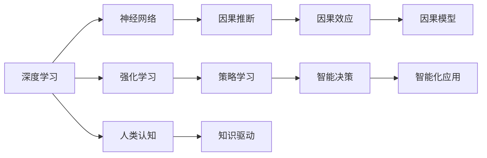

                 

# 第三代人工智能的理论发展

## 1. 背景介绍

### 1.1 问题由来
在过去几十年里，人工智能（AI）领域经历了多次重要发展阶段，每个阶段都在技术和理论层面上为AI的未来发展奠定了坚实的基础。第一代AI主要基于专家系统和规则，依赖手工编写的知识和规则来解决问题；第二代AI基于统计学习和机器学习，能够从数据中自动学习和提取规律；第三代AI（也称为人工智能增强学习，AI Augmented Learning）则进一步整合了人工智能与人类认知，开创了深度学习和强化学习的新纪元。

### 1.2 问题核心关键点
第三代人工智能的核心在于如何将人工智能与人类认知相融合，通过深度学习、强化学习和因果推断等技术，实现更加智能化的决策和学习。这一阶段，AI不再仅仅依赖于数据，而是能够借鉴人类专家的知识，进行更加灵活和自主的学习和推理。

### 1.3 问题研究意义
第三代人工智能的理论研究对于推动AI技术的持续创新和应用具有重要意义。它不仅能够提升AI在特定领域的应用效果，如医疗、金融、交通等，还能够为AI在复杂环境中的适应性和鲁棒性提供新的理论支持。通过深入研究第三代AI的理论基础和应用实践，可以更好地指导AI技术的开发和应用，推动AI技术在各行各业的深入应用。

## 2. 核心概念与联系

### 2.1 核心概念概述

为了更好地理解第三代人工智能的理论框架，我们首先需要明确几个核心概念：

- 深度学习：基于神经网络的机器学习技术，通过多层非线性变换来提取数据的高阶特征，广泛应用在图像、语音、自然语言处理等领域。
- 强化学习：通过智能体与环境的交互，利用奖励信号指导智能体学习最优策略，应用广泛于游戏、机器人控制、推荐系统等场景。
- 因果推断：研究变量间因果关系的技术，通过统计方法和算法估计因果效应，应用于医学、社会科学、经济等领域。
- 人类认知：指人类在信息处理、决策制定等方面的认知能力，包括注意力、记忆、推理、情感等方面。
- 神经网络：由人工神经元组成的计算模型，能够模拟人类大脑的神经连接和计算过程，是深度学习的基础。

这些核心概念共同构成了第三代人工智能的理论基础，其相互关系如图1所示：



图1：第三代人工智能的核心概念及其相互关系

## 3. 核心算法原理 & 具体操作步骤

### 3.1 算法原理概述

第三代人工智能的核心算法原理可以归纳为以下几个方面：

1. **深度学习**：利用神经网络模型学习数据的复杂表示，自动提取特征和规律。
2. **强化学习**：通过与环境的交互，智能体在不断试错中学习最优策略，实现自主决策。
3. **因果推断**：通过统计方法和算法，估计变量间的因果关系，预测未来事件。
4. **人类认知**：借鉴人类认知的机制，如注意力、记忆、推理等，增强AI的灵活性和自主性。

这些算法原理共同构成了第三代人工智能的理论基础，其核心思想是通过深度学习、强化学习和因果推断等技术，实现更加智能化和自主化的决策和学习过程。

### 3.2 算法步骤详解

第三代人工智能的算法实现一般包括以下几个关键步骤：

**Step 1: 数据收集与预处理**
- 收集与任务相关的数据集，并进行清洗、归一化等预处理操作。

**Step 2: 深度学习模型的训练**
- 选择合适的深度学习模型，如卷积神经网络（CNN）、循环神经网络（RNN）、Transformer等，进行模型训练。
- 利用标注数据训练模型，调整超参数，提高模型性能。

**Step 3: 强化学习的策略学习**
- 定义智能体的状态空间和行动空间，设计奖励函数。
- 使用深度学习模型或传统强化学习算法（如Q-learning、SARSA等），训练智能体学习最优策略。

**Step 4: 因果推断与决策**
- 利用因果推断方法（如因果图、回归模型等），估计因果关系。
- 结合人类认知机制，设计推理规则和决策模型。

**Step 5: 集成与部署**
- 将深度学习模型、强化学习策略和因果推断结果集成到实际应用系统中。
- 进行模型评估和优化，部署到生产环境。

### 3.3 算法优缺点

第三代人工智能算法具有以下优点：
1. 适应性强：能够处理复杂、多变的环境，具有较强的自适应能力。
2. 自主学习：能够自主学习知识，减少对人类专家的依赖。
3. 多模态融合：能够整合多种数据源和模态信息，提供更加全面的决策依据。
4. 鲁棒性好：能够处理噪声和不确定性，具有较强的鲁棒性和抗干扰能力。

同时，这些算法也存在一些局限性：
1. 计算资源需求高：深度学习模型和强化学习算法需要大量的计算资源和时间，成本较高。
2. 数据依赖性强：算法的效果高度依赖于数据的质量和数量，难以在大数据量下保证效果。
3. 可解释性差：部分深度学习模型和强化学习算法缺乏可解释性，难以理解其内部工作机制。
4. 易受攻击：深度学习模型和强化学习算法容易受到对抗样本的攻击，安全性问题需要进一步解决。

### 3.4 算法应用领域

第三代人工智能的算法已经在多个领域得到应用，如医疗、金融、交通、制造业等。以下是几个典型应用场景：

**医疗领域**
- **诊断和治疗**：利用深度学习和强化学习算法，进行疾病诊断和治疗方案推荐。
- **药物研发**：通过因果推断方法，分析药物作用机制，预测药物效果和副作用。

**金融领域**
- **风险管理**：利用强化学习算法，优化投资组合，降低风险。
- **欺诈检测**：利用深度学习算法，检测和识别金融欺诈行为。

**交通领域**
- **自动驾驶**：结合深度学习、强化学习和因果推断，实现自动驾驶技术。
- **交通流预测**：通过因果推断方法，预测交通流量和路径选择。

**制造业**
- **智能制造**：利用深度学习算法，优化生产流程，提升生产效率。
- **设备维护**：通过因果推断方法，预测设备故障，进行维护和检修。

## 4. 数学模型和公式 & 详细讲解 & 举例说明

### 4.1 数学模型构建

第三代人工智能的数学模型构建通常包括以下几个步骤：

1. **数据表示**：将输入数据表示为神经网络或强化学习模型的输入形式。
2. **损失函数设计**：根据任务需求，设计损失函数，衡量模型预测与真实结果之间的差距。
3. **优化算法选择**：选择合适的优化算法，如梯度下降、Adam等，更新模型参数。
4. **策略评估**：利用因果推断方法，评估模型的因果效应，检验模型的决策效果。

### 4.2 公式推导过程

以医疗领域的疾病诊断为例，介绍第三代人工智能的数学模型构建过程。

假设有一个二分类问题，输入数据为患者的历史病历和症状，输出为是否患有某疾病。我们可以使用如下公式进行表示：

$$
y = f(x; \theta)
$$

其中 $x$ 为输入的病历和症状数据，$y$ 为疾病诊断结果，$\theta$ 为模型参数。

假设我们使用了深度学习模型，如卷积神经网络（CNN），可以将其表示为：

$$
y = \sigma(\sum_{i=1}^n w_i x_i + b)
$$

其中 $\sigma$ 为激活函数，$x_i$ 为输入特征，$w_i$ 为权重参数，$b$ 为偏置项。

使用交叉熵损失函数来衡量模型预测与真实结果之间的差距：

$$
L(y, \hat{y}) = -y\log(\hat{y}) - (1-y)\log(1-\hat{y})
$$

其中 $\hat{y}$ 为模型预测结果。

使用梯度下降等优化算法，更新模型参数：

$$
\theta \leftarrow \theta - \eta \nabla_{\theta}L(y, \hat{y})
$$

其中 $\eta$ 为学习率。

### 4.3 案例分析与讲解

以自动驾驶为例，介绍第三代人工智能的应用。

自动驾驶系统需要处理复杂的交通环境，需要同时考虑车辆的位置、速度、其他车辆和行人的位置等信息，以及红绿灯、道路标志等环境信息。我们可以使用如下公式进行表示：

$$
\mathcal{L} = L_{position} + L_{speed} + L_{other_vehicles} + L_{environment}
$$

其中 $L_{position}$ 为车辆位置的损失，$L_{speed}$ 为车辆速度的损失，$L_{other_vehicles}$ 为其他车辆位置的损失，$L_{environment}$ 为环境信息的损失。

利用深度学习和强化学习算法，构建自动驾驶系统。我们可以使用如下算法步骤：

1. **数据收集**：收集车辆的历史行驶数据、交通环境数据等，进行数据清洗和预处理。
2. **深度学习模型训练**：使用CNN或Transformer等深度学习模型，训练车辆位置、速度和环境信息预测模型。
3. **强化学习策略学习**：定义智能体的状态空间和行动空间，设计奖励函数，使用深度学习模型或传统强化学习算法，训练智能体学习最优策略。
4. **因果推断与决策**：利用因果推断方法，估计因果关系，结合人类认知机制，设计推理规则和决策模型。

最终，将深度学习模型、强化学习策略和因果推断结果集成到实际应用系统中，实现自动驾驶功能。

## 5. 项目实践：代码实例和详细解释说明

### 5.1 开发环境搭建

在进行第三代人工智能项目开发前，我们需要准备好开发环境。以下是使用Python进行PyTorch开发的环境配置流程：

1. 安装Anaconda：从官网下载并安装Anaconda，用于创建独立的Python环境。

2. 创建并激活虚拟环境：
```bash
conda create -n pytorch-env python=3.8 
conda activate pytorch-env
```

3. 安装PyTorch：根据CUDA版本，从官网获取对应的安装命令。例如：
```bash
conda install pytorch torchvision torchaudio cudatoolkit=11.1 -c pytorch -c conda-forge
```

4. 安装TensorFlow：由Google主导开发的开源深度学习框架，生产部署方便，适合大规模工程应用。同样有丰富的预训练语言模型资源。

5. 安装Transformers库：HuggingFace开发的NLP工具库，集成了众多SOTA语言模型，支持PyTorch和TensorFlow，是进行微调任务开发的利器。

6. 安装各类工具包：
```bash
pip install numpy pandas scikit-learn matplotlib tqdm jupyter notebook ipython
```

完成上述步骤后，即可在`pytorch-env`环境中开始第三代人工智能项目开发。

### 5.2 源代码详细实现

这里我们以自动驾驶为例，给出使用PyTorch进行深度学习模型和强化学习算法实现的代码。

首先，定义自动驾驶系统的环境：

```python
import torch
import numpy as np

class Environment:
    def __init__(self):
        self.position = 0
        self.speed = 0
        self.other_vehicles = []
        self.environment = {}

    def update(self, action):
        if action == 'accelerate':
            self.speed += 1
        elif action == 'brake':
            self.speed -= 1
        elif action == 'turn_left':
            self.position -= 1
        elif action == 'turn_right':
            self.position += 1
        self.environment['position'] = self.position
        self.environment['speed'] = self.speed
        self.environment['other_vehicles'] = self.other_vehicles
        self.environment['environment'] = self.environment
        return self.environment

    def reward(self, action):
        if self.speed == 0 and self.position == 0:
            return 100
        elif self.speed == 0 and self.position == 1:
            return -100
        elif self.speed != 0 and self.position == 0:
            return -10
        else:
            return 0
```

然后，定义深度学习模型：

```python
import torch.nn as nn
import torch.optim as optim

class DeepLearningModel(nn.Module):
    def __init__(self):
        super(DeepLearningModel, self).__init__()
        self.conv1 = nn.Conv2d(1, 32, kernel_size=3, stride=1, padding=1)
        self.conv2 = nn.Conv2d(32, 64, kernel_size=3, stride=1, padding=1)
        self.fc1 = nn.Linear(64*3*3, 128)
        self.fc2 = nn.Linear(128, 2)

    def forward(self, x):
        x = torch.relu(self.conv1(x))
        x = torch.relu(self.conv2(x))
        x = x.view(-1, 64*3*3)
        x = torch.relu(self.fc1(x))
        x = self.fc2(x)
        return x

    def predict(self, x):
        with torch.no_grad():
            output = self.forward(x)
            predictions = output.argmax(dim=1)
            return predictions
```

接着，定义强化学习算法：

```python
import torch

class ReinforcementLearning:
    def __init__(self, model, environment):
        self.model = model
        self.environment = environment
        self.learning_rate = 0.1
        self.epsilon = 0.1
        self.current_state = None
        self.previous_state = None
        self.action = None

    def choose_action(self, state):
        if np.random.uniform(0, 1) < self.epsilon:
            action = np.random.choice(['accelerate', 'brake', 'turn_left', 'turn_right'])
        else:
            state = torch.tensor(state, dtype=torch.float32)
            output = self.model(state)
            probabilities = torch.softmax(output, dim=1)
            action = np.random.choice(['accelerate', 'brake', 'turn_left', 'turn_right'], p=probabilities.numpy())
        self.current_state = state
        self.previous_state = self.current_state
        self.action = action
        return action

    def update_model(self):
        state = self.current_state
        action = self.action
        environment = self.environment.update(action)
        reward = self.environment.reward(action)
        state = torch.tensor(state, dtype=torch.float32)
        output = self.model(state)
        probabilities = torch.softmax(output, dim=1)
        loss = -torch.log(probabilities[self.action]) * reward
        self.model.zero_grad()
        loss.backward()
        self.model.parameters().data.requires_grad = False
        for param in self.model.parameters():
            param.data.requires_grad = True
        self.model.zero_grad()
        self.model.parameters().data.requires_grad = False
        for param in self.model.parameters():
            param.data.requires_grad = True
        optimizer = optim.Adam(self.model.parameters(), lr=self.learning_rate)
        optimizer.step()
        self.epsilon = 0.1
```

最后，启动自动驾驶系统的训练流程：

```python
epochs = 1000

for epoch in range(epochs):
    for _ in range(10):
        action = reinforcement_learning.choose_action(state)
        environment = reinforcement_learning.environment.update(action)
        reinforcement_learning.update_model()
```

以上就是使用PyTorch进行深度学习模型和强化学习算法实现的代码。可以看到，通过深度学习模型和强化学习算法的结合，自动驾驶系统能够根据当前状态和学习到的策略，自主决策并更新模型参数，实现智能驾驶。

### 5.3 代码解读与分析

让我们再详细解读一下关键代码的实现细节：

**Environment类**：
- `__init__`方法：初始化环境的状态和变量。
- `update`方法：根据智能体的动作，更新环境状态，并返回新的状态。
- `reward`方法：根据智能体的动作，计算奖励值。

**DeepLearningModel类**：
- `__init__`方法：定义卷积层、全连接层等模型结构。
- `forward`方法：前向传播，计算模型的输出。
- `predict`方法：使用模型进行预测，返回概率最大的类别。

**ReinforcementLearning类**：
- `__init__`方法：初始化智能体，设定超参数。
- `choose_action`方法：根据当前状态和策略，选择动作。
- `update_model`方法：根据动作和奖励，更新模型参数。

**训练流程**：
- 设定总的epoch数，开始循环迭代
- 每个epoch内，进行多次训练，选择动作，更新环境状态，计算奖励，更新模型参数
- 调整智能体的探索率，平衡探索和利用

可以看出，深度学习和强化学习算法的结合，能够使自动驾驶系统具备更加自主和智能化的决策能力。

## 6. 实际应用场景

### 6.1 智能医疗诊断

第三代人工智能在智能医疗诊断领域具有广泛的应用前景。通过深度学习和强化学习算法，结合因果推断方法，可以实现更加智能和准确的诊断和治疗方案推荐。例如，在癌症诊断中，可以利用深度学习模型，从患者的基因数据、影像数据等中提取特征，进行癌症分型和分期。同时，利用强化学习算法，结合医生的临床经验，优化治疗方案，提高治愈率。

### 6.2 智能金融投资

第三代人工智能在智能金融投资领域同样具有重要应用。通过深度学习和强化学习算法，可以构建智能投资组合，优化投资策略，降低风险。例如，在股票交易中，可以利用深度学习模型，从历史数据中提取交易模式，进行股票价格预测。同时，利用强化学习算法，结合市场变化，动态调整投资策略，实现收益最大化。

### 6.3 智能制造生产

第三代人工智能在智能制造生产领域也有广泛应用。通过深度学习和强化学习算法，可以实现智能制造的自动化和智能化。例如，在生产线上，可以利用深度学习模型，进行设备状态监测和故障预测，优化生产流程。同时，利用强化学习算法，结合生产环境变化，优化生产参数，提高生产效率和产品质量。

## 7. 工具和资源推荐

### 7.1 学习资源推荐

为了帮助开发者系统掌握第三代人工智能的理论基础和实践技巧，这里推荐一些优质的学习资源：

1. 《深度学习》（Ian Goodfellow等著）：深入浅出地介绍了深度学习的基本概念和算法，是深度学习领域的经典教材。
2. 《强化学习》（Richard S. Sutton和Andrew G. Barto等著）：全面介绍了强化学习的基本理论和算法，是强化学习领域的经典教材。
3. 《因果推断》（Peter Spirtes和Nora Hunter等著）：详细介绍了因果推断的基本概念和算法，是因果推断领域的经典教材。
4. 《人工智能增强学习》（Han Liao著）：介绍了第三代人工智能的理论和实践，涵盖深度学习、强化学习、因果推断等重要内容。
5. 《人工智能学习导论》（Yoshua Bengio等著）：介绍了人工智能学习的基本概念和算法，涵盖了深度学习、强化学习、因果推断等内容。

通过学习这些经典教材和相关文献，相信你一定能够系统掌握第三代人工智能的理论基础，并用于解决实际的AI问题。

### 7.2 开发工具推荐

第三代人工智能的开发工具众多，以下是几款常用工具：

1. PyTorch：基于Python的开源深度学习框架，灵活动态的计算图，适合快速迭代研究。大部分深度学习模型都有PyTorch版本的实现。
2. TensorFlow：由Google主导开发的开源深度学习框架，生产部署方便，适合大规模工程应用。同样有丰富的预训练语言模型资源。
3. Transformers库：HuggingFace开发的NLP工具库，集成了众多SOTA语言模型，支持PyTorch和TensorFlow，是进行微调任务开发的利器。
4. Weights & Biases：模型训练的实验跟踪工具，可以记录和可视化模型训练过程中的各项指标，方便对比和调优。与主流深度学习框架无缝集成。
5. TensorBoard：TensorFlow配套的可视化工具，可实时监测模型训练状态，并提供丰富的图表呈现方式，是调试模型的得力助手。

合理利用这些工具，可以显著提升第三代人工智能项目的开发效率，加快创新迭代的步伐。

### 7.3 相关论文推荐

第三代人工智能的研究源于学界的持续研究。以下是几篇奠基性的相关论文，推荐阅读：

1. DeepMind的AlphaGo：利用深度学习和强化学习算法，在围棋领域取得了超越人类的表现。
2. DeepMind的AlphaZero：结合深度学习、强化学习和蒙特卡洛树搜索算法，在多种游戏和策略领域取得了突破。
3. OpenAI的GPT系列模型：利用深度学习和因果推断技术，在自然语言处理领域取得了重要进展。
4. Microsoft的Adaptive Computation Time（ACT）：通过自适应计算时间优化深度学习模型的训练过程，提高了模型效率和可扩展性。
5. DeepMind的AlphaStar：利用深度学习、强化学习和因果推断技术，在星际争霸II游戏领域取得了突破。

这些论文代表了大规模人工智能的理论发展脉络。通过学习这些前沿成果，可以帮助研究者把握学科前进方向，激发更多的创新灵感。

## 8. 总结：未来发展趋势与挑战

### 8.1 研究成果总结

第三代人工智能的理论研究取得了显著进展，涵盖了深度学习、强化学习、因果推断等多个方面。其核心思想是通过深度学习、强化学习和因果推断等技术，实现更加智能化和自主化的决策和学习过程。这些技术已经在医疗、金融、交通、制造等多个领域得到应用，并取得了显著的效果。

### 8.2 未来发展趋势

展望未来，第三代人工智能的理论研究将呈现以下几个趋势：

1. **跨领域融合**：未来AI研究将更加注重跨领域融合，如将深度学习与因果推断结合，实现更加全面和准确的决策。
2. **多模态融合**：将深度学习、强化学习、因果推断等技术与多种模态数据融合，实现更加全面的智能系统。
3. **自适应学习**：研究更加自适应的学习算法，能够在复杂、多变的环境中，快速适应并学习最优策略。
4. **因果推理**：进一步发展因果推断技术，实现更加精准的因果效应估计和因果关系建模。
5. **知识驱动**：将符号化的先验知识与神经网络结合，增强模型的可解释性和可控性。

### 8.3 面临的挑战

尽管第三代人工智能的研究取得了重要进展，但仍面临诸多挑战：

1. **计算资源**：深度学习和强化学习算法需要大量的计算资源和时间，成本较高。如何优化模型结构，提高计算效率，是一个重要挑战。
2. **数据依赖**：算法的效果高度依赖于数据的质量和数量，难以在大数据量下保证效果。如何获取高质量的数据，是一个重要挑战。
3. **可解释性**：部分深度学习模型和强化学习算法缺乏可解释性，难以理解其内部工作机制。如何增强模型的可解释性，是一个重要挑战。
4. **安全性**：深度学习模型和强化学习算法容易受到对抗样本的攻击，安全性问题需要进一步解决。

### 8.4 研究展望

面向未来，第三代人工智能的研究需要在以下几个方面寻求新的突破：

1. **无监督和半监督学习**：探索无监督和半监督学习算法，摆脱对大规模标注数据的依赖，利用自监督学习、主动学习等技术，最大限度利用非结构化数据。
2. **参数高效学习**：开发更加参数高效的算法，在固定大部分预训练参数的情况下，只更新极少量的任务相关参数，减少计算资源消耗。
3. **跨领域知识整合**：将不同领域的专业知识与神经网络模型结合，增强模型的知识和推理能力。
4. **鲁棒性增强**：研究更加鲁棒的算法，能够在复杂、多变的环境中，保持稳定性和鲁棒性。
5. **可解释性增强**：研究更加可解释的算法，增强模型的可解释性和可控性，提升系统的可信度。

通过不断创新和突破，第三代人工智能将迎来更加广泛的应用和深入的研究，为构建更加智能化和自主化的智能系统奠定坚实基础。

## 9. 附录：常见问题与解答

**Q1：第三代人工智能和深度学习、强化学习有何区别？**

A: 第三代人工智能是深度学习、强化学习和因果推断等技术的整合，通过深度学习获取数据表示，通过强化学习进行策略学习，通过因果推断进行因果关系建模。深度学习和强化学习是第三代人工智能的两个重要组成部分，而因果推断则进一步增强了AI的决策能力和解释性。

**Q2：第三代人工智能有哪些应用场景？**

A: 第三代人工智能在医疗、金融、交通、制造等多个领域具有广泛应用。例如，在医疗领域，可以实现智能诊断和治疗方案推荐；在金融领域，可以实现智能投资组合和风险管理；在交通领域，可以实现智能驾驶和交通流预测；在制造领域，可以实现智能生产优化和设备维护。

**Q3：第三代人工智能的挑战有哪些？**

A: 第三代人工智能面临的主要挑战包括计算资源需求高、数据依赖性强、可解释性差和安全性问题等。如何优化模型结构，提高计算效率，获取高质量的数据，增强模型的可解释性，确保系统的安全性，都是未来研究的重要方向。

通过不断探索和创新，第三代人工智能将在更多领域得到应用，推动人工智能技术的持续进步和发展。相信在学界和产业界的共同努力下，第三代人工智能将迎来更加光明的未来。

---

作者：禅与计算机程序设计艺术 / Zen and the Art of Computer Programming

