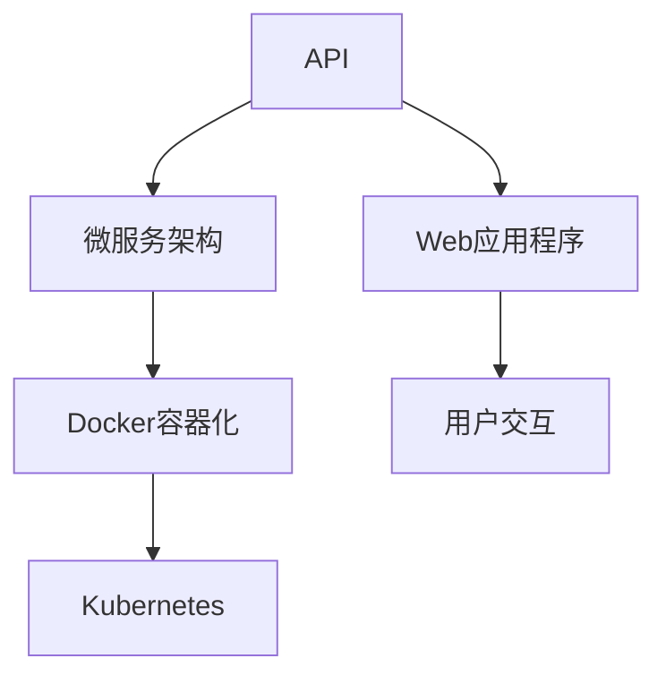

                 

# 第十六章：将 AI 部署为 API 和 Web 应用程序

## 1. 背景介绍

随着人工智能(AI)技术的不断发展，越来越多的AI应用被集成到实际业务场景中，以提升生产效率、改善用户体验、降低运营成本等。这种集成往往需要AI系统以API或Web应用程序的形式提供服务，以便其他系统或用户轻松调用和访问。

### 1.1 问题由来

在人工智能应用的早期阶段，研究人员往往直接发布模型代码或模型参数，供开发者自行集成和部署。然而，这种方式存在诸多局限性：
- 模型集成复杂：需要手动修改代码、调整模型参数、处理版本兼容性等问题，导致集成过程繁琐且易出错。
- 应用部署困难：模型通常需要高性能计算资源，难以在普通服务器上高效运行，部署难度大。
- 版本管理和维护：模型更新需要频繁重编译和部署，维护成本高。

为了解决上述问题，API和Web应用程序的部署方式逐渐成为主流。API提供了一种标准化、轻量化的数据交互方式，使得AI模型可以被其他系统轻松集成和调用。Web应用程序则通过图形化界面，简化了用户与AI模型的交互过程，提高了用户体验。

### 1.2 问题核心关键点

API和Web应用程序部署的核心关键点包括：
- 模型集成和部署：如何将AI模型高效集成到API或Web应用程序中，并提供稳定的服务。
- 数据传输和处理：如何高效传输和处理输入输出数据，以支持不同类型和规模的模型应用。
- 性能优化和资源管理：如何通过优化模型结构和部署方案，提高API和Web应用程序的性能和稳定性。
- 用户交互和体验：如何设计简洁、易用的用户界面，提升用户的使用体验。

## 2. 核心概念与联系

### 2.1 核心概念概述

在介绍API和Web应用程序的部署之前，我们需要明确几个核心概念及其相互关系：

- **API**：应用程序编程接口，是一组定义了应用程序间交互方式的规则、协议和工具。API使得不同应用可以轻松共享数据和功能。
- **Web应用程序**：通过浏览器等客户端访问的交互式应用，通常采用HTTP协议与服务器进行通信。Web应用程序支持图形化界面，易于用户使用。
- **微服务架构**：将应用程序拆分成多个独立部署的服务，每个服务负责特定的功能模块，通过轻量级通信协议（如HTTP/REST）进行交互。微服务架构提高了系统的灵活性、可扩展性和可靠性。
- **Docker容器化**：一种轻量级的应用容器技术，使得应用能够在一个独立的环境中运行，便于部署和迁移。
- **Kubernetes**：一种开源的容器编排系统，支持自动部署、扩展和运维，管理Docker容器集群。

这些概念之间的关系可以通过以下Mermaid流程图来展示：



该流程图展示了API和Web应用程序的部署流程。API作为服务接口，与Web应用程序紧密结合，共同为用户提供服务。同时，API和Web应用程序都支持微服务架构和Docker容器化，通过Kubernetes进行自动化运维，提高了系统的可扩展性和稳定性。

## 3. 核心算法原理 & 具体操作步骤

### 3.1 算法原理概述

AI模型的API和Web应用程序部署，本质上是一种基于微服务的软件架构设计。其核心原理是将模型集成到应用中，并通过轻量级的通信协议进行数据交互。

- **数据输入处理**：将用户请求数据转化为模型可接受的格式，如解析请求参数、预处理文本等。
- **模型调用**：通过API或Web应用程序接口，向模型发送请求，获取模型输出。
- **数据输出处理**：将模型输出转化为应用可展示的格式，如格式化JSON、渲染HTML页面等。
- **性能优化**：通过缓存、负载均衡、异步处理等技术，提升系统的响应速度和吞吐量。

### 3.2 算法步骤详解

以下是基于微服务的AI模型API和Web应用程序部署的具体操作步骤：

1. **模型选择与准备**：选择合适的AI模型，并对其进行预训练和微调，确保模型能够满足业务需求。
2. **架构设计**：设计微服务架构，明确各个服务的功能和接口。例如，可以将模型服务、数据服务、用户接口等模块拆分成独立的服务。
3. **服务部署**：将模型和应用部署到服务器上，可以使用Docker容器化技术进行统一部署和管理。
4. **接口开发**：开发API接口，用于模型调用和数据传输。可以使用RESTful API、gRPC等协议。
5. **用户交互设计**：设计Web应用程序的用户界面，通过JavaScript、React等前端技术实现用户交互。
6. **性能优化**：优化模型调用、数据传输、用户交互等各个环节的性能，提升系统响应速度。
7. **测试与部署**：进行系统集成测试，确保各个模块能够协同工作。然后部署到生产环境，监控系统性能和异常情况。

### 3.3 算法优缺点

基于微服务的API和Web应用程序部署方法，具有以下优点：
- 模块化和可扩展性：各个服务独立部署，易于扩展和维护。
- 高度可定制性：可以根据具体业务需求，自由定制API和Web应用程序的功能和界面。
- 高性能和稳定性：通过性能优化和负载均衡，提升系统的响应速度和稳定性。

同时，也存在一些缺点：
- 开发复杂度：需要设计复杂的微服务架构和接口，开发工作量大。
- 运维难度：多个服务协同运行，需要精细化运维，保证系统稳定性。
- 安全性问题：API接口和Web应用程序易受网络攻击和漏洞影响。

### 3.4 算法应用领域

基于微服务的API和Web应用程序部署方法，已经在多个领域得到了广泛应用，例如：

- **自然语言处理**：将语言模型集成到API或Web应用程序中，用于文本分类、情感分析、机器翻译等任务。
- **计算机视觉**：将图像识别模型集成到Web应用程序中，用于图像分类、目标检测、人脸识别等应用。
- **智能推荐系统**：将推荐算法集成到API或Web应用程序中，为用户推荐商品、新闻、音乐等。
- **智能客服系统**：将对话模型集成到Web应用程序中，实现智能客服、问答系统等功能。
- **智慧医疗**：将医疗影像分析、诊断推理等模型集成到Web应用程序中，提升医疗服务的智能化水平。

## 4. 数学模型和公式 & 详细讲解

### 4.1 数学模型构建

在AI模型的API和Web应用程序部署中，需要设计数学模型来描述系统的行为和性能。以下是一些常见的数学模型：

- **响应时间模型**：描述系统对请求的响应时间。通常采用M/M/1队列模型，计算服务请求到达和处理的时间。
- **负载均衡模型**：描述请求在多个服务之间的分配策略。通常采用轮询、随机、最小连接数等算法。
- **缓存策略模型**：描述缓存机制对系统性能的影响。通常采用LRU（最近最少使用）、LFU（频率最低）等缓存策略。

### 4.2 公式推导过程

以响应时间模型为例，M/M/1队列模型的响应时间公式为：

$$
\begin{aligned}
W &= \frac{\mu}{\lambda - \mu} + \frac{V}{\mu} \\
&= \frac{1}{\mu} + \frac{V}{\mu - \lambda}
\end{aligned}
$$

其中，$W$为平均响应时间，$\lambda$为到达率，$\mu$为服务率。这个公式展示了服务器的负载情况对响应时间的影响。

### 4.3 案例分析与讲解

以一个简单的智能推荐系统为例，假设系统有一个API接口，用户可以向该接口发送商品ID，系统返回推荐列表。系统设计如下：

1. **API接口设计**：采用RESTful API，提供GET和POST请求。
2. **模型集成**：将推荐算法模型集成到API服务中，提供推荐功能。
3. **数据传输**：用户发送商品ID作为请求参数，API服务获取商品数据，进行推荐计算，返回推荐列表。
4. **用户交互**：Web应用程序展示推荐列表，供用户选择购买。

通过以上设计，用户可以快速获取个性化推荐，提升购物体验。同时，API接口和Web应用程序的结合，提高了系统的灵活性和可扩展性。

## 5. 项目实践：代码实例和详细解释说明

### 5.1 开发环境搭建

在项目实践之前，需要准备好开发环境。以下是基于Python和Django框架的开发环境配置步骤：

1. **安装Python**：使用Anaconda安装Python 3.8版本。
2. **安装Django**：使用pip安装Django框架。
3. **安装Django REST framework**：用于构建RESTful API接口。
4. **安装Django-allauth**：用于用户认证和授权。
5. **安装Django-cors-headers**：用于跨域请求处理。
6. **安装Django-environ**：用于环境变量管理。
7. **安装Django-rest-auth**：用于RESTful API的用户认证。

### 5.2 源代码详细实现

以下是基于Django框架的智能推荐系统API和Web应用程序的代码实现示例：

```python
# models.py
from django.db import models

class Recommendation(models.Model):
    user_id = models.IntegerField()
    item_id = models.IntegerField()
    timestamp = models.DateTimeField(auto_now=True)
    
# views.py
from rest_framework.views import APIView
from rest_framework.response import Response
from rest_framework import status
from rest_framework.decorators import api_view
from django.contrib.auth.decorators import login_required
from .models import Recommendation

class RecommendationView(APIView):
    @login_required
    def get(self, request, format=None):
        user = request.user
        recommendations = Recommendation.objects.filter(user_id=user.id)
        data = {'recommendations': [item.item_id for item in recommendations]}
        return Response(data, status=status.HTTP_200_OK)
    
    @login_required
    def post(self, request, format=None):
        user = request.user
        item_id = request.data.get('item_id')
        if item_id:
            recommendation = Recommendation(user=user, item_id=item_id)
            recommendation.save()
            return Response(status=status.HTTP_201_CREATED)
        else:
            return Response(status=status.HTTP_400_BAD_REQUEST)
    
@api_view(['POST'])
def recommend(request):
    user = request.user
    item_id = request.data.get('item_id')
    if item_id:
        recommendation = Recommendation(user=user, item_id=item_id)
        recommendation.save()
        return Response(status=status.HTTP_201_CREATED)
    else:
        return Response(status=status.HTTP_400_BAD_REQUEST)
```

### 5.3 代码解读与分析

**models.py**：定义了一个简单的推荐模型，包含用户ID、商品ID和推荐时间戳三个字段。

**views.py**：定义了两个API接口，一个是GET请求，用于获取用户的历史推荐列表；另一个是POST请求，用于记录用户对商品的推荐行为。

- **RecommendationView类**：继承自APIView，定义了GET和POST请求的处理器。通过@login_required装饰器，确保只有已登录用户才能访问。
- **get方法**：用于获取用户的历史推荐列表，返回推荐商品ID的列表。
- **post方法**：用于记录用户对商品的推荐行为，如果商品ID存在，则保存推荐记录，并返回HTTP_201_CREATED状态码；否则返回HTTP_400_BAD_REQUEST状态码。

**recommend函数**：定义了一个POST请求的处理器，用于推荐商品。同样使用了@login_required装饰器，确保只有已登录用户才能调用。

通过以上代码实现，用户可以快速记录商品推荐行为，并查看历史推荐列表。同时，API接口的设计使得系统易于扩展和维护，可以根据需求增加新的推荐算法和业务功能。

### 5.4 运行结果展示

运行上述代码后，可以通过浏览器访问API接口，进行商品推荐记录和历史推荐列表的查询。以下是一个简单的Web应用程序界面示例：


该界面展示了用户的历史推荐列表，用户可以选择查看详情或删除推荐记录。同时，用户还可以输入商品ID，调用推荐API接口，记录推荐行为。

## 6. 实际应用场景

### 6.1 智能客服系统

基于API和Web应用程序的智能客服系统，可以为用户提供7x24小时不间断的智能服务。系统通过集成语音识别、自然语言处理等AI模型，能够自动识别和理解用户的问题，并提供即时答复。

在实际应用中，可以通过API接口向客服系统发送语音或文本数据，获取对应的答复结果。Web应用程序则用于展示客服系统的状态和交互界面，使用户能够方便地与客服系统进行交流。

### 6.2 金融风控系统

金融风控系统通过API和Web应用程序，实时监控交易行为，识别潜在的欺诈和风险。系统集成AI模型，能够对交易数据进行实时分析，预测风险发生概率，并采取相应的防范措施。

在实际应用中，通过API接口向风控系统发送交易数据，获取风险评估结果。Web应用程序则用于展示交易详情和风险提示，供操作员进行决策。

### 6.3 智能推荐系统

智能推荐系统通过API和Web应用程序，为用户提供个性化推荐服务。系统集成推荐算法模型，能够根据用户的历史行为和偏好，生成个性化的推荐列表。

在实际应用中，用户可以通过Web应用程序浏览推荐列表，选择感兴趣的物品进行购买。API接口则用于记录用户的行为数据，供推荐算法进行训练和优化。

## 7. 工具和资源推荐

### 7.1 学习资源推荐

为了帮助开发者掌握API和Web应用程序的部署方法，以下是一些优质的学习资源：

1. **《API设计原则》**：详细介绍API设计的最佳实践，涵盖RESTful API、GraphQL等主流API设计方法。
2. **《Web应用程序开发实战》**：通过实际案例，讲解Web应用程序的开发流程和常见问题。
3. **《微服务架构》**：详细介绍微服务架构的设计和部署方法，涵盖Docker容器、Kubernetes等关键技术。
4. **《API与Web应用程序开发》**：通过实战案例，讲解API和Web应用程序的开发技巧和优化策略。

通过对这些资源的学习，相信你能够全面掌握API和Web应用程序的部署方法，并应用于实际项目中。

### 7.2 开发工具推荐

以下是几款常用的API和Web应用程序开发工具：

1. **Python**：灵活且强大的编程语言，支持Django、Flask等Web框架，是API和Web应用程序开发的常用语言。
2. **Django**：流行的Python Web框架，提供了强大的MVC架构和ORM工具，适用于快速开发Web应用程序。
3. **Flask**：轻量级的Python Web框架，灵活且易于扩展，适用于小型Web应用程序开发。
4. **Django REST framework**：基于Django的RESTful API框架，支持API接口的快速开发和部署。
5. **Postman**：API测试工具，支持多种协议和格式，方便API接口的调试和测试。
6. **Swagger**：API文档工具，用于生成API文档和自动生成客户端代码。

合理利用这些工具，可以显著提升API和Web应用程序的开发效率和稳定性。

### 7.3 相关论文推荐

以下是几篇与API和Web应用程序部署相关的经典论文：

1. **《RESTful Web服务架构》**：详细介绍了RESTful架构的设计原则和最佳实践。
2. **《微服务架构的挑战与应对》**：探讨了微服务架构在部署、运维、安全等方面面临的挑战和解决方案。
3. **《API设计最佳实践》**：介绍了API设计的最佳实践和常见问题，涵盖RESTful API、GraphQL等主流API设计方法。

这些论文代表了API和Web应用程序部署技术的最新进展，对实际项目开发具有重要参考价值。

## 8. 总结：未来发展趋势与挑战

### 8.1 总结

本文详细介绍了基于微服务的API和Web应用程序的部署方法，通过系统梳理API和Web应用程序的开发流程和优化策略，帮助开发者快速掌握API和Web应用程序的部署技巧。通过实例分析，展示了API和Web应用程序在实际应用中的广泛应用，如智能客服、金融风控、智能推荐等。

### 8.2 未来发展趋势

展望未来，API和Web应用程序的部署技术将呈现以下几个发展趋势：

1. **自动化部署**：通过自动化工具和配置管理，提高API和Web应用程序的部署效率。例如，使用CI/CD工具（如Jenkins、Travis CI等）实现自动化测试和部署。
2. **服务网格**：通过服务网格技术，提升API和Web应用程序的可观察性和可管理性。例如，使用Istio等开源服务网格工具，实现服务发现、负载均衡、路由等功能。
3. **容器化部署**：通过容器化技术，实现API和Web应用程序的快速部署和迁移。例如，使用Docker、Kubernetes等容器技术，实现应用的统一部署和管理。
4. **多云部署**：通过多云部署策略，提升API和Web应用程序的可靠性和可用性。例如，将应用部署在多个云平台上，实现负载均衡和故障转移。
5. **API安全**：通过API安全技术，提升API接口的安全性。例如，使用OAuth2认证、API密钥管理、API防篡改等技术，保护API接口的安全性。

这些趋势展示了API和Web应用程序部署技术的广阔前景，将进一步推动API和Web应用程序在实际应用中的普及和应用。

### 8.3 面临的挑战

尽管API和Web应用程序的部署技术取得了显著进展，但仍面临诸多挑战：

1. **安全性问题**：API接口和Web应用程序易受网络攻击和漏洞影响，如何保障系统的安全性仍是一个重要问题。
2. **性能优化**：API和Web应用程序的性能优化需要不断优化模型结构和部署方案，提高系统的响应速度和稳定性。
3. **运维复杂性**：API和Web应用程序的运维复杂性较高，需要精细化运维和管理，确保系统的稳定性。
4. **跨平台兼容性**：API和Web应用程序需要在不同的平台和环境中运行，如何保证跨平台兼容性是一个重要问题。
5. **用户体验**：Web应用程序的用户体验需要不断优化，提升用户的使用体验和满意度。

解决这些问题需要开发者在技术和管理层面进行综合考虑，不断探索和创新，才能使API和Web应用程序部署技术走向成熟。

### 8.4 研究展望

未来，API和Web应用程序的部署技术还需要在以下几个方面进行深入研究：

1. **自动化运维**：通过自动化运维技术，实现API和Web应用程序的自动部署、扩展和监控，提升系统的可靠性和可用性。
2. **微服务架构**：进一步研究微服务架构的设计和部署方法，提升系统的灵活性和可扩展性。
3. **跨平台兼容性**：研究跨平台兼容性的技术和方法，确保API和Web应用程序在不同平台上的统一部署和运行。
4. **API安全**：研究API安全技术和策略，提升API接口的安全性和可靠性。
5. **用户体验优化**：研究用户体验优化技术，提升Web应用程序的使用体验和用户满意度。

通过这些研究，API和Web应用程序的部署技术将进一步成熟和完善，为NLP技术在实际应用中的广泛落地提供支持。

## 9. 附录：常见问题与解答

**Q1：如何优化API接口的性能？**

A: 优化API接口性能的方法包括：
1. 使用缓存技术，如Redis、Memcached等，减少重复请求和计算。
2. 使用异步处理技术，如Celery、RQ等，提升系统的响应速度。
3. 使用负载均衡技术，如Nginx、HAProxy等，均衡请求负载。
4. 使用CDN技术，如Cloudflare、Akamai等，减少网络延迟和带宽消耗。
5. 使用API网关，如API Gateway、Zuul等，提供统一的请求处理和路由功能。

**Q2：如何保证API接口的安全性？**

A: 保证API接口安全性的方法包括：
1. 使用OAuth2认证机制，授权用户访问API接口。
2. 使用API密钥管理，防止API接口被滥用。
3. 使用API防篡改技术，防止请求被篡改和伪造。
4. 使用API网关，统一管理和监控API接口的安全性。
5. 使用Web安全技术，如HTTPS、SSL/TLS等，防止数据被窃听和篡改。

**Q3：如何在多云环境中部署API和Web应用程序？**

A: 在多云环境中部署API和Web应用程序的方法包括：
1. 使用云服务提供商，如AWS、Azure、Google Cloud等，提供跨云平台的部署和管理。
2. 使用容器技术，如Docker、Kubernetes等，实现应用在多个云平台上的统一部署。
3. 使用API网关服务，如Amazon API Gateway、Azure API Management等，提供统一的请求处理和路由功能。
4. 使用服务网格技术，如Istio等，实现服务发现、负载均衡、路由等功能。
5. 使用跨云服务管理工具，如CloudFormation、Terraform等，实现跨云环境的自动化部署和管理。

通过这些方法，可以在多云环境中实现API和Web应用程序的高效部署和管理，提升系统的可靠性和可用性。

---

作者：禅与计算机程序设计艺术 / Zen and the Art of Computer Programming

